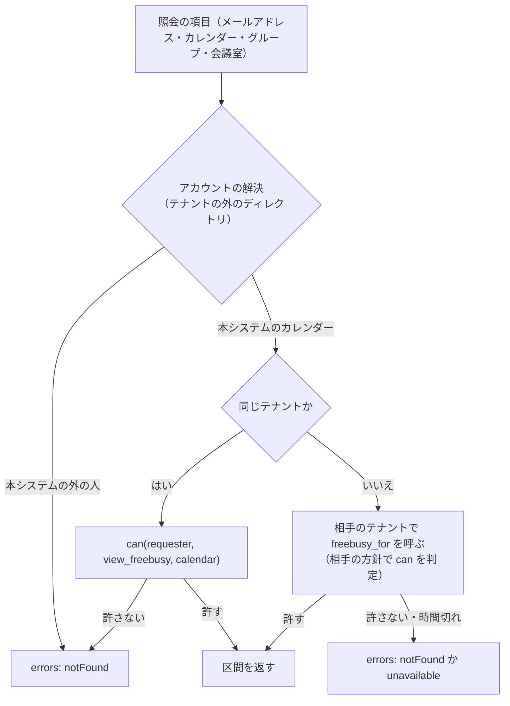

# Free/Busy and Scheduling: Google Calendar

空き時間の照会（人・グループ・会議室）、テナントをまたぐ照会の方針、空き時間のキャッシュ、複数の人と会議室の候補の計算、勤務の時間の考慮を決める。

前提となる決定は、繰り返しの保存と展開（[ADR-0003](../decisions/0003-recurrence-storage-and-expansion.md)、[ADR-0010](../decisions/0010-occurrence-index-maintenance.md)）、時刻の表し方（[ADR-0002](../decisions/0002-time-representation.md)）、テナントと権限（[ADR-0004](../decisions/0004-tenancy-and-rls.md)）、変更のログ（[ADR-0005](../decisions/0005-change-log-and-sync-tokens.md)）、写し（[ADR-0006](../decisions/0006-organizer-and-attendee-copies.md)）、標準の範囲（[ADR-0007](../decisions/0007-interop-standards-scope.md)）。この文書で決めたことは次の ADR にある。

| ADR | 決定 |
| --- | --- |
| [0017](../decisions/0017-freebusy-source-and-cache.md) | 空き時間は、人のカレンダーは展開の索引から、会議室は会議室の予約の行から求める。キャッシュは Valkey に、カレンダーと UTC の週ごとの「予定ありの区間の一覧」を、計算した時の `change_seq`（会議室は `booking_seq`）と一緒に置き、読む時に番号を比べて確かめる。テナントをまたぐ照会は、相手のテナントの関数 `freebusy_for` を区間だけ返す形で呼ぶ |
| [0018](../decisions/0018-find-a-time-algorithm.md) | 候補の計算は、区間の一覧を 5 分刻みのビットの列と累積の和に直し、刻み（既定 30 分）ごとの開始を、必須の人の重なり、勤務の時間の外、仮の予定、任意の人の空き、会議室の合い方、早さの辞書の順で並べる。必須の人がすべて空いた候補を 10 件と、1 人だけ重なる候補を 3 件まで返す |

## 1. 目的と範囲

- 扱う：
  - 空き時間の照会の API の形と上限、予定ありの判定、区間のまとめ方
  - だれの空き時間を見られるか（`can()` の `view_freebusy` の入力）と、テナントをまたぐ照会
  - 空き時間のキャッシュと確かめ方
  - 複数の人と会議室の候補の計算（find a time）、勤務の時間、祝日
- 扱わない：
  - ACL のロールと組織の共有の方針の決定表（[sharing-and-acl.md](sharing-and-acl.md)）
  - 会議室のディレクトリ、条件での会議室の検索、予約の行（[rooms-and-resources.md](rooms-and-resources.md)）
  - 予約ページの枠の計算（booking-pages.md。この文書の 5 節の部品を使う）
  - 他社のカレンダー（Exchange など）との空き時間の相互の照会（MVP の後。[intent.md](../intent.md)）
  - 画面の候補の表示（clients.md）

## 2. 要件

| 要件 | 目標 | NFR |
| --- | --- | --- |
| 照会 | 1 回の照会（カレンダー 50）p95 300 ms | NFR-004 |
| 候補の計算 | 50 人＋会議室 20、2 週間、30 分刻み p95 1 秒 | NFR-004、K4 |
| 漏れ | 空き時間の結果に、タイトル・場所・説明・参加者を一切含めない。見てはいけないカレンダーの存在を示さない | NFR-008、[ADR-0004](../decisions/0004-tenancy-and-rls.md) |
| 一致 | 同じ予定の同じ回が、画面と空き時間で同じ区間になる | NFR-009 |
| 鮮度 | 予定の確定から、空き時間の結果への反映まで、同じテナントは即時（キャッシュの確かめで）、他のテナントの参加者の写しは伝播の後 | NFR-002 |

## 3. 本家の形と標準（確かめたこと）

いずれも 2026-10-04 に確認。

| 項目 | 内容 | 出典 |
| --- | --- | --- |
| 照会の上限 | `calendarExpansionMax` は最大 50、`groupExpansionMax` は最大 100。`timeZone` は既定 UTC | [Freebusy: query](https://developers.google.com/workspace/calendar/api/v3/reference/freebusy/query) |
| エラー | カレンダー・グループごとに `groupTooBig`・`tooManyCalendarsRequested`・`notFound`・`internalError` を返す | 同上 |
| 組織の中の共有の既定 | 管理者が「共有しない」「空き時間だけ（詳細を隠す）」「すべての情報を共有」から選ぶ。「共有しない」では、モバイルのアプリで「時間を探す」が使えない | [Set Google Calendar sharing options](https://knowledge.workspace.google.com/admin/calendar/set-google-calendar-sharing-options) |
| `transparency` | `opaque` は時間を塞ぎ、`transparent` は塞がない | [Events resource](https://developers.google.com/workspace/calendar/api/v3/reference/events) |

- 本家の照会の時間の範囲の上限、未回答の招待を予定ありとするか、候補の並べ方、勤務の時間の扱いの細部は、公式の資料で確かめられなかった（**未検証**）。

標準：

| RFC と節 | 内容 | 本システム |
| --- | --- | --- |
| RFC 5545 の 3.2.9 | `FBTYPE`：`FREE`・`BUSY`・`BUSY-UNAVAILABLE`・`BUSY-TENTATIVE` | 区間の種類にこの 3 つの予定ありを使う |
| RFC 5545 の 3.6.4・3.8.2.6 | VFREEBUSY と FREEBUSY のプロパティ | 書き出しにだけ使う（[ADR-0007](../decisions/0007-interop-standards-scope.md)） |
| RFC 5545 の 3.8.2.7 | `TRANSP` | `transparent` は予定ありにしない |
| RFC 4791 の 7.10 | `free-busy-query` の REPORT | 持たない（[ADR-0007](../decisions/0007-interop-standards-scope.md)） |
| RFC 6638 | 送信箱への `POST` の空き時間の照会 | 持たない（同上） |

## 4. 空き時間の照会

### 4.1 API の形

```text
POST /v1/freeBusy
{ timeMin, timeMax, timeZone?, items: [{ id: calendarId | email | groupId | roomId }] }
→ { calendars: { <id>: { busy: [{ start, end, type }], errors?: [{ reason }] } },
    groups: { <id>: { calendars: [<id>...], errors?: [...] } },
    tzdataVersion }
```

- `type` は `busy`・`busy_tentative`・`busy_unavailable`（RFC 5545 の `FBTYPE`）。
- 公開 API の形と名前の細部は api-and-push.md で決める。ここは意味を決める。

| 上限 | 値 | 本家との違い |
| --- | --- | --- |
| 1 回の項目（展開の後） | 100 | 本家は 50。NFR-004 の 50 人＋会議室 20 を 1 回で照会するため |
| 1 グループの展開 | 100 | 本家と同じ |
| 時間の範囲 | 62 日 | 本家の上限は**未検証** |
| 1 利用者の照会の頻度 | 1 分に 60 回 | 列挙の対策 |

超えたら、項目ごとに `tooManyCalendarsRequested`・`groupTooBig` を返す。

### 4.2 予定ありの判定

DT-FB-001。展開の索引の行（[events-and-recurrence.md](events-and-recurrence.md) の 9.1 節）から決める。上の行から順に当てる。

| # | 条件 | → 区間 |
| --- | --- | --- |
| 1 | `status = cancelled`、または写しが `cancelled`・`hidden` | なし |
| 2 | `transparency = transparent` | なし |
| 3 | 参加者の写しで、自分の出欠が `declined` | なし |
| 4 | `event_type = out_of_office` | `busy_unavailable` |
| 5 | 予定の `status = tentative`、または自分の出欠が `tentative`・`needs_action` | `busy_tentative` |
| 6 | それ以外 | `busy` |

- 未回答（`needs_action`）を `busy_tentative` にするのは本システムの決定（本家の振る舞いは**未検証**）。招待が届いた時点で時間を仮に塞ぎ、候補の計算で「仮」として軽く扱う。
- 保留の招待（[invitations-and-itip.md](invitations-and-itip.md) の 4.3 節）は写しでないので、空き時間に出ない。
- 終日の予定は、持ち主のカレンダーのタイムゾーンでの日の境の区間にする（[time-zones-and-holidays.md](time-zones-and-holidays.md) の 5.2 節）。
- 会議室は、予約の行（[rooms-and-resources.md](rooms-and-resources.md)）から求める：`accepted` は `busy`、`pending`（承認の待ち）は `busy_tentative`、`needs_review` は `busy`。

### 4.3 区間のまとめ方

1. 1 つのカレンダーの区間を開始の順に並べる。
2. 重なる・接する区間を 1 つにまとめる。種類が違えば、`busy_unavailable` ＞ `busy` ＞ `busy_tentative` の強いほうを重なりの部分に当て、区間を分ける。
3. 問い合わせの範囲で切る。
4. 時刻は分の単位に丸めず、予定の区間のまま返す。

**例**：10:00〜11:00 `busy`、10:30〜12:00 `busy_tentative`、12:00〜12:30 `busy` → `[10:00, 11:00) busy`、`[11:00, 12:00) busy_tentative`、`[12:00, 12:30) busy`。

### 4.4 だれの空き時間を見られるか



- `view_freebusy` の判定は `can()` だけで行う（[sharing-and-acl.md](sharing-and-acl.md)）。入力は、ACL（`free_busy_reader` 以上）、組織の中の共有の既定（組織の全員への暗黙の ACL）、組織の外への共有の方針、会議室の既定（組織の全員が空き時間を見られる）。
- 見てはいけないカレンダーと、存在しないカレンダーには、同じ `notFound` を返す。存在を示さない（[ADR-0004](../decisions/0004-tenancy-and-rls.md) の決定表の行 6）。
- 本システムの外の人（外部のメールアドレス）の空き時間は照会しない。他社のカレンダーとの相互の照会は MVP の後。

### 4.5 テナントをまたぐ照会

ADR-0017。

- 照会の項目を、カレンダーのテナントごとにまとめる。
- 相手のテナントごとに、専用の DB のロール（`freebusy`）で、相手のテナントのコンテキストの関数 `freebusy_for(requester, calendar_ids[], window)` を呼ぶ（[ADR-0004](../decisions/0004-tenancy-and-rls.md)）。関数は、相手のテナントの方針で `can()` を判定し、許したカレンダーの区間（開始・終了・種類）だけを返す。予定の ID も返さない。
- テナントごとの呼び出しは並行に行い、1 テナント 300 ms で切る。切れたテナントのカレンダーは `unavailable` にする。
- S2 でテナントのクラスタが分かれたら、関数の呼び出しを内部の RPC に置き換える（infrastructure.md）。返す形は変えない。

### 4.6 範囲の外

- 展開の索引の範囲（過去 31 日から未来 548 日）の外は、その場で `expand()` する（[ADR-0003](../decisions/0003-recurrence-storage-and-expansion.md)）。キャッシュしない。
- 会議室は範囲の外の予約を持たない（[rooms-and-resources.md](rooms-and-resources.md)）。範囲の外の会議室の照会は、空きとして返し、`errors: outsideBookingHorizon` を付ける。

## 5. キャッシュ

ADR-0017。

### 5.1 形

| 項目 | 内容 |
| --- | --- |
| 鍵 | `fb:{tenant_id}:{calendar_id}:{iso_week_utc}`（会議室は `fbr:{tenant_id}:{room_id}:{iso_week_utc}`） |
| 値 | `{seq, tzv, intervals}`。`seq` は計算した時のカレンダーの `change_seq`（会議室は `booking_seq`）、`tzv` は `tzdata_version`、`intervals` は週の始まりからの分の差分の列と種類（1 区間 3〜5 バイト） |
| 期限 | 7 日 |
| 大きさ | 週 40 件の予定で 200 バイト程度。S1 の利用者 60 万 × 3 週（今週・来週・再来週がよく使われる）で約 400 MB |

- 予定ありは、カレンダーの持ち主のデータ（主催者の写し・参加者の写しの自分の出欠）だけで決まる。カレンダーの `change_seq` が変われば、そのカレンダーの空き時間が変わりうる。
- 会議室は、予約の行が主催者の書き込みのトランザクションで書かれ、会議室のカレンダーの `change_seq` は写しが届くまで変わらない。そこで、会議室に `booking_seq` を持ち、予約の行と同じトランザクションで上げる（[rooms-and-resources.md](rooms-and-resources.md)）。

### 5.2 読み方

1. 照会のカレンダーの今の `change_seq`（会議室は `booking_seq`）を、テナントごとに 1 回の問い合わせで読む（主キーでの読み出し）。
2. Valkey から週ごとの鍵をまとめて読む（`MGET`）。
3. `seq` と `tzv` が今と同じなら使う。違うか、ないなら、展開の索引（会議室は予約の行）からその週を読み直して書く。
4. 週をつなぎ、範囲で切る。

- 書き込みの側は、キャッシュを消さない。番号の比べで古さがわかるので、消し忘れで古い空き時間を返すことがない。
- Valkey が落ちても、毎回 3 の読み直しになるだけで、正しさは変わらない（[architecture/README.md](README.md) の 1.2 節の「Valkey は失われてもよい」）。

### 5.3 見積もり

- 50 人＋会議室 20 の 2 週間は、鍵 140 個（3 週にまたがれば 210 個）。暖かいキャッシュで 5 ms 以下。
- 冷たいとき：展開の索引の `(tenant_id, calendar_id, start_utc)` の範囲の読み出し 70 回。テナントごとにまとめて 1 回の問い合わせにし、p95 200 ms 以下を見込む。`freebusy-poc` で測る。

## 6. 候補の計算（find a time）

ADR-0018。

### 6.1 入力と上限

| 入力 | 上限・既定 |
| --- | --- |
| 必須の人 | 展開の後 50 人まで |
| 任意の人 | 展開の後 30 人まで（必須と合わせて 70 人） |
| 会議室 | 指定 20 室まで、または条件（建物・定員・設備）。条件は [rooms-and-resources.md](rooms-and-resources.md) の検索で 20 室の候補に絞る |
| 長さ | 5 分〜8 時間 |
| 範囲 | 既定 14 日、最大 31 日 |
| 刻み | 15 分か 30 分（既定 30 分）。開始は依頼した人のタイムゾーンの刻みに揃える |
| 勤務の時間を考えるか | 既定で考える |
| 繰り返し | 毎週の繰り返しを指定したら、はじめの 4 回で重なりを数える |

### 6.2 手順


1. **解決**：グループを展開し、重複を除く。空き時間を見られない人は「空き時間がわからない」に分け、数えない。
2. **取得**：5 節で、全員と会議室の区間を取る。
3. **ビットの列**：範囲を 5 分の刻みに分け（14 日で 4,032 個）、人ごとに 3 つのビットの列を作る。
   - `hard`：`busy`・`busy_unavailable` の区間に触れる刻み。
   - `soft`：`busy_tentative` の区間に触れる刻み。
   - `off`：勤務の時間の外の刻み（6.3 節）。
4. **累積の和**：各列の累積の和を作り、任意の `[s, s+d)` に 1 が含まれるかを O(1) で答える。
5. **数える**：刻みごとの開始 s について、次を求める。
   - `req_hard`：`hard` に当たる必須の人の数
   - `req_off`：`off` に当たる必須の人の数
   - `req_soft`：`soft` に当たる必須の人の数
   - `opt_free`：どれにも当たらない任意の人の数
   - `rooms`：`hard`・`soft` のどちらにも当たらない会議室の一覧
6. **絞る**：会議室が要るなら、`rooms` が空の開始を除く。今より前の開始を除く。
7. **並べる**：辞書の順で `(req_hard 昇順, req_off 昇順, req_soft 昇順, opt_free 降順, 会議室の合い方, s 昇順)`。
8. **返す**：`req_hard = 0` の上位 10 件。10 件に満たなければ、`req_hard = 1` の上位 3 件を「ほぼ合う」として、重なる人の名前と一緒に返す。

- 会議室の合い方：依頼した人の既定の建物と同じ、定員が出席の人数以上で最も小さい、階が近い、の順で 1 室を選ぶ（[rooms-and-resources.md](rooms-and-resources.md) の 7 節）。候補ごとに独立に選ぶ（同じ会議室を複数の候補に出してよい）。
- 計算の量：開始の数（14 日 × 48 = 672）× 人と会議室（100）で、約 7 万回の O(1) の比べ。10 ms 以下。

### 6.3 勤務の時間と祝日

- 利用者は、曜日ごとに 1 つの勤務の時間の範囲と、そのタイムゾーンを持つ（既定は月〜金の 09:00〜18:00、利用者のタイムゾーン）。曜日ごとに複数の範囲や、勤務の場所は MVP の後（[intent.md](../intent.md)）。
- 範囲の各日の勤務の時間の始まりと終わりを、その人のタイムゾーンで `resolve` して UTC の区間にし、`off` の列を作る（[time-zones-and-holidays.md](time-zones-and-holidays.md)）。
- 「祝日を休みにする」（日本の言語の利用者は既定で有効）なら、日本の祝日のカレンダーの日を、その人のタイムゾーンで終日 `off` にする。
- 勤務の時間は、候補の計算にだけ使い、空き時間の照会の結果には出さない（勤務の時間の外を予定ありにしない）。

### 6.4 例

必須 3 人（A：東京、B：東京、C：ロンドン）、会議室の条件（東京本社、定員 3 以上）、60 分、2026-11-02（月）〜11-06（金）、30 分刻み、依頼した人は東京。

- C の勤務の時間はロンドンの 09:00〜18:00 で、11 月は GMT なので東京の 18:00〜翌 03:00。A・B の勤務の時間（東京の 09:00〜18:00）と重ならない。
- すべての候補で `req_off ≥ 1` になる。並べると、`req_off = 1` の候補（たとえば東京の 17:00〜18:00 は C の勤務の時間の外、東京の 18:00〜19:00 は A・B の勤務の時間の外）が上に来る。
- `req_off` が同じなら、`req_soft`、任意の人、会議室の合い方、早さの順になる。画面は「全員の勤務の時間の中の候補はありません」を示し、外れる人を候補ごとに示す（clients.md）。

## 7. 障害のときの振る舞い

| 事象 | 起きること | 備え |
| --- | --- | --- |
| Valkey が落ちた | 毎回、索引から読み直す | 冷たいときの速さを `freebusy-poc` で測り、NFR-004 の p95 が 2 倍までに収まるようにする。収まらなければ、範囲を 7 日に縮めて返す（応答に印） |
| 相手のテナントが遅い | 一部のカレンダーが返らない | テナントごとに 300 ms で切り、`unavailable` を返す。候補の計算では「空き時間がわからない」に分ける |
| 展開の索引の端のジョブが遅れた | 範囲の端の回が索引にない | `indexed_through` より先は、その場の展開に切り替える（[ADR-0010](../decisions/0010-occurrence-index-maintenance.md)） |
| tzdb の計算し直しの途中 | 影響するゾーンの予定の区間が古い版 | `tzv` が今の版と違うキャッシュは使わない。索引の行が直るまでは古い版の区間を返す（[time-zones-and-holidays.md](time-zones-and-holidays.md) の 6.4 節） |
| 列挙の試み（多くのアドレスで照会） | だれが本システムを使っているかの推測 | `notFound` を一律に返し、1 分 60 回の上限。超えたら 429 |

## 8. セキュリティ

- 空き時間の結果は区間と種類だけで、予定の ID・タイトル・場所・参加者を含めない。`free_busy_reader` の性質ベーステストで確かめる（漏れの経路の表の「公開 API（空き時間）」の行。[quality.md](../quality.md) の 2.2.1 節 D）。
- `transparent` の予定は区間に出さない（[ADR-0004](../decisions/0004-tenancy-and-rls.md) の決定表の行 5）。
- 見てはいけないカレンダーと存在しないカレンダーを、エラーの種類で区別させない。応答の時間の差から推測できるかは、E6 の試験で測る（テナントごとに 1 回の問い合わせで読むので、差は小さい見込み）。
- キャッシュの値は区間だけで、Valkey に予定の中身を置かない。
- 候補の計算の「ほぼ合う」の重なる人は、依頼した人が入力した人（名前を知っている人）だけを示す。

## 9. テスト

決定表：

- **DT-FB-001（予定ありの判定）**：4.2 節の 6 行と、会議室の 3 状態。
- **DT-FB-002（見られるか）**：4.4 節の流れの分かれ道 × 組織の中・外 × ACL の有無 × 会議室。[sharing-and-acl.md](sharing-and-acl.md) の決定表と同じ表から読む。

性質ベーステスト：

- **PROP-FB-001（中身を返さない）**：任意の予定・ACL・方針で、空き時間の結果に予定の ID・タイトル・場所・説明・参加者が現れない。
- **PROP-FB-002（区間の一致）**：任意の予定と書き込みの列で、空き時間の区間の和集合が、DT-FB-001 で予定ありになる回の区間の和集合に等しい（その場の `expand` と比べる）。
- **PROP-FB-003（キャッシュの正しさ）**：任意の書き込みと照会の交互の列で、キャッシュを使った結果が、キャッシュを使わない結果に等しい。
- **PROP-FB-004（存在を示さない）**：存在しないカレンダーと見てはいけないカレンダーへの応答が同じ形である。
- **PROP-FB-005（候補の正しさ）**：候補の計算の `req_hard = 0` の候補は、必須の人のだれの `busy` とも重ならない。返さなかった開始で、返した最後の候補より辞書の順で前に来るものがない。

負荷試験（E6・E12）：50 人＋会議室 20、2 週間の候補の計算を、暖かい・冷たいキャッシュで（NFR-004）。

## 10. Story の候補

| Epic | Story | 中身 |
| --- | --- | --- |
| E6 | `freebusy-poc` | 5.3 節の見積もりの計測、区間の一覧とビットの列の比べ |
| E6 | `freebusy-query` | 4 節（DT-FB-001・002、PROP-FB-001・002・004） |
| E6 | `freebusy-cross-tenant` | 4.5 節の `freebusy_for`（ADR-0017） |
| E6 | `freebusy-cache` | 5 節（PROP-FB-003） |
| E6 | `find-a-time` | 6 節（ADR-0018。PROP-FB-005） |
| E6 | `working-hours` | 6.3 節の勤務の時間の設定と祝日 |

## 11. 未解決の問い

### 決定

2026-10-04 の既定案。E6 の PoC で覆りうる。

- **空き時間のキャッシュの形**：区間の一覧を週ごとに、番号で確かめる。計算の中ではビットの列（ADR-0017、ADR-0018。[architecture/README.md](README.md) の 6 節の持ち越しを閉じる）。
- **未回答の招待**：`busy_tentative`。
- **照会の上限**：1 回 100 項目（本家の 50 より大きい）。
- **勤務の時間**：曜日ごとに 1 つの範囲。祝日を休みにできる。
- **他社のカレンダー**：照会しない。

### 持ち越し

| 問い | いつ・どう決めるか |
| --- | --- |
| 冷たいキャッシュでの候補の計算の速さ | E6 の前の `freebusy-poc` |
| 組織の外の人の空き時間の照会を、組織の方針でどこまで許すか | [sharing-and-acl.md](sharing-and-acl.md) の方針の既定。E4 の試用の声 |
| 応答の時間の差での存在の推測 | E6 の試験で計測 |
| 本家の照会の範囲の上限、未回答の扱い、候補の並べ方 | 公式の資料で確かめられなかった（**未検証**のまま） |

## 12. quality.md・runbooks・data-model への項目

### quality.md

- DT-FB-001・002、PROP-FB-001〜005 を E6 のリリースの基準にする。漏れの経路の表の「公開 API（空き時間）」の行に PROP-FB-001・004 を結ぶ。
- 本番：空き時間の照会と候補の計算の p95、キャッシュの当たりの率、`unavailable` の率。

### runbooks

- `freebusy-slow.md`：照会が遅いときの確かめ方（キャッシュの当たり、テナントごとの時間、索引の読み出し）と、範囲を縮める退避。

### data-model（索引への追加の提案）

| 表・鍵 | 中身 | 節 |
| --- | --- | --- |
| `occurrences` の列（[events-and-recurrence.md](events-and-recurrence.md)） | `attendee_partstat`、`event_type` を空き時間の判定に使う | 4.2 |
| `rooms` に足す列 | `booking_seq`（予約の行と同じトランザクションで上げる） | 5.1 |
| Valkey の `fb:*`・`fbr:*` | 5.1 節の値 | 5.1 |
| `working_hours` | `(tenant_id, user_id)` を主キーに、曜日ごとの範囲、タイムゾーン、祝日を休みにするか | 6.3 |
| DB の関数 `freebusy_for` | 専用のロール `freebusy` だけが実行できる | 4.5 |

## 出典

いずれも 2026-10-04 に確認。

- Google for Developers, [Freebusy: query](https://developers.google.com/workspace/calendar/api/v3/reference/freebusy/query)、[Events resource](https://developers.google.com/workspace/calendar/api/v3/reference/events)
- Google Workspace Admin Help, [Set Google Calendar sharing options](https://knowledge.workspace.google.com/admin/calendar/set-google-calendar-sharing-options)
- IETF, [RFC 5545](https://www.rfc-editor.org/rfc/rfc5545)（3.2.9、3.6.4、3.8.2.6、3.8.2.7 節）、[RFC 4791](https://www.rfc-editor.org/rfc/rfc4791)（7.10 節）、[RFC 6638](https://www.rfc-editor.org/rfc/rfc6638)
