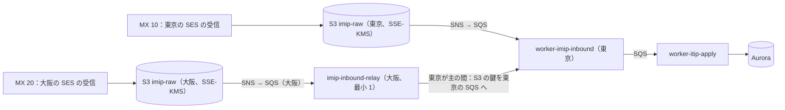
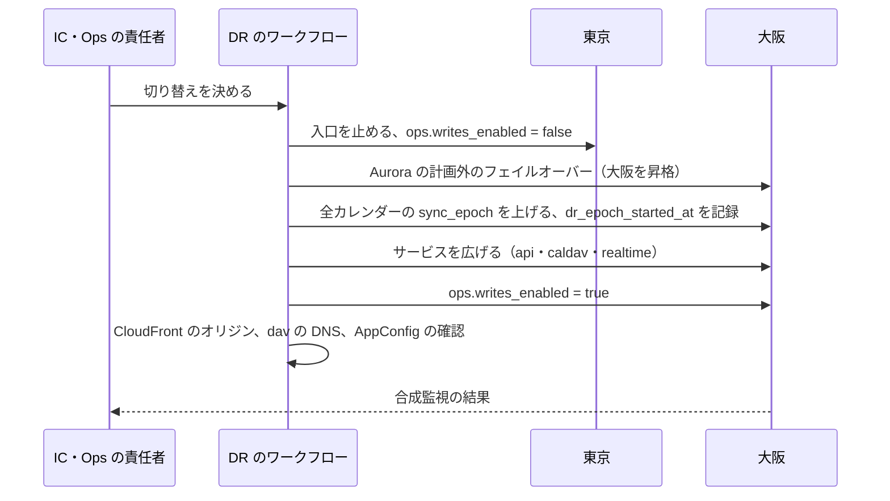

# Infrastructure: Google Calendar

AWS のアカウントとネットワーク、入口（画面・API・予約ページ・CalDAV・iMIP の受信）、外への送信（ICS の購読、Webhook、Web Push、メール）、サービスの分け方と配置、データの置き場所、tzdb の版の全サービスへの配り方、バックアップと災害復旧（大阪、`sync_epoch`）、段階を上げる基準、S2 のテナントのシャード、S3 のセルとリージョン、Terraform、コストを決める。他の題材（Linear・Slack・Auth0 の infrastructure.md）を土台にし、この題材に固有の事情だけを変える（[ADR-0001](../decisions/0001-platform-and-stack.md)）。

| ADR | 決定 |
| --- | --- |
| [0043](../decisions/0043-accounts-network-ingress-and-service-placement.md) | アカウントとネットワークは他の題材の形。画面・API・予約ページは CloudFront、CalDAV は WebDAV のメソッドを通すため WAF つきの ALB で受ける。iMIP は東京の SES の受信を主、大阪を副の MX にする。利用者の決める宛先は egress の経路から、Web Push は配信のサービスの許可リストだけへ出す |
| [0044](../decisions/0044-disaster-recovery-and-calendar-side-effects.md) | 大阪のウォームスタンバイへ人の判断で切り替え、書き込みを止めてから昇格し、`sync_epoch` を上げる。外部への iMIP の次の送信で `SEQUENCE` を 1 つ余分に上げ、リマインダーの重複は数えて SLO から分ける |
| [0045](../decisions/0045-stage-up-criteria-tenant-sharding-and-cells.md) | 段階を上げる基準。S2 はテナントを単位に Aurora のクラスタへ分け、ディレクトリを小さなクラスタに置く。テナントをまたぐのは SQS の内部の iTIP と、空き時間の内部の RPC。S3 はセルとリージョン |
| [0049](../decisions/0049-tzdata-rollout-and-schema-change-ordering.md) | tzdb の新しい版はイメージに入れて先にデプロイし、AppConfig の `tzdata.active_version` で全サービスを一度に切り替える（delivery の領域） |
| IaC、デプロイの方式、可観測性の道具 | 他の題材を引き継ぐ（Terraform、GitHub Actions と OIDC、ADOT・AMP・X-Ray・CloudWatch Logs・Managed Grafana） |

ログ・メトリクス・SLI は [observability.md](observability.md)、負荷と台数の根拠は [capacity.md](capacity.md)、CI とリリースは [delivery.md](delivery.md)、暗号化と統制は [security.md](security.md) にある。

数値のうち「初期見積もり」と書いたものは、E12 の負荷試験の前の仮の値である。AWS の仕様で確かめていないものは「未検証」と書く。

## 1. AWS アカウントの構成

ADR-0043。他の題材と同じ形にする。

| アカウント | OU | 中身 |
| --- | --- | --- |
| management | Root | Organizations、SCP、IAM Identity Center、請求 |
| security | Security | GuardDuty・Security Hub・Inspector の委任管理者、調査用のロール |
| log-archive | Security | 組織の CloudTrail、Config、VPC フローログ、監査ログの写し（[security.md](security.md) の 6 節）。Object Lock。東京 → 大阪へレプリケーション |
| shared | Infrastructure | ECR（東京・大阪にレプリケーション）、Route 53（`<brand>.<domain>`）、Managed Grafana、CI の起点、Terraform の状態のバケット |
| edge | Infrastructure | CloudFront、WAF（CloudFront 用）、ACM（us-east-1）、CloudFront のログ |
| dev、staging | Workloads/NonProd | 開発・検証。staging は本番と同じ構成を最小の台数で持ち、負荷試験と DR の訓練の時だけ本番と同じ台数に広げる |
| synthetics | Workloads/NonProd | 合成監視のクライアント、CalDAV のクライアントの試験場（[delivery.md](delivery.md) の 2.3 節） |
| prod | Workloads/Prod | 本番（東京と大阪） |

- **SCP**（Workloads の OU）：東京・大阪以外のリージョンを禁止する（CloudFront・WAF・ACM・IAM のための us-east-1 のグローバルなサービスを除く）。データの所在の約束は法務の L4 で確定する。CloudTrail・Config・GuardDuty の停止、KMS の鍵の削除の予約・無効化を、break-glass のロール以外に禁止する。

## 2. ネットワーク

### 2.1 prod の VPC（東京・大阪で同じ形）

| サブネット | 置くもの | インターネットへの経路 |
| --- | --- | --- |
| public | `alb-app`、`alb-dav`、NAT ゲートウェイ | Internet Gateway |
| private | `api`、`caldav`、`realtime`、`booking`、`auth`、`relay`、`worker-*`（下の egress の 2 つを除く） | NAT → Network Firewall（宛先の許可リスト） |
| egress | `ics-fetcher`、`push-sender`（Webhook） | 専用の NAT（Elastic IP を公開する）。VPC エンドポイントと isolated への経路を持たない |
| isolated | Aurora、ElastiCache（Valkey） | なし |

- VPC エンドポイント：S3、SQS、SNS、SES（API）、KMS、Secrets Manager、AppConfig、CloudWatch Logs、X-Ray、ECR、STS。
- セキュリティグループはサービスごとに入る側と出る側を明示する。egress のサブネットのサービスは、結果を SQS の公開のエンドポイントへ専用の NAT 越しに送る（VPC エンドポイントを使わない）。タスクのロールは、決めた 2 つのキューへの `SendMessage` と、入力のキューの受信だけを許す。

### 2.2 入口とホスト名

| ホスト名 | 入口 | 振り分け | オリジン |
| --- | --- | --- | --- |
| `calendar.<brand>.<domain>` | CloudFront＋WAF | 既定：殻（`index.html`、ハッシュ付きの資産、Service Worker） | S3（静的） |
| 同 | 同 | `/tzdata/<version>/*`（`Cache-Control: immutable`。[ADR-0038](../decisions/0038-web-calendar-rendering-and-local-expansion.md)） | S3（静的） |
| 同 | 同 | `/rt`（WebSocket） | `alb-app` → `realtime` |
| 同 | 同 | `/.well-known/caldav` | `alb-app` → `caldav` が `https://dav.<brand>.<domain>/dav/` へ 301 |
| `api.<brand>.<domain>` | CloudFront＋WAF | `/v1/*`（公開 API と自社の画面の API は同じ。[ADR-0026](../decisions/0026-public-rest-api-shape.md)。CORS は `calendar.<brand>.<domain>` だけ） | `alb-app` → `api` |
| `auth.<brand>.<domain>` | CloudFront＋WAF | ログイン、SSO（SAML・OIDC）、SCIM、OAuth の認可とトークン（[accounts-and-orgs.md](accounts-and-orgs.md)） | `alb-app` → `auth` |
| `book.<brand>.<domain>` | CloudFront＋WAF（ボットの対策の規則） | 殻、`/api/*` | S3、`alb-app` → `booking` |
| `ics.<brand>.<domain>` | CloudFront＋WAF | `/c/<token>.ics`（ICS の秘密のアドレス）、`/p/<calendar_id>.ics`（公開。CloudFront で 1 時間のキャッシュ）（[sync-and-caldav.md](sync-and-caldav.md) の 8.2 節） | `alb-app` → `api`（ログの扱いは [security.md](security.md) の 7 節） |
| `dav.<brand>.<domain>` | **`alb-dav`（AWS WAF を ALB に付ける）** | すべて | `caldav` |
| `imip.<brand>.<domain>` | MX：`inbound-smtp.ap-northeast-1.amazonaws.com`（10）、`inbound-smtp.ap-northeast-3.amazonaws.com`（20） | SES の受信の規則 | S3 → SNS → SQS → `imip-inbound` |
| `mail.<brand>.<domain>`、`bounce.mail.<brand>.<domain>` | SES の送信（DKIM、MAIL FROM） | — | — |

- **CalDAV は CloudFront を通さない**（ADR-0043）。CloudFront の許すメソッドの組に `PROPFIND`・`REPORT` がないため（[Cache behavior settings](https://docs.aws.amazon.com/AmazonCloudFront/latest/DeveloperGuide/DownloadDistValuesCacheBehavior.html)、2026-10-04 に確認）。ALB の規則は独自のメソッドを条件に書ける（[Condition types for listener rules](https://docs.aws.amazon.com/elasticloadbalancing/latest/application/rule-condition-types.html)、2026-10-04 に確認）。`alb-dav` は 443 だけを聞き、TLS 1.2 以上。WAF の規則：IP ごと 5 分 3,000 要求の粗い上限、本文 2 MiB（WAF の本文の検査の上限を超える部分はアプリで数える）。Basic 認証の失敗の上限（アカウントごと 10 分 20 回、IP ごと 10 分 200 回）は `caldav` が数える（[sync-and-caldav.md](sync-and-caldav.md) の 6.7 節）。上限を超えた IP は `caldav` が WAF の IP の集合へ 15 分載せ、エッジで止める。
- **CalDAV の発見**：DNS の SRV `_caldavs._tcp.<brand>.<domain>`（`dav.<brand>.<domain>`、443）と TXT（`path=/dav/`）、`/.well-known/caldav` のリダイレクト（RFC 6764）。
- **WebSocket**（`/rt`）：CloudFront → `alb-app` → `realtime`。CloudFront の WebSocket の扱い（10 分流れない接続を切る、など）は Linear の infrastructure.md の 2.2 節で 2026-09-28 に確かめた事実を引き継ぐ。`realtime` は 30 秒ごとに ping を送る。ALB のアイドルの時間切れは 120 秒。
- WAF（CloudFront）：共通のルール、IP の評判、IP ごとのレート制限（`auth` の送信は 5 分 300、`api` は 5 分 30,000、`book` の予約の送信は 5 分 30）。値は E4・E10・E12 で調整する。

### 2.3 外への送信

| 送信 | 経路 | 理由 |
| --- | --- | --- |
| ICS の購読の取得（`ics-fetcher`） | egress → 専用の NAT | 利用者の決める宛先。SSRF の踏み台にしない（[ADR-0040](../decisions/0040-untrusted-calendar-input-gate.md)） |
| Webhook の送信（`push-sender`） | egress → 専用の NAT | 同上 |
| Web Push（`notifier`） | private → NAT → Network Firewall（配信のサービスのホスト名の許可リスト） | 宛先はブラウザの事業者の配信のサービスに限られる。`endpoint` は利用者のブラウザから届くので、アプリと Network Firewall の 2 か所で許可リストに限る。許可リストの値は E9 で確かめる（**未検証**） |
| メール（招待、通知、iMIP） | VPC エンドポイント（SES の API） | — |
| IdP のメタデータ・JWKS（SSO） | private → NAT → Network Firewall（組織が登録した IdP のホスト名を許可リストへ自動で足す） | 組織が決める宛先だが、決まった形式の取得だけ。accounts-and-orgs の領域 |

## 3. ECS サービスと配置

ADR-0043。すべて Fargate（ARM64）。サービスごとにタスク定義と IAM ロールを分ける。台数は [capacity.md](capacity.md) の 6 節。

| サービス | 役割 | DB のロール | スケールの指標 |
| --- | --- | --- | --- |
| `api` | 自社の画面と公開 API、空き時間、管理、ICS の公開、範囲の問い合わせ、差分。`packages/writer` | `app`（RLS）、`freebusy`（`freebusy_for` だけ） | CPU 50%、要求数。業務の時間の下限（[ADR-0047](../decisions/0047-time-shaped-capacity-and-calendar-write-admission.md)） |
| `caldav` | CalDAV・WebDAV の同期。`packages/writer` | `app` | 同上 |
| `realtime` | WebSocket の終端と合図 | なし（Valkey だけ） | タスクあたりの接続の数（目標 10,000） |
| `booking` | 予約ページ。`packages/writer` | `app`、`freebusy` | CPU |
| `auth` | ログイン、SSO、SCIM、OAuth、アプリ用のパスワードの照合 | `auth`（テナントの外のスキーマ） | CPU |
| `relay` | outbox → Valkey の合図、SNS・SQS | `relay` | outbox の最古の行の年齢 |
| `worker-itip-delivery` | 内部の iTIP の配送、iMIP の送信 | `itip_delivery`（テナントをまたぐ関数） | キューの最古の年齢 |
| `worker-imip-inbound` | iMIP の受信の解析と照合 | なし（結果を SQS で `worker-itip-apply` へ） | 同上 |
| `worker-itip-apply` | iMIP の受信の結果を当てる | `app` | 同上 |
| `worker-expander` | 展開の範囲の端の維持、tzdb の再計算 | `app`（`maintenance` の枠） | ジョブの残り |
| `worker-reminder-scheduler` | 分の桶とタイマーホイール | `app`（読み出し）、送信の記録 | 時刻（集中の前に 4 → 8。[ADR-0029](../decisions/0029-reminder-clock-buckets-and-timer-wheel.md)） |
| `worker-notifier` | Web Push・メール・画面の通知 | 送信の記録 | 業務の時間の下限、キューの年齢 |
| `push-sender`（egress） | Webhook の送信 | なし | 同時の送信の数 |
| `ics-fetcher`（egress） | ICS の購読の取得と解析 | なし（結果を SQS で `worker-ics-apply` へ） | キューの年齢 |
| `worker-*`（その他） | `ics-apply`、`indexer`、`auditor`、`lifecycle`、`imip-events`、`slo-aggregator`、`copy-reconciliation` | 用途ごと | キューの年齢 |

- `packages/writer` はサービスではなくライブラリで、`api`・`caldav`・`booking`・`worker-*` の中で動く（[ADR-0001](../decisions/0001-platform-and-stack.md)）。
- 外からの入力を解析するサービス（`worker-imip-inbound`、`ics-fetcher`）は DB に書けない。書くのは結果を受ける別の Worker である（[ADR-0040](../decisions/0040-untrusted-calendar-input-gate.md)）。`caldav` と `api` の同期の解析は、同じタスクの隔離の worker thread で行う。

### 3.1 iMIP の受信の流れ



- SES の受信の S3 への保存の既定の上限は 40 MB（[Deliver to S3 bucket action](https://docs.aws.amazon.com/ses/latest/dg/receiving-email-action-s3.html)、2026-10-04 に確認）。本システムの上限（10 MiB）は `imip-inbound` が当てる。
- 受信の規則は、受け口のドメイン（`imip.<brand>.<domain>`）の宛先だけを受け、スパムとウイルスの検査の結果をメッセージに付ける（SES の受信の機能。判定の使い方は [invitations-and-itip.md](invitations-and-itip.md) の 11.4 節）。

### 3.2 AZ の障害への備え

- 各サービスは、残る 2 AZ で最大負荷をさばける台数を常に持つ。平常の使用率を 2/3 以下に保つ（[capacity.md](capacity.md) の 6 節）。
- `realtime` の 1 AZ の喪失で、その AZ の接続が再接続する。クライアントは 0〜5 秒の乱数で待つ（[clients.md](clients.md) の 13 節）。
- `worker-reminder-scheduler` のシャードは `reminder_shard_leases`（30 秒の期限、10 秒ごとに延ばす）で借り、AZ の喪失で 30 秒ほどで他のタスクが引き継ぐ（[ADR-0029](../decisions/0029-reminder-clock-buckets-and-timer-wheel.md)）。

## 4. データの置き場所（S1）

| 置き場所 | 中身 | 冗長 |
| --- | --- | --- |
| Aurora PostgreSQL 18（主） | 予定オブジェクト、展開の索引、会議室の予約の行、`calendar_changes`、outbox、ACL、リマインダーの桶と送信の記録、監査、`auth` のスキーマ | 3 AZ、Global Database で大阪へ |
| ElastiCache（Valkey） | 合図の pub/sub、空き時間のキャッシュ、レート制限、書き込みの枠、照合の結果の写し | クラスタモード、レプリカ。失ってよい |
| S3 | Web の資産、tzdata のゾーン、iMIP の受信の生のメール、ICS の取り込み・書き出し | 資産・tzdata は大阪へレプリケーション。生のメールは各リージョンの受信のバケット（レプリケーションしない。30 日で消える） |
| SQS・SNS | 配送、受信、Webhook、索引、通知のキュー | 東京だけ。大阪は空のキュー（outbox から作り直す） |
| AppConfig | `release.*`、`ops.*`、`tzdata.active_version` | 東京・大阪に同じ構成を持つ（Terraform）。切り替えは両方に当てる |
| Secrets Manager | 同期のトークンの HMAC の鍵、Webhook の秘密の鍵の鍵 | 大阪へレプリカ |

## 5. S1 の構成と台数（初期見積もり）

根拠は [capacity.md](capacity.md)。

| リソース | 構成 |
| --- | --- |
| Aurora PostgreSQL 18 | writer `db.r8g.12xlarge` × 1、reader 同型 × 2（別の AZ）。I/O-Optimized。大阪の Global Database の二次に reader 同型 × 1 |
| RDS Proxy | 使わない（`SET LOCAL` で接続が固定される。他の題材と同じ） |
| ElastiCache（Valkey） | `cache.r7g.large`、クラスタモード 3 シャード × （プライマリ 1＋レプリカ 1）。大阪は小さい別のクラスタ（空） |
| ECS | [capacity.md](capacity.md) の 6 節の表（平均 約 130 vCPU） |
| NAT ゲートウェイ | private × 3、egress × 3（東京）。大阪も同じ |
| Network Firewall | private の外向きに 3 AZ |
| 大阪（ウォームスタンバイ） | 各サービスを最小 1〜2 タスク（`imip-inbound-relay` は常に 1）、Aurora の二次に reader 1 台、Valkey は小さい別のクラスタ、SES の受信（MX 20） |

## 6. バックアップと災害復旧

ADR-0044。

### 6.1 バックアップ

| 対象 | 方法 | 保持 |
| --- | --- | --- |
| Aurora | 自動バックアップ（PITR）＋ AWS Backup の連続バックアップ。Vault Lock | 35 日（[ADR-0042](../decisions/0042-audit-log-and-data-lifecycle.md)） |
| S3（資産、tzdata） | バージョニング、大阪へレプリケーション | 30 日 |
| S3（iMIP の生のメール、取り込み・書き出し） | バックアップしない | 短命（30 日・7 日） |
| Valkey、SQS | バックアップしない | 失ってよい |

### 6.2 AZ の障害（NFR-007：RPO 0、RTO 5 分）

| 部品 | 動き | 目安 |
| --- | --- | --- |
| Aurora | 別の AZ の reader へ自動でフェイルオーバー。コミット済みを失わない | 通常 60 秒未満（他の題材で確認） |
| フェイルオーバーの間 | `api`・`caldav` は 503 と `Retry-After`。Web の画面は手元の窓で描き続ける。CalDAV のクライアントは再試行する | 数十秒 |
| `realtime` | その AZ の接続が切れ、残る AZ へ再接続 | 数十秒 |
| `worker-reminder-scheduler` | シャードの借りが 30 秒の期限で移る（最大の遅れ 約 40 秒）。遅れた分は送る（15 分以内） | 数十秒 |
| ECS | 残る AZ でタスクを起動し直す | 数分 |
| Valkey | レプリカの昇格。その間、空き時間のキャッシュは索引から読み直し、書き込みの枠はメモリーの近似 | 数十秒 |

### 6.3 リージョンの障害（NFR-007：RPO 1 分、RTO 1 時間）

ADR-0044。切り替えは人の判断で行い、手順はワークフローで自動化する。手順は `disaster-recovery.md`（[runbooks/README.md](../runbooks/README.md) の 4 節の予定）。



- 事実（Aurora Global Database の計画外のフェイルオーバーで複製の遅延ぶんを失いうること、古い一次の書き込みを止める仕組みが最善努力であること、`rds.global_db_rpo` の意味）は、Linear の infrastructure.md の 6.3 節で 2026-09-28 に確かめたもの（[Using switchover or failover in Amazon Aurora Global Database](https://docs.aws.amazon.com/AmazonRDS/latest/AuroraUserGuide/aurora-global-database-disaster-recovery.html)）を引き継ぐ。`rds.global_db_rpo` は設定しない。`AuroraGlobalDBRPOLag` が 10 秒を 5 分超えたら呼び出す。
- **`sync_epoch` を必ず上げる**（[ADR-0005](../decisions/0005-change-log-and-sync-tokens.md)）。Web・API・CalDAV のトークンはすべて 410 になる。取り直しの殺到の構成の広げ方は [capacity.md](capacity.md) の 5 節。
- **失った範囲の外への副作用**（iMIP の `SEQUENCE` の余白、リマインダーの重複、通知、外部からの iMIP の受信、送信の上限の数）の扱いは ADR-0044 の表。
- **tzdb の版**：大阪の AppConfig の `tzdata.active_version` が東京と同じことを、6.5 節の確認に入れる。違えば切り替えの前に合わせる。
- **Web Push**：VAPID の鍵は Secrets Manager の大阪のレプリカで同じものを使う。購読はそのまま使える。
- **東京へ戻す**：計画作業として switchover（RPO 0）で戻す。番号が保たれるので `sync_epoch` を上げない。

### 6.4 論理的な破損と、テナントの戻し

- **全体の破損**（誤ったマイグレーション）：PITR で隔離した VPC に新しいクラスタを戻し、失われた行だけを `packages/writer` の保守の経路で書き戻す。差分として配り、`sync_epoch` を上げない（番号は前へ進むだけ）。本番のクラスタを上書きしない。
- **1 つのテナントを時点へ戻す**（顧客の誤りの大量の削除）：可能なら、PITR の写しから消えた予定オブジェクトを読み、`packages/writer` で作り直す（上と同じ）。表を差し替える方式は番号の意味を変えるので、そのテナントのカレンダーの `epoch` を上げる。参加者の写しと外部への iMIP の扱いは、作り直しの経路なら通常の書き込みと同じに流れる。
- **展開の索引の破損**：予定オブジェクトから作り直せる写しなので、`expander` で作り直す（[events-and-recurrence.md](events-and-recurrence.md) の 9.5 節）。

### 6.5 大阪の待機の構成の確認

| 確認 | 頻度 |
| --- | --- |
| 大阪からの合成監視（大阪の `alb-app`・`alb-dav` へ直接、読み出しだけ） | 1 分 |
| 大阪の SES の受信へのテストのメールが、東京の `imip-inbound` で処理される | 15 分 |
| 大阪の Terraform の plan に差分がない | 日次 |
| ECR・Secrets Manager のレプリカ、KMS のマルチリージョンの鍵のレプリカ | 日次 |
| 大阪の AppConfig の `tzdata.active_version` と `ops.*` が東京と同じ | 5 分 |
| Fargate の vCPU のクォータが、大阪でも東京と同じ | 月次 |
| SES の送信の上限（送信の率、24 時間の数）が、大阪でも東京と同じ | 月次 |

## 7. tzdb の版を全サービスに配る

ADR-0049（流れの全体は [delivery.md](delivery.md) の 6 節）。

| 部品 | 版の持ち方 | 切り替え |
| --- | --- | --- |
| サーバーのサービス（`api`、`caldav`、`booking`、`worker-*`） | イメージの中に、`active` とその前後の版（最大 3 版） | AppConfig の `tzdata.active_version` を 15 秒のポーリングで読む。使っている版をメトリクス `tzdata_active_version` で出す |
| Web のクライアント | `/tzdata/<version>/<zone>.bin`（S3、変わらない） | API の応答の `tzdata_version` で取る（[ADR-0038](../decisions/0038-web-calendar-rendering-and-local-expansion.md)） |
| CalDAV・ICS・iMIP の VTIMEZONE | `active` の版から作る（[time-zones-and-holidays.md](time-zones-and-holidays.md) の 8 節） | 同上 |
| `worker-expander` の再計算 | 全タスクが新しい版を 2 分続けて報告したら始める | [ADR-0012](../decisions/0012-tzdb-update-recompute-and-propagation.md) |
| 大阪 | 同じイメージ、同じ AppConfig の値 | 東京と同時に当てる（6.5 節で確かめる） |
| DB | オフセットの計算に使わない（[ADR-0002](../decisions/0002-time-representation.md)）。Aurora の tzdata の版は気にしない | — |

## 8. CI/CD と Terraform

### 8.1 CI/CD

他の題材と同じ（GitHub Actions、OIDC、1 回ビルドして同じイメージを昇格させる、prod は Ops の承認）。この題材に固有の関門とクライアントの配布は [delivery.md](delivery.md)。

```
main へのマージ ─▶ ビルド ─▶ shared の ECR ─▶ dev ─▶ staging（試験場・E2E・k6）─▶ prod（Ops の承認）
Web の資産・tzdata のゾーンは S3 へ（delivery の領域）
```

### 8.2 Terraform の配置

開発リポジトリの `infra/` に置く。状態ファイルは shared のバケット（東京、大阪へレプリケーション）。

| ルートモジュール | 中身 | 変更の承認 |
| --- | --- | --- |
| `org/` | Organizations、SCP、Identity Center | Ops の責任者＋セキュリティの担当 |
| `security/` | GuardDuty、Security Hub、Config、log-archive | 同上 |
| `global/edge` | CloudFront の配信（`calendar`・`api`・`auth`・`book`・`ics`）、WAF、ACM、Route 53（`dav` と `imip` の MX を含む）。変数 `active_region` | Ops（WAF のルールは `security:sensitive`） |
| `regional/network` | VPC、サブネット、NAT、Network Firewall、VPC エンドポイント（東京・大阪で同じモジュールを 2 回） | Ops |
| `regional/data` | Aurora（Global Database）、Valkey、S3、SQS、SNS、SES の受信の規則 | Ops。状態を持つリソースの削除・置き換えは CI で拒否 |
| `regional/keys` | KMS の鍵（マルチリージョン）、キーポリシー | `security:sensitive` |
| `regional/services` | ECS のクラスタ、サービス、タスク定義、`alb-app`・`alb-dav`（WAF の関連付け）、オートスケールとスケジュール | Ops |
| `regional/config` | AppConfig のアプリ・環境・構成（`tzdata.active_version` の検証の関数を含む） | Ops |

- plan のポリシー検査（OPA・Checkov）で、次を拒否する。
  - isolated のサブネットの経路表に NAT・IGW
  - egress のサブネットから VPC エンドポイント・isolated への経路
  - `alb-dav` に WAF の関連付けがない、または 80 番を聞く
  - `imip.<brand>.<domain>` の MX が東京・大阪の SES の受信以外を指す
  - `s3-imip-raw`・`app-secrets` の KMS の鍵の `kms:Decrypt` を、決めたロール以外に与える（[security.md](security.md) の 5 節）
  - Aurora のパラメーターに `rds.global_db_rpo` を置く

## 9. 環境とデータ

| 環境 | 目的 | データ |
| --- | --- | --- |
| local | 開発、エージェントの確認ループ | seed（本物のデータを使わない。[AGENTS.md](../../AGENTS.md)） |
| dev | 結合の確認 | seed |
| staging | リリース前の確認、負荷・障害試験、DR の訓練、tzdb の更新の訓練 | 生成データ（[quality.md](../quality.md) の 2.4 節の S1 の想定） |
| prod | 本番 | 本番 |

- 本番のデータを本番のアカウントの外に出さない。匿名化したコピーも作らない（他の題材と同じ）。
- 合成監視のために、prod に社内の監視用のテナントを置く（[observability.md](observability.md) の 6 節）。

## 10. 段階を上げる判断の基準

ADR-0045 の表のとおり。月次のキャパシティのレビュー（[capacity.md](capacity.md) の 8 節）で、次をダッシュボードから見る。

- 予定オブジェクトの書き込み（配送を除く）と、参加者の写しの書き込みのピーク（月曜の朝）
- 読み出しのピーク
- Aurora の writer の CPU（ピークの p95）、reader の遅れ
- リマインダーの送信の開始の p99（毎時 0 分）
- 最大のテナントの書き込みの割合
- 展開の索引の行の数

移行に四半期ほどかかるので、上限の手前で始める。

## 11. S2 のシャードと S3 のセル

ADR-0045。

### 11.1 S2

- テナントを単位に Aurora のクラスタへ分ける。ディレクトリ（`tenant_directory`、`account_directory`、`imip_address_directory`）を小さなディレクトリのクラスタ（Global Database）に置く。
- 内部の iTIP は SQS で受け手のクラスタへ（形は S1 と同じ）。空き時間は `freebusy-rpc`（Service Connect）で相手のクラスタの `freebusy_for` を呼ぶ（[free-busy-and-scheduling.md](free-busy-and-scheduling.md) の 4.5 節）。
- Relay・`worker-expander`・`worker-reminder-scheduler` はクラスタごとに動かす。
- テナントの移動の方式は、S2 の着手の前に別の ADR で決める。

### 11.2 S3

- スタック一式をセルとして複製し、テナントをセルとリージョンに固定する。
- CalDAV はセルごとのホスト名（`dav-<cell>.<brand>.<domain>`）にし、`/.well-known/caldav` で利用者のセルへリダイレクトする。既存の CalDAV のクライアントの設定（`dav.<brand>.<domain>`）は、`dav` の入口が発見のリダイレクトを返し続けることで動かす（クライアントがリダイレクトを覚えるかは **未検証**。S3 の着手の前に試験場で確かめる）。
- iMIP の受け口のアドレスは、受け口の `token` → セルを Global で引き、SES の受信の規則は 1 つのまま、`imip-inbound` がセルの SQS へ振り分ける。

## 12. コストの概算（S1、本番、1 か月）

**大まかな見積もりである。** ±50% の幅。サポートプラン、税は含めない。次の単価は Linear の infrastructure.md の 11 節で AWS Price List API から確かめた値（2026-09-28）を使う：Fargate の東京（Graviton：vCPU 1 時間 0.04045 USD・メモリー 1 GB 1 時間 0.00442 USD）、Aurora PostgreSQL の東京の `db.r8g.4xlarge`（I/O-Optimized 1 時間 3.464 USD）、CloudFront の日本からのデータ転送（最初の 10 TB が 1 GB 0.114 USD、次の 40 TB が 0.089 USD）。`db.r8g.12xlarge` は `4xlarge` の 3 倍の単価と置いた（**未検証**）。他の項目の単価は確かめていない（**未検証**。E12 の `cost-baseline` で請求の実績に置き換える）。

| 項目 | 月額（USD、概算） | 前提 |
| --- | --- | --- |
| Aurora（`r8g.12xlarge` × 3＋大阪 × 1、I/O-Optimized、ストレージ 約 2.5 TB、Global Database の複製） | 32,000 | 1 台 約 10.4 USD/時 × 730 時間 × 4 台、ほかストレージと複製 |
| ElastiCache（東京 6 ノード、大阪 2 ノード） | 1,500 | |
| ECS Fargate（東京 平均 約 130 vCPU・260 GB、大阪の待機 約 20 vCPU） | 5,400 | [capacity.md](capacity.md) の 6 節 |
| CloudFront のデータ転送（API の応答、資産、tzdata） | 3,800 | 月 約 40 TB（読み出しの平均 3,000 件/秒 × 5 KB） |
| ALB（`alb-dav`）からのデータ転送（CalDAV） | 600 | 月 約 5 TB（1,000 件/秒 × 2 KB） |
| ALB、NAT、Network Firewall（東京と大阪） | 4,500 | |
| SES（送信 約 3,000 万通、受信） | 3,200 | 招待・リマインダー・毎朝の一覧のメール |
| 可観測性（ログ、メトリクス、トレース、Grafana） | 2,500 | |
| GuardDuty、Security Hub、Inspector、Config、CloudTrail、WAF | 2,000 | |
| S3、バックアップ、log-archive | 800 | |
| KMS、Secrets Manager、AppConfig、SQS・SNS | 800 | |
| **本番の合計** | **約 57,000** | |
| staging・dev・shared・edge・security・synthetics（macOS のランナーを含む） | 約 8,000 | |

- **Aurora が最大の項目である。** writer の大きさは、参加者の写しの配送（平均 4 倍）と展開の索引の書き込みで決まる（[capacity.md](capacity.md) の 5.1 節）。E2 の PoC で、1 予定オブジェクトの書き込みの行の数が見込み（約 10 行）より少なければ、`r8g.8xlarge` に下げる。
- 業務の時間の下限（[ADR-0047](../decisions/0047-time-shaped-capacity-and-calendar-write-admission.md)）で、Fargate の費用の約 3 分の 1 が業務の時間の下限の分になる見込み。
- 費用は、アカウントとタグ（`service`、`env`）ごとに毎月見る。

## 13. Story の候補

| Epic | Story | 中身 |
| --- | --- | --- |
| E1 | `aws-accounts-and-network` | 1 節と 2.1 節（egress を含む）、Network Firewall、VPC エンドポイント。データの所在は法務：L4 |
| E1 | `edge-and-waf` | 2.2 節の CloudFront の配信、WAF、ホスト名、`/tzdata/` の振り分け |
| E1 | `caldav-ingress` | 2.2 節の `alb-dav`、ALB の WAF、SRV・TXT、`/.well-known/caldav` |
| E1 | `ecs-services-skeleton` | 3 節のサービスとロール |
| E1 | `terraform-root-modules` | 8.2 節とポリシー検査 |
| E1 | `osaka-warm-standby` | 5 節の大阪の骨格、Global Database、6.5 節の確認 |
| E5 | `ses-inbound-dual-region` | 3.1 節の MX 10・20、受信の規則、`imip-inbound-relay`（invitations-and-itip と共同） |
| E3 | `tzdata-runtime-switch` | 7 節の AppConfig の切り替え、`tzdata_active_version` の報告（delivery・time-zones-and-holidays と共同） |
| E12 | `dr-failover-workflow` | 6.3 節のワークフロー、`dr_epoch_started_at`、iMIP の `SEQUENCE` の余白、リマインダーの DR の窓の計数（ADR-0044） |
| E12 | `dr-failover-drill` | DR の訓練（staging 四半期、本番の switchover 年 1 回） |
| E12 | `tenant-pitr-restore` | 6.4 節のテナントの戻し |
| E12 | `cost-baseline` | 12 節の確定 |

## 14. 未解決の問い

### 決定

2026-10-04 の既定案。E1 と E12 で覆りうる。

- **CalDAV の入口**：CloudFront を通さず、WAF つきの ALB（ADR-0043）。[architecture/README.md](README.md) の 1.2 節の絵（CloudFront の後ろに CalDAV）を、この決定で直す。
- **iMIP の受信**：東京を主、大阪を副の MX（ADR-0043）。
- **DR**：ウォームスタンバイ、`sync_epoch` を上げる、iMIP の `SEQUENCE` の余白、リマインダーの重複の計数（ADR-0044）。
- **S2・S3**：テナントを単位のクラスタ、ディレクトリ、セル（ADR-0045）。
- **tzdb**：イメージに複数の版、AppConfig で切り替え（ADR-0049）。

### 持ち越し

| 問い | いつ・どう決めるか |
| --- | --- |
| データの所在の約束の範囲（Web Push の配信のサービス、外部の参加者への iMIP） | **法務の確認待ち：L4** |
| Web Push の配信のサービスのホスト名の許可リスト | E9 の `web-push`（**未検証**） |
| Aurora の writer の大きさ（`12xlarge` か `8xlarge`） | E2 の `occurrence-index-poc`、`calendar-write-throughput-poc`、E12 の負荷試験 |
| S2 のテナントの移動の方式 | S2 の着手の前に別の ADR |
| S3 で CalDAV のクライアントがリダイレクトを覚えるか | S3 の着手の前（**未検証**） |
| CloudFront の標準のログで URI の経路を外せるか | E8 の `ics-publish`（**未検証**） |

## 15. quality.md・runbooks・data-model への項目

### quality.md

- DR の訓練（staging、四半期）で、切り替えの後に合成監視のクライアント（Web の API と CalDAV）が 410 から取り直して一致し、外部への次の iMIP の `SEQUENCE` に余白が付くことを、E12 の GA の判定の基準にする。
- 本番：`AuroraGlobalDBRPOLag`、大阪の合成監視、大阪の SES の受信のテストのメール、AppConfig の東京・大阪の一致。

### runbooks

- `disaster-recovery.md`（[runbooks/README.md](../runbooks/README.md) の 4 節の予定）：6.3 節のワークフロー、`dr_epoch_started_at`、失った範囲の副作用の確かめ方。
- `ses-inbound-failover.md`（新規の提案）：東京の SES の受信の停止の確かめ方と、大阪の受信からの転送の監視。

### data-model（索引への追加の提案）

| 表・置き場所 | 中身 | 節 |
| --- | --- | --- |
| `platform_state`（保守用のスキーマ） | `dr_epoch_started_at`、`sync_epoch` の全体の値、切り替えの記録 | 6.3 |
| `event_objects` に足す列 | `seq_margin_epoch`（DR の後の `SEQUENCE` の余白を当てた `epoch`） | 6.3、ADR-0044 |
| `reminder_deliveries` に足す列 | `dr_window`（DR の窓の中の送信の印） | 6.3、ADR-0044 |
| `tenant_directory`・`account_directory`・`imip_address_directory`（ディレクトリのクラスタ、S2 から） | テナント → クラスタ・リージョン・状態、メールアドレスのハッシュ → アカウント、受け口 → テナント | 11.1 |
| `tenants.status` に `moving` | 移動の間の書き込みの停止（S2） | 11.1 |
| AppConfig | `tzdata.active_version`、`ops.writes_enabled` | 6.3、7 |

## 出典

いずれも 2026-10-04 に確認（他の題材から引き継いだものは、その日付を書いた）。

- AWS, [Cache behavior settings（Amazon CloudFront）](https://docs.aws.amazon.com/AmazonCloudFront/latest/DeveloperGuide/DownloadDistValuesCacheBehavior.html)：許すメソッドは 3 つの組から選ぶ
- AWS, [Condition types for listener rules（Application Load Balancer）](https://docs.aws.amazon.com/elasticloadbalancing/latest/application/rule-condition-types.html)：標準と独自の HTTP のメソッドを条件に書ける
- AWS, [Amazon Simple Email Service endpoints and quotas](https://docs.aws.amazon.com/general/latest/gr/ses.html)：東京と大阪でメールの受信を使える。送信の既定のクォータ（24 時間 200 通、1 秒 1 通）は引き上げられる
- AWS, [Deliver to S3 bucket action](https://docs.aws.amazon.com/ses/latest/dg/receiving-email-action-s3.html)：S3 への保存の既定の上限 40 MB
- AWS, [Using switchover or failover in Amazon Aurora Global Database](https://docs.aws.amazon.com/AmazonRDS/latest/AuroraUserGuide/aurora-global-database-disaster-recovery.html)（Linear の infrastructure.md で 2026-09-28 に確認）
- IETF, [RFC 6764: Locating Services for Calendaring Extensions to WebDAV (CalDAV) and vCard Extensions to WebDAV (CardDAV)](https://www.rfc-editor.org/rfc/rfc6764)
