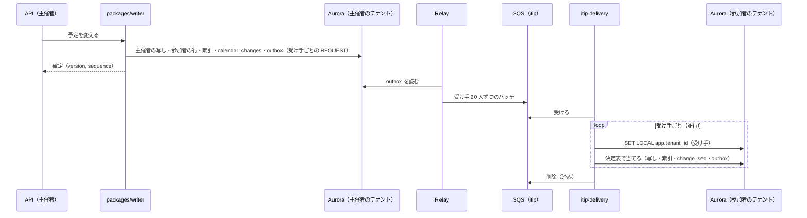
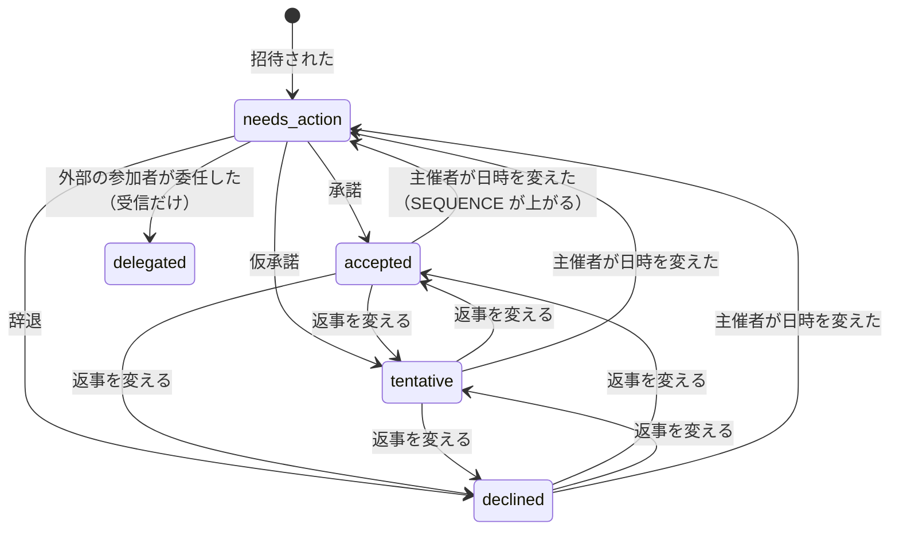
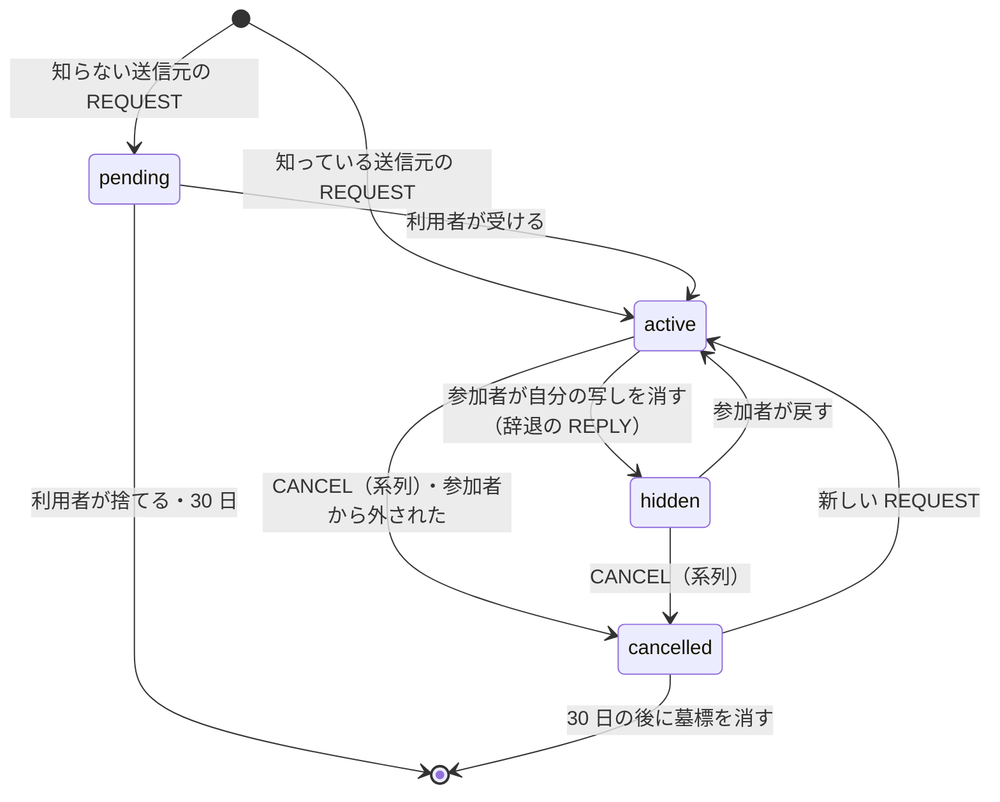
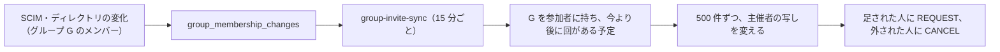
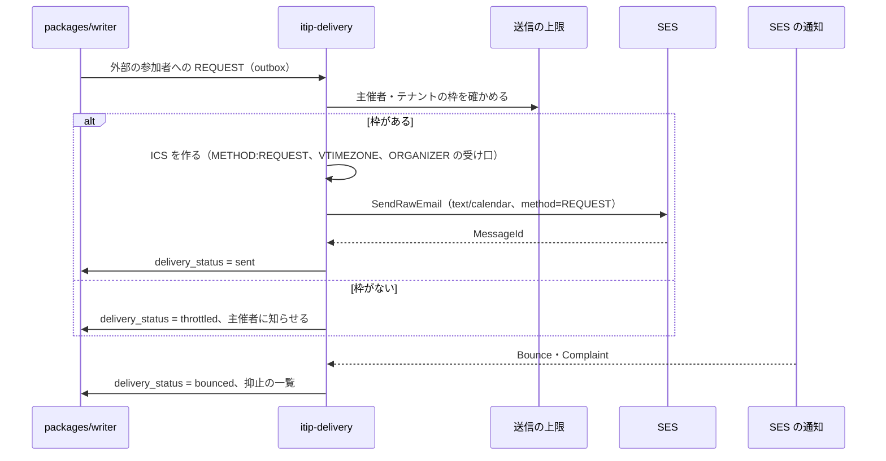
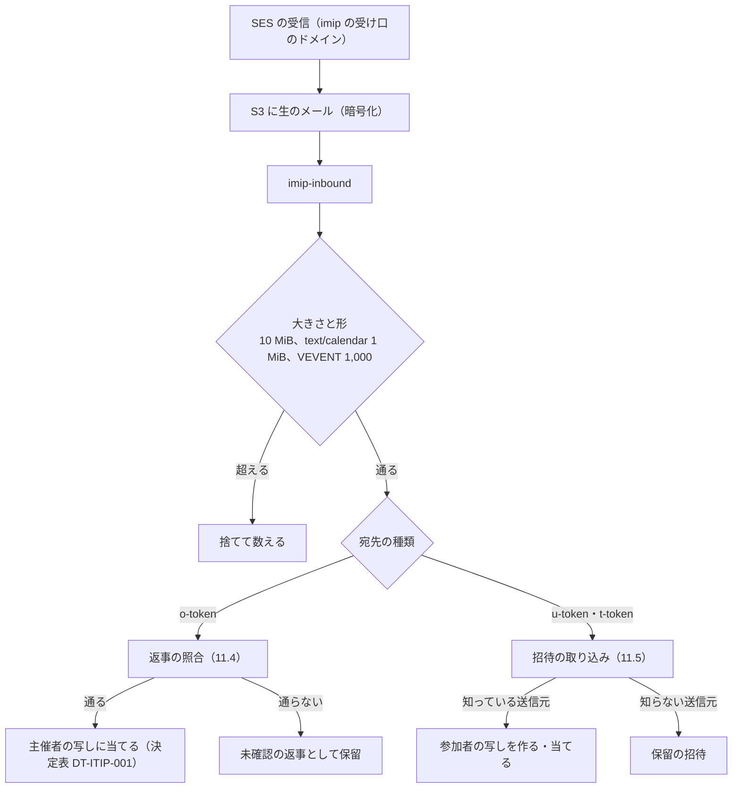

# Invitations and iTIP: Google Calendar

主催者の写しと参加者の写し、内部の iTIP の配送と当て方、出欠と `SEQUENCE`、参加者の権限、グループの招待と展開、主催者の変更、iMIP の送信（SES）と受信（返事の照合、送信元の認証）、迷惑な招待の対策を決める。

前提となる決定は、テナントと権限（[ADR-0004](../decisions/0004-tenancy-and-rls.md)）、変更のログ（[ADR-0005](../decisions/0005-change-log-and-sync-tokens.md)）、主催者と参加者の写し（[ADR-0006](../decisions/0006-organizer-and-attendee-copies.md)）、標準の範囲（[ADR-0007](../decisions/0007-interop-standards-scope.md)）、繰り返しの保存（[ADR-0003](../decisions/0003-recurrence-storage-and-expansion.md)、[ADR-0009](../decisions/0009-series-edit-and-override-rebasing.md)）。この文書で決めたことは次の ADR にある。

| ADR | 決定 |
| --- | --- |
| [0014](../decisions/0014-itip-state-transfer-and-sequence.md) | 内部の iTIP のメッセージは、受け手に見せてよい形の予定オブジェクトの全体を運ぶ（状態の転送）。新旧は `(SEQUENCE, 主催者の版)` で決める。`SEQUENCE` は RFC 5546 の 2.1.4 節の項目に、場所と参加者の削除を足して上げる。日時が変わったら参加者の出欠を `needs_action` に戻し、戻す前の `SEQUENCE` への返事は捨てる |
| [0015](../decisions/0015-imip-addressing-and-trust.md) | 外部への招待の ORGANIZER は、予定ごとの受け口のアドレス（`o-<token>@imip.<brand>.<domain>`）にし、返事を本システムで受ける。人の返事のメールは Reply-To で主催者へ直接向ける。受信の返事は From と ATTENDEE の一致と、DKIM か SPF の From の揃いで確かめ、満たさないものは「未確認」として当てない。外部からの招待は、利用者・組織が転送する受け口で受け、知らない送信元は保留にする |
| [0016](../decisions/0016-group-invitation-expansion.md) | グループの招待は、主催者の写しにグループの項目と、展開したメンバーの一覧を持つ。メンバーの変化は、今より後に回がある予定にだけ 15 分ごとのジョブで当てる。入れ子は 10 段まで、展開は 1 予定 10,000 人まで。200 人を超える予定の配送は、バッチにして p99 60 秒にする |

## 1. 目的と範囲

- 扱う：
  - 参加者の行（主催者の写しの参加者と出欠）と、参加者の写しの状態
  - 内部の iTIP のメッセージの形、配送、当て方の決定表
  - `SEQUENCE` を上げる規則、出欠の状態の機械、回ごとの出欠
  - 参加者の権限（他の参加者を見る・招待する・変更する）と、その書き込みの経路
  - グループの招待と、メンバーの変化の反映
  - 主催者の変更
  - iMIP の送信と受信、返事の照合、送信元の認証、迷惑な招待の対策、送信の上限
- 扱わない：
  - 予定オブジェクトの形と「これ以降」の分割の手順（[events-and-recurrence.md](events-and-recurrence.md)）
  - 会議室の自動の承諾（[rooms-and-resources.md](rooms-and-resources.md)）
  - 招待・返事・取り消しの通知の配り方（reminders-and-notifications.md）
  - CalDAV からの暗黙のスケジュールの要求の形（sync-and-caldav.md）
  - アカウントとメールアドレスの解決、グループのディレクトリ、SCIM（accounts-and-orgs.md）
  - iMIP・メールの入力の脅威モデルの全体（security.md）

## 2. 要件

| 要件 | 目標 | NFR・基準 |
| --- | --- | --- |
| 伝播 | 主催者の確定から、本システムの中の参加者の写しの確定まで p99 5 秒（200 人まで）、200 人を超える分 p99 60 秒 | NFR-002、K3 |
| 返事 | 出欠の返事は主催者の写しに 1 回だけ効く。古い返事は効かない | [intent.md](../intent.md) の「守るべき振る舞い」 |
| 収束 | 配送の遅れ・入れ替わり・重複・欠けの後、静かになれば参加者の写しの共有の項目が主催者の写しと一致する | [ADR-0006](../decisions/0006-organizer-and-attendee-copies.md)、[quality.md](../quality.md) の 2.2.1 節 C |
| iMIP | 外部への招待の送信事業者への引き渡し p95 60 秒。外部からの返事の取り込み p95 2 分 | NFR-011 |
| 偽の返事 | 照合と送信元の認証を通らない返事は当てない | [quality.md](../quality.md) の 2.2.1 節 I |
| 漏れ | 参加者に見せない項目（他の参加者を見せない設定の参加者の一覧）を、写し・iMIP・通知に入れない | NFR-008 |
| 相互運用 | 本家・Outlook・Apple のカレンダーとの招待・返事・取り消し・「これ以降」の往復が 100% | K9 |

## 3. 本家の形と標準（確かめたこと）

いずれも 2026-10-04 に確認。

| 項目 | 内容 | 出典 |
| --- | --- | --- |
| 参加者の権限の既定 | `guestsCanInviteOthers` は既定 `true`、`guestsCanModify` は既定 `false`、`guestsCanSeeOtherGuests` は既定 `true` | [Events resource](https://developers.google.com/workspace/calendar/api/v3/reference/events) |
| 参加者の項目 | `optional`、`resource`、`comment`、`additionalGuests`、`responseStatus`（`needsAction`・`declined`・`tentative`・`accepted`）。`attendeesOmitted` は参加者の一覧を省いたことを示す | 同上 |
| `sequence` | iCalendar の版の番号 | 同上 |
| 招待の自動の追加 | 「すべての人から」「送信元が知っている人のときだけ」（連絡先、同じ組織、前にやりとりした人）「メールで返事をしたときだけ」から選ぶ | [Choose who can add invitations to your calendar](https://support.google.com/calendar/answer/13159188) |
| グループの招待 | 参加者は最大 100,000 人。グループの変化は未来の予定に反映され、200 人を超える予定は 24 時間以内 | [Invite groups to calendar events](https://support.google.com/calendar/answer/172013) |
| 使用の上限 | 外部の参加者へのメールは約 2,000 件（24 時間で回復）、組織の外への招待は短い期間に 10,000 件 | [Avoid Calendar use limits](https://knowledge.workspace.google.com/admin/calendar/avoid-calendar-use-limits) |

- 本家が日時の変更で参加者の出欠を戻すか、外部への招待の ORGANIZER にどのアドレスを使うか、外部からの返事をどう認証するかは、公式の資料で確かめられなかった（**未検証**）。

RFC の要点：

| RFC と節 | 内容 | 本システム |
| --- | --- | --- |
| RFC 5546 の 2.1.4 | 主催者が DTSTART・DTEND・DURATION・DUE・RRULE・RDATE・EXDATE・STATUS を変えたら `SEQUENCE` を上げる（MUST） | これに LOCATION と参加者の削除を足す（5.3 節） |
| RFC 5546 の 2.1.5 | 同じ UID・`RECURRENCE-ID` では `SEQUENCE` の大きいものが勝ち、同じなら `DTSTAMP` で決める。参加者の返事も同じ `SEQUENCE` なら `DTSTAMP` の新しいものが勝つ | 外部とのやりとりはこのとおり。内部は版で同点を破る（5.2 節） |
| RFC 5546 の 3.2.2.1・3.2.2.2 | `SEQUENCE` が大きい `REQUEST` は日程の変更、同じなら更新 | 6 節 |
| RFC 5546 の 3.2.2.3 | 委任：委任する参加者は `PARTSTAT=DELEGATED` と `DELEGATED-TO` の `REPLY` を主催者に送る | 受信だけ（10.4 節） |
| RFC 5546 の 3.2.2.4・3.2.2.5 | 主催者の変更、`SENT-BY` での代理の送信 | 9 節、[sharing-and-acl.md](sharing-and-acl.md) |
| RFC 5546 の 3.2.5・3.2.6・3.2.7 | `CANCEL`（1 回分は `RECURRENCE-ID` を付ける）、`REFRESH`、`COUNTER` | `COUNTER` は知らせるだけ（[ADR-0007](../decisions/0007-interop-standards-scope.md)） |
| RFC 5546 の 6.1.1・6.1.2 | 主催者・参加者のなりすまし | 11.4 節 |
| RFC 6047 の 2.3 | 関係するアドレスは、メールのヘッダーではなく `text/calendar` の ATTENDEE・ORGANIZER で決める | 返事は ORGANIZER のアドレスに届く（11.1 節） |
| RFC 6047 の 2.4 | `Content-Type: text/calendar` に `method` の引数を付け、値は METHOD と同じ | 送信で守る |
| RFC 6047 の 2.2.1・2.2.2・3 | 作成者の認証を確かめてから動く（SHOULD）。認証は S/MIME で行う（MUST） | S/MIME を必須にしない。DKIM・SPF の揃いで確かめる（11.4 節。RFC と違う） |
| RFC 6638 の 3.2.2.1 | 参加者が変えてよいもの（自分の `PARTSTAT`、アラーム、`TRANSP`、EXDATE、上書き） | 参加者の写しの自分の項目（4.2 節） |

## 4. モデル

### 4.1 主催者の写しの参加者

`event_attendees`（主催者の写しのテナント）：

| 列 | 意味 |
| --- | --- |
| `event_object_id`・`recurrence_id` | 系列の参加者は `recurrence_id` が `''`（空の文字列。主キーに入れるため NULL にしない。[data-model.md](data-model.md) の D-2）。回だけの参加者・回ごとの出欠は上書きの `recurrence_id` |
| `attendee_key` | 本システムのアカウントの ID、またはメールアドレス（正規化した小文字） |
| `kind` | `internal`（本システムの中の人）・`external`・`room`・`resource`・`group` |
| `cutype`・`role` | RFC 5545 の `CUTYPE`（3.2.3 節）・`ROLE`（3.2.16 節）。任意の参加は `OPT-PARTICIPANT` |
| `partstat` | `needs_action`・`accepted`・`tentative`・`declined`・`delegated` |
| `comment`・`additional_guests` | 返事のコメント（1,024 文字）、同行者の数（0〜10） |
| `reply_sequence`・`reply_dtstamp` | 最後に当てた返事の版（5.4 節） |
| `reset_sequence` | 出欠を最後に `needs_action` に戻した時の `SEQUENCE` |
| `delegated_to`・`delegated_from`・`sent_by` | 委任と代理 |
| `via_group_id` | グループの展開で入った人（10 節） |
| `delivery_status` | `pending`・`delivered`・`sent`・`throttled`・`bounced`・`failed`（外部の人の iMIP） |

主催者自身も参加者の行を 1 つ持ち、`partstat=accepted` を既定にする。

### 4.2 参加者の写し

参加者の写しは、参加者のテナントの主のカレンダーの予定オブジェクト（`copy_role=attendee`）である（[ADR-0006](../decisions/0006-organizer-and-attendee-copies.md)）。加えて次を持つ。

| 列 | 意味 |
| --- | --- |
| `organizer_ref` | 内部の主催者：`(tenant_id, calendar_id, event_object_id)`。外部：`mailto:` |
| `organizer_sequence`・`organizer_version` | 当てた主催者の写しの版（内部） |
| `itip_state` | 外部の主催者：`recurrence_id`（系列は `*`）ごとの `(SEQUENCE, DTSTAMP)` |
| `copy_state` | `active`・`hidden`・`cancelled`（7 節） |
| `guest_permissions` | 主催者から届いた権限（`can_modify`・`can_invite_others`・`can_see_other_guests`） |

参加者が書ける項目（自分の項目）：自分の出欠とコメント、リマインダー、色、`transparency`、自分から見た公開範囲、`hidden`。RFC 6638 の 3.2.2.1 節の範囲に合わせ、EXDATE は辞退に変える（[events-and-recurrence.md](events-and-recurrence.md) の 5.3 節）。

### 4.3 保留の招待

知らない送信元からの招待（11.5 節）は、写しにせず `pending_invitations` に置く。カレンダー・空き時間・CalDAV・同期に出さない。利用者が受けたら写しを作り、捨てたら消す。30 日で消す。

## 5. 内部の iTIP

### 5.1 メッセージ

`packages/writer` が、主催者の写しの変更と同じトランザクションで、受け手ごとのメッセージを outbox に書く（[ADR-0006](../decisions/0006-organizer-and-attendee-copies.md)）。

| 項目 | 内容 |
| --- | --- |
| `msg_id` | UUIDv7 |
| `method` | `REQUEST`・`CANCEL`・`REPLY`・`REFRESH`、内部だけの `X-MODIFY`（参加者の変更の依頼、8.2 節） |
| `uid`・`recurrence_id` | 内部の `REQUEST`・`CANCEL` は系列の全体（`recurrence_id` なし）。回だけの参加者には、その回だけ |
| `sequence`・`organizer_version`・`dtstamp` | 新旧の判定（5.2 節） |
| `organizer_ref`・`sender`・`sent_by` | 主催者、送った人、代理 |
| `recipient` | 受け手のテナントとアカウント |
| `payload` | 受け手に見せてよい形の予定オブジェクトの全体（マスター、上書き、EXDATE、参加者の一覧）。`can_see_other_guests=false` なら、参加者の一覧は主催者と受け手だけにする。256 KiB を超えたら S3 に置き、鍵だけを運ぶ |

**状態の転送**（ADR-0014）：内部の `REQUEST` は差分ではなく全体を運ぶ。受け手は、届いたものが手元より新しければ、共有の項目をすべて置き換える。重複・入れ替わり・欠けがあっても、最後に届いた新しいものに収束する。

### 5.2 新旧の判定

| 経路 | 鍵 | 規則 |
| --- | --- | --- |
| 内部の `REQUEST`・`CANCEL` | `(sequence, organizer_version)` | 写しの `(organizer_sequence, organizer_version)` より大きければ当てる。同じか小さければ捨てる |
| 外部の主催者の `REQUEST`・`CANCEL` | `recurrence_id` ごとの `(SEQUENCE, DTSTAMP)` | RFC 5546 の 2.1.5 節。加えて、回のメッセージは、系列の鍵の `SEQUENCE` より小さければ捨てる |
| 返事（内部・外部） | 参加者と `recurrence_id` ごとの `(reply_sequence, reply_dtstamp)` | 新しいものが勝つ。`reply_sequence < reset_sequence` なら捨てる（6.3 節） |

- 内部では、`DTSTAMP` の代わりに主催者の版で同点を破る。版は主催者の写しの変更ごとに 1 ずつ増え、時計のずれに左右されない。[ADR-0006](../decisions/0006-organizer-and-attendee-copies.md) の `(SEQUENCE, DTSTAMP)` の判定と同じ順になる。
- 外部へ送る iMIP の `DTSTAMP` は、主催者の写しのコミットの時刻にする。

### 5.3 `SEQUENCE` を上げる変更

| 変更 | `SEQUENCE` | 出欠を戻す | 根拠 |
| --- | --- | --- | --- |
| DTSTART・DTEND・DURATION・TZID（系列か回） | 上げる | 戻す（その範囲） | RFC 5546 の 2.1.4 節 |
| RRULE・RDATE | 上げる | 戻す | 同上 |
| EXDATE（回の取り消し） | 上げる | 戻さない | 同上 |
| STATUS（`tentative`・`confirmed`・`cancelled`） | 上げる | 戻さない | 同上 |
| LOCATION | 上げる | 戻さない | [ADR-0006](../decisions/0006-organizer-and-attendee-copies.md) |
| 参加者の削除 | 上げる | 戻さない | 同上 |
| 参加者の追加 | 上げない | — | 追加された人には `REQUEST` |
| タイトル・説明・会議の URL・添付・色 | 上げない | — | 同じ `SEQUENCE` の更新（RFC 5546 の 3.2.2.2 節） |
| 出欠の変化（返事） | 上げない | — | RFC 5546 の 2.1.4 節 |
| tzdb の計算し直し | 上げない | — | [ADR-0012](../decisions/0012-tzdb-update-recompute-and-propagation.md) |

- RFC 5546 の 2.1.4 節は STATUS と DURATION も挙げる。RFC の MUST に従って足す（[ADR-0006](../decisions/0006-organizer-and-attendee-copies.md) の一覧にも、統合の工程の 2026-10-04 の注記で足した）。
- 1 回分の変更でも、予定オブジェクトの `SEQUENCE` は 1 つで上げる（UID に 1 つの版）。外部へは、変えた回の上書きと、上がった `SEQUENCE` を送る。

### 5.4 当て方の決定表

DT-ITIP-001。`itip-delivery` が受け手のテナントのコンテキストで当てる。

| # | 受けたもの | 受け手の状態 | 新旧（5.2 節） | → 動作 |
| --- | --- | --- | --- | --- |
| 1 | `REQUEST` | 写しがない | — | 受け手の取り込みの方針（11.5 節）で、写しを作るか保留にする。`partstat=needs_action` |
| 2 | `REQUEST` | `active`・`hidden` | 新しい | 共有の項目を置き換え、`organizer_*` を更新。自分の項目は保つ。出欠を戻す変更なら、自分の出欠を `needs_action` に |
| 3 | `REQUEST` | `cancelled` | 新しい | `active` に戻し、2 と同じ |
| 4 | 何でも | 何でも | 古い・同じ | 捨てる（重複を含む）。数える |
| 5 | `CANCEL`（系列） | `active`・`hidden` | 新しい | `cancelled` にする。回は出さない |
| 6 | `CANCEL`（回） | `active`・`hidden` | 新しい | その回を EXDATE に足す |
| 7 | `CANCEL` | 写しがない | — | 捨てる |
| 8 | `REPLY` | 主催者の写し | 新しい | その参加者・回の `partstat`・`comment` だけを変える。主催者の写しの版を上げ、`SEQUENCE` は上げない |
| 9 | `REPLY` | 主催者の写し | `reply_sequence < reset_sequence` | 捨てる。参加者に最新の `REQUEST` を送り直す |
| 10 | `REPLY` | 主催者の写しに、その参加者がいない | — | 10.4 節（招待していない人の返事） |
| 11 | `REFRESH` | 主催者の写し | — | その参加者に最新の `REQUEST` を送る（1 時間に 1 回まで） |
| 12 | `X-MODIFY` | 主催者の写し | 基の版が今の版と同じ | `can()` を確かめ、主催者の写しを変えて全員に配る（8.2 節） |
| 13 | `X-MODIFY` | 主催者の写し | 基の版が古い | 拒否し、依頼した参加者に知らせる |

### 5.5 配送の流れ

- 受け手のテナントの書き込みは、専用の DB のロール（`itip_delivery`）と関数を通す（[ADR-0004](../decisions/0004-tenancy-and-rls.md)）。
- 受け手の写しの書き込みは、受け手のカレンダーの `change_seq` を振る（[ADR-0005](../decisions/0005-change-log-and-sync-tokens.md)）。
- 他の参加者の出欠の一覧は、受け手ごとに 30 秒にまとめて配る（[ADR-0006](../decisions/0006-organizer-and-attendee-copies.md)）。

伝播の時間の予算（NFR-002、200 人まで p99 5 秒）：

| 段 | p99 の予算 |
| --- | --- |
| コミットから Relay が outbox を読むまで | 0.5 秒 |
| SNS・SQS | 0.3 秒 |
| `itip-delivery` が受けるまで | 0.5 秒 |
| 受け手 20 人のバッチの書き込み（1 人 30 ms、並行 10 バッチ） | 1.5 秒 |
| 余裕 | 2.2 秒 |

## 6. 出欠

### 6.1 状態の機械

- 状態の機械は、系列の出欠と、回ごとの出欠のそれぞれに当てる。
- 主催者の出欠は `accepted` で始まり、主催者は辞退できる（会議室を含む他の参加者には影響しない）。

### 6.2 回ごとの出欠

- 参加者が 1 回だけに返事をしたら、主催者の写しのその回の上書きに参加者の行を作る（上書きがなければ、時刻と中身をマスターから写した上書きを作り、`detached_fields` は `attendees` だけにする）。
- 系列の返事は、系列の行を変え、`(reply_sequence, reply_dtstamp)` がそれより古い回ごとの行を消す（系列の返事で上書きする）。
- 「これ以降」の分割の後は、新しい系列へ出欠を引き継ぐ（[events-and-recurrence.md](events-and-recurrence.md) の 6.4 節）。

### 6.3 出欠を戻す

- 5.3 節で「戻す」とした変更で、主催者以外の人の参加者（`internal`・`external`）の `partstat` を `needs_action` にし、`reset_sequence` を新しい `SEQUENCE` にする。回だけの変更なら、その回の行だけを戻す。
- 会議室・設備の出欠は戻さず、排他の制約で決め直す（[rooms-and-resources.md](rooms-and-resources.md)）。
- 戻した後に、前の `SEQUENCE` に対する返事が届いたら捨てる（決定表の行 9）。参加者は前の日時に返事をしたからである。

**例**：参加者 A が 10:00 の会議を承諾（`SEQUENCE` 0）。主催者が 11:00 に動かす（`SEQUENCE` 1、A は `needs_action`）。メールの遅れで、A の「`SEQUENCE` 0 で辞退」が後から届く。`0 < reset_sequence(1)` なので捨て、A に `SEQUENCE` 1 の `REQUEST` を送り直す。

## 7. 参加者の写しの状態

- `pending` は写しではなく、保留の招待の行である（4.3 節）。
- `hidden` の写しも、主催者の変更を当て続ける（戻した時に最新である）。カレンダーの表示・空き時間には出さない。
- `cancelled` の写しは、墓標として変更のログで配り（sync-and-caldav.md）、30 日の後に消す（保持は法務の L5 の後に確定）。

## 8. 参加者の権限

### 8.1 既定と意味

| 権限 | 既定 | 意味 |
| --- | --- | --- |
| `can_see_other_guests` | `true` | 参加者の一覧を見られる。`false` なら、写し・iMIP・通知の参加者の一覧を、主催者と自分だけにする |
| `can_invite_others` | `true` | 参加者を足せる |
| `can_modify` | `false` | 共有の項目を変えられる（`can_invite_others` を含む） |

既定は本家の API の既定に合わせた（3 節）。組織の管理者は、組織の既定を変えられる（accounts-and-orgs.md）。

### 8.2 参加者の変更の経路

参加者の写しから共有の項目を直接書かない（[ADR-0006](../decisions/0006-organizer-and-attendee-copies.md)）。参加者の変更は、主催者のテナントへの依頼のメッセージで行う。

1. 参加者が画面・API で変更を送る。`packages/writer` は参加者の写しの `guest_permissions` で先に確かめ、`X-MODIFY`（変更の中身と、基の `organizer_version`）を outbox に書く。参加者の写しは変えない。
2. `itip-delivery` が主催者のテナントで、主催者の写しの今の権限で `can(actor=参加者, "modify_shared", 主催者の写し)` を確かめる。
3. 基の版が今と同じなら、`packages/writer` で主催者の写しを変え（変更した人として参加者を記録）、全員に配る（決定表の行 12）。違えば拒否する（行 13）。参加者の追加だけの依頼は、基の版が違っても足す（追加はぶつからない）。
4. 参加者の画面は、自分の写しに主催者の新しい版が届くまで「送信中」を示す。

- 同じテナントの中でも、同じ経路を通す（[ADR-0006](../decisions/0006-organizer-and-attendee-copies.md) の「同じテナントの中でも写しを分ける」と同じ考え）。
- 外部の参加者は変更できない（`COUNTER` は知らせるだけ。[ADR-0007](../decisions/0007-interop-standards-scope.md)）。

## 9. 主催者の変更

- MVP は、同じテナントの中の人への主催者の変更だけを持つ。テナントをまたぐ変更は MVP の後。
- 手順：
  1. 今の主催者（または組織の管理者）が新しい主催者を選ぶ。新しい主催者は参加者でなくてもよい。
  2. 1 つのトランザクションで、新しい主催者の主のカレンダーへ主催者の写しを移し（新しい予定オブジェクト、同じ UID）、古い主催者の側を参加者の写しにする。`SEQUENCE` を上げる。
  3. 全員に、新しい ORGANIZER の `REQUEST` を送る（RFC 5546 の 3.2.2.4 節）。外部へは、受け口のアドレス（11.1 節）を新しい主催者のものにする。
- 会議室の予約の行は、主催者の写しの予定オブジェクトの ID で持つので、同じトランザクションで付け替える。

## 10. グループの招待

ADR-0016。

### 10.1 展開

- グループを招待すると、主催者の写しに `kind=group` の参加者の行（グループの項目）と、展開したメンバーの行（`via_group_id`）を書く。
- 展開は、招待した人が `can(actor, "expand", group)` を持つときだけ行う。持たなければ、グループのメールアドレスを 1 人の外部の参加者として iMIP で送る。
- 入れ子のグループは 10 段まで、循環は切る。1 予定の参加者の合計は、直接 1,000 人、展開を含めて 10,000 人まで（[architecture/README.md](README.md) の 6 節）。超えたら 422。
- 同じ人が直接とグループの両方で入っていたら、行は 1 つにし、直接を優先する（グループから外れても残る）。

### 10.2 メンバーの変化

- 反映するのは、今より後に回がある予定（単発は `end_utc > now`、繰り返しは `series_end_utc` が NULL か今より後）だけ。過去に終わった予定は変えない。
- 繰り返しの系列では、参加者の一覧は系列に 1 つなので、過去の回の記録にも反映される。過去の回の参加者を保ちたいときは、主催者が「これ以降」で分けてからグループを変える。
- 目標：メンバーの変化から反映まで、参加者 200 人以下の予定は 1 時間、200 人を超える予定は 24 時間（本家の 24 時間に合わせた。3 節）。
- 外された人の出欠と写しは、`CANCEL` で `cancelled` にする。

### 10.3 大きな招待の配送

- 200 人を超える予定の変更は、受け手を 100 人ずつのバッチにし、`itip-bulk` の別のキューに流す。NFR-002 の 200 人を超える分（p99 60 秒）はこのキューで測る。
- 1 テナントのバッチの同時の数を 20 に絞り、他のテナントの配送を待たせない。

### 10.4 外部とのやりとりの特別な場合

- **招待していない人からの返事**（転送された招待）：`can_invite_others` が `true` なら、その人を `OPT-PARTICIPANT` の外部の参加者として足し、返事を当てる。`false` なら当てずに、主催者に「招待していない人からの返事」を知らせる。
- **委任**（`PARTSTAT=DELEGATED`、RFC 5546 の 3.2.2.3 節）：委任した人の行を `delegated` にし、`DELEGATED-TO` の人を `needs_action` の参加者として足す。委任された人への `REQUEST` は、委任した人が送るので、本システムからは送らない。本システムの中の人が委任する機能は MVP で持たない。
- **`COUNTER`**：主催者に「時刻の提案を受けた」を知らせるだけ（[ADR-0007](../decisions/0007-interop-standards-scope.md)）。
- **`ADD`**：外部の主催者に `REFRESH` を送り、最新の系列を求め直す（[ADR-0007](../decisions/0007-interop-standards-scope.md)）。

## 11. iMIP

ADR-0015。

### 11.1 アドレス

| 用途 | アドレス | 中身 |
| --- | --- | --- |
| 招待の ORGANIZER（本システムの主催者） | `mailto:o-<token>@imip.<brand>.<domain>`、`CN` は主催者の名前 | UID ごとに 1 つ。`token` は 128 ビットの乱数を base32 にしたもの。「これ以降」の新しい UID には新しいアドレス |
| 招待のメールの From | `"<主催者の名前>（<Brand>）" <invitations@mail.<brand>.<domain>>` | DKIM は `mail.<brand>.<domain>` で署名。SES の MAIL FROM は `bounce.mail.<brand>.<domain>` |
| 招待のメールの Reply-To | 主催者の本当のメールアドレス | 人が普通のメールで返すと、主催者へ直接届く。本システムは人のメールを転送しない |
| 返事のメール（本システムの参加者が外部の主催者へ） | From は `"<参加者の名前>（<Brand>）" <replies@mail.<brand>.<domain>>`、Reply-To は参加者の本当のアドレス。ATTENDEE は招待されたアドレス | RFC 6047 の 2.3 節により、相手は ATTENDEE で照合する |
| 外部からの招待の受け口（利用者） | `u-<token>@imip.<brand>.<domain>` | 利用者が自分のメールから転送する先 |
| 外部からの招待の受け口（組織） | `t-<token>@imip.<brand>.<domain>` | 組織のメールの規則で、`text/calendar` を含むメールの写しを送る先。宛先は ATTENDEE と組織のディレクトリで決める |

- 外部のカレンダーは、返事を ORGANIZER のアドレスへ送る（RFC 6047 の 2.3 節）。主催者の本当のアドレスを ORGANIZER にすると、主催者のメールのサーバー（本システムの外）に返事が届き、本システムは受けられない。そのため予定ごとの受け口のアドレスにする。
- 受け口のアドレスは、予定の UID が生きている間変えない。外部のカレンダーは ORGANIZER で予定を結び付けるからである。
- 組織が自分のドメインで送る（送信のドメインの認証を組織ごとに持つ）形は MVP の後。

### 11.2 送信

- 本文：`multipart/alternative`（`text/plain`、`text/html`、`text/calendar; method=REQUEST; charset=UTF-8`）と、添付の `invite.ics`（`application/ics`）。`method` の引数は METHOD と同じ（RFC 6047 の 2.4 節）。
- 本文の中身は、受け手が参加者として見てよい形（`can_see_other_guests` を当てたもの）にする。
- `PRODID` は `-//<Brand>//Calendar//JA`。
- 送信の上限（迷惑な送信の対策。法務の L3 の枠の中で、値は本システムの既定）：

| 単位 | 上限 | 根拠 |
| --- | --- | --- |
| 1 人の主催者の外部の受け手 | 24 時間で 2,000 | 本家の約 2,000 に合わせた（3 節） |
| 作って 30 日以内の個人のアカウント | 24 時間で 200 | 本システムの既定 |
| 1 組織 | 24 時間で 50,000（S1） | 本システムの既定。組織ごとに引き上げを受け付ける |
| 同じ受け手への同じ予定 | 1 時間に 5 通 | 更新の連打を抑える |

- 枠を超えた送信は `throttled` にし、予定の保存は止めない。画面で主催者に示し、枠が回復した後に主催者が送り直せる。
- Bounce の受け手は 30 日、Complaint の受け手は無期限に抑止の一覧に入れ、以後の送信を止めて主催者に示す。

### 11.3 受信

- 生のメールの保持の期間は、法務の L5 の後に確定する（それまで 30 日を既定にする）。
- `packages/ical` の上限（[ADR-0007](../decisions/0007-interop-standards-scope.md)、[events-and-recurrence.md](events-and-recurrence.md) の 3.5 節）を、当てる前に確かめる。
- 対応しない繰り返しは [ADR-0011](../decisions/0011-inbound-recurrence-normalization.md)、知らない TZID は [ADR-0013](../decisions/0013-external-timezone-definitions.md) で正規化する。

### 11.4 送信元の確かめ方

RFC 6047 の 2.2.2 節は S/MIME での認証を求める（MUST）。本システムの対象の外部のカレンダーが S/MIME で署名して送るかは確かめていない（**未検証**）が、署名を前提にすると返事のほとんどを受けられない見込みである。本システムは S/MIME を必須にせず、次で確かめる（RFC と違う。署名が付いていて正しければ、追加で「通る」とする）。

| 段 | 返事（`o-token` へ） | 外部からの招待・取り消し（`u-token`・`t-token` へ） |
| --- | --- | --- |
| 1. 宛先 | `token` が生きている予定の受け口である | `token` が生きている利用者・組織の受け口である |
| 2. 本文の主体 | `METHOD:REPLY`。ATTENDEE が 1 つで、主催者の写しの参加者（または 10.4 節） | `METHOD:REQUEST`・`CANCEL`。ORGANIZER がある |
| 3. From との一致 | From のアドレスが ATTENDEE（または ATTENDEE の `SENT-BY`）と同じ | From のアドレスが ORGANIZER（または `SENT-BY`）と同じ。組織の転送の規則で来たメールは、元の From で見る |
| 4. 認証 | DKIM が通り署名のドメインが From のドメインに揃う、または SPF が通り MAIL FROM のドメインが From のドメインに揃う（DMARC の揃いの考え方。SES の判定を使う） | 同じ |
| 5. 既存の写しとの一致 | — | 同じ UID の写しがあれば、ORGANIZER が同じ（RFC 5546 の 6.1.1 節のなりすまし） |

- 返事が段 3・4 を通らなければ、当てずに「未確認の返事」として主催者に示す。主催者が手で受けられる（受けた操作は監査ログに残す）。
- 招待・取り消しが段 3・4 を通らなければ、保留の招待にする。取り消しは当てず、利用者に「未確認の取り消し」と示す。
- 組織の転送やメーリングリストで DKIM が壊れる場合がある。壊れた割合を測り、ARC の扱いは持ち越す（16 節）。

### 11.5 招待の取り込みの方針

利用者ごとに選ぶ（本家の 3 つの選択肢に合わせた。3 節）。

| 方針 | 動作 |
| --- | --- |
| すべての人から | 段 3・4 を通れば写しを作る |
| 知っている送信元だけ（既定） | 送信元が同じ組織、本システムの中のアカウントで前にやりとりした人（過去 365 日に招待を送ったか受けた）、利用者の許可の一覧なら写しを作る。それ以外は保留 |
| 返事をしたときだけ | すべて保留。利用者が保留の一覧で返事をしたら写しを作る |

- 本システムの中の主催者からの内部の `REQUEST` にも、同じ方針を当てる（同じ組織は常に知っている送信元）。
- 保留の招待は、リマインダー・通知・空き時間に出さない。通知は「保留の招待が N 件」だけ（reminders-and-notifications.md）。

## 12. 障害のときの振る舞い

| 事象 | 起きること | 備え |
| --- | --- | --- |
| `itip-delivery` が遅れる・止まる | 参加者の写しが古い | outbox と SQS に残り、再開で追いつく。状態の転送なので、途中のメッセージを飛ばしても最後のもので収束する。遅れの p99 を監視 |
| メッセージの重複・入れ替わり | 古い状態が届く | 5.2 節の新旧の判定で捨てる |
| メッセージの欠け（処理の誤りで消えた） | 写しが古いまま | 毎日の照合のジョブ（[ADR-0006](../decisions/0006-organizer-and-attendee-copies.md)）が `REQUEST` を送り直す |
| 受け手のテナントが消えた・停止 | 当てられない | 主催者の参加者の行を `failed` にし、主催者に示す |
| SES の送信の失敗 | 外部へ届かない | 指数の後退で 24 時間まで再試行。最後に `failed` |
| SES の受信の遅れ | 外部の返事が遅れる | NFR-011 の p95 2 分を監視。S3 に残るので、再処理できる |
| 偽の返事の大量の送信 | 未確認の返事が増える | `o-token` ごと・送信元のドメインごとの受信の上限（1 時間に 100 通）。超えたら捨てて数える |
| 受け口のアドレスの漏えい | 偽の返事が来やすくなる | 段 3・4 で防ぐ。主催者が受け口を作り直せる（全員に新しい ORGANIZER の `REQUEST` を送る） |
| グループのメンバーの大きな変化 | 多くの予定の書き換え | 500 件ずつ、1 テナントの同時の数を絞る |

## 13. セキュリティと法務

- **テナントをまたぐ書き込み**は、内部の iTIP の配送（`itip_delivery` のロールと関数）だけ。参加者の変更の依頼（`X-MODIFY`）も、このロールで主催者のテナントに当てる（[ADR-0004](../decisions/0004-tenancy-and-rls.md)）。
- **参加者に見せない項目**：`can_see_other_guests=false` の参加者への写し・iMIP・通知に、他の参加者を入れない（漏れの経路の表の行。[quality.md](../quality.md) の 2.2.1 節 D）。
- **ログ**：メールアドレス・予定の中身をログに書かない。`msg_id`、テナントの ID、理由のコードだけ。
- **法務の確認待ち**（結論は出さない。枠だけを用意する）：
  - **L1**：外部の参加者への iMIP（予定のデータを第三者へ送る）、SES（送信の事業者）の扱い。E5 の `imip-outbound` の spec は L1 の後に承認する。
  - **L2**：招待・出欠のコメントの媒介が電気通信事業に当たるか、通信の秘密の扱い。本システムは、招待の中身を自動の処理（形の検査、上限、照合）にだけ使い、人が読まない設計にする。迷惑な招待の検査の範囲は L2 の結論に合わせる。
  - **L3**：招待のメールが広告宣伝のメールに当たらないことの整理、第三者が迷惑な招待を大量に送ったときの止め方。送信の上限（11.2 節）と抑止の一覧は、L3 の結論で値を変えられる形にする。

## 14. テスト

決定表：

- **DT-ITIP-001（当て方）**：5.4 節の 13 行。
- **DT-ITIP-002（`SEQUENCE` と出欠を戻す）**：5.3 節の表。
- **DT-ITIP-003（送信元の確かめ方）**：11.4 節の段 × 通る・通らない × 返事・招待・取り消し。
- **DT-ITIP-004（取り込みの方針）**：11.5 節の 3 方針 × 送信元の種類。

性質ベーステスト（配送のシミュレーター。[quality.md](../quality.md) の 2.2.1 節 C）：

- **PROP-ITIP-001（写しの収束）**：任意の主催者の変更・返事・「これ以降」・グループの変化・主催者の写しの削除の列を、任意の遅延・入れ替わり・重複・欠け（照合のジョブで埋まるもの）で配ったとき、静かになった後、本システムの中の参加者の写しの共有の項目が、主催者の写しを受け手に見せてよい形にしたものと一致する。
- **PROP-ITIP-002（返事は 1 回だけ効く）**：主催者の写しの各参加者・回の `partstat` が、その参加者の `reset_sequence` 以後の最後の返事と一致する。同じ返事を何度届けても結果が変わらない。
- **PROP-ITIP-003（古いメッセージ）**：任意の古い `(sequence, organizer_version)` のメッセージは、写しを変えない。
- **PROP-ITIP-004（外部の往復）**：外部の参加者を模した iMIP の相手（遅延・重複・欠け）で、PROP-ITIP-001・002 が成り立つ。
- **PROP-ITIP-005（見せない参加者）**：`can_see_other_guests=false` のとき、受け手の写し・iMIP の本文・通知に、主催者と受け手以外の参加者が現れない。
- **PROP-ITIP-006（偽の返事）**：段 3・4 を通らない任意の返事は、主催者の写しを変えない。

結合テスト：参加者の写しの共有の項目を書き換える API・CalDAV の要求が拒否される。SES の通知（Bounce・Complaint）から抑止の一覧。

相互運用の試験（[quality.md](../quality.md) の 2.2.1 節 H）：本家・Outlook・Apple のカレンダーとの招待・返事・取り消し・1 回分の変更・「これ以降」・委任の返事。ORGANIZER の受け口のアドレスへ返事が届くこと、返事の From の形（`SENT-BY` の有無）を記録する。

## 15. Story の候補

| Epic | Story | 中身 |
| --- | --- | --- |
| E5 | `attendee-copies` | 4 節、7 節の状態 |
| E5 | `itip-internal-delivery` | 5 節（ADR-0014。DT-ITIP-001・002、PROP-ITIP-001・003） |
| E5 | `rsvp-and-replies` | 6 節（PROP-ITIP-002） |
| E5 | `guest-permissions` | 8 節（PROP-ITIP-005） |
| E5 | `group-invites` | 10 節（ADR-0016） |
| E5 | `organizer-change` | 9 節 |
| E5 | `copy-reconciliation` | 毎日の照合のジョブ |
| E5 | `itip-delivery-simulator` | PROP-ITIP-001〜004 のシミュレーター |
| E5 | `imip-outbound` | 11.1・11.2 節（ADR-0015）。法務：L1・L2・L3 |
| E5 | `imip-inbound` | 11.3・11.4 節（DT-ITIP-003、PROP-ITIP-006） |
| E5 | `invite-intake-policy` | 4.3・11.5 節（DT-ITIP-004） |
| E5 | `invite-spam-controls` | 11.2 節の上限と抑止の一覧、12 節の受信の上限 |

## 16. 未解決の問い

### 決定

2026-10-04 の既定案。E5 の相互運用の試験で覆りうる。

- **内部のメッセージ**：状態の転送（ADR-0014）。
- **出欠を戻すか**：日時・規則の変更で戻す（ADR-0014）。
- **外部への ORGANIZER**：予定ごとの受け口（ADR-0015）。
- **S/MIME**：必須にしない（ADR-0015。RFC 6047 と違う）。
- **知らない送信元の招待**：保留が既定（ADR-0015）。
- **グループの変化**：未来の予定だけ、15 分ごと（ADR-0016）。
- **主催者の変更**：同じテナントの中だけ。
- **本システムの中の人の委任**：MVP で持たない。

### 持ち越し

| 問い | いつ・どう決めるか |
| --- | --- |
| 外部への iMIP、通信の秘密、迷惑な招待の責任 | **法務の確認待ち：L1・L2・L3** |
| 生のメールの保持の期間 | **法務の確認待ち：L5** |
| 外部のカレンダーが、受け口の ORGANIZER への返事を正しく送るか。From を ATTENDEE と違う形で送るか | E5 の相互運用の試験（**未検証**） |
| 転送で DKIM が壊れる割合と、ARC を信じるか | E5 の後の計測 |
| 組織のドメインでの送信 | MVP の後 |
| テナントをまたぐ主催者の変更 | MVP の後 |
| 本家の ORGANIZER の形、返事の認証、出欠を戻すか | 公式の資料で確かめられなかった（**未検証**のまま） |

## 17. quality.md・runbooks・data-model への項目

### quality.md

- DT-ITIP-001〜004 と PROP-ITIP-001〜006 を E5 のリリースの基準にする。
- 漏れの経路の表に「iMIP の本文（参加者の一覧）」「保留の招待の通知」の行を足す。
- 本番：伝播の p99（200 人まで・超え）、照合のジョブが直した数、未確認の返事の数、`throttled`・`bounced` の数、捨てた古いメッセージの数。

### runbooks

- `itip-delivery-lag.md`：配送の滞留の確かめ方（キューの深さ、テナントごとの遅れ）、`itip-bulk` の絞り方（統合の工程で、提案の `itip-delivery-backlog.md` をこの名前に揃えた）。
- `email-delivery.md`：受信の失敗・未確認の返事の急増の調べ方（送信元のドメイン、DKIM の結果）、受け口のアドレスの作り直し、送信の上限の引き上げの依頼、抑止の一覧の解除（提案の `imip-inbound-failures.md`・`imip-sending-limits.md` をまとめた）。

統合の工程（2026-10-04）で、上の項目を [quality.md](../quality.md) と [runbooks/README.md](../runbooks/README.md) に反映した。

### data-model（索引への追加の提案）

| 表 | 中身 | 節 |
| --- | --- | --- |
| `event_attendees` | 4.1 節。主キー `(tenant_id, event_object_id, recurrence_id, attendee_key)` | 4.1 |
| `event_objects` に足す列（参加者の写し） | `organizer_ref`、`organizer_sequence`、`organizer_version`、`itip_state`（JSON）、`copy_state`、`guest_permissions` | 4.2 |
| `pending_invitations` | 受け手、送信元、UID、本文（S3 の鍵）、受けた時刻、期限 | 4.3 |
| `itip_dedupe` | 受け手のテナントの `(tenant_id, msg_id)`、7 日 | 5.1 |
| `group_membership_changes` | `(tenant_id, group_id, member_key, change, seq)` | 10.2 |
| `imip_addresses` | `(tenant_id, kind = o・u・t, token_hash, event_object_id または user_id, created_at, revoked_at)`。受け口の解決はテナントの外の保守用のスキーマに写す | 11.1 |
| `imip_send_quota` | 主催者・テナントの 24 時間の数（Valkey）と、上限の上書き（DB） | 11.2 |
| `imip_suppression` | 受け手のアドレスのハッシュ、理由、期限 | 11.2 |
| `imip_inbound_log` | S3 の鍵、宛先の種類、判定（通る・未確認・捨てた）、理由のコード | 11.3 |
| `unverified_replies` | 主催者の写し、参加者、本文、理由 | 11.4 |
| `invite_intake_settings`・`invite_known_senders` | 利用者の方針、許可の一覧、やりとりの記録 | 11.5 |

## 出典

いずれも 2026-10-04 に確認。

- Google for Developers, [Events resource](https://developers.google.com/workspace/calendar/api/v3/reference/events)
- Google Calendar Help, [Choose who can add invitations to your calendar](https://support.google.com/calendar/answer/13159188)、[Invite groups to calendar events](https://support.google.com/calendar/answer/172013)
- Google Workspace Admin Help, [Avoid Calendar use limits](https://knowledge.workspace.google.com/admin/calendar/avoid-calendar-use-limits)
- IETF, [RFC 5545](https://www.rfc-editor.org/rfc/rfc5545)（3.2.3、3.2.16 節）、[RFC 5546](https://www.rfc-editor.org/rfc/rfc5546)（2.1.4、2.1.5、3.2.2.1〜3.2.2.5、3.2.5〜3.2.7、6.1.1、6.1.2 節）、[RFC 6047](https://www.rfc-editor.org/rfc/rfc6047)（2.2.1、2.2.2、2.3、2.4、3 節）、[RFC 6638](https://www.rfc-editor.org/rfc/rfc6638)（3.2.2.1 節）
