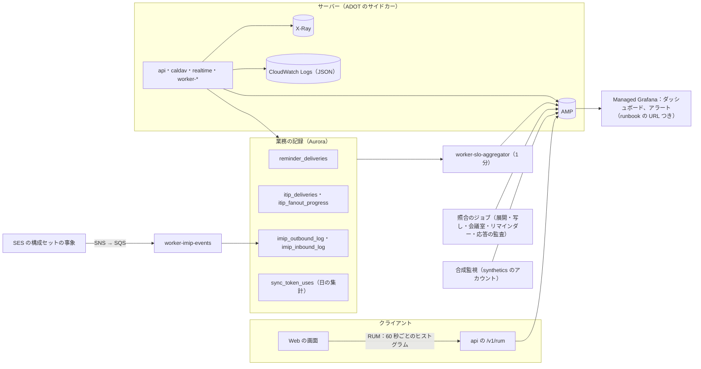

# Observability: Google Calendar

ログ・メトリクス・トレース、Web の画面の RUM、正しさの照合（展開の索引、写し、会議室の重なり、リマインダー、tzdb の版）と応答の監査、SLI の計測（リマインダーの遅れ、招待の伝播と配送の追跡、iMIP、差分の同期のトークンの健全さ）、アラートと runbook の対応、合成監視を決める。道具は他の題材と同じ（OpenTelemetry（ADOT）→ AMP、X-Ray、CloudWatch Logs、Managed Grafana）。

**SLO の値とアラートの一覧の正本は [runbooks/README.md](../runbooks/README.md)** にある。この文書は、その定義の計測とアラートの条件の実装を書く。値を変えるときは runbooks/README.md を先に変え、ここを合わせる。

| ADR | 決定 |
| --- | --- |
| [0046](../decisions/0046-sli-from-ledgers-and-delivery-tracing.md) | 正しさと遅れの SLI は、トレースの抜き取りではなく業務の記録から全件で数える。リマインダーの遅れは「回の通知の時刻」から「送信の開始」までにし、送らなかったものと遅れすぎたものを悪いイベントに数える。招待は `msg_id` を主催者のコミットから参加者の写し・iMIP・SES の事象まで運んで結ぶ |

## 1. 全体の流れ

## 2. 計装

### 2.1 中身を出さない

- ログ・トレース・メトリクス・RUM・エラーの報告に、予定の中身（タイトル、場所、説明、参加者の名前とメールアドレス、コメント）、検索の語、ICS の秘密のアドレスの経路、iMIP の受け口の `token`、Web Push の `endpoint`、トークンを出さない（[quality.md](../quality.md) の 3 節の eval、[security.md](security.md) の 7 節）。
- 出してよいもの：`tenant_id`、`calendar_id`、`event_object_id`、`recurrence_id`（壁時計の時刻＋TZID。中身ではない）、`msg_id`、`change_seq`、理由のコード、件数、大きさ、時間、版（`object_version`、`tzdata_version`、`SEQUENCE`）、クライアントの種類。
- アクセスのログは、経路の ID の部分を残し、問い合わせの部分を落とす。`ics.<brand>.<domain>` の秘密のアドレスの経路は残さない（[security.md](security.md) の 7 節）。
- `Authorization`、クッキー、`<Brand>-Signature` は、どの層でも伏せる。
- ログの秘密の形の走査（`<brand>_ap_` などの接頭辞、メールアドレスの形、VEVENT の行の形）を常時流し、見つけたら呼び出す。

### 2.2 トレース

- W3C Trace Context。`api`・`caldav` の要求ごとにトレースを始め、outbox の行と SQS のメッセージの属性で `traceparent` を Worker へ運ぶ。
- 招待の配送は、トレースとは別に `msg_id` で結ぶ（5.3 節）。トレースは抜き取りなので、全件の追跡には使わない。
- サンプリング：要求は 1%、エラーと 1 秒を超えるものは全部（テールサンプリング）。tzdb の再計算と範囲の端の維持のジョブは、ジョブの単位で 1 本。

### 2.3 メトリクスの次元

- `tenant_id` と `calendar_id` はメトリクスの次元にしない（数が多い）。テナントの大きさの帯（`tenant_band`：S・M・L・XL）を使う。
- カレンダーごとの値が要るもの（ロックの待ち、枠での拒否）は、上位 50 だけを 1 分ごとに別のメトリクス（`top_calendar_*`）に出し、残りはログの集計で見る。
- クライアントの種類（`client_kind`）：`web`、`api`、`caldav:ios`・`caldav:macos`・`caldav:thunderbird`・`caldav:davx5`・`caldav:other`（User-Agent を寄せる。主の版だけを `client_major` に）。

## 3. Web の画面の RUM

- 収集の口は自前（`https://api.<brand>.<domain>/v1/rum`）。外部の解析のサービスへ送らない（法務の L2 の外部送信規律に当たる送信を作らない）。
- 送るもの（60 秒ごとに端末で集めたヒストグラム）：

| 系統 | 中身 | 抜き取り |
| --- | --- | --- |
| 操作の遅延（NFR-001） | 操作の名前（週の表示、ドラッグ、作成、出欠）ごとの入力から描画まで | 端末の 10% |
| 表示 | 週の表示の窓あり・なしの時間、配置の計算の時間 | 端末の 10% |
| 伝播（NFR-002） | 合図の受信から差分の当てまで（サーバーの `committed_at` との差は時計の差を見積もって） | 端末の 10% |
| 取り直し | 410 の理由ごとの回数、窓の取り直しの回数 | 全部 |
| tzdata | 使っている版、取れなかった回数 | 全部 |
| エラー | スタック（ソースマップで戻す）、操作の名前、資産の版 | 全部 |

- RUM とトレースを結ばない（`traceparent` を送らない）。

## 4. 正しさの照合と応答の監査

本番での品質の検証（[quality.md](../quality.md) の 4.2 節）の計測を、この領域で実装する。

| 照合 | 頻度 | 中身 | 指標 |
| --- | --- | --- | --- |
| 展開の索引 | 毎時、予定オブジェクト 10,000 件 | その場の `expand()` と索引の行を比べる（[events-and-recurrence.md](events-and-recurrence.md) の 9.5 節） | `occurrence_mismatch_total{reason}`（`missing_row`・`extra_row`・`time_mismatch`・`stale_tzdata`） |
| 古い tzdb の版 | 5 分 | `active` と違う `tzdata_version` の索引の行の数（影響するゾーンだけ。分割ごとの集計） | `stale_tzdata_rows`、採用からの経過の時間 |
| 写し | 毎日 | 本システムの中の参加者の写しの版と主催者の写しの版（[ADR-0006](../decisions/0006-organizer-and-attendee-copies.md)） | `copy_drift_fixed_total`、写しの数に対する割合 |
| 会議室の重なり | 毎時 | 自動で承諾する会議室の、承諾した予約の重なり（排他の制約の外で数え直す） | `room_overlap_total` |
| リマインダー | 毎時 | 送るべきだった回と送信の記録（[ADR-0046](../decisions/0046-sli-from-ledgers-and-delivery-tracing.md)） | `reminder_missing_total`、`reminder_duplicate_total{dr_window}` |
| 応答の監査 | 常時、応答の 0.1% | API・CalDAV・ICS・空き時間の応答を抜き取り、`redact()` に通し直して、項目の有無を比べる。中身は記録しない | `redact_audit_mismatch_total{route}` |
| 変更のログの欠け | 5 分 | カレンダーごとの `change_seq` の連続（最近 1 時間に書いたカレンダー） | `change_seq_gap_total` |

- 応答の監査は、応答を返した後に非同期で行う（応答を遅らせない）。比べるのは「タイトル・場所・説明・参加者・添付・会議の URL の各項目があるか」の組だけで、値は比べない。
- 照合が見つけた不一致は、ID と理由のコードだけを `reconciliation_findings` に書く。調査はここから始める（[quality.md](../quality.md) の 4.3 節）。

## 5. SLI・SLO とアラート

### 5.1 SLI

ADR-0046。定義は [runbooks/README.md](../runbooks/README.md) の 1 節。ここは計測の場所。

| SLI（runbooks の行） | 計測 | 良いイベント | 窓 |
| --- | --- | --- | --- |
| 予定の読み書きの可用性 | CloudFront・`alb-dav` のログと、`api`・`caldav` の応答のメトリクス | 5xx・時間切れでない（4xx の検証の拒否は数えない） | 30 日 |
| 予約ページの可用性 | `book` の CloudFront と `booking` | 同上 | 30 日 |
| 書き込みの速さ | `api` の作成・変更のハンドラーの時間 | 300ms 以内 | 30 日の p99 |
| 範囲の読み出しの速さ | 範囲の問い合わせの時間（カレンダー 10 個以下の要求） | 300ms 以内 | 30 日の p95 |
| 伝播（同じ利用者の他の端末） | 合成監視（6 節）を正本、RUM を補い | 3 秒以内 | 30 日の p99 |
| 伝播（主催者 → 参加者の写し） | `itip_deliveries`（5.3 節） | 5 秒以内（200 人まで）、60 秒以内（超える分） | 30 日の p99 |
| リマインダーの時刻どおりの送信 | `reminder_deliveries`（5.2 節） | 画面・Web Push 30 秒以内、メール 2 分以内 | 30 日 |
| リマインダーの送り漏れ | 4 節の照合 | — | 件数 |
| 空き時間の探索 | 合成監視（50 人＋会議室 20、2 週間）を正本、`api` の候補の計算の時間を補い | 1 秒以内 | 30 日の p95 |
| 会議室の二重予約 | 4 節の照合 | — | 件数 |
| 権限の分離 | 4 節の応答の監査 | — | 件数 |
| 展開の正しさ | 4 節の照合と古い tzdb の版 | — | 件数 |
| 差分の同期 | `sync_token_uses`（5.4 節） | 変更 1,000 件以下の差分が 1 秒以内 | 30 日の p99 |
| iMIP | `imip_outbound_log`・`imip_inbound_log` | 送信 60 秒以内、受信 2 分以内 | 30 日の p95 |
| Webhook | `push-sender` の送信の記録 | 変更から最初の送信まで 30 秒以内 | 30 日の p95 |
| 検索 | `indexer` の遅れ、検索の応答の時間 | 30 秒以内、1 秒以内 | 30 日 |

- 社内の監視用のテナントは SLI から除き、別のラベルで出す。
- DR の窓（`dr_window`）の中のリマインダーの重複は、NFR-003 の重複の率から分けて報告する（[ADR-0044](../decisions/0044-disaster-recovery-and-calendar-side-effects.md)）。

### 5.2 リマインダーの遅れ

- `due_at` は、回の開始（展開の索引の `start_utc`）からリマインダーの分を引いた瞬間。予定が動いたら版が上がり、古い版の `due_at` は数えない。
- `started_at` は `notifier` が配信のサービス・SES への要求を始めた時刻、`handed_off_at` は受け付けの応答を受けた時刻。
- 悪いイベント：30 秒（メールは 2 分）を超えたもの、15 分を超えて送らなかったもの（計画の行の `skipped_late`）、照合の `missing`。
- 分布は、`due_at` の秒（`:00` の前後）ごとにも出す。毎時 0 分・30 分の集中で遅れが偏るかを見る（[capacity.md](capacity.md) の 3 節）。
- 内訳：`due_at` → タイマーホイールに載った時刻（前倒しの量）→ `started_at` → `handed_off_at`。前倒しの量が 2 分を切ったら、scheduler の遅れの兆候として見る。

### 5.3 招待の配送の追跡

- `msg_id` を、主催者の書き込みの outbox → SQS の属性 → `itip_deliveries` → 受け手の `calendar_changes.origin_msg_id` → `imip_outbound_log` → SES のメッセージのタグへ運ぶ（[ADR-0046](../decisions/0046-sli-from-ledgers-and-delivery-tracing.md)）。
- 運用の画面「招待の追跡」：`msg_id` か `event_object_id` を入れると、主催者のコミット、受け手ごとの当ての時刻と結果、外部への引き渡し、配達・Bounce・Complaint を時刻の順に並べる。中身（タイトル、メールアドレス）は出さず、受け手はテナントの ID・利用者の ID・外部はアドレスのハッシュで示す。
- 大きな招待（200 人を超える）は `itip_fanout_progress`（受け手の数、済みの数、最も遅い受け手の遅れ）を出す。
- 主な指標：`itip_propagation_seconds{band}`、`itip_delivery_queue_oldest_seconds`、`itip_stale_dropped_total`（新旧の判定で捨てた数）、`imip_handoff_seconds`、`imip_bounce_rate`、`imip_complaint_rate`、`imip_unverified_reply_total`、`imip_throttled_total`。

### 5.4 差分の同期のトークンの健全さ

| 指標 | 中身 | 見方 |
| --- | --- | --- |
| `sync_410_total{reason, client_kind}` | 410 の理由（`floor_seq`・`view_hash`・`epoch`・`token_invalid`）ごと | 平常の 3 倍（DR・tzdb の大きな再計算の直後を除く）でチケット（[quality.md](../quality.md) の 4.1 節） |
| `sync_400_filter_total{client_kind}` | 条件の違い | クライアントの不具合の兆候 |
| `sync_token_age_seconds{client_kind}` | 使われたトークンの年齢の分布 | 30 日に近いものが増えたら、保持を超える前に取り直しが増える兆候 |
| `sync_delta_size{client_kind}` | 差分の件数の分布 | 1,000 件を超える割合 |
| `sync_full_resync_total{client_kind}` | 全件の取り直し（範囲の問い合わせの窓の取り直し、`sync-token` なしの `sync-collection`） | 平常の 3 倍でチケット |
| `caldav_status_total{client_kind, client_major, status}` | CalDAV の応答の種類 | クライアントの版ごとの 4xx の急な上がり（`caldav-client-regression.md`） |

- `sync_token_uses` は、カレンダー × クライアントの種類 × 日の集計の表（行は日に 1 つ）。要求ごとの記録は持たない。

### 5.5 バーンレート

他の題材と同じマルチウィンドウのバーンレート（1 時間・5 分で 14.4、6 時間・30 分で 6 を呼び出し、3 日・6 時間で 1 をチケット）を、可用性とリマインダーの時刻どおりの送信の SLI に使う。すべてのアラートは、対応する runbook の URL を注釈に持つ（CI で検査する）。

### 5.6 アラートの一覧と runbook

[runbooks/README.md](../runbooks/README.md) の 4 節の一覧に、条件を付けたもの。手順のファイルができるまでは `incident-response.md` で対応する。

| アラート | 条件 | 重さ | 手順 |
| --- | --- | --- | --- |
| 予定の読み書きの SLO | 5.5 節 | 呼び出し・チケット | `incident-response.md` |
| 書き込みの遅れ | 書き込みの p99 が 1 秒を 10 分 | 呼び出し | `incident-response.md` |
| カレンダーのロックの待ち | 上位のカレンダーの p99 200ms が 10 分 | チケット | `calendar-lock-contention.md` |
| 伝播の遅れ（主催者 → 参加者の写し） | p99 が 30 秒を 10 分 | 呼び出し | `itip-delivery-lag.md` |
| 配送の滞留 | SQS の最古 60 秒 | 呼び出し | `itip-delivery-lag.md` |
| 写しの照合の食い違いの増加 | 直した数が 1 日 0.01% 以上 | チケット | `attendee-copy-drift.md` |
| 展開の索引の照合の不一致 | 1 件。施行まで 7 日を切った tzdb の改正の後は呼び出し | チケット・呼び出し | `occurrence-index-mismatch.md` |
| 古い `tzdata_version` の行 | 採用から 24 時間の後に 1 行以上。施行まで 24 時間を切ったら SEV2 | チケット・呼び出し | `tzdb-update.md` |
| tzdb の新しいリリースの未採用 | IANA のリリースから 7 日、または施行まで 14 日を切った | チケット | `tzdb-update.md` |
| AppConfig の `tzdata.active_version` の不一致 | タスクの報告する版が 2 種類以上で 5 分、または東京と大阪で違う | 呼び出し | `tzdb-update.md` |
| 会議室の二重予約 | 1 件 | 呼び出し（SEV2 から） | `room-double-booking.md` |
| 権限の漏れの疑い | 応答の監査の不一致 1 件 | 呼び出し（SEV1 の候補） | `access-leak-response.md` |
| リマインダーの遅れ | 5 分の窓で 1% を超えて遅れた | 呼び出し | `reminder-delay.md` |
| リマインダーの送り漏れ | 1 件でチケット、100 件で呼び出し | チケット・呼び出し | `reminder-delay.md` |
| scheduler の停止 | シャードの担当がない時間が 30 秒、前倒しの量が 0 | 呼び出し | `reminder-delay.md` |
| SES の送信の停止・Bounce の率 | 送信のエラーが 5 分続く、Bounce 5%・Complaint 0.1% | 呼び出し・チケット | `email-delivery.md` |
| iMIP の受信の滞留 | 受信のキューの最古 5 分 | チケット | `email-delivery.md` |
| 迷惑な招待の急増 | 自動の停止の数、報告の数が平常の 5 倍 | チケット | `invite-abuse.md` |
| 差分の同期の 410 の急増 | 5.4 節 | チケット | `sync-token-reset-spike.md` |
| 変更のログの欠け | `change_seq_gap_total` 1 件 | 呼び出し（SEV2） | `incident-response.md` |
| Realtime の再接続の殺到 | 1 分の新しい接続が平常の 10 倍 | チケット | `realtime-reconnect-storm.md` |
| CalDAV の 4xx の急な上がり | クライアントの版ごとに平常の 3 倍を 30 分 | チケット | `caldav-client-regression.md` |
| Webhook の送信の失敗の増加 | 失敗の率 20% を 30 分、最初の送信の p95 5 分 | チケット | `webhook-delivery.md` |
| ICS の購読の取得の失敗の増加 | 失敗の率が平常の 3 倍 | チケット | `ics-subscription-failures.md` |
| 予約ページのボットの急増 | WAF の拒否が平常の 10 倍 | チケット | `booking-abuse.md` |
| 検索の更新の遅れ | p95 5 分 | チケット | `search-index-lag.md` |
| デプロイ中の自動ロールバック、Web の段階の止める条件 | [delivery.md](delivery.md) の 4・5 節 | 呼び出し | `deploy-and-rollback.md` |
| DR の複製の遅延 | `AuroraGlobalDBRPOLag` 10 秒を 5 分 | 呼び出し | `disaster-recovery.md` |
| 大阪の待機の構成の異常 | [infrastructure.md](infrastructure.md) の 6.5 節の確認の失敗 | チケット（30 分で呼び出し） | `disaster-recovery.md` |
| 秘密の出力の検出 | 2.1 節の走査で 1 件以上 | 呼び出し（SEV2） | `incident-response.md` |
| シークレットスキャンの通知 | 本システムの接頭辞の秘密の公開の検知 | 呼び出し | `credential-compromise.md` |
| 監査ログのハッシュの連鎖の検証の失敗 | 日次のジョブ | 呼び出し（SEV2） | `incident-response.md` |
| SLI の集計の欠け | `slo-aggregator` の出力が 5 分ない | 呼び出し | `incident-response.md` |

- 呼び出しのアラートは、SLO か、分離・正しさ・秘密の症状に限る。原因の側の指標（CPU など）はチケットとダッシュボードにとどめる。
- 新しく足したアラート（tzdb の未採用、AppConfig の版の不一致、変更のログの欠け、SLI の集計の欠け、シークレットスキャン）は、統合の工程で [runbooks/README.md](../runbooks/README.md) の 4 節に足した（2026-10-04）。

## 6. 合成監視

| 監視 | 内容 | 頻度 | 置き場所 |
| --- | --- | --- | --- |
| 伝播（同じ利用者） | 監視用のテナントの利用者で、Web の API のクライアント A と B（WebSocket の合図と差分）。A が予定を変え、B の差分の当てまでを同じ時計で測る | 常時（10 秒ごと） | 東京の 2 AZ（synthetics のアカウント、CloudFront 経由） |
| 伝播（主催者 → 参加者） | 監視用の 2 つのテナントの主催者と参加者。主催者の変更から参加者の写しの差分の到着まで | 1 分 | 同上 |
| CalDAV | 監視用のアプリ用のパスワードで `PROPFIND`・`REPORT`（`sync-collection`）・`PUT`・`DELETE`。Web の API で変えた予定が `sync-collection` に出るまで | 1 分 | 同上（`alb-dav` 経由） |
| iMIP の往復 | 監視用の外部のメールのアカウント（合成のドメイン）へ招待を送り、自動の返事を受けて主催者の写しに当たるまで | 5 分 | 同上 |
| リマインダー | 監視用の利用者に、毎時 0 分・30 分の回のリマインダー（画面・Web Push・メール）。届いた時刻と `due_at` の差 | 毎時 0・30 分 | 同上（Web Push は監視用の受け手） |
| 空き時間の探索 | 監視用のテナントの 50 人＋会議室 20 の 2 週間の候補 | 5 分 | 同上 |
| 予約ページ | 監視用の予約ページで枠を取り、予約し、取り消す | 5 分 | 同上 |
| tzdata | `/tzdata/<active>/Asia/Tokyo.bin` を取り、API の `tzdata_version` と同じか | 5 分 | 同上 |
| 大阪 | 大阪の `alb-app`・`alb-dav` へ直接、読み出しだけ。大阪の SES の受信へのテストのメール | 1 分・15 分 | 大阪 |

- 監視用のテナントは本番の基盤の上に置き、SLI では除いて別に見る。合成のメールアドレスは予約済みのドメインか、自社の監視用のドメインにする（[AGENTS.md](../../AGENTS.md) の「テストに本物のデータを使わない」）。

## 7. ダッシュボード

| ダッシュボード | 中身 |
| --- | --- |
| 予定と同期 | 書き込み/秒、範囲の読み出し、差分、410・400 の理由、クライアントの種類ごとの取り直し、Realtime の接続 |
| 招待 | 伝播の帯ごとの p99、配送のキュー、捨てた古いメッセージ、写しの照合、iMIP の送受信、Bounce・Complaint、未確認の返事、自動の停止 |
| リマインダー | `due_at` の秒ごとの遅れの分布、前倒しの量、送り漏れ、重複（DR の窓を分けて）、方法ごとの送信の数 |
| 正しさ | 展開の索引の照合、古い tzdb の版の行、会議室の重なり、応答の監査、変更のログの欠け |
| tzdb | `active` の版、タスクの報告する版、東京と大阪の一致、再計算の進み具合（`tz_recompute_runs`）、IANA の最新の版と施行までの日数 |
| CalDAV | クライアントの種類と版ごとの要求・応答の種類・時間、認証の失敗 |
| 容量 | 段階を上げる指標（[infrastructure.md](infrastructure.md) の 10 節）、カレンダーの上位 50 のロックの待ちと枠の拒否 |
| DR | 複製の遅延、大阪の合成監視、AppConfig の一致 |

## 8. ログの保持とアクセス

- アプリのログ：CloudWatch Logs 30 日、log-archive 13 か月（[ADR-0042](../decisions/0042-audit-log-and-data-lifecycle.md)）。中身を含めない。
- トレース：X-Ray の既定の保持。
- RUM の生のヒストグラム：AMP に集めた値だけを持ち、生の報告は 7 日で消す。
- 業務の記録（`reminder_deliveries` 35 日、`itip_deliveries` 14 日（その後は日ごとの集計を 90 日）、`imip_outbound_log` 90 日、`sync_token_uses` 90 日）：[ADR-0042](../decisions/0042-audit-log-and-data-lifecycle.md) の保持の表に入れる。
- 運用の画面（招待の追跡など）は、Ops とサポートのロールだけが読む。読んだことをプラットフォームの監査に残す。

## 9. テスト

- **結合テスト**：リマインダーの時計の試験（[quality.md](../quality.md) の 2.2.1 節 F）で、送らなかった回が照合で `missing` になり、SLI の悪いイベントに数えられる（[ADR-0046](../decisions/0046-sli-from-ledgers-and-delivery-tracing.md)）。
- **結合テスト**：200 人の招待で、`msg_id` から全受け手の `itip_deliveries` と、外部の参加者の `imip_outbound_log` が引ける。
- **結合テスト**：応答の監査が、わざと削り忘れた応答（試験用の経路）を不一致に数える。
- **ログの走査の試験**：合成の予定のタイトル・メールアドレス・秘密を含むログを流し、走査が見つける。CI で、ログを出すコードに予定オブジェクトをそのまま渡す呼び出しを禁止する（lint）。
- **アラートの試験**：すべてのアラートに runbook の URL がある（CI）。staging で、主なアラート（伝播の遅れ、リマインダーの遅れ、古い tzdb の版）を障害の注入で起こして鳴ることを確かめる（E12）。

## 10. Story の候補

| Epic | Story | 中身 |
| --- | --- | --- |
| E1 | `otel-baseline` | 2 節、ログの形、中身を出さない規則と走査 |
| E1 | `slo-dashboards-alerts` | 5 節、5.6 節のアラート、7 節のダッシュボード |
| E1 | `slo-aggregator` | ADR-0046 の記録からの SLI の集計 |
| E2 | `occurrence-reconciliation-metrics` | 4 節の展開の索引の照合の指標（events-and-recurrence と共同） |
| E3 | `tzdata-version-telemetry` | 4 節の古い版の行、5.6 節の版の不一致（time-zones-and-holidays・delivery と共同） |
| E4 | `redact-response-audit` | 4 節の応答の監査（sharing-and-acl と共同） |
| E5 | `itip-delivery-tracing` | 5.3 節の `msg_id` の運び、`itip_deliveries`、運用の画面「招待の追跡」 |
| E5 | `ses-event-ingest` | SES の構成セットの事象の取り込み（`worker-imip-events`） |
| E7 | `web-rum` | 3 節（clients と共同） |
| E8 | `sync-health-metrics` | 5.4 節、`sync_token_uses` |
| E9 | `reminder-sli` | 5.2 節、照合の `missing`（reminders-and-notifications と共同） |
| E12 | `synthetics-suite` | 6 節の合成監視 |

## 11. 未解決の問い

### 決定

2026-10-04 の既定案。E12 で覆りうる。

- **SLI の数え方**：業務の記録から全件（ADR-0046）。
- **リマインダーの遅れ**：`due_at` から送信の開始まで、送らなかったものと遅れすぎを悪いイベントに（ADR-0046）。
- **招待の追跡**：`msg_id` を端から端まで運ぶ（ADR-0046）。
- **応答の監査**：応答の 0.1% を非同期で、項目の有無だけを比べる（4 節）。
- **合成監視のリマインダー**：毎時 0・30 分に、3 つの方法で（6 節）。

### 持ち越し

| 問い | いつ・どう決めるか |
| --- | --- |
| 応答の監査の抜き取りの率（0.1%）が漏れを見つけるのに十分か | E4 の後、経路の数と応答の数で見直す |
| Web Push の配達（端末に出たか）を測るか | reminders-and-notifications の領域。配信のサービスの受け付けまでしか測れない見込み |
| RUM の収集が外部送信規律に当たるか | **法務の確認待ち：L2** |
| `sync_token_uses` の集計の粒度（カレンダー × 日）で、調査に足りるか | E8 の後 |

## 12. quality.md・runbooks・data-model への項目

### quality.md

- 4 節の照合と応答の監査を、[quality.md](../quality.md) の 4.2 節の本番での検証の実装とする。
- 品質の判定基準の「差分の同期の 410 の率」は、5.4 節の理由ごとの指標で見る（DR・tzdb の再計算の直後を除く）。
- リマインダーの重複の率から、DR の窓（`dr_window`）を分ける。

### runbooks

- [runbooks/README.md](../runbooks/README.md) の 4 節に、次のアラートを足した（統合の工程、2026-10-04）：tzdb の新しいリリースの未採用、AppConfig の `tzdata.active_version` の不一致、変更のログの欠け、SLI の集計の欠け、シークレットスキャンの通知（手順は `tzdb-update.md`、`incident-response.md`、`credential-compromise.md`）。
- `reminder-delay.md` に、5.2 節の内訳（前倒しの量、`started_at`、`handed_off_at`）の読み方を入れる。

### data-model（索引への追加の提案）

| 表 | 中身 | 節 |
| --- | --- | --- |
| `reminder_deliveries` に足す列（reminders-and-notifications と共同） | `due_at`、`wheel_loaded_at`、`started_at`、`handed_off_at`、`outcome`、`dr_window` | 5.2 |
| `itip_deliveries` | `(tenant_id, msg_id, recipient_key)`、`organizer_committed_at`、`applied_at`、`outcome`、`band`。日の分割、14 日 | 5.3 |
| `itip_fanout_progress` | `msg_id`、受け手の数、済みの数、最も遅い遅れ | 5.3 |
| `calendar_changes` に足す列 | `origin_msg_id` | 5.3 |
| `imip_outbound_log` に足す列（invitations-and-itip と共同） | `msg_id`、`ses_message_id`、`queued_at`、`handed_off_at`、配達の事象 | 5.3 |
| `sync_token_uses` | `(tenant_id, calendar_id, client_kind, day)`、使用の数、410 の理由ごとの数、差分の件数・時間の要約、トークンの年齢の要約 | 5.4 |
| `reconciliation_findings` | 照合の種類、対象の ID、理由のコード、見つけた時刻、直した時刻 | 4 |

## 出典

- 他の題材の observability.md（Linear、Slack、Auth0）から引き継いだ道具とバーンレートの値は、その文書に従う。
- この文書に本家の事実はない。本家の監視・SLI の作り方は公開の資料にない（**未検証**。2026-10-04 に確認）。
