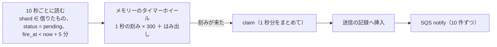
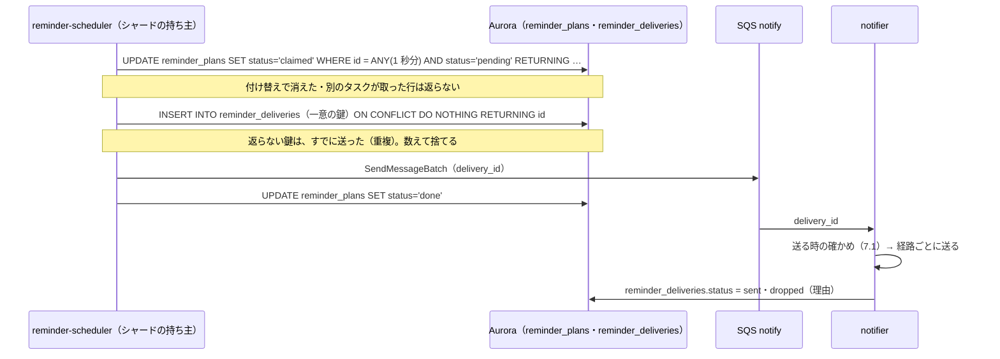
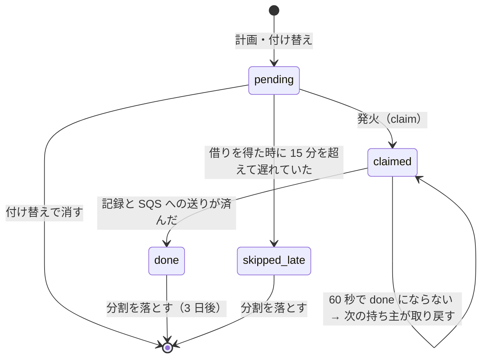

# Reminders and Notifications: Google Calendar

リマインダーの設定と、だれに送るか、リマインダーの計画（分の桶の表と、予定の変更での付け替え）、時計（シャードごとのタイマーホイール）、送信の記録と重複の除去、送る時の確かめ、画面の通知・Web Push・メール、招待・変更・取り消し・返事の通知、毎朝の予定の一覧、送り漏れの照合を決める。

前提となる決定は、時刻の表し方（[ADR-0002](../decisions/0002-time-representation.md)）、繰り返しの保存と展開（[ADR-0003](../decisions/0003-recurrence-storage-and-expansion.md)）、テナントと権限（[ADR-0004](../decisions/0004-tenancy-and-rls.md)）、変更のログ（[ADR-0005](../decisions/0005-change-log-and-sync-tokens.md)）、写し（[ADR-0006](../decisions/0006-organizer-and-attendee-copies.md)）、展開の索引の維持（[ADR-0010](../decisions/0010-occurrence-index-maintenance.md)）、tzdb の更新の再計算（[ADR-0012](../decisions/0012-tzdb-update-recompute-and-propagation.md)）、iMIP のアドレス（[ADR-0015](../decisions/0015-imip-addressing-and-trust.md)）。この文書で決めたことは次の ADR にある。

| ADR | 決定 |
| --- | --- |
| [0029](../decisions/0029-reminder-clock-buckets-and-timer-wheel.md) | リマインダーの時計は、Aurora の分の桶の表（`reminder_plans`、発火の日で分割、利用者のハッシュで 256 のシャード）と、シャードを借りた `reminder-scheduler` のタスクのメモリーのタイマーホイール（1 秒の刻み、5 分先まで）の組み合わせにする。発火は、計画の行を `pending` から `claimed` に変える 1 回の更新と、送信の記録（`reminder_deliveries`）への一意の鍵の挿入で行い、挿入できたものだけを notifier へ渡す。15 分を超えて遅れたものは送らずに数える |
| [0030](../decisions/0030-reminder-planning-horizon-and-replan.md) | リマインダーの計画は、今から 7 日先までの回だけを桶に置き、毎時の `reminder-planner.advance` が端を進める。予定オブジェクト・出欠・リマインダーの設定・カレンダーのタイムゾーン・tzdb の再計算の変更は、outbox の `reminder.replan` で、その（利用者, 予定オブジェクト）の待ちの行を作り直す。時刻つきの予定は UTC の瞬間から分を引き、終日と浮動の予定は壁時計の時刻で分を引いてから `resolve` する。送信の記録の一意の鍵は（利用者, 予定オブジェクト, `recurrence_id`, 方法, 分, 回の開始）で、バージョンは鍵に入れず古さの確かめに使う |
| [0031](../decisions/0031-notification-channels-and-content.md) | 通知の経路は画面の通知・Web Push・メールの 3 つ。送る時に `redact()` と出欠を確かめ直す。Web Push の本文には通知の ID だけを入れ、Service Worker が本システムから中身を取って表示する（予定の中身を外国の配信のサービスへ渡さない）。招待・変更・取り消し・返事の通知は、受け手と予定ごとに 2 分まとめる。毎朝の予定の一覧は、利用者のタイムゾーンの 06:00 に、計画の表の `agenda` の行として送る |

## 1. 目的と範囲

- 扱う：
  - 予定ごと・カレンダーごとのリマインダーの設定、VALARM との対応
  - だれにリマインダーを送るか（出欠、写しの状態、共有のカレンダー）
  - リマインダーの計画、付け替え、時計、送信の記録、送り漏れの照合
  - 画面の通知、Web Push（VAPID）、メールの送り方
  - 招待・変更・取り消し・返事・保留の招待の通知（本システムの中の人へ）
  - 毎朝の予定の一覧
- 扱わない：
  - 外部の参加者への iMIP（[invitations-and-itip.md](invitations-and-itip.md)）
  - 予約ページの予約者へのメール（[booking-pages.md](booking-pages.md)。送る部品はこの文書の 7.4 節を使う）
  - Service Worker と Web Push の登録の画面、PWA（[clients.md](clients.md)）
  - メールの送信のドメインの認証と SES の構成（[infrastructure.md](infrastructure.md)）
  - Realtime の WebSocket（[clients.md](clients.md)、[infrastructure.md](infrastructure.md)）

## 2. 要件

| 要件 | 目標 | NFR・基準 |
| --- | --- | --- |
| 時刻どおり | 通知の時刻から送信の開始まで p99 30 秒（画面・Web Push）。メールの送信事業者への引き渡し p95 2 分 | NFR-003 |
| 重複 | 予定の回・方法ごとに重複の送信 0.01% 未満 | NFR-003、K6 |
| 送り漏れ | 0 件（予定の回とリマインダーの設定からの照合で数える） | NFR-003、K6 |
| 古い時刻 | 予定が動いた・消えた後に、古い時刻のリマインダーを送らない | [intent.md](../intent.md) の「守るべき振る舞い」 |
| 可用性 | 時刻どおりの送信 月間 99.9% | NFR-006 |
| 集中 | S1 で 3,000 件/秒（毎時 0 分・30 分の直前） | [architecture/README.md](README.md) の 2 節 |
| 一致 | リマインダーの時刻が、画面・API・CalDAV の回と同じ瞬間から求まる | NFR-009 |
| 漏れ | 通知の本文に、見てはいけない中身を入れない | NFR-008 |

## 3. 本家の形（確かめたこと）

いずれも 2026-10-04 に確認。

| 項目 | 内容 | 出典 |
| --- | --- | --- |
| リマインダーの上書き | 予定ごとに最大 5 件、0〜40,320 分。方法は `email`・`popup` | [Events resource](https://developers.google.com/workspace/calendar/api/v3/reference/events) |
| 通知の方法 | メール、デスクトップの通知（カレンダーを開いているとき、ブラウザの外に出る）、画面の中のアラート | [Change Google Calendar notifications](https://support.google.com/calendar/answer/37242) |
| 既定 | カレンダーの単位の設定が、新しい予定の通知を決める。予定ごとに変えられる。「予定の通知」と「終日の予定の通知」を別に持つ | 同上 |
| 種類ごとのメール | 「変更された予定」「予定への返事」などの種類ごとに、メールか、なしを選べる | 同上 |
| 毎朝の一覧 | 設定の「その他の通知」の「毎日の予定」で、メールを選ぶと受け取れる（既定は「なし」） | [Tips to manage your time in Calendar](https://support.google.com/a/users/answer/9282964) |

- 本家の毎朝の一覧を送る時刻、リマインダーの時計の仕組み、遅れたリマインダーの扱い、重複の扱いは、公開の資料にない（**未検証**）。
- 本家の終日の予定の通知の既定（「前日の何時」など）は、上の文書に値がない（**未検証**）。

## 4. 設定と対象

### 4.1 リマインダーの設定

| 単位 | 中身 | 上限 |
| --- | --- | --- |
| 予定（自分の写し） | `reminders.useDefault` か `overrides[{method, minutes}]` | 5 件、0〜40,320 分（本家と同じ） |
| カレンダーの一覧の項目（利用者 × カレンダー） | `defaultReminders`（時刻つきの予定）、`defaultAllDayReminders`（終日の予定） | 各 5 件 |
| 利用者の設定 | 通知の経路ごとの有効・無効、種類ごとのメール（8 節）、毎朝の一覧（9 節） | — |

- 方法は `popup`（画面の通知と Web Push）と `email`。
- 終日の予定の分は、その日の 00:00（持ち主のカレンダーのタイムゾーンの壁時計）から引く。例：`minutes = 900` は前日の 09:00。
- 主催者の写しと参加者の写しは、それぞれの持ち主のリマインダーを持つ（参加者の自分の項目。[ADR-0006](../decisions/0006-organizer-and-attendee-copies.md)）。

VALARM との対応（CalDAV・ICS・iMIP）：

| VALARM | 本システム |
| --- | --- |
| `ACTION:DISPLAY`、`TRIGGER:-PT10M`（開始に対する負の長さ） | `popup`、10 分 |
| `ACTION:EMAIL` | `email`（宛先は持ち主。VALARM の ATTENDEE は使わない） |
| `TRIGGER;VALUE=DATE-TIME`（絶対の時刻） | 単発の予定なら開始との差の分にする。繰り返しは受けず、数える |
| `TRIGGER;RELATED=END`、正の長さ（開始の後） | 受けず、数える |
| `ACTION:AUDIO` | `popup` にする（本家は `AUDIO` を持たない。3 節の CalDAV の非対応） |
| 6 件目以降 | 捨てて、数える |

- 取り込んだ ICS と iMIP の招待の VALARM は使わない。送り手のアラームを受け手に当てない（受け手の既定を使う）。CalDAV で利用者自身が `PUT` した VALARM だけを使う（[sync-and-caldav.md](sync-and-caldav.md) の 7.2 節）。

### 4.2 だれに送るか

DT-REM-001。予定の回ごとに、利用者 U について上から当てる。

| # | 条件 | → 送るか |
| --- | --- | --- |
| 1 | U が停止・削除されている、通知の経路がすべて無効 | 送らない |
| 2 | 写しが `cancelled`・`hidden`、回が取り消し（EXDATE、`status=cancelled`） | 送らない |
| 3 | 保留の招待（[invitations-and-itip.md](invitations-and-itip.md) の 4.3 節） | 送らない |
| 4 | U の写しで、U の出欠がその回で `declined` | 送らない |
| 5 | U の自分のカレンダー（主催者の写し・参加者の写し・単独の予定） | 予定の設定（なければカレンダーの一覧の既定） |
| 6 | U が `reader` 以上で共有されたカレンダーで、`redact()` が全体を返す | カレンダーの一覧の項目の既定だけ（予定ごとの上書きは持たない） |
| 7 | 共有されたカレンダーで、`redact()` が区間だけを返す（`private` の予定、`free_busy_reader`） | 送らない |
| 8 | ICS の購読、祝日 | カレンダーの一覧の項目の既定（既定は空） |

- 行 6 は、同じ予定の参加者の写しを U が持てば、行 5 が先に当たる（同じ会議の 2 重のリマインダーを避けるため、U が参加者の写しを持つ予定は、共有のカレンダーの側で送らない）。
- 未回答（`needs_action`）と仮承諾（`tentative`）は送る。

## 5. 計画

ADR-0030。

### 5.1 計画の行

`reminder_plans`（保守用のスキーマ。RLS の外。ID と時刻だけで、予定の中身を持たない）：

| 列 | 意味 |
| --- | --- |
| `id` | UUIDv7 |
| `fire_at` | 送る時刻（UTC、秒） |
| `fire_day` | 分割の鍵（`fire_at` の UTC の日） |
| `shard` | `hash(user_id) mod 256` |
| `tenant_id`・`user_id`・`calendar_id`・`event_object_id`・`recurrence_id` | 対象 |
| `occurrence_start_utc` | 計画した時の回の開始 |
| `kind`・`method`・`minutes` | `reminder`・`agenda`・`booker`（予約者へのリマインダー。`user_id` の代わりに `booking_id`。[booking-pages.md](booking-pages.md) の 8 節）、`popup`・`email`、分 |
| `plan_version` | 計画した時の予定オブジェクトのバージョン（`agenda` は利用者の設定のバージョン） |
| `status` | `pending`・`claimed`・`done`・`skipped_late`（6.4 節） |
| `claimed_at`・`claimed_by` | 借りたタスク |

- 索引：`(shard, fire_at) WHERE status = 'pending'`、`(tenant_id, user_id, event_object_id)`。
- 分の桶：同じ分の行は `fire_at` の索引で隣り合う。時計は分ごとにまとめて読む（6.2 節）。「分の桶」は表の分け方ではなく、読み方の単位である。
- 保守用のスキーマに置くのは、時計が全部のテナントの行を読むためである。テナントの行（予定の中身）は、notifier がテナントのコンテキスト（`SET LOCAL`）で読む。[time-zones-and-holidays.md](time-zones-and-holidays.md) の `tenant_tz_usage` と同じ置き方で、[ADR-0004](../decisions/0004-tenancy-and-rls.md) のテナントをまたぐ経路の許可リストの X5 と、RLS の外の表の一覧に入れた（統合の工程）。

### 5.2 計画の範囲

- 今から 7 日先（`[now − 15 分, now + 7 日]`）の回だけを桶に置く。
- `reminder-planner.advance` が毎時、新しく範囲に入った 1 時間分（`[now + 7 日, now + 7 日 + 1 時間)`）を、展開の索引から足す。リマインダーの分は最大 40,320 分（28 日）なので、範囲の端は「回の開始」ではなく「送る時刻」で数える：送る時刻が新しい 1 時間に入る（回, 分）を足す。そのため、展開の索引を `[now + 7 日, now + 35 日 + 1 時間)` の範囲で読む。
- S1 の見積もり：利用者 60 万 × 1 日 5 件 × 7 日 ≒ 2,100 万行。日の分割で、送った日の分割を 3 日後に落とす。

### 5.3 付け替え

DT-REM-002。outbox の `reminder.replan { tenant_id, user_id?, calendar_id, event_object_id, version }` を出す事象。

| 事象 | 出す元 | 対象 |
| --- | --- | --- |
| 予定オブジェクトの作成・変更・削除（自分の写し） | `packages/writer` | その写しの持ち主 |
| 参加者の写しへの主催者の変更の当て込み | `itip-delivery`（受け手のテナントの `packages/writer`） | 受け手 |
| 自分の出欠の変更 | `packages/writer` | 自分 |
| 予定のリマインダーの変更 | `packages/writer` | 自分 |
| カレンダーの一覧の既定の変更 | `packages/writer` | 自分。そのカレンダーの、範囲の中の全部の予定（1,000 件ずつ） |
| 共有のカレンダーの予定の変更 | `packages/writer` | そのカレンダーを既定のリマインダーつきで一覧に持つ利用者（`calendar_list_reminder_subscribers`） |
| ACL・公開範囲の変更 | `packages/writer` | 影響する利用者 |
| カレンダーのタイムゾーンの変更（浮動・終日） | `expander`（[time-zones-and-holidays.md](time-zones-and-holidays.md) の 5.3 節） | 持ち主 |
| tzdb の再計算 | `expander`（[ADR-0012](../decisions/0012-tzdb-update-recompute-and-propagation.md)） | 写しの持ち主 |
| 利用者のタイムゾーンの変更 | `packages/writer` | 自分の `agenda` |

`reminder-planner`（Worker）の処理：

1. （利用者, 予定オブジェクト）の頭のバージョン `reminder_plan_heads.version` を読む。届いた `version` 以下なら捨てる（順序の入れ替わりと重複）。
2. テナントのコンテキストで、予定オブジェクトの範囲の中の回を展開の索引から読み、DT-REM-001 と設定から（回, 方法, 分）の一覧を作る。
3. 1 つのトランザクションで、その（利用者, 予定オブジェクト）の `pending` の行を消し、新しい行を入れ、頭のバージョンを上げる。`claimed`・`done` の行は消さない。
4. `fire_at < now − 15 分` の行は作らない。`now − 15 分 ≤ fire_at < now` の行は作る（遅れて届いた付け替えで、まだ送っていなければ送る。重複は送信の記録の鍵で消える）。

- 付け替えの遅れ（予定の確定から行の作り直しまで）の目標は p99 10 秒。10 秒より近い先のリマインダーは、古い行のまま発火しうるが、notifier の送る時の確かめ（7.1 節）が古い時刻のものを捨てる。

### 5.4 送る時刻の計算

| 時刻の種類（[ADR-0002](../decisions/0002-time-representation.md)） | `fire_at` |
| --- | --- |
| `zoned`・`utc` | `occurrence.start_utc − minutes` |
| `floating` | 壁時計の開始から `minutes` を引いた壁時計の時刻を、持ち主のカレンダーのタイムゾーンで `resolve` |
| `date` | その日の 00:00 から `minutes` を引いた壁時計の時刻を、持ち主のカレンダーのタイムゾーンで `resolve` |
| `agenda` | 利用者のタイムゾーンの、その日の 06:00 を `resolve` |

- `resolve` は `packages/tz` の 1 つの関数（存在しない時刻はずらす。[ADR-0002](../decisions/0002-time-representation.md)）。
- **例 1（時刻つき）**：毎週火曜 10:00 `America/New_York` の会議、10 分前。2027-03-16（火、EDT）の回は 14:00Z 開始、`fire_at` は 13:50Z。
- **例 2（終日、夏時間をまたぐ）**：2027-03-15（月）の終日の予定、持ち主のカレンダーは `America/New_York`、`minutes = 2340`（前々日の 09:00）。2027-03-14 の 02:00 に夏時間に入るので、03-13 の 09:00 から 03-15 の 00:00 までは 38 時間しかない。壁時計で引くので、3 月 13 日 09:00 EST（14:00Z）に送る。03-15 の 00:00 EDT（04:00Z）から UTC で 2340 分を引くと 03-13 の 13:00Z、つまり 08:00 EST になり、意図とずれる（統合の工程で例を直した。前の例の「前日の 09:00」は切り替えをまたがず、ずれが出ない）。

## 6. 時計

ADR-0029。

### 6.1 シャードと借り

- 256 のシャードを、`reminder-scheduler` のタスクが借りる。借りは `reminder_shard_leases(shard, owner, lease_until)` に、30 秒の期限で書き、10 秒ごとに延ばす。
- タスクが増減したら、各タスクは `256 / タスクの数` を目安に、期限の切れたシャードを借り、多すぎるシャードを手放す。
- S1：4 タスク（各 64 シャード）。集中の前（毎時 55 分・25 分）に、時刻での自動の増減で 8 タスクにする。

### 6.2 タイマーホイール

- ホイールは 1 秒の刻みで 300 の枠（5 分）を持つ。5 分より先の行は、読み直しで入る。
- 読み直しでは、読んだ最大の `fire_at` を覚え、次はその後ろから読む。付け替えで消えた行はホイールに残りうるが、claim で落ちる（6.3 節）。
- 借りを得た直後は、`fire_at ≥ now − 15 分` の `pending` の行と、`claimed_at < now − 60 秒` で記録のない `claimed` の行を読む（前の持ち主が止まった分の取り戻し）。

### 6.3 発火

- 送信の記録の一意の鍵：`(tenant_id, user_id, event_object_id, recurrence_id, method, minutes, occurrence_start_utc)`（ADR-0030）。
  - バージョン（`plan_version`）は鍵に入れず、列に持つ。バージョンを鍵に入れると、タイトルだけの変更（バージョンが上がる）の後に、遅れて作り直した行がもう一度送られるためである。古い時刻の行を送らない役目は、付け替えでの行の削除と、notifier の確かめ（7.1 節）が持つ。最初の設計の `(reminder_id, occurrence_start, method, version)` の書き方は、統合の工程で [architecture/README.md](README.md) の 1.3 節・題材の `AGENTS.md`・[ADR-0046](../decisions/0046-sli-from-ledgers-and-delivery-tracing.md) とも、この鍵に揃えた（2026-10-04）。
- 1 つの刻みの行は 5,000 件まで 1 回の更新にする。超えたら分けて続けて行う。
- 時計の時刻は、タスクの時計（NTP で同期した ECS の時計）を使う。DB の `now()` と比べない。

### 6.4 計画の行の状態

### 6.5 止まったときの取り戻し

| 止まった所 | 起きること | 取り戻し |
| --- | --- | --- |
| claim の前 | 行は `pending` のまま | 借りの期限（30 秒）の後、次の持ち主が読む。遅れは最大 40 秒 |
| claim の後・記録の前 | 行は `claimed`、記録なし | 次の持ち主が 60 秒の後に記録を挿入する |
| 記録の後・SQS の前 | 記録は `queued`、notifier に届かない | 毎分の `reminder-requeue` が、`queued` で 60 秒を過ぎた記録を SQS に入れ直す |
| SQS の後・送りの途中 | notifier が止まる | SQS の可視性の期限（60 秒）の後に別の notifier が受ける。記録の `status` を `queued` → `sending` に条件つきで変えてから送るので、2 重の送りは「送った後・`sent` の書き込みの前」に止まった場合だけ |
| 15 分を超えて遅れた | 古い通知は役に立たない | 送らずに `skipped_late` として数える（[quality.md](../quality.md) の 2.2.1 節 F） |

### 6.6 集中

- S1 の最悪：毎時 0 分の 10 分前・5 分前・0 分に、3,000 件/秒（[architecture/README.md](README.md) の 2 節）。1 つの刻みに数千行が乗る。
- claim と記録の挿入は、1 秒分をまとめて 1 回ずつ（それぞれ 1 回の SQL）。SQS は 10 件ずつ、並行 50。
- notifier は時刻での自動の増減で、毎時 55 分・25 分に 2 倍にする。Web Push の送りは HTTP/2 の接続を配信のサービスごとに持ち回す。
- 予算（p99 30 秒）：読み直しの遅れ 0 秒（5 分先まで載っている）、claim と記録 2 秒、SQS 1 秒、notifier の待ち 10 秒、送る時の確かめ 2 秒、配信のサービスへの送り 5 秒、余裕 10 秒。
- 毎時 0 分の集中は E9 の前の `reminder-burst-poc` で測る。

## 7. 送る

ADR-0031。

### 7.1 送る時の確かめ

notifier は、送信の記録 1 件ごとに、テナントのコンテキストで次を確かめる。外れたら送らず、記録を `dropped` と理由のコードにする。

| # | 確かめ | 理由のコード |
| --- | --- | --- |
| 1 | 予定オブジェクトがあり、写しが `active` | `deleted` |
| 2 | 回が今もあり、開始が記録の `occurrence_start_utc` と同じ | `moved` |
| 3 | DT-REM-001 が今も「送る」 | `not_applicable` |
| 4 | リマインダーの設定に（方法, 分）が今もある | `reminder_removed` |
| 5 | 利用者の経路の設定が有効 | `channel_disabled` |

- 中身は `redact(user, event)` の結果から作る（行 6 の共有のカレンダーでも、送る時の見え方で作る）。

### 7.2 画面の通知

- `notifications` の行（受け手のテナント。種類、対象、作った時刻、既読）を書き、Realtime で「通知が増えた」の合図を送る。開いている画面は、通知の一覧を取って表示する。
- 画面の通知は、Web Push と同じ `notification_id` を持つ。同じ通知を、開いている画面と Web Push の両方で出さない（7.3 節）。
- 30 日で消す。

### 7.3 Web Push

| 項目 | 決定 |
| --- | --- |
| 標準 | Web Push（RFC 8030）、本文の暗号（RFC 8291）、VAPID（RFC 8292） |
| 登録 | Service Worker の `PushSubscription` を `POST /v1/users/me/pushSubscriptions` で送る。利用者ごとに 10 端末まで |
| 本文 | `{"v":1,"nid":"<notification_id>"}` だけ。予定の中身を入れない |
| 表示 | Service Worker が `GET /v1/notifications/{nid}`（同じオリジンのクッキー）で中身を取り、`showNotification`。取れなければ「予定のリマインダーがあります」とだけ出す |
| 重なりの抑え | Service Worker は、焦点のある自分の画面があれば、OS の通知を出さず、画面へ渡す |
| ヘッダー | リマインダーは `TTL: 900`（15 分）、`Urgency: high`。招待の通知は `TTL: 86400`、`Urgency: normal`。`Topic` に予定の回のハッシュを入れ、届く前の同じ回の通知を置き換える |
| 失敗 | `404`・`410` は登録を消す。`429`・`5xx` は 3 回まで再試行（`Retry-After` に従う） |
| VAPID の鍵 | 環境ごとに 1 つ。KMS で包んで保存。入れ替えは、新しい鍵での登録を促し、古い鍵を 90 日残す |

- 本文に中身を入れないのは、Web Push の配信のサービス（ブラウザの事業者が運営し、国外にある）へ予定のデータを渡さないためである（法務の L1・L4 の論点を小さくする）。中身の取得が 1 往復増えるが、Service Worker の取得は数百 ms で、NFR-003 の「送信の開始」の後なので目標に影響しない。
- iOS のブラウザで Web Push を受けるには、ホーム画面に置いた Web アプリが要る（**未検証**。[clients.md](clients.md) で確かめる）。受けられない端末の利用者には、メールのリマインダーを勧める。

### 7.4 メール

| 項目 | 決定 |
| --- | --- |
| 送信 | Amazon SES（東京）。From は `"<Brand> カレンダー" <notifications@mail.<brand>.<domain>>`。SPF・DKIM・DMARC |
| 配信の停止 | `List-Unsubscribe` と、1 回の操作での停止（RFC 8058）。種類（リマインダー、招待の通知、毎朝の一覧）ごとに止める |
| 不達 | ハードバウンスと苦情で、その利用者のメールの経路を止め、画面に示す |
| 中身 | 予定のタイトル、時刻（受け手のタイムゾーンと予定のタイムゾーン）、場所、会議の URL、予定へのリンク。説明は入れない |
| 速さ | リマインダーのメールは、送信の記録から SES の受け付けまで p95 2 分（NFR-003） |
| 上限 | 1 利用者 1 時間に 60 通（リマインダーの洪水を止める。超えた分は 1 通の「他に N 件」にまとめる） |

- メールの送信事業者へ渡すのは、メールアドレスと本文（予定のタイトル、場所）である。法務の L1 の対象で、**E9 の `email-notifications` の spec は L1 の結論まで承認しない**（[intent.md](../intent.md)）。

## 8. 招待・変更・返事の通知

- 本システムの中の人への、予定の事象の通知。外部の人へは iMIP が届く（[invitations-and-itip.md](invitations-and-itip.md)）ので、この通知は送らない。

| 種類 | 受け手 | 出す元 | 画面 | メールの既定 |
| --- | --- | --- | --- | --- |
| `invited` | 参加者 | `itip-delivery` が写しを作った | 出す | 有効 |
| `updated` | 参加者 | `SEQUENCE` が上がる変更を当てた | 出す | 有効 |
| `cancelled` | 参加者 | `CANCEL` を当てた | 出す | 有効 |
| `replied` | 主催者 | `REPLY` を当てた | 出す | 無効 |
| `pending_invitations` | 利用者 | 保留の招待が増えた | 件数だけ | 無効（1 日 1 通のまとめ） |
| `room_needs_review` | 主催者 | 会議室が「要確認」（[rooms-and-resources.md](rooms-and-resources.md)） | 出す | 有効 |
| `booking_created`・`booking_cancelled` | 予約ページの持ち主 | [booking-pages.md](booking-pages.md) | 出す | 有効 |

- 自分の操作の通知は自分に送らない。
- **まとめ**：（受け手, 予定オブジェクト）ごとに 2 分待ち、その間の事象を 1 つの通知にする（「時刻と場所が変わりました」）。取り消しは待たずに前の待ちを置き換える。
- `sendUpdates=none`（[api-and-push.md](api-and-push.md) の 4.7 節）の変更は、メールを送らず、画面の通知だけにする。
- 中身は、受け手の写し（[invitations-and-itip.md](invitations-and-itip.md) の `can_see_other_guests` を当てたもの）から作る。

## 9. 毎朝の予定の一覧

- 利用者が有効にしたときだけ送る（既定は無効。本家と同じ考え方。3 節）。
- 利用者のタイムゾーンの毎日 06:00 に、`reminder_plans` の `kind = agenda` の行として計画する（時計を 1 つにする）。毎日の計画は `reminder-planner.advance` が 7 日先まで足す。利用者のタイムゾーンの変更で作り直す。
- 中身：その日（利用者のタイムゾーンの 00:00〜24:00）の回を、利用者のカレンダーの一覧の表示中のカレンダーから、DT-REM-001 の行 2〜4・7 を当てて集める。50 件まで。終日の予定を先に、時刻の順に並べる。
- その日の回が 0 件なら送らない。
- 送る時に読む（計画の時に中身を持たない）。

## 10. 送り漏れの照合

- **毎分**：`fire_at < now − 2 分` で `pending` か、`claimed` のまま 2 分を過ぎた行を数える（時計の止まりの検知）。
- **毎時**：利用者の 1% を抜き取り、過去 2 時間に送るべきだったリマインダーを、展開の索引の回と設定から計算し直し（DT-REM-001 と 5.4 節）、送信の記録と比べる。記録にないもの・`dropped` の理由が説明できないものを `missed` として数える（[quality.md](../quality.md) の 4.2 節）。
- `missed` は理由のコード（`no_plan`・`late`・`dropped_unexpected`）ごとに数え、1 件でチケット、100 件で呼び出し（[runbooks/README.md](../runbooks/README.md) の 1 節）。
- 重複は、送信の記録の鍵の衝突の数（6.3 節）と、notifier の 2 重の送り（6.5 節）の数で測る。

## 11. 障害のときの振る舞い

| 事象 | 起きること | 備え |
| --- | --- | --- |
| scheduler のタスクが止まる | そのシャードのリマインダーが遅れる | 借りの期限 30 秒で他のタスクが取る。最大の遅れ約 40 秒 |
| Aurora の writer のフェイルオーバー | claim と記録が止まる | 30〜60 秒の止まり。15 分以内なら遅れて送る |
| 付け替えの Worker が遅れる | 古い計画の行が発火する | notifier の確かめ（7.1 節の行 2）で `moved` として捨てる。古い時刻で送らない。新しい時刻の行は、付け替えが追いついたとき、`now − 15 分` までなら作る |
| SQS の重複 | notifier が 2 回受ける | 記録の `status` の条件つきの変更で、2 回目は捨てる |
| SES の止まり | メールが送れない | 指数の後退で 15 分まで再試行。15 分を超えたリマインダーのメールは送らずに数える |
| Web Push の配信のサービスの止まり | 端末に届かない | 3 回の再試行。画面の通知は残る |
| tzdb の再計算で多くの付け替え | 付け替えの列が溜まる | 再計算は施行の近い順なので、近い時刻のリマインダーから直る。`reminder.replan` の列の深さを監視 |
| 毎時 0 分の集中で notifier が足りない | 遅れ | 時刻での自動の増減。`reminder-burst-poc` で必要な数を測る |

## 12. 上限

| 対象 | 上限 |
| --- | --- |
| 予定ごとのリマインダー | 5 件、0〜40,320 分 |
| カレンダーの一覧の既定 | 時刻つき 5 件、終日 5 件 |
| Web Push の登録 | 利用者ごとに 10 |
| メール | 利用者ごとに 1 時間 60 通 |
| 計画の範囲 | 7 日先 |
| 遅れの許容 | 15 分 |
| 1 回の claim | 5,000 行 |

## 13. セキュリティと法務

- **中身**：計画の表と送信の記録は ID と時刻だけ。中身は送る時にテナントのコンテキストで読み、`redact()` を通す。Web Push の本文は通知の ID だけ。
- **ログ**：予定のタイトル・メールアドレス・Web Push の端点の URL を記録しない。`delivery_id`、理由のコードだけ。
- **Web Push の端点**：端点の URL は端末を特定しうるので、暗号化して保存する。
- **法務の確認待ち**（結論は出さない。枠だけを用意する）：
  - **L1**：メールの送信事業者（SES）と Web Push の配信のサービスへの、利用者の情報の提供・委託の扱い。Web Push は中身を送らない設計にしたが、端点の URL と送る時刻は配信のサービスに渡る。**E9 の `web-push`・`email-notifications` の spec は L1 の結論まで承認しない**。
  - **L3**：リマインダー・招待の通知・毎朝の一覧のメールが、広告宣伝のメールに当たらないことの整理。配信の停止の手段は持つ。
  - **L4**：Web Push の配信のサービスは国外にある。データの所在の約束（L4）との整合を確かめる。

## 14. テスト

決定表：

- **DT-REM-001（だれに送るか）**：4.2 節の 8 行。
- **DT-REM-002（付け替えの事象）**：5.3 節の 10 行 × 出す元。
- **DT-REM-003（VALARM の対応）**：4.1 節の表。
- **DT-NOTIF-001（予定の事象の通知）**：8 節の種類 × 受け手 × `sendUpdates` × メールの設定。

性質ベーステスト（時計を差し替えられる試験の枠。[quality.md](../quality.md) の 2.2.1 節 F）：

- **PROP-REM-001（高々 1 回）**：任意の予定の作成・移動・削除・リマインダーの変更・出欠の変更・参加者の写しの更新と、時刻の経過、障害の注入（claim の後・記録の後・SQS の後・送りの途中の停止、借りの交代、SQS の重複）を混ぜたとき、（回, 方法, 分）ごとの送信は高々 1 回。例外は 6.5 節の「送った後・`sent` の書き込みの前」の停止だけで、その数を数える。
- **PROP-REM-002（古い時刻を送らない）**：送った各通知の回の開始は、送った時点の予定の回の開始と同じ。
- **PROP-REM-003（漏れなし）**：任意の列で、停止が 15 分未満なら、範囲の中の送るべき（回, 方法, 分）がすべて送られる。15 分を超えたものは `skipped_late` に数えられる。
- **PROP-REM-004（時刻の計算）**：任意の時刻の種類・TZID・分・tzdb のバージョンで、`fire_at` が 5.4 節の式に等しい。終日の予定の `fire_at` を持ち主のタイムゾーンの壁時計に戻すと、その日の 00:00 から `minutes` を引いた壁時計の時刻（存在しない時刻を除く）になる。
- **PROP-REM-005（中身）**：任意の ACL・公開範囲で、通知の本文（画面、Web Push の取得、メール）に `redact()` が隠す項目が現れない。Web Push の本文は通知の ID だけ。

結合テスト：VAPID と RFC 8291 の暗号（既知の答えの組）、`404`・`410` での登録の削除、`List-Unsubscribe` と RFC 8058、SES の Bounce・Complaint から経路の停止。

負荷（E9・E12）：毎時 0 分の集中（利用者の 30% が 0 分の会議）で NFR-003（`reminder-burst-poc`、`reminder-burst-load`）。

## 15. Story の候補

| Epic | Story | 中身 |
| --- | --- | --- |
| E9 | `reminder-burst-poc` | 6.6 節の集中の計測 |
| E9 | `reminder-settings` | 4.1 節の設定、VALARM の対応（DT-REM-003） |
| E9 | `reminder-buckets` | 5 節の計画の行、範囲、付け替え（ADR-0030。DT-REM-001・002、PROP-REM-004） |
| E9 | `reminder-timer-wheel` | 6.1・6.2 節（ADR-0029） |
| E9 | `reminder-delivery-ledger` | 6.3〜6.5 節、7.1 節（PROP-REM-001〜003） |
| E9 | `in-app-notifications` | 7.2 節 |
| E9 | `web-push` | 7.3 節（ADR-0031。PROP-REM-005）。法務：L1・L4 |
| E9 | `email-notifications` | 7.4 節、8 節（DT-NOTIF-001）。法務：L1・L3 |
| E9 | `daily-agenda-email` | 9 節 |
| E9 | `reminder-reconciliation` | 10 節 |
| E9 | `reminder-fault-tests` | 14 節の障害の注入 |

## 16. 未解決の問い

### 決定

2026-10-04 の既定案。E9 の PoC で覆りうる。

- **時計**：分の桶の表とシャードのタイマーホイール（ADR-0029。[architecture/README.md](README.md) の 6 節の決定のとおり）。
- **計画の範囲**：7 日、毎時に進める（ADR-0030）。
- **送信の記録の鍵**：バージョンを鍵から外す（ADR-0030。6.3 節）。
- **終日の予定の分**：壁時計で引く（ADR-0030）。
- **Web Push の本文**：通知の ID だけ（ADR-0031）。
- **遅れの許容**：15 分（[quality.md](../quality.md) の 2.2.1 節 F のとおり）。
- **毎朝の一覧**：06:00、既定は無効、0 件なら送らない（ADR-0031）。
- **共有のカレンダーのリマインダー**：カレンダーの一覧の既定だけ。参加者の写しがあれば写しの側だけ。

### 持ち越し

| 問い | いつ・どう決めるか |
| --- | --- |
| SES と Web Push の配信のサービスへの提供・委託、国外の配信のサービス | **法務の確認待ち：L1・L4** |
| 通知のメールが広告宣伝のメールに当たらないことの整理 | **法務の確認待ち：L3** |
| 毎時 0 分の集中での scheduler と notifier の数 | E9 の前の `reminder-burst-poc` |
| iOS の Web Push の条件と、受けられない端末の割合 | E7・E9 の試験（**未検証**） |
| 本家の毎朝の一覧の時刻、終日の通知の既定、時計の仕組み | 公式の資料で確かめられなかった（**未検証**のまま） |

## 17. quality.md・runbooks・data-model への項目

### quality.md

- DT-REM-001〜003、DT-NOTIF-001 と PROP-REM-001〜005 を E9 のリリースの基準にする。
- 漏れの経路の表の「通知（メール、Web Push、画面）、毎朝の一覧」の行に PROP-REM-005 を結ぶ。「Web Push の本文が通知の ID だけ」を結合テストに足す。
- 本番：時刻どおりの送信の割合と p99、`missed` の数（理由ごと）、重複の数、`skipped_late` の数、`dropped` の数（理由ごと）、付け替えの遅れの p99、Web Push の `410` の率。

### runbooks

- `reminder-delay.md`：遅れの切り分け（借りの偏り、claim の遅さ、SQS の深さ、notifier の数、SES・Web Push の止まり）、シャードの手での付け替え、集中の前の手での増強。
- 送り漏れの照合の結果の調べ方（`no_plan` は付け替えの誤り、`late` は時計の止まり）と、取り戻しの判断（15 分を超えたものは送らない）は、`reminder-delay.md` に含める（統合の工程で、提案の `reminder-missed.md` をまとめた）。

統合の工程（2026-10-04）で、上の項目を [quality.md](../quality.md) と [runbooks/README.md](../runbooks/README.md) に反映した。

### data-model（索引への追加の提案）

| 表 | 中身 | 節 |
| --- | --- | --- |
| `reminder_plans`（保守用のスキーマ） | 5.1 節の列。`fire_day` の分割、索引 `(shard, fire_at) WHERE status='pending'`・`(tenant_id, user_id, event_object_id)` | 5.1 |
| `reminder_plan_heads`（保守用のスキーマ） | `(tenant_id, recipient_id, event_object_id)` を主キーに `version`（`recipient_id` は利用者か予約。[data-model.md](data-model.md) の D-6） | 5.3 |
| `reminder_shard_leases` | `shard` を主キーに `owner`、`lease_until` | 6.1 |
| `reminder_deliveries`（保守用のスキーマ） | `id`、一意の鍵（6.3 節）、`plan_version`、`status`（`queued`・`sending`・`sent`・`dropped`）、理由のコード、`occurrence_on`（回の開始の UTC の日）の分割（[data-model.md](data-model.md) の D-6）。35 日（[ADR-0042](../decisions/0042-audit-log-and-data-lifecycle.md) の保持の表に揃えた） | 6.3 |
| `event_objects`・`event_overrides` の列 | `reminders`（`use_default`、上書き 5 件） | 4.1 |
| `calendar_list_entries` に足す列 | `default_reminders`、`default_all_day_reminders` | 4.1 |
| `calendar_list_reminder_subscribers` | 共有のカレンダーに既定のリマインダーを持つ利用者 | 5.3 |
| `notifications` | 受け手のテナント。`(tenant_id, user_id, id)`、種類、対象、まとめの鍵、既読、30 日 | 7.2、8 |
| `push_subscriptions` | `(tenant_id, user_id, id)`、端点の暗号文、`p256dh`、`auth` の暗号文（`auth_ciphertext`。[data-model.md](data-model.md) の D-20）、作った時刻、最後の成功 | 7.3 |
| `notification_settings` | 経路ごとの有効・無効、種類ごとのメール、毎朝の一覧 | 4.1、8、9 |
| `email_suppressions` | 利用者のメールアドレスのハッシュ、理由、期限 | 7.4 |

## 出典

いずれも 2026-10-04 に確認。

- Google for Developers, [Events resource](https://developers.google.com/workspace/calendar/api/v3/reference/events)
- Google Calendar Help, [Change Google Calendar notifications](https://support.google.com/calendar/answer/37242)
- Google Workspace Learning Center, [Tips to manage your time in Calendar](https://support.google.com/a/users/answer/9282964)
- IETF, [RFC 8030](https://www.rfc-editor.org/rfc/rfc8030)、[RFC 8291](https://www.rfc-editor.org/rfc/rfc8291)、[RFC 8292](https://www.rfc-editor.org/rfc/rfc8292)、[RFC 8058](https://www.rfc-editor.org/rfc/rfc8058)、[RFC 5545](https://www.rfc-editor.org/rfc/rfc5545)（3.6.6 節 VALARM）
