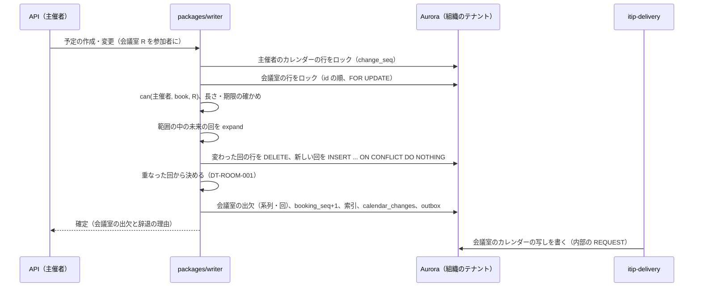
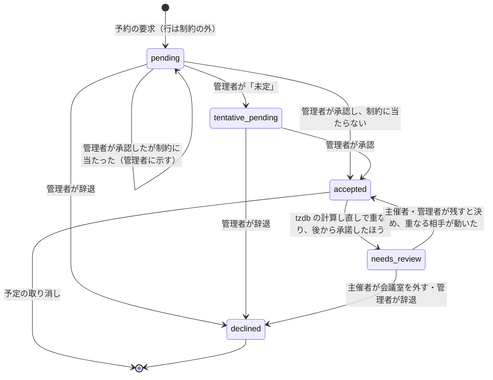

# Rooms and Resources: Google Calendar

建物・階・定員・設備の属性、会議室と設備のカレンダー、自動の承諾と管理者の承認、二重予約を防ぐ排他の制約、繰り返しの予約の一部の辞退、tzdb の計算し直しでの「要確認」、会議室の検索と提案を決める。

前提となる決定は、繰り返しの保存と展開（[ADR-0003](../decisions/0003-recurrence-storage-and-expansion.md)、[ADR-0010](../decisions/0010-occurrence-index-maintenance.md)）、テナント（[ADR-0004](../decisions/0004-tenancy-and-rls.md)）、変更のログ（[ADR-0005](../decisions/0005-change-log-and-sync-tokens.md)）、写し（[ADR-0006](../decisions/0006-organizer-and-attendee-copies.md)）、tzdb の更新（[ADR-0012](../decisions/0012-tzdb-update-recompute-and-propagation.md)）、空き時間（[ADR-0017](../decisions/0017-freebusy-source-and-cache.md)）。会議室の二重予約を DB の制約で防ぐことは [architecture/README.md](README.md) の 6 節で決めており、この文書で ADR にする。

| ADR | 決定 |
| --- | --- |
| [0019](../decisions/0019-room-booking-rows-and-recurring-acceptance.md) | 会議室の予約は、範囲の中の回ごとの行（`resource_bookings`）にし、`btree_gist` の排他の制約で承諾どうしの重なりを拒む。予約は主催者の書き込みのトランザクションで、会議室の行をロックしてから行う。繰り返しは、重なる回が範囲の中の回の半分以下で 8 回以下なら系列を承諾してその回だけ辞退し、それを超えれば系列の全体を辞退する。範囲の端が進んで足した回が重なれば、その回だけ辞退する |
| [0020](../decisions/0020-room-approval-and-needs-review.md) | 承認の要る会議室の予約は「承認の待ち」の行にして制約の外に置き、管理者の承認で承諾の行に変える（その時に制約が効く）。tzdb の計算し直しで承諾どうしが重なったら、後から承諾したほうを「要確認」にして制約の外に出し、主催者と管理者に知らせる。自動で辞退しない |

## 1. 目的と範囲

- 扱う：
  - 建物、階、会議室・設備の属性と、会議室のカレンダー
  - 予約の方針（自動の承諾、管理者の承認）、予約できる人、長さと先の期限
  - 予約の行と排他の制約、予約の決め方、繰り返しの一部の辞退
  - 範囲の端の移動、tzdb の計算し直し、予定の変更での付け直し
  - 会議室の検索と提案
- 扱わない：
  - 会議室の空き時間の照会とキャッシュ（[free-busy-and-scheduling.md](free-busy-and-scheduling.md)）
  - 会議室の写しへの配送の形（[invitations-and-itip.md](invitations-and-itip.md)）
  - 会議室のディレクトリの管理の画面、SCIM での取り込み（accounts-and-orgs.md）
  - 会議室のカレンダーの ACL の決定表（[sharing-and-acl.md](sharing-and-acl.md)）

## 2. 要件

| 要件 | 目標 | NFR |
| --- | --- | --- |
| 二重予約 | 自動の承諾の会議室で、承諾した予約どうしの重なり 0 件 | NFR-005、K5 |
| 速さ | 会議室つきの予定の作成・変更の API p99 300 ms（繰り返しを含む） | NFR-001 |
| 並行 | 同じ会議室・同じ時間帯への 100 並行の予約で、重なり 0 件、辞退の理由が主催者に届く | [quality.md](../quality.md) の 2.2.1 節 E |
| 説明 | 辞退した回と理由（重なり、期限の外、長さ、権限）を主催者に示す | — |
| 規模 | 最大の組織で会議室 2,000（S1）、1 万（S2） | [architecture/README.md](README.md) の 2 節 |

## 3. 本家の形（確かめたこと）

いずれも 2026-10-04 に確認。

| 項目 | 内容 | 出典 |
| --- | --- | --- |
| 会議室の属性 | `resourceName`、`resourceCategory`（`CONFERENCE_ROOM`・`OTHER`）、`resourceType`、`capacity`、`buildingId`、`floorName`、`floorSection`、`featureInstances`、`userVisibleDescription`、`resourceEmail`。`generatedResourceName` は建物・階・定員を含めて自動で作る | [resources.calendars](https://developers.google.com/workspace/admin/directory/reference/rest/v1/resources.calendars) |
| 管理者の承認 | 会議室の管理者を置くと、予約の通知を受け、「はい」「未定」「いいえ」で返す。「すべての招待を自動で追加する」の設定もある | [Approve or deny Calendar room & resource bookings](https://knowledge.workspace.google.com/admin/calendar/approve-or-deny-calendar-room-and-resource-bookings) |
| 繰り返しの予約 | 会議室が少なくとも回の半分で空いていて、空いていない回が 8 回以下なら受ける。辞退の理由には、同じ時刻の予約、予約の権限の喪失、会議室の管理者の外し、参加者の辞退による解放、終日の予定とタイムゾーンの食い違い、過去の予定への会議室の追加がある | [Learn why a Google Calendar meeting room declines an event](https://support.google.com/calendar/answer/16107253) |
| 重ならない招待だけを自動で承諾 | 繰り返しで一部の回だけ重なるときの扱いがある | [architecture/README.md](README.md) の 1.4 節 |

- 本家の、予約できる先の期限、1 回の長さの上限、繰り返しの判定で数える回の範囲（全回か、ある期間か）、参加者の辞退による解放の条件の細部は、公式の資料で確かめられなかった（**未検証**）。
- 「半分」「8 回」は本家の説明の数値で、本システムもこの数値に寄せる（6.3 節）。数える回は、本システムでは展開の索引の範囲の中の未来の回である。

## 4. モデル

### 4.1 ディレクトリ

| 表 | 主な列 |
| --- | --- |
| `buildings` | `id`、`name`、`address`、`timezone`（IANA）、`floors`（並び順つきの階の名前） |
| `resources` | `id`、`calendar_id`（会議室のカレンダー）、`building_id`、`floor_name`、`floor_section`、`name`、`display_name`（「東京本社-12F-会議室A（8）」の形で自動で作る）、`category`（`room`・`other`）、`resource_type`（設備の種類）、`capacity`、`description`、`address_token`（`r-<token>@resource.<brand>.<domain>`） |
| `resource_features`・`resource_feature_instances` | 設備の属性（ディスプレイ、ビデオ会議の機器、ホワイトボード、車いす） |
| `resource_policies` | `mode`（`auto_accept`・`approval`）、`max_duration`（既定 24 時間、15 分〜7 日）、`horizon_days`（既定 548、1〜548）、`allowed_bookers`（主体の一覧。既定は組織の全員）、`managers`（利用者・グループ） |
| `rooms` の行 | `booking_seq`（予約の行が変わるたびに上げる。[ADR-0017](../decisions/0017-freebusy-source-and-cache.md)） |

- 会議室と設備は組織のテナントにだけある。個人のテナントは持たない。
- 予約できるのは、会議室と同じテナントの主催者だけ（MVP）。他の組織の人が主催する予定に会議室を付ける要求は、権限の理由で辞退する。
- CalDAV のクライアントや API で会議室をメールアドレスで招待したら、`address_token` で会議室に解く（[invitations-and-itip.md](invitations-and-itip.md)）。

### 4.2 予約の行

`resource_bookings`（組織のテナント）：

| 列 | 意味 |
| --- | --- |
| `tenant_id`・`room_id` | — |
| `event_object_id`・`recurrence_id` | 主催者の写しと回 |
| `during` | `tstzrange(start_utc, end_utc, '[)')` |
| `status` | `accepted`・`pending`（承認の待ち）・`needs_review`（要確認） |
| `accepted_at` | 承諾した時刻（要確認の判定に使う） |
| `tzdata_version` | 区間を計算した版 |

```sql
EXCLUDE USING gist (tenant_id WITH =, room_id WITH =, during WITH &&)
  WHERE (status = 'accepted')
```

- 辞退した回は行を持たない。辞退は主催者の写しの会議室の参加者の行（回ごとの `partstat`）に書く。
- `pending` と `needs_review` は制約の外。空き時間では `pending` を `busy_tentative`、`needs_review` を `busy` にする（[free-busy-and-scheduling.md](free-busy-and-scheduling.md) の 4.2 節）。
- 行を持つのは、展開の索引の範囲の中で、今より後に終わる回だけ。過去の回の行は、索引の分割と一緒に落とす。

## 5. 予約の流れ



- ロックの順は、主催者のカレンダー → 会議室（`id` の順）。1 つの予定に会議室を複数付けても、デッドロックしない。
- 会議室の行のロックで、同じ会議室の予約の判断が直列になる。排他の制約は、ロックを通らない書き込み（範囲の端の移動、tzdb の計算し直し）にも効く最後の守りである。
- `INSERT ... ON CONFLICT DO NOTHING` は排他の制約にも使える。入らなかった回が「重なった回」である。
- 会議室の出欠は、主催者の写しの会議室の参加者の行に、同じトランザクションで書く。会議室のカレンダーの写しは、後から内部の iTIP で届く（[ADR-0006](../decisions/0006-organizer-and-attendee-copies.md)）。

## 6. 予約の決め方

### 6.1 前の確かめ

| # | 確かめ | 違反のとき |
| --- | --- | --- |
| 1 | `can(主催者, "book", 会議室)`（同じテナント、`allowed_bookers`） | 系列の全体を辞退、理由 `not_allowed` |
| 2 | 1 回の長さ ≤ `max_duration` | 系列の全体を辞退、理由 `too_long` |
| 3 | 単発の予定の開始 ≤ 今＋`horizon_days` | 辞退、理由 `outside_booking_horizon` |
| 4 | 今より前に終わる回 | 行を作らない。過去の予定に会議室を足す要求は、その回を辞退（理由 `in_the_past`） |

繰り返しの系列の、`horizon_days` より先の回は、範囲の端が進んだ時に行を足す（6.4 節）。

### 6.2 自動の承諾の会議室

DT-ROOM-001。`n` は範囲の中（今から `min(horizon_days, 548 日)`）の未来の回の数、`c` は重なった回の数。

| # | 予定 | 条件 | → 結果 |
| --- | --- | --- | --- |
| 1 | 単発 | `c = 0` | 承諾 |
| 2 | 単発 | `c = 1` | 辞退、理由 `conflict` |
| 3 | 系列 | `c = 0` | 系列を承諾 |
| 4 | 系列 | `1 ≤ c`、`c ≤ n / 2`、`c ≤ 8` | 系列を承諾し、重なった回だけ辞退（回ごとの `partstat=declined`、理由 `conflict`） |
| 5 | 系列 | `c > n / 2` か `c > 8` | 系列の全体を辞退。入れた行を消す。理由 `too_many_conflicts`（重なった回の一覧つき） |
| 6 | 1 回分の変更（上書きで時刻を動かした） | 動かした先が重なる | その回だけ辞退。系列の判定はやり直さない |
| 7 | 系列の全体の変更（時刻・規則） | — | 未来の回のすべてで 1〜5 をやり直す。前に承諾していた系列も、5 に当たれば辞退になる |

**例**（予定はどれも東京本社の会議室 A、1 時間）：

| 例 | 予定 | `n` | `c` | 結果 |
| --- | --- | --- | --- | --- |
| 1 | 毎週火曜 10:00、`COUNT=52` | 52 | 3 | 行 4：承諾し、3 回を辞退 |
| 2 | 同じ | 52 | 9 | 行 5：全体を辞退（8 回を超える） |
| 3 | 毎日 9:00、`COUNT=10` | 10 | 6 | 行 5：全体を辞退（半分を超える） |
| 4 | 毎週月曜、終わりなし | 79（548 日の中の回） | 8 | 行 4：承諾し、8 回を辞退 |
| 5 | 例 4 の 9 回目の重なりが、範囲の端の移動で見つかった | — | — | 6.4 節：その回だけ辞退。系列の判定はやり直さない |

### 6.3 数値の根拠

- 「回の半分以上で空いている」「空いていない回が 8 回以下」は、本家の説明に寄せた（3 節）。
- 本家が数える回の範囲は**未検証**。本システムは、予約の行を持てる範囲（範囲の中の未来の回）で数える。終わりのない系列は、範囲の中の回（毎週なら約 79 回）で判定する。

### 6.4 範囲の端の移動

- `expander.advance`（[ADR-0010](../decisions/0010-occurrence-index-maintenance.md)）が、繰り返しの予約の新しい回の行を足す。会議室の行をロックしてから足す。
- 足した回が重なれば、その回だけを辞退にし、主催者に知らせる。系列の判定（6.2 節の行 5）はやり直さない。
- 単発の予約も、範囲の端（今＋548 日）までしか取れない。端の同じ日の回は、早く確定したものが取る（先着）。
- 範囲の端のジョブが止まっている間は、`indexed_through` より先の会議室の予約を受けない（理由 `outside_booking_horizon`）。止まった間に単発の予約だけが端の先を取ることを防ぐ。

### 6.5 予定の変更と取り消し

| 変更 | 予約の行 |
| --- | --- |
| タイトル・説明・参加者（会議室以外） | 変えない |
| 時刻・規則（系列） | 未来の回の行を作り直し、DT-ROOM-001 の行 7 |
| 1 回分の時刻の変更 | その回の行を作り直し、行 6 |
| 1 回分の取り消し（EXDATE） | その回の行を消す |
| 会議室を外す | その会議室の行を消す |
| 予定の取り消し・削除 | すべての行を消す |
| 「これ以降」の分割 | 元の系列の R 以降の行を消し、新しい系列で DT-ROOM-001 をやり直す |
| 主催者の変更 | 行の `event_object_id` を新しい主催者の写しに付け替える（[invitations-and-itip.md](invitations-and-itip.md) の 9 節） |

どの変更も `booking_seq` を上げる。

## 7. 承認の要る会議室

ADR-0020。



- 予約は `pending` の行（制約の外）にし、会議室の出欠を `needs_action` にする。管理者に通知する（reminders-and-notifications.md）。
- 管理者が承認すると、行を `accepted` にする。制約に当たれば承認を失敗にし、重なる予約を管理者に示す。系列を承認したときは、重なる回を辞退にし、ほかを承諾する（管理者の判断なので、6.2 節の「半分・8 回」は当てない）。
- 「未定」は、出欠を `tentative` にし、行は `pending` のまま。
- 承認の待ちに期限を設けない。管理者に毎朝、待ちの一覧を送る。
- 管理者は、`managers` の利用者とグループのメンバー。管理者が 0 人になったら、組織の管理者に知らせ、新しい予約を「承認する人がいない」で辞退する。

## 8. 要確認

ADR-0020。

- tzdb の計算し直し（[ADR-0012](../decisions/0012-tzdb-update-recompute-and-propagation.md)）で、行の `during` を直す `UPDATE` が排他の制約に当たったら、次をする。
  1. 当たった相手の行と、`accepted_at` を比べる。
  2. 後から承諾したほうを `needs_review` にする（自分なら自分を、相手なら相手を `needs_review` にしてから自分の `UPDATE` をやり直す）。
  3. 主催者と会議室の管理者に、重なった 2 つの予定を知らせる。
- `needs_review` の行は制約の外なので、承諾どうしの重なりは 0 件のまま（NFR-005）。空き時間では `busy` にする。
- 主催者が別の会議室・時刻に変えるか、会議室を外すと解ける。管理者が辞退にもできる。自動では辞退しない。
- 72 時間たっても `needs_review` のままなら、主催者と管理者にもう一度知らせる。予定の開始の 24 時間前にも知らせる。

**例**：会議室 A（東京本社）で、予定 P（TZID `X/Y` の拠点が主催、毎週月曜 09:00 `X/Y`）と、予定 Q（東京の人が主催、2027-04-05（月）15:00〜16:00 `Asia/Tokyo`）。旧の tzdb で P は東京の 14:00〜15:00 で、Q と重ならない。新の tzdb（[time-zones-and-holidays.md](time-zones-and-holidays.md) の 6.6 節）で P の 04-05 の回が東京の 15:00〜16:00 に動き、Q と重なる。P の系列は 2026 年に、Q は 2027-03-01 に承諾した。後から承諾した Q を `needs_review` にし、両方の主催者と管理者に知らせる。

## 9. 会議室の検索と提案

- 条件：建物、階、`category`、定員の下限、設備（すべてを満たす）、名前の部分一致。
- 空き：指定の時間に空いているか（`accepted`・`needs_review` の行と重ならない。`pending` の行は「承認の待ちあり」と示す）。空き時間のキャッシュを使う（[ADR-0017](../decisions/0017-freebusy-source-and-cache.md)）。
- 並べ方：利用者の既定の建物と同じ → 定員が出席の人数以上で最小 → 階の近さ（`floors` の並び順の差）→ 名前。
- 1 回の検索は 20 室まで返す。候補の計算（[free-busy-and-scheduling.md](free-busy-and-scheduling.md) の 6 節）は、この 20 室を候補にする。
- 会議室の名前・属性は、予約できる人（組織の全員）が見られる。会議室のカレンダーの予定の中身の見え方は [sharing-and-acl.md](sharing-and-acl.md)。

## 10. 障害のときの振る舞い

| 事象 | 起きること | 備え |
| --- | --- | --- |
| 人気の会議室に予約が集中 | 会議室の行のロックの待ち | 1 予約のロックの時間は 50 ms 以下（`room-exclusion-poc` で測る）。1 会議室 1 秒 20 件を上限と見込む |
| 長い繰り返しの予約 | 行の挿入が多い | 範囲の中で最大 580 行（毎日）。`room-exclusion-poc` で速さを測る |
| 範囲の端のジョブが止まった | 端の先の行がない | 6.4 節：`indexed_through` より先の予約を受けない |
| tzdb の計算し直しで重なり | 承諾どうしが重なりうる | 8 節の要確認 |
| アプリの誤りで制約を通らない書き込み | — | 制約は DB にあり、`packages/writer` を通らない書き込みは DB の権限で拒否する（[ADR-0005](../decisions/0005-change-log-and-sync-tokens.md)） |
| 会議室の写しの配送の遅れ | 会議室のカレンダーに予約がまだ出ない | 空き時間は予約の行から求めるので、影響しない |
| 本番の重なりの検査で 1 件以上 | NFR-005 の違反 | SEV2。検査は制約の外の行を含めず、`accepted` どうしだけを数える |

## 11. セキュリティ

- 予約できるのは同じテナントの主催者だけ。`can(主催者, "book", 会議室)` は `packages/policy` で判定する。
- 辞退の理由に、重なった相手の予定の中身を入れない。「この時間は予約済み」と回の時刻だけを返す。重なった相手の予定の主催者の名前を出すかは、会議室のカレンダーの ACL（[sharing-and-acl.md](sharing-and-acl.md)）の `reader` 以上の人だけにする。
- 会議室のメールアドレスの `address_token` は推測できない値にし、外部からの iMIP で会議室を招待させない（外部の主催者の予定は会議室を取れない）。

## 12. テスト

決定表：

- **DT-ROOM-001（自動の承諾）**：6.2 節の 7 行。
- **DT-ROOM-002（前の確かめ）**：6.1 節の 4 行。
- **DT-ROOM-003（承認と要確認）**：7・8 節の状態の遷移。

性質ベーステスト：

- **PROP-ROOM-001（重なりなし）**：任意の予約・変更・取り消し・範囲の端の移動・tzdb の計算し直しの列（並行を含む）の後、同じ会議室の `accepted` の行どうしが重ならない。
- **PROP-ROOM-002（行と出欠の一致）**：任意の列の後、会議室の参加者の回ごとの `partstat=accepted` の回と、`accepted`・`needs_review` の行の回が一致する。
- **PROP-ROOM-003（系列の判定）**：任意の系列と既存の予約で、DT-ROOM-001 の行 3〜5 の結果が、`n`・`c` から決まるとおりになる。
- **PROP-ROOM-004（要確認の選び方）**：tzdb の計算し直しで重なった 2 つの予約のうち、`needs_review` になるのは `accepted_at` の新しいほうである。

並行の試験（[quality.md](../quality.md) の 2.2.1 節 E）：同じ会議室・同じ時間帯に、単発と繰り返しの予約を 100 並行で送り、承諾の重なり 0、辞退の理由が主催者に届く。

## 13. Story の候補

| Epic | Story | 中身 |
| --- | --- | --- |
| E6 | `room-exclusion-poc` | 排他の制約の書き込みの速さ、繰り返しの行の挿入、会議室の行のロックの時間 |
| E6 | `rooms-directory` | 4.1 節（accounts-and-orgs と共同） |
| E6 | `room-booking-exclusion` | 4.2・5・6 節（ADR-0019。DT-ROOM-001・002、PROP-ROOM-001〜003） |
| E6 | `room-approval` | 7 節（ADR-0020。DT-ROOM-003） |
| E3 | `room-needs-review` | 8 節（PROP-ROOM-004。time-zones-and-holidays と共同） |
| E6 | `room-search-and-suggest` | 9 節 |
| E6 | `room-concurrency-tests` | 12 節の並行の試験 |

## 14. 未解決の問い

### 決定

2026-10-04 の既定案。E6 の PoC で覆りうる。

- **二重予約の防止**：回ごとの行と `btree_gist` の排他の制約、会議室の行のロック（ADR-0019）。
- **繰り返しの一部の重なり**：半分以下かつ 8 回以下なら、その回だけ辞退（ADR-0019。本家の数値に寄せた）。
- **数える回**：範囲の中の未来の回。
- **範囲の端で見つかった重なり**：その回だけ辞退。
- **承認の待ち**：制約の外。期限なし（ADR-0020）。
- **tzdb の重なり**：後から承諾したほうを要確認（ADR-0020）。
- **予約できる人**：同じテナントだけ。
- **長さ・期限の既定**：24 時間、548 日。

### 持ち越し

| 問い | いつ・どう決めるか |
| --- | --- |
| 排他の制約と会議室のロックの書き込みの速さ | E6 の前の `room-exclusion-poc` |
| 参加者がみな辞退したときに会議室を解放するか | E6 の試用の声。本家の条件の細部は**未検証** |
| 他の組織の人に会議室を貸す | MVP の後 |
| 本家の先の期限・長さの上限・数える回の範囲 | 公式の資料で確かめられなかった（**未検証**のまま） |

## 15. quality.md・runbooks・data-model への項目

### quality.md

- DT-ROOM-001〜003、PROP-ROOM-001〜004、並行の試験を E6 のリリースの基準にする。
- 本番：会議室の重なりの検査（`accepted` どうし）0 件、`needs_review` の数と解けるまでの時間、辞退の理由ごとの数。

### runbooks

- `room-overlap-detected.md`：重なりの検査が 1 件以上のときの確かめ方（行、`tzdata_version`、ロックを通らない書き込み）と、主催者への連絡。データの直接の書き換えはしない（[roadmap.md](../roadmap.md) の「エージェントに任せないこと」）。
- `room-needs-review-backlog.md`：要確認が溜まったときの、管理者への連絡と一覧の出し方。

### data-model（索引への追加の提案）

| 表 | 中身 | 節 |
| --- | --- | --- |
| `buildings` | 建物、タイムゾーン、階の並び | 4.1 |
| `resources` | 会議室・設備の属性、`address_token`、`booking_seq` | 4.1 |
| `resource_features`・`resource_feature_instances` | 設備の属性 | 4.1 |
| `resource_policies` | `mode`、`max_duration`、`horizon_days`、`allowed_bookers`、`managers` | 4.1 |
| `resource_bookings` | 4.2 節。排他の制約 `EXCLUDE USING gist (tenant_id WITH =, room_id WITH =, during WITH &&) WHERE (status = 'accepted')`、一意 `(tenant_id, room_id, event_object_id, recurrence_id)` | 4.2 |
| `event_attendees`（会議室の行） | 回ごとの `partstat` と辞退の理由のコード（`decline_reason`） | 6.2 |

## 出典

いずれも 2026-10-04 に確認。

- Google for Developers, [resources.calendars（Admin SDK Directory API）](https://developers.google.com/workspace/admin/directory/reference/rest/v1/resources.calendars)
- Google Workspace Admin Help, [Approve or deny Calendar room & resource bookings](https://knowledge.workspace.google.com/admin/calendar/approve-or-deny-calendar-room-and-resource-bookings)
- Google Calendar Help, [Learn why a Google Calendar meeting room declines an event](https://support.google.com/calendar/answer/16107253)
- PostgreSQL の `btree_gist` と排他の制約が Aurora PostgreSQL 18 で使えることは [architecture/README.md](README.md) の 4 節で確かめた
