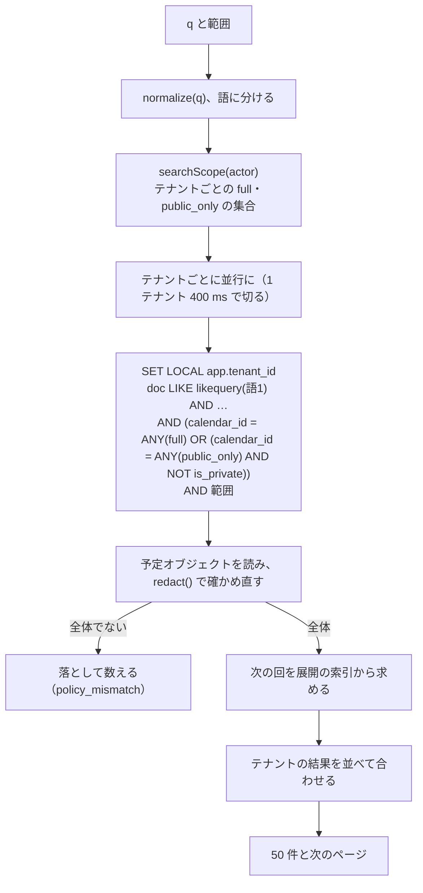
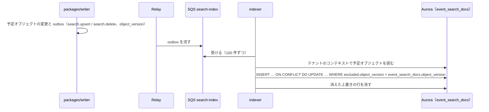

# Search: Google Calendar

予定の検索（タイトル・場所・説明・参加者、日本語を含む）を決める。検索の表と `pg_bigm` の索引、文字の正規化、権限を効かせた問い合わせ、索引の更新と遅れ、並べ方と応答、S2 で専用の検索の基盤へ移す基準を扱う。

前提となる決定は、基盤（[ADR-0001](../decisions/0001-platform-and-stack.md)）、繰り返しの保存と展開（[ADR-0003](../decisions/0003-recurrence-storage-and-expansion.md)）、テナントと権限（[ADR-0004](../decisions/0004-tenancy-and-rls.md)）、変更のログ（[ADR-0005](../decisions/0005-change-log-and-sync-tokens.md)）、写し（[ADR-0006](../decisions/0006-organizer-and-attendee-copies.md)）。この文書で決めたことは次の ADR にある。

| ADR | 決定 |
| --- | --- |
| [0034](../decisions/0034-search-pg-bigm-acl-aware.md) | S1 の検索は Aurora の `pg_bigm` で行う。検索の表 `event_search_docs` は、予定オブジェクトのマスターと上書きごとに 1 行で、正規化した文字列と `is_private` の印を持ち、テナントのハッシュで 16 に分割する。権限は、`packages/policy` の `searchScope(actor)` が返す「全体を見られるカレンダー」と「公開の予定だけを見られるカレンダー」の 2 つの集合を問い合わせの条件にし、結果を `redact()` で確かめ直す。索引は outbox から `indexer` が非同期に更新し、変更から検索に出るまで p95 30 秒。件数の合計を返さない。S2 で、索引の大きさ・速さ・書き込みの量の基準を超えたら専用の基盤を決める |

## 1. 目的と範囲

- 扱う：
  - 検索の対象と、検索の表の形
  - 日本語を含む文字の正規化と、`pg_bigm` の索引
  - 権限を効かせた問い合わせ（ACL、公開範囲、参加者、テナントをまたぐ共有のカレンダー）
  - 索引の更新と遅れ
  - 並べ方、ページング、応答の形、上限
  - S2 の検索の基盤を決める基準
- 扱わない：
  - `can()`・`redact()` の決定表の本体（[sharing-and-acl.md](sharing-and-acl.md)。この文書は検索の条件への写し方だけを足す）
  - 検索の画面（[clients.md](clients.md)）
  - 会議室の条件での検索（[rooms-and-resources.md](rooms-and-resources.md)）
  - 管理者の監査ログの検索（[security.md](security.md)）
  - 組織のディレクトリ（人・グループ）の検索（[accounts-and-orgs.md](accounts-and-orgs.md) の 11 節）

## 2. 要件

| 要件 | 目標 | NFR・基準 |
| --- | --- | --- |
| 鮮度 | 変更から検索に出るまで p95 30 秒 | NFR-012 |
| 速さ | 検索の応答 p99 1 秒 | NFR-012 |
| 取りこぼし | 日本語の部分一致で取りこぼさない（形態素の切れ目に関係なく、2 文字以上の連なりで当たる） | NFR-012、[quality.md](../quality.md) の 5 節の E11 |
| 漏れ | 見てはいけない予定の中身で当たらない。結果・抜粋・件数から存在を推測できない | NFR-008、[quality.md](../quality.md) の 2.2.1 節 D |
| 一致 | 検索の結果の回の時刻が、画面・API と同じ | NFR-009 |

## 3. 本家の形と部品（確かめたこと）

| 項目 | 内容 | 出典 |
| --- | --- | --- |
| `pg_bigm` | Aurora PostgreSQL 18 で使える拡張に入っている | [Extension versions for Aurora PostgreSQL](https://docs.aws.amazon.com/AmazonRDS/latest/AuroraPostgreSQLReleaseNotes/AuroraPostgreSQL.Extensions.html)（2026-10-04 に確認。[intent.md](../intent.md)） |
| `pg_bigm` の仕組み | 2-gram の GIN の索引（`gin_bigm_ops`）で `LIKE` の部分一致を速くする。`likequery()` は検索語の前後に `%` を付け、`%` などを逃がして `LIKE` の形にする。1〜2 文字の語の検索も速いとしている。索引を付ける列は約 102 MB まで | [pg_bigm 1.X Document](https://pgbigm.github.io/pg_bigm/pg_bigm_en.html)（2026-10-04 に確認） |

- 本家の検索の対象の項目、日本語の部分一致の振る舞い、索引の遅れ、検索の範囲（過去・未来）は、公式の資料で確かめられなかった（**未検証**）。本システムの値は 4〜8 節。
- 他の題材（Linear の [ADR-0030](../../../linear/docs/decisions/0030-search-engine-opensearch.md)）は、`pg_bigm` を代案として残し、OpenSearch を選んだ。本題材は、検索が主な論点でなく、権限の判定がカレンダーの単位で粗い（4.3 節）ので、S1 は新しい部品を足さない（[architecture/README.md](README.md) の 6 節の決定）。

## 4. 検索の表

### 4.1 対象

| 項目 | 入れるか | 注記 |
| --- | --- | --- |
| タイトル | 入れる | 1,024 文字 |
| 場所 | 入れる | — |
| 説明 | 先頭の 2 KiB | 説明は 64 KiB まで持てるが、索引の大きさを抑える |
| 参加者の名前・メールアドレス | 入れる | 写しが持つ一覧（`can_see_other_guests=false` の写しは主催者と自分だけ。[invitations-and-itip.md](invitations-and-itip.md) の 8.1 節） |
| 主催者の名前・メールアドレス | 入れる | — |
| 会議の URL・添付の URL | 入れない | 秘密を含みうる |
| 知らないプロパティ（`x_props`） | 入れない | — |

- 1 行は、予定オブジェクトのマスター（`recurrence_id = ''`）か、上書き（その回の VEVENT の全体）。上書きのタイトルがマスターと違う回も当たる。
- 取り消した予定（`status = cancelled`）、参加者の写しの `cancelled`・`hidden`、保留の招待は、行を消す（検索に出さない）。
- ICS の購読のカレンダーと祝日も入れる（利用者が一覧に持つカレンダーの予定として探せる）。

### 4.2 行

```sql
CREATE TABLE event_search_docs (
  tenant_id        uuid        NOT NULL,
  event_object_id  uuid        NOT NULL,
  recurrence_id    text        NOT NULL,        -- マスターは ''
  calendar_id      uuid        NOT NULL,
  is_private       boolean     NOT NULL,        -- 公開範囲が private・confidential（default はカレンダーの既定で解いた値）
  start_utc        timestamptz NOT NULL,        -- マスターは最初の回、上書きはその回
  series_end_utc   timestamptz,                 -- 終わりのない系列は NULL
  doc              text        NOT NULL,        -- 正規化した文字列（5 節）
  object_version   bigint      NOT NULL,
  PRIMARY KEY (tenant_id, event_object_id, recurrence_id)
) PARTITION BY HASH (tenant_id);               -- 16 の分割

CREATE INDEX ON event_search_docs USING gin (doc gin_bigm_ops);
CREATE INDEX ON event_search_docs (tenant_id, calendar_id, start_utc);
```

- テナントの表なので `tenant_id` と RLS を付ける（[ADR-0004](../decisions/0004-tenancy-and-rls.md)）。問い合わせは `tenant_id = $1` を明示し、分割の刈り込みを効かせる。
- 中身（`doc`）は、カレンダーを全体で見られる人だけが当たる文字列である。区間だけの見え方の文字列（「予定あり」）は入れない（区間だけの人には当たる語がない）。これが [ADR-0004](../decisions/0004-tenancy-and-rls.md) の「検索の表には、`redact()` の結果ごとの文字列を入れる」の形である：[ADR-0021](../decisions/0021-effective-role-and-redact-table.md) の 4 つの段のうち、検索で当たるのは `FULL` だけで、`BUSY`・`NONE` には当たる語がない。`FULL_NO_GUESTS`（他の参加者を隠す予定）は、他の人のカレンダーの側では確かめ直し（6.2 節）で落とし、見る人自身の写し（参加者の一覧が主催者と自分だけ）で当たる。どの段になるかを 4.3 節の条件と確かめ直しで決める。

### 4.3 権限の写し方

`packages/policy` の `searchScope(actor)`：

| 主体のカレンダーへのロール（[ADR-0004](../decisions/0004-tenancy-and-rls.md)） | 集合 | 当たる行 |
| --- | --- | --- |
| `owner`・`writer` | `full` | すべて |
| `reader` | `public_only` | `is_private = false` |
| `free_busy_reader`、`none` | 含めない | なし |

- 予定の参加者は、自分の写しを自分のカレンダー（`owner`）に持つ（[ADR-0006](../decisions/0006-organizer-and-attendee-copies.md)）。`private` の予定でも、参加者は自分の写しで当たる。他の人のカレンダーの `private` の予定は、`reader` には当たらない（[ADR-0004](../decisions/0004-tenancy-and-rls.md) の決定表の行 1・4 と同じ結果）。
- 組織の共有の方針で絞られた共有は、`can()` がロールを下げて返すので、そのまま効く。
- 対象のカレンダーは、利用者のカレンダーの一覧の中だけ（表示を消しているものを含む）。一覧にないカレンダーは探さない。
- 検索の条件に、権限の条件を `packages/policy` の外で書かない（lint）。

## 5. 正規化

`packages/search-normalize` の `normalize(text)` を、索引を作る時と、検索語に同じく当てる。

1. Unicode の NFKC（全角の英数字・半角のカナを揃える）。
2. 小文字に（`toLowerCase`。ロケールに依らない）。
3. ひらがなをカタカナに（「かいぎ」と「カイギ」を同じにする）。
4. 長音と波線の揺れ（`ー`・`－`・`〜`）を `ー` に。
5. 空白の連なりを 1 つの空白に。
6. 制御文字を消す。

- 漢字の異体字・送り仮名の揺れ・同義語は扱わない（形態素の解析を持たない）。
- 例：「定例ＭＴＧ（ｶﾞｲﾄﾞ）」→「定例mtg(ガイド)」。「ミーティング」「みーてぃんぐ」は同じ文字列になる。

## 6. 問い合わせ

### 6.1 入口

```text
GET /v1/search/events?q=定例&timeMin=…&timeMax=…&pageToken=…
→ { "items": [ { "calendarId", "eventId", "recurrenceId"?, "summary", "start", "end", "nextOccurrence"? } … ],
    "nextPageToken": "…" }
```

- 公開 API の一覧の `q`（[api-and-push.md](api-and-push.md) の 4.5 節）は、1 つのカレンダーに絞った同じ関数を呼ぶ。

| 引数 | 上限 |
| --- | --- |
| `q` | 正規化の後 2〜256 文字。空白で区切った語は 5 つまで（AND） |
| 1 文字の `q` | `timeMin`・`timeMax` の差が 31 日以下のときだけ。他は 400 `queryTooShort`（索引は 1 文字でも効くが、当たる行が多すぎるため） |
| `timeMin`・`timeMax` | 任意。予定の区間 `[start_utc, series_end_utc)` と重なるもの |
| 1 ページ | 50 件 |
| 対象のカレンダー | 一覧の中の 200 まで。テナントは 10 まで |

### 6.2 流れ



- 確かめ直しで落ちるもの（索引の遅れの間に `private` に変わった予定など）は、数えて監視する（0 に近いことを期待する）。
- テナントをまたぐ共有のカレンダーは、カレンダーのテナントのコンテキストで問い合わせる（[ADR-0004](../decisions/0004-tenancy-and-rls.md) の「共有されたカレンダーの読み出し」）。切れたテナントは結果から抜け、応答に `partial: true` を付ける。
- 読み出しは Aurora の reader から行う。

### 6.3 並べ方と応答

- 並べ方：未来の回を持つ予定（次の回の開始が近い順）を先に、次に過去の予定（最後の回の開始が新しい順）。関連度で並べない（予定の検索は「次のあの会議」を探す用途が多いと見込んだ。本家の並べ方は**未検証**）。
- 繰り返しの予定は 1 件にまとめ、`nextOccurrence`（今より後の最初の回）を付ける。上書きの行が当たったら、その回を 1 件として出す。
- 抜粋（当たった所の前後）は返さない。タイトル・時刻・カレンダーだけ。説明の本文での当たりも、タイトルで示す。
- **件数の合計を返さない。** `nextPageToken` の有無だけ。`private` の予定が絞りの前の件数に影響しても、外から見えない（[quality.md](../quality.md) の 2.2.1 節 D の「件数から存在を推測できないこと」）。
- `pageToken` は、語・範囲・主体のハッシュと、テナントごとの最後の並びの値を持つ不透明な文字列。

## 7. 更新



- 予定の書き込みのトランザクションでは索引を書かない。GIN の更新を書き込みの経路（NFR-001 の p99 300 ms）から外す。
- 古いバージョンで上書きしないよう、`object_version` で比べる（順序の入れ替わりと重複）。
- `is_private` は、予定の公開範囲と、`default` のときのカレンダーの既定から決める。カレンダーの既定の公開範囲を変えたら、そのカレンダーの全部の行を作り直す（1,000 件ずつ）。
- ACL の変更は索引を書き直さない（権限は問い合わせの時に決める。4.3 節）。共有を外された人は、次の検索から当たらない。
- 遅れの予算（p95 30 秒）：Relay 1 秒、SQS 1 秒、`indexer` の待ち 10 秒、書き込み 2 秒、余裕 16 秒。遅れを `event_search_docs.object_version` と予定オブジェクトのバージョンの差で測る（抜き取り）。
- GIN の保留の一覧（`gin_pending_list_limit`）は既定の 4 MB で始め、書き込みの量を E11 の PoC で見て決める。

### 7.1 見積もり（S1）

- 行：予定オブジェクト 3 億（上書きを含め 3.3 億行）。1 行の `doc` を平均 250 バイトと見て約 80 GB、GIN の索引を本文の 2〜3 倍と見て 160〜240 GB。
- 書き込み：予定の書き込み 1,500 件/秒のうち中身の変わるもの。毎秒 1,500 行の GIN の更新。
- どちらも E11 の前の `search-bigm-poc` で、S1 の量の合成のデータで測る。

## 8. S2 の検索の基盤

次のどれかを満たしたら、専用の検索の基盤（OpenSearch など）へ移すかを決める ADR を起票する。決めるのは S2 に入る前で、移す時も 4.3 節の権限の写し方と 5 節の正規化は保つ。

| 基準 | 値 |
| --- | --- |
| 検索の応答の p99 | 1 秒を 1 週間続けて超える |
| 索引の大きさ | 1 クラスタで 1 TB を超える |
| 書き込みの量 | `indexer` の書き込みが Aurora の writer の書き込みの 20% を超える |
| 鮮度 | 変更から検索に出るまでの p95 が 30 秒を 1 週間続けて超える |
| 機能 | 関連度での並べ替え、形態素の解析を PM が求める |

- S2 でテナントのクラスタが分かれる（[architecture/README.md](README.md) の 2 節）と、索引も一緒に分かれる。この形は S2 の分割と相性が良い。

## 9. 障害のときの振る舞い

| 事象 | 起きること | 備え |
| --- | --- | --- |
| `indexer` の遅れ | 新しい予定が出ない、古い中身で当たる | 確かめ直しで中身は今の予定から出す。遅れの p95 を監視（`search-index-lag.md`） |
| 索引の行の欠け | 当たらない | 毎日、予定オブジェクトの抜き取り（1 万件）と検索の表の `object_version` を比べ、欠けたものを作り直す |
| reader の遅れ | 直前の変更が出ない | 鮮度の予算に含める |
| GIN の膨れ・保留の一覧の溜まり | 遅くなる | `VACUUM` と保留の一覧の大きさを監視。分割ごとに `REINDEX CONCURRENTLY` |
| 1 つのテナントが遅い | そのテナントの結果が欠ける | テナントごとに 400 ms で切り、`partial: true` |
| 短い語・よくある語（「会議」） | 当たる行が多く遅い | 範囲の既定を「今から前後 1 年」にし、範囲なしは利用者が選んだときだけ。1 回の問い合わせで読む行を 5,000 で切り、`partial: true` |

## 10. セキュリティ

- **権限**：`searchScope(actor)` と `redact()` の 2 段（6.2 節）。`free_busy_reader` のカレンダーは対象に入らない。
- **存在の推測**：件数を返さない。抜粋を返さない。`partial` の印は、テナントの時間切れと読み出しの上限だけで付け、権限の絞りでは付けない。
- **語の記録**：検索語はログ・メトリクスに書かない（予定の中身を推測できる）。語の長さと結果の数だけ。
- **入力**：`likequery()` で `%`・`_`・`\` を逃がす。語の数と長さの上限（6.1 節）。

## 11. テスト

決定表：

- **DT-SRCH-001（検索の範囲）**：4.3 節のロール × 公開範囲 × 参加者か × 組織の方針。[sharing-and-acl.md](sharing-and-acl.md) の `redact()` の決定表と同じ表から読み、結果が一致することを確かめる。
- **DT-SRCH-002（正規化）**：5 節の各段の例（全角・半角、ひらがな・カタカナ、長音、記号）。

性質ベーステスト：

- **PROP-SRCH-001（見てはいけない中身で当たらない）**：任意の予定・ACL・公開範囲・方針で、主体 A の検索の結果は、`redact(A, e)` が全体を返す予定 e だけ。`private` の予定の中身の語で、参加者でない `reader` に当たらない。
- **PROP-SRCH-002（取りこぼさない）**：任意の日本語・英語の文字列 s と、`normalize(s)` の 2 文字以上の任意の部分文字列 t で、t の検索は s をタイトルに持つ（主体が全体を見られる）予定を返す。
- **PROP-SRCH-003（バージョン）**：任意の更新の列を任意の順序で `indexer` に流しても、静かになった後の検索の表は、各予定オブジェクトの最新のバージョンと一致する。
- **PROP-SRCH-004（件数で推測できない）**：任意の 2 つの世界（`private` の予定が 1 件ある・ない）で、その予定を見られない主体の、同じ語の応答（ページの数、`nextPageToken` の有無、`partial`）が同じ。

取りこぼしの例の集まり（[quality.md](../quality.md) の 5 節の E11）：日本語の会議の題名の典型（「定例」「1on1」「打ち合わせ」「打合せ」「全社 MTG」、会社名の略、全角の記号）を合成して集め、全部が当たることを確かめる。「打ち合わせ」と「打合せ」のような送り仮名の揺れは当たらないこと（5 節で扱わないこと）も記録する。

負荷（E11・E12）：S1 の量の合成のデータで、`search-bigm-poc` の速さと索引の大きさ。

## 12. Story の候補

| Epic | Story | 中身 |
| --- | --- | --- |
| E11 | `search-bigm-poc` | 7.1 節の見積もりの計測（索引の大きさ、更新の量、応答の p99） |
| E11 | `search-table-pg-bigm` | 4・5・7 節（ADR-0034。DT-SRCH-002、PROP-SRCH-002・003） |
| E11 | `search-api-and-ui` | 6 節（DT-SRCH-001、PROP-SRCH-001・004）。画面は clients と共同 |
| E11 | `search-reconciliation` | 9 節の毎日の照合 |

## 13. 未解決の問い

### 決定

2026-10-04 の既定案。E11 の PoC で覆りうる。

- **S1 の基盤**：Aurora の `pg_bigm`（ADR-0034。[architecture/README.md](README.md) の 6 節の決定のとおり）。
- **権限**：カレンダーの集合と `is_private` を条件にし、`redact()` で確かめ直す（ADR-0034）。
- **更新**：outbox からの非同期（ADR-0034）。
- **並べ方**：次の回の近さ。関連度で並べない。
- **件数・抜粋**：返さない。
- **ひらがなとカタカナ**：同じにする。

### 持ち越し

| 問い | いつ・どう決めるか |
| --- | --- |
| 索引の大きさと更新の量が S1 で収まるか | E11 の前の `search-bigm-poc` |
| S2 で専用の基盤へ移すか | 8 節の基準。S2 に入る前に ADR |
| 送り仮名の揺れ・同義語 | E11 の試用の声 |
| 本家の検索の対象・並べ方・遅れ | 公式の資料で確かめられなかった（**未検証**のまま） |

## 14. quality.md・runbooks・data-model への項目

### quality.md

- DT-SRCH-001・002 と PROP-SRCH-001〜004、取りこぼしの例の集まりを E11 のリリースの基準にする。
- 漏れの経路の表の「検索（結果、抜粋、件数）」の行に PROP-SRCH-001・004 を結ぶ。
- 本番：検索の応答の p99、更新の遅れの p95、確かめ直しで落とした数（`policy_mismatch`）、毎日の照合で直した数、`partial` の率。

### runbooks

- `search-index-lag.md`：更新の遅れの切り分け（SQS の深さ、`indexer` の数、GIN の保留の一覧、reader の遅れ）と、テナント・カレンダーを絞った作り直し。

### data-model（索引への追加の提案）

| 表 | 中身 | 節 |
| --- | --- | --- |
| `event_search_docs` | 4.2 節。テナントのハッシュで 16 の分割、`gin_bigm_ops` の GIN、`(tenant_id, calendar_id, start_utc)` | 4.2 |
| 拡張 | `pg_bigm` | 3 |
| `packages/search-normalize`（コード） | 5 節の正規化。索引と検索語で同じもの | 5 |

## 出典

いずれも 2026-10-04 に確認。

- AWS, [Extension versions for Aurora PostgreSQL](https://docs.aws.amazon.com/AmazonRDS/latest/AuroraPostgreSQLReleaseNotes/AuroraPostgreSQL.Extensions.html)
- pg_bigm, [pg_bigm 1.X Document](https://pgbigm.github.io/pg_bigm/pg_bigm_en.html)
