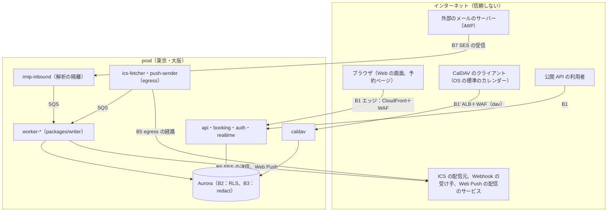

# Security: Google Calendar

信頼境界、脅威モデル（迷惑な招待、ICS・iMIP の解析の攻撃、CalDAV の資格情報の窃取、空き時間と ACL の漏れ、外への送信の SSRF）、外からの入力の検査、暗号化と鍵の配置、秘密情報、監査ログ、運用者のアクセス、データのライフサイクルと保持の既定、セキュリティの試験、脆弱性の管理、インシデント、法務の論点の整理を決める。

権限の関数と決定表は [sharing-and-acl.md](sharing-and-acl.md)、ログイン・SSO・セッション・アプリ用のパスワードの発行は [accounts-and-orgs.md](accounts-and-orgs.md)、iMIP の送信元の確かめ方は [invitations-and-itip.md](invitations-and-itip.md) の 11 節、ネットワークと入口は [infrastructure.md](infrastructure.md) にある。

| ADR | 決定 |
| --- | --- |
| [0004](../decisions/0004-tenancy-and-rls.md) | テナントを FORCE RLS で分け、`can()`・`redact()` の 1 つのモジュールで判定する |
| [0015](../decisions/0015-imip-addressing-and-trust.md) | iMIP の受け口のアドレスと、From・DKIM・SPF での送信元の確かめ方 |
| [0040](../decisions/0040-untrusted-calendar-input-gate.md) | 外から来る iCalendar・メール・URL は、経路ごとの上限の表を解析の前に当て、時間とメモリーを切った隔離の worker thread で解析し、正規化した形だけを `packages/writer` に渡す。外へ出す iCalendar とメールのヘッダーは必ずエスケープして作る |
| [0041](../decisions/0041-encryption-keys-and-secret-storage.md) | 保存時の暗号化はデータの種類ごとの KMS の鍵（マルチリージョン）で行い、テナントごとの鍵と項目の暗号化は持たない。本システムの秘密は照合の値と封筒の暗号化に分けて持つ |
| [0042](../decisions/0042-audit-log-and-data-lifecycle.md) | 監査ログはテナントとプラットフォームに分け、ハッシュの連鎖で log-archive に写す。保持の期間を 1 つの表で持ち、解約したテナントは 30 日の猶予の後に消す。値は法務の L5 の後に確定する |

## 1. 目標と前提

- **OWASP ASVS 5.0 の Level 2 を目標にする**（他の題材と同じ）。要件の番号との照合は E1 で行う。
- 最も重い障害は 4 つ。
  1. **見てはいけない予定の中身が届く**（NFR-008）。空き時間だけの共有、`private` の予定、他のテナント。経路は画面・API・CalDAV・ICS・検索・通知・Webhook・空き時間・iMIP の本文。
  2. **他人の出欠・予定の書き換え**：偽の iMIP の返事、CalDAV の資格情報の窃取。
  3. **本システムを使った迷惑な招待**：第三者のカレンダーに、フィッシングの予定を大量に入れる。
  4. **外からの入力でのサービスの停止**：巨大な ICS、展開の爆発。
- 実行基盤・CI/CD・監視の統制は、他の題材（Linear・Slack・Auth0 の security.md）を引き継ぎ、この題材に固有の部分だけを書く。
- **AI エージェント（コーディング・運用）は、本番に一切の経路を持たない**（他の題材と同じ）。

## 2. 信頼境界

| 境界 | 越えるもの | 主な統制 |
| --- | --- | --- |
| B1 エッジ | 画面・API・予約ページの要求、WebSocket | TLS 1.2 以上、HSTS、WAF、Shield Standard。オリジンは CloudFront からだけ |
| B1' CalDAV の入口 | CalDAV の要求（WebDAV のメソッド） | ALB に付けた WAF、Basic 認証の失敗の規則、本文の大きさ（[infrastructure.md](infrastructure.md) の 2.2 節、[ADR-0043](../decisions/0043-accounts-network-ingress-and-service-placement.md)） |
| B2 テナント | サービスから DB | `SET LOCAL app.tenant_id`、FORCE RLS。テナントをまたぐのは 3 つの処理と専用のロールだけ（[ADR-0004](../decisions/0004-tenancy-and-rls.md)） |
| B3 見え方 | 予定から各経路 | `packages/policy` の `can()`・`redact()` だけ。応答の監査（[observability.md](observability.md) の 4 節） |
| B4 管理プレーン | デプロイ、AppConfig、運用者 | OIDC の短命な認証情報、2 人の承認、JIT（8 節） |
| B5 外向きの送信 | 利用者の決める宛先 | egress の専用の経路、名前解決の後の IP の検査（[ADR-0040](../decisions/0040-untrusted-calendar-input-gate.md)） |
| B6 外への配信 | iMIP の送信、メール、Web Push | 送信の上限、本文は `redact()` の後、ヘッダーのエスケープ |
| B7 メールの受信 | iMIP の返事・招待 | 上限、隔離の解析、From・DKIM・SPF の確かめ（[ADR-0015](../decisions/0015-imip-addressing-and-trust.md)） |
| B8 端末 | Web の画面の手元の DB | `redact()` の後の形だけ、消すきっかけ（[ADR-0039](../decisions/0039-offline-read-cache-and-local-data.md)） |

## 3. 脅威モデル

S＝なりすまし、T＝改ざん、R＝否認、I＝情報漏洩、D＝サービス妨害、E＝権限昇格。主要な脅威と対策だけを書く。

### 3.1 迷惑な招待（招待のスパム）

| # | 種類 | 脅威 | 対策 |
| --- | --- | --- | --- |
| SP1 | I・T | 本システムのアカウントから、外部の多くの人にフィッシングのリンクつきの招待を送る（受け手のカレンダーに予定として出る） | 送信の上限（主催者 24 時間で外部 2,000、作って 30 日以内の個人 200、組織 50,000。[invitations-and-itip.md](invitations-and-itip.md) の 11.2 節）。Complaint の率が 0.1% を超えた主催者の外部への送信を自動で止め、確かめるまで再開しない。Bounce・Complaint の受け手を抑止 |
| SP2 | I・T | 本システムの中の利用者へ、他のテナントから迷惑な招待を入れる | 取り込みの方針（既定は「知っている送信元だけ」）を内部の `REQUEST` にも当てる（[invitations-and-itip.md](invitations-and-itip.md) の 11.5 節）。保留の招待は、カレンダー・通知・空き時間に出さない |
| SP3 | I | 外部からの迷惑な招待（iMIP）を、転送の受け口に流し込む | 送信元の確かめ（[ADR-0015](../decisions/0015-imip-addressing-and-trust.md)）、受け口ごと・送信元のドメインごとの受信の上限（1 時間 100 通） |
| SP4 | I | 予定の説明・場所のリンクでフィッシング | 知らない送信元の予定のリンクに「外部のサイト」の印、`rel="noopener noreferrer"`（[clients.md](clients.md) の 14 節）。メールの本文のリンクの表示の文字と宛先を同じにする |
| SP5 | D | 予約ページで大量の予約を作り、主催者のカレンダーを埋める | ボットの対策、レート制限、予約者のメールの確認（[booking-pages.md](booking-pages.md)） |
| SP6 | — | 利用者が迷惑な招待を報告する | 「迷惑な招待として報告」の操作。報告は送信元のアカウント・ドメインの単位で数え、閾値で SP1 の自動の停止につなぐ。報告の中身を人が読むかは法務の L2 の結論に合わせる（それまでは件数と送信元だけを使う） |

### 3.2 ICS・iMIP の解析の攻撃

| # | 種類 | 脅威 | 対策 |
| --- | --- | --- | --- |
| PA1 | D | 巨大な ICS、深い入れ子、行の折り返しの繰り返しで CPU・メモリーを使い切る | 上限の表を解析の前に当てる、隔離の worker thread の時間とメモリーの上限（[ADR-0040](../decisions/0040-untrusted-calendar-input-gate.md)） |
| PA2 | D | 展開の爆発（大量の RDATE、`COUNT` の巨大な値、`BYSETPOS` の組み合わせ） | 受け付けの検査と計算の量の上限（[events-and-recurrence.md](events-and-recurrence.md) の 3.4・4.6 節） |
| PA3 | D | VTIMEZONE の大量の遷移で照合の計算を重くする | VTIMEZONE の上限（[time-zones-and-holidays.md](time-zones-and-holidays.md) の 12 節） |
| PA4 | T | 偽の `REPLY` で他人の出欠を書き換える | From と ATTENDEE の一致、DKIM か SPF の揃い（[ADR-0015](../decisions/0015-imip-addressing-and-trust.md)） |
| PA5 | T | 偽の `CANCEL`・`REQUEST` で、外部の主催者の予定を消す・動かす | From と ORGANIZER の一致、既存の写しと ORGANIZER の一致（同上） |
| PA6 | T | iCalendar の差し込み：タイトル・名前の改行で、書き出す ICS にプロパティを足す。メールのヘッダーの差し込み | 書き出しのエスケープ、ヘッダーの RFC 2047 化（[ADR-0040](../decisions/0040-untrusted-calendar-input-gate.md)、PROP-SEC-001・002） |
| PA7 | I | 取り込んだ HTML の説明で XSS | サニタイザーの許可リスト、CSP、Trusted Types（[clients.md](clients.md) の 14 節） |
| PA8 | D | 知らないプロパティ（`X-`）を大量に載せて保存の量を増やす | 1 つの予定オブジェクトで 32 KiB（[ADR-0007](../decisions/0007-interop-standards-scope.md)） |
| PA9 | I | MIME の添付（`text/calendar` 以外）を通じた攻撃 | `text/calendar` と `application/ics` 以外の部分を解析しない。保存は生のメールの S3 だけ（30 日） |

### 3.3 CalDAV の資格情報の窃取

CalDAV の認証は、OAuth 2.0 の Bearer と、CalDAV 専用のアプリ用のパスワードの Basic 認証（[architecture/README.md](README.md) の 6 節）。アプリ用のパスワードの発行の形は accounts-and-orgs の領域で決め、この領域はセキュリティの要件を置く。

| # | 種類 | 脅威 | 対策 |
| --- | --- | --- | --- |
| CD1 | S | アプリ用のパスワードの漏えい（端末の設定の書き出し、画面の写し、構成プロファイルの共有） | 120 ビットの乱数で人が選ばない（ADR-0035）。接頭辞 `<brand>_ap_`（[ADR-0035](../decisions/0035-accounts-auth-library-and-credentials.md)）をシークレットスキャンに載せる。作ったときだけ見せる。最後に使った時刻・IP の帯・クライアントの種類を設定の画面に出し、利用者が取り消せる。期限の既定 1 年 |
| CD2 | S | パスワードの総当たり・リスト型の攻撃 | ログインはパスワードを持たない（ADR-0035）。アプリ用のパスワードは高いエントロピーで、総当たりは成り立たない。失敗の上限はアカウントごと 10 分 20 回・IP ごと 10 分 200 回（[sync-and-caldav.md](sync-and-caldav.md) の 6.7 節）。アカウントごとの上限は、他人がわざと失敗してその人の CalDAV を 15 分止める（締め出し）のに使えるので、15 節の持ち越しにする |
| CD3 | E | 漏れたアプリ用のパスワードで、CalDAV の外（API・画面）を使う | スコープは CalDAV だけ（読み出しだけの種類も選べる）。API・画面は受け付けない |
| CD4 | I | 照合の値（DB）の漏えいからパスワードを求める | 高いエントロピーの乱数の SHA-256 で、総当たりで求められない（[ADR-0041](../decisions/0041-encryption-keys-and-secret-storage.md)） |
| CD5 | S | 退職者・停止した利用者のパスワードが使われ続ける | 停止・組織からの除外・SSO の取り消しで、その人のアプリ用のパスワードとトークンを 60 秒以内にすべて取り消す（[accounts-and-orgs.md](accounts-and-orgs.md) の要件）。Valkey の照合の結果の写しは 60 秒で切れ、取り消しのときに消す |
| CD6 | — | 組織が CalDAV を使わせたくない | 組織の管理者がアプリ用のパスワードを禁止できる。禁止したら既存のものも止める |
| CD7 | I | TLS なしの Basic 認証 | `dav.<brand>.<domain>` は HTTPS だけ。HTTP は受けない（ALB は 443 だけを聞く） |
| CD8 | S | OAuth の Bearer の窃取 | トークンの形と期限は api-and-push の領域。CalDAV でも同じ取り消しを効かせる |

### 3.4 空き時間と ACL の漏れ

| # | 種類 | 脅威 | 対策 |
| --- | --- | --- | --- |
| FB1 | I | 空き時間だけを共有された人に、タイトル・場所・参加者が届く | `redact()` の決定表の行 4・5（[ADR-0004](../decisions/0004-tenancy-and-rls.md)）。空き時間の結果は区間と種類だけ（[free-busy-and-scheduling.md](free-busy-and-scheduling.md) の 8 節） |
| FB2 | I | 空き時間のキャッシュ（Valkey）に中身が入る | 値は区間だけ（同 5.1 節）。Valkey に予定の中身を置かない |
| FB3 | I | 存在の推測：見てはいけないカレンダーと、存在しないカレンダーの違い（エラーの種類・時間） | `notFound` を一律に返す、1 分 60 回の上限（同 7 節）、応答の時間の差を E6 で測る |
| FB4 | I | CalDAV の `calendar-query` の条件（`text-match`）で、`private` の予定の中身を推測する | 条件は `redact()` の後の形に当てる（中身の語で当たらない）。[quality.md](../quality.md) の 2.2.1 節 D の行 |
| FB5 | I | 検索の件数・抜粋から存在を推測する | 検索の表は `redact()` の後の文字列（search の領域） |
| FB6 | I | 通知のメール・Web Push・毎朝の一覧・Webhook に中身が入る | 送る本文を `redact()` の後の形で作る。Webhook と Realtime の合図は中身を持たない |
| FB7 | I | ACL を失った人の手元（Web の画面の IndexedDB、CalDAV のクライアント）に予定が残る | 差分の `acl` の変更と `view_hash` の 410 で取り直させる（[ADR-0005](../decisions/0005-change-log-and-sync-tokens.md)）。Web の画面はそのカレンダーの手元のデータを消す（[ADR-0039](../decisions/0039-offline-read-cache-and-local-data.md)）。CalDAV のクライアントの手元は本システムで消せない（残ることを管理の画面の説明に書く） |
| FB8 | I | iMIP の本文に、`can_see_other_guests=false` の参加者へ他の参加者の一覧を入れる | 本文を受け手に見せてよい形で作る（[invitations-and-itip.md](invitations-and-itip.md) の 11.2・13 節） |
| FB9 | I | 予約ページの枠の計算が、主催者の予定の中身を返す | 枠だけを返す（[booking-pages.md](booking-pages.md)） |
| FB10 | E | 組織の方針を狭めた後も、方針を超える ACL が効く | 方針の変更で ACL の行を無効にし、変更のログに載せる（[ADR-0004](../decisions/0004-tenancy-and-rls.md)） |

### 3.5 外への送信（SSRF）

| # | 種類 | 脅威 | 対策 |
| --- | --- | --- | --- |
| SS1 | I・E | ICS の購読の URL で内部のアドレス・メタデータのアドレスを取らせる | egress の経路、名前解決の後の IP の検査、リダイレクトの毎回の検査（[ADR-0040](../decisions/0040-untrusted-calendar-input-gate.md)） |
| SS2 | I・E | Webhook の宛先で同じ | 同上 |
| SS3 | I・E | Web Push の `endpoint` に任意の URL を登録させ、`notifier` から送らせる | 配信のサービスのホスト名の許可リスト。private の Network Firewall の許可リストでも止める（[ADR-0043](../decisions/0043-accounts-network-ingress-and-service-placement.md)） |
| SS4 | D | 遅い応答・巨大な応答で `ics-fetcher` を止める | 1 回 10 秒・10 MiB、宛先のホストごとの同時の数 4 |

### 3.6 Web の画面・公開 API・ICS の公開

| # | 種類 | 脅威 | 対策 |
| --- | --- | --- | --- |
| W1 | I・E | XSS | [clients.md](clients.md) の 14 節 |
| W2 | S | CSRF | クッキーは `SameSite=Lax`・`Secure`・`HttpOnly`（親のドメイン。[accounts-and-orgs.md](accounts-and-orgs.md)）。API の CORS は `calendar.<brand>.<domain>` だけ（[api-and-push.md](api-and-push.md)）。クッキーでの書き込みに独自のヘッダーを要し、ブラウザに事前の確かめ（preflight）をさせる |
| W3 | S | WebSocket の乗っ取り | `Origin` の確かめ、短命の接続のチケット（URL に入れない） |
| W4 | I | ICS の秘密のアドレスの漏えい（URL を知る人はだれでも読める） | 160 ビットの鍵。利用者が作り直せる。作り直したら古いアドレスは 404。組織の方針で禁止できる。経路の鍵をログに残さない（7 節） |
| W5 | D | 公開 API の大量の要求 | レート制限（api-and-push の領域） |
| W6 | T | OAuth のアプリの過剰なスコープ | スコープの分け方（api-and-push の領域） |

### 3.7 CI/CD・運用

| # | 種類 | 脅威 | 対策 |
| --- | --- | --- | --- |
| OP1 | T | `packages/tzdata` の PR に細工したデータを入れる（全利用者の時刻をずらす） | IANA の公開の署名（tzdb のリリースの PGP の署名）を CI で確かめる（確かめ方は E3 で決める。**未検証**）。差分の報告を Dev と Ops が見る（[ADR-0049](../decisions/0049-tzdata-rollout-and-schema-change-ordering.md)） |
| OP2 | T | AppConfig の `tzdata.active_version` の誤った変更 | Ops の承認、許す値をイメージの中の版に限る（同上） |
| OP3 | E | 運用者の本番のデータへの直接のアクセス | JIT、2 人の承認、プラットフォームの監査（8 節） |
| OP4 | T | データの直接の修正で変更のログを迂回する | DB のロールで `event_objects` への直接の `UPDATE` を拒否（[ADR-0005](../decisions/0005-change-log-and-sync-tokens.md)）。修正は `packages/writer` の保守の経路 |

## 4. 外からの入力の検査

ADR-0040。上限の表、隔離の解析、書き出しのエスケープ、URL の検査は ADR のとおり。経路ごとの拒否の返し方：

| 経路 | 上限を超えた | 解析に失敗した | 表の外の構成要素 |
| --- | --- | --- | --- |
| CalDAV の `PUT` | 413 か `CALDAV:max-resource-size` | `CALDAV:valid-calendar-data` | `CALDAV:supported-calendar-component`（[ADR-0007](../decisions/0007-interop-standards-scope.md)） |
| ICS の取り込み | 拒否し、理由を示す | 壊れた VEVENT を飛ばし、件数を示す | 飛ばし、件数を示す |
| ICS の購読 | その回の取得を捨て、前の結果を保つ。続けば購読を止めて利用者に示す | 同左 | 飛ばす |
| iMIP の受信 | 捨てて数える（[invitations-and-itip.md](invitations-and-itip.md) の 11.3 節） | 同左 | 飛ばす |
| 公開 API | 400・413 | 400（RRULE の行の検査） | — |

## 5. 暗号化

ADR-0041。

### 5.1 転送中

- 外：TLS 1.2 以上（CloudFront・ALB のセキュリティの方針）。HSTS（`includeSubDomains`、1 年）。
- 中：ALB からタスク、サービスの間（Service Connect）は TLS。Aurora・Valkey は TLS を必須にする。
- メール：SES の送信は TLS を求める設定（`TlsPolicy: Require`）にするかを E5 で決める。相手が TLS を持たないと届かなくなるため、既定は「相手が使えれば使う」にする。

### 5.2 保存時

- 鍵の配置は [ADR-0041](../decisions/0041-encryption-keys-and-secret-storage.md) の表。テナントごとの鍵と、予定の項目のアプリの層の暗号化は持たない。
- SES の受信の S3 は、SES のメッセージの暗号化ではなく、バケットの既定の SSE-KMS で守る（同 ADR）。SES の受信は Object Lock の既定の保持のあるバケットに書けない（[Deliver to S3 bucket action](https://docs.aws.amazon.com/ses/latest/dg/receiving-email-action-s3.html)、2026-10-04 に確認）ので、受信のバケットは Object Lock を使わず、ライフサイクルで 30 日に消す。

## 6. 監査ログ

ADR-0042。書く操作、行の形、ハッシュの連鎖、読める人は ADR のとおり。

- 予定のタイトル・場所・説明・参加者のメールアドレスは書かない。ID と理由のコードだけ。
- 管理者の `private` の予定の閲覧（法務の L8）、未確認の返事の手での受け入れ、保留の招待の受け入れ、ICS の秘密のアドレスの作り直し、アプリ用のパスワードの作成と取り消しは、必ず書く。
- 組織の管理者は、画面と書き出し（CSV・JSON）で読む。書き出しも監査ログに書く。

## 7. 秘密情報

ADR-0041。

- 秘密の持ち方は ADR の表。
- **ICS の秘密のアドレス**：`https://ics.<brand>.<domain>/c/<token>.ics`（[ADR-0025](../decisions/0025-ics-subscriptions-both-directions.md)、[sync-and-caldav.md](sync-and-caldav.md) の 8.2 節）。経路に `token` が入るので、次を守る。
  - `ics.<brand>.<domain>` の CloudFront の配信の標準のログから、URI の経路の項目を外す。外せなければ、その配信のログを止め、アプリのログに `token` の照合の値の先頭 8 文字だけを書く（項目を選べるかは **未検証**。E8 の `ics-publish` で確かめる）。
  - ALB のアクセスログを、`ics` の要求では無効にする。
  - `Referrer-Policy: no-referrer`。
- **ログに出さない**：`Authorization`、クッキー、`<Brand>-Signature`、iMIP の受け口の `token`、ICS の秘密のアドレスの経路、Web Push の `endpoint`（購読の ID として扱う）。
- 秘密の形の走査をログに常時流し、見つけたら呼び出す（[observability.md](observability.md) の 2 節）。

## 8. 社内の運用者のアクセス

- 本番の DB・S3 への人のアクセスは、IAM Identity Center の JIT（1 時間、2 人の承認、理由の記録）。プラットフォームの監査に残す（[ADR-0042](../decisions/0042-audit-log-and-data-lifecycle.md)）。
- 調べるときは、まず ID・数・理由のコードで調べる（[quality.md](../quality.md) の 4.3 節）。予定の中身を読むのは、顧客の明示の依頼（サポートのチケット）があるときだけで、その旨を監査に書く。
- エージェントは本番に経路を持たない。調査の結果（ID と数）を人から受け取る。

## 9. データのライフサイクル

ADR-0042。保持の期間の既定の表、テナントの解約と削除の手順、法的な保全は ADR のとおり。値は法務の L5 の後に確定する。

- **削除した予定**：ごみ箱に 30 日。主催者が消したら参加者へ `CANCEL`（[ADR-0006](../decisions/0006-organizer-and-attendee-copies.md)）。参加者の写しは参加者のテナントのデータで、主催者の削除で消えない（取り消しの状態になる）。
- **組織の利用者の削除**：その人が主催者の予定の持ち主の付け替えは accounts-and-orgs の領域で決める。付け替えない予定は、未来の回を取り消し、過去は残す。
- **外部の人のデータ**：参加者のメールアドレスと名前は、主催者の予定オブジェクトの一部として、予定と同じ期間持つ。外部の人からの削除の求め（開示・削除の請求）の窓口と手順は法務の L9。
- **手元のデータ**：Web の画面の手元の DB（[ADR-0039](../decisions/0039-offline-read-cache-and-local-data.md)）。CalDAV のクライアントの手元は本システムの管理の外。

## 10. セキュリティの試験

| 試験 | 頻度 | 中身 |
| --- | --- | --- |
| 漏れの経路の性質ベーステスト | PR（`packages/policy` の区分）、夜間 | [quality.md](../quality.md) の 2.2.1 節 D の全部の経路 |
| `packages/ical` のファジング | 夜間 100 万件 | [ADR-0040](../decisions/0040-untrusted-calendar-input-gate.md) |
| 上限の表駆動テスト | PR | DT-SEC-001 |
| 書き出しのエスケープ | PR | PROP-SEC-001・002 |
| iMIP の偽の返事・偽の取り消し | PR | DT-ITIP-003、PROP-ITIP-006（[invitations-and-itip.md](invitations-and-itip.md)） |
| SSRF | PR（`ics-fetcher`・`push-sender`・`notifier`） | 私的なアドレス、リダイレクト、DNS の付け替え（rebinding）、許可リストの外の `endpoint` |
| CalDAV の認証 | PR | 失敗の数の制限、取り消しの即時の効き、スコープの外の拒否 |
| DAST | 夜間（staging） | 画面・API・CalDAV・予約ページ |
| 外部のペンテスト | E12、その後は年 1 回 | iMIP、CalDAV、ICS、予約ページ、テナントの分離（[roadmap.md](../roadmap.md) の `pentest-external`） |

## 11. 脆弱性の管理

- 依存の検査（PR）、コンテナのイメージの検査（ECR、Inspector）。Critical は 7 日、High は 30 日以内に直す（他の題材と同じ）。
- XML のパーサー（CalDAV）と、メールの MIME のパーサーは、外からの入力を直接受けるので、更新を優先する（High 以上は 7 日）。
- `packages/tzdata` は脆弱性の対象ではないが、データの正しさの更新として [ADR-0049](../decisions/0049-tzdata-rollout-and-schema-change-ordering.md) の流れで扱う。

## 12. インシデントへの対応

| 場面 | 最初の手 | 手順 |
| --- | --- | --- |
| 権限の漏れの疑い（応答の監査の不一致） | 該当の経路を `ops.*` のフラグで止める（検索、ICS の公開、Webhook など）。`redact()` を直すのはコードの版として | `access-leak-response.md` |
| 迷惑な招待の急増 | 該当の主催者・テナントの外部への送信を止める（`ops.imip_outbound.<tenant>`） | `invite-abuse.md` |
| アプリ用のパスワードの大量の漏えいの疑い | 該当の利用者・組織のアプリ用のパスワードを一括で取り消す | `caldav-credential-compromise.md`（新規の提案） |
| ICS の秘密のアドレスの漏えい | 利用者に作り直しを促す。組織の全部の秘密のアドレスを一括で作り直す操作 | 同上の手順に含める |
| 偽の iMIP の急増 | 受け口・送信元のドメインの受信の上限を下げる | `imip-inbound-failures.md`（[invitations-and-itip.md](invitations-and-itip.md) の 17 節） |

- 漏えい等の報告（個人情報保護法）の要否と手順は、法務の L1 の結論で決める。手順の文書は、報告の要否を判断する人と期限の枠だけを先に置く。

## 13. 法務の論点（法務の確認待ち）

結論は出さない。設計はどの結論にも対応できる形にする。

| # | 論点 | この領域の設計で用意する枠 |
| --- | --- | --- |
| L1 | 予定のデータの扱い（委託か取得か）、外国にある第三者への提供（SES、Web Push の配信のサービス、外部の参加者への iMIP）、漏えい等の報告 | 送信先の種類ごとに止められるフラグ（`ops.imip_outbound`、`ops.web_push`）。Web Push の本文に中身を入れない既定案（[clients.md](clients.md) の 11 節） |
| L2 | 招待・コメントの媒介が電気通信事業に当たるか、通信の秘密、迷惑な招待の検査の範囲、外部送信規律 | 招待の中身を人が読まない設計（形の検査・上限・照合だけ）。報告の中身の扱いを結論まで件数だけにする（SP6）。外部の解析のサービスへ送らない |
| L3 | 迷惑な招待を第三者が送ったときの責任と止め方 | 送信の上限と自動の停止の値を、設定で変えられる形にする（SP1） |
| L4 | データの所在 | 東京・大阪だけ（SCP）、SES の受信の副も大阪（[ADR-0043](../decisions/0043-accounts-network-ingress-and-service-placement.md)）。Web Push の配信のサービスは国外にありうる |
| L5 | 保持の期間 | `retention_policies` の 1 つの表（[ADR-0042](../decisions/0042-audit-log-and-data-lifecycle.md)） |
| L8 | 管理者の予定の閲覧の範囲と記録 | 閲覧を必ず監査に書く。閲覧された人に知らせる機能を持てる形にする |
| L9 | DPA、サブプロセッサーの一覧、開示・削除の請求 | 解約の後の消える時期（30 日＋バックアップ 35 日）を示せる。サブプロセッサー（AWS、Web Push の配信のサービス）の一覧の元を infrastructure の構成から作る |

## 14. Story の候補

| Epic | Story | 中身 |
| --- | --- | --- |
| E1 | `kms-keys-and-policies` | 5 節と ADR-0041 の鍵、キーポリシー、マルチリージョン |
| E1 | `audit-log-table-and-archive` | 6 節（ADR-0042）、ハッシュの連鎖、log-archive への写し |
| E1 | `secret-storage` | 7 節の照合の値と封筒の暗号化、接頭辞とシークレットスキャン |
| E2 | `ingress-limits` | 4 節（ADR-0040）、上限の表、隔離の worker、DT-SEC-001 |
| E2 | `ical-escaping` | PROP-SEC-001・002 |
| E5 | `invite-spam-controls` | 3.1 節の SP1〜SP6（invitations-and-itip と共同）。法務：L2・L3 |
| E8 | `caldav-credential-hardening` | 3.3 節（accounts-and-orgs・sync-and-caldav と共同） |
| E8 | `egress-ssrf-guard` | 3.5 節（ics-fetcher、push-sender、notifier） |
| E8 | `ics-secret-url-logging` | 7 節の ICS の秘密のアドレスのログの扱い |
| E11 | `data-lifecycle` | 9 節、`retention_policies`、`tenant-purge`。保持は法務：L5 |
| E11 | `admin-event-access` | 管理者の閲覧の記録。法務：L8 |
| E12 | `pentest-external` | 10 節 |

## 15. 未解決の問い

### 決定

2026-10-04 の既定案。E12 のペンテストで覆りうる。

- **入力の検査**：1 つの上限の表と隔離の解析（ADR-0040）。
- **鍵**：データの種類ごと、テナントごとの鍵なし（ADR-0041）。
- **秘密**：照らすだけのものは SHA-256 の照合の値、平文が要るものは封筒の暗号化（ADR-0041）。
- **監査とライフサイクル**：2 つの監査、1 つの保持の表、30 日の猶予（ADR-0042）。
- **迷惑な招待**：Complaint の率 0.1% で外部への送信を自動で止める（3.1 節）。

### 持ち越し

| 問い | いつ・どう決めるか |
| --- | --- |
| 保持の期間の全部 | **法務の確認待ち：L5** |
| 管理者の閲覧の範囲、閲覧された人への知らせ | **法務の確認待ち：L8** |
| 迷惑な招待の報告の中身を人が読めるか | **法務の確認待ち：L2** |
| 外国にある第三者への提供（SES、Web Push、iMIP）と漏えい等の報告 | **法務の確認待ち：L1・L4** |
| DPA とサブプロセッサー、開示・削除の請求の窓口 | **法務の確認待ち：L9** |
| tzdb のリリースの署名の確かめ方 | E3 の `tzdata-package`（**未検証**） |
| CloudFront の標準のログで URI の経路を外せるか | E8 の `ics-publish`（**未検証**） |
| SES の送信で TLS を必須にするか | E5 の `imip-outbound` |
| 組織の自分の鍵（BYOK） | 大口の契約の求めが出たら別の ADR |
| CalDAV の認証の失敗のアカウントごとの上限（10 分 20 回で 15 分の `429`）を、他人が締め出しに使える問題。IP とアカウントの組で数える形にするか | sync-and-caldav の領域（Dev）。E8 の `caldav-credential-hardening` の前 |

## 16. quality.md・runbooks・data-model への項目

### quality.md

- DT-SEC-001、PROP-SEC-001・002 を E2 のリリースの基準にする。
- 漏れの経路の表に「監査ログ（中身を書かない）」「ICS の秘密のアドレスのログ」「Web Push の通知の本文」の行を足す。
- 本番：Complaint の率、自動の停止の数、CalDAV の認証の失敗の率、解析の打ち切りの数、ハッシュの連鎖の検証の結果。

### runbooks

- `access-leak-response.md`、`invite-abuse.md`（[runbooks/README.md](../runbooks/README.md) の 4 節の予定）。
- `caldav-credential-compromise.md`（新規の提案）：アプリ用のパスワード・ICS の秘密のアドレスの一括の取り消しと作り直し。
- `tenant-purge.md`（新規の提案）：解約したテナントの削除の確かめと、法的な保全の扱い。

### data-model（索引への追加の提案）

| 表・置き場所 | 中身 | 節 |
| --- | --- | --- |
| `tenant_audit_events`（月の分割、RLS） | ADR-0042 の行 | 6 |
| `platform_audit_events`（保守用のスキーマ） | 同上 | 6、8 |
| `retention_policies` | データの種類 → 期間、根拠、L5 の結論の版 | 9 |
| `legal_holds` | テナント、理由、開始、終了 | 9 |
| `tenants.status` に `suspended`・`purging` | 解約の手順 | 9 |
| `app_passwords`（[accounts-and-orgs.md](accounts-and-orgs.md) の 9 節。ここは要件だけ） | `secret_hash`（SHA-256）、末尾 4 文字、スコープ、期限、最後に使った時刻・クライアントの種類、取り消し | 3.3 |
| ICS の秘密のアドレス（[sync-and-caldav.md](sync-and-caldav.md) の 8.2 節） | `token` の SHA-256 だけ | 7 |
| `sender_reputation` | 主催者・テナントの外部への送信の数、Complaint・報告の数、自動の停止の状態 | 3.1 |
| S3 `imip-raw`（SSE-KMS、30 日） | iMIP の受信の生のメール | 5.2 |

## 出典

いずれも 2026-10-04 に確認。

- AWS, [Deliver to S3 bucket action（Amazon SES）](https://docs.aws.amazon.com/ses/latest/dg/receiving-email-action-s3.html)：S3 への保存の既定の上限 40 MB、Object Lock の既定の保持のあるバケットに書けないこと、メッセージの暗号化は S3 の暗号化のクライアントで、取り出しに同じクライアントが要ること
- OWASP, [Application Security Verification Standard](https://owasp.org/www-project-application-security-verification-standard/)
- 他の題材の security.md（Linear、Slack、Auth0）から引き継いだ統制は、その文書の出典に従う。
