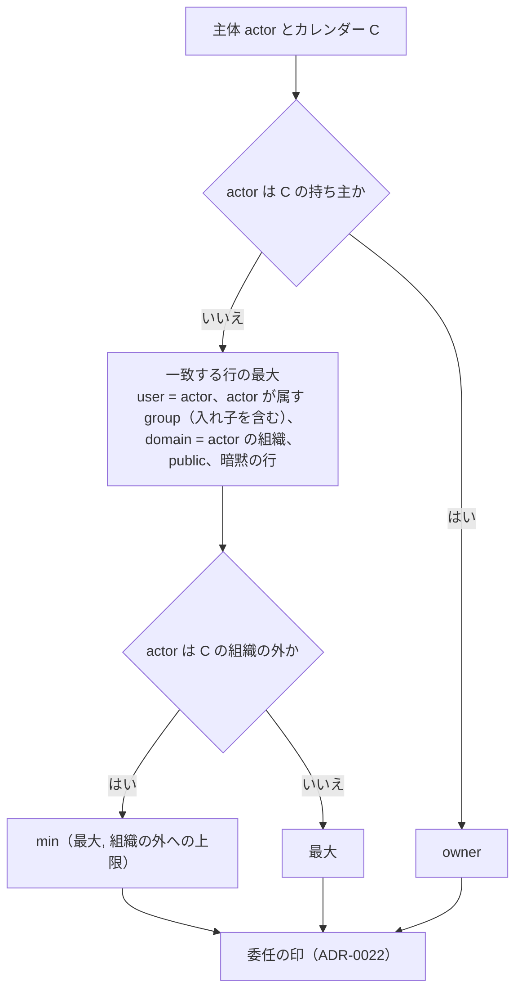

# Sharing and ACL: Google Calendar

カレンダーの ACL のロールと主体、実際のロールの求め方、予定の公開範囲、`can()` と `redact()` の決定表、組織の外への共有の方針、委任（代理の人）を決める。

前提となる決定は、テナントと権限（[ADR-0004](../decisions/0004-tenancy-and-rls.md)）、変更のログと `view_hash`（[ADR-0005](../decisions/0005-change-log-and-sync-tokens.md)）、写し（[ADR-0006](../decisions/0006-organizer-and-attendee-copies.md)）。この文書で決めたことは次の ADR にある。

| ADR | 決定 |
| --- | --- |
| [0021](../decisions/0021-effective-role-and-redact-table.md) | 実際のロールは、カレンダーの持ち主 → ACL の行（利用者・グループ・ドメイン・公開）と暗黙の行の最大 → 組織の外への上限の最小、の順で求める。`redact()` は「全体・全体から参加者を除く・区間だけ・返さない」の 4 段で返し、区間だけの形は時刻の構造だけを持つ。公開範囲はマスターだけが持つ。テナントをまたぐ共有のカレンダーへの書き込みは、読み出しと同じく、カレンダーのテナントのコンテキストで `packages/writer` を通して行う（[ADR-0004](../decisions/0004-tenancy-and-rls.md) の追補） |
| [0022](../decisions/0022-delegation-and-acting-on-behalf.md) | 代理の人は、主のカレンダーに `writer` 以上を持つ人とし、持ち主の名前で予定を作り、出欠を返せる。iTIP では `SENT-BY` に代理の人を入れ、監査ログに実際に操作した人と、代わりに操作した相手を残す。代理の人は持ち主の `private` の予定の中身も見られる |

## 1. 目的と範囲

- 扱う：
  - カレンダーの種類と持ち主、ACL のロールと主体、暗黙の ACL
  - 実際のロールの求め方と、組織の共有の方針
  - 予定の公開範囲（`default`・`public`・`private`・`confidential`）と、参加者の写しの公開範囲
  - `can()` の操作の決定表と、`redact()` の返す形の決定表
  - 方針の変更、グループの変化、共有の取り消しの効き方
  - 委任（代理の人）
  - 管理者による閲覧の枠（法務の確認待ち）
- 扱わない：
  - 空き時間の照会の経路（[free-busy-and-scheduling.md](free-busy-and-scheduling.md)）
  - 会議室を予約できる人の設定（[rooms-and-resources.md](rooms-and-resources.md)）
  - 参加者の権限（他の参加者を見る・招待する・変更する）の経路（[invitations-and-itip.md](invitations-and-itip.md)）
  - CalDAV の `current-user-privilege-set` の形、ICS の秘密のアドレスの発行（sync-and-caldav.md）
  - 検索の表への `redact()` の当て方（search.md）
  - 組織・グループ・ディレクトリ（accounts-and-orgs.md）、監査ログの形（security.md）

## 2. 要件

| 要件 | 目標 | NFR |
| --- | --- | --- |
| 漏れ | 他のテナントの予定、空き時間だけの共有の予定の中身、`private` の予定の中身が、画面・API・CalDAV・ICS・検索・通知・Webhook に届いた事象 0 件 | NFR-008、K8 |
| 1 つの判定 | すべての経路が `can()`・`redact()` の結果だけを使う | [ADR-0004](../decisions/0004-tenancy-and-rls.md) |
| 取り消しの効き | 共有の取り消し・方針の変更・グループの変化の後、古い同期のトークンで中身を返さない（410） | NFR-010、[ADR-0005](../decisions/0005-change-log-and-sync-tokens.md) |
| 速さ | `can()`・`redact()` は 1 予定 10 µs 以下（主体のロールを要求ごとに 1 回求めて使い回す） | NFR-001 |

## 3. 本家の形（確かめたこと）

いずれも 2026-10-04 に確認。

| 項目 | 内容 | 出典 |
| --- | --- | --- |
| ACL のロール | `none`、`freeBusyReader`、`reader`（`private` の予定は見えるが詳細は隠す）、`writerWithoutPrivateAccess`（書けるが `private` の詳細は隠す）、`writer`（`private` の詳細も見える）、`owner`（`writer` に加え、他の人の権限を変えられる） | [Acl resource](https://developers.google.com/workspace/calendar/api/v3/reference/acl) |
| ACL の主体 | `default`（公開）、`user`、`group`、`domain` | 同上 |
| 公開範囲 | `default`・`public`・`private`・`confidential`。繰り返しの 1 回の公開範囲を狭めると、系列の全体に効く | [Events resource](https://developers.google.com/workspace/calendar/api/v3/reference/events)、[architecture/README.md](README.md) の 1.4 節 |
| 組織の外への共有（主のカレンダー） | 「空き時間だけ（詳細を隠す）」「すべての情報を共有、外部の人は変更できない」「すべての情報を共有、外部の人は変更できる」「すべての情報を共有、カレンダーの管理を許す」 | [Set Google Calendar sharing options](https://knowledge.workspace.google.com/admin/calendar/set-google-calendar-sharing-options) |
| 組織の中の共有の既定（主のカレンダー） | 「共有しない」「空き時間だけ（詳細を隠す）」「すべての情報を共有」。追加のカレンダーにも同じ外部の共有の選択肢がある | 同上 |

- 本家の委任（代理の人）の細部（`SENT-BY` を付けるか、代理の人に `private` の予定が見えるか）は、公式の資料で確かめられなかった（**未検証**）。`writer` に `private` の詳細が見えることは上の ACL の文書で確かめた。
- `writerWithoutPrivateAccess` は MVP で持たない（[ADR-0004](../decisions/0004-tenancy-and-rls.md) の 5 つのロール）。必要なら MVP の後に、ロールを足す ADR で扱う。

## 4. カレンダーと ACL

### 4.1 カレンダーの種類

| 種類 | 持ち主 | 消せるか | 暗黙の ACL |
| --- | --- | --- | --- |
| 主のカレンダー | 利用者（1 人に 1 つ） | 消せない | 組織の中の共有の既定（4.4 節） |
| 追加のカレンダー | 作った利用者（`owner` を足せる） | `owner` が消せる | なし |
| 組織の共有のカレンダー | 組織（`owner` の行を持つ人が管理） | 組織の管理者 | なし |
| 会議室・設備のカレンダー | 組織 | 会議室を消すと消える | 組織の全員に `free_busy_reader`、会議室の管理者に `reader` |
| 日本の祝日（システム） | システム | — | 公開に `reader`（[time-zones-and-holidays.md](time-zones-and-holidays.md)） |

### 4.2 ACL の行

`calendar_acl`（カレンダーのテナント）：

| 列 | 意味 |
| --- | --- |
| `calendar_id` | — |
| `scope_type`・`scope_value` | `user`（アカウントの ID）・`group`（グループの ID）・`domain`（組織のテナントの ID）・`public` |
| `role` | `free_busy_reader`・`reader`・`writer`・`owner` |
| `disabled_reason` | 方針で無効にした（`policy_cap`）など。無効の行は判定に使わない |
| `granted_by`・`granted_at` | 監査 |

- ロールの順は `none` ＜ `free_busy_reader` ＜ `reader` ＜ `writer` ＜ `owner`。
- `public` の主体に付けられるのは `free_busy_reader` と `reader` だけ。組織の方針で公開を禁止できる。
- 本システムの外の人（アカウントのないメールアドレス）には ACL を付けない。共有の招待のメールを送り、相手がアカウントを作ってから行を有効にする（accounts-and-orgs.md）。

### 4.3 実際のロールの求め方

ADR-0021。

- グループの入れ子は、ディレクトリの写し（accounts-and-orgs.md）の展開で求める。展開の結果は、グループの版つきで要求の間だけ使い回す。
- 「組織の外」は、actor のテナントが C のテナントと違うこと。個人のテナントのカレンダーには上限がない（個人の方針は持たない）。
- 求めたロールと、効いた方針の組から `view_hash` を作る（[ADR-0005](../decisions/0005-change-log-and-sync-tokens.md)）。グループの変化や方針の変更でロールが変われば `view_hash` が変わり、古いトークンは 410 になる。

### 4.4 組織の方針

本家の管理の設定（3 節）に寄せて、次を組織ごとに持つ。値は本システムの既定。

| 設定 | 選択肢 | 既定 | 効き方 |
| --- | --- | --- | --- |
| 組織の中の共有の既定（主のカレンダー） | 共有しない・空き時間だけ・すべて（`reader`） | 空き時間だけ | 組織の全員への暗黙の `domain` の行 |
| 組織の外への上限（主のカレンダー） | 空き時間だけ・`reader`・`writer`・`owner` | 空き時間だけ | 外の主体の実際のロールの上限 |
| 組織の外への上限（追加・共有のカレンダー） | 同上 | 空き時間だけ | 同上 |
| 公開（`public`）を許すか | 許す・許さない | 許さない | `public` の行を作れない・無効 |
| ICS の秘密のアドレスを許すか | 許す・許さない | 許す | 発行は sync-and-caldav.md |

- 既定を「空き時間だけ」にしたのは、外への共有で予定の中身が漏れる危険を小さくするため（本家の既定の値は**未検証**）。
- 方針を狭めたら、上限を超える ACL の行を `disabled_reason=policy_cap` にし、変更のログに `kind=acl` で載せる（[ADR-0004](../decisions/0004-tenancy-and-rls.md)）。方針を広げても、無効にした行は自動で戻さない（持ち主が付け直す）。

### 4.5 テナントをまたぐ共有

- 共有されたカレンダーの読み出しは、カレンダーのテナントのコンテキストで行い、`redact()` を通してから返す（[ADR-0004](../decisions/0004-tenancy-and-rls.md)）。
- 外の主体が `writer` 以上を持つときの書き込み（家族の個人のアカウントどうしの共有、組織の方針で外の人に変更を許した場合）は、読み出しと同じく、カレンダーのテナントのコンテキストで、専用の DB のロール（`shared_calendar_access`）から `packages/writer` を通して行う。変更のログと outbox は、カレンダーのテナントに書く（ADR-0021）。
- これは共有されたカレンダーの読み出しを書き込みに広げるもので、統合の工程で [ADR-0004](../decisions/0004-tenancy-and-rls.md) のテナントをまたぐ経路の許可リストの X4 にした。題材の `AGENTS.md` も同じ一覧を指す。有効にするのはテックリードの確認の後で（15 節）、それまで `release.cross-tenant-shared-writes` のフラグの裏に置く。認められなければ、組織の外・個人のテナントどうしの上限を `reader` にする。

## 5. 予定の公開範囲

### 5.1 値と効き方

| 値 | 意味 |
| --- | --- |
| `default` | カレンダーの既定（`calendars.default_visibility`、`public` か `private`。既定は `public`）に従う |
| `public` | カレンダーの `reader` に中身を見せる |
| `private` | 参加者と、カレンダーの `writer` 以上にだけ中身を見せる |
| `confidential` | `private` と同じに扱う（互換のため。[ADR-0004](../decisions/0004-tenancy-and-rls.md)） |

- 公開範囲は、予定オブジェクトのマスターだけが持つ。1 回分の公開範囲を変える要求は、系列の全体に当て、応答で示す（本家と同じ。3 節）。上書きは公開範囲を持たない（[events-and-recurrence.md](events-and-recurrence.md) の 3.1 節）。
- 参加者の写しの公開範囲は、主催者の写しの値で始まり、参加者が自分の写しで変えられる（自分の項目。[ADR-0006](../decisions/0006-organizer-and-attendee-copies.md)）。参加者のカレンダーを見る人には、参加者の写しの値が効く。
- 参加者の写しの値を主催者の値より広げても（`private` → `public`）、その参加者のカレンダーの `reader` に中身が見えるだけで、主催者の写しには影響しない。広げることは許す（参加者の判断）が、画面で確かめる（clients.md）。

## 6. `redact()`

ADR-0021。

### 6.1 返す形

| 段 | 返すもの |
| --- | --- |
| `FULL` | 予定オブジェクトの全体。他の参加者のコメントは、主催者とその参加者にだけ返す |
| `FULL_NO_GUESTS` | `FULL` から、主催者と自分以外の参加者を除く（`can_see_other_guests=false`） |
| `BUSY` | 時刻の構造だけ：開始・終了・TZID、RRULE・RDATE・EXDATE、上書きの時刻、`status`。ID は見る人ごとの不透明な値。タイトルは返さない（画面と CalDAV は「予定あり」と表示する） |
| `NONE` | 返さない。存在も示さない |

- `BUSY` の不透明な ID は、`HMAC(key, viewer_id || event_object_id)` で作る。経路をまたいで、見る人ごとに同じ値で、他の見る人の値や本当の ID と結び付けられない。
- `BUSY` に含めないもの：タイトル、場所、説明、参加者、主催者、添付、会議の URL、色、予定の種類、`x_props`、リマインダー。

### 6.2 決定表

DT-ACL-001。上の行から順に当てる。`R` は実際のロール、`V` は効く公開範囲（`default` を解いた後）、`P` は見る人が参加者（主催者を含む）か、`T` は `transparency`。

| # | 条件 | → 段 |
| --- | --- | --- |
| 1 | `R = none` | `NONE` |
| 2 | 写しの `copy_state` が `hidden`・`cancelled` で、見る人がカレンダーの持ち主以外 | `NONE`（持ち主には同期の墓標として返す） |
| 3 | `P = はい` | `FULL`（`can_see_other_guests=false` で、見る人が主催者でなければ `FULL_NO_GUESTS`） |
| 4 | `R ∈ {owner, writer}` | `FULL` |
| 5 | `R = reader`、`V = public` | `FULL`（`can_see_other_guests=false` なら `FULL_NO_GUESTS`） |
| 6 | `R = reader`、`V = private` | `BUSY` |
| 7 | `R = free_busy_reader`、`T = transparent` | `NONE` |
| 8 | `R = free_busy_reader`、`T = opaque` | `BUSY`（空き時間の経路では区間と種類だけ） |
| 9 | 管理者が、生きている閲覧の許可（`admin_access_grants`）の範囲の中で読む | `FULL`。`private` の予定は、許可が `private` を含むときだけ `FULL`、含まなければ `BUSY`。`release.admin-event-access` の裏で、**法務の確認待ち：L8** の結論まで本番で有効にしない（[ADR-0037](../decisions/0037-admin-roles-delegation-and-event-access.md)） |

- 行 6 は、本家の `reader` の説明（`private` の予定は見えるが詳細は隠す）に合わせた（3 節）。
- 行 4 の `writer` が `private` の中身を見られるのは、本家の `writer` と同じ（3 節）。
- 行 2 は、[ADR-0004](../decisions/0004-tenancy-and-rls.md) の骨格の表に足した行である。
- 空き時間の照会は、`BUSY` の中からさらに区間と種類だけを使う（[free-busy-and-scheduling.md](free-busy-and-scheduling.md)）。

### 6.3 例

| 見る人 | 予定（Alice の主のカレンダー） | ロール | → |
| --- | --- | --- | --- |
| Bob（同じ組織、Alice が `reader` を付けた） | 「人事面談」14:00〜15:00、`private` | `reader` | `BUSY`：14:00〜15:00 の「予定あり」 |
| Bob | 「週次の定例」、`public`、Bob は参加者でない | `reader` | `FULL` |
| Bob | 「人事面談」、Bob が参加者 | `reader` | `FULL`（行 3） |
| Carol（同じ組織、何も付いていない） | 「週次の定例」 | 組織の中の既定で `free_busy_reader` | `BUSY` |
| Carol | 「移動の時間」、`transparent` | `free_busy_reader` | `NONE` |
| Dan（他の組織。Alice が `reader` を付けたが、Alice の組織の外への上限は空き時間だけ） | 「週次の定例」 | `min(reader, free_busy_reader)` | `BUSY` |
| Eve（Alice の秘書。Alice の主のカレンダーに `writer`） | 「人事面談」、`private` | `writer` | `FULL`（行 4） |

## 7. `can()`

DT-ACL-002。`can(actor, action, target)`。

| 操作 | 許す条件 |
| --- | --- |
| `read_event` | `redact()` が `NONE` でない |
| `create_event`・`update_event`・`delete_event`（カレンダーの予定） | `R ≥ writer` |
| 参加者の写しの共有の項目を変える | 許さない（だれでも。[ADR-0006](../decisions/0006-organizer-and-attendee-copies.md)） |
| 参加者の写しの自分の項目を変える・出欠を返す | 写しのカレンダーの持ち主、またはその代理の人（[ADR-0022](../decisions/0022-delegation-and-acting-on-behalf.md)） |
| 主催者の写しの共有の項目を参加者として変える | 参加者で、主催者の写しの `can_modify`（[invitations-and-itip.md](invitations-and-itip.md) の 8 節） |
| `change_acl`・カレンダーの設定を変える | `R = owner`。組織の外への共有は上限の中だけ |
| カレンダーを消す | `R = owner`。主のカレンダーは消せない |
| `view_freebusy` | `R ≥ free_busy_reader` |
| `book`（会議室） | 会議室の `allowed_bookers`（[rooms-and-resources.md](rooms-and-resources.md)） |
| `expand`（グループの招待での展開） | グループのメンバーを見られる（accounts-and-orgs.md） |
| ICS の秘密のアドレスを作る | `R = owner`、組織の方針で許す |

- `packages/policy` の外で、`role ===`・`visibility ===` などの条件を書かない（[ADR-0004](../decisions/0004-tenancy-and-rls.md) の lint）。

## 8. 変化の効き方

| 変化 | 効き方 |
| --- | --- |
| ACL の行の追加・変更・削除 | `packages/writer` で、カレンダーの `change_seq` を振り、`calendar_changes` に `kind=acl` を載せる。Realtime の合図で、見ているクライアントが取り直す |
| 方針の変更 | 4.4 節。無効にした行ごとに `kind=acl` |
| グループのメンバーの変化 | ACL の行は変わらない。次の要求でロールを求め直し、`view_hash` が変われば古いトークンは 410 |
| 公開範囲の変更 | 予定オブジェクトの変更として版を上げ、変更のログに載せる。`reader` の差分は、その予定の新しい段（`FULL` ↔ `BUSY`）で返す |
| 共有の取り消し | ロールが `none` になれば、そのカレンダーへのトークンは 410。Webhook の通知の経路は止める（api-and-push.md） |

## 9. 委任（代理の人）

ADR-0022。

- 代理の人は、ある利用者の主のカレンダーに `writer` 以上を持つ人である。別の「代理」のロールは作らない。
- 代理の人ができること：
  - 持ち主のカレンダーに予定を作る。主催者は持ち主にし、iTIP の ORGANIZER に `SENT-BY` で代理の人を入れる（RFC 5545 の 3.2.18 節、RFC 5546 の 3.2.2.5 節）。
  - 持ち主の写しの出欠を返す。`REPLY` の ATTENDEE に `SENT-BY` で代理の人を入れる。
  - 持ち主の `private` の予定の中身を見る（`writer` の段。6.2 節の行 4）。
- 監査ログに、実際に操作した人（`actor_id`）と、代わりに操作した相手（`on_behalf_of`）を残す（security.md）。変更のログには入れない（変更のログは見る人に配られる）。
- 組織の外の代理の人は、組織の外への上限が `writer` 以上のときだけ。
- 代理の人への招待の通知の写しは、reminders-and-notifications.md で扱う。

## 10. 管理者による閲覧

- 組織の管理者・監査の担当が、従業員の予定（`private` を含む）を見られる範囲は、**法務の確認待ち：L8**。仕組みは [ADR-0037](../decisions/0037-admin-roles-delegation-and-event-access.md) のとおり `release.admin-event-access` の裏に作り、L8 の結論まで本番で有効にしない。E11 の `admin-event-access` の spec は L8 の結論まで承認しない。
- 設計の枠：
  - 閲覧は、`admin_access_grants`（理由・期間・範囲）を `redact()` の入力にし、決定表の行 9 で返す。経路を別に作らない。
  - 許可と、読んだ予定の ID を、監査ログに必ず書く（[ADR-0042](../decisions/0042-audit-log-and-data-lifecycle.md)）。
  - 閲覧された従業員に知らせるかは、方針 `admin_event_access_notify` で持ち、既定は L8 の結論で決める（[accounts-and-orgs.md](accounts-and-orgs.md) の 14 節）。

> 2026-10-04 の注記：領域の工程では、この節は「結論まで経路を作らない」とし、[ADR-0037](../decisions/0037-admin-roles-delegation-and-event-access.md)（フラグの裏に仕組みを作る）と食い違っていた。統合の工程で ADR-0037 に揃え、主体の名前 `org_admin_audit` を `admin_access_grants` に揃えた。
- 管理者は、ACL の行と方針の設定、会議室の管理はできる（中身を見ない操作）。

## 11. 障害のときの振る舞い

| 事象 | 起きること | 備え |
| --- | --- | --- |
| RLS のコンテキストの設定漏れ | 予定が「ない」に見え、同期で「消えた」に見える | 結合テストで全経路のコンテキストを確かめる（[ADR-0004](../decisions/0004-tenancy-and-rls.md)） |
| ディレクトリの写しが遅れる | グループのメンバーのロールが古い | 写しの版を `view_hash` に含め、遅れの間はロールが古いことを受け入れる。遅れ（SCIM から写しまで）p99 1 分を監視（accounts-and-orgs.md） |
| 方針の変更で大量の ACL の無効化 | 多くのクライアントの取り直し | 無効化を 1,000 行ずつ流す。取り直しの集中は [ADR-0005](../decisions/0005-change-log-and-sync-tokens.md) のとおり引き受ける |
| `redact()` の誤り（新しい版） | 中身の漏れ | 応答の監査（抜き取りを `redact()` に通し直して比べる）で検知。漏れている経路を `ops.*` のフラグで止め（検索、ICS の公開、Webhook など。[security.md](security.md) の 12 節）、前のイメージへロールバックする。権限の規則はフラグにしない（[runbooks/README.md](../runbooks/README.md) の 3 節）。SEV1 の候補 |

## 12. セキュリティ

- 漏れの経路の表（[quality.md](../quality.md) の 2.2.1 節 D）の各行で、DT-ACL-001 の行 1・2・6・7・8 の主体の応答に中身が出ないことを確かめる。この文書から足す行：
  - CalDAV の `BUSY` の VEVENT（`SUMMARY` は「予定あり」の固定の文字、他のプロパティなし）
  - ICS の秘密のアドレス（主体は持ち主の `reader` と同じ段）
  - 不透明な ID（経路をまたいで本当の ID と結び付けられない）
- `BUSY` で時刻の構造（RRULE）を返すのは、本家の `reader` が `private` の予定の時刻を見られることに合わせた判断である。系列の型（毎週の 1on1 など）から中身を推測できる危険は引き受ける。
- 組織の外への上限の既定を「空き時間だけ」にする。

## 13. テスト

決定表（spec から読み込み、`can()`・`redact()` と各経路で同じ表を使う）：

- **DT-ACL-001（`redact()`）**：6.2 節の 9 行 × `can_see_other_guests`。
- **DT-ACL-002（`can()`）**：7 節の表。
- **DT-ACL-003（実際のロール）**：4.3 節の流れ × 持ち主・行の種類・入れ子のグループ・組織の中と外・上限・個人のテナント。

性質ベーステスト：

- **PROP-ACL-001（中身の漏れなし）**：任意の ACL・公開範囲・参加者・方針・グループの組み合わせで、`BUSY`・`NONE` の段の応答に、タイトル・場所・説明・参加者・添付・会議の URL が含まれない。経路（API、CalDAV、ICS、検索、通知、Webhook）ごとに確かめる（[ADR-0004](../decisions/0004-tenancy-and-rls.md) の Confirmation）。
- **PROP-ACL-002（ロールの単調）**：任意の主体で、ACL の行を足すとロールは下がらず、方針の上限を狭めるとロールは上がらない。
- **PROP-ACL-003（取り消しの効き）**：任意の共有の変更の列の後、ロールが下がった主体の古いトークンは 410 になり、410 にならずに見てはいけない中身を返さない（[ADR-0005](../decisions/0005-change-log-and-sync-tokens.md) の Confirmation と同じ）。
- **PROP-ACL-004（不透明な ID）**：2 人の見る人の `BUSY` の ID が、同じ予定で違い、本当の ID と一致しない。
- **PROP-ACL-005（公開範囲は系列で 1 つ）**：任意の 1 回分の公開範囲の変更の後、系列のすべての回の `redact()` の段が同じになる。

結合テスト：テナントをまたぐ共有のカレンダーへの書き込みが、カレンダーのテナントの変更のログに載り、書いた人のテナントには何も書かれない。

## 14. Story の候補

| Epic | Story | 中身 |
| --- | --- | --- |
| E4 | `policy-can-redact` | 6・7 節（ADR-0021。DT-ACL-001・002、PROP-ACL-001・004） |
| E4 | `calendar-acl` | 4.1〜4.3 節（DT-ACL-003、PROP-ACL-002） |
| E4 | `event-visibility` | 5 節（PROP-ACL-005） |
| E4 | `org-sharing-policy` | 4.4 節と 8 節（PROP-ACL-003） |
| E4 | `cross-tenant-shared-writes` | 4.5 節（テックリードの確認の後） |
| E4 | `delegation` | 9 節（ADR-0022） |
| E4 | `leak-path-tests` | 12 節の行を漏れの経路の表に足す |
| E11 | `admin-event-access` | 10 節。法務：L8 |

## 15. 未解決の問い

### 決定

2026-10-04 の既定案。E4 の試用で覆りうる。

- **`redact()` の段**：4 段。`BUSY` は時刻の構造だけ、ID は見る人ごとに不透明（ADR-0021）。
- **公開範囲**：マスターだけ（本家と同じ）。
- **組織の外への上限の既定**：空き時間だけ。
- **テナントをまたぐ書き込み**：カレンダーのテナントのコンテキストで `packages/writer` を通す（ADR-0021。ADR-0004 の許可リストの X4。有効にするのはテックリードの確認の後）。
- **委任**：`writer` 以上を代理とし、`SENT-BY` と監査ログ（ADR-0022）。
- **`writerWithoutPrivateAccess`**：MVP で持たない。

### 持ち越し

| 問い | いつ・どう決めるか |
| --- | --- |
| 管理者による閲覧の範囲、従業員への周知、閲覧の記録 | **法務の確認待ち：L8** |
| テナントをまたぐ書き込み（[ADR-0004](../decisions/0004-tenancy-and-rls.md) の X4）を有効にするか | テックリード（Dev）の確認。それまで `release.cross-tenant-shared-writes` の裏。認めなければ、組織の外・個人のテナントどうしの共有の上限を `reader` にする |
| `BUSY` で RRULE を返すことの是非 | E4 のセキュリティのレビュー |
| 本家の委任の細部、組織の方針の既定の値 | 公式の資料で確かめられなかった（**未検証**のまま） |

## 16. quality.md・runbooks・data-model への項目

### quality.md

- DT-ACL-001〜003、PROP-ACL-001〜005 を E4 のリリースの基準にする。漏れの経路の表に 12 節の 3 行を足す。
- 本番：応答の監査の不一致 0 件、方針の変更での無効化の数、410 の率（方針の変更の直後を分けて数える）。

### runbooks

- `access-leak-response.md`：応答の監査の不一致・漏れの報告のときの確かめ方（経路、主体、決定表の行）、経路の `ops.*` での停止と前のイメージへの戻し、影響の範囲の見積もり（ID と数だけ）（統合の工程で、提案の `policy-leak-suspected.md` をこの名前に揃えた）。
- `org-policy-change.md`（予定）：大きな組織の方針の変更の前の見積もり（無効になる行の数、取り直しのクライアントの数）と、流す速さ。

### data-model（索引への追加の提案）

| 表 | 中身 | 節 |
| --- | --- | --- |
| `calendars` に足す列 | `kind`（`primary`・`secondary`・`shared`・`resource`・`subscription`・`system`。[data-model.md](data-model.md) の 5 節で揃えた）、`owner_user_id`（持ち主。組織・システムのカレンダーは NULL。[data-model.md](data-model.md) の D-18）、`default_visibility` | 4.1、5.1 |
| `calendar_acl` | 4.2 節。主キー `(tenant_id, calendar_id, scope_type, scope_value)` | 4.2 |
| `org_sharing_policies` | 4.4 節の設定 | 4.4 |
| `event_objects` の列 | `visibility`（マスターだけ）。参加者の写しの自分の公開範囲 | 5.1 |
| `tenant_audit_events` に足す列（[ADR-0042](../decisions/0042-audit-log-and-data-lifecycle.md)） | `actor_id`、`on_behalf_of` | 9 |
| DB のロール | `shared_calendar_access`（テナントをまたぐ共有のカレンダーの読み書き） | 4.5 |

## 出典

いずれも 2026-10-04 に確認。

- Google for Developers, [Acl resource](https://developers.google.com/workspace/calendar/api/v3/reference/acl)、[Events resource](https://developers.google.com/workspace/calendar/api/v3/reference/events)
- Google Workspace Admin Help, [Set Google Calendar sharing options](https://knowledge.workspace.google.com/admin/calendar/set-google-calendar-sharing-options)
- IETF, [RFC 5545](https://www.rfc-editor.org/rfc/rfc5545)（3.2.18 節）、[RFC 5546](https://www.rfc-editor.org/rfc/rfc5546)（3.2.2.5 節）
