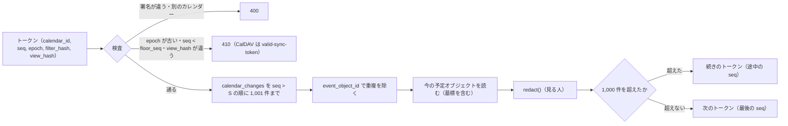
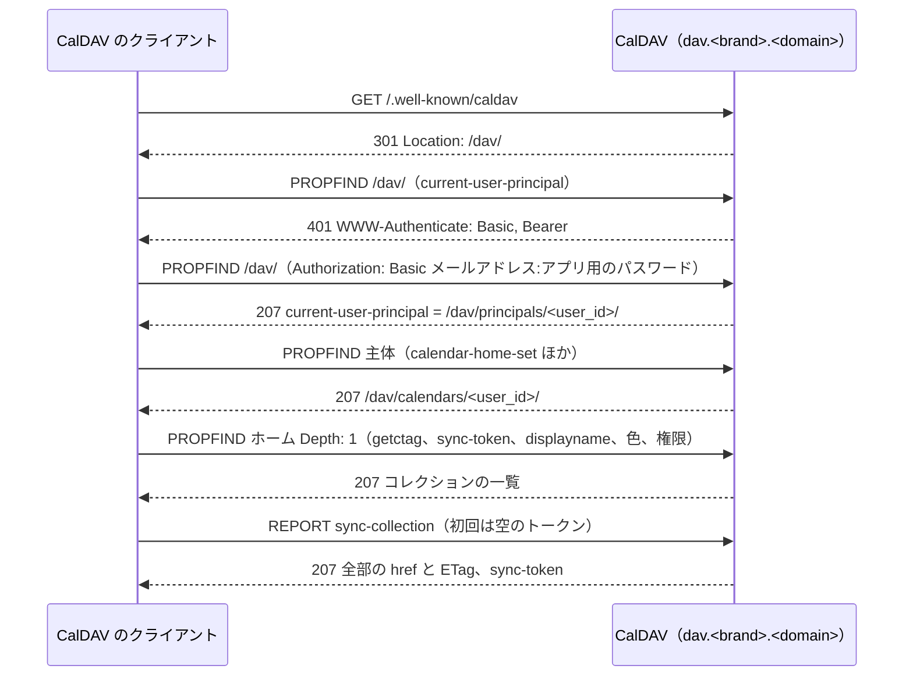
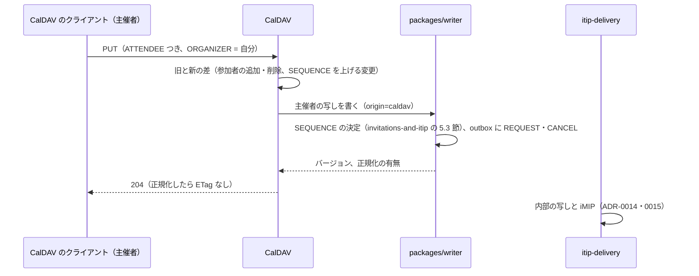
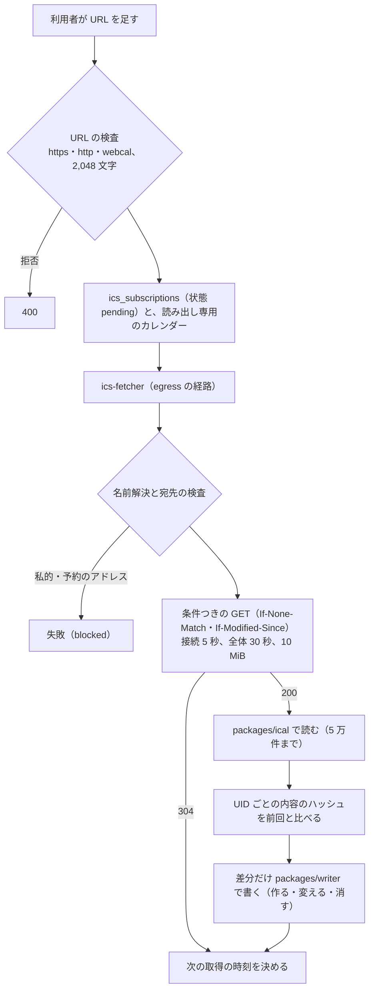
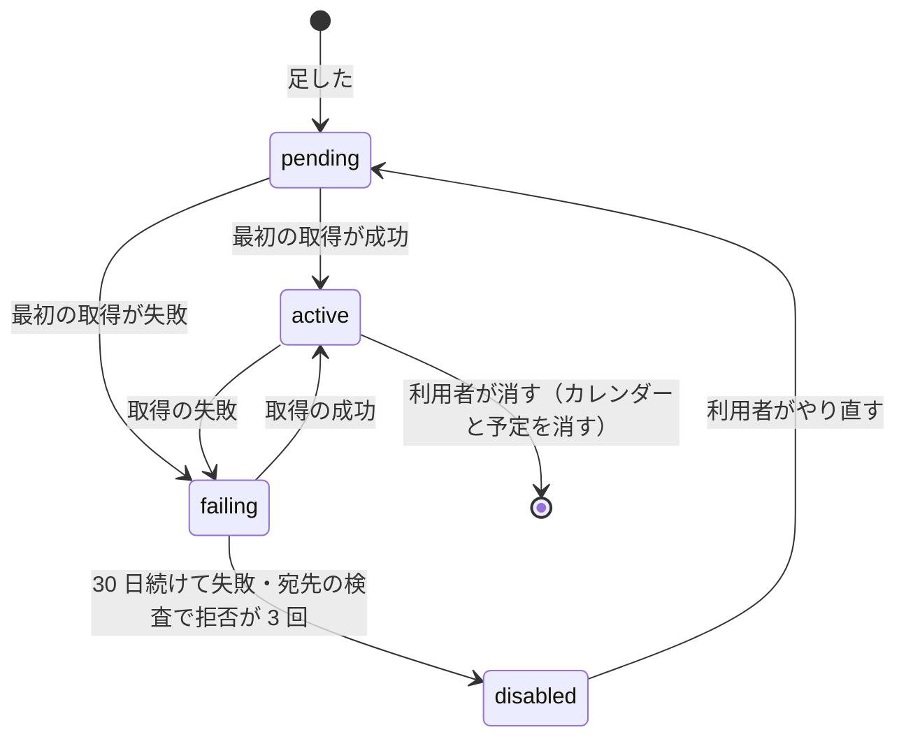

# Sync and CalDAV: Google Calendar

変更のログの形と保持、同期のトークンの使い方、Web のクライアントの差分の取り方、CalDAV（リソースの形、ETag と CTag、条件つきの書き込み、`calendar-query`・`calendar-multiget`・`sync-collection`、暗黙のスケジュール）、発見、CalDAV の認証、ICS の購読（取り込む向きと公開する向き）、ICS の取り込みと書き出しを決める。

前提となる決定は、基盤（[ADR-0001](../decisions/0001-platform-and-stack.md)）、時刻の表し方（[ADR-0002](../decisions/0002-time-representation.md)）、繰り返しの保存と展開（[ADR-0003](../decisions/0003-recurrence-storage-and-expansion.md)）、テナントと権限（[ADR-0004](../decisions/0004-tenancy-and-rls.md)）、変更のログと同期のトークン（[ADR-0005](../decisions/0005-change-log-and-sync-tokens.md)）、写し（[ADR-0006](../decisions/0006-organizer-and-attendee-copies.md)）、標準の範囲（[ADR-0007](../decisions/0007-interop-standards-scope.md)）、取り込みの繰り返しの正規化（[ADR-0011](../decisions/0011-inbound-recurrence-normalization.md)）、外から来る TZID（[ADR-0013](../decisions/0013-external-timezone-definitions.md)）、iTIP の状態の転送（[ADR-0014](../decisions/0014-itip-state-transfer-and-sequence.md)）、iMIP のアドレス（[ADR-0015](../decisions/0015-imip-addressing-and-trust.md)）。認証の部品とアプリ用のパスワードの形は [accounts-and-orgs.md](accounts-and-orgs.md) の [ADR-0035](../decisions/0035-accounts-auth-library-and-credentials.md)。この文書で決めたことは次の ADR にある。

| ADR | 決定 |
| --- | --- |
| [0023](../decisions/0023-caldav-resource-model-and-conditional-writes.md) | CalDAV は `dav.<brand>.<domain>` に、主体・カレンダーのホーム・カレンダーのコレクション・予定オブジェクトのリソースの 4 層で出す。共有されたカレンダーは、見る人のホームに同じ `calendar_id` で出す。リソースの名前はクライアントが付けた名前を保ち、ETag は `"<object_version>-<見え方の記号>"`。保存の時に中身を変えたら `PUT` の応答に ETag を返さない。`sync-collection` は 1 回 1,000 件で切り、続きを 507 で示す。空き時間だけの共有のカレンダーは CalDAV に出さない |
| [0024](../decisions/0024-caldav-implicit-scheduling.md) | CalDAV の `PUT` は、主催者の写しなら暗黙のスケジュールで内部の iTIP と iMIP を送り、参加者の写しなら旧と新の差を取り、自分の項目の変更だけを受ける（他は 403 の `allowed-attendee-scheduling-object-change`）。`SCHEDULE-AGENT=CLIENT` は外部の参加者にだけ従い、本システムの中の参加者には常にサーバーが配る。参加者の写しに `Schedule-Tag` を出す。受信箱・送信箱は空のものだけ |
| [0025](../decisions/0025-ics-subscriptions-both-directions.md) | 取り込む ICS の購読は、購読ごとの読み出し専用のカレンダーに UID ごとの予定オブジェクトとして写し、`ics-fetcher` が egress の経路で 6 時間ごと（`REFRESH-INTERVAL` で 1〜24 時間）に条件つきで取り、内容のハッシュで差分だけを `packages/writer` で書く。公開する ICS は、カレンダーの持ち主が出す秘密のアドレス（160 ビットの乱数、見え方は全体か空き時間だけ）で、組織の方針で止められ、作り直すと古いアドレスは 404 になる |

## 1. 目的と範囲

- 扱う：
  - 変更のログ（`calendar_changes`）の保持、削除の墓標、差分の組み立て
  - 同期のトークンを経路ごとにどう使うか（Web のクライアント、CalDAV。公開 API は [api-and-push.md](api-and-push.md)）
  - CalDAV：発見、主体とホーム、コレクション、リソース、ETag・CTag・`sync-token`、`PUT`・`DELETE` の条件、`REPORT`、暗黙のスケジュール、認証
  - ICS の購読（外部の URL を取り込む）と公開（秘密のアドレス）
  - ICS の取り込みと書き出し
- 扱わない：
  - トークンの中身の形と署名（[ADR-0005](../decisions/0005-change-log-and-sync-tokens.md)。この文書は使い方だけ）
  - 公開 API のリソースの形、Webhook（[api-and-push.md](api-and-push.md)）
  - iTIP の当て方の決定表（[invitations-and-itip.md](invitations-and-itip.md)。この文書は CalDAV から入る要求の形だけ）
  - 繰り返しの入力の正規化の規則（[events-and-recurrence.md](events-and-recurrence.md) の 8 節、ADR-0011）
  - `redact()` の決定表の本体（[sharing-and-acl.md](sharing-and-acl.md)）
  - アプリ用のパスワードの発行と保存（[accounts-and-orgs.md](accounts-and-orgs.md)）
  - Realtime の WebSocket の接続と再接続（[clients.md](clients.md)、[infrastructure.md](infrastructure.md)）
  - egress の経路の作り方（[infrastructure.md](infrastructure.md)、[security.md](security.md)）

## 2. 要件

| 要件 | 目標 | NFR・基準 |
| --- | --- | --- |
| 差分の速さ | 変更 1,000 件以下の差分の応答 p99 1 秒（Web・API・CalDAV） | NFR-010 |
| 差分の正しさ | 差分を順に当てた結果が、全件の取り直しと同じ。トークンが使えないときは黙って欠けた差分を返さず、取り直しを求める | NFR-010、[intent.md](../intent.md) の「守るべき振る舞い」 |
| トークンの寿命 | 最後の利用から 30 日は使える。取り直しは期限切れ・見え方の変化・`sync_epoch` の更新のときだけ | NFR-010、[ADR-0005](../decisions/0005-change-log-and-sync-tokens.md) |
| 伝播 | 確定から同じ利用者の他の Web クライアントの表示まで p99 3 秒 | NFR-002 |
| 可用性 | CalDAV の読み書き 月間 99.9% | NFR-006 |
| 漏れ | CalDAV の `calendar-data`・`calendar-query` の条件・ICS の公開に、見てはいけない中身を出さない | NFR-008 |
| 相互運用 | iOS・macOS のカレンダー、Thunderbird、DAVx5 で受け入れ試験の場面の 100% | K9 |
| ICS の購読 | 既定 6 時間ごとに取る。1 回 10 MiB・予定 5 万件まで。内部のアドレスへ要求しない | [architecture/README.md](README.md) の 6 節、[quality.md](../quality.md) の 2.2.1 節 I |
| CalDAV の量 | S1 で CalDAV の読み出し 2,000 件/秒（多くは CTag・`sync-collection` の確かめ） | [architecture/README.md](README.md) の 2 節 |

## 3. 本家の形と標準（確かめたこと）

いずれも 2026-10-04 に確認。

| 項目 | 内容 | 出典 |
| --- | --- | --- |
| CalDAV の入口 | 主体 `…/caldav/v2/<calendarId>/user`、コレクション `…/caldav/v2/<calendarId>/events` の 2 つ。HTTPS と OAuth 2.0 だけで認証し、Basic 認証は 401 | [CalDAV API developer's guide](https://developers.google.com/workspace/calendar/caldav/v2/guide) |
| CalDAV の対応 | RFC 4918 の `GET`・`PUT`・`HEAD`・`DELETE`・`POST`・`OPTIONS`・`PROPFIND`・`PROPPATCH`、RFC 4791 の `REPORT`（`free-busy-query` を除く）、RFC 6578、RFC 6638 は受信箱を空にして招待を予定のコレクションへ直接入れる、CTag、代理のプロパティ | 同上 |
| CalDAV の非対応 | ロック・コピー・移動、`MKCOL`・`MKCALENDAR`、VTODO・VJOURNAL、`AUDIO` のアラーム、`free-busy-query`、利用者の定義したプロパティ、WebDAV の ACL | 同上 |
| CalDAV の上限 | Calendar API と同じ割り当て | 同上 |
| 差分の同期 | 410 はトークンが無効で、手元を消して全件を取り直す。差分で使える問い合わせの条件は最初の要求と同じにし、違えば 400。差分には削除が必ず入る。ページは `pageToken` で続け、最後のページに新しいトークン | [Synchronize resources efficiently](https://developers.google.com/workspace/calendar/api/guides/sync) |
| 秘密のアドレス | 「iCal 形式の秘密のアドレス」で、1 つのカレンダーを他のアプリから読み出し専用で見られる。作り直すと古いアドレスは使えなくなる | [Sync Google Calendar with other calendar apps](https://support.google.com/calendar/answer/37648) |

- 本家の同期のトークンの有効の期間、ICS の購読を取り直す間隔、CalDAV の要求の数の上限の値は、公式の資料で確かめられなかった（**未検証**）。本システムの値は 2 節。
- 本家の CalDAV のリソースの名前の付け方、ETag の作り方、Schedule-Tag を出すかは、公式の資料にない（**未検証**）。

RFC の要点：

| RFC と節 | 内容 | 本システム |
| --- | --- | --- |
| RFC 4791 の 4.1 | 1 つのリソースは 1 つの UID の VEVENT（マスターと上書き）を持つ | 予定オブジェクト 1 つ＝リソース 1 つ（[ADR-0003](../decisions/0003-recurrence-storage-and-expansion.md)） |
| RFC 4791 の 5.3.2.1 | `PUT` の前提：`supported-calendar-data`、`valid-calendar-data`、`valid-calendar-object-resource`、`supported-calendar-component`、`no-uid-conflict`、`max-resource-size` など | 6.4 節 |
| RFC 4791 の 5.3.4 | 保存の時に中身を変えたら、`PUT` の応答に強い ETag を返してはならない | 6.3 節 |
| RFC 4791 の 7.8・7.9・9.6.5 | `calendar-query`、`calendar-multiget`、`calendar-data` の `expand` | 6.5 節 |
| RFC 6578 の 3.2〜3.8 | `sync-collection`、`Depth: 0`、`sync-level` 1、削除は 404 の応答、結果の切り詰めは要求の URI への 507、無効なトークンは `valid-sync-token` の前提の違反 | 6.6 節 |
| RFC 6638 の 3.2・3.2.10 | 暗黙のスケジュール、`SCHEDULE-AGENT`、`Schedule-Tag` と `If-Schedule-Tag-Match` | 7 節 |
| RFC 6764 の 5・6 | `/.well-known/caldav`、DNS の SRV（`_caldavs._tcp`）と TXT（`path=`） | 6.1 節 |
| RFC 5545 の 3.7・3.8 | ICS の公開の VCALENDAR、`METHOD:PUBLISH` | 8 節 |
| RFC 7986 の 5.7・5.8 | `REFRESH-INTERVAL`、`SOURCE` | 8.2・8.3 節 |

## 4. 変更のログ

### 4.1 形と保持

[ADR-0005](../decisions/0005-change-log-and-sync-tokens.md) の `calendar_changes(tenant_id, calendar_id, seq, kind, event_object_id, object_version, committed_at)` を使う。この領域で次を足す。

| 項目 | 決定 |
| --- | --- |
| 分割 | `committed_at` の日で分割（`pg_partman`）。30 日を過ぎた分割を落とす（保持は法務の L5 の後に確定） |
| `floor_seq` | カレンダーごとに、残っている最小の `seq`。分割を落とすジョブが、落とす前に `calendars.floor_seq` を上げる |
| 削除の墓標 | `deleted_event_objects(tenant_id, calendar_id, event_object_id, uid, href_name, deleted_seq, deleted_at)`。差分と CalDAV の 404 の応答に要る識別子を持つ。変更のログと同じ 30 日 |
| `kind` | `upsert`・`delete`・`calendar`（名前・色・タイムゾーン）・`acl`（共有の変更）。`acl` と、見え方を変える方針の変更は、トークンの `view_hash` と比べる元（4.3 節） |

- 参加者の写しの `cancelled`・`hidden` は、写しの見え方として `upsert` で配る。Web は `hidden` を表示しない。CalDAV と公開 API は、`cancelled` を削除として、`hidden` を削除として返す（他のクライアントで見えないようにする。戻したら `upsert`）。
- 保留の招待（[invitations-and-itip.md](invitations-and-itip.md) の 4.3 節）は予定オブジェクトでないので、ログに載らない。

### 4.2 差分の組み立て



- 読み出しは Aurora の reader から行う。reader の遅れで最新の数件が欠けても、次のトークンの `seq` は reader で読めた最大の `seq` にするので、次の差分で拾う（欠けない）。
- 同じ予定オブジェクトが範囲の中で何度変わっても 1 件にする。順序は、最後に変わった `seq` の順。
- 1 回の応答は 1,000 件まで。続きは、公開 API では次のページのトークン、CalDAV では 507（6.6 節）。
- NFR-010 の予算：ログの範囲の読み出し 50 ms、予定オブジェクト 1,000 件の読み出し 300 ms、`redact()` と直列化 300 ms、余裕 350 ms。

### 4.3 見え方の変化

- トークンの `view_hash` は、見る人のそのカレンダーへのロールと、`redact()` の結果を変える方針の組（[ADR-0005](../decisions/0005-change-log-and-sync-tokens.md)）。
- 差分を作る時に、今の `view_hash` を求め、トークンの値と違えば 410 にする。ACL の行と組織の方針の変更は `kind=acl` を載せるので、変わったかを毎回求めても、確かめは軽い（ロールの読み出し 1 回）。
- 予定ごとの公開範囲（`private` への変更）は、予定オブジェクトの `upsert` として配る。見る人ごとの `redact()` で、`reader` には区間だけの形が届く。410 にしない。

### 4.4 経路の比べ

| 経路 | 単位 | トークンの形 | 取り直しの合図 | 合図 |
| --- | --- | --- | --- | --- |
| Web のクライアント | カレンダー（50 まで束ねる） | 不透明な文字列 | 410 | Realtime の「`calendar_id` が `seq` になった」 |
| 公開 API | カレンダー | `syncToken`（[api-and-push.md](api-and-push.md)） | 410 | Webhook（[api-and-push.md](api-and-push.md)） |
| CalDAV | コレクション | `DAV:sync-token`（URI の形） | 403 の `valid-sync-token` | なし（クライアントが CTag か `sync-collection` で確かめる） |

## 5. Web のクライアントの差分の取り方

- 表示するカレンダーごとにトークンを IndexedDB に持ち、`POST /v1/sync`（[api-and-push.md](api-and-push.md) の 4.6 節）に最大 50 のトークンを束ねて送る。応答はカレンダーごとの差分と次のトークン。
- 窓を取り直すときは、先に `POST /v1/sync` の `tokensOnly` で今のトークンだけを取り、次に範囲の問い合わせで予定オブジェクトを取る（[ADR-0038](../decisions/0038-web-calendar-rendering-and-local-expansion.md)）。
- 合図：Realtime から「`calendar_id`、`seq`」を受けたら、手元のトークンの `seq` より大きければ差分を取る。合図を 300 ms まとめてから取る（同じ変更の参加者の写しの合図が続けて来るため）。
- 取り戻し：WebSocket の再接続の後と、5 分ごとに全部のトークンで差分を取る（[ADR-0005](../decisions/0005-change-log-and-sync-tokens.md)）。
- 410：そのカレンダーの手元の予定を捨て、新しいトークンの取得（`tokensOnly`）と、範囲を絞った全件の取り直し（表示の範囲の前後 4 週）をこの順に行う。
- 範囲の表示：差分は予定オブジェクトで届き、回は手元の `packages/recurrence` で展開する。手元の `tzdata_version` がサーバーより古ければ、範囲の問い合わせ（`GET /v1/calendars/{id}/events?singleEvents=true`）の派生の値で表示する（[ADR-0002](../decisions/0002-time-representation.md)）。

## 6. CalDAV

ADR-0023。

### 6.1 発見と URL

| 対象 | URL | 中身 |
| --- | --- | --- |
| 入口 | `https://dav.<brand>.<domain>/.well-known/caldav` | `301` で `/dav/` へ（RFC 6764 の 5 節） |
| DNS | `_caldavs._tcp.<brand>.<domain>. SRV 0 1 443 dav.<brand>.<domain>.`、`TXT "path=/dav/"` | RFC 6764 の 6 節。利用者のメールのドメインからの発見は、組織が自分の DNS に同じ記録を置けば効く（任意） |
| 根 | `/dav/` | `PROPFIND` で `DAV:current-user-principal` |
| 主体 | `/dav/principals/<user_id>/` | `calendar-home-set`、`calendar-user-address-set`（`mailto:` と `urn:uuid:<user_id>`）、`schedule-inbox-URL`、`schedule-outbox-URL`、`displayname` |
| ホーム | `/dav/calendars/<user_id>/` | 下に、利用者のカレンダーの一覧（自分のもの、共有されたもの、ICS の購読、祝日）のコレクション |
| コレクション | `/dav/calendars/<user_id>/<calendar_id>/` | 7 節のプロパティ |
| リソース | `/dav/calendars/<user_id>/<calendar_id>/<href_name>` | 予定オブジェクト 1 つ |
| 受信箱・送信箱 | `/dav/calendars/<user_id>/inbox/`・`outbox/` | 空（7.4 節） |



- `<user_id>`・`<calendar_id>` は UUIDv7 の文字列。メールアドレスを URL に入れない（変わりうる、個人の情報）。
- 共有されたカレンダーは、見る人のホームに、持ち主と同じ `calendar_id` で出す。中のリソースの名前も同じ。読み出しは持ち主のテナントのコンテキストで行い、`redact()` を通す（[ADR-0004](../decisions/0004-tenancy-and-rls.md)）。
- **空き時間だけ（`free_busy_reader`）のカレンダーはホームに出さない。** 本システムは `free-busy-query` を持たない（[ADR-0007](../decisions/0007-interop-standards-scope.md)）ので、出しても中身を返せない。区間だけの VEVENT を作って出す案は、クライアントが空の予定を表示・通知し、書き込みを試みるので採らない。

### 6.2 コレクションのプロパティ

| プロパティ | 値 |
| --- | --- |
| `DAV:resourcetype` | `collection`、`CALDAV:calendar` |
| `DAV:displayname` | 利用者から見たカレンダーの名前（カレンダーの一覧の項目の名前を優先） |
| `CS:getctag` | カレンダーの `change_seq`（10 進）。`redact()` の見え方の記号（6.3 節）を後ろに付ける：`"<change_seq>-<記号>"` |
| `DAV:sync-token` | `https://dav.<brand>.<domain>/ns/sync/<トークン>`（[ADR-0005](../decisions/0005-change-log-and-sync-tokens.md) のトークンを URI の形にしたもの） |
| `ICAL:calendar-color` | カレンダーの一覧の項目の色（`#RRGGBB`） |
| `CALDAV:calendar-timezone` | カレンダーの既定のタイムゾーンの VTIMEZONE（[time-zones-and-holidays.md](time-zones-and-holidays.md) の 8 節） |
| `CALDAV:supported-calendar-component-set` | `VEVENT` だけ |
| `CALDAV:supported-calendar-data` | `text/calendar; version=2.0` |
| `CALDAV:max-resource-size` | 1,048,576（1 MiB） |
| `CALDAV:max-instances` | 5,000 |
| `CALDAV:max-attendees-per-instance` | 1,000 |
| `DAV:current-user-privilege-set` | `owner`・`writer`：`read`・`write`・`write-content`・`bind`・`unbind`。`reader`：`read` だけ。ICS の購読と祝日：`read` だけ |
| `DAV:supported-report-set` | `calendar-query`、`calendar-multiget`、`sync-collection` |

- `PROPPATCH` は `displayname` と `calendar-color` だけを受ける（[ADR-0007](../decisions/0007-interop-standards-scope.md)）。どちらも、利用者のカレンダーの一覧の項目（自分の見え方）を変え、カレンダーそのものの名前は変えない。他のプロパティは `403` と `DAV:cannot-modify-protected-property`。

### 6.3 リソースの名前と ETag

| 項目 | 決定 |
| --- | --- |
| 名前（サーバーが作るとき） | UID が `[A-Za-z0-9._@-]` だけで 200 文字以下なら `<UID>.ics`。それ以外は `<event_object_id>.ics` |
| 名前（クライアントの `PUT`） | クライアントが付けた名前を `caldav_hrefs(tenant_id, calendar_id, href_name) → event_object_id` に保つ。255 バイトまで。同じ予定オブジェクトに名前は 1 つ |
| 別のカレンダーへの移動 | `MOVE` を持たない（[ADR-0007](../decisions/0007-interop-standards-scope.md)）。クライアントは `DELETE` と `PUT` で行う。本システムでは別の予定オブジェクトになる |
| ETag | 強い ETag `"<object_version>-<記号>"`。記号は見る人の `redact()` の結果の段（[ADR-0021](../decisions/0021-effective-role-and-redact-table.md)。`f`：`FULL`、`g`：`FULL_NO_GUESTS`、`b`：`BUSY`） |
| 区間だけの予定 | `BUSY` の予定は、リソースの名前と UID を [ADR-0021](../decisions/0021-effective-role-and-redact-table.md) の見る人ごとの不透明な ID（`<opaque_id>.ics`）にする。持ち主の UID・`href_name` を出さない |
| `getlastmodified` | 予定オブジェクトの最後の変更の時刻 |
| `PUT` の応答の ETag | 保存した形が、送られた形から `packages/ical` の正規の形の比べで変わっていなければ返す。変えたら返さない（RFC 4791 の 5.3.4 節）。変える例：TZID の正規化（ADR-0013）、RDATE への変換（ADR-0011）、`SEQUENCE`・`DTSTAMP` の付け直し、`SCHEDULE-STATUS` の追加 |

- 記号を ETag に入れるのは、ロールが `writer` から `reader` に下がったときに、クライアントの手元の全体の形を、区間だけの形に取り替えさせるためである。この場合はトークンも 410 になる（4.3 節）が、`sync-collection` を使わず ETag だけを比べるクライアントにも効かせる。
- 持ち主以外の見る人で、1 つの予定の段が `FULL` と `BUSY` の間で変わった（予定ごとの公開範囲の変更。4.3 節）ときは、リソースの名前が変わる。`sync-collection` の差分では、変わった予定ごとに今の段の名前を `200` で、もう一方の段の名前を `404` で返す（手元にない名前の `404` はクライアントが無視する）。前の段を覚えずに済む。
- 予定オブジェクトの `version` は、参加者の写しの自分の項目（出欠、アラーム）の変更でも上がる（[ADR-0003](../decisions/0003-recurrence-storage-and-expansion.md)）。

### 6.4 書き込み

DT-DAV-001。`PUT` の判定。上の行から当てる。

| # | 条件 | → 応答 |
| --- | --- | --- |
| 1 | `current-user-privilege-set` に `write-content` がない | `403` `DAV:need-privileges` |
| 2 | 本文が 1 MiB を超える | `403` `CALDAV:max-resource-size` |
| 3 | `text/calendar` でない、`packages/ical` で読めない | `415`・`403` `CALDAV:supported-calendar-data`・`valid-calendar-data` |
| 4 | VEVENT 以外の構成要素（VTODO など） | `403` `CALDAV:supported-calendar-component` |
| 5 | UID が 2 つ以上、UID がない、マスターと上書きの UID が違う | `403` `CALDAV:valid-calendar-object-resource` |
| 6 | 繰り返しの規則が受け付けの検査を通らない（[events-and-recurrence.md](events-and-recurrence.md) の 3.4 節、8 節） | `403` `CALDAV:valid-calendar-data` |
| 7 | 上限（上書き 1,000、参加者 1,000、範囲の中の回 5,000） | `403` `CALDAV:max-instances`・`max-attendees-per-instance` |
| 8 | 同じ UID の別のリソースがコレクションにある | `403` `CALDAV:no-uid-conflict`（`DAV:href` に既存の名前） |
| 9 | `If-None-Match: *` で、名前がすでにある | `412` |
| 10 | `If-Match` が今の ETag と違う | `412` |
| 11 | `If-Schedule-Tag-Match` が今の Schedule-Tag と違う（参加者の写し） | `412` |
| 12 | 既存のリソースの UID を変える | `403` `CALDAV:no-uid-conflict` |
| 13 | 参加者の写しで、自分の項目以外を変える | `403` `CALDAV:allowed-attendee-scheduling-object-change`（7.2 節） |
| 14 | 新しい名前 | `201`。予定オブジェクトを作る |
| 15 | 既存の名前 | `204`。予定オブジェクトを変える |

- `If-Match` のない `PUT` も受ける（RFC 4791 は求めない）。ただし、既存のリソースへの `If-Match` のない `PUT` の数を、クライアントの種類（`User-Agent` の大分類）ごとに数える。上書きの事故の調べに使う。
- 書き込みは `packages/writer` を通す（`origin = caldav`）。変更のログ、展開の索引、outbox は API と同じ。
- `DELETE`：主催者の写しなら全員へ `CANCEL`、参加者の写しなら辞退の `REPLY` を送って `hidden` にする（[ADR-0006](../decisions/0006-organizer-and-attendee-copies.md)）。`If-Match` は `PUT` と同じに確かめる。
- 1 回の `PUT` は 1 つのトランザクション。1 カレンダーの書き込みの上限（1 秒 50 件、[ADR-0005](../decisions/0005-change-log-and-sync-tokens.md)）に当たったら `503` と `Retry-After: 2`。

### 6.5 REPORT

| REPORT | 対応 |
| --- | --- |
| `calendar-query` | `comp-filter`（`VCALENDAR` → `VEVENT`）と `time-range`、`prop-filter` の `UID`、`is-not-defined`、`text-match`（`SUMMARY`・`LOCATION`・`DESCRIPTION`）。それ以外の条件は `403` `CALDAV:supported-filter` |
| `calendar-data` の `expand` | `expand()` で回に分けた形を返す。範囲は 366 日まで（[events-and-recurrence.md](events-and-recurrence.md) の 3.5 節） |
| `limit-recurrence-set`・`limit-freebusy-set` | 持たない。全体を返す（相互運用の試験で影響を確かめる。**未検証**） |
| `calendar-multiget` | 1 回 1,000 の href まで。超えたら `403` `DAV:number-of-matches-within-limits` |
| `sync-collection` | 6.6 節 |
| `free-busy-query` | 持たない（`403` `DAV:supported-report`。[ADR-0007](../decisions/0007-interop-standards-scope.md)） |

- `time-range` は展開の索引から探し、範囲の外はその場の展開に切り替える（[ADR-0003](../decisions/0003-recurrence-storage-and-expansion.md)）。
- **`text-match` は `redact()` の後の形で当てる。** `private` の予定の `SUMMARY` は「予定あり」になっているので、中身の語で探しても当たらない（[quality.md](../quality.md) の 2.2.1 節 D の「CalDAV の条件での中身の推測」）。

### 6.6 sync-collection

```xml
<D:sync-collection xmlns:D="DAV:">
  <D:sync-token>https://dav.<brand>.<domain>/ns/sync/AAEC…</D:sync-token>
  <D:sync-level>1</D:sync-level>
  <D:prop><D:getetag/></D:prop>
</D:sync-collection>
```

| 項目 | 決定 |
| --- | --- |
| `Depth` | `0`。他は `400`（RFC 6578 の 3.2 節） |
| `sync-level` | `1` だけ。`infinite` は `403` `DAV:supported-report` |
| 空のトークン | 全部のリソース（墓標を除く）と、今の `change_seq` のトークン |
| 変わったもの | `200` と、求められたプロパティ（多くは `getetag`） |
| 消えたもの | `404` の `DAV:status` だけ（墓標の `href_name`） |
| 件数の上限 | 1,000。超えたら、1,000 件と、要求の URI への `507` の応答（`DAV:number-of-matches-within-limits`）、途中の `seq` のトークンを返す。クライアントは返したトークンで繰り返す（RFC 6578 の 3.6 節） |
| 無効なトークン | `403` と `DAV:valid-sync-token` の前提の違反（期限切れ、`epoch`、`view_hash`、別のコレクションのトークン） |
| `DAV:limit` | 受けて、1,000 より小さければその数で切る |

- 507 で続きを示す動きに対応しないクライアントがいれば、そのクライアントは 1,000 件を超える差分で全件を取り直す。相互運用の試験で記録する（**未検証**）。

### 6.7 認証

| 方式 | ヘッダー | 主体 |
| --- | --- | --- |
| アプリ用のパスワード | `Authorization: Basic base64(<メールアドレス>:<アプリ用のパスワード>)` | そのパスワードの持ち主。範囲は CalDAV だけ（[ADR-0035](../decisions/0035-accounts-auth-library-and-credentials.md)） |
| OAuth 2.0 | `Authorization: Bearer <brand>_oat_…` | 認可した利用者。範囲 `calendar.read`（読み出しだけ）か `calendar.events`（[api-and-push.md](api-and-push.md) の 6 節） |
| ログインのパスワード、セッションのクッキー | 受けない | — |

- `401` の応答は `WWW-Authenticate: Basic realm="<Brand> CalDAV", Bearer` の 2 つを出す。
- **失敗の上限（アカウントの全体を止めない）**：アプリ用のパスワードは 120 ビットの乱数（[ADR-0035](../decisions/0035-accounts-auth-library-and-credentials.md)）で、総当たりは成り立たない。アカウントの単位で止めても守りにならず、他人がわざと失敗してその人の CalDAV を止める（締め出し）のに使える。そこで、失敗を次の単位で数え、アカウントの全体の締め出しをしない。

| 失敗の種類 | 数える単位 | 上限 | 超えたとき |
| --- | --- | --- | --- |
| 形（接頭辞・長さ・チェックサム）が合わない | 数えない（照合の計算もしない） | — | すぐ 401 |
| 形は合い、取り消した・期限の切れたアプリ用のパスワードのハッシュに一致する（古いパスワードを送り続ける端末） | そのアプリ用のパスワード | 10 分で 20 回 | そのパスワードの要求だけを 15 分 `429`。他のパスワードと端末に影響しない |
| 形は合うが、どのアプリ用のパスワードにも一致しない | （送信元の IP（IPv6 は /64）, アカウント）の組 | 10 分で 20 回 | その組だけを 15 分 `429`。同じアカウントの他の IP の端末は止めない |
| すべての失敗 | 送信元の IP（IPv6 は /64） | 10 分で 200 回 | その IP を `alb-dav` の WAF の IP の集合へ 15 分載せ、エッジで止める（[infrastructure.md](infrastructure.md) の 2.2 節） |

- 利用者には、失敗の種類ごとの数と、最後の失敗の IP の帯・クライアントの種類を設定の画面に出し、「取り消したアプリ用のパスワードを使い続けている端末があります」などと示す。止めるのではなく知らせる。
- 正しいアプリ用のパスワードの要求は、上の上限に当たっていても通す（同じ IP の組が上限を超えていても、一致した要求は数えずに通す）。

> 2026-10-04 の注記：領域の工程では「アカウントごとに 10 分で 20 回、超えたら 15 分 `429`」とした。統合の工程で、他人による締め出しを防ぐため上の形に直した（[security.md](security.md) の 3.3 節の CD2）。
- 組織の管理者がアプリ用のパスワードを禁止したら、既存のパスワードは 5 分以内に効かなくなる（[accounts-and-orgs.md](accounts-and-orgs.md) の 10 節）。

## 7. 暗黙のスケジュール

ADR-0024。

### 7.1 主催者の写しへの `PUT`



- `ORGANIZER` が要求した人の `calendar-user-address-set` のどれかなら、主催者の写しとして扱う。違う人を ORGANIZER にした新しいリソースは、外部の主催者の予定の写しとして作る（招待の取り込み。iTIP は送らない）。
- クライアントの送った `SEQUENCE` は使わず、[invitations-and-itip.md](invitations-and-itip.md) の 5.3 節の規則でサーバーが決める。保存した形はクライアントの値と違いうるので、ETag を返さない（6.3 節）。
- 各 ATTENDEE に `SCHEDULE-STATUS` を付けて保存する：`1.2`（届けた、内部の写し）、`1.1`（iMIP を送った）、`3.7`（宛先が無効）、`5.1`（`throttled`）。
- `Schedule-Reply: F` のヘッダーは、参加者の写しの `DELETE` と出欠の変更で `REPLY` を送らない指示として受ける（RFC 6638 の 8.1 節）。

### 7.2 参加者の写しへの `PUT`

DT-DAV-002。旧と新の VEVENT の差を、マスターと上書きごとに取る。

| 変わった項目 | 扱い |
| --- | --- |
| 自分の ATTENDEE の `PARTSTAT` | 受ける。`REPLY` を送る（系列か回） |
| VALARM | 受ける。自分のリマインダーにする（[reminders-and-notifications.md](reminders-and-notifications.md) の 4.1 節） |
| `TRANSP` | 受ける |
| `X-<BRAND>-COLOR`・`COLOR` | 受ける（自分の色） |
| 新しい上書き（自分の `PARTSTAT` だけが違う） | 受ける。回ごとの出欠にする（[invitations-and-itip.md](invitations-and-itip.md) の 6.2 節） |
| EXDATE の追加 | 受ける。その回の辞退の `REPLY` にする（RFC 6638 の 3.2.2.1 節） |
| それ以外（時刻、規則、SUMMARY、他の人の ATTENDEE、ORGANIZER） | 拒否 `403` `CALDAV:allowed-attendee-scheduling-object-change` |

- 拒否は全体で行う（一部だけ受けない）。クライアントは再び `GET` して直す。
- `guest_permissions.can_modify` が真でも、CalDAV からの共有の項目の変更は受けない。画面と API の参加者の変更の経路（`X-MODIFY`、[invitations-and-itip.md](invitations-and-itip.md) の 8.2 節）は、バージョンの衝突を利用者に示す画面が要るためである。
- 参加者の写しには `Schedule-Tag` を出す。値は `"<organizer_version>"`。自分の項目の変更では変わらない。クライアントが `If-Schedule-Tag-Match` を送れば、自分の出欠の変更が、主催者の新しいバージョンとぶつからない限り通る（RFC 6638 の 3.2.10 節）。

### 7.3 `SCHEDULE-AGENT`

| 参加者 | `SCHEDULE-AGENT=SERVER`（既定） | `CLIENT`・`NONE` |
| --- | --- | --- |
| 本システムの中の人 | 内部の iTIP で写しを作る | 無視して内部の iTIP で写しを作る。`SCHEDULE-STATUS:2.3`（無視した）を付ける |
| 外部の人 | iMIP を送る | 送らない。`delivery_status = client_managed`。主催者のクライアントが自分で送る |

- 本システムの中の参加者の写しを作らないと、[ADR-0006](../decisions/0006-organizer-and-attendee-copies.md) の「主催者の写しが正、写しは追いつく」が崩れ、照合のジョブが送り直す。そこで内部の参加者には常にサーバーが配る。
- 外部の人に `CLIENT` が付く例は、主催者のクライアントがメールで招待を送る設定のときである。本システムからも送ると二重の招待になる。

### 7.4 受信箱と送信箱

- 受信箱は常に空にする。招待は参加者の写しとして予定のコレクションに直接入る（本家と同じ形。3 節）。
- 送信箱への `POST`（空き時間の照会、明示のスケジュール）は `403` で拒否する（[ADR-0007](../decisions/0007-interop-standards-scope.md)）。
- 保留の招待（[invitations-and-itip.md](invitations-and-itip.md) の 4.3 節）は CalDAV に出さない。

## 8. ICS の購読と公開

ADR-0025。

### 8.1 取り込む購読の流れ



| 項目 | 決定 |
| --- | --- |
| URL | `https`・`http`・`webcal`（`webcal` はまず `https`、だめなら `http`）。利用者の情報（`user:pass@`）を含む URL は受け、暗号化して保存し、画面では伏せる |
| 宛先の検査 | 名前解決の後の全部の IP が、私的・予約・リンクローカル・メタデータ（`169.254.169.254` など）・本システムの VPC の範囲でないこと。解決した IP に接続する（DNS の再束縛を避ける）。リダイレクトは 3 回まで、行き先ごとに同じ検査 |
| 経路 | `ics-fetcher` は egress の専用のサブネットと NAT から出る。本体の DB へは SQS 経由で書き込みを依頼する（[infrastructure.md](infrastructure.md)） |
| 間隔 | 既定 6 時間。応答の `REFRESH-INTERVAL`（RFC 7986）か `X-PUBLISHED-TTL` があれば、1〜24 時間の範囲で従う。同じ URL（正規化した URL のハッシュ）の購読が複数あれば、取得は 1 回にまとめ、応答の本文を S3 に 6 時間持つ |
| 上限 | 応答 10 MiB、予定 5 万件、1 予定オブジェクトの上限は [events-and-recurrence.md](events-and-recurrence.md) の 3.5 節。超えた分は飛ばし、件数を示す |
| 失敗 | 1 時間・2 時間・4 時間…と倍にし、最大 24 時間。30 日続けて失敗したら `disabled` にし、利用者に知らせる。前に取れた予定は残す |
| 書き込み | 購読ごとの読み出し専用のカレンダー（`calendars.kind = subscription`）に、UID ごとの予定オブジェクトとして書く。`origin = ics_subscription`。変更のログに載るので、Web・API・CalDAV に差分で届く |
| 時刻 | 浮動の時刻と終日は、購読のカレンダーのタイムゾーン（既定は利用者のタイムゾーン）で解く。繰り返しは ADR-0011、TZID は ADR-0013 で正規化する |
| 参加者 | 取り込んだ ATTENDEE・ORGANIZER は表示の情報として残し、iTIP を送らない。出欠は持たない |
| リマインダー | 既定で付けない。利用者がカレンダーの既定のリマインダーを付ければ付く |

状態の機械：



- 1 利用者の購読は 50 まで。1 テナントの購読の取得は 1 分に 600 回まで（取得の集中を防ぐ）。
- 取得の時刻には、購読の ID から決まる 0〜30 分の揺らぎを足し、毎時 0 分に集まらないようにする。
- S1 の見積もり：利用者の 20% が平均 2 つの購読、URL の重なりで 3 割減として、約 17 万の URL を 6 時間ごとに取る。約 8 件/秒。

### 8.2 公開する ICS（秘密のアドレス）

| 項目 | 決定 |
| --- | --- |
| URL | `https://ics.<brand>.<domain>/c/<token>.ics`。`token` は 160 ビットの乱数を base32 にしたもの。DB にはハッシュ（SHA-256）だけを持つ |
| 出す人 | カレンダーの `owner`。カレンダーに 1 つ。作り直すと古いアドレスは `404` |
| 見え方 | 作る時に選ぶ：`full`（`reader` と同じ。`private` の予定は区間だけ）か `free_busy`（区間だけの VEVENT、`SUMMARY` は「予定あり」） |
| 組織の方針 | 組織の方針「ICS の秘密のアドレスを許すか」（[sharing-and-acl.md](sharing-and-acl.md)、[ADR-0021](../decisions/0021-effective-role-and-redact-table.md)）が「許さない」なら作れない。アドレスを知る人は組織の外の人でありうるので、`full` は組織の外への上限が `reader` 以上のときだけ選べ、「空き時間だけ」（既定）なら `free_busy` だけ。方針を狭めたら、方針を超えるアドレスを無効にする（[ADR-0004](../decisions/0004-tenancy-and-rls.md)） |
| 中身 | `METHOD:PUBLISH`。今から 90 日前より後に回がある予定オブジェクト（繰り返しは規則のまま）。参加者の写しは自分が `declined` でないもの。ATTENDEE は出さない（参加者のメールアドレスを、アドレスを知る人へ広げない） |
| ヘッダー | `Content-Type: text/calendar; charset=utf-8`、`ETag`（カレンダーの `change_seq` と見え方）、`Cache-Control: private, max-age=300`。`If-None-Match` で `304` |
| VCALENDAR の項目 | `PRODID:-//<Brand>//Calendar//JA`、`NAME`、`REFRESH-INTERVAL;VALUE=DURATION:PT1H`、`X-PUBLISHED-TTL:PT1H`、使う TZID ごとの VTIMEZONE |
| 上限 | 1 つの応答は 10 MiB まで。超えたら古い予定から落とし、`X-<BRAND>-TRUNCATED:TRUE` を付ける。1 つのアドレスへの要求は 1 時間に 120 回まで（超えたら `429`） |
| 記録 | アドレスごとの最後の利用の時刻と、1 日の要求の数（IP は記録しない） |

- アドレスを知る人は、だれでも読める。認証を付けないのは、OS とアプリの ICS の購読が認証に対応しないことが多いためである。画面で「このアドレスを知る人はだれでも見られます」を示し、作り直せるようにする（本家と同じ考え方。3 節）。
- 公開のカレンダー（ACL が「だれでも `reader`」。日本の祝日など）は、`https://ics.<brand>.<domain>/p/<calendar_id>.ics` で出す。キャッシュは CloudFront で 1 時間。
- 秘密のアドレスは検索エンジンに載らないよう、`X-Robots-Tag: noindex` を付ける。

### 8.3 ICS の取り込みと書き出し

| 項目 | 取り込み | 書き出し |
| --- | --- | --- |
| 入口 | `POST /v1/calendars/{id}/import`（ファイル 10 MiB、5 万件） | `POST /v1/calendars/{id}/export` → 非同期のジョブ |
| 意味 | `METHOD:PUBLISH` として扱う。iTIP を送らない。ORGANIZER が自分でなければ、外部の主催者の予定の写し（出欠の返事は送らない）。ORGANIZER が自分で ATTENDEE があれば、主催者の写しにするが、招待は送らない（画面で「招待を送る」を選べば送る） | 予定オブジェクトを全部（過去を含む）。参加者の写しは自分の写しの形 |
| UID の衝突 | 同じカレンダーに同じ UID があれば、取り込んだ側の `SEQUENCE` が大きいか同じなら置き換え、小さければ飛ばす | — |
| 正規化 | ADR-0011、ADR-0013 | VTIMEZONE を本システムの tzdb から作る |
| 結果 | 作った・変えた・飛ばした（理由のコードごと）の件数 | S3 の署名つきの URL（24 時間）。ファイルはカレンダーごとの `.ics` を zip に |
| 上限 | 1 利用者 1 時間に 10 回 | 1 利用者 1 日に 5 回 |

## 9. 障害のときの振る舞い

| 事象 | 起きること | 備え |
| --- | --- | --- |
| reader の遅れ | 差分に最新の数件が欠ける | トークンの `seq` を読めた最大にする（4.2 節）。次の差分で拾う |
| 変更のログの分割を落とすジョブが遅れた | 保持より古い分割が残る | 正しさは変わらない。`floor_seq` を先に上げるので、古いトークンは 410 になる |
| 見え方の変更が多いカレンダー | 410 の取り直しが続く | 410 の率をカレンダーごとに数え、上位を運用の画面に出す（`sync-token-reset-spike.md`） |
| DR の切り替え | 全トークンが古い `epoch` になる | 全部のクライアントが取り直す。CalDAV のクライアントは `valid-sync-token` の後に全件の `sync-collection`。取り直しの集中を、CalDAV の要求の上限（10 節）で受ける |
| OS のカレンダーが ETag を無視して上書き | 他の端末の変更が消える | `If-Match` のない上書きを数える（6.4 節）。主催者の写しの共有の項目は、変更の前後の差を変更の履歴に残す（監査ログ） |
| ICS の購読の相手が遅い・巨大 | 取得が詰まる | 全体 30 秒・10 MiB で切る。`ics-fetcher` のタスクごとの同時の数を 50 に絞る |
| ICS の購読の相手が UID を毎回変える | 毎回、全部の予定を消して作る | 同じ購読で 3 回続けて UID の 90% 以上が入れ替わったら、`unstable_uid` の印を付け、変更のログへの流量を 1 時間に 1 回に絞る |
| 秘密のアドレスの漏えい | 第三者が読む | 利用者が作り直す。要求の数の急な増加を利用者に知らせる（1 日の要求が前の 7 日の平均の 10 倍） |

## 10. 上限と容量

| 対象 | 上限 | 超えたとき |
| --- | --- | --- |
| CalDAV の要求 | 1 利用者 1 分に 300、1 テナント 1 分に 30,000 | `429` と `Retry-After` |
| CalDAV の 1 リソース | 1 MiB | `403` `max-resource-size` |
| `calendar-multiget` | 1,000 href | `403` |
| `sync-collection` の 1 回 | 1,000 件 | `507` で続き |
| 差分（Web・API） | 1 回 1,000 件、1 回の束ね 50 カレンダー | 次のページ |
| ICS の購読 | 1 利用者 50、応答 10 MiB、5 万件 | 足せない、飛ばす |
| ICS の公開 | 10 MiB、1 時間に 120 回 | 切り詰め、`429` |
| ICS の取り込み | 10 MiB、5 万件、1 時間に 10 回 | `413`、`429` |

- CalDAV の S1 の量（2,000 件/秒）の大半は、ホームの `PROPFIND`（`getctag`）と、変更のない `sync-collection` である。どちらも `calendars` の行の主キーでの読み出し 1 回で答えられ、予定オブジェクトを読まない。`change_seq` を Valkey に 5 秒持ち、DB を読む数を減らす。
- 1 利用者 1 分に 300 は、5 つのカレンダーを持つ OS のカレンダーが同期で 1 分に数十の要求を出すことに、余裕を持たせた本システムの値。本家の CalDAV の上限は Calendar API と同じとされるが、値は CalDAV の文書にない（3 節）。

## 11. セキュリティ

- **見え方**：CalDAV・ICS の公開・差分の中身は、すべて `redact()` を通す。`text-match` も `redact()` の後で当てる（6.5 節）。空き時間だけのカレンダーを CalDAV に出さない（6.1 節）。
- **認証**：CalDAV にログインのパスワードを使わない。アプリ用のパスワードは CalDAV だけの範囲で、組織が禁止できる。失敗の上限はアカウントの全体を止めない形（6.7 節）。本家の CalDAV は Basic 認証を受けない（3 節）ので、これは本家との意図した違いである（[architecture/README.md](README.md) の 1.4 節）。
- **SSRF**：ICS の購読の取得は egress の経路と宛先の検査（8.1 節）。応答の本文は `packages/ical` の上限の検査を先に通す。
- **秘密のアドレス**：160 ビットの乱数、ハッシュだけを保存、作り直し、要求の上限、`noindex`。ATTENDEE を出さない。
- **XML**：CalDAV の XML のパーサーは、外部の実体と DTD を無効にする（XXE）。1 回の要求の本文は 2 MiB まで、入れ子は 32 段まで。
- **ログ**：URL のパス（`calendar_id`）は記録してよいが、ICS の購読の URL、秘密のアドレスの `token`、`Authorization` は記録しない。予定の中身を書かない。
- **法務**：変更のログ・墓標・ICS の購読の応答の本文（S3、6 時間）の保持の期間は、法務の L5 の後に確定する。ICS の購読は利用者が選んだ外部の URL からの取得で、本システムから外へ予定のデータを送らない。

## 12. テスト

決定表：

- **DT-DAV-001（`PUT` の判定）**：6.4 節の 15 行。
- **DT-DAV-002（参加者の写しへの `PUT`）**：7.2 節の 7 行。
- **DT-DAV-003（`SCHEDULE-AGENT`）**：7.3 節の 2 × 2。
- **DT-SYNC-001（トークンの検査）**：4.2 節の分かれ道（署名、カレンダー、`epoch`、`floor_seq`、`view_hash`、`filter_hash`）× 経路（Web・API・CalDAV）の応答（400・410・`valid-sync-token`）。
- **DT-ICS-001（購読の宛先の検査）**：私的・予約・リンクローカル・メタデータ・VPC の範囲、リダイレクト、DNS の再束縛。

性質ベーステスト：

- **PROP-SYNC-001（差分と全件）**：任意の書き込みの列（並行、ACL の変更、tzdb の再計算、参加者の写しの `hidden`・`cancelled` を含む）と任意の時点のトークンで、差分を順に当てた結果が全件の取り直しと一致する（[quality.md](../quality.md) の 2.2.1 節 G）。Web・API・CalDAV の 3 つの経路で同じ例を使う。
- **PROP-SYNC-002（切り詰め）**：任意の大きさの差分を 1,000 件で切って続きのトークンで繰り返した結果が、切らない差分と一致する。
- **PROP-DAV-001（見え方）**：任意の ACL と公開範囲で、CalDAV の `calendar-data`・`calendar-query`（`text-match` を含む）・ICS の公開に、`redact()` が隠す項目が現れない。中身の語の `text-match` で `private` の予定が当たらない。
- **PROP-DAV-002（往復）**：任意の予定オブジェクトを CalDAV で `GET` して同じ本文を `If-Match` つきで `PUT` しても、予定オブジェクトは変わらない（バージョンも上がらない）。
- **PROP-DAV-003（参加者の写し）**：参加者の写しへの任意の `PUT` で、共有の項目が変わらない。受けた `PUT` の後の写しは、主催者の写しの共有の項目と一致する。
- **PROP-ICS-001（購読の差分）**：任意の 2 つの ICS の本文 A・B で、A を取り込んだ後に B を取り込んだ結果が、B だけを取り込んだ結果と同じ予定オブジェクトの集合になる。書いた予定オブジェクトの数は、UID ごとの内容のハッシュが変わったものの数に等しい。

結合テスト：`packages/writer` を通らない書き込みの拒否（[ADR-0005](../decisions/0005-change-log-and-sync-tokens.md)）、CalDAV の認証の失敗の上限、秘密のアドレスの作り直しで古いアドレスが 404、方針を狭めたときのアドレスの無効化、XXE の拒否。

相互運用の試験（[quality.md](../quality.md) の 2.2.1 節 H）：iOS・macOS のカレンダー、Thunderbird、DAVx5 で、発見、アプリ用のパスワード、一覧、作成、変更、1 回分の例外、「これ以降」（新しい UID が別のリソースとして現れる）、削除、`sync-collection` の 507 の続き、`valid-sync-token` からの取り直し、参加者としての出欠の変更、`Schedule-Tag`、権限の下がったカレンダーの ETag の入れ替わり。ICS の購読は、本家・Outlook の公開の ICS と、`REFRESH-INTERVAL` を出す配信元で確かめる。

## 13. Story の候補

| Epic | Story | 中身 |
| --- | --- | --- |
| E8 | `sync-tokens` | 4.2・4.3 節（DT-SYNC-001、PROP-SYNC-001・002） |
| E8 | `change-log-retention` | 4.1 節の分割、`floor_seq`、墓標。保持は法務：L5 |
| E8 | `web-sync-batch` | 5 節の束ねた差分（api-and-push の `POST /v1/sync` と共同） |
| E8 | `caldav-discovery-and-propfind` | 6.1・6.2 節、6.7 節の認証 |
| E8 | `caldav-calendar-resources` | 6.3・6.4 節（ADR-0023。DT-DAV-001、PROP-DAV-002） |
| E8 | `caldav-reports-and-sync` | 6.5・6.6 節（PROP-DAV-001） |
| E8 | `caldav-implicit-scheduling` | 7 節（ADR-0024。DT-DAV-002・003、PROP-DAV-003） |
| E8 | `caldav-app-passwords` | 6.7 節（accounts-and-orgs と共同） |
| E8 | `ics-subscribe` | 8.1 節（ADR-0025。DT-ICS-001、PROP-ICS-001） |
| E8 | `ics-publish` | 8.2 節 |
| E8 | `ics-import-export` | 8.3 節 |
| E8 | `interop-replay-harness` | 12 節の相互運用の記録と再生 |

## 14. 未解決の問い

### 決定

2026-10-04 の既定案。E8 の相互運用の試験で覆りうる。

- **CalDAV の URL の形**：主体・ホーム・コレクション・リソースの 4 層。共有のカレンダーは見る人のホームに同じ ID で（ADR-0023）。
- **空き時間だけのカレンダー**：CalDAV に出さない（ADR-0023）。
- **ETag**：バージョンと見え方の記号。正規化したら `PUT` の応答に ETag を返さない（ADR-0023）。
- **`sync-collection` の切り詰め**：1,000 件と 507（ADR-0023）。
- **参加者の写しへの `PUT`**：自分の項目だけ受ける。`can_modify` でも CalDAV からは共有の項目を受けない（ADR-0024）。
- **`SCHEDULE-AGENT=CLIENT`**：外部の参加者にだけ従う（ADR-0024）。
- **ICS の購読の間隔**：6 時間、`REFRESH-INTERVAL` で 1〜24 時間（ADR-0025。[architecture/README.md](README.md) の 6 節の決定のとおり）。
- **秘密のアドレスの見え方**：全体か空き時間だけ。ATTENDEE を出さない（ADR-0025）。
- **ICS の取り込み**：`PUBLISH` として扱い、招待を送らない。

### 持ち越し

| 問い | いつ・どう決めるか |
| --- | --- |
| 変更のログ・墓標・ICS の購読の本文の保持の期間 | **法務の確認待ち：L5** |
| OS のカレンダーが 507 の続き、`Schedule-Tag`、`limit-recurrence-set` をどう扱うか | E8 の相互運用の試験（**未検証**） |
| CalDAV の代理（proxy）の拡張で委任を出すか | MVP の後（[ADR-0007](../decisions/0007-interop-standards-scope.md)） |
| 1 利用者 1 分に 300 の CalDAV の上限が、OS のカレンダーの初回の同期に足りるか | E12 の負荷試験と試用 |
| 本家のトークンの有効の期間、ICS の購読の間隔、CalDAV の上限の値 | 公式の資料で確かめられなかった（**未検証**のまま） |

## 15. quality.md・runbooks・data-model への項目

### quality.md

- DT-DAV-001〜003、DT-SYNC-001、DT-ICS-001 と、PROP-SYNC-001・002、PROP-DAV-001〜003、PROP-ICS-001 を E8 のリリースの基準にする。
- 漏れの経路の表に「CalDAV の `text-match`」「ICS の秘密のアドレス（`free_busy`）」「ICS の公開の ATTENDEE」の行を足す。
- 本番：差分の応答の p99（経路ごと）、410 と `valid-sync-token` の率、`If-Match` のない上書きの数、CalDAV の 4xx の率（クライアントの種類ごと）、ICS の購読の失敗の率と `disabled` の数。

### runbooks

- `sync-token-reset-spike.md`：410 の急増の切り分け（DR、tzdb の再計算、方針の変更、`view_hash` の誤り）。
- `credential-compromise.md`：CalDAV の認証の失敗の急増（6.7 節の種類ごと）と、アプリ用のパスワードの一括の取り消し。

統合の工程（2026-10-04）で、上の項目を [quality.md](../quality.md) と [runbooks/README.md](../runbooks/README.md) に反映した。
- `caldav-client-regression.md`：クライアントの新しいバージョンでの 4xx の急増の調べ方（`User-Agent` の大分類、記録した通信の取り直し）。
- `ics-subscription-failures.md`：取得の失敗の急増の切り分け（egress の NAT、相手の障害、宛先の検査の拒否）と、取得を止める `ops.ics_fetch_interval_min`。

### data-model（索引への追加の提案）

| 表 | 中身 | 節 |
| --- | --- | --- |
| `calendar_changes` | [ADR-0005](../decisions/0005-change-log-and-sync-tokens.md) の行。日の分割 | 4.1 |
| `calendars` に足す列 | `floor_seq`、`kind`（`primary`・`secondary`・`shared`・`resource`・`subscription`・`system`。[data-model.md](data-model.md) の 5 節で揃えた） | 4.1、8.1 |
| `deleted_event_objects` | `(tenant_id, calendar_id, event_object_id)` を主キーに、`uid`、`href_name`、`deleted_seq`、`deleted_at`。30 日 | 4.1 |
| `caldav_hrefs` | `(tenant_id, calendar_id, href_name)` を主キーに `event_object_id`。一意 `(tenant_id, event_object_id)` | 6.3 |
| `caldav_auth_failures`（Valkey） | アプリ用のパスワードごと、（IP, アカウント）の組ごと、IP ごとの失敗の数（6.7 節の表） | 6.7 |
| `ics_subscriptions` | `(tenant_id, id)`、`user_id`、`calendar_id`、`url_ciphertext`、`url_hash`、`state`、`etag`、`last_modified`、`next_fetch_at`、`failure_count`、`last_error_code`、`uid_hashes`（UID → 内容のハッシュ。S3 に置き、鍵を持つ） | 8.1 |
| `ics_fetch_cache`（S3） | 正規化した URL のハッシュごとの最後の本文、6 時間 | 8.1 |
| `ics_publish_tokens` | `(tenant_id, calendar_id)` を主キーに、`token_hash`、`view`（`full`・`free_busy`）、`created_by`、`created_at`、`last_used_at`、`revoked_at`。解決のためにテナントの外の保守用のスキーマへ `token_hash → (tenant_id, calendar_id)` を写す | 8.2 |
| `ics_export_jobs` | 書き出しのジョブ、S3 の鍵、期限 | 8.3 |

## 出典

いずれも 2026-10-04 に確認。

- Google for Developers, [CalDAV API developer's guide](https://developers.google.com/workspace/calendar/caldav/v2/guide)、[Synchronize resources efficiently](https://developers.google.com/workspace/calendar/api/guides/sync)
- Google Calendar Help, [Sync Google Calendar with other calendar apps](https://support.google.com/calendar/answer/37648)
- IETF, [RFC 4791](https://www.rfc-editor.org/rfc/rfc4791)（4.1、5.3.2.1、5.3.4、7.8、7.9、9.6.5 節）、[RFC 6578](https://www.rfc-editor.org/rfc/rfc6578)（3.2〜3.8 節）、[RFC 6638](https://www.rfc-editor.org/rfc/rfc6638)（3.2、3.2.2.1、3.2.10、8.1 節）、[RFC 6764](https://www.rfc-editor.org/rfc/rfc6764)（5、6 節）、[RFC 5545](https://www.rfc-editor.org/rfc/rfc5545)、[RFC 7986](https://www.rfc-editor.org/rfc/rfc7986)（5.7、5.8 節）
