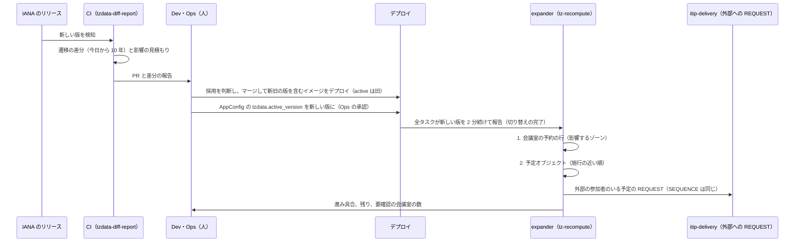

# Time Zones and Holidays: Google Calendar

`packages/tz` と `packages/tzdata`、壁時計の時刻＋TZID の解き方（存在しない時刻・2 回ある時刻）、浮動の時刻と終日、tzdb の更新の採用と再計算、TZID の別名と Windows のゾーン名、VTIMEZONE の読み書き、日本の祝日のカレンダー、和暦の表示を決める。

前提となる決定は、基盤（[ADR-0001](../decisions/0001-platform-and-stack.md)）、時刻の表し方（[ADR-0002](../decisions/0002-time-representation.md)）、繰り返しの保存と展開（[ADR-0003](../decisions/0003-recurrence-storage-and-expansion.md)）、変更のログ（[ADR-0005](../decisions/0005-change-log-and-sync-tokens.md)）、写し（[ADR-0006](../decisions/0006-organizer-and-attendee-copies.md)）、標準の範囲（[ADR-0007](../decisions/0007-interop-standards-scope.md)）、展開の意味（[ADR-0008](../decisions/0008-recurrence-expansion-semantics.md)）。この文書で決めたことは次の ADR にある。

| ADR | 決定 |
| --- | --- |
| [0012](../decisions/0012-tzdb-update-recompute-and-propagation.md) | tzdb の版の採用の後、`expander` が会議室の予約の行を先に、次に施行の近い順に予定オブジェクトを計算し直す。計算し直しは版を上げて変更のログに載せるが、`SEQUENCE` は上げない。外部の参加者には、施行の後に回がある予定だけ、同じ `SEQUENCE` の `REQUEST` を新しい VTIMEZONE つきで送る。会議室の重なりは「要確認」にする |
| [0013](../decisions/0013-external-timezone-definitions.md) | 外から来た TZID は、tzdb の正規の名前、別名、製品の接頭辞、Windows のゾーン名（Unicode CLDR の対応表）、VTIMEZONE の遷移の照合の順で IANA のゾーンに解く。解けなければ近いものに寄せて印を付ける。知っている TZID の VTIMEZONE の定義は使わず、本システムの tzdb で解く。書き出す VTIMEZONE は本システムの tzdb から作る |

## 1. 目的と範囲

- 扱う：
  - `packages/tzdata` の形と版、`packages/tz` の `resolve`・`toLocal`・`offsetAt`
  - 存在しない時刻・2 回ある時刻、浮動の時刻、終日の派生の値
  - カレンダーのタイムゾーンの変更での作り直し
  - tzdb の版の差分の報告、採用、計算し直し、外部への知らせ
  - TZID の別名、Windows のゾーン名、製品ごとの TZID、VTIMEZONE の取り込みと書き出し
  - 日本の祝日のカレンダー（生成、照合、配信）、和暦の表示
- 扱わない：
  - `expand()` の規則の評価（[events-and-recurrence.md](events-and-recurrence.md)）
  - 会議室の「要確認」の後の扱い（[rooms-and-resources.md](rooms-and-resources.md)）
  - リマインダーの桶の付け替え（reminders-and-notifications.md）
  - 画面の表示のタイムゾーン、2 つ目のタイムゾーン、ゾーンの選び方（clients.md）
  - tzdb の版を上げる CI の流れ（delivery.md）

## 2. 要件

| 要件 | 目標 | NFR |
| --- | --- | --- |
| 時刻の一致 | 同じ予定の同じ回が、画面・API・CalDAV・空き時間・会議室・リマインダーで同じ UTC の瞬間になる | NFR-009、[intent.md](../intent.md) の「守るべき振る舞い」 |
| tzdb の追従 | 版の採用から 24 時間以内に、影響する未来の回を計算し直す。施行の 7 日以上前に公表された変更で、施行の後の誤り 0 件 | NFR-009、K2 |
| 壁時計の時刻の保存 | 計算し直しで `start_local`・`start_tzid` を変えない | [ADR-0002](../decisions/0002-time-representation.md) |
| 終日 | 見る人のタイムゾーンに関係なく同じ日付 | [intent.md](../intent.md) |
| 祝日 | 生成した祝日が内閣府の CSV の全年と一致する | [quality.md](../quality.md) の 5 節の E3 |
| 速さ | `resolve` 1 回 1 µs 以下（サーバー）、Web のクライアントのゾーンのデータの読み込み 1 ゾーン 5 KiB 以下 | NFR-001 |

## 3. 本家の形と標準（確かめたこと）

いずれも 2026-10-04 に確認。

| 項目 | 内容 | 出典 |
| --- | --- | --- |
| 繰り返しのタイムゾーン | 繰り返しの予定では `start.timeZone` が必須で、展開に使う | [Events resource](https://developers.google.com/workspace/calendar/api/v3/reference/events) |
| tzdb | リリースに決まった予定はなく、ふつう数か月ごと。規則は短い予告で変わることがある | [Time zone and daylight saving time data](https://data.iana.org/time-zones/tz-link.html) |
| 祝日 | 内閣府が 1955 年から 2027 年の祝日と休日の CSV を公開している。春分の日・秋分の日は法で日付を決めず、国立天文台が毎年 2 月に官報で翌年の春分日・秋分日を公表する | [「国民の祝日」について](https://www8.cao.go.jp/chosei/shukujitsu/gaiyou.html) |
| 振替休日・国民の休日 | 祝日が日曜日に当たるときは、その後の最も近い「国民の祝日」でない日を休日とする。前日と翌日が祝日である日は休日とする | 同上 |

- 本家が tzdb の更新をいつ採用し、未来の予定をどう計算し直すか、外部の参加者に知らせるかは、公開の資料にない（**未検証**）。
- 本家の日本の祝日のカレンダーの作り方（どの資料から作るか）は、公開の資料にない（**未検証**）。

RFC 5545 の要点：

| 節 | 内容 |
| --- | --- |
| 3.2.19・3.8.3.1 | `TZID` の引数とプロパティ。値の形は決めていない（IANA の名前とは限らない） |
| 3.3.4・3.3.5 | 日付と日時。日時は浮動・UTC・TZID つきの 3 つの形。存在しない時刻と 2 回ある時刻の解き方 |
| 3.6.5 | VTIMEZONE。`STANDARD`・`DAYLIGHT` の下位の構成要素、`TZOFFSETFROM`・`TZOFFSETTO`、`RRULE`・`RDATE`。iCalendar のオブジェクトの中で使う TZID ごとに VTIMEZONE を 1 つ含める |

## 4. `packages/tzdata`

### 4.1 形

- IANA の tzdb のリリース（例：`2026b`）を zic で遷移の表にし、本システムの版の名前を `2026b-1`（末尾は本システムの組み立ての番号）にする。
- ゾーンごとに、遷移の列 `[(utc_instant, utc_offset_s, is_dst, abbrev)]` を 1900 年から 2100 年まで持ち、2100 年より先は zic の POSIX の TZ の文字列（末尾の規則）で求める。
- 別名（tzdb の `backward` のリンク）と、Windows のゾーン名の対応表（Unicode CLDR の `windowsZones`）を、同じ版に含める。CLDR の版は版の名前と一緒に記録する。
- サーバーは全ゾーンをメモリーに持つ（約 600 ゾーン、数 MiB）。Web のクライアントは、使うゾーンのデータだけを遅延で読む（1 ゾーン 5 KiB 以下）。

### 4.2 版の扱い

- 予定の行と展開の索引の行は、派生の値と一緒に `tzdata_version` を持つ（[ADR-0002](../decisions/0002-time-representation.md)）。
- 本番の全サービスと Worker は、AppConfig の `tzdata.active_version` が示す同じ版で動く。イメージには `active` とその前後の版を入れ、切り替えは全サービスで一度に行う（[ADR-0049](../decisions/0049-tzdata-rollout-and-schema-change-ordering.md)）。新旧の版が混ざるのは、ポーリングの間（約 15 秒）と、6.4 節の切り替えの窓だけである。
- API の応答は `tzdata_version` を返す。Web のクライアントの版が古ければ、サーバーの派生の値で表示し、自分で計算し直さない。

## 5. 時刻の解き方

### 5.1 `resolve`

```ts
// packages/tz
resolve(local: LocalDateTime, tzid: string, tz: TzData)
  : { utc: Instant; offsetS: number; kind: "unique" | "gap" | "overlap" }
toLocal(utc: Instant, tzid: string, tz: TzData): { local: LocalDateTime; offsetS: number }
```

手順：

1. `local` の前後 26 時間の UTC の範囲にある遷移を探し、その範囲で使われるオフセットの集合 O を作る（ふつう 1〜2 個）。
2. 各 `o ∈ O` について、候補 `u = local − o` を作り、`offsetAt(u) == o` なら有効とする。
3. 有効な候補が 1 つ → `unique`。
4. 0 個 → `gap`（存在しない時刻）。遷移の直前のオフセット `o_before` で `u = local − o_before` とする（RFC 5545 の 3.3.5 節）。結果は、壁時計でギャップの長さだけ後ろになる。
5. 2 個 → `overlap`（2 回ある時刻）。小さいほうの `u`（先の回）を選ぶ。

| 例 | `local`・`tzid` | `kind` | 結果 |
| --- | --- | --- | --- |
| 1 | 2027-03-14 02:30 `America/New_York` | `gap` | 07:30Z（03:30 EDT） |
| 2 | 2027-11-07 01:30 `America/New_York` | `overlap` | 05:30Z（01:30 EDT） |
| 3 | 2026-10-25 01:30 `Europe/London` | `overlap` | 00:30Z（01:30 BST） |
| 4 | 2026-11-03 10:00 `Asia/Tokyo` | `unique` | 01:00Z |
| 5 | `Australia/Lord_Howe`（夏時間が 30 分）の切り替えの時刻 | `gap`・`overlap` | ずれは 30 分 |

- 30 分・45 分のオフセット（`Asia/Kolkata`、`Asia/Kathmandu`）、日付変更線の近く（`Pacific/Apia` の 2011 年の日付の飛び越し）を、例示テストの固定の集まりに入れる。
- 「`resolve` してから `toLocal` で戻すと、`gap` 以外は元に戻る」を性質ベーステストで確かめる（[ADR-0002](../decisions/0002-time-representation.md) の Confirmation、PROP-TZ-001）。

### 5.2 浮動の時刻と終日

| 種類 | 派生の値の解き方 | 作り直しの契機 |
| --- | --- | --- |
| `floating` | 写しの持ち主のカレンダーのタイムゾーンで `resolve` | カレンダーのタイムゾーンの変更、tzdb の更新 |
| `date` | 開始の日の 00:00 と終わりの日の 00:00 を、カレンダーのタイムゾーンで `resolve`（空き時間・リマインダーのためだけ） | 同上 |

- 終日の予定は、表示では日付だけを使う。見る人のタイムゾーンで UTC から日付に戻さない（clients.md）。
- 他の人の終日の予定を空き時間で見るときは、予定の持ち主のカレンダーのタイムゾーンでの区間を使う（[free-busy-and-scheduling.md](free-busy-and-scheduling.md)）。
- 終日の予定に、会議室を付けられる。会議室の予約の区間は、会議室の建物のタイムゾーンでの日付の境にする（[rooms-and-resources.md](rooms-and-resources.md)）。

### 5.3 カレンダーのタイムゾーンの変更

1. 利用者がカレンダーのタイムゾーンを変える。`packages/writer` がカレンダーの属性を変え、`calendar_changes` に `kind=calendar` を載せる。
2. `expander` が、そのカレンダーの `floating`・`date` の予定オブジェクトを 1,000 件ずつ計算し直す。それぞれ版を上げて変更のログに載せる（壁時計の時刻と日付は変えない）。
3. `zoned` の予定は変えない。

## 6. tzdb の更新

### 6.1 流れ



### 6.2 差分の報告

`tzdata-diff-report` は、PR ごとに次を出す（[quality.md](../quality.md) の 2.2.1 節 B）。

- ゾーンごとに、今日から 10 年の遷移を新旧で比べ、違う区間 `[changed_from, changed_to)` とオフセットの新旧。
- 施行の日（最初の違いの日）までの日数。
- 影響の見積もり：`tenant_tz_usage`（7.3 節）から、そのゾーンを使うテナントの数と、`event_objects` の `start_tzid` の索引での件数の推定。外部の参加者へ送る `REQUEST` の数の推定。
- 別名・Windows の対応表の変化。

報告に、施行まで 7 日未満の変更があれば、PR に「急ぎ」の印を付け、Ops に知らせる。

### 6.3 計算し直し

ADR-0012。

1. **対象を決める。** 差分の報告の区間ごとに、次を対象にする。
   - `zoned`：`start_tzid` か `end_tzid` が変わったゾーンで、回が `changed_from` より後にあるもの（単発は `end_utc > changed_from`、繰り返しは `series_end_utc` が NULL か `changed_from` より後）。
   - `floating`・`date`：持ち主のカレンダーのタイムゾーンが変わったゾーンのもの。
2. **順序。** まず会議室の予約の行（`resource_bookings`）を持つ予定オブジェクト、次に `changed_from` の近い順、同じなら組織のテナントを先にする。
3. **1 件の処理。** `packages/writer` で、予定オブジェクトの派生の値と `tzdata_version` を直し、版を上げ、展開の索引の差分、会議室の予約の行、リマインダーの付け替え（outbox）、`calendar_changes` を書く。`start_local`・`start_tzid` は変えない。`SEQUENCE` は上げない。
4. **速さ。** 全体で 5,000 件/秒、1 テナント 500 件/秒を上限にする。1 つのカレンダーの書き込みの上限（1 秒 50 件、[ADR-0005](../decisions/0005-change-log-and-sync-tokens.md)）を超えないよう、カレンダーごとに順に流す。
5. **完了の確認。** 影響するゾーンの、古い版の索引の行の数が 0 になったら完了とする。採用から 24 時間を過ぎて残っていれば警報（[quality.md](../quality.md) の 4.1 節）。

見積もり（S1）：あるゾーンを使う予定オブジェクトが全体の 1%（300 万件）なら、5,000 件/秒で 10 分。`Asia/Tokyo` の規則が変わる最悪の場合（3 億件の大半）は、施行の後に回があるものに絞っても約 2 億件で 11 時間。24 時間に収まるが、変更のログとクライアントの取り直しが集中する（[ADR-0005](../decisions/0005-change-log-and-sync-tokens.md) の Consequences）。

### 6.4 版の混ざる間（切り替えの窓）

- AppConfig のポーリングの間（約 15 秒）は、新しい書き込みが新旧どちらの版で計算されるかが決まらない。`tzdata_version` の古い行は、計算し直しのジョブが拾う（版の比べで対象にする）。
- 計算し直しが終わるまで、影響するゾーンの未来の回は、索引で古い版の値を持つ。空き時間と範囲の表示は、その値をそのまま使う。
- **会議室・予約の区間**：切り替えの完了から、影響するゾーンの会議室の予約の行と予約ページの区間の計算し直しが終わるまでを「切り替えの窓」と呼ぶ。窓の中では、排他の制約が新旧の版の区間を比べる。これを [ADR-0002](../decisions/0002-time-representation.md) の原則の唯一の例外として引き受け、扱いを [ADR-0012](../decisions/0012-tzdb-update-recompute-and-propagation.md) の「切り替えの窓」で決めた：重なりは後から承諾したほうを「要確認」にし、旧の版の区間とだけ重なって辞退した予約（`conflict_tz_pending`）は、窓の終わりに判定し直す。
- 窓を短くするため、会議室の予約の行と予約ページの区間を最初に直す。窓の長さは `tz_room_window_seconds` で見る。

### 6.5 外部への知らせ

- 本システムの中の参加者の写しは、同じ TZID と壁時計の時刻を持つので、それぞれのテナントで同じジョブが計算し直す。iTIP のメッセージは送らない。
- 外部の参加者には、主催者の写しが本システムにあり、`changed_from` より後に回がある予定だけ、`REQUEST` を送る。
  - `SEQUENCE` は上げず、`DTSTAMP` を新しくし、新しい VTIMEZONE を付ける。RFC 5546 の 3.2.2.2 節の「同じ `SEQUENCE` の更新」に当たり、相手は出欠を戻さない。
  - 送る数が 1 回の採用で 10 万通を超える見積もりなら、Ops の承認を得てから送る。iMIP の送信の上限（[invitations-and-itip.md](invitations-and-itip.md)）の中で、施行の近い順に流す。
- 外部の主催者の予定（本システムの中に参加者の写しだけがある）は、本システムの tzdb で計算し直す。主催者の側の tzdb が古ければ、主催者と時刻がずれる。ずれは直せないので、`changed_from` から 30 日以内に回があるものは、画面に「主催者の時刻と違う可能性」を示す。

### 6.6 例

ある国が、2027-03-01 からゾーン `X/Y` の夏時間を廃止し、通年で +03:00 にすると、2027-01-10 に公表された。旧の規則では 2027-03-28 から 10-31 まで +04:00 だった。

- `tzdata-diff-report`：`X/Y` の `[2027-03-28, 2027-10-31)` でオフセットが +04:00 → +03:00。施行まで 77 日。
- 毎週月曜 09:00 `X/Y` の会議（主催者は東京、参加者は `X/Y` の拠点と外部の取引先）：
  - 壁時計の 09:00 は変えない。2027-04-05 の回の `start_utc` は 05:00Z から 06:00Z に変わる。東京の表示は 14:00 から 15:00 に変わる。
  - 東京の参加者の写しも同じジョブで直り、リマインダーも付け替わる。
  - 外部の取引先には、同じ `SEQUENCE` の `REQUEST` を新しい VTIMEZONE つきで送る。
- 同じ会議が東京の会議室を取っていたら、会議室の予約の区間も 1 時間動く。動いた先に別の予約があれば、後から確定したほうを「要確認」にする。

## 7. 外から来る TZID

### 7.1 解き方

ADR-0013。`packages/tz` の `normalizeTzid(tzid, vtimezone?, hints)` が、次の順で IANA の正規の名前に解く。

| 段 | 入力の例 | 解き方 |
| --- | --- | --- |
| 1 | `Asia/Tokyo` | tzdb の正規の名前ならそのまま |
| 2 | `Japan`、`US/Eastern`、`Asia/Calcutta` | tzdb の `backward` のリンクで正規の名前へ |
| 3 | `/mozilla.org/20050126_1/Asia/Tokyo`、`/softwarestudio.org/Olson_20011030_5/America/New_York` | `/` で区切った末尾から、tzdb の名前に一致する最も長い部分を探す |
| 4 | `Tokyo Standard Time`、`Eastern Standard Time` | Unicode CLDR の `windowsZones` の対応（地域 `001`） |
| 5 | 知らない名前＋VTIMEZONE | VTIMEZONE の遷移を、DTSTART の年の前年から 3 年後まで計算し、同じ遷移を持つ tzdb のゾーンを探す。複数あれば、カレンダーのタイムゾーン、利用者のタイムゾーン、`zone1970.tab` の順で選ぶ |
| 6 | 段 5 で一致なし | 一致する遷移が最も多いゾーン（DTSTART の時点のオフセットが同じものに限る）に寄せ、`tz_approximated` の印を付けて利用者に示す |
| 7 | 段 6 でもなし | DTSTART の時点のオフセットが整数の時間なら `Etc/GMT±N`、それ以外は `utc` の時刻に変える。印を付ける |

- 段 5 の照合の表（ゾーンごと・年ごとの遷移の指紋）は、`packages/tzdata` の版と一緒に作る。
- 段 3〜7 で解いたときは、元の TZID の文字列を `x_props` の `X-<BRAND>-ORIGINAL-TZID` に残す。
- TZID のない UTC オフセットだけの時刻は、[ADR-0002](../decisions/0002-time-representation.md) の規則（カレンダーの既定のタイムゾーンでオフセットが合えば `zoned`）に従う。

### 7.2 知っている TZID の VTIMEZONE

- 段 1〜4 で解けた TZID の VTIMEZONE の定義は使わない。本システムの tzdb で解く。
- 送り手の VTIMEZONE と本システムの tzdb で、予定の回のオフセットが違えば、`vtimezone_mismatch` を数える。壁時計の時刻と TZID が送り手の意図なので、壁時計の時刻を保つ（[ADR-0002](../decisions/0002-time-representation.md)）。
- 例：送り手の tzdb が古く、上の 6.6 節のゾーン `X/Y` を +04:00 のまま送ってきた。本システムは +03:00 で解く。送り手の画面とは 1 時間ずれるが、現地の 09:00 は同じである。

### 7.3 使っているゾーンの記録

- `tenant_tz_usage(tenant_id, tzid, first_seen_at)` を、RLS の外の保守用のスキーマに持つ。`packages/writer` が、新しい TZID を書いた時に `INSERT ... ON CONFLICT DO NOTHING` で足す。
- tzdb の更新の影響の見積もりと、計算し直しの対象のテナントを探すのに使う。読むのは `expander` と差分の報告のロールだけ。
- 中身は TZID だけで、予定の中身を含まない。

## 8. VTIMEZONE の書き出し

- iCalendar のオブジェクト（CalDAV、iMIP、ICS）に、使う TZID ごとに VTIMEZONE を 1 つ付ける（RFC 5545 の 3.6.5 節。RFC 7809 は持たない。[ADR-0007](../decisions/0007-interop-standards-scope.md)）。
- 範囲：予定オブジェクトの最初の回（DTSTART、RDATE、`RECURRENCE-ID` の最小）の前の遷移から、最後の回まで。終わりのない系列は、今の規則（tzdb の末尾の規則）を `RRULE` つきの `STANDARD`・`DAYLIGHT` で書く。
- 過去の規則の時代ごとに下位の構成要素を作る。遷移が 1 回だけの時代は `RDATE` なしの 1 つの構成要素にする。
- `TZID` は IANA の正規の名前。`X-<BRAND>-TZDATA-VERSION` に版を書く。
- 1 つのゾーンの VTIMEZONE は 4 KiB を目安にし、超えるときは範囲を予定の回に合わせて縮める。

## 9. 日本の祝日のカレンダー

### 9.1 正本と照合

- 正本は、本システムが持つ祝日の規則の表からの生成である（[architecture/README.md](README.md) の 6 節の決定）。
- 内閣府の CSV（[「国民の祝日」について](https://www8.cao.go.jp/chosei/shukujitsu/gaiyou.html)、2026-10-04 に確認。ページに CSV の利用の条件の記載は見当たらなかった）は、照合にだけ使う。CSV を取り込んで配信するかは、利用の条件の確認が要る（**法務の確認待ち：L7**）。L7 の結論まで、祝日のカレンダーの公開（E3 の `japanese-holidays-calendar` の公開）の spec を承認しない。

### 9.2 規則の表

| 種類 | 例 | 表し方 |
| --- | --- | --- |
| 日付の固定 | 元日 1/1、建国記念の日 2/11、天皇誕生日 2/23 | `(月, 日, 有効の年の範囲)` |
| 第 n 月曜 | 成人の日（1 月の第 2 月曜）、海の日、敬老の日、スポーツの日 | `(月, n, 有効の年の範囲)` |
| 春分の日・秋分の日 | 春分日・秋分日 | 年ごとの日付の表。国立天文台の暦要項（毎年 2 月に翌年分を官報で公表）から入れる |
| 特別の年の例外 | 法の改正や特別法で、ある年だけ祝日が動いた・足された | `(年, 日付, 名前, 種類)` の例外の表 |
| 振替休日 | 祝日が日曜日に当たれば、その後の最も近い「国民の祝日」でない日 | 生成の規則 |
| 国民の休日 | 前日と翌日が祝日である日（祝日でない日に限る） | 生成の規則 |

- 名前と日付の変遷（祝日の名前の変更、日付の移動）は、有効の年の範囲で持つ。規則の表は、`packages/holidays-jp`（データ）として版を持ち、変更は PR で行う。
- 例外の表の各行には、根拠（法令の名前と公布の日）を書く。

### 9.3 生成の手順

1. 年 Y の祝日を、規則の表と例外の表から作る。
2. 振替休日：祝日 H が日曜日なら、H の翌日から 1 日ずつ進み、最初の「祝日でない日」を休日にする。
3. 国民の休日：Y の各日 D について、D が祝日でなく、D−1 と D+1 が祝日（振替休日を除く「国民の祝日」）なら、休日にする。
4. 名前：振替休日と国民の休日は、CSV に合わせて「休日」にする。

例（内閣府の CSV で確かめた。2026-10-04）：

| 年 | 日 | 理由 |
| --- | --- | --- |
| 2026 | 5/6（水）休日 | 5/3（憲法記念日）が日曜日。5/4・5/5 は祝日なので、最も近い祝日でない日は 5/6 |
| 2026 | 9/22（火）休日 | 9/21（敬老の日）と 9/23（秋分の日）に挟まれる |
| 2027 | 3/22（月）休日 | 3/21（春分の日）が日曜日 |

### 9.4 暦要項が出ていない年

- 春分日・秋分日は、暦要項が出た年（今年と翌年）だけを確定にする。
- それより先の年は、天文の計算で求めた日を「予定」として出し、予定オブジェクトに `X-<BRAND>-PROVISIONAL:TRUE` と、タイトルの後ろの「（予定）」を付ける。
- 毎年 2 月の暦要項の公表の後、表を更新する PR を作る（runbook）。確定で日付が変わったら、予定オブジェクトを動かし、変更のログに載せる。

### 9.5 配信

- システムのテナントに、公開のカレンダー「日本の祝日」を 1 つ持つ。ACL は公開（だれでも `reader`）。書き込みは祝日のジョブだけ。
- 祝日 1 つを、`date` の単発の予定オブジェクト 1 つにする。繰り返しにしない（年ごとの例外と振替があるため）。UID は `jp-holiday-YYYYMMDD@<brand>.<domain>`。
- 範囲は 1955 年から今年＋2 年。毎年 1 月に 1 年分を足す。
- `transparency` は `transparent`（空き時間を塞がない）。
- 生成の結果を CSV と照合するジョブを、規則の表の変更の PR と、毎月に回す。CSV の範囲（1955〜2027 年）の全日が一致することを E3 の合否基準にする（[quality.md](../quality.md) の 5 節）。

## 10. 和暦の表示

- 和暦は表示の書式だけで、保存の値は西暦の日付のままにする。
- `Intl.DateTimeFormat` の `ja-JP-u-ca-japanese` を、元号と年の書式にだけ使う（[ADR-0001](../decisions/0001-platform-and-stack.md) の許可リスト）。`timeZone` は指定しない。日付は `packages/tz` で求めた壁時計の日付を渡す。
- 元年は「元年」と書く（例：令和元年 5 月 1 日）。
- 新しい元号が施行されると、ブラウザの ICU の更新まで古い表示になる。`packages/holidays-jp` に元号の開始の日の表を持ち、ICU の結果と違えば表を優先する（10 行程度）。

## 11. 障害のときの振る舞い

| 事象 | 起きること | 備え |
| --- | --- | --- |
| 計算し直しのジョブが遅れる | 施行の後の回が古いオフセットのまま | 施行の近い順に流す。採用から 24 時間で残りがあれば警報。施行まで 24 時間を切ったら SEV2 |
| 計算し直しの途中で版を戻した（`tzdata.active_version` を前の版に） | 新しい版で直した行と、古い版の行が混ざる | 戻した版を「採用」とみなし、ジョブが版の比べで残りを直す（行ごとに `tzdata_version` を持つので、どちらの方向にも収束する。PROP-TZ-004） |
| 施行の直前の公表（7 日未満） | 採用が施行に間に合わない | 差分の報告に「急ぎ」の印。runbook の急ぎの採用の手順。K2 の対象外だが、施行の後の誤りの数を数える |
| 外部への `REQUEST` が多すぎる | iMIP の送信の上限に当たる | 10 万通を超える見積もりは Ops の承認。施行の近い順に流す |
| `windowsZones` の対応がない Windows の名前 | TZID が解けない | 段 5〜7 に落ちる。件数を監視し、表の更新を PR にする |
| 祝日の生成と CSV が食い違う | 祝日の誤り | 公開を止める。例外の表を直す PR |
| 暦要項の更新を忘れた | 翌年の春分・秋分が「予定」のまま | 毎年 3 月 1 日に、翌年の確定がなければ警報 |

## 12. セキュリティ

- VTIMEZONE は外から来る入力である。下位の構成要素 200 個、`RDATE` 1,000 件、1 つの VTIMEZONE 64 KiB を上限にし、段 5 の照合の計算の量を制限する。
- `tenant_tz_usage` は、テナントごとの TZID の集合だけを持つ。テナントの所在の推測に使えるので、保守のロールだけが読む。
- 祝日のカレンダーは公開で、書き込みのロールを祝日のジョブに限る。

## 13. テスト

決定表：

- **DT-TZ-001（TZID の解き方）**：7.1 節の 7 段。製品ごとの TZID の実例の集まり（合成のもの）を入力にする。
- **DT-TZ-002（計算し直しの対象）**：6.3 節の 1 の種類 × 回の位置（`changed_from` の前・後・またぐ）。

性質ベーステスト：

- **PROP-TZ-001（往復）**：任意の壁時計の時刻・TZID・版で、`toLocal(resolve(x))` は `gap` 以外で `x` に戻る。
- **PROP-TZ-002（変わらないゾーン）**：任意の 2 つの版で、遷移が変わらないゾーンの予定は、計算し直しの前後で派生の値が変わらず、変更のログに載らない。
- **PROP-TZ-003（壁時計の保存）**：任意の予定と任意の版の組で、計算し直しの後、`start_local`・`start_tzid`・`recurrence_id` が変わらず、`start_utc` が新しい版の `resolve` に等しい。
- **PROP-TZ-004（版の収束）**：任意の順序で版の採用と戻しを繰り返した後、ジョブが静かになると、すべての行が最後の版の値になる。
- **PROP-TZ-005（VTIMEZONE の往復）**：任意のゾーンと範囲で、書き出した VTIMEZONE を `normalizeTzid` の段 5 に通すと、元のゾーン（または同じ遷移のゾーン）に解ける。
- **PROP-TZ-006（祝日）**：1955 年から 2027 年の各年で、生成した祝日と休日の集合が CSV と一致する。2028 年から 2100 年の各年で、振替休日は日曜日の祝日の後の最初の祝日でない日で、国民の休日は 2 つの祝日に挟まれた日である。

tzdb の版の差分の試験（[quality.md](../quality.md) の 2.2.1 節 B）：過去の改正の集まり、合成の改正（6.6 節の例、施行の 2 日前の公表、計算し直しの途中の施行）、版の混在。

例示テスト：5.1 節の表、9.3 節の表、和暦の元年の表示。

## 14. Story の候補

| Epic | Story | 中身 |
| --- | --- | --- |
| E3 | `tzdata-package` | 4 節。zic の遷移の表、末尾の規則、別名と `windowsZones`、Web のクライアントの配布 |
| E3 | `tz-resolve` | 5.1 節（PROP-TZ-001） |
| E3 | `floating-and-all-day` | 5.2・5.3 節 |
| E3 | `tzid-aliases-and-windows-zones` | 7 節（ADR-0013。DT-TZ-001、PROP-TZ-005） |
| E3 | `vtimezone-export` | 8 節（sync-and-caldav・invitations-and-itip と共同） |
| E3 | `tzdata-diff-report` | 6.2 節 |
| E3 | `tzdata-recompute-job` | 6.3・6.4 節（ADR-0012。DT-TZ-002、PROP-TZ-002〜004） |
| E3 | `tzdata-external-update` | 6.5 節（invitations-and-itip と共同） |
| E3 | `tzdata-version-tests` | 過去の改正の集まりと合成の改正 |
| E3 | `japanese-holidays-calendar` | 9 節（PROP-TZ-006）。公開は法務：L7 |
| E3 | `wareki-display` | 10 節 |

## 15. 未解決の問い

### 決定

2026-10-04 の既定案。E3 の試験で覆りうる。

- **tzdb の更新で外部の参加者へ更新を送るか**：送る。施行の後に回がある予定だけ、同じ `SEQUENCE` で（ADR-0012。[architecture/README.md](README.md) の 6 節の持ち越しを閉じる）。
- **会議室の重なり**：後から確定したほうを「要確認」（ADR-0012、[rooms-and-resources.md](rooms-and-resources.md) の ADR-0020）。
- **知っている TZID の VTIMEZONE**：使わない（ADR-0013）。
- **知らない TZID**：遷移の照合で寄せる（ADR-0013）。
- **祝日の表し方**：単発の終日の予定。`transparent`。
- **春分・秋分の先の年**：「予定」の印で出す。

### 持ち越し

| 問い | いつ・どう決めるか |
| --- | --- |
| 内閣府の CSV の利用の条件、祝日の誤りの責任の範囲 | **法務の確認待ち：L7** |
| 外部のクライアントが、届いた VTIMEZONE と自分の tzdb のどちらを使うか | E8・E5 の相互運用の試験で記録する（**未検証**） |
| 計算し直しの速さの上限（5,000 件/秒）が、変更のログとクライアントの取り直しに耐えるか | E12 の `tzdata-update-drill` |
| 新しい元号の表示の切り替えの手順 | 元号の公表の時に、runbook で扱う |
| 本家の tzdb の採用の時期、外部への知らせ、祝日の作り方 | 公式の資料で確かめられなかった（**未検証**のまま） |

## 16. quality.md・runbooks・data-model への項目

### quality.md

- DT-TZ-001・002、PROP-TZ-001〜006 と、tzdb の版の差分の試験を E3 のリリースの基準にする。
- 本番：古い `tzdata_version` の行の数（採用から 24 時間の後 0）、`tz_approximated`・`vtimezone_mismatch` の件数、計算し直しの進み具合。

### runbooks

- 採用と計算し直しの監視、急ぎの採用、遅れたときの再実行は、統合の工程で 1 つの [runbooks/tzdb-update.md](../runbooks/tzdb-update.md) にまとめた（2026-10-04。提案の `tzdata-adopt.md`・`tzdata-recompute-stuck.md` の中身を含む）。
- `holidays-annual-update.md`：毎年 2 月の暦要項の反映、1 月の 1 年分の追加、CSV との照合（[runbooks/README.md](../runbooks/README.md) の 5 節に載せた。予定）。

### data-model（索引への追加の提案）

| 表・データ | 中身 | 節 |
| --- | --- | --- |
| `packages/tzdata`（データ） | 版、ゾーンごとの遷移、末尾の規則、別名、`windowsZones`、遷移の指紋 | 4、7.1 |
| `tenant_tz_usage`（保守用のスキーマ、RLS の外） | `(tenant_id, tzid)` を主キー、`first_seen_at` | 7.3 |
| `tz_recompute_runs` | 採用ごとの `(from_version, to_version, zone, changed_from, 対象の数, 済みの数, 状態)` | 6.3 |
| `calendars` に足す列 | `timezone`（既定のタイムゾーン、`floating`・`date` の解き方） | 5.2 |
| `event_objects` の列 | `recurrence_flags` に `tz_approximated` | 7.1 |
| `packages/holidays-jp`（データ） | 規則の表、春分・秋分の表、例外の表（根拠つき）、元号の表 | 9.2、10 |

## 出典

いずれも 2026-10-04 に確認。

- Google for Developers, [Events resource](https://developers.google.com/workspace/calendar/api/v3/reference/events)
- IANA, [Time zone and daylight saving time data](https://data.iana.org/time-zones/tz-link.html)
- 内閣府, [「国民の祝日」について](https://www8.cao.go.jp/chosei/shukujitsu/gaiyou.html)（CSV：昭和 30 年から令和 9 年）
- IETF, [RFC 5545](https://www.rfc-editor.org/rfc/rfc5545)（3.2.19、3.3.4、3.3.5、3.6.5、3.8.3.1 節）、[RFC 5546](https://www.rfc-editor.org/rfc/rfc5546)（3.2.2.2 節）
