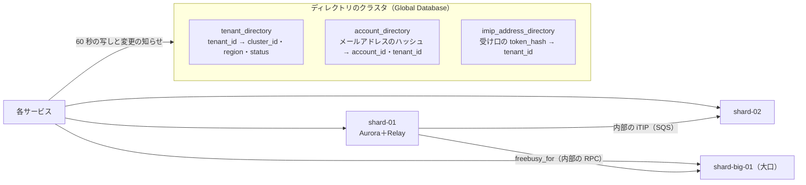

# ADR-0045: 段階を上げる判断は、ピークの書き込みと読み出し、Aurora の writer の CPU、配送の遅れ、リマインダーの集中の指標で行う。S2 はテナントを単位に Aurora のクラスタへ分け、テナントの外のディレクトリ（テナント → クラスタ、メールアドレス → アカウント）を小さなクラスタに置く。テナントをまたぐ処理は、内部の iTIP を SQS、空き時間を内部の RPC にする。S3 はスタックをセルにし、テナントをセルとリージョンに固定する

## Context

[architecture/README.md](../architecture/README.md) の 2 節は、S2 で「テナントを単位に、複数の Aurora のクラスタへ分ける」、S3 で「セル構成。テナントをセルに固定し、海外のリージョンを足す」とした。段階を上げる基準は、この領域に残した。

この題材のテナントをまたぐ処理は 3 つに限られる（[ADR-0004](0004-tenancy-and-rls.md)）。

- 内部の iTIP の配送：メッセージを SQS で運ぶので、受け手のテナントが別のクラスタでも同じ形で動く（[ADR-0006](0006-organizer-and-attendee-copies.md)）。
- 空き時間の照会：相手のテナントの関数 `freebusy_for` を呼ぶ。S2 で関数を内部の RPC に置き換える（[free-busy-and-scheduling.md](../architecture/free-busy-and-scheduling.md) の 4.5 節）。
- 共有されたカレンダーの読み出し：カレンダーのテナントのコンテキストで読む。

加えて、メールアドレスから本システムのアカウントとテナントを決める解決は、テナントの外にある（[ADR-0004](0004-tenancy-and-rls.md)）。iMIP の受け口のアドレスの解決も、テナントの外に写す（[invitations-and-itip.md](../architecture/invitations-and-itip.md) の 17 節）。

移行には四半期ほどかかる見込み（他の題材と同じ）。上限の手前で始める必要がある。

## Options

1. **テナントを単位に Aurora のクラスタへ分け、ディレクトリを小さなクラスタに置く**
2. カレンダーを単位に分ける（ハッシュ）
3. 1 つのクラスタを大きくし続け、読み出しを reader で広げる

## Decision

1 を採用する。

### 段階を上げる基準

次のどれかに当たり、戻らない見込みになったら移行を始める。

| 指標 | S1 → S2 を始める目安 | S2 → S3 を始める目安 |
| --- | --- | --- |
| 書き込み（予定オブジェクトの書き込み、配送を除く。月曜の朝のピーク） | 900 件/秒（S1 の 60%）を 2 週続けて超える | 9,000 件/秒 |
| 参加者の写しの書き込み（配送） | 3,600 件/秒 | 36,000 件/秒 |
| 読み出し（ピーク） | 9,000 件/秒 | 90,000 件/秒 |
| Aurora の writer の CPU（ピークの p95） | 60% を超える、または 1 段上げても 6 か月もたない | シャードを増やしても最大のクラスで 60% を超える見込み |
| リマインダー（毎時 0 分の集中） | 送信の開始の p99 が 20 秒を超える月が 2 か月続く | — |
| 最大のテナント | 1 テナントが書き込みの 20% を超え続ける、または利用者 3 万を超える | 専用のセルが要る契約 |
| 展開の索引の行 | 4 億行の 1.5 倍（6 億）を超える | — |
| 可用性 | — | 1 回の障害で全テナントが止まることが許されない |
| 海外の顧客 | — | 国外のリージョンに置く必要がある契約（法務の L4） |

### S2：テナントを単位のクラスタ

- **テナントは 1 つのクラスタに閉じる。** 予定オブジェクト、展開の索引、会議室の予約の行、`calendar_changes`、outbox、監査ログは、テナントの中でだけ意味を持つ。
- **ディレクトリ**：`tenant_directory`、`account_directory`、`imip_address_directory` を、小さなディレクトリのクラスタ（Global Database で大阪へ）に置く。各サービスは 60 秒ごとの写しと、Valkey の変更の知らせで引く。
- **テナントをまたぐ処理**：
  - 内部の iTIP：SQS のメッセージに受け手の `tenant_id` を入れ、`itip-delivery` が受け手のクラスタへ書く。形は S1 と同じ。
  - 空き時間：`freebusy-rpc`（`api` の内部の口。Service Connect、HTTP/2、TLS）で相手のクラスタの `freebusy_for` を呼ぶ。返す形（区間だけ）は変えない。テナントごとに 300ms で切る。
  - 共有されたカレンダー：カレンダーのテナントのクラスタへ読みに行く。1 つの画面のテナントの数だけ問い合わせる（[ADR-0004](0004-tenancy-and-rls.md) の Consequences）。
- **テナントの移動**（大口を専用のクラスタへ）：移動先へ行をコピーし、`calendar_changes` を追いかけ、テナントを `moving` にして書き込みを数秒止め、`tenant_directory` を切り替える。`change_seq` と `calendar_changes` がそのまま移るので、`sync_epoch` を上げない。コピーの方式（論理レプリケーションか、変更のログの再生か）は、S2 の着手の前に別の ADR で決める。
- **検索**：S2 で専用の基盤へ移すかは search の領域で決める。

### S3：セルとリージョン

- スタック一式（API・CalDAV・Realtime・Booking・Relay・Worker・Aurora・Valkey・SQS）をセルとして複製し、テナントを 1 つのセルに固定する。セルごとに主のリージョンを持ち、相手のリージョンに二次を持つ。
- セルの外（Global）：アカウントと認証、ディレクトリ、課金の集計、iMIP の受信の振り分け（受け口の `token` → セル）。
- 振り分け：画面と API は、セッションのテナントからセルを選ぶ（CloudFront Functions と KeyValueStore。他の題材と同じ）。CalDAV は、ALB の前に Route 53 の名前をセルごとに持ち（`dav-<cell>.<brand>.<domain>`）、発見（`/.well-known/caldav`）で利用者のセルへリダイレクトする。
- 海外のリージョン（E18）：テナントを作るときにリージョンを選び、変えない。

### 他の案を選ばなかった理由

- **2（カレンダーの単位）**：1 つのテナントの RLS・監査・方針の変更が多くのクラスタにまたがる。テナントをまたぐ処理を 3 つに限った利点を失う。
- **3（大きくし続ける）**：S2 の書き込み（15,000 件/秒と配送 60,000 件/秒）は、最大のクラスでも 1 つの writer に収まらない見込み（[capacity.md](../architecture/capacity.md) の 5 節）。

## Consequences

- 良くなること：
  - テナントをまたぐ処理が 3 つに限られているので、S2 で変わるのは空き時間の呼び出しの形だけである。
  - 大口のテナントを専用のクラスタへ移せる。
- 引き受けるコスト：
  - ディレクトリのクラスタが全体の依存になる。写しで 60 秒の遅れを許し、ディレクトリの障害の間も、写しで動く。
  - 空き時間の照会が、クラスタをまたぐと遅くなる（RPC の往復）。NFR-004 の予算を S2 の前に測り直す。
  - 移動の方式は未定で、S2 の着手の前に決める必要がある。

## Confirmation

- 段階の指標をダッシュボードに出し、月次のキャパシティのレビューで見る（[capacity.md](../architecture/capacity.md) の 8 節）。
- S2 の着手の前に、2 つのクラスタを持つ staging で、内部の iTIP の配送と空き時間の照会の性質ベーステスト（[quality.md](../quality.md) の 2.2.1 節 C・D）を流す。
- 結合テスト：テナントのクラスタを切り替えた後、トークンが 410 にならずに続く。
