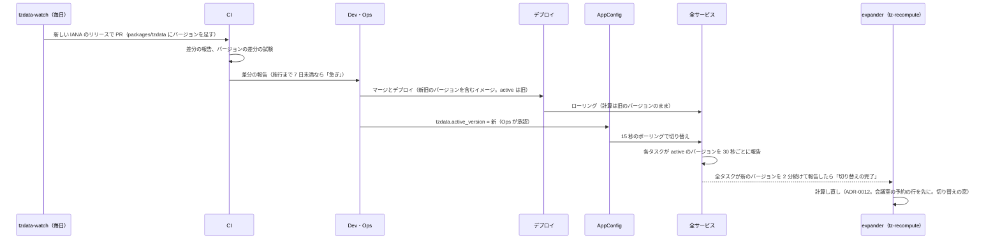

# ADR-0049: tzdb の新しいバージョンは、前のバージョンと一緒にイメージに入れて先にデプロイし、AppConfig の `tzdata.active_version` を全サービスで一度に切り替えて採用する。Web のクライアントはバージョンつきの URL からゾーンのデータを取るので、資産のデプロイを待たない。スキーマの変更は、広げる・移る・縮める・消すの順にし、展開の索引のような作り直せる表は、影の表を作って入れ替える

## Context

[ADR-0002](0002-time-representation.md) と [ADR-0012](0012-tzdb-update-recompute-and-propagation.md) は、tzdb のバージョンを上げたら、全サービスとクライアントを同じバージョンにし、バージョンの切り替えの完了を合図に計算し直すと決めた。[runbooks/README.md](../runbooks/README.md) の 3 節は、採用の手順をデプロイで書いた（サーバーと Web のクライアントを同じバージョンで出し、Web の段階をすぐに 100% まで進める）。

デプロイで採用すると、次が起きる。

- ローリングの間（数分〜数十分）、新旧のバージョンのタスクが並び、どちらのバージョンで計算するかが要求ごとに違う（[time-zones-and-holidays.md](../architecture/time-zones-and-holidays.md) の 6.4 節）。
- 「切り替えの完了」が、デプロイの完了と同じで、他のコードの変更と一緒になる。戻すと、他の変更も戻る。
- Web のクライアントの段階的な配布（1% → 10% → 50% → 100%、各段 4 時間。[runbooks/README.md](../runbooks/README.md) の 3 節）を、バージョンのためだけに速める必要がある。

[runbooks/README.md](../runbooks/README.md) の 3 節は、展開・時刻・権限の規則をフラグにしないとも決めた。経路ごとに違う規則が動く状態を作らないためである。

スキーマの変更は、他の題材（Linear の ADR-0057）と同じく、広げる・移る・縮めるの順にする。この題材では、展開の索引（S1 で 4 億行、月で分割）と変更のログ（日で分割）が大きく、列の追加の埋めが重い。展開の索引は、予定オブジェクトから作り直せる写しである（[ADR-0003](0003-recurrence-storage-and-expansion.md)）。

## Options

tzdb の採用：

1. **新旧のバージョンをイメージに入れて先にデプロイし、AppConfig の `tzdata.active_version` を全サービスで一度に切り替える**
2. デプロイで採用する（イメージに 1 つのバージョン）
3. 割合で段階的に採用する（テナントの 1% から）

展開の索引のスキーマの変更：

- a. **影の表（`occurrences_v<N>`）を `expander` で作り、追いついたら入れ替える**
- b. 列を足して、全行を埋める

## Decision

1 と a を採用する。

### tzdb の採用の流れ

- `tzdata-watch`（毎日）が IANA のリリースを確かめ、新しいバージョンがあれば `packages/tzdata` にバージョンを足す PR を作る。PR には差分の報告（[time-zones-and-holidays.md](../architecture/time-zones-and-holidays.md) の 6.2 節）を付ける。
- イメージには、`active` のバージョンと、その前後のバージョンを入れる（最大 3 バージョン。1 バージョンで数 MiB）。古いバージョンは、新しいバージョンの採用から 30 日の後にイメージから外す。
- `tzdata.active_version` は、AppConfig の 1 つの値で、割合もテナントの別も持たない。全サービス・全経路が同じ値を読む。これは `release.*` のフラグではなく、データのバージョンの固定である（経路ごとに違う規則が動く状態を作らない）。
- AppConfig のポーリングは、この値だけ 15 秒にする。各タスクは、使っているバージョンをメトリクス（`tzdata_active_version`）に出す。全タスクが新しいバージョンを 2 分続けて報告したら、`expander` が計算し直しを始める（[ADR-0012](0012-tzdb-update-recompute-and-propagation.md) の「バージョンの切り替えの完了」）。
- API の応答の `tzdata_version` は `active` のバージョン。Web のクライアントは、そのバージョンのゾーンのデータを `/tzdata/<version>/` から取る（[ADR-0038](0038-web-calendar-rendering-and-local-expansion.md)）。Web の資産のデプロイは要らない。`/tzdata/<version>/` は、PR のマージのときに S3 に置く。
- **戻す**：`tzdata.active_version` を前のバージョンに戻す。行ごとに `tzdata_version` を持つので、計算し直しのジョブがどちらの方向にも収束する（PROP-TZ-004）。[runbooks/README.md](../runbooks/README.md) の 3 節の「前のバージョンを新しいバージョンとして出す」と同じ結果を、デプロイなしで得る。
- **急ぎ**（施行まで 7 日未満）：凍結の期間でも、上の流れをそのまま行う。

### スキーマの変更の順序

| 段 | リリース | 中身 | 次へ進む条件 |
| --- | --- | --- | --- |
| 1. 広げる | N | 新しい列・表を足す（`NOT NULL` は既定値つき、索引は `CONCURRENTLY`、分割の表は `pg_partman` のひな形も直す）。`packages/writer` が新旧の両方を書く | — |
| 2. 埋める・移る | N+1 | 既存の行を埋める。予定オブジェクトの見え方が変わる埋めは `packages/writer` の `maintenance` の経路で書き、変更のログに載せる（[ADR-0005](0005-change-log-and-sync-tokens.md)）。見え方の変わらない列は、`maintenance` の経路の「ログに載せない」の印で書く（`packages/writer` が API の表現のハッシュを前後で比べて確かめる）。読み出しを新しい列へ移す | 埋めが終わった |
| 3. 縮める | N+2 以降 | 古い列を読まないコードを出す。古い形の同期のトークン（`v`）を受け付けるのをやめる | 段 2 から 30 日（トークンの有効の期間）、かつ古い形のトークンの使用が 0 に近い |
| 4. 消す | 段 3 の次 | 古い列を消すマイグレーションを単独で出す | 段 3 のコードが 1 リリース以上動いた |

- 1 つのデプロイで、DB の破壊の変更と、それを読むコードの変更を一緒に出さない。サーバーのコードを 1 つ前へ戻せるようにするため。
- **展開の索引**：形の変更は、影の表 `occurrences_v<N>` を作り、`expander` が予定オブジェクトから作り（`indexed_through` を影の表ごとに持つ）、`packages/writer` が両方に書き、照合（[events-and-recurrence.md](../architecture/events-and-recurrence.md) の 9.5 節）が影の表でも不一致 0 になったら、読み出しを切り替えて古い表を落とす。全行の `UPDATE` をしない。
- **変更のログ**：形の変更は、新しい日の分割から新しい形で書き、古い形の分割は保持の期間（30 日）で自然に落ちるのを待つ。読み出しは、30 日の間、両方の形を読む。
- **Web のクライアントの手元の DB**：捨ててよい写しなので、バージョンを変えたら消して取り直す（[ADR-0039](0039-offline-read-cache-and-local-data.md)）。移行を書かない。
- **CalDAV と公開 API の形**：互換を壊す変更は api-and-push と sync-and-caldav の領域の廃止の手順に従う。

### 他の案を選ばなかった理由

- **2（デプロイで採用）**：新旧のバージョンの混ざる時間が、ローリングの長さになる。バージョンの採用と他のコードの変更が結び付き、戻すと他も戻る。
- **3（割合で段階的に）**：テナントによって同じ予定の同じ回の UTC が違う状態になり、テナントをまたぐ招待・空き時間・会議室で食い違う。[ADR-0002](0002-time-representation.md) の「本システムの中のすべての経路で同じバージョン」を破る。
- **b（全行を埋める）**：4 億行の `UPDATE` で、WAL と reader の遅れが大きい。作り直せる写しに、重い移行は要らない。

## Consequences

- 良くなること：
  - 新旧のバージョンの混ざる時間が、AppConfig のポーリングの 15 秒ほどになる。
  - tzdb の採用と戻しが、デプロイと切り離される。Web のクライアントも同時に切り替わる。
  - 展開の索引の形の変更が、本番の照合で確かめてから切り替えられる。
- 引き受けるコスト：
  - イメージに複数のバージョンの tzdb を持つ（数 MiB）。
  - [runbooks/README.md](../runbooks/README.md) の 3 節の採用の手順の 2・5 を、この流れに合わせて書き直した（2026-10-04、統合の工程。手順の正本は [runbooks/tzdb-update.md](../runbooks/tzdb-update.md)）。
  - AppConfig の値の誤った変更で、全体のバージョンが変わりうる。値の変更は Ops の承認とし、許す値をイメージの中のバージョンに限る（検証の関数）。
  - 影の表の間、展開の索引の書き込みが 2 倍になる。

## Confirmation

- 結合テスト：`tzdata.active_version` を切り替えると、全サービスの `resolve` と API の `tzdata_version` が 15 秒以内に新しいバージョンになり、`expander` が「切り替えの完了」の後にだけ始める。
- 結合テスト：AppConfig の検証の関数が、イメージにないバージョンを拒否する。
- E12 の `tzdata-update-drill`：合成の改正で、切り替え・計算し直し・戻しを本番と同じ構成で行う。
- CI：1 つの PR に、列・表の削除のマイグレーションと、その列を読むコードの削除が一緒にあれば失敗させる。
