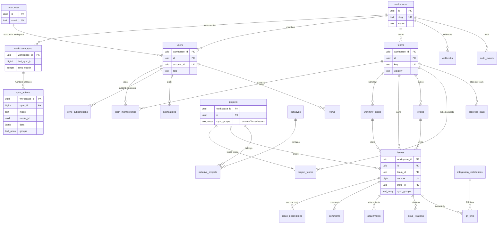

# Data model: Linear

データモデルの正本。表・列・キー・索引・パーティション・保持と、DB の外のストア（Valkey、同期の形、S3、OpenSearch、DynamoDB、SQS、IndexedDB）の形を、ここと [data-model/](data-model/) にまとめる。

- **形（表・列・キー・索引）はこの文書と `data-model/` を正とする。** 振る舞い（いつ書くか、誰が読めるか、競合の規則の意味）は、各領域の文書を正とする。両者が食い違ったら、実装を止めて Dev（テックリード）に確かめる。
- モデルの形は、開発リポジトリの `packages/schema` の `model()` の宣言から生成する（[data-model-and-schema.md](data-model-and-schema.md)、[ADR-0019](../decisions/0019-schema-definition-and-codegen.md)）。この文書の列の表は、その宣言の設計である。宣言とこの文書を同じ PR で直す。
- テナントと権限は [ADR-0004](../decisions/0004-tenancy-and-permissions.md)・[ADR-0032](../decisions/0032-single-policy-module-and-group-mapping.md)、同期のログは [ADR-0007](../decisions/0007-sync-actions-and-range-proof-deltas.md)、手元の保存は [ADR-0014](../decisions/0014-indexeddb-layout-durability-and-migrations.md) に従う。

## 1. 文書の構成

| ファイル | 内容 | 表の数 | ER 図 |
| --- | --- | --- | --- |
| この文書 | 規約、全体の ER 図、表の索引、RLS の外の表と関数、DB のロール、横断の不変条件、決めたこと | — | 1 |
| [data-model/sync.md](data-model/sync.md) | `workspace_sync`、`sync_actions`、`sync_outbox`、`tx_results`、`sync_subscriptions`、`workspace_stats`、`client_devices`、`narrowing_outbox`、収束の監査 | 10 | 1 |
| [data-model/workspace-and-access.md](data-model/workspace-and-access.md) | ワークスペース、設定、利用者、チーム、メンバーシップ、招待、アカウントとセッション（Better Auth）、振り分け | 17 | 2 |
| [data-model/issues.md](data-model/issues.md) | ワークフローの状態、イシュー、ラベル、関連、履歴、別名、テンプレート、下書き、本文と `doc_states`、コメント、リアクション、添付 | 16 | 2 |
| [data-model/planning.md](data-model/planning.md) | サイクル、プロジェクト、プロジェクトの説明・更新・マイルストーン、イニシアチブ、進捗 | 11 | 1 |
| [data-model/views-and-notifications.md](data-model/views-and-notifications.md) | ビュー、表示の設定、通知、インボックス、購読、通知の設定、リマインダー、送り | 9 | 1 |
| [data-model/integrations-and-api.md](data-model/integrations-and-api.md) | 連携のインストール・秘密・事象、PR の結び付け、外部のアカウント、Slack のチャンネル、Webhook、API キー、OAuth | 13 | 2 |
| [data-model/governance.md](data-model/governance.md) | インポート、書き出し、監査、リーガルホールド、サポートの許し | 10 | 1 |
| [data-model/stores.md](data-model/stores.md) | Valkey、同期のトランザクション・差分・行の形、S3、OpenSearch、DynamoDB の `narrowing_journal`、SQS、Webhook の本文、IndexedDB、フラグ | — | 2 |

合計 86 表（うちモデル 45）。ER 図は全体図 1 つと、領域ごとの図 12 個（IndexedDB の store の図と DynamoDB の図を含む）の計 13 個。

## 2. 規約

### 2.1 使うストア

| ストア | 役割 | 正本か | 失ったとき |
| --- | --- | --- | --- |
| Aurora PostgreSQL 18（東京の主。大阪は Global Database の二次） | モデルの表、同期のログ、サーバーだけの表、監査、`auth` スキーマ | 唯一の正本 | バックアップ・PITR・大阪への昇格（[infrastructure.md](infrastructure.md) の 6 節） |
| Aurora（ディレクトリのクラスタ。S2 から） | `workspace_directory`、`auth` スキーマ | 正本 | 同上 |
| DynamoDB（東京、大阪をレプリカにしたグローバルテーブル） | `narrowing_journal`（[data-model/stores.md](data-model/stores.md) の 5 節） | DR のやり直しのときだけ正本 | 35 日の TTL。Aurora の `narrowing_outbox` から送り直す |
| Valkey（ElastiCache） | 差分の pub/sub、チケット、セッションの写し、取り消しの知らせ、流量の枠、Relay の担当 | 正本ではない | 正しさは保たれる。クライアントは取り戻しで追いつく |
| OpenSearch | 検索の索引 `docs` | 正本ではない | 数え直しと作り直し（[search.md](search.md) の 9.4 節） |
| S3 | 添付の中身、インポートの段置き、書き出し、スナップショット、RUM、配布物、log-archive | 添付の中身は正本（行は Aurora） | バージョニングと大阪への複製（添付・配布物） |
| SQS | Relay・受け口から Worker へのきっかけ | 正本ではない | `sync_outbox`・`sync_actions`・`integration_events` から作り直す |
| AppConfig・CloudFront KeyValueStore | フラグ、`min_build`、互換の一覧、版の割合 | フラグの正本 | — |
| 端末の IndexedDB | 見てよい行の写し、outbox | `_outbox`・`_rejected`・`_blobs`・`_drafts` だけは端末の正本 | 写しは取り直す。outbox の喪失は件数だけ示す（[client-store-and-offline.md](client-store-and-offline.md) の 9.3 節） |

### 2.2 ID と人が読む識別子

- **ID はすべて UUIDv7**（[ADR-0020](../decisions/0020-ids-and-human-identifiers.md)）。モデルの ID はクライアントが振り、サーバーが作る行（履歴、購読、派生、サーバーだけの表）は Writer・Worker が振る。PostgreSQL 18 の `uuidv7()` を既定値にしてよい。Writer は版の 4 ビットと変種を確かめ、時刻が 1 日以上先の ID を `invalid` で拒否する。
- **例外**：
  - `sync_outbox.id`・`narrowing_outbox.id` は `bigserial`（Relay が `ORDER BY id` で読む）。
  - `sync_id` はワークスペースの中の連番（`bigint`）。ID ではなく位置である。
  - トランザクションの ID（`client_tx_id`）は、サーバーの主体だけが UUIDv5 を使ってよい（公開 API の `Idempotency-Key`、参加の `join:<workspace_id>:<account_id>`、連携の事象の配送 ID）。インポートは時刻の部分を決めた UUIDv7（[import-export.md](import-export.md) の 5.3 節）。
- **人が読む識別子**：
  | 識別子 | 形 | 振り方 | 一意 |
  | --- | --- | --- | --- |
  | イシュー | `<teams.key>-<issues.number>`（`ENG-123`） | Writer が `create` の適用の時に `teams.next_issue_number` から振る（`server_only`）。確定の順。再利用しない | `(workspace_id, team_id, number)`。移動の前の番号は `issue_aliases` |
  | チームの識別子 | `^[A-Z][A-Z0-9]{0,6}$` | 利用者（`lww`） | ワークスペースの中で大文字・小文字を区別せずに一意。古い識別子は `team_key_aliases` に残し、他のチームに使わせない |
  | イニシアチブ | `I-<initiatives.number>` | Writer が `workspaces.next_initiative_number` から振る | `(workspace_id, number)` |
  | サイクル | `cycles.number` | Worker がチームの中で振る | `(workspace_id, team_id, number)` |
- ack の前の仮の表示は `ENG-…`、URL は `/<workspace-slug>/issue/<uuid>`。確定の後は `/<workspace-slug>/issue/<KEY>-<number>`。解決は `resolve(key, number)`（[data-model-and-schema.md](data-model-and-schema.md) の 5.4 節）。本文の中の参照は ID で持つ。
- 外に見せるトークンだけに接頭辞を付ける（`<brand>_api_`・`<brand>_oat_`・`<brand>_ort_`・`<brand>_ocs_`・`<brand>_whsec_`。[api-and-webhooks.md](api-and-webhooks.md) の 6.1 節）。

### 2.3 テナンシーと FORCE RLS

ワークスペースの表（`workspace_id` を持つ表）は、次の形にそろえる（[ADR-0004](../decisions/0004-tenancy-and-permissions.md)）。

```sql
CREATE TABLE <t> (
  workspace_id uuid NOT NULL,
  id           uuid NOT NULL,
  ...
  PRIMARY KEY (workspace_id, id),
  FOREIGN KEY (workspace_id, <ref>_id) REFERENCES <parent> (workspace_id, id)
);
ALTER TABLE <t> ENABLE ROW LEVEL SECURITY;
ALTER TABLE <t> FORCE ROW LEVEL SECURITY;
CREATE POLICY tenant_isolation ON <t>
  USING      (workspace_id = current_setting('app.workspace_id')::uuid)
  WITH CHECK (workspace_id = current_setting('app.workspace_id')::uuid);
```

- 主キー・外部キー・索引の先頭は `workspace_id`。別のワークスペースの行を参照する外部キーは DB が拒否する。
- DB のトランザクションごとに `SET LOCAL app.workspace_id`。`current_setting` は `missing_ok` なしで呼ぶ（設定を忘れたらエラー）。
- `workspaces` は根の表で、`workspace_id = id` を CHECK で持つ。
- `on_delete` の規則（`restrict`・`nullify`・`remove`・`cascade`）は Writer が当て、差分を出す。DB の外部キーは `NO ACTION`（例外：サーバーだけの子の表の `ON DELETE CASCADE`。各表に書いた）。
- マイグレーションの CI は、新しい表に `workspace_id`・複合キー・`FORCE ROW LEVEL SECURITY`・ポリシーがあるか、RLS の外の表が 5 節の許可リストと一致するかを確かめる。

### 2.4 モデルの表の共通の列と、列の表の読み方

`model()` の宣言から生成する表（45 表）は、次の列を持つ。各ファイルの列の表には、共通の列を書かない。

| 列 | 型 | NULL | 書く人 | 意味 |
| --- | --- | --- | --- | --- |
| `workspace_id` | `uuid` | NO | Writer | テナント |
| `id` | `uuid` | NO | クライアント（UUIDv7） | モデルの ID |
| `created_at` | `timestamptz` | NO | Writer（確定の時刻） | `server_only`。`origin = import` だけ操作の値を受ける（`import_writable`） |
| `updated_at` | `timestamptz` | NO | Writer（確定の時刻） | 行を変えた確定の時刻。M2 の「更新の時刻」、Webhook の `updatedAt` |
| `updated_sync_id` | `bigint` | NO | Writer | 行を最後に変えた `sync_id`（手元の `_u`） |
| `sync_groups` | `text[]` | NO | Writer | 行の同期グループ（手元の `_g`）。モデルの `groups` の規則で決める |
| `field_sync_ids` | `jsonb` | YES | Writer | `track_overwrites` のフィールド → `{sync_id, actor_id}`。`track_overwrites` のないモデルは NULL |
| `archived_at` | `timestamptz` | YES | Writer（`archive`・`unarchive`） | `archivable` でないモデルは常に NULL |
| `trashed_at` | `timestamptz` | YES | 利用者（`lww`） | `delete: trash` のモデル（`Issue`・`Team`・`Project`・`Initiative`）だけ |

- `workspace_id`・`sync_groups`・`field_sync_ids` は `api: internal`（手元の行と公開 API に出さない。`sync_groups` は手元では `_g` として持つ）。
- 各モデルの列の表の「競合」の欄は、`model()` のフィールドの属性（`conflict`、型、`max`・`range`、`on_delete`、`index`・`m2`・`search`・`pii`・`api`・`derive_only`・`import_writable`）を書く。「サーバーだけの列（モデルにない）」は、同じ表にあっても同期しない列（`issues.title_norm`、`teams.next_issue_number` など）。
- 各モデルの節の頭に、グループの規則（`groups`）・読み込み（`load`）・削除（`delete`）・`archivable` を書く。規則の意味は [data-model-and-schema.md](data-model-and-schema.md) の 3.5 節、誰が購読するかは [permissions-and-teams.md](permissions-and-teams.md) の 5.1 節。
- 索引：`(workspace_id, id)` の主キーに加え、`index` のフィールドに `(workspace_id, <field>)`。GIN `(sync_groups)` は、グループが列から引けない規則（`teams`、`instant` の `via`）のモデルにだけ張る。他のモデルのグループのブートストラップは、グループを決める列（`team_id` など）の索引で読む。
- 格納：`sync_groups` は行に数個なので配列のまま持ち、別の表にしない。

### 2.5 型

`model()` の型から PostgreSQL の型への写し。サーバーだけの表も同じ型を使う。

| 定義の型 | PostgreSQL | 規則 |
| --- | --- | --- |
| `string` | `text` ＋ `CHECK (char_length(x) <= max)` | `max` は必須 |
| `int` | `range` が 32 ビットに収まれば `integer`（`smallint` の場合あり）、それ以外は `bigint` | 番号・`sync_id`・件数は `bigint`。JS の安全な整数（2^53）を超えない |
| `float` | `double precision` | 使う予定なし |
| `bool` | `boolean` | 列名は `is_`・`has_` にしない（本家に寄せず、定義の名前のまま） |
| `date` | `date` | タイムゾーンなし |
| `timestamp` | `timestamptz` | UTC。`timestamp`（タイムゾーンなし）は使わない |
| `uuid`・`ref:<Model>` | `uuid` | `ref` は複合外部キー |
| `enum<...>` | `text` ＋ `CHECK (x IN (...))`（数の列挙は `smallint`） | PostgreSQL の `ENUM` は使わない（値の追加を互換の変更にするため。[data-model-and-schema.md](data-model-and-schema.md) の 6.2 節） |
| `set<ref:<Model>>`・`set<string>` | `uuid[]`・`text[]` ＋ `CHECK (cardinality(x) <= max)` | 要素に外部キーを張れないので、Writer が参照を確かめる |
| `order_key` | `text COLLATE "C"` ＋ `CHECK (octet_length(x) <= 64)` | バイトの順がそのまま並び（[sync-engine.md](sync-engine.md) の 8.3 節） |
| `crdt_doc` | 列を持たない | 状態は `doc_states`、更新は `sync_actions` の `append` |
| `json` | `jsonb` | 中身の JSON Schema が必須。Writer が検証する |
| `bytes` | `bytea` | `server_only` だけ。差分とブートストラップに載せず、ID の読み込みだけで返す（2026-09-28 に足した。7 節の D-4） |

- ハッシュ・暗号文は `bytea`、IP は `inet`、期間は整数（列名に単位。`auto_close_months`）。金額は扱わない。

### 2.6 時刻、アーカイブ、ゴミ箱、削除

| 形 | 使うモデル・表 | 規則 |
| --- | --- | --- |
| **アーカイブ** | `archivable` のモデル（`Issue`、`Team`、`WorkflowState`、`IssueLabel`、`Cycle`、`Project`、`ProjectStatus`、`Initiative`、`ProgressStat`） | `archive`・`unarchive` の操作で `archived_at`。手元では遅延のモデルになる（ブートストラップで取らない） |
| **ゴミ箱** | `delete: trash`（`Issue`・`Team`・`Project`・`Initiative`、30 日） | 利用者の削除は `archive` と `set trashed_at` の組。30 日後に Worker が `delete`（[issues-and-workflow.md](issues-and-workflow.md) の 4.5 節） |
| **物理削除** | `delete: hard` のモデル、サーバーだけの表 | `delete` の差分を出し、参照は `on_delete` で当てる。`User` は実際には消さず、停止と仮名にする（[security.md](security.md) の 9.2 節） |
| **時間で消す** | パーティションの表（2.9 節）、期限つきの表 | `DROP PARTITION` か、1 日 1 回の削除のジョブ |
| **墓標（手元）** | `_tombstones`（15 分） | 削除・`evict` の後に古い応答で行を生き返らせない（[ADR-0012](../decisions/0012-lazy-loading-coverage-and-tombstones.md)） |

- 保持の期間の正本は [security.md](security.md) の 9 節。新しい表・S3 の接頭辞・DynamoDB の項目を足すときは、保持の表とワークスペースの削除のジョブ（[ADR-0048](../decisions/0048-data-lifecycle-and-workspace-deletion.md)）に足す。
- ワークスペースの削除は、全部のワークスペースの表から `workspace_id` の行を 1 万行ずつ消す（[security.md](security.md) の 9.1 節）。表の一覧は、マイグレーションの CI の許可リストと同じ定義から得る。

### 2.7 命名

- 表は複数形の snake_case（`team_memberships`）。モデルの名前は単数の PascalCase（`TeamMembership`）で、生成器が表の名前を決める（`table` で上書きできる）。
- 外部キーの列は `<参照先の単数>_id`。役割が要るときは役割の名前（`assignee_id`、`creator_id`、`author_id`、`invited_by`）。集合は `<単数>_ids`。
- 時刻は `<過去分詞>_at`、日付は `_date`・`_on`（パーティションの鍵は `created_on`・`received_on`・`event_on`）。
- ハッシュは `<名前>_hash`（SHA-256）、暗号文は `ciphertext`・`dek_ciphertext`・`<名前>_ct`。
- Better Auth の表と列は既定の名前のまま（列は camelCase。[accounts-and-auth.md](accounts-and-auth.md) の 3.3 節）。
- 本家の製品の内部の名前（同期のエンジンの型の名前など）を使わない（[リポジトリ共通の ADR-0006](../../../../docs/decisions/0006-brand-neutral-identifiers.md)）。

### 2.8 秘密・暗号化・個人データ

| 種類 | 列 | 表 |
| --- | --- | --- |
| 高いエントロピーの秘密（照合だけ） | `*_hash`（SHA-256、`bytea`） | `api_keys.key_hash`、`oauth_tokens.token_hash`、`oauth_apps.client_secret_hash`、`invitation_tokens.token_hash`、`workspace_invite_links.token_hash`、Valkey のチケット・コード |
| 戻す必要のある秘密 | `ciphertext`・`dek_ciphertext`（AES-256-GCM、AAD、`packages/envelope`、用途ごとの KMS の鍵） | `integration_secrets`、`webhook_secrets`、`import_secrets`、`webhook_deliveries.payload_ct` |
| 保存時の暗号化 | ストアごとの KMS（`<brand>-data`、`<brand>-exports` など） | 全部（[security.md](security.md) の 5.2 節） |

- マイグレーションの CI で、`secret`・`token`・`key` を含む名前の列が上のどちらかの型であることを確かめる（例外：`teams.key`、`team_key_aliases.key`、`import_items.source_key`、`import_jobs.source_key`、`integration_installations.external_key`、`notification_keys.key_hash` は許可リストに入れる）。
- 秘密をモデルに置かない（端末の IndexedDB に残るため。[ADR-0040](../decisions/0040-integration-installations-and-credential-storage.md)）。
- 個人データの注記：モデルのフィールドは `pii: identity | content`。サーバーだけの表の列にもマイグレーションのコメントで同じ注記を付け、ログ・トレース・メトリクスに出さない。
- 端末の手元の DB はアプリの層で暗号化しない（[ADR-0046](../decisions/0046-device-data-no-app-encryption-and-remote-wipe.md)）。

### 2.9 パーティション

| 表 | 分割 | 単位 | 落とす時期 | 一意の守り方 |
| --- | --- | --- | --- | --- |
| `sync_actions` | `RANGE (created_on)` | 1 日 | 30 日（`floor_sync_id` を上げてから） | `workspace_sync` のロック（I-1） |
| `tx_results` | `RANGE (created_on)` | 1 日 | 90 日 | ロックの中で先に引く（I-4） |
| `integration_events` | `RANGE (received_on)` | 1 日 | 30 日 | 受け口の先の引きと、Writer の `client_tx_id`（I-4） |
| `webhook_deliveries` | `RANGE (created_on)`（元の変更の日） | 1 日 | 14 日 | 主キーと `(webhook_id, sync_id, created_on)`（I-15） |
| `notification_keys` | `RANGE (event_on)`（事象の日） | 1 日 | 30 日 | 主キー（I-15） |
| `audit_events` | `RANGE (created_on)` | 1 日 | 1 年 | — |
| `convergence_audits` | `RANGE (created_on)` | 1 日 | 90 日 | — |
| `platform_audit_events` | `RANGE (created_on)` | 1 か月 | 1 年（log-archive に 5 年） | — |

- パーティションの鍵を主キーに含める必要があるので、日をまたぐ一意は「鍵を事象から決定的に決める」か「ロックの中で先に引く」で守る（7 節の D-7・D-8）。
- 作成と削除は `partition-maintenance`（1 日 1 回、`platform`）が行い、7 日先まで作る。
- S2 で行の多い表（`issue_history`・`comments`・`issues`）は、`HASH (workspace_id)` の分割を考える（8 節の持ち越し）。

### 2.10 定義からの生成

| 出力 | この文書との対応 |
| --- | --- |
| DB の望む形（表、列、共通の列、主キー・索引、RLS のポリシー、CHECK） | 各ファイルの列の表と「主キー・一意・索引・CHECK」。マイグレーションの CI が望む形と比べる |
| `packages/model`（型、Zod、`applyOp`、`groupsOf`、`via` の逆向きの表、`on_delete` の表） | 列の表の「競合」の欄 |
| クライアントの構成（IndexedDB の store と索引、M2 の列、`schema_version`・`schema_hash`、被覆の鍵） | [data-model/stores.md](data-model/stores.md) の 8 節 |
| Sync API の構成（被覆の鍵の検証、`partial` の条件の SQL） | `issues` の `issue_active_30d` |
| GraphQL の型（`api: public` のモデルとフィールド） | `api: internal` の列は出さない |

- モデルでない表（41 表。Better Auth の 5 表を含む）は定義の言語で書かず、マイグレーションを手で書く（Better Auth の表は部品のマイグレーション）。この文書の列の表が設計である。
- スキーマの版（`schema_version`・`schema_hash`・`fv`）と互換の一覧は、開発リポジトリの `schema_versions`（リリースごとの記録）に持つ（[data-model-and-schema.md](data-model-and-schema.md) の 6.1 節）。

### 2.11 S1 の規模の前提

各表の「S1 の規模」は、次の前提からの見積もりである。E2・E3・E12 の計測で置き換える。

| 項目 | 値 | 出典 |
| --- | --- | --- |
| ワークスペース | 5,000 | [README.md](README.md) の 2 節 |
| 利用者（`users` の行） | 約 15 万（月間 10 万人 × 1.5） | 同上（行の数は仮定） |
| イシュー | 約 2,500 万（平均 5,000、最大 50 万） | 最大は README。平均は仮定 |
| `sync_actions` | 平均 800 万行/日、1 行 約 1.5 KB | [capacity.md](capacity.md) の 1 節 |
| トランザクション | ピーク 約 600 件/秒 | 同上 |
| Webhook の送り・連携の事象 | 500 件/秒・50 件/秒 | 同上 |

## 3. 全体の ER 図

主な実体と関係だけを示す。列と細かい関係は、領域ごとの図にある。



- 実体の属性は、図を読むのに要るものだけ。`auth_user` は `auth.user`。

## 4. 表の索引

「テナント」の欄：「内」はワークスペースの表（RLS）、「外」は RLS の外（5 節）。「グループ」はモデルの `groups` の規則（サーバーだけの表は「—」）。

| 表 | モデル | グループ | 読み込み | テナント | ファイル | 振る舞いの文書 |
| --- | --- | --- | --- | --- | --- | --- |
| `workspace_sync` | — | — | — | 内 | [sync](data-model/sync.md) | [sync-engine.md](sync-engine.md) の 7.1 節 |
| `sync_actions` | — | — | — | 内 | [sync](data-model/sync.md) | 同 7 節、ADR-0007 |
| `sync_outbox` | — | — | — | 外 | [sync](data-model/sync.md) | 同 7.1・7.3 節 |
| `tx_results` | — | — | — | 内 | [sync](data-model/sync.md) | 同 5.4 節、ADR-0006 |
| `sync_subscriptions` | `SyncSubscription` | `user` | instant | 内 | [sync](data-model/sync.md) | [bootstrap-and-partial-sync.md](bootstrap-and-partial-sync.md) の 7 節 |
| `workspace_stats` | — | — | — | 内 | [sync](data-model/sync.md) | 同 4.1 節 |
| `client_devices` | — | — | — | 外 | [sync](data-model/sync.md) | [client-store-and-offline.md](client-store-and-offline.md) の 9.3 節 |
| `narrowing_outbox` | — | — | — | 外 | [sync](data-model/sync.md) | [infrastructure.md](infrastructure.md) の 6.3 節、ADR-0058 |
| `convergence_audits` | — | — | — | 内 | [sync](data-model/sync.md) | [observability.md](observability.md) の 4 節 |
| `convergence_mismatches` | — | — | — | 内 | [sync](data-model/sync.md) | 同 4.3 節 |
| `workspaces` | `Workspace` | `workspace` | instant | 根 | [workspace-and-access](data-model/workspace-and-access.md) | [permissions-and-teams.md](permissions-and-teams.md) の 3.3 節 |
| `workspace_settings` | `WorkspaceSettings` | `workspace_members` | instant | 内 | [workspace-and-access](data-model/workspace-and-access.md) | 同上 |
| `users` | `User` | `workspace` | instant | 内 | [workspace-and-access](data-model/workspace-and-access.md) | 同 3.2 節 |
| `teams` | `Team` | `team_row` | instant | 内 | [workspace-and-access](data-model/workspace-and-access.md) | 同 3.2 節、[issues-and-workflow.md](issues-and-workflow.md) の 3.1 節、[cycles-and-projects.md](cycles-and-projects.md) の 3.1 節 |
| `team_memberships` | `TeamMembership` | `team_row` | instant | 内 | [workspace-and-access](data-model/workspace-and-access.md) | [permissions-and-teams.md](permissions-and-teams.md) の 3.2・7 節 |
| `team_key_aliases` | — | — | — | 内 | [workspace-and-access](data-model/workspace-and-access.md) | [data-model-and-schema.md](data-model-and-schema.md) の 5.4 節 |
| `invitations` | `Invitation` | `admin` | instant | 内 | [workspace-and-access](data-model/workspace-and-access.md) | [accounts-and-auth.md](accounts-and-auth.md) の 7 節 |
| `invitation_tokens` | — | — | — | 内 | [workspace-and-access](data-model/workspace-and-access.md) | 同 7.1 節 |
| `workspace_invite_links` | — | — | — | 内 | [workspace-and-access](data-model/workspace-and-access.md) | 同 7.4 節 |
| `workspace_domain_verifications` | — | — | — | 内 | [workspace-and-access](data-model/workspace-and-access.md) | 同 7.4 節 |
| `auth.user`・`auth.account`・`auth.session`・`auth.verification`・`auth.passkey` | — | — | — | 外 | [workspace-and-access](data-model/workspace-and-access.md) | 同 3〜6 節、ADR-0034・0035 |
| `auth.workspace_directory` | — | — | — | 外 | [workspace-and-access](data-model/workspace-and-access.md) | 同 4.1 節 |
| `workspace_directory` | — | — | — | 外（S2） | [workspace-and-access](data-model/workspace-and-access.md) | [infrastructure.md](infrastructure.md) の 10.1 節 |
| `workflow_states` | `WorkflowState` | `team` | instant | 内 | [issues](data-model/issues.md) | [issues-and-workflow.md](issues-and-workflow.md) の 3.2・4 節 |
| `issues` | `Issue` | `team` | partial | 内 | [issues](data-model/issues.md) | 同 3.3 節、[data-model-and-schema.md](data-model-and-schema.md) の 3.1 節 |
| `issue_labels` | `IssueLabel` | `team_or_workspace` | instant | 内 | [issues](data-model/issues.md) | [issues-and-workflow.md](issues-and-workflow.md) の 3.4・6 節 |
| `issue_relations` | `IssueRelation` | `via`（両方） | lazy | 内 | [issues](data-model/issues.md) | 同 3.5・7・8 節 |
| `issue_history` | `IssueHistory` | `via` | lazy | 内 | [issues](data-model/issues.md) | 同 11 節 |
| `issue_aliases` | `IssueAlias` | `via` | lazy | 内 | [issues](data-model/issues.md) | [data-model-and-schema.md](data-model-and-schema.md) の 5.4 節 |
| `issue_templates` | `IssueTemplate` | `team_or_workspace` | instant | 内 | [issues](data-model/issues.md) | [issues-and-workflow.md](issues-and-workflow.md) の 12 節 |
| `issue_drafts` | `IssueDraft` | `user` | lazy | 内 | [issues](data-model/issues.md) | 同 12 節 |
| `issue_descriptions` | `IssueDescription` | `via` | lazy | 内 | [issues](data-model/issues.md) | [editor-and-descriptions.md](editor-and-descriptions.md) の 4 節 |
| `issue_description_versions` | `IssueDescriptionVersion` | `via` | lazy | 内 | [issues](data-model/issues.md) | 同 4.7 節 |
| `doc_states` | — | — | — | 内 | [issues](data-model/issues.md) | 同 4.2 節 |
| `doc_mentions` | — | — | — | 内 | [issues](data-model/issues.md) | 同 6 節 |
| `comments` | `Comment` | `via` | lazy | 内 | [issues](data-model/issues.md) | 同 5・7 節 |
| `reactions` | `Reaction` | `via`（2 段） | lazy | 内 | [issues](data-model/issues.md) | 同 5.1 節 |
| `attachments` | `Attachment` | `via` | lazy | 内 | [issues](data-model/issues.md) | 同 8 節 |
| `attachment_purges` | — | — | — | 内 | [issues](data-model/issues.md) | 同 8.4 節 |
| `cycles` | `Cycle` | `team` | instant | 内 | [planning](data-model/planning.md) | [cycles-and-projects.md](cycles-and-projects.md) の 3.2・4 節 |
| `projects` | `Project` | `teams` | instant | 内 | [planning](data-model/planning.md) | 同 3.3・5 節 |
| `project_teams` | `ProjectTeam` | `team` | instant | 内 | [planning](data-model/planning.md) | 同 3.3・5.2 節 |
| `project_statuses` | `ProjectStatus` | `workspace` | instant | 内 | [planning](data-model/planning.md) | 同 3.5 節 |
| `project_milestones` | `ProjectMilestone` | `via` | instant | 内 | [planning](data-model/planning.md) | 同 3.6 節 |
| `project_descriptions` | `ProjectDescription` | `via` | lazy | 内 | [planning](data-model/planning.md) | [editor-and-descriptions.md](editor-and-descriptions.md) の 4 節と同じ方式 |
| `project_updates` | `ProjectUpdate` | `via` | lazy | 内 | [planning](data-model/planning.md) | [cycles-and-projects.md](cycles-and-projects.md) の 6 節 |
| `initiatives` | `Initiative` | `workspace_members` | instant | 内 | [planning](data-model/planning.md) | 同 3.7 節 |
| `initiative_projects` | `InitiativeProject` | `via` | instant | 内 | [planning](data-model/planning.md) | 同 3.7 節 |
| `progress_stats` | `ProgressStat` | `team` | instant | 内 | [planning](data-model/planning.md) | 同 7.2・7.3 節、ADR-0027 |
| `progress_points` | `ProgressPoint` | `team` | lazy | 内 | [planning](data-model/planning.md) | 同 7.4 節 |
| `views` | `View` | `view_scope` | instant | 内 | [views-and-notifications](data-model/views-and-notifications.md) | [views-and-filters.md](views-and-filters.md) の 7 節 |
| `view_preferences` | `ViewPreference` | `user` | instant | 内 | [views-and-notifications](data-model/views-and-notifications.md) | 同 7.1 節 |
| `notifications` | `Notification` | `user` | instant | 内 | [views-and-notifications](data-model/views-and-notifications.md) | [notifications-and-inbox.md](notifications-and-inbox.md) の 4.2・5 節 |
| `inbox_states` | `InboxState` | `user` | instant | 内 | [views-and-notifications](data-model/views-and-notifications.md) | 同 4.2・6.1 節 |
| `notification_subscriptions` | `NotificationSubscription` | `user` | instant | 内 | [views-and-notifications](data-model/views-and-notifications.md) | 同 4.1 節 |
| `notification_preferences` | `NotificationPreference` | `user` | instant | 内 | [views-and-notifications](data-model/views-and-notifications.md) | 同 4.3 節 |
| `issue_reminders` | `IssueReminder` | `user` | instant | 内 | [views-and-notifications](data-model/views-and-notifications.md) | 同 6.3 節 |
| `notification_keys` | — | — | — | 内 | [views-and-notifications](data-model/views-and-notifications.md) | 同 5.2 節 |
| `notification_deliveries` | — | — | — | 内 | [views-and-notifications](data-model/views-and-notifications.md) | 同 8 節 |
| `integration_installations` | `IntegrationInstallation` | `admin` | instant | 内 | [integrations-and-api](data-model/integrations-and-api.md) | [integrations.md](integrations.md) の 4.1・5.1 節 |
| `integration_secrets` | — | — | — | 内 | [integrations-and-api](data-model/integrations-and-api.md) | 同 6 節 |
| `integration_events` | — | — | — | 内 | [integrations-and-api](data-model/integrations-and-api.md) | 同 3・7 節 |
| `git_links` | `GitLink` | `via` | lazy | 内 | [integrations-and-api](data-model/integrations-and-api.md) | 同 4.3 節 |
| `external_account_links` | `ExternalAccountLink` | `user` | instant | 内 | [integrations-and-api](data-model/integrations-and-api.md) | 同 4.6 節 |
| `slack_channel_subscriptions` | `SlackChannelSubscription` | `admin` | instant | 内 | [integrations-and-api](data-model/integrations-and-api.md) | 同 5.3 節 |
| `webhooks` | `Webhook` | `admin` | instant | 内 | [integrations-and-api](data-model/integrations-and-api.md) | [api-and-webhooks.md](api-and-webhooks.md) の 5 節 |
| `webhook_secrets` | — | — | — | 内 | [integrations-and-api](data-model/integrations-and-api.md) | 同 5.1・5.5 節 |
| `webhook_deliveries` | — | — | — | 内 | [integrations-and-api](data-model/integrations-and-api.md) | 同 5.7 節 |
| `api_keys` | — | — | — | 内 | [integrations-and-api](data-model/integrations-and-api.md) | 同 6.2 節 |
| `oauth_apps` | — | — | — | 内 | [integrations-and-api](data-model/integrations-and-api.md) | 同 6.3 節 |
| `oauth_grants` | — | — | — | 内 | [integrations-and-api](data-model/integrations-and-api.md) | 同 6.3 節 |
| `oauth_tokens` | — | — | — | 内 | [integrations-and-api](data-model/integrations-and-api.md) | 同 6.3 節 |
| `import_jobs` | `ImportJob` | `admin` | instant | 内 | [governance](data-model/governance.md) | [import-export.md](import-export.md) の 3 節 |
| `import_mappings` | — | — | — | 内 | [governance](data-model/governance.md) | 同 4 節 |
| `import_items` | — | — | — | 内 | [governance](data-model/governance.md) | 同 5.3 節 |
| `import_secrets` | — | — | — | 内 | [governance](data-model/governance.md) | 同 3 節 |
| `export_jobs` | `ExportJob` | `user` | instant | 内 | [governance](data-model/governance.md) | 同 7 節 |
| `audit_events` | — | — | — | 内（追記だけ） | [governance](data-model/governance.md) | [security.md](security.md) の 6 節、ADR-0047 |
| `audit_export_checkpoints` | — | — | — | 内 | [governance](data-model/governance.md) | 同 6 節 |
| `platform_audit_events` | — | — | — | 外（追記だけ） | [governance](data-model/governance.md) | 同 6 節 |
| `legal_holds` | — | — | — | 外 | [governance](data-model/governance.md) | 同 9 節 |
| `workspace_support_grants` | — | — | — | 内 | [governance](data-model/governance.md) | 同 8 節 |

- `auth` の 5 表を 5 つと数えて合計 86 表。
- 規則が `workspace` のモデル（`Workspace`、`User`、`ProjectStatus`、ワークスペースの `IssueLabel`・`IssueTemplate`）は `guest_visible` の注記を持つ（[data-model-and-schema.md](data-model-and-schema.md) の 4.1 節の行 11）。

## 5. RLS の外の表と、コンテキストの前の関数

**ここにない表は、すべて `workspace_id` と FORCE RLS を持つ。** マイグレーションの CI の許可リストは、この表と一致させる。追加は、この表と [security.md](security.md) を合わせて更新し、Dev のテックリードとセキュリティの担当の承認を得る。

| 表 | RLS の外に置く理由 | 読める主体 | 書ける主体 |
| --- | --- | --- | --- |
| `auth.user`・`auth.account`・`auth.session`・`auth.verification`・`auth.passkey` | アカウントはワークスペースをまたぐ | `auth` | `auth` |
| `auth.workspace_directory` | アカウント → ワークスペースの入り口の写し | `auth` | `worker`（関数 `auth.upsert_workspace_directory` 経由） |
| `workspace_directory`（S2 から） | ワークスペース → クラスタ | 全サービス | `platform` |
| `sync_outbox` | Relay が全ワークスペースを順に読む。行は `workspace_id` と範囲と時刻だけ | `relay` | `writer` |
| `narrowing_outbox` | Relay が全ワークスペースの送り残しを順に読む。行は ID と列挙の値だけ | `relay` | `writer`・`auth` |
| `client_devices` | 端末の ID はワークスペースを決める前（握手の前、DB がない時）に引く | Gateway、`sync_reader` | Gateway |
| `platform_audit_events` | ワークスペースをまたぐ操作 | `platform`、監査のロール | 各サービス（追記だけ） |
| `legal_holds` | 保持と削除のジョブがワークスペースをまたいで読む | `platform` | `platform`（法務の指示） |

ワークスペースのコンテキストの前の読み出しは、表を RLS の中に置いたまま、`SECURITY DEFINER` の関数だけで、決まった列を返す。関数の持ち主は `migrator`。

| 関数 | 返すもの | 表 | 実行できる | 使う場所 |
| --- | --- | --- | --- | --- |
| `resolve_workspace_slug(slug)` | `(id, status, region)` | `workspaces` | `auth`・`public_api`・`sync_reader` | 画面の最初の URL、招待の URL（[permissions-and-teams.md](permissions-and-teams.md) の 3.3 節） |
| `oauth_app_public(client_id)` | `(workspace_id, app_id, name, redirect_uris, scopes)` | `oauth_apps` | `public_api` | 認可の画面、トークンの交換（[api-and-webhooks.md](api-and-webhooks.md) の 6.3 節） |
| `resolve_api_credential(token_hash)` | `(workspace_id, kind, credential_id)` | `api_keys`・`oauth_tokens` | `public_api` | 公開 API の認証、シークレットスキャンの通報（2026-09-28 に足した。D-10） |
| `resolve_integration_target(provider, external_key)` | `(workspace_id, installation_id)` の列 | `integration_installations` | `integrations` | 受け口 `/hooks/*` が署名の鍵とワークスペースを決める（D-10） |
| `scheduler_due_items(kind, until, limit)` | `(workspace_id, id)` の列 | `issue_reminders`・`notification_deliveries`・`attachment_purges` | `worker` | 期限の来た行を探す定期のジョブ。受け取った `workspace_id` でコンテキストを設定し、行を RLS の下で読み直す（D-10） |
| `auth.upsert_workspace_directory(...)` | なし | `auth.workspace_directory` | `worker` | 入り口の写しの書き込み（D-18） |

- 関数の追加も、この節の更新とセキュリティの担当の承認を要する。D-10・D-18 の 4 つは、この文書で起票した案で、承認を待つ（8 節）。

### 5.1 DB のロール

| ロール | 使うサービス | 権限 |
| --- | --- | --- |
| `migrator` | マイグレーション | 所有者。FORCE RLS の対象 |
| `writer` | Writer | モデルの表・同期の表・監査・`narrowing_outbox` の書き込み。RLS の対象 |
| `sync_reader` | Sync API、Gateway、audit-worker | モデルの表・同期の表の読み取り、`client_devices`。RLS の対象 |
| `public_api` | Public API | 読み取り（reader）と、OAuth・API キーの表。RLS の対象 |
| `auth` | 認証のサービス | `auth` スキーマ、`narrowing_outbox` の書き込み（RLS の外） |
| `relay` | Relay | `sync_outbox`・`sync_actions` の読み取りと送った行の削除、`narrowing_outbox` の `shipped_at` |
| `worker` | Worker | ジョブごとにワークスペースのコンテキストを設定。RLS の対象 |
| `integrations` | 連携の Worker と受け口 | `integration_secrets`・`integration_events` と連携のモデルの読み取り |
| `platform` | ワークスペースをまたぐ処理（保持・削除・パーティション、DR の `sync_epoch` の引き上げと狭める操作のやり直し、課金の集計） | RLS を迂回。操作は `platform_audit_events` へ |

## 6. 横断の不変条件

実装とテストで守る規則。DB の制約で守れるものは制約にし、守れないものはロックの中の確かめと性質ベーステストで守る。

| # | 不変条件 | 守り方 | 決めた場所 |
| --- | --- | --- | --- |
| I-1 | **`sync_id` はワークスペースごとに欠けなく続く。** 1 変更 1 番号。拒否したトランザクションは番号を使わない | Writer が `workspace_sync` を最初に `FOR UPDATE` でロックし、同じ DB のトランザクションで振る。`sync_actions` の DB の一意はパーティションのため強制しない | [ADR-0002](../decisions/0002-sync-model.md)、[ADR-0007](../decisions/0007-sync-actions-and-range-proof-deltas.md) |
| I-2 | **範囲の証明**：`deltas {from, to}` は「`(from, to]` のうち、この接続が見てよい変更はこれで全部」。範囲の終わりはトランザクションの境（`tx_end`） | Gateway は絞る前の列が欠けなく並んだときだけ名乗る。クライアントは `from > L` を欠けとして取り戻す | [ADR-0007](../decisions/0007-sync-actions-and-range-proof-deltas.md)、[sync-engine.md](sync-engine.md) の 7.4・7.5 節 |
| I-3 | 行の `updated_sync_id` は、行に触れた最後の変更の `sync_id`。手元は `_u` の大きい方を残す | Writer が同じトランザクションで書く。PROP-BOOT-001 | [ADR-0003](../decisions/0003-bootstrap-and-partial-sync.md)、[ADR-0011](../decisions/0011-bootstrap-stream-and-chunked-snapshots.md) |
| I-4 | 確定したトランザクションはワークスペースで 1 回だけ効く | `tx_results` をロックの中で先に引く。再送は前の結果を返す。PROP-SYNC-002 | [ADR-0006](../decisions/0006-transactions-writer-and-idempotency.md) |
| I-5 | **墓標**：削除・`evict` の後、それより古い応答で行を生き返らせない | 手元の `_tombstones`（15 分）。15 分より前に始めた読み込みの応答は捨てる | [ADR-0012](../decisions/0012-lazy-loading-coverage-and-tombstones.md) |
| I-6 | **識別子の一意**：チームの中の `number` は一意で、再利用しない。`issues` と `issue_aliases` の `(team_id, number)` は重ならない。`next_issue_number` は使った最大より大きい | `UNIQUE (workspace_id, team_id, number)` を両方の表に。番号は Writer がロックの中で振る。PROP-SCHEMA-003 | [ADR-0020](../decisions/0020-ids-and-human-identifiers.md) |
| I-7 | チームの識別子は、`teams.key` と `team_key_aliases.key` を合わせて、ワークスペースの中で大文字・小文字を区別せずに一意 | `teams` の一意の索引と、Writer のロックの中の確かめ | [ADR-0020](../decisions/0020-ids-and-human-identifiers.md) |
| I-8 | **`sync_epoch`**：DR の切り替えと時点への差し替えで上げる。違う世代の手元はやり直す。確定から 15 分の outbox（`done`）も送り直す | 握手の決定表の行 2。`kick: epoch_changed` | [ADR-0013](../decisions/0013-sync-group-changes-retention-and-reset.md)、[ADR-0050](../decisions/0050-disaster-recovery-and-sync-epoch-bump.md) |
| I-9 | 1 つのアカウントは、1 つのワークスペースに最大 1 人の `User` | `UNIQUE (workspace_id, account_id)` | [ADR-0034](../decisions/0034-accounts-with-better-auth.md) |
| I-10 | ワークスペースに `active` のオーナーが 1 人以上 | 最後のオーナーの降格・停止は `workflow_violation` | [permissions-and-teams.md](permissions-and-teams.md) の 3.1 節 |
| I-11 | ワークフローの状態とプロジェクトの状態の最低の数（種類ごと） | Writer のロックの中の確かめ。抜き取りの監査 | [ADR-0023](../decisions/0023-workflow-states-and-lifecycle-automation.md) |
| I-12 | 1 チームの `active` のサイクルは 1 つ | 部分一意の索引 | [ADR-0026](../decisions/0026-cycle-rows-and-rollover.md) |
| I-13 | **非公開のチームの絞り**：行のグループは `groups` の規則だけで決め、行の中のチームの ID の集合から決めない（`teams` は結び付けのモデルから）。複数のグループの和に入る行は ID と、どの読み手にも見せてよい値だけを持つ。読む権限は「`groupsOf(row) ∩ groupsFor(p) ≠ ∅`」だけ | 生成器の検査（行 12）、Writer が依存の行の `sync_groups` を同じトランザクションで直す、PROP-PERM-001・002、配信の監査 | [ADR-0004](../decisions/0004-tenancy-and-permissions.md)、[ADR-0032](../decisions/0032-single-policy-module-and-group-mapping.md)、[ADR-0033](../decisions/0033-team-visibility-changes-and-guests.md) |
| I-14 | `sync_subscriptions` は `groupsFor` と一致する | Writer が権限の変更のトランザクションで差を書く。1 日 1 回の `subscription_drift` が 0 | [ADR-0013](../decisions/0013-sync-group-changes-retention-and-reset.md)、[permissions-and-teams.md](permissions-and-teams.md) の 5.3 節 |
| I-15 | 1 つの事象で、1 人への通知は 1 行。1 つの変更の Webhook の送りは、Webhook ごとに 1 件 | `notification_keys` の主キー（事象の日で分割）、`webhook_deliveries` の一意（変更の日で分割） | [ADR-0036](../decisions/0036-notifications-derived-by-notifier.md)、[ADR-0043](../decisions/0043-signed-webhooks-from-sync-log.md) |
| I-16 | 監査の対象の操作が成功したら、同じ DB のトランザクションに `audit_events` が 1 行ある。監査は追記だけ | 書き手のロールに `INSERT` だけ。表駆動の結合テスト | [ADR-0047](../decisions/0047-audit-log.md) |
| I-17 | 検索・ビューの問い合わせ・書き出し・公開 API・Webhook は、必ず `workspace_id` と呼んだ人の `groupsFor` で絞る。検索の結果は Aurora の今の `sync_groups` で読み直す | `buildSearchRequest`・`packages/query` だけで作る（lint）。PROP-API-001 | [ADR-0031](../decisions/0031-search-permission-by-sync-groups.md)、[ADR-0041](../decisions/0041-public-graphql-generated-schema-and-writer-mutations.md) |
| I-18 | Valkey の鍵、S3 の鍵、検索の条件は、ワークスペースで区切るか、ハッシュだけを入れる | [data-model/stores.md](data-model/stores.md) の形。レビューと lint | [ADR-0004](../decisions/0004-tenancy-and-permissions.md) |
| I-19 | 権限を狭める操作は、同じトランザクションで `narrowing_outbox` に書かれ、大阪の昇格では書き込みを受ける前にやり直される | Writer・認証のサービスの共通の部品。PROP-DR-001 | [ADR-0058](../decisions/0058-dr-permission-narrowing-journal.md) |
| I-20 | 端末のモデルの store は確定した行だけを持つ。移行とやり直しは `_outbox` を消さない | 保存の層の API（未確定をモデルの store に書く経路を持たない） | [ADR-0005](../decisions/0005-client-persistence-and-offline.md)、[ADR-0014](../decisions/0014-indexeddb-layout-durability-and-migrations.md) |
| I-21 | `sync_actions` のパーティションを落とす前に `floor_sync_id` を上げる。本文のまとめが追いついていないパーティションは落とさない | 保持のジョブの順 | [ADR-0013](../decisions/0013-sync-group-changes-retention-and-reset.md)、[ADR-0021](../decisions/0021-description-crdt-yjs-in-sync-log.md) |
| I-22 | 並びの鍵は `order_scope` の中で一意 | Writer が重なりを書き換えて当てる（`server_ops`） | [ADR-0008](../decisions/0008-conflict-rules-and-fractional-keys.md) |
| I-23 | 秘密・秘密のハッシュをモデル（同期する行）に置かない | 生成の検査と、列の名前の CI（2.8 節） | [ADR-0040](../decisions/0040-integration-installations-and-credential-storage.md) |
| I-24 | `ProgressStat` の数は派生の `incr` だけで変わる | `derive_only`。数え直しも `incr` | [ADR-0027](../decisions/0027-progress-stats-per-team-via-derive.md) |
| I-25 | DB が正本。Valkey・SQS・OpenSearch・端末の写しを失っても、DB から作り直せる（例外は端末の未送信と、DR の `narrowing_journal`） | 配信の経路に状態を持たせない | [ADR-0002](../decisions/0002-sync-model.md) |

## 7. この統合で決めたこと（2026-09-28）

領域の文書と ADR の間の名前・列の食い違いと、欠けていた表を、次のとおり決めた。どれも既定案で、E1〜E12 の実装で覆りうる。ADR の決定は変えていない。

| # | 決定 | 理由 | 直した文書 |
| --- | --- | --- | --- |
| D-1 | データモデルを `data-model/` の領域ごとのファイルに分け、形の正本をここに移した。領域の文書の「data-model への項目」は提案の記録として残す | 1 つの文書では 1,500 行を超える | この文書、[data-model-and-schema.md](data-model-and-schema.md) の 12 節 |
| D-2 | 共通の列に `updated_at` を足した | M2 の「更新の時刻」と Webhook の `updatedFrom.updatedAt` に要るのに、列がなかった | [data-model-and-schema.md](data-model-and-schema.md) の 4 節 |
| D-3 | `delete: trash` のモデルに `trashed_at` を生成する | `Team`・`Project`・`Initiative` は `trash` なのに列がなかった | 同 3.4・4 節 |
| D-4 | 定義の型に `bytes`（`server_only`、ID の読み込みだけで返す）を足し、`IssueDescriptionVersion.state` に使う | 版の状態（最大 4 MiB）を差分に載せると、Relay の 1 メッセージ 1 MiB を超える。定義の言語にバイト列の型がなかった | 同 3.3 節、[editor-and-descriptions.md](editor-and-descriptions.md) の 4.7 節 |
| D-5 | `ProjectDescription`（`project_descriptions`）を足した | ADR-0002 と AGENTS.md は「プロジェクトの説明は CRDT」とするが、モデルがなかった | [data-model/planning.md](data-model/planning.md) |
| D-6 | `issue_aliases` にモデルの `id` を足し、`(team_id, number)` を一意の制約にした | `IssueAlias` はモデルなので ID と共通の列が要る | [data-model-and-schema.md](data-model-and-schema.md) の 5.4 節 |
| D-7 | `tx_results` を `created_on` の日ごとのパーティションにし、主キーに含めた。一意はロックの中の先の引きで守る。UUIDv5 の ID はサーバーの主体だけ | 文書は「日ごとのパーティション」と「`(workspace_id, client_tx_id)` の主キー」を同時に書いていた（PostgreSQL では両立しない）。公開 API の `Idempotency-Key` は UUIDv5 で時刻を持たない | [sync-engine.md](sync-engine.md) の 5.4 節 |
| D-8 | `notification_keys` は事象の日（`event_on`）、`webhook_deliveries` は元の変更の日（`created_on`）で分割し、日をまたぐ再配送の重複も主キー・一意で捨てる | 書いた日で分割すると、日をまたぐ再配送の重複を捨てられない | [data-model/views-and-notifications.md](data-model/views-and-notifications.md)、[data-model/integrations-and-api.md](data-model/integrations-and-api.md) |
| D-9 | `integration_events` の重複は、受け口の先の引きと、Worker の `client_tx_id = UUIDv5(provider ‖ delivery_id ‖ workspace_id)` で捨てる | パーティションの表で配送 ID の一意を DB で強制できない | [data-model/integrations-and-api.md](data-model/integrations-and-api.md) |
| D-10 | コンテキストの前の関数 `resolve_api_credential`・`resolve_integration_target`・`scheduler_due_items` を起票した（承認待ち） | API のトークン、連携の受け口、期限の来た行の探しは、ワークスペースを決める前に行を引く必要がある。RLS の外の表を増やさず、Slack の題材の関数の形に揃えた | この文書の 5 節 |
| D-11 | `teams.next_issue_number` と `workspaces.next_initiative_number` はサーバーだけの列（同期しない） | 番号の振り方は Writer だけのもの。イニシアチブの番号の数の置き場所がなかった | [data-model/workspace-and-access.md](data-model/workspace-and-access.md) |
| D-12 | 添付に `s3_key`・`sha256`（サーバーだけ）と `external_url` を足し、消した添付の中身を 30 日後に消す台帳 `attachment_purges` を足した | 行を消した後に S3 の鍵が分からない。Slack の permalink とインポートの元の URL の置き場所がなかった | [data-model/issues.md](data-model/issues.md)、[security.md](security.md) の 9 節 |
| D-13 | `audit_export_checkpoints` を足した | log-archive のハッシュの連鎖を続ける場所がなかった | [data-model/governance.md](data-model/governance.md) |
| D-14 | 定義の型から PostgreSQL の型への写し（2.5 節）。列挙は `text` と CHECK、並びの鍵は `COLLATE "C"` | 領域の文書で `integer` と `bigint` が揺れていた（`issue_aliases.number` など） | この文書 |
| D-15 | コメントの書き手の列は `author_id`。`Comment.author_id`・`Issue.canceled_at` を `import_writable` にした | import-export は「コメントの `user_id`」と書き、定義は `author_id` だった。DT-IMPORT-002 の対象の印が定義に欠けていた | [import-export.md](import-export.md) の 5.2 節、[editor-and-descriptions.md](editor-and-descriptions.md) の 5.1 節、[issues-and-workflow.md](issues-and-workflow.md) の 3.3 節 |
| D-16 | `View.owner_id` を nullable にした | `on_delete: nullify` なのに必須だった | [views-and-filters.md](views-and-filters.md) の 7.1 節 |
| D-17 | Valkey の鍵、SQS のキュー、S3 のバケットの名前のうち未定のものを決めた | 名前が領域の文書になかった | [data-model/stores.md](data-model/stores.md) |
| D-18 | `auth.workspace_directory` は Worker（`directory-sync`）が関数で書く | 旧版のこの文書は「`writer`（関数経由）」、accounts-and-auth は「Relay の流れで写す」と書いていた。コミットの後に写すので Worker にした | この文書の 5 節 |
| D-19 | GIN `(sync_groups)` は `teams` と `instant` の `via` のモデルだけ | 全部に張ると書き込みが重い。他はグループを決める列の索引で足りる | この文書の 2.4 節 |
| D-20 | Better Auth の表の ID は `generateId` で UUIDv7、列の名前は既定（camelCase） | ID の規約を揃える。名前を変えると型と食い違う（[accounts-and-auth.md](accounts-and-auth.md) の 3.3 節） | [data-model/workspace-and-access.md](data-model/workspace-and-access.md) |
| D-21 | `InboxState`・`NotificationPreference` は `User` の作成の派生で作る。`ViewPreference` の同時の初めての作成は `already_exists` で吸収する。`IssueReminder` は知らせた時に消す | 1 人 1 行のモデルを 2 台の端末が同時に作ると一意に当たる | [data-model/views-and-notifications.md](data-model/views-and-notifications.md) |
| D-22 | 招待とリンクのトークンは、URL の slug で決めたコンテキストの中で引く | ワークスペースをまたぐ引きを増やさない | [data-model/workspace-and-access.md](data-model/workspace-and-access.md) |

## 8. 持ち越し

| 問い | いつ・どう決めるか |
| --- | --- |
| D-10・D-18 の関数の承認 | Dev のテックリードとセキュリティの担当が、E4・E9・E10・E11 の spec の前に承認する |
| `issue_history`・`comments`・`issues` の `HASH (workspace_id)` の分割 | S2 の前に行の数を測って決める（[capacity.md](capacity.md)） |
| `Project` の「最新の 3 件の更新」を一緒に読む被覆の鍵（件数で切る鍵は定義の言語にない） | E7。S1 はつながる更新を全部読む |
| `ProjectDescription` の版（イシューの本文の版に当たるもの） | MVP の後 |
| Better Auth の `account` のトークンの列を保存させない設定、`session.token` のハッシュ | E4 の `auth-service-skeleton`（**未検証**） |
| `platform_audit_events` の DB の保持（1 年は本システムの値） | 法務の L5 |
| `notification_deliveries`・`invitations` の終わった行の保持（30 日・90 日は本システムの値） | 法務の L5 |
| 各表の S1 の規模 | E2・E3・E12 の計測で置き換える |

## 9. 以前の統合の記録

2026-09-28 の最初の統合の工程で、各領域の文書の「data-model への項目」を依頼先の文書に反映した（`GitLink` の `include`、`Team` の `git_on_*`、`WorkspaceSettings` の API の列、`origin = import` の扱い、セッションの `wipe_requested`、`workspaces.status`、`deltas.c`、`_meta.flags`・`_doc_state`・`_drafts`、M2 の列、`workspace_members`・`team_row`・`view_scope` の規則など）。反映の先は各領域の文書にあり、この文書の表と列はそれを取り込んだ。統合で決めた `Workspace` の持ち主（permissions-and-teams）、RLS の外の表、DB のロール、保持の正本（[security.md](security.md) の 9 節）、`teams` の規則の読み方（結び付けのモデル）は、この文書の 2・5 節と I-13 に引き継いだ。
