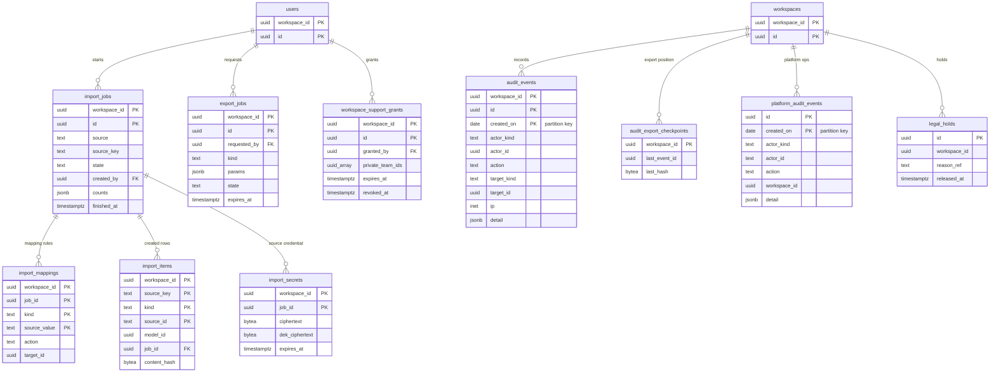

# Data model: 取り込み・書き出し・監査・保持

[data-model.md](../data-model.md) の一部。規約は、そちらの 2 節に従う。振る舞いは [import-export.md](../import-export.md)、[security.md](../security.md) の 6・8・9 節を正とする。決定は [ADR-0044](../../decisions/0044-import-pipeline-staging-and-throttled-writer-commits.md)、[ADR-0045](../../decisions/0045-export-by-permission-to-private-download.md)、[ADR-0047](../../decisions/0047-audit-log.md)、[ADR-0048](../../decisions/0048-data-lifecycle-and-workspace-deletion.md)。

| 表 | 種類 | テナント |
| --- | --- | --- |
| `import_jobs` | モデル `ImportJob`（`admin`、instant） | 内 |
| `import_mappings` | サーバーだけ | 内 |
| `import_items` | サーバーだけ | 内 |
| `import_secrets` | サーバーだけ（暗号文） | 内 |
| `export_jobs` | モデル `ExportJob`（`user`、instant） | 内 |
| `audit_events` | サーバーだけ（追記だけ） | 内 |
| `audit_export_checkpoints` | サーバーだけ | 内 |
| `platform_audit_events` | サーバーだけ（追記だけ） | **外** |
| `legal_holds` | サーバーだけ | **外** |
| `workspace_support_grants` | サーバーだけ | 内 |

## 1. ER 図

- `platform_audit_events.workspace_id` と `legal_holds.workspace_id` は RLS の外の表から中を指す。外部キーは張らない（ワークスペースを消した後も記録を残す）。
- `import_items.model_id` は、取り込みで作ったモデルの行（イシュー、コメント、ラベル、プロジェクトなど）を指す（多相）。

## 2. 取り込み

### import_jobs（`ImportJob`）

取り込みのジョブと進み（[import-export.md](../import-export.md) の 3 節）。画面は同期で届くこの行で進みを描く。

- モデル：グループ `admin`（`role:admin`）、`instant`、`delete: hard`。

| 列 | 型 | NULL | 既定 | 競合 | 説明 |
| --- | --- | --- | --- | --- | --- |
| `source` | `text` | NO | | `server_only`、`enum<jira,asana,shortcut,github,csv>` | |
| `source_key` | `text` | NO | | `server_only`、`max: 256` | 元の単位（Jira のサイト、GitHub の組織など）。同じ元の 2 回目で取り込み済みを飛ばす鍵 |
| `state` | `text` | NO | `'fetching'` | `server_only`、`enum<fetching,mapping,planned,committing,paused,done,undoing,undone,failed>` | |
| `created_by` | `uuid` | YES | | `server_only`、`ref:User`、`on_delete: nullify` | 取り込みを行う管理者（`actor`） |
| `counts` | `jsonb` | NO | `'{}'` | `server_only`、`schema: ImportCounts` | 取り出し・計画・書き込みの件数 |
| `plan_summary` | `jsonb` | YES | | `server_only`、`schema: ImportPlanSummary` | 試しの実行の組ごとの件数と誤り |
| `error` | `text` | YES | | `server_only`、`max: 1024` | 値を含めない理由 |
| `last_sync_id` | `bigint` | YES | | `server_only`、`api: internal` | ジョブの最後の書き込み。取り消しで「人が触れた行」の判定に使う |
| `started_at`・`finished_at` | `timestamptz` | YES | | `server_only` | |
| `undo_deadline` | `timestamptz` | YES | | `server_only` | `done` から 7 日 |

- 主キー：`(workspace_id, id)`。
- 部分一意：`(workspace_id) WHERE state = 'committing'`（1 ワークスペースに書いているジョブは 1 つ）。
- 索引：`(workspace_id, source, source_key)`。
- 保持：ワークスペースがある間（行は小さい）。
- S1 の規模：数千行。

### import_mappings

対応付け（DT-IMPORT-001。[import-export.md](../import-export.md) の 4 節）。

| 列 | 型 | NULL | 既定 | 説明 |
| --- | --- | --- | --- | --- |
| `workspace_id` | `uuid` | NO | | |
| `job_id` | `uuid` | NO | | |
| `kind` | `text` | NO | | `user`・`status`・`priority`・`label`・`type`・`epic`・`project_target` |
| `source_value` | `text` | NO | | 元の値（元の利用者の ID、状態の ID、元のプロジェクトなど） |
| `action` | `text` | NO | | `map`・`create`・`invite`・`skip` |
| `target_id` | `uuid` | YES | | 行き先のモデルの ID（`map` のとき） |
| `target_value` | `text` | YES | | 列挙の値（優先度など） |
| `updated_at` | `timestamptz` | NO | `now()` | |

- 主キー：`(workspace_id, job_id, kind, source_value)`。外部キー：`(workspace_id, job_id)` → `import_jobs`（`CASCADE`）。
- 保持：ジョブの終わりから 30 日（段置きと同じ）。
- S1 の規模：1 ジョブ 数百〜数千行。

### import_items

元の記録 → 作ったモデルの ID（[import-export.md](../import-export.md) の 5.3 節）。やり直しで取り込み済みを飛ばし、取り消しで消す行を引く。

| 列 | 型 | NULL | 既定 | 説明 |
| --- | --- | --- | --- | --- |
| `workspace_id` | `uuid` | NO | | |
| `source_key` | `text` | NO | | |
| `kind` | `text` | NO | | `user`・`issue`・`comment`・`label`・`status`・`project`・`attachment` |
| `source_id` | `text` | NO | | |
| `model` | `text` | NO | | 作ったモデルの名前 |
| `model_id` | `uuid` | NO | | 決定的な UUIDv7（5.3 節） |
| `job_id` | `uuid` | NO | | 最後に書いたジョブ |
| `content_hash` | `bytea` | NO | | 元の記録の SHA-256（元が変わったかの数え） |
| `created_at` | `timestamptz` | NO | `now()` | |

- 主キー：`(workspace_id, source_key, kind, source_id)`。
- 索引：`(workspace_id, job_id)`（取り消し）、`(workspace_id, model, model_id)`。
- 保持：ワークスペースがある間（次のジョブの重複の検出のため）。取り消しで消した行は消す。
- S1 の規模：取り込んだ記録の数。数千万行。

### import_secrets

元のツールの認証の暗号文（[import-export.md](../import-export.md) の 3 節）。

| 列 | 型 | NULL | 既定 | 説明 |
| --- | --- | --- | --- | --- |
| `workspace_id` | `uuid` | NO | | |
| `job_id` | `uuid` | NO | | |
| `ciphertext` | `bytea` | NO | | AES-256-GCM。AAD = `workspace_id ‖ job_id` |
| `dek_ciphertext` | `bytea` | NO | | KMS `<brand>-import-secrets` |
| `expires_at` | `timestamptz` | NO | 作成 + 7 日 | |

- 主キー：`(workspace_id, job_id)`。外部キー：→ `import_jobs`（`CASCADE`）。
- 削除：`done`・`failed`・`expires_at` のどれかで消す（ジョブの状態の変更と同じトランザクション、または 1 時間ごとのジョブ）。
- 読む主体：import-worker（`worker-egress`）だけ。
- S1 の規模：数十行。

## 3. 書き出し

### export_jobs（`ExportJob`）

書き出しのジョブ（[import-export.md](../import-export.md) の 7 節）。頼んだ本人に届く。

- モデル：グループ `user`（`from: requested_by`）、`instant`、`delete: hard`。

| 列 | 型 | NULL | 既定 | 競合 | 説明 |
| --- | --- | --- | --- | --- | --- |
| `requested_by` | `uuid` | NO | | `server_only`、`ref:User`、`on_delete: cascade` | |
| `kind` | `text` | NO | | `server_only`、`enum<csv_view,csv_team,csv_project,workspace_json>` | |
| `params` | `jsonb` | NO | | `server_only`、`schema: ExportParams` | ビューの条件、チーム、プロジェクト |
| `state` | `text` | NO | `'queued'` | `server_only`、`enum<queued,running,ready,failed,expired>` | |
| `row_count` | `bigint` | YES | | `server_only` | |
| `file_size` | `bigint` | YES | | `server_only` | |
| `s3_key` | `text` | YES | | サーバーだけの列（モデルにない） | `ws/<workspace_id>/exports/<job_id>/…` |
| `expires_at` | `timestamptz` | YES | | `server_only` | `ready` から 24 時間 |

- 主キー：`(workspace_id, id)`。索引：`(workspace_id, requested_by, created_at DESC)`。
- CHECK：`kind = 'workspace_json'` は `owner`・`admin` だけ（Writer の `can()`）。
- 監査：作成と取り出しを `audit_events` に書く。
- 保持：`expired`・`failed` の行は 30 日で消す。
- S1 の規模：数万行。

## 4. 監査

### audit_events

ワークスペースの監査（[security.md](../security.md) の 6 節、ADR-0047）。監査の対象の操作と同じ DB のトランザクションで書く（I-16）。

| 列 | 型 | NULL | 既定 | 説明 |
| --- | --- | --- | --- | --- |
| `workspace_id` | `uuid` | NO | | |
| `id` | `uuid` | NO | | UUIDv7 |
| `created_on` | `date` | NO | | パーティションの鍵 |
| `at` | `timestamptz` | NO | `now()` | |
| `actor_kind` | `text` | NO | | `user`・`api_key`・`oauth_app`・`system`・`operator` |
| `actor_id` | `uuid` | YES | | |
| `action` | `text` | NO | | `member.invite`・`member.suspend`・`team.visibility`・`admin_joined_private_team`・`api_key.create`・`export.create`・`import.undo`・`device.wipe`・`workspace.delete_request`・`auth.login_failed` など |
| `target_kind` | `text` | YES | | |
| `target_id` | `uuid` | YES | | |
| `ip` | `inet` | YES | | |
| `user_agent_hash` | `bytea` | YES | | SHA-256 |
| `detail` | `jsonb` | NO | `'{}'` | ID と変わったフィールドの名前だけ。タイトル・本文を入れない |

- 主キー：`(workspace_id, id, created_on)`。
- 索引：`(workspace_id, at)`（log-archive への写し、後の監査ログの画面）。
- 追記だけ：`writer`・`auth` に `INSERT` だけを与える。`UPDATE`・`DELETE` はトリガーでも拒否する。
- パーティション：`RANGE (created_on)`、1 日。DB に 1 年（`DROP`）、log-archive に 3 年。
- 書く主体：Writer（モデルの操作と同じトランザクション）、認証のサービス（`auth.*` の種類）、Public API（キー・アプリの操作）、Worker（書き出しの取り出し）。
- S1 の規模：1 日 数十万行（ログインの失敗を含む）。

### audit_export_checkpoints

log-archive への 1 時間ごとの写しの位置と、ハッシュの連鎖の最後の値。

> 2026-09-28、この文書で足した。[security.md](../security.md) の 6 節の「ワークスペースごとのハッシュの連鎖」を続けるには、前の写しの最後のハッシュを持つ場所が要る。

| 列 | 型 | NULL | 既定 | 説明 |
| --- | --- | --- | --- | --- |
| `workspace_id` | `uuid` | NO | | |
| `last_event_id` | `uuid` | YES | | 写した最後の `audit_events.id` |
| `last_hash` | `bytea` | YES | | その行までの連鎖の SHA-256 |
| `exported_at` | `timestamptz` | NO | `now()` | |

- 主キー：`(workspace_id)`。
- 書く主体：監査の写しの Worker（ワークスペースごとにコンテキストを設定して読む）。
- S1 の規模：5,000 行。

### platform_audit_events

プラットフォームの監査（運用者のアクセス、サポートの参照、`sync_epoch` の引き上げ、DR のやり直し、PITR、リーガルホールド、break-glass、ワークスペースの削除の完了）。

| 列 | 型 | NULL | 既定 | 説明 |
| --- | --- | --- | --- | --- |
| `id` | `uuid` | NO | | UUIDv7 |
| `created_on` | `date` | NO | | パーティションの鍵 |
| `at` | `timestamptz` | NO | `now()` | |
| `actor_kind` | `text` | NO | | `operator`・`system`・`workflow` |
| `actor_id` | `text` | NO | | 運用者の ID（IAM のロールの名前など）か、ジョブの名前 |
| `action` | `text` | NO | | `sync_epoch.bump`・`dr.narrowing_replay`・`support.read`・`legal_hold.set` など |
| `workspace_id` | `uuid` | YES | | 対象のワークスペース（全体の操作は NULL） |
| `approval_ref` | `text` | YES | | 承認の記録（2 人の承認の場合） |
| `detail` | `jsonb` | NO | `'{}'` | ID と件数だけ |

- 主キー：`(id, created_on)`。索引：`(workspace_id, at)`。
- テナント：RLS の外（[data-model.md](../data-model.md) の 5 節）。追記だけ（各サービスは `INSERT` だけ）。読めるのは `platform` と監査のロール。
- パーティション：`RANGE (created_on)`、1 か月。DB に 1 年、log-archive に 5 年。
- S1 の規模：1 日 数百行。

### legal_holds

リーガルホールド。保持の期限とワークスペースの削除に優先する（[security.md](../security.md) の 9 節）。

| 列 | 型 | NULL | 既定 | 説明 |
| --- | --- | --- | --- | --- |
| `id` | `uuid` | NO | | |
| `workspace_id` | `uuid` | NO | | |
| `reason_ref` | `text` | NO | | 法務の案件の参照（中身は書かない） |
| `scope` | `text` | NO | `'workspace'` | S1 はワークスペースの全体だけ |
| `created_by` | `text` | NO | | 運用者の ID |
| `created_at` | `timestamptz` | NO | `now()` | |
| `released_at` | `timestamptz` | YES | | |

- 主キー：`(id)`。索引：`(workspace_id) WHERE released_at IS NULL`（保持のジョブと削除のジョブが、止めるワークスペースを引く）。
- テナント：RLS の外。読み書きは `platform`（法務の指示）。変更は `platform_audit_events` に残す。
- S1 の規模：数件。

### workspace_support_grants

サポートの参照の許し（[security.md](../security.md) の 8 節）。オーナーが期限つき（最長 7 日）で出す。

| 列 | 型 | NULL | 既定 | 説明 |
| --- | --- | --- | --- | --- |
| `workspace_id` | `uuid` | NO | | |
| `id` | `uuid` | NO | | |
| `granted_by` | `uuid` | NO | | オーナーの `User` |
| `private_team_ids` | `uuid[]` | NO | `'{}'` | 許しの中で明示した非公開のチーム |
| `reason` | `text` | NO | | 問い合わせの番号など |
| `expires_at` | `timestamptz` | NO | | 最長 7 日 |
| `revoked_at` | `timestamptz` | YES | | |
| `created_at` | `timestamptz` | NO | `now()` | |

- 主キー：`(workspace_id, id)`。索引：`(workspace_id, expires_at) WHERE revoked_at IS NULL`。
- CHECK：`expires_at <= created_at + interval '7 days'`。
- 使い方：サポートの読み取りの専用のロールは、有効な許しがあるときだけ、そのワークスペースのコンテキストを設定できる（許しの確かめは `platform` の関数で行い、参照を両方の監査に書く）。
- 保持：期限の後 1 年（監査と揃える）。
- S1 の規模：数百行。
