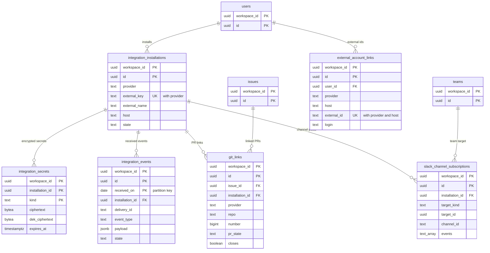
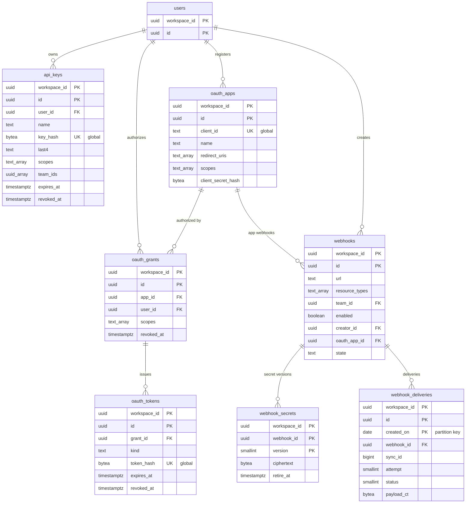

# Data model: 連携・公開 API・Webhook

[data-model.md](../data-model.md) の一部。規約は、そちらの 2 節に従う。振る舞いは [integrations.md](../integrations.md)、[api-and-webhooks.md](../api-and-webhooks.md) を正とする。決定は [ADR-0038](../../decisions/0038-git-hosting-linking-and-state-automation.md)〜[ADR-0043](../../decisions/0043-signed-webhooks-from-sync-log.md)。

すべてワークスペースの表（`workspace_id`、複合キー、FORCE RLS）。秘密とハッシュはサーバーだけの表に置き、モデルに置かない（モデルに置くと端末の IndexedDB に残る。ADR-0040）。

| 表 | 種類 | グループ | 読み込み |
| --- | --- | --- | --- |
| `integration_installations` | モデル `IntegrationInstallation` | `admin` | instant |
| `integration_secrets` | サーバーだけ（暗号文） | — | — |
| `integration_events` | サーバーだけ | — | — |
| `git_links` | モデル `GitLink` | `via`（`issue_id`） | lazy |
| `external_account_links` | モデル `ExternalAccountLink` | `user` | instant |
| `slack_channel_subscriptions` | モデル `SlackChannelSubscription` | `admin` | instant |
| `webhooks` | モデル `Webhook` | `admin` | instant |
| `webhook_secrets` | サーバーだけ（暗号文） | — | — |
| `webhook_deliveries` | サーバーだけ | — | — |
| `api_keys` | サーバーだけ（ハッシュ） | — | — |
| `oauth_apps` | サーバーだけ（ハッシュ） | — | — |
| `oauth_grants` | サーバーだけ | — | — |
| `oauth_tokens` | サーバーだけ（ハッシュ） | — | — |

## 1. ER 図

### 1.1 GitHub・GitLab・Slack

- `slack_channel_subscriptions.target_id` は `target_kind` で `teams` か `projects` を指す（多相）。

### 1.2 公開 API と Webhook

## 2. 連携

### integration_installations（`IntegrationInstallation`）

GitHub の組織、GitLab のグループ・ホスト、Slack のワークスペースとのつながり（[integrations.md](../integrations.md) の 4.1・5.1 節）。秘密も、秘密のハッシュも持たない。

- モデル：グループ `admin`（`role:admin`）、`instant`、`delete: hard`。

| 列 | 型 | NULL | 既定 | 競合 | 説明 |
| --- | --- | --- | --- | --- | --- |
| `provider` | `text` | NO | | `server_only`、`enum<github,gitlab,slack>` | |
| `external_key` | `text` | NO | | `server_only`、`max: 256`、`api: internal` | 受け口が引く鍵：GitHub は `installation_id`、GitLab はインストールの ID（Webhook の URL に入れる）、Slack は `team_id` |
| `external_name` | `text` | NO | | `server_only`、`max: 256` | 組織・グループ・Slack のワークスペースの名前 |
| `host` | `text` | YES | | `server_only`、`max: 256` | GitLab のホスト（`https://gitlab.com` か自前） |
| `repo_count` | `integer` | YES | | `server_only` | GitHub の選んだリポジトリの数 |
| `state` | `text` | NO | `'active'` | `server_only`、`enum<active,needs_reauth,revoked>` | |
| `installed_by` | `uuid` | YES | | `server_only`、`ref:User`、`on_delete: nullify` | |
| `secret_hint` | `text` | YES | | `server_only`、`max: 8` | GitLab のトークンの末尾 4 文字 |

- 主キー：`(workspace_id, id)`。一意：`(workspace_id, provider, external_key)`。
- 索引：`(provider, external_key)`（ワークスペースをまたぐ。受け口の関数 `resolve_integration_target` が使う。[data-model.md](../data-model.md) の 5 節）。1 つの GitHub の組織を複数のワークスペースにつなげるので一意にしない。
- 作る・消す：DT-PERM-002（`owner`・`admin`）。削除は `narrowing_outbox` に書く（`credential_revoke`）。
- S1 の規模：約 5,000 行。

### integration_secrets

連携の秘密の暗号文（[integrations.md](../integrations.md) の 6.1 節）。読めるのは DB のロール `integrations` だけ。

| 列 | 型 | NULL | 既定 | 説明 |
| --- | --- | --- | --- | --- |
| `workspace_id` | `uuid` | NO | | |
| `installation_id` | `uuid` | NO | | |
| `kind` | `text` | NO | | `slack_bot`・`slack_refresh`・`gitlab_token`・`gitlab_hook_key` |
| `ciphertext` | `bytea` | NO | | AES-256-GCM。AAD = `workspace_id ‖ installation_id ‖ kind` |
| `dek_ciphertext` | `bytea` | NO | | KMS `<brand>-integration-secrets` で包んだ DEK |
| `expires_at` | `timestamptz` | YES | | Slack のアクセストークンの期限 |
| `rotated_at` | `timestamptz` | NO | `now()` | |

- 主キー：`(workspace_id, installation_id, kind)`。外部キー：`(workspace_id, installation_id)` → `integration_installations`（`ON DELETE CASCADE`）。
- CHECK：`kind` の値。
- 更新：Slack のリフレッシュは、インストールの行の `SELECT … FOR UPDATE` の中で 1 つの Worker だけが行う。
- 削除：インストールの削除・`revoked` で消す。
- S1 の規模：約 5,000 行。

### integration_events

受けた事象。GitHub は自動で再送しないので、取りこぼしの唯一の備え（[integrations.md](../integrations.md) の 3・7 節）。

| 列 | 型 | NULL | 既定 | 説明 |
| --- | --- | --- | --- | --- |
| `workspace_id` | `uuid` | NO | | |
| `id` | `uuid` | NO | | UUIDv7 |
| `received_on` | `date` | NO | | パーティションの鍵 |
| `installation_id` | `uuid` | NO | | |
| `provider` | `text` | NO | | |
| `delivery_id` | `text` | NO | | 外部の配送 ID（GitHub の `X-GitHub-Delivery`、Slack の `event_id`・`trigger_id`、GitLab の `X-Gitlab-Event-UUID`） |
| `event_type` | `text` | NO | | `pull_request`・`merge_request`・`message_action`・`link_shared` など |
| `payload` | `jsonb` | NO | | 受けた本文（PR のタイトル・本文を含む。`pii: content`） |
| `state` | `text` | NO | `'received'` | `received`・`processed`・`ignored`・`failed` |
| `processed_at` | `timestamptz` | YES | | |
| `received_at` | `timestamptz` | NO | `now()` | |

- 主キー：`(workspace_id, id, received_on)`。
- 重複の捨て方：`(workspace_id, provider, delivery_id)` の索引を各パーティションに張り、受け口は保存の前に引く（全部のパーティションを引く。受ける数は 1 秒 50 件ほど）。競合で同じ事象が 2 行になっても、Worker の `client_tx_id` を `UUIDv5(provider ‖ delivery_id ‖ workspace_id)` にするので、Writer で 1 回だけ効く（I-4）。
- 索引：上の索引、`(workspace_id, state, received_at) WHERE state = 'received'`（取りこぼしの拾い直し）。
- パーティション：`RANGE (received_on)`、1 日。保持 30 日（`DROP`）。
- S1 の規模：1 日 約 400 万行（1 秒 50 件）。

### git_links（`GitLink`）

PR・MR とイシューの結び付け（[integrations.md](../integrations.md) の 4.3 節）。連携の Worker だけが書く。

- モデル：グループ `via`（`from: issue_id`）、`lazy`、`delete: hard`。

| 列 | 型 | NULL | 既定 | 競合 | 説明 |
| --- | --- | --- | --- | --- | --- |
| `issue_id` | `uuid` | NO | | `server_only`、`ref:Issue`、`on_delete: cascade`、`index` | |
| `installation_id` | `uuid` | NO | | `server_only`、`ref:IntegrationInstallation`、`on_delete: cascade`、`api: internal` | |
| `provider` | `text` | NO | | `server_only`、`enum<github,gitlab>` | |
| `kind` | `text` | NO | | `server_only`、`enum<pull_request,merge_request>` | |
| `repo` | `text` | NO | | `server_only`、`max: 256` | `owner/name` |
| `number` | `bigint` | NO | | `server_only` | |
| `url` | `text` | NO | | `server_only`、`max: 1024` | |
| `title` | `text` | NO | | `server_only`、`max: 512`、`pii: content` | |
| `branch` | `text` | NO | | `server_only`、`max: 256`、`pii: content` | |
| `pr_state` | `text` | NO | | `server_only`、`enum<draft,open,review_requested,merged,closed>` | |
| `closes` | `boolean` | NO | | `server_only` | 閉じる結び付けか |
| `author_user_id` | `uuid` | YES | | `server_only`、`ref:User`、`on_delete: nullify` | |
| `author_login` | `text` | NO | | `server_only`、`max: 128`、`pii: identity` | |

- 主キー：`(workspace_id, id)`。一意：`(workspace_id, issue_id, provider, repo, number)`。
- 索引：`(workspace_id, installation_id, repo, number)`（PR の事象から結び付けを引く）、`(workspace_id, pr_state) WHERE pr_state IN ('draft','open','review_requested')`（1 時間ごとの読み直し）。
- S1 の規模：約 500 万行。

### external_account_links（`ExternalAccountLink`）

利用者の外部のアカウント（[integrations.md](../integrations.md) の 4.6 節）。トークンは持たない。

- モデル：グループ `user`（`from: user_id`）、`instant`、`delete: hard`。

| 列 | 型 | NULL | 既定 | 競合 | 説明 |
| --- | --- | --- | --- | --- | --- |
| `user_id` | `uuid` | NO | | `server_only`、`ref:User`、`on_delete: cascade`、`index` | |
| `provider` | `text` | NO | | `server_only`、`enum<github,gitlab,slack>` | |
| `host` | `text` | NO | | `server_only`、`max: 256` | `github.com`・`gitlab.com`・Slack の `team_id` |
| `external_id` | `text` | NO | | `server_only`、`max: 128` | |
| `login` | `text` | NO | | `server_only`、`max: 128`、`pii: identity` | |

- 主キー：`(workspace_id, id)`。
- 一意：`(workspace_id, provider, host, external_id)`（1 つの外部の ID は 1 人の `User` にだけ）、`(workspace_id, user_id, provider, host)`。
- 索引：上の一意の索引（Slack の利用者 → `User`、PR の作者 → `User`）。
- S1 の規模：約 10 万行。

### slack_channel_subscriptions（`SlackChannelSubscription`）

チャンネルへの通知の購読（[integrations.md](../integrations.md) の 5.3 節）。公開のチームと、公開のチームだけにつながるプロジェクトに限る。

- モデル：グループ `admin`（`role:admin`）、`instant`、`delete: hard`。

| 列 | 型 | NULL | 既定 | 競合 | 説明 |
| --- | --- | --- | --- | --- | --- |
| `installation_id` | `uuid` | NO | | `server_only`、`ref:IntegrationInstallation`、`on_delete: cascade` | |
| `target_kind` | `text` | NO | | `server_only`、`enum<team,project>` | |
| `target_id` | `uuid` | NO | | `server_only`、`index` | |
| `channel_id` | `text` | NO | | `server_only`、`max: 32` | Slack のチャンネルの ID |
| `channel_name` | `text` | NO | | `lww`、`max: 80` | 表示のための写し |
| `events` | `text[]` | NO | | `set`、`set<string>`、`max: 8` | `issue_created`・`state_changed`・`comment`・`project_update` |
| `state` | `text` | NO | `'active'` | `server_only`、`enum<active,paused_private>` | 非公開のチームがつながったら止める |
| `created_by` | `uuid` | YES | | `server_only`、`ref:User`、`on_delete: nullify` | |

- 主キー：`(workspace_id, id)`。一意：`(workspace_id, target_kind, target_id, channel_id)`。
- 索引：`(workspace_id, target_kind, target_id) WHERE state = 'active'`（`integrations-out` の送りで引く）。
- S1 の規模：約 2 万行。

## 3. Webhook

### webhooks（`Webhook`）

（[api-and-webhooks.md](../api-and-webhooks.md) の 5.1 節）

- モデル：グループ `admin`（`role:admin`）、`instant`、`delete: hard`。

| 列 | 型 | NULL | 既定 | 競合 | 説明 |
| --- | --- | --- | --- | --- | --- |
| `url` | `text` | NO | | `lww`、`max: 2048` | `https` だけ。画面では問い合わせの部分を伏せる |
| `label` | `text` | NO | | `lww`、`max: 128` | |
| `resource_types` | `text[]` | NO | | `set`、`set<string>`、`max: 20` | |
| `team_id` | `uuid` | YES | | `lww`、`ref:Team`、`on_delete: cascade` | NULL は全部の公開のチーム |
| `enabled` | `boolean` | NO | `true` | `lww` | |
| `include_import` | `boolean` | NO | `false` | `lww` | |
| `creator_id` | `uuid` | YES | | `server_only`、`ref:User`、`on_delete: nullify` | `can(creator, read, row)` の主体 |
| `oauth_app_id` | `uuid` | YES | | `server_only`、`api: internal` | `oauth_apps.id` |
| `state` | `text` | NO | `'active'` | `server_only`、`enum<active,paused_failing,paused_permission>` | |
| `secret_hint` | `text` | NO | | `server_only`、`max: 8` | 末尾 4 文字 |

- 主キー：`(workspace_id, id)`。
- 外部キー：`(workspace_id, oauth_app_id)` → `oauth_apps`（`ON DELETE CASCADE`。アプリの削除で消える）。
- 索引：`(workspace_id) WHERE enabled AND state = 'active'`（Relay の 60 秒の写しと、振り分けの Worker）。
- S1 の規模：約 1 万行。

### webhook_secrets

Webhook の署名の秘密（`<brand>_whsec_…`）の暗号文。入れ替えの間は 2 つ。

| 列 | 型 | NULL | 既定 | 説明 |
| --- | --- | --- | --- | --- |
| `workspace_id` | `uuid` | NO | | |
| `webhook_id` | `uuid` | NO | | |
| `version` | `smallint` | NO | | 1 から増やす |
| `ciphertext` | `bytea` | NO | | AES-256-GCM。AAD = `workspace_id ‖ webhook_id ‖ version` |
| `dek_ciphertext` | `bytea` | NO | | KMS `<brand>-webhook-secrets` |
| `retire_at` | `timestamptz` | YES | | 新しい版を作った時、古い版に 24 時間後を入れる |
| `created_at` | `timestamptz` | NO | `now()` | |

- 主キー：`(workspace_id, webhook_id, version)`。外部キー：`(workspace_id, webhook_id)` → `webhooks`（`ON DELETE CASCADE`）。
- 読む主体：送り係（`worker`）。`retire_at` が過ぎた行はジョブが消す。
- S1 の規模：約 1 万行。

### webhook_deliveries

送りの記録（[api-and-webhooks.md](../api-and-webhooks.md) の 5.7 節）。

| 列 | 型 | NULL | 既定 | 説明 |
| --- | --- | --- | --- | --- |
| `workspace_id` | `uuid` | NO | | |
| `id` | `uuid` | NO | | `<Brand>-Delivery`。再試行でも同じ |
| `created_on` | `date` | NO | | パーティションの鍵 |
| `webhook_id` | `uuid` | NO | | |
| `sync_id` | `bigint` | NO | | |
| `resource_type` | `text` | NO | | |
| `action` | `text` | NO | | `create`・`update`・`remove` |
| `attempt` | `smallint` | NO | `1` | |
| `status` | `smallint` | NO | `0` | `0` 予定、`1` 成功、`2` 失敗（再試行あり）、`3` あきらめた、`4` 権限で落とした |
| `http_status` | `smallint` | YES | | |
| `latency_ms` | `integer` | YES | | |
| `next_attempt_at` | `timestamptz` | YES | | 再試行の時刻 |
| `payload_ct` | `bytea` | YES | | 本文の暗号文。72 時間で NULL にする |

- 主キー：`(workspace_id, id, created_on)`。
- 一意：`(workspace_id, webhook_id, sync_id, created_on)`（振り分けの Worker の再配送で予定を 2 つ作らない。同じ変更の予定は同じ日に作るので、日をまたぐ再配送は `sync_id` の `committed_at` の日を `created_on` にして揃える。I-15 と同じ考え方）。
- 索引：`(workspace_id, webhook_id, created_on DESC)`（管理者の画面の直近の送り）、`(next_attempt_at) WHERE status = 2`（再試行）。
- CHECK：`status BETWEEN 0 AND 4`、`action` の値。
- パーティション：`RANGE (created_on)`、1 日。保持 14 日（`DROP`）。`payload_ct` は 72 時間で消す（1 時間ごとのジョブ）。
- S1 の規模：1 日 約 4,000 万行（1 秒 500 件）。14 日で約 6 億行。

> `created_on` は、元の変更の `sync_actions.committed_at` の日にする（この文書で決めた。[data-model.md](../data-model.md) の 7 節）。

## 4. API キーと OAuth

### api_keys

API キー（[api-and-webhooks.md](../api-and-webhooks.md) の 6.2 節）。管理の一覧は API で返す（同期しない）。

| 列 | 型 | NULL | 既定 | 説明 |
| --- | --- | --- | --- | --- |
| `workspace_id` | `uuid` | NO | | |
| `id` | `uuid` | NO | | UUIDv7 |
| `user_id` | `uuid` | NO | | 持ち主の `User` |
| `name` | `text` | NO | | 128 文字まで |
| `key_hash` | `bytea` | NO | | `<brand>_api_…` の SHA-256 |
| `last4` | `text` | NO | | 末尾 4 文字 |
| `scopes` | `text[]` | NO | | `read`・`write`・`issues:create`・`comments:create`・`admin` |
| `team_ids` | `uuid[]` | YES | | チームの絞り。NULL は絞らない |
| `expires_at` | `timestamptz` | NO | 作成 + 1 年 | 最大 1 年 |
| `last_used_at` | `timestamptz` | YES | | 1 時間に 1 回だけ書く |
| `revoked_at` | `timestamptz` | YES | | |
| `created_at` | `timestamptz` | NO | `now()` | |

- 主キー：`(workspace_id, id)`。一意：`(key_hash)`（全体。関数 `resolve_api_credential` で引く）。
- 外部キー：`(workspace_id, user_id)` → `users`。
- 索引：`(workspace_id, user_id)`、`(expires_at) WHERE revoked_at IS NULL`（7 日前の知らせ）。
- CHECK：`expires_at <= created_at + interval '366 days'`、`scopes <@ '{read,write,issues:create,comments:create,admin}'`。
- 削除：持ち主の除外で行を消す。取り消しは `revoked_at` と `narrowing_outbox`（`credential_revoke`）。取り消した行は 90 日で消す。
- S1 の規模：約 5 万行。

### oauth_apps

ワークスペースに属する OAuth のアプリ（[api-and-webhooks.md](../api-and-webhooks.md) の 6.3 節）。

| 列 | 型 | NULL | 既定 | 説明 |
| --- | --- | --- | --- | --- |
| `workspace_id` | `uuid` | NO | | |
| `id` | `uuid` | NO | | |
| `client_id` | `text` | NO | | 公開の ID（乱数） |
| `name` | `text` | NO | | |
| `redirect_uris` | `text[]` | NO | | 完全一致。`https`、開発用の `http://localhost` |
| `scopes` | `text[]` | NO | | 求められる範囲の上限 |
| `client_secret_hash` | `bytea` | NO | | `<brand>_ocs_…` の SHA-256 |
| `created_by` | `uuid` | NO | | |
| `created_at` | `timestamptz` | NO | `now()` | |
| `deleted_at` | `timestamptz` | YES | | 削除（`credential_revoke`）。全トークンを取り消す |

- 主キー：`(workspace_id, id)`。一意：`(client_id)`（全体。関数 `oauth_app_public` で引く）。
- 削除：`deleted_at` の後 30 日で行を消す（グラントとトークンも `CASCADE`）。
- S1 の規模：数千行。

### oauth_grants

利用者がアプリに与えた認可。リフレッシュトークンの一式（family）の単位。

| 列 | 型 | NULL | 既定 | 説明 |
| --- | --- | --- | --- | --- |
| `workspace_id` | `uuid` | NO | | |
| `id` | `uuid` | NO | | 一式の ID |
| `app_id` | `uuid` | NO | | |
| `user_id` | `uuid` | NO | | 認可した `User` |
| `scopes` | `text[]` | NO | | |
| `created_at` | `timestamptz` | NO | `now()` | |
| `last_refreshed_at` | `timestamptz` | YES | | 90 日の不使用の判定 |
| `revoked_at` | `timestamptz` | YES | | 利用者・管理者の取り消し、再利用の検出 |

- 主キー：`(workspace_id, id)`。外部キー：`app_id` → `oauth_apps`（`CASCADE`）、`user_id` → `users`。
- 索引：`(workspace_id, user_id)`（設定の「認可したアプリ」）、`(workspace_id, app_id)`。
- 認可のコード（60 秒・1 回限り）は Valkey に置く（[stores.md](stores.md) の 1 節）。表に置かない。
- S1 の規模：約 5 万行。

### oauth_tokens

アクセストークンとリフレッシュトークンのハッシュ。

| 列 | 型 | NULL | 既定 | 説明 |
| --- | --- | --- | --- | --- |
| `workspace_id` | `uuid` | NO | | |
| `id` | `uuid` | NO | | |
| `grant_id` | `uuid` | NO | | 一式 |
| `kind` | `text` | NO | | `access`（24 時間）・`refresh`（90 日の不使用で切れる） |
| `token_hash` | `bytea` | NO | | SHA-256 |
| `expires_at` | `timestamptz` | NO | | |
| `used_at` | `timestamptz` | YES | | `refresh` を使った時刻（入れ替えの後の再利用の検出） |
| `revoked_at` | `timestamptz` | YES | | |
| `created_at` | `timestamptz` | NO | `now()` | |

- 主キー：`(workspace_id, id)`。一意：`(token_hash)`（全体。関数 `resolve_api_credential`）。
- 外部キー：`(workspace_id, grant_id)` → `oauth_grants`（`CASCADE`）。
- 再利用の検出：`used_at` のある `refresh` が再び出されたら、その `grant_id` の全部を取り消す（`revoked_at`）。
- 索引：`(workspace_id, grant_id)`、`(expires_at)`（期限の切れた行の削除。切れてから 7 日で消す）。
- S1 の規模：約 20 万行。
