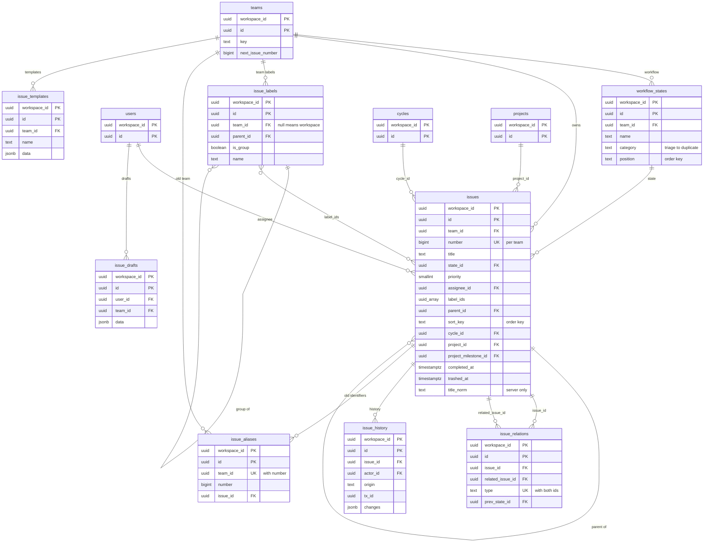
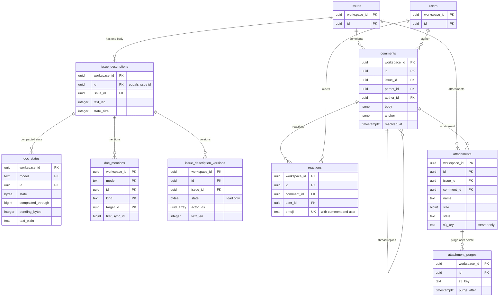

# Data model: イシュー・本文・コメント・添付

[data-model.md](../data-model.md) の一部。規約は、そちらの 2 節に従う。振る舞いは [issues-and-workflow.md](../issues-and-workflow.md)、[editor-and-descriptions.md](../editor-and-descriptions.md)、[data-model-and-schema.md](../data-model-and-schema.md) の 3.1・5 節、[cycles-and-projects.md](../cycles-and-projects.md) の 3.4 節を正とする。決定は [ADR-0020](../../decisions/0020-ids-and-human-identifiers.md)〜[ADR-0025](../../decisions/0025-derived-changes-in-writer.md)。

すべてワークスペースの表（`workspace_id`、複合キー、FORCE RLS）。

| 表 | 種類 | グループ | 読み込み |
| --- | --- | --- | --- |
| `workflow_states` | モデル `WorkflowState` | `team` | instant |
| `issues` | モデル `Issue` | `team` | partial（`issue_active_30d`） |
| `issue_labels` | モデル `IssueLabel` | `team_or_workspace` | instant |
| `issue_relations` | モデル `IssueRelation` | `via`（両方のイシュー） | lazy |
| `issue_history` | モデル `IssueHistory` | `via` | lazy |
| `issue_aliases` | モデル `IssueAlias` | `via` | lazy |
| `issue_templates` | モデル `IssueTemplate` | `team_or_workspace` | instant |
| `issue_drafts` | モデル `IssueDraft` | `user` | lazy |
| `issue_descriptions` | モデル `IssueDescription` | `via` | lazy |
| `issue_description_versions` | モデル `IssueDescriptionVersion` | `via` | lazy |
| `doc_states` | サーバーだけ | — | — |
| `doc_mentions` | サーバーだけ | — | — |
| `comments` | モデル `Comment` | `via` | lazy |
| `reactions` | モデル `Reaction` | `via`（2 段） | lazy |
| `attachments` | モデル `Attachment` | `via` | lazy |
| `attachment_purges` | サーバーだけ | — | — |

## 1. ER 図

### 1.1 イシューとワークフロー

- `issue_labels }o--o{ issues` は `issues.label_ids`（`uuid[]`）の集合で、結び付けの表を持たない（ADR-0008 の集合の競合の規則を 1 つのフィールドで当てるため）。

### 1.2 本文・コメント・添付

- `doc_states`・`doc_mentions` は `(model, id)` で本文の行を指す。`model` は `IssueDescription` か `ProjectDescription`（[planning.md](planning.md)）。外部キーは張らない（2 つのモデルを指すため）。本文の行の削除の派生で Writer が一緒に消す。
- `attachment_purges` は、消した添付の S3 の鍵を 30 日持つ台帳。添付の行は消えているので、線は論理のつながり。

## 2. ワークフローとイシュー

### workflow_states（`WorkflowState`）

チームの状態（[issues-and-workflow.md](../issues-and-workflow.md) の 3.2・4 節）。

- モデル：グループ `team`（`from: team_id`）、`instant`、`archivable`、`delete: hard`。

| 列 | 型 | NULL | 既定 | 競合 | 説明 |
| --- | --- | --- | --- | --- | --- |
| `team_id` | `uuid` | NO | | `lww`、`ref:Team`、`on_delete: cascade` | 変えない（別のチームの状態にしない） |
| `name` | `text` | NO | | `lww`、`max: 64` | |
| `category` | `text` | NO | | `server_only`、`enum<triage,backlog,unstarted,started,completed,canceled,duplicate>` | 作成の値だけ |
| `color` | `text` | NO | | `lww`、`max: 16` | |
| `position` | `text` | NO | | `order`、`order_scope: [team_id, category]` | 並びの鍵 |

- 主キー：`(workspace_id, id)`。外部キー：`(workspace_id, team_id)` → `teams`。
- 索引：`(workspace_id, team_id, category, position)`（表示の順、最低の数の確かめ、「同じ種類の最初の状態」）。
- CHECK：`category` の値。
- 最低の数（I-11）：`backlog`・`unstarted`・`started`・`completed`・`canceled` は各 1 以上、`duplicate` はちょうど 1、`triage` は `triage_enabled` の間ちょうど 1。1 チーム 50 まで。Writer がロックの中で確かめる。
- 削除：イシューが残っている状態は消せない（`restrict`）。Worker が移してから消す（4.4 節）。
- S1 の規模：約 25 万行（チームあたり 8）。

### issues（`Issue`）

イシュー。行の多い唯一の `partial` のモデル。

- モデル：グループ `team`（`from: team_id`）、`partial`（`issue_active_30d`）、`archivable`、`delete: trash`（30 日）、`include`：`IssueDescription:id`、`Comment:issue_id`、`IssueHistory:issue_id`、`Attachment:issue_id`、`IssueRelation:issue_id`、`IssueRelation:related_issue_id`、`IssueAlias:issue_id`、`GitLink:issue_id`。
- `history`：`title`・`state_id`・`priority`・`assignee_id`・`estimate`・`label_ids`・`parent_id`・`cycle_id`・`project_id`・`project_milestone_id`・`due_date`・`team_id`。`track_overwrites`：`title`・`state_id`・`priority`・`assignee_id`・`estimate`・`due_date`・`cycle_id`・`project_id`・`project_milestone_id`・`parent_id`（`field_sync_ids` を使う）。
- `derive`：状態の時刻（DT-ISSUE-001）、親子の自動で閉じる、重複、移動、購読者、進捗（`progressDelta`）、本文の行の作成。

| 列 | 型 | NULL | 既定 | 競合 | 説明 |
| --- | --- | --- | --- | --- | --- |
| `team_id` | `uuid` | NO | | `lww`、`ref:Team`、`on_delete: restrict`、`index`、`m2` | 変えると移動（番号を振り直す） |
| `number` | `bigint` | NO | | `server_only`、`m2` | チームの中の番号。Writer が `teams.next_issue_number` から振る |
| `title` | `text` | NO | | `lww`、`max: 512`、`search`、`pii: content`、`m2` | |
| `title_norm` | `text` | NO | | サーバーだけの列（モデルにない） | `normalizeForSearch(title)`。`title contains` の SQL（[views-and-filters.md](../views-and-filters.md) の 4.2 節） |
| `state_id` | `uuid` | NO | | `lww`、`ref:WorkflowState`、`on_delete: restrict`、`m2` | 同じチームの状態だけ |
| `priority` | `smallint` | NO | `0` | `lww`、`enum<0,1,2,3,4>`、`m2` | 0 なし、1 Urgent … 4 Low |
| `assignee_id` | `uuid` | YES | | `lww`、`ref:User`、`on_delete: nullify`、`index`、`m2` | |
| `label_ids` | `uuid[]` | NO | `'{}'` | `set`、`set<ref:IssueLabel>`、`max: 100`、`on_delete: remove`、`m2` | |
| `subscriber_ids` | `uuid[]` | NO | `'{}'` | `set`、`set<ref:User>`、`max: 500`、`on_delete: remove` | |
| `parent_id` | `uuid` | YES | | `lww`、`ref:Issue`、`on_delete: nullify`、`index`、`m2` | 深さ 10、子 1,000 |
| `sort_key` | `text` | NO | | `order`、`order_scope: [team_id]`、`m2` | `COLLATE "C"` |
| `sub_sort_key` | `text` | YES | | `order`、`order_scope: [parent_id]` | 同上 |
| `estimate` | `integer` | YES | | `lww`、`range: [0, 1000]`、`m2` | |
| `due_date` | `date` | YES | | `lww`、`m2` | |
| `cycle_id` | `uuid` | YES | | `lww`、`ref:Cycle`、`on_delete: nullify`、`m2` | 同じチームのサイクルだけ |
| `project_id` | `uuid` | YES | | `lww`、`ref:Project`、`on_delete: nullify`、`m2` | DT-PROJ-001 |
| `project_milestone_id` | `uuid` | YES | | `lww`、`ref:ProjectMilestone`、`on_delete: nullify`、`m2` | `project_id` のマイルストーンだけ |
| `creator_id` | `uuid` | YES | | `server_only`、`ref:User`、`on_delete: nullify`、`import_writable` | |
| `started_at`・`triaged_at` | `timestamptz` | YES | | `server_only` | 派生 |
| `completed_at`・`canceled_at` | `timestamptz` | YES | | `server_only`、`import_writable`、`m2`（`completed_at`） | 派生。`import` は操作の値 |
| `activity_at` | `timestamptz` | NO | 作成の時刻 | `server_only` | 変更とコメントで進む |
| `triage_snoozed_until` | `timestamptz` | YES | | `lww` | |
| `trashed_at` | `timestamptz` | YES | | `lww` | ゴミ箱 |

- 主キー：`(workspace_id, id)`。一意：`(workspace_id, team_id, number)`（I-6）。
- 外部キー：`(workspace_id, team_id)` → `teams`、`state_id` → `workflow_states`、`assignee_id`・`creator_id` → `users`、`parent_id` → `issues`、`cycle_id` → `cycles`、`project_id` → `projects`、`project_milestone_id` → `project_milestones`。`on_delete` は Writer が当て、DB は `NO ACTION`（2.6 節）。
- 索引：
  - `(workspace_id, team_id, sort_key)`：チームの手動の並び、並びの鍵の重なりの確かめ、`Issue:team_id=…` の読み込み。
  - `(workspace_id, team_id, state_id)`：部分のブートストラップ（`issue_active_30d` の SQL は状態の種類と `completed_at`・`canceled_at` で絞る）、状態の削除の移し。
  - `(workspace_id, assignee_id) WHERE assignee_id IS NOT NULL`：自分のイシュー、非公開への切り替えで担当を外す。
  - `(workspace_id, parent_id, sub_sort_key) WHERE parent_id IS NOT NULL`：子の一覧、親子の自動で閉じる。
  - `(workspace_id, cycle_id) WHERE cycle_id IS NOT NULL`：繰り越し、進捗の数え直し。
  - `(workspace_id, project_id) WHERE project_id IS NOT NULL`：プロジェクトのイシュー、進捗。
  - `(workspace_id, team_id, activity_at) WHERE archived_at IS NULL AND trashed_at IS NULL`：自動で閉じる・アーカイブのジョブ。
  - `(workspace_id, trashed_at) WHERE trashed_at IS NOT NULL`：ゴミ箱の消去。
  - `label_ids` の GIN と `title_norm` の索引は張らない。ビューの問い合わせは、チームと状態の索引で絞った後に走査する（[views-and-filters.md](../views-and-filters.md) の 4.2 節）。
- CHECK：`priority BETWEEN 0 AND 4`、`estimate BETWEEN 0 AND 1000`、`cardinality(label_ids) <= 100`、`cardinality(subscriber_ids) <= 500`、`octet_length(sort_key) <= 64`、`number >= 1`、`parent_id <> id`。
- 格納：`fillfactor = 80`。
- S1 の規模：全体で約 2,500 万行（ワークスペースの平均 5,000、最大 50 万）。1 行 1〜2 KB。

### issue_labels（`IssueLabel`）

ワークスペースとチームのラベル。1 段のグループ（[issues-and-workflow.md](../issues-and-workflow.md) の 3.4・6.1 節）。

- モデル：グループ `team_or_workspace`（`from: team_id`。`null` は `workspace`、`guest_visible`：ゲストもワークスペースのラベルを付ける・読む）、`instant`、`archivable`、`delete: hard`。

| 列 | 型 | NULL | 既定 | 競合 | 説明 |
| --- | --- | --- | --- | --- | --- |
| `team_id` | `uuid` | YES | | `lww`、`ref:Team`、`on_delete: cascade` | NULL はワークスペースのラベル |
| `parent_id` | `uuid` | YES | | `lww`、`ref:IssueLabel`、`on_delete: restrict` | グループ |
| `is_group` | `boolean` | NO | `false` | `server_only` | |
| `name` | `text` | NO | | `lww`、`max: 80` | |
| `color` | `text` | NO | | `lww`、`max: 16` | |

- 主キー：`(workspace_id, id)`。
- 一意：`(workspace_id, coalesce(team_id, '00000000-0000-0000-0000-000000000000'), parent_id, lower(name)) WHERE archived_at IS NULL`（同じ場所の同じ名前。インポートの対応付けが同じ名前を使う）。
- 索引：`(workspace_id, team_id)`、`(workspace_id, parent_id)`。
- CHECK：`NOT (is_group AND parent_id IS NOT NULL)`。
- 上限：1 グループ 250、ワークスペース 5,000（Writer）。
- S1 の規模：約 50 万行。

### issue_relations（`IssueRelation`）

正規化した関連（[issues-and-workflow.md](../issues-and-workflow.md) の 3.5・7・8 節）。作るか消すかだけ。

- モデル：グループ `via`（`from: [issue_id, related_issue_id]`。両方のグループの和）、`lazy`、`delete: hard`。行は ID だけを持つ（ADR-0004）。

| 列 | 型 | NULL | 既定 | 競合 | 説明 |
| --- | --- | --- | --- | --- | --- |
| `issue_id` | `uuid` | NO | | `server_only`、`ref:Issue`、`on_delete: cascade`、`index` | 塞ぐ側・重複の側・ID の小さい側 |
| `related_issue_id` | `uuid` | NO | | `server_only`、`ref:Issue`、`on_delete: cascade`、`index` | |
| `type` | `text` | NO | | `server_only`、`enum<blocks,related,duplicate>` | |
| `prev_state_id` | `uuid` | YES | | `server_only`、`ref:WorkflowState`、`on_delete: nullify` | 重複にする前の状態 |

- 主キー：`(workspace_id, id)`。一意：`(workspace_id, issue_id, related_issue_id, type)`（`already_exists`）。
- 索引：一意の索引、`(workspace_id, related_issue_id)`。
- CHECK：`issue_id <> related_issue_id`、`type = 'related'` なら `issue_id < related_issue_id`、`type <> 'duplicate'` なら `prev_state_id IS NULL`。
- 上限：1 イシュー 500。
- S1 の規模：約 500 万行。

### issue_history（`IssueHistory`）

トランザクションとイシューごとの変更（[issues-and-workflow.md](../issues-and-workflow.md) の 11 節）。Writer の派生だけが書く。

- モデル：グループ `via`（`from: issue_id`）、`lazy`、`delete: hard`。

| 列 | 型 | NULL | 既定 | 競合 | 説明 |
| --- | --- | --- | --- | --- | --- |
| `issue_id` | `uuid` | NO | | `server_only`、`ref:Issue`、`on_delete: cascade`、`index` | |
| `actor_id` | `uuid` | YES | | `server_only`、`ref:User`、`on_delete: nullify` | |
| `origin` | `text` | NO | | `server_only`、`enum<client,api,worker,notifier,import>` | |
| `tx_id` | `uuid` | NO | | `server_only` | `sync_actions.tx_id` |
| `changes` | `jsonb` | NO | | `server_only`、`schema: HistoryChanges` | 変更・上書き・関連・移動・自動の処理（`{k: "auto"}`・`{k: "import"}`） |

- 主キー：`(workspace_id, id)`。
- 索引：`(workspace_id, issue_id, created_at)`（活動の一覧、`IssueHistory:issue_id=…` の読み込み）、`(workspace_id, tx_id)`（大量に閉じた・アーカイブしたときの戻し。[issues-and-workflow.md](../issues-and-workflow.md) の 19 節の runbook）。
- 保持：イシューがある間（法務の L5 で見直す）。
- S1 の規模：約 2 億行（イシュー 1 件あたり平均 8）。最も大きい表の 1 つ。S2 で `HASH (workspace_id)` の分割を考える（持ち越し）。

### issue_aliases（`IssueAlias`）

移動の前の識別子 → イシュー（[data-model-and-schema.md](../data-model-and-schema.md) の 5.4 節）。

- モデル：グループ `via`（`from: issue_id`。今のイシューのグループ）、`lazy`、`delete: hard`、`api: internal`。

| 列 | 型 | NULL | 既定 | 競合 | 説明 |
| --- | --- | --- | --- | --- | --- |
| `team_id` | `uuid` | NO | | `server_only`、`ref:Team`、`on_delete: cascade` | 移動の前のチーム |
| `number` | `bigint` | NO | | `server_only` | 移動の前の番号 |
| `issue_id` | `uuid` | NO | | `server_only`、`ref:Issue`、`on_delete: cascade`、`index` | |

- 主キー：`(workspace_id, id)`。一意：`(workspace_id, team_id, number)`。
- 横断の一意：`(team_id, number)` は、`issues` の `(team_id, number)` とも重ならない（番号を再利用しないので、別名の番号は元のチームで空いたまま。I-6）。
- 書く時：移動の Writer のトランザクション（派生）。
- S1 の規模：数十万行。

### issue_templates（`IssueTemplate`）

作成の既定（[issues-and-workflow.md](../issues-and-workflow.md) の 12 節）。Writer はテンプレートを解釈しない。

- モデル：グループ `team_or_workspace`（`from: team_id`、`guest_visible`：ゲストもテンプレートから作る）、`instant`、`delete: hard`。

| 列 | 型 | NULL | 既定 | 競合 | 説明 |
| --- | --- | --- | --- | --- | --- |
| `team_id` | `uuid` | YES | | `lww`、`ref:Team`、`on_delete: cascade` | NULL はワークスペース |
| `name` | `text` | NO | | `lww`、`max: 80` | |
| `data` | `jsonb` | NO | | `lww`、`schema: IssueTemplateData` | 既定のフィールドと本文の ProseMirror の JSON。64 KiB まで |

- 主キー：`(workspace_id, id)`。索引：`(workspace_id, team_id)`。
- S1 の規模：約 5 万行。

### issue_drafts（`IssueDraft`）

端末をまたぐ下書き。端末だけの下書きは IndexedDB の `_drafts`（[stores.md](stores.md) の 6 節）。

- モデル：グループ `user`（`from: user_id`）、`lazy`、`delete: hard`。

| 列 | 型 | NULL | 既定 | 競合 | 説明 |
| --- | --- | --- | --- | --- | --- |
| `user_id` | `uuid` | NO | | `server_only`、`ref:User`、`on_delete: cascade`、`index` | |
| `team_id` | `uuid` | YES | | `lww`、`ref:Team`、`on_delete: nullify` | |
| `data` | `jsonb` | NO | | `lww`、`schema: IssueDraftData`、`pii: content` | フィールドと本文の JSON。CRDT にしない |

- 主キー：`(workspace_id, id)`。索引：`(workspace_id, user_id)`、`(workspace_id, updated_at)`（消去のジョブ）。
- 保持：最後の更新から 180 日（Worker が `delete`）。
- S1 の規模：数十万行。

## 3. 本文

### issue_descriptions（`IssueDescription`）

イシューの本文の行（[editor-and-descriptions.md](../editor-and-descriptions.md) の 4.1 節）。CRDT の状態は `doc_states` にあり、この行の列にしない。

- モデル：グループ `via`（`from: issue_id`）、`lazy`、`delete: hard`。`id = issue_id`。`create Issue` の派生で Writer が作る。

| 列 | 型 | NULL | 既定 | 競合 | 説明 |
| --- | --- | --- | --- | --- | --- |
| `issue_id` | `uuid` | NO | | `server_only`、`ref:Issue`、`on_delete: cascade`、`index` | |
| `doc` | — | — | | `crdt`、`crdt_doc` | 列を持たない。状態は `doc_states`、更新は `sync_actions` の `append` |
| `text_len` | `integer` | NO | `0` | `server_only` | Worker のまとめが書く |
| `state_size` | `integer` | NO | `0` | `server_only` | 同上 |

- 主キー：`(workspace_id, id)`。一意：`(workspace_id, issue_id)`。CHECK：`id = issue_id`。
- 読み込み：`IssueDescription:id=<issue_id>`。応答の行に `state`（`doc_states.state` と `compacted_through` の後の `append` を合わせた base64）を付ける。
- S1 の規模：`issues` と同じ行数。

### issue_description_versions（`IssueDescriptionVersion`）

本文の版（[editor-and-descriptions.md](../editor-and-descriptions.md) の 4.7 節）。Worker のまとめが作り、管理者が消せる。

- モデル：グループ `via`（`from: issue_id`）、`lazy`、`delete: hard`。

| 列 | 型 | NULL | 既定 | 競合 | 説明 |
| --- | --- | --- | --- | --- | --- |
| `issue_id` | `uuid` | NO | | `server_only`、`ref:Issue`、`on_delete: cascade`、`index` | |
| `state` | `bytea` | NO | | `server_only`、`bytes`（読み込みだけで届く。[data-model.md](../data-model.md) の 2.5 節） | その時点の Yjs の状態 |
| `actor_ids` | `uuid[]` | NO | `'{}'` | `set`、`set<ref:User>`、`max: 50`、`on_delete: remove` | その間に書いた人。Worker だけが書く |
| `text_len` | `integer` | NO | | `server_only` | |
| `text_plain` | `text` | NO | | サーバーだけの列（モデルにない） | 変化の判定（前の版と比べる）に使う |

- 主キー：`(workspace_id, id)`。索引：`(workspace_id, issue_id, created_at)`。
- 上限：1 つの本文に 100 版か 90 日（古いものから Worker が消す）。
- 消す：`owner`・`admin` の `delete`（DT-PERM-003）は、ワークスペースの監査に残す。
- S1 の規模：約 1 億行、平均 1 行 数 KB（`state` を含む）。

### doc_states

本文の CRDT のまとめた状態（[editor-and-descriptions.md](../editor-and-descriptions.md) の 4.2 節）。

| 列 | 型 | NULL | 既定 | 説明 |
| --- | --- | --- | --- | --- |
| `workspace_id` | `uuid` | NO | | |
| `model` | `text` | NO | | `IssueDescription`・`ProjectDescription` |
| `id` | `uuid` | NO | | 本文の行の ID |
| `state` | `bytea` | NO | | `Y.encodeStateAsUpdate`（V1） |
| `compacted_through` | `bigint` | NO | | この `sync_id` までの `append` を含む |
| `state_size` | `integer` | NO | | |
| `pending_bytes` | `integer` | NO | `0` | まとめていない `append` の合計。Writer が足す |
| `pending_since` | `timestamptz` | YES | | 最初のまとめていない `append` の時刻（30 秒の上限の判定） |
| `text_plain` | `text` | YES | | 検索（`body`）と大きさの判定。先頭 256 KiB |
| `updated_at` | `timestamptz` | NO | `now()` | |

- 主キー：`(workspace_id, model, id)`。
- 索引：`(workspace_id, compacted_through) WHERE pending_bytes > 0`（保持のジョブが「まとめの済んでいない文書」を探す）。
- CHECK：`model IN ('IssueDescription','ProjectDescription')`、`state_size + pending_bytes <= 4194304`（4 MiB。Writer の `too_large` と同じ上限）。
- 書く主体：Writer は `pending_bytes`・`pending_since` だけ（行のロックを短くする）。`state`・`compacted_through`・`text_plain` は doc-compactor の Worker の条件付きの `UPDATE`（`compacted_through` が進む時だけ）。
- 格納：`state` は TOAST（`STORAGE EXTERNAL`。圧縮しない。Yjs の更新はすでに詰まっている）。
- S1 の規模：`issues` ＋ `projects` と同じ行数。平均 1 行 数 KB、合計 約 100 GB。

### doc_mentions

本文のメンションの集合（[editor-and-descriptions.md](../editor-and-descriptions.md) の 6 節）。増えた人に通知する。

| 列 | 型 | NULL | 既定 | 説明 |
| --- | --- | --- | --- | --- |
| `workspace_id` | `uuid` | NO | | |
| `model` | `text` | NO | | 本文のモデル |
| `id` | `uuid` | NO | | 本文の行の ID |
| `kind` | `text` | NO | | `user`・`issue`・`project` |
| `target_id` | `uuid` | NO | | |
| `first_sync_id` | `bigint` | NO | | 初めて見つけたまとめの `compacted_through` |

- 主キー：`(workspace_id, model, id, kind, target_id)`。
- 書く主体：doc-compactor の Worker（前のまとめとの差）。消えたメンションは行を消す。
- S1 の規模：数千万行。

## 4. コメントと添付

### comments（`Comment`）

コメント（[editor-and-descriptions.md](../editor-and-descriptions.md) の 5・7 節）。本文は ProseMirror の JSON を LWW で持つ（ADR-0022）。

- モデル：グループ `via`（`from: issue_id`）、`lazy`、`delete: hard`。

| 列 | 型 | NULL | 既定 | 競合 | 説明 |
| --- | --- | --- | --- | --- | --- |
| `issue_id` | `uuid` | NO | | `server_only`、`ref:Issue`、`on_delete: cascade`、`index` | |
| `parent_id` | `uuid` | YES | | `server_only`、`ref:Comment`、`on_delete: cascade`、`index` | スレッドの最初のコメントだけ |
| `author_id` | `uuid` | YES | | `server_only`、`ref:User`、`on_delete: nullify`、`import_writable` | |
| `body` | `jsonb` | NO | | `lww`、`schema: RichTextDoc`、`max_bytes: 65536`、`pii: content` | 削除されたスレッドの最初は空 |
| `edited_at` | `timestamptz` | YES | | `server_only` | |
| `resolved_at` | `timestamptz` | YES | | `lww` | |
| `resolved_by` | `uuid` | YES | | `server_only`、`ref:User`、`on_delete: nullify` | 派生 |
| `anchor` | `jsonb` | YES | | `server_only`、`schema: DescriptionAnchor` | インラインのコメントの相対位置 |

- 主キー：`(workspace_id, id)`。
- 索引：`(workspace_id, issue_id, created_at)`（`Comment:issue_id=…`、活動の一覧）、`(workspace_id, parent_id) WHERE parent_id IS NOT NULL`（スレッドの参加者）。
- CHECK：`parent_id <> id`、`octet_length(body::text) <= 65536`、`resolved_at IS NOT NULL` なら `parent_id IS NULL`。
- S1 の規模：約 5,000 万行。

### reactions（`Reaction`）

コメントのリアクション。作るか消すかだけ。

- モデル：グループ `via`（`from: comment_id`。`Reaction` → `Comment` → `Issue` の 2 段）、`lazy`、`delete: hard`。

| 列 | 型 | NULL | 既定 | 競合 | 説明 |
| --- | --- | --- | --- | --- | --- |
| `comment_id` | `uuid` | NO | | `server_only`、`ref:Comment`、`on_delete: cascade`、`index` | |
| `user_id` | `uuid` | NO | | `server_only`、`ref:User`、`on_delete: cascade` | |
| `emoji` | `text` | NO | | `server_only`、`max: 64` | |

- 主キー：`(workspace_id, id)`。一意：`(workspace_id, comment_id, user_id, emoji)`（`already_exists`）。
- S1 の規模：約 1,000 万行。

### attachments（`Attachment`）

添付の行と状態（[editor-and-descriptions.md](../editor-and-descriptions.md) の 8 節）。中身は S3（[stores.md](stores.md) の 3 節）。

- モデル：グループ `via`（`from: issue_id`）、`lazy`、`delete: hard`。

| 列 | 型 | NULL | 既定 | 競合 | 説明 |
| --- | --- | --- | --- | --- | --- |
| `issue_id` | `uuid` | NO | | `server_only`、`ref:Issue`、`on_delete: cascade`、`index` | |
| `comment_id` | `uuid` | YES | | `server_only`、`ref:Comment`、`on_delete: nullify` | |
| `uploader_id` | `uuid` | YES | | `server_only`、`ref:User`、`on_delete: nullify` | |
| `name` | `text` | NO | | `lww`、`max: 255`、`pii: content` | |
| `content_type` | `text` | NO | | `server_only`、`max: 128` | |
| `size` | `bigint` | NO | | `server_only` | バイト |
| `state` | `text` | NO | `'pending'` | `server_only`、`enum<pending,ready,failed>` | |
| `upload_ref` | `text` | YES | | `server_only`、`max: 1024`、`api: internal` | 上げの時の HMAC 付きの値。`ready` の後は NULL |
| `s3_key` | `text` | NO | | サーバーだけの列（モデルにない） | `ws/<workspace_id>/att/<attachment_id>/<乱数>` |
| `sha256` | `bytea` | YES | | サーバーだけの列 | Worker が HEAD で確かめた値 |
| `external_url` | `text` | YES | | `server_only`、`max: 2048` | Slack の permalink、インポートの元の URL（中身を持たないリンク） |

- 主キー：`(workspace_id, id)`。一意：`(s3_key)`。
- 索引：`(workspace_id, issue_id)`、`(workspace_id, state, created_at) WHERE state = 'pending'`（確かめの Worker の取りこぼしの拾い）。
- CHECK：`state IN (...)`、`size >= 0`、`s3_key LIKE 'ws/' || workspace_id || '/att/%'` か `external_url IS NOT NULL`。
- 削除の派生：Writer は行の `delete` と同じトランザクションで `attachment_purges` に `s3_key` を書く。
- S1 の規模：約 1,000 万行。中身は合計 数十 TB。

> `external_url` は、Slack のメッセージからの作成（[integrations.md](../integrations.md) の 5.2 節の「`create Attachment` 相当の外部リンク」）とインポート（[import-export.md](../import-export.md) の 4 節）で使う列として、この文書で足した。

### attachment_purges

消した添付の S3 の中身を、30 日後に消すための台帳（[editor-and-descriptions.md](../editor-and-descriptions.md) の 8.4 節）。

| 列 | 型 | NULL | 既定 | 説明 |
| --- | --- | --- | --- | --- |
| `workspace_id` | `uuid` | NO | | |
| `id` | `uuid` | NO | | UUIDv7 |
| `attachment_id` | `uuid` | NO | | 消した行の ID（調査のため） |
| `s3_key` | `text` | NO | | |
| `purge_after` | `timestamptz` | NO | 削除 + 30 日 | |
| `created_at` | `timestamptz` | NO | `now()` | |

- 主キー：`(workspace_id, id)`。索引：`(purge_after)`（関数 `scheduler_due_items('attachment_purge', …)` が期限の来た行を返す）。
- 書く主体：Writer（添付の削除の派生）。Worker が S3 の中身を消してから行を消す。
- 戻し：ゴミ箱のイシューを戻す操作は、添付の行を消していないので関係しない。消した添付の Undo（30 日以内）は、同じ `s3_key` で行を作り直し、台帳の行を消す。
- S1 の規模：数十万行。
