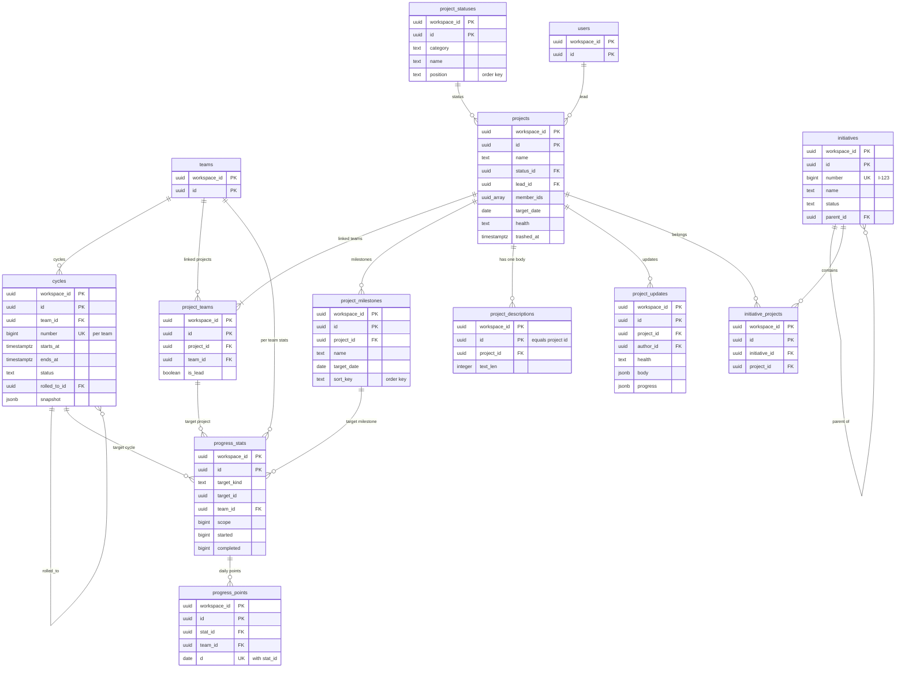

# Data model: サイクル・プロジェクト・イニシアチブ・進捗

[data-model.md](../data-model.md) の一部。規約は、そちらの 2 節に従う。振る舞いは [cycles-and-projects.md](../cycles-and-projects.md) を正とする。決定は [ADR-0026](../../decisions/0026-cycle-rows-and-rollover.md)、[ADR-0027](../../decisions/0027-progress-stats-per-team-via-derive.md)、[ADR-0033](../../decisions/0033-team-visibility-changes-and-guests.md)。

すべてワークスペースの表（`workspace_id`、複合キー、FORCE RLS）。

| 表 | 種類 | グループ | 読み込み |
| --- | --- | --- | --- |
| `cycles` | モデル `Cycle` | `team` | instant（完了から 90 日でアーカイブ → 遅延） |
| `projects` | モデル `Project` | `teams`（`ProjectTeam.team_id`） | instant |
| `project_teams` | モデル `ProjectTeam` | `team` | instant |
| `project_statuses` | モデル `ProjectStatus` | `workspace` | instant |
| `project_milestones` | モデル `ProjectMilestone` | `via`（`project_id`） | instant |
| `project_descriptions` | モデル `ProjectDescription` | `via`（`project_id`） | lazy |
| `project_updates` | モデル `ProjectUpdate` | `via`（`project_id`） | lazy |
| `initiatives` | モデル `Initiative` | `workspace_members` | instant |
| `initiative_projects` | モデル `InitiativeProject` | `via`（`project_id`） | instant |
| `progress_stats` | モデル `ProgressStat` | `team` | instant |
| `progress_points` | モデル `ProgressPoint` | `team` | lazy |

## 1. ER 図

- `progress_stats.target_id` は `target_kind` で `cycles`・`projects`・`project_milestones` のどれかを指す（多相。外部キーは張らない）。プロジェクトとマイルストーンの行はチームごとなので、図では `project_teams` から線を引いた。
- `projects` と `project_descriptions` は 1 対 1。

## 2. サイクル

### cycles（`Cycle`）

チームのサイクル（[cycles-and-projects.md](../cycles-and-projects.md) の 3.2・4 節）。行は Worker だけが作る。

- モデル：グループ `team`（`from: team_id`）、`instant`、`archivable`（完了から 90 日で Worker がアーカイブ）、`delete: hard`。

| 列 | 型 | NULL | 既定 | 競合 | 説明 |
| --- | --- | --- | --- | --- | --- |
| `team_id` | `uuid` | NO | | `server_only`、`ref:Team`、`on_delete: cascade`、`index` | |
| `number` | `bigint` | NO | | `server_only` | チームの中の連番 |
| `name` | `text` | YES | | `lww`、`max: 80` | 利用者が送れるのはこれだけ |
| `starts_at` | `timestamptz` | NO | | `server_only`、`index` | |
| `ends_at` | `timestamptz` | NO | | `server_only` | |
| `status` | `text` | NO | `'upcoming'` | `server_only`、`enum<upcoming,active,completed>` | Worker が境界で書く |
| `rolled_to_id` | `uuid` | YES | | `server_only`、`ref:Cycle`、`on_delete: nullify` | 繰り越し先 |
| `snapshot` | `jsonb` | YES | | `server_only`、`schema: CycleSnapshot` | 完了の写し（4.7 節） |

- 主キー：`(workspace_id, id)`。一意：`(workspace_id, team_id, number)`。
- 索引：`(workspace_id, team_id, starts_at)`（今のサイクル、境界のジョブ）。
- 部分一意：`(workspace_id, team_id) WHERE status = 'active'`（1 チームに `active` は 1 つ。I-12）。
- CHECK：`starts_at < ends_at`、`status` の値。
- S1 の規模：約 50 万行（チームあたり先の 15 と過去の分）。

## 3. プロジェクト

### projects（`Project`）

プロジェクト（[cycles-and-projects.md](../cycles-and-projects.md) の 3.3・5・6 節）。チームのつながりは `project_teams` の行で持ち、この行に持たない。

- モデル：グループ `teams`（`from: ProjectTeam.team_id`。つながった各チームのグループの和）、`instant`、`archivable`、`delete: trash`（30 日）。`include`：`ProjectUpdate:project_id`。[cycles-and-projects.md](../cycles-and-projects.md) の 6.1 節の「最新の 3 件」は、件数で切る被覆の鍵が定義の言語（[data-model-and-schema.md](../data-model-and-schema.md) の 3.7 節）にないので、S1 はつながる更新の全部を読む（[data-model.md](../data-model.md) の 8 節の持ち越し）。

| 列 | 型 | NULL | 既定 | 競合 | 説明 |
| --- | --- | --- | --- | --- | --- |
| `name` | `text` | NO | | `lww`、`max: 255`、`search`、`pii: content` | |
| `status_id` | `uuid` | NO | | `lww`、`ref:ProjectStatus`、`on_delete: restrict` | |
| `lead_id` | `uuid` | YES | | `lww`、`ref:User`、`on_delete: nullify` | |
| `member_ids` | `uuid[]` | NO | `'{}'` | `set`、`set<ref:User>`、`max: 500`、`on_delete: remove` | |
| `start_date`・`target_date` | `date` | YES | | `lww` | |
| `start_res`・`target_res` | `text` | NO | `'day'` | `lww`、`enum<day,month,quarter,half,year>` | 日付の粒度 |
| `health` | `text` | NO | `'none'` | `server_only`、`enum<none,on_track,at_risk,off_track>` | `ProjectUpdate` の派生 |
| `last_update_at` | `timestamptz` | YES | | `server_only` | 同上 |
| `started_at`・`completed_at`・`canceled_at` | `timestamptz` | YES | | `server_only` | 状態の種類の変化の派生 |
| `trashed_at` | `timestamptz` | YES | | `lww` | `delete: trash` の列 |

- 主キー：`(workspace_id, id)`。
- 索引：`(workspace_id, status_id)`、GIN `(sync_groups)`（グループが列から引けない規則なので、グループのブートストラップと `view` の問い合わせに使う。[data-model.md](../data-model.md) の 2.4 節）、`(workspace_id, trashed_at) WHERE trashed_at IS NOT NULL`。
- 行のグループ：Writer は `ProjectTeam` の作成・削除の同じトランザクションで、この行と `via` で依存する行（`ProjectMilestone`・`ProjectDescription`・`ProjectUpdate`・`InitiativeProject`）の `sync_groups` を計算し直す（I-13）。
- S1 の規模：約 50 万行。

### project_teams（`ProjectTeam`）

プロジェクトとチームのつながり。そのチームのグループに入る。

- モデル：グループ `team`（`from: team_id`）、`instant`、`delete: hard`。

| 列 | 型 | NULL | 既定 | 競合 | 説明 |
| --- | --- | --- | --- | --- | --- |
| `project_id` | `uuid` | NO | | `server_only`、`ref:Project`、`on_delete: cascade`、`index` | |
| `team_id` | `uuid` | NO | | `server_only`、`ref:Team`、`on_delete: cascade`、`index` | |
| `is_lead` | `boolean` | NO | `false` | `lww` | リードのチーム |

- 主キー：`(workspace_id, id)`。一意：`(workspace_id, project_id, team_id)`。
- 部分一意：`(workspace_id, project_id) WHERE is_lead`（リードは 1 つ。DT-PROJ-002）。「少なくとも 1 行」は Writer が確かめる。
- 作る時：同じトランザクションで、そのチームの `ProgressStat`（`project` と、各マイルストーンの `milestone`）を作る。
- S1 の規模：約 70 万行。

### project_statuses（`ProjectStatus`）

ワークスペースのプロジェクトの状態（[cycles-and-projects.md](../cycles-and-projects.md) の 3.5 節）。

- モデル：グループ `workspace`（`guest_visible`：ゲストも、見えるプロジェクトの状態を描く）、`instant`、`archivable`、`delete: hard`。

| 列 | 型 | NULL | 既定 | 競合 | 説明 |
| --- | --- | --- | --- | --- | --- |
| `category` | `text` | NO | | `server_only`、`enum<backlog,planned,started,paused,completed,canceled>` | 作成の値だけ |
| `name` | `text` | NO | | `lww`、`max: 64` | |
| `color` | `text` | NO | | `lww`、`max: 16` | |
| `description` | `text` | YES | | `lww`、`max: 255` | |
| `position` | `text` | NO | | `order`、`order_scope: [category]` | |

- 主キー：`(workspace_id, id)`。索引：`(workspace_id, category, position)`。
- 最低の数：各種類に 1 以上（Writer。I-11）。ワークスペースを作る時に既定の 6 行を作る。
- S1 の規模：約 4 万行。

### project_milestones（`ProjectMilestone`）

- モデル：グループ `via`（`from: project_id`）、`instant`、`delete: hard`。

| 列 | 型 | NULL | 既定 | 競合 | 説明 |
| --- | --- | --- | --- | --- | --- |
| `project_id` | `uuid` | NO | | `server_only`、`ref:Project`、`on_delete: cascade`、`index` | |
| `name` | `text` | NO | | `lww`、`max: 80` | |
| `description` | `text` | YES | | `lww`、`max: 2000` | 短い文 |
| `target_date` | `date` | YES | | `lww` | |
| `sort_key` | `text` | NO | | `order`、`order_scope: [project_id]` | |

- 主キー：`(workspace_id, id)`。索引：`(workspace_id, project_id, sort_key)`、GIN `(sync_groups)`。
- 上限：1 プロジェクト 100（Writer）。
- S1 の規模：約 100 万行。

### project_descriptions（`ProjectDescription`）

プロジェクトの説明の本文。イシューの本文と同じ方式（CRDT を `append` で送る。[ADR-0021](../../decisions/0021-description-crdt-yjs-in-sync-log.md)）。

> 2026-09-28、この文書で足した。[ADR-0002](../../decisions/0002-sync-model.md) と AGENTS.md は「プロジェクトの説明は CRDT」と決め、[cycles-and-projects.md](../cycles-and-projects.md) の 1 節は「イシューの本文と同じ方式」としていたが、モデルの定義がなかった。

- モデル：グループ `via`（`from: project_id`）、`lazy`、`delete: hard`。`id = project_id`。`create Project` の派生で Writer が作る。

| 列 | 型 | NULL | 既定 | 競合 | 説明 |
| --- | --- | --- | --- | --- | --- |
| `project_id` | `uuid` | NO | | `server_only`、`ref:Project`、`on_delete: cascade`、`index` | |
| `doc` | — | — | | `crdt`、`crdt_doc` | 列を持たない。状態は `doc_states`（`model = 'ProjectDescription'`） |
| `text_len`・`state_size` | `integer` | NO | `0` | `server_only` | Worker のまとめが書く |

- 主キー：`(workspace_id, id)`。一意：`(workspace_id, project_id)`。CHECK：`id = project_id`。
- 読み込み：`ProjectDescription:id=<project_id>`（プロジェクトの画面を開いた時）。上限・まとめ・バージョンの規則はイシューの本文と同じ。本文のバージョン（`IssueDescriptionVersion` に当たるもの）は MVP では持たない。
- 検索：`doc_states.text_plain` を `Project` の文書の `body` に入れる（[search.md](../search.md) の 4.2 節）。
- S1 の規模：`projects` と同じ行数。

### project_updates（`ProjectUpdate`）

プロジェクトの更新と健康状態（[cycles-and-projects.md](../cycles-and-projects.md) の 6.1 節）。

- モデル：グループ `via`（`from: project_id`）、`lazy`、`delete: hard`。

| 列 | 型 | NULL | 既定 | 競合 | 説明 |
| --- | --- | --- | --- | --- | --- |
| `project_id` | `uuid` | NO | | `server_only`、`ref:Project`、`on_delete: cascade`、`index` | |
| `author_id` | `uuid` | YES | | `server_only`、`ref:User`、`on_delete: nullify` | |
| `health` | `text` | NO | | `lww`、`enum<on_track,at_risk,off_track>` | |
| `body` | `jsonb` | NO | | `lww`、`schema: RichTextDoc`、`max_bytes: 65536`、`pii: content` | |
| `progress` | `jsonb` | YES | | `server_only`、`schema: UpdateProgressDiff` | 前の更新からの変化。2% 以下なら NULL |
| `edited_at` | `timestamptz` | YES | | `server_only` | |

- 主キー：`(workspace_id, id)`。索引：`(workspace_id, project_id, created_at DESC)`（最新の 3 件、健康状態の戻し）。
- S1 の規模：約 300 万行。

## 4. イニシアチブ

### initiatives（`Initiative`）

- モデル：グループ `workspace_members`（`members`。ゲストに届けない）、`instant`、`archivable`、`delete: trash`（30 日）。

| 列 | 型 | NULL | 既定 | 競合 | 説明 |
| --- | --- | --- | --- | --- | --- |
| `number` | `bigint` | NO | | `server_only` | `I-123`。`workspaces.next_initiative_number` から Writer が振る |
| `name` | `text` | NO | | `lww`、`max: 255`、`search`、`pii: content` | |
| `status` | `text` | NO | `'proposed'` | `lww`、`enum<proposed,planned,active,completed,canceled>` | |
| `owner_id` | `uuid` | YES | | `lww`、`ref:User`、`on_delete: nullify` | |
| `parent_id` | `uuid` | YES | | `lww`、`ref:Initiative`、`on_delete: nullify` | 深さ 5、循環は `cycle` |
| `target_date` | `date` | YES | | `lww` | |
| `health` | `text` | NO | `'none'` | `server_only`、`enum<none,on_track,at_risk,off_track>` | |
| `trashed_at` | `timestamptz` | YES | | `lww` | |

- 主キー：`(workspace_id, id)`。一意：`(workspace_id, number)`。索引：`(workspace_id, parent_id)`。
- CHECK：`parent_id <> id`。
- S1 の規模：約 5 万行。

### initiative_projects（`InitiativeProject`）

- モデル：グループ `via`（`from: project_id`。プロジェクトのグループ）、`instant`、`delete: hard`。

| 列 | 型 | NULL | 既定 | 競合 | 説明 |
| --- | --- | --- | --- | --- | --- |
| `initiative_id` | `uuid` | NO | | `server_only`、`ref:Initiative`、`on_delete: cascade`、`index` | |
| `project_id` | `uuid` | NO | | `server_only`、`ref:Project`、`on_delete: cascade`、`index` | |

- 主キー：`(workspace_id, id)`。一意：`(workspace_id, initiative_id, project_id)`。索引：GIN `(sync_groups)`。
- S1 の規模：約 20 万行。

## 5. 進捗

### progress_stats（`ProgressStat`）

`(対象, チーム)` ごとの点と件数（[cycles-and-projects.md](../cycles-and-projects.md) の 7.2 節、ADR-0027）。

- モデル：グループ `team`（`from: team_id`）、`instant`、`archivable`（対象がアーカイブされたら同じく）、`delete: hard`。

| 列 | 型 | NULL | 既定 | 競合 | 説明 |
| --- | --- | --- | --- | --- | --- |
| `target_kind` | `text` | NO | | `server_only`、`enum<cycle,project,milestone>` | |
| `target_id` | `uuid` | NO | | `server_only`、`index` | 多相 |
| `team_id` | `uuid` | NO | | `server_only`、`ref:Team`、`on_delete: cascade` | |
| `scope`・`started`・`completed` | `bigint` | NO | `0` | `counter`、`derive_only` | 点 |
| `scope_n`・`started_n`・`completed_n` | `bigint` | NO | `0` | `counter`、`derive_only` | 件数 |

- 主キー：`(workspace_id, id)`。一意：`(workspace_id, target_kind, target_id, team_id)`。
- 索引：一意の索引（派生の `incr` の行の引き、数え直し）。
- CHECK：`target_kind` の値。値の非負は強制しない（途中の派生で一時に負になりうる）。
- 書く時：対象を作る同じトランザクションで Writer が作る。派生は既にある行に `incr` を当てるだけ。
- 数え直し：Worker の `progress-reconcile`（1 日 1 回）が差を `incr` で当てる。
- S1 の規模：約 300 万行。

### progress_points（`ProgressPoint`）

日ごとの点（[cycles-and-projects.md](../cycles-and-projects.md) の 7.4 節）。

- モデル：グループ `team`（`from: team_id`）、`lazy`（`ProgressPoint:stat_id=…`）、`delete: hard`。

| 列 | 型 | NULL | 既定 | 競合 | 説明 |
| --- | --- | --- | --- | --- | --- |
| `stat_id` | `uuid` | NO | | `server_only`、`ref:ProgressStat`、`on_delete: cascade`、`index` | |
| `team_id` | `uuid` | NO | | `server_only`、`ref:Team`、`on_delete: cascade` | |
| `d` | `date` | NO | | `server_only` | ワークスペースのタイムゾーンの日 |
| `scope`・`started`・`completed`・`scope_n`・`started_n`・`completed_n` | `bigint` | NO | | `server_only` | その時刻の値 |

- 主キー：`(workspace_id, id)`。一意：`(workspace_id, stat_id, d)`（同じ日のジョブのやり直しで重ならない）。
- 書く主体：Worker の `progress-points`（1 日 1 回、00:10）。
- S1 の規模：`active` の対象 × 日。年に約 5,000 万行。完了した対象の点は、対象と一緒にアーカイブの扱い（行は残す）。
