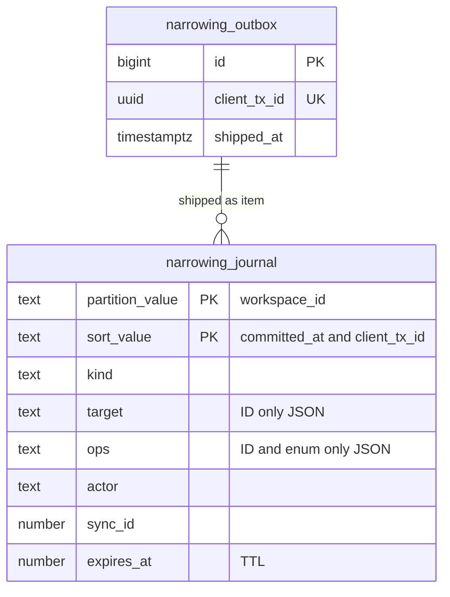
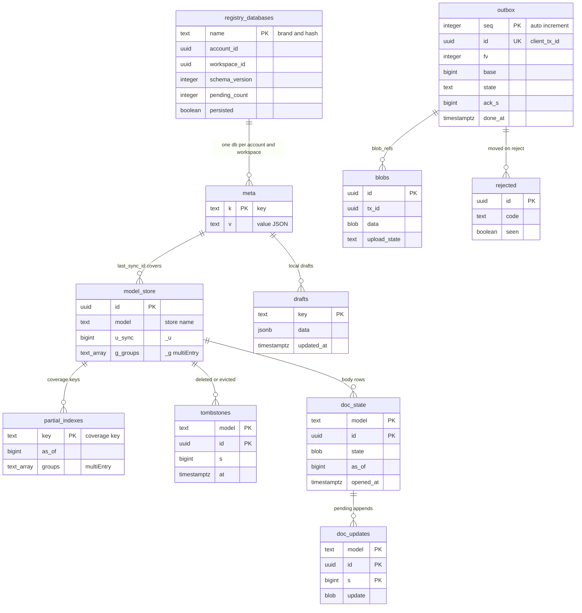

# Data model: DB の外（Valkey・同期の形・S3・OpenSearch・DynamoDB・SQS・IndexedDB）

[data-model.md](../data-model.md) の一部。DB の表の外に置くデータの形をまとめる。どれも正本は Aurora で、失っても Aurora から作り直せる。例外は 2 つ：端末の `_outbox`・`_rejected`・`_blobs`・`_drafts`（未送信の入力。端末だけの正本）と、DynamoDB の `narrowing_journal`（DR のときだけ Aurora の代わりの正本になる）。

- 鍵・チャンネルの名前は、必ずワークスペースで区切るか、ハッシュだけを入れる（I-18）。本家の名前を入れない（[リポジトリ共通の ADR-0006](../../../../../docs/decisions/0006-brand-neutral-identifiers.md)）。
- 名前のうち、領域の文書で決めていなかったものは、この文書で決めた（表の「決めた場所」が「この文書」のもの）。

## 1. Valkey（ElastiCache）

失ってよい。落ちたときの振る舞いは各領域の文書にある。

| 鍵・チャンネル | 種類 | TTL | 中身 | 書く・読む | 決めた場所 |
| --- | --- | --- | --- | --- | --- |
| `sync:<workspace_id>` | pub/sub（S2 から sharded） | — | Relay が出す絞る前の範囲 `{from, to, c, actions[]}`（2.2 節）。1 MiB まで | Relay → Gateway | [sync-engine.md](../sync-engine.md) の 7.3 節 |
| `sync:ticket:<sha256(ticket)>` | 文字列（JSON） | 60 秒 | `{account_id, user_id, workspace_id, session_id, client_id}`。`GETDEL` で 1 回だけ | Sync API → Gateway | 同 9.3 節（鍵の名前はこの文書） |
| `auth:sess:<sha256(token)>` | 文字列（JSON） | 5 分 | セッションの有効、`session_id`、`account_id`、`amr` | 認証のサービス → 他のサービス | [accounts-and-auth.md](../accounts-and-auth.md) の 6.2 節（名前はこの文書） |
| `auth:revoked` | pub/sub | — | `session_id` | 認証のサービス → Gateway | 同 6.4 節 |
| `auth:member_removed` | pub/sub | — | `{workspace_id, user_id}` | Writer → Gateway | 同 6.4 節 |
| `auth:desktop:<sha256(code)>` | 文字列 | 60 秒 | Electron の交換のコード → `{challenge, session}` | 認証のサービス | 同 6.5 節（名前はこの文書） |
| `auth:rl:otp_email:<sha256(email)>`・`auth:rl:otp_ip:<ip>`・`auth:rl:login_ip:<ip>` | 数 | 1 時間・1 分 | 流量の数え | 認証のサービス | 同 5.5 節（名前はこの文書） |
| `ws:<workspace_id>:wr:<origin>` | トークンバケット | — | Writer の書き込みの枠（`api`・`notifier`・`worker`・`import`） | Writer | [capacity.md](../capacity.md) の 2.2 節 |
| `ws:<workspace_id>:lockwait` | 数 | 30 秒 | 直近 10 秒のロックの待ちの p99（1 秒ごと） | Writer | 同上 |
| `relay:lease:<partition>` | 文字列 | 10 秒（更新） | Relay の区画の担当のタスク | Relay | [infrastructure.md](../infrastructure.md) の 3.2 節 |
| `api:rl:req:<principal>`・`api:rl:cx:<principal>`・`api:rl:ws:<workspace_id>` | トークンバケット | — | 公開 API の要求の数と複雑さ。`principal` はキーの持ち主の `User` か `(app, User)` | Public API | [api-and-webhooks.md](../api-and-webhooks.md) の 4.2 節（名前はこの文書） |
| `api:cred:<sha256(token)>` | 文字列（JSON） | 5 分 | トークン → `Principal` の写し | Public API | 同 6.1 節（名前はこの文書） |
| `oauth:code:<sha256(code)>` | 文字列（JSON） | 60 秒 | `{workspace_id, app_id, user_id, scopes, redirect_uri, code_challenge}`。`GETDEL` | Public API | 同 6.3 節（置き場所はこの文書） |
| `int:state:<sha256(state)>` | 文字列（JSON） | 10 分 | 連携のインストールの `state` → `{workspace_id, user_id, session_id}` | Public API | [integrations.md](../integrations.md) の 4.1・5.1 節（置き場所はこの文書） |
| `dir:changed` | pub/sub（S2 から） | — | `workspace_id`（振り分けの写しの捨て） | 移動のジョブ → 全サービス | [infrastructure.md](../infrastructure.md) の 10.1 節 |

- チケット・トークン・コードは、平文を鍵にも値にも入れない。
- セッションの写し・トークンの写しは、取り消しの時に消す（`DEL`）。消し損ねても 5 分で切れる。

## 2. 同期の形

形の正本は [sync-engine.md](../sync-engine.md) の 4.2・7.2・9 節と [bootstrap-and-partial-sync.md](../bootstrap-and-partial-sync.md) の 4.2・6.1 節。ここでは、DB の列との対応をまとめる。

### 2.1 トランザクション（クライアント → Writer）

```json
{ "id": "<client_tx_id: UUIDv7>", "fv": 3, "base": 18234, "at": "2026-09-28T01:02:03.456Z",
  "ops": [ { "op": "create|set|add|remove|incr|append|archive|unarchive|delete",
             "m": "<Model>", "id": "<uuid>", "f": "<field>", "v": <value>, "n": <int>, "d": { … } } ] }
```

| 鍵 | DB の行き先 |
| --- | --- |
| `id` | `tx_results.client_tx_id`、`sync_actions.tx_id`、`issue_history.tx_id` |
| `fv` | 検証だけ（保存しない） |
| `base` | 上書きの判定（`field_sync_ids`）。保存しない |
| `ops[].m`・`ops[].id` | `sync_actions.model`・`model_id` |
| `ops[].op` | `sync_actions.action`（`create` → insert、`set`・`add`・`remove`・`incr` → update、`append` → append、`archive`・`unarchive`・`delete` はそのまま） |

- 上限：500 操作、256 KiB（[sync-engine.md](../sync-engine.md) の 4.3 節）。

### 2.2 差分のパケット（Gateway → クライアント）

```json
{ "t": "deltas", "from": 18240, "to": 18252, "c": 1790000000123,
  "actions": [ { "s": 18241, "tx": "<tx_id>", "e": true, "m": "Issue", "id": "<uuid>",
                 "a": "update", "d": { …行の全体… }, "c": ["state_id"], "g": ["team:<id>"] } ] }
```

| 鍵 | `sync_actions` の列 |
| --- | --- |
| `s` | `sync_id` |
| `tx` | `tx_id` |
| `e` | `tx_end` |
| `m`・`id` | `model`・`model_id` |
| `a` | `action`（`insert`・`update`・`append`・`archive`・`unarchive`・`delete`、Gateway が作る `evict`） |
| `d` | `data`（`api: internal` と `bytes` の列を除く） |
| `c`（行） | `changed` |
| `g` | `groups` |
| `c`（パケット） | 範囲の最後の `committed_at`（ミリ秒） |

- `groups_before` はクライアントに送らない（Gateway の `evict` の判定だけに使う）。
- 取り戻し（`GET /sync/deltas`）の NDJSON の行も同じ鍵。

### 2.3 行の形（ブートストラップ・読み込み・手元）

- 行の JSON は、モデルのフィールド（snake_case）と共通の列のうち `id`・`created_at`・`updated_at`・`archived_at` を持つ。`_u`（`updated_sync_id`）と `_g`（`sync_groups`）を付ける。`field_sync_ids` と `workspace_id` は送らない（`api: internal`）。
- 本文のモデル（`IssueDescription`・`ProjectDescription`）の読み込みは、行に `state`（base64、`doc_states.state` と後の `append` を合わせたもの）を足す。`IssueDescriptionVersion` の読み込みは `state`（`bytes` の列）を足す。差分とブートストラップには載せない。

### 2.4 ack

```json
{ "t": "ack", "req": 7, "results": [
  { "id": "<client_tx_id>", "ok": true, "s": 18252, "server_ops": [ … ], "overwrote": ["title"] },
  { "id": "<client_tx_id>", "ok": false, "code": "forbidden", "detail": { "m": "Issue", "id": "…", "f": "state_id" } } ] }
```

- `s`・`server_ops`・`code` は `tx_results` の `sync_id`・`server_ops`・`reject_code` と同じ値（再送で同じ応答）。

## 3. S3

バケットの名前は `<brand>-<用途>-<env>`。すべて非公開、SSE-KMS（[security.md](../security.md) の 5.2 節）。

| バケット・接頭辞 | 中身 | 保持 | 複製 | 決めた場所 |
| --- | --- | --- | --- | --- |
| `<brand>-attachments`：`ws/<workspace_id>/att/<attachment_id>/<乱数>` | 添付の中身。上げの時にタグ `state=pending`、`ready` でタグを外す | 行がある間。`pending` のタグは 7 日で消す。消した行の中身は `attachment_purges` で 30 日後 | 大阪へ | [editor-and-descriptions.md](../editor-and-descriptions.md) の 8 節 |
| `<brand>-staging`：`ws/<workspace_id>/imports/<job_id>/records/<kind>-<n>.ndjson.gz`、`…/plan.json`、`…/files/<source_id>` | インポートの段置き（正規化した記録、計画、取り出した添付） | 30 日 | しない | [import-export.md](../import-export.md) の 3 節 |
| `<brand>-exports`：`ws/<workspace_id>/exports/<job_id>/<name>.csv`・`<name>.zip` | 書き出し。KMS は `<brand>-exports` | 24 時間 | しない | 同 7 節 |
| `<brand>-search-snapshots` | OpenSearch のスナップショット | 7 日分 | 大阪へ | [infrastructure.md](../infrastructure.md) の 3.3 節 |
| `<brand>-rum`：`rum/dt=<yyyy-mm-dd>/…parquet`、`delivery-audit/dt=<yyyy-mm-dd>/…` | RUM の集計、配信の監査の抜き取り | 13 か月、90 日 | しない | [observability.md](../observability.md) の 3.2・4.4 節 |
| `<brand>-web`：`web/<build_hash>/…`、`desktop/<version>/…` | Web の資産、Electron の配布物 | 90 日（今と 1 つ前の版は残す） | 大阪へ | [delivery.md](../delivery.md) の 5・6 節 |
| log-archive のアカウント：`audit/<workspace_id>/<yyyy>/<mm>/<dd>/<hh>.ndjson.gz`、`platform-audit/<yyyy>/<mm>/<dd>/<hh>.ndjson.gz` | 監査ログの写し（行ごとに連鎖のハッシュ）。Object Lock | 3 年、5 年 | log-archive の設定 | [security.md](../security.md) の 6 節 |

- **ブートストラップの写しは S3 に置かない。** ブートストラップは Aurora の reader から毎回ストリームで作り、ワークスペースと写しの組でキャッシュしない（[ADR-0003](../../decisions/0003-bootstrap-and-partial-sync.md)、[ADR-0011](../../decisions/0011-bootstrap-stream-and-chunked-snapshots.md)）。グループの写しのキャッシュは S1 では行わない（[bootstrap-and-partial-sync.md](../bootstrap-and-partial-sync.md) の 7.8 節の持ち越し）。
- ワークスペースの削除のジョブは `ws/<workspace_id>/` の接頭辞を、添付・段置き・書き出しのバケットで消す（[security.md](../security.md) の 9.1 節）。
- 配りの URL（CloudFront の署名付き、5 分）は `https://<brand>usercontent.<domain>/ws/<workspace_id>/att/…` の形。URL をログに書かない。

## 4. OpenSearch

索引 `docs_v<n>`（別名 `docs`）。1 つの索引にモデルを問わず入れる（[search.md](../search.md) の 4 節、[ADR-0030](../../decisions/0030-search-engine-opensearch.md)、[ADR-0031](../../decisions/0031-search-permission-by-sync-groups.md)）。

```json
{ "settings": { "number_of_shards": 12, "number_of_replicas": 1, "refresh_interval": "1s",
    "analysis": {
      "tokenizer": { "gram12": { "type": "ngram", "min_gram": 1, "max_gram": 2 },
                     "ja": { "type": "kuromoji_tokenizer", "mode": "search" } },
      "analyzer": { "gram": { "tokenizer": "gram12" }, "ja": { "tokenizer": "ja" } } } },
  "mappings": { "dynamic": "strict",
    "_routing": { "required": true },
    "properties": {
      "workspace_id": { "type": "keyword" },
      "m":            { "type": "keyword" },
      "id":           { "type": "keyword" },
      "groups":       { "type": "keyword" },
      "team_id":      { "type": "keyword" },
      "issue_id":     { "type": "keyword" },
      "identifier":   { "type": "keyword" },
      "state_type":   { "type": "keyword" },
      "archived":     { "type": "boolean" },
      "trashed":      { "type": "boolean" },
      "deleted":      { "type": "boolean" },
      "updated_at":   { "type": "date" },
      "title": { "type": "text", "analyzer": "ja", "fields": { "gram": { "type": "text", "analyzer": "gram" } } },
      "body":  { "type": "text", "analyzer": "ja", "fields": { "gram": { "type": "text", "analyzer": "gram" } } },
      "v":            { "type": "long" } } } }
```

| フィールド | 元の列 |
| --- | --- |
| `_id` | `<model>:<id>` |
| `_routing`・`workspace_id` | `workspace_id` |
| `groups` | 行の `sync_groups` |
| `identifier` | `teams.key` ＋ `issues.number`、`issue_aliases` の古い識別子（大文字） |
| `state_type` | `workflow_states.category` |
| `archived`・`trashed`・`deleted` | `archived_at`・`trashed_at`、行がない（墓標の文書） |
| `title` | `issues.title`・`projects.name` を `normalizeForSearch` にかけたもの |
| `body` | `doc_states.text_plain`（イシュー・プロジェクト）、コメントの本文の文字、添付のファイル名。先頭 256 KiB |
| `v`（外部の版） | 読んだ行の `updated_sync_id`・`doc_states.compacted_through`・別名の `updated_sync_id` の最大 |

- 担当・ラベルは入れない（[search.md](../search.md) の 4.2 節）。
- 問い合わせは `buildSearchRequest` だけで作り、`workspace_id` と `groups` の `filter` を必ず付ける（I-17）。

## 5. DynamoDB：`narrowing_journal`

権限を狭める操作の追記だけの記録（[ADR-0058](../../decisions/0058-dr-permission-narrowing-journal.md)）。東京の表、大阪をレプリカにしたグローバルテーブル。オンデマンド、PITR、35 日の TTL。



- 図の `partition_value`・`sort_value` は、実際の属性の `pk`・`sk` を表す（Mermaid の制約で名前を変えた）。

| 属性 | 型 | 中身 |
| --- | --- | --- |
| `pk` | S | `workspace_id`。アカウント全体の操作（全セッションの取り消し）は `acct#<account_id>` |
| `sk` | S | `<committed_at の ISO 8601（ミリ秒）>#<client_tx_id>` |
| `kind` | S | `member_suspend`・`role_downgrade`・`team_private`・`team_leave`・`session_revoke`・`credential_revoke`・`access_restrict` |
| `target` | S（JSON） | ID だけ |
| `ops` | S（JSON） | やり直す操作。ID と列挙の値だけ（中身を持たない） |
| `actor` | S（JSON） | `{kind, id}` |
| `sync_id` | N | Writer の操作の最後の `sync_id`（`auth` の操作はなし） |
| `expires_at` | N | TTL（UNIX 秒、35 日後） |

- 書き方：条件付きの `PutItem`（`attribute_not_exists(sk)`）だけ。`UpdateItem`・`DeleteItem` を書き手のロールに許さない。
- 読み方：昇格のワークフローが `pk` ごとに `sk` の範囲（失った範囲の開始の時刻から後）を `Query` する。
- 大きさ：1 項目 1 KB 以下、1 秒に数件。

## 6. SQS のメッセージ

すべて ID と範囲だけを運び、中身は受け手が Aurora（reader）から読み直す。`workspace_id` を必ず持つ（受け手がコンテキストを設定する）。

| キュー | 種類 | 本文 | 送り手 → 受け手 | 決めた場所 |
| --- | --- | --- | --- | --- |
| `notify` | 標準 | `{workspace_id, from, to}`（`sync_actions` の範囲）、`{workspace_id, kind: "doc_mentions", model, id, added: [user_id]}`、`{workspace_id, kind: "scheduled", ref}` | Relay・doc-compactor・scheduler → 通知係 | [notifications-and-inbox.md](../notifications-and-inbox.md) の 3 節 |
| `search-index`・`search-bulk` | 標準 | `{workspace_id, model, id, min_sync_id}` | Relay・doc-compactor・インポート → 索引の Worker | [search.md](../search.md) の 9.1 節 |
| `doc-compact` | FIFO（グループ = 本文の ID） | `{workspace_id, model, id, sync_id}` | Relay → doc-compactor | [editor-and-descriptions.md](../editor-and-descriptions.md) の 4.2 節 |
| `webhook-fanout` | 標準 | `{workspace_id, from, to}` | Relay → 振り分けの Worker | [api-and-webhooks.md](../api-and-webhooks.md) の 5.3 節 |
| `webhook-send` | 標準（遅延つき） | `{workspace_id, delivery_id, created_on}` | 振り分けの Worker → 送り係 | 同 5.6 節 |
| `integrations` | FIFO（グループ = `gh:<installation>:<repo_id>:<number>` など） | `{workspace_id, event_id, received_on}` | 受け口 → 連携の Worker | [integrations.md](../integrations.md) の 3 節 |
| `integrations-out` | 標準 | `{workspace_id, from, to}`（チャンネルへの通知・展開の対象の範囲） | Relay → 連携の Worker | 同 5.3 節 |
| `import` | 標準 | `{workspace_id, job_id, step, cursor}` | Public API・import-worker → import-worker・import-commit | [import-export.md](../import-export.md) の 3 節 |
| `audit-reports` | 標準 | 端末の報告（[observability.md](../observability.md) の 4.1 節の形） | Gateway → audit-worker | [observability.md](../observability.md) の 4.2 節 |

- キューの名前は、領域の文書にないもの（`notify`・`doc-compact`・`import`・`audit-reports`）をこの文書で決めた。
- 少なくとも 1 回の配送なので、受け手は冪等にする（通知は `notification_keys`、Writer への書き込みは `client_tx_id`、索引は外部の版、Webhook は `webhook_deliveries` の一意）。

## 7. Webhook の本文

形の正本は [api-and-webhooks.md](../api-and-webhooks.md) の 5.5 節。

```json
{ "action": "create|update|remove", "type": "Issue", "webhookId": "…", "deliveryId": "…",
  "workspaceId": "…", "syncId": 18240, "createdAt": "2026-09-28T01:02:03.456Z",
  "actor": { "id": "…", "type": "user|api_key|oauth_app|system", "name": "…" },
  "data": { "id": "…", "identifier": "ENG-123", … },
  "updatedFrom": { "priority": 3, "updatedAt": "…" },
  "url": "https://<brand>.<domain>/<slug>/issue/ENG-123",
  "webhookTimestamp": 1790000000123 }
```

| 鍵 | 元 |
| --- | --- |
| `action` | `sync_actions.action`（insert → create、update・archive・unarchive → update、delete → remove） |
| `type` | `sync_actions.model` |
| `deliveryId` | `webhook_deliveries.id` |
| `syncId`・`createdAt` | `sync_actions.sync_id`・`committed_at` |
| `data` | `sync_actions.data` を公開 API の型（camelCase、`api: public` のフィールドだけ）に写したもの。本文は入れない |
| `updatedFrom` | 同じ `model_id` の 1 つ前の `sync_actions.data` の、`changed` のフィールドの値（保持の外なら省く） |

- ヘッダー：`<Brand>-Delivery`、`<Brand>-Event`、`<Brand>-Signature: t=<ms>,v1=<hex>`（入れ替えの間は `v1` が 2 つ）。

## 8. 端末（IndexedDB・localStorage・メモリー）

構成の正本は [client-store-and-offline.md](../client-store-and-offline.md) の 3・5 節（[ADR-0014](../../decisions/0014-indexeddb-layout-durability-and-migrations.md)）。

### 8.1 ER 図



- 図の実体の名前は store の名前から `_` を外したもの（`meta` は `_meta`、`outbox` は `_outbox` など）。`model_store` はモデルごとの store（`Issue`・`Comment` …）をまとめて表す。属性の `u_sync`・`g_groups` は行の `_u`・`_g`。
- `registry_databases` は別のデータベース `<brand>_registry` の store `databases`。他はワークスペースごとのデータベース `<brand>_<h>`（`h` = `SHA-256(account_id ":" workspace_id)` の base32 の先頭 20 文字）。

### 8.2 store の一覧

| store | キー | 索引 | 中身 | 消える時 |
| --- | --- | --- | --- | --- |
| `<brand>_registry.databases` | `name` | — | DB の一覧、件数、`persisted` | 最後の DB を消した時 |
| モデルごと | `id` | スキーマの `index`、`_g`（multiEntry） | 確定した行（2.3 節）。未確定の値を書かない | 脱退、やり直し（`epoch` は別名の DB で差し替え）、退かし（遅延のモデル） |
| `_meta` | `k` | — | `last_sync_id`、`sync_epoch`、`groups`、`groups_hash`、`schema_version`、`schema_hash`、`bootstrap`（チャンクの境と `done`）、`reset`、`migration`、`client_id`、`flags` | DB と一緒 |
| `_outbox` | `seq` | `id`（一意）、`state` | トランザクションと状態（`queued`・`sent`・`acked`・`done`）。`done` は 15 分 | 確定の 15 分後。移行でも消さない |
| `_rejected` | `id` | `seen` | 拒否されたトランザクション、理由、拒否された本文の平文 | 本人が見て消す |
| `_partial_indexes` | `key` | `groups`（multiEntry） | 被覆の鍵、`as_of`、`groups` | 脱退、退かし、やり直し |
| `_tombstones` | `[m, id]` | `at` | 削除・`evict` の墓標 `{m, id, s, at}` | 15 分 |
| `_blobs` | `id` | `tx_id` | オフラインの添付（`Blob`）、上げの状態 | 確定の後 |
| `_doc_state` | `[m, id]` | `opened_at` | 本文の確定した Yjs の状態、`as_of` | 退かし（未確定の `append` のある文書を除く） |
| `_doc_updates` | `[m, id, s]` | — | 被覆のない本文に届いた `append` | 1 文書 256 KiB を超えた時、読み込みの後 |
| `_drafts` | `key` | `updated_at` | 端末だけの一時の下書き | 送った時、ログアウト、除外 |

- 退かさない：`_outbox`・`_rejected`・`_meta`・未送信の `_blobs`・`_drafts`・`instant` のモデル・`partial` の被覆のある行。
- 移行：`schema_version` を上げるリリースは、1 つ前の版からの移行と、1 つ前の版の `_outbox` を読める `upcast` を付ける。`_outbox` を消さない（[ADR-0005](../../decisions/0005-client-persistence-and-offline.md)）。

### 8.3 メモリーと localStorage

| 置き場所 | 中身 | 正本 |
| --- | --- | --- |
| M1（観測可能なモデル） | `instant` のモデルと画面が使うモデル | IndexedDB |
| M2（詰めた索引） | `m2` のフィールドの列と、派生の列 `identifier`・`title_norm`（[client-store-and-offline.md](../client-store-and-offline.md) の 7.1 節） | IndexedDB |
| `localStorage` | 最後に開いたビュー（ID）、一覧とボードの別、パネルの幅（[client-app.md](../client-app.md) の 3.3 節） | 端末 |
| クッキー | セッション、端末の ID `<brand>_cid`（`client_devices.device_id`） | サーバー |

## 9. フラグと配布（AppConfig・CloudFront KeyValueStore）

| 置き場所 | 鍵 | 中身 | 決めた場所 |
| --- | --- | --- | --- |
| AppConfig | `release.*` | 未完成の振る舞いのフラグ | [delivery.md](../delivery.md) の 3 節 |
| AppConfig | `ops.*` | `ops.writes_enabled`、`ops.dr_replay_mode`、`ops.ws_deflate`、`ops.epoch_reset_spread_min` など | 同上、[infrastructure.md](../infrastructure.md) の 6.3 節 |
| AppConfig | `min_build`、互換の一覧（`schema_hash` の今と 1 つ前） | 握手の判定 | [delivery.md](../delivery.md) の 6 節、[data-model-and-schema.md](../data-model-and-schema.md) の 6.1 節 |
| CloudFront KeyValueStore | Web・Electron の版ごとの割合 | 段階の配布 | [delivery.md](../delivery.md) の 5・6 節 |
| 端末の `_meta.flags` | クライアントのフラグの写し | オフラインでも同じ値 | [client-store-and-offline.md](../client-store-and-offline.md) の 3.2 節 |
