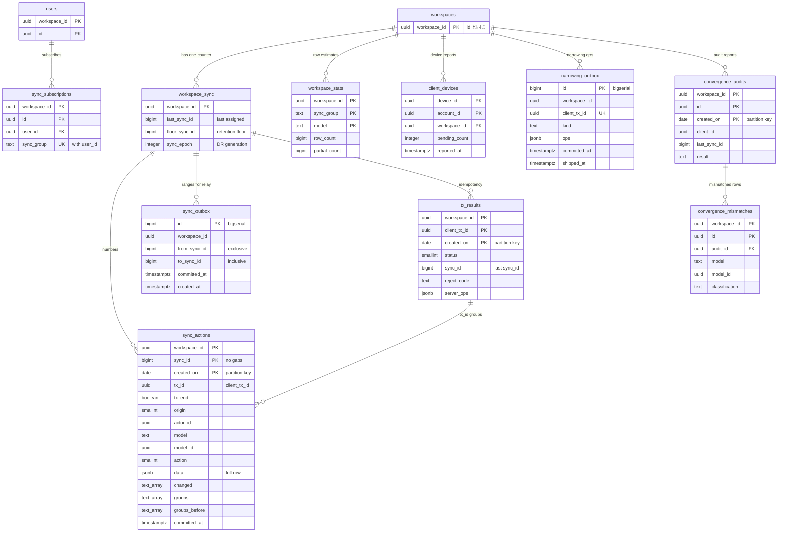

# Data model: 同期の核と運用の記録

[data-model.md](../data-model.md) の一部。規約は、そちらの 2 節に従う。振る舞いは [sync-engine.md](../sync-engine.md)、[bootstrap-and-partial-sync.md](../bootstrap-and-partial-sync.md)、[client-store-and-offline.md](../client-store-and-offline.md) の 9.3 節、[observability.md](../observability.md) の 4 節、[infrastructure.md](../infrastructure.md) の 6.3 節を正とする。決定は [ADR-0002](../../decisions/0002-sync-model.md)、[ADR-0006](../../decisions/0006-transactions-writer-and-idempotency.md)、[ADR-0007](../../decisions/0007-sync-actions-and-range-proof-deltas.md)、[ADR-0013](../../decisions/0013-sync-group-changes-retention-and-reset.md)、[ADR-0053](../../decisions/0053-convergence-audit.md)、[ADR-0058](../../decisions/0058-dr-permission-narrowing-journal.md)。

| 表 | 種類 | テナント |
| --- | --- | --- |
| `workspace_sync` | サーバーだけ | 内（RLS） |
| `sync_actions` | サーバーだけ（ログ） | 内 |
| `sync_outbox` | サーバーだけ | **外**（`relay` が全行を読む） |
| `tx_results` | サーバーだけ | 内 |
| `sync_subscriptions` | モデル `SyncSubscription` | 内 |
| `workspace_stats` | サーバーだけ | 内 |
| `client_devices` | サーバーだけ | **外**（握手の前に引く） |
| `narrowing_outbox` | サーバーだけ | **外**（`relay` が全行を読む） |
| `convergence_audits` | サーバーだけ | 内 |
| `convergence_mismatches` | サーバーだけ | 内 |

## 1. ER 図

- `workspaces` と `workspace_sync` は 1 対 1（図の記法を `||--o{` にそろえた。行は必ず 1 つ）。
- `sync_actions` と `tx_results` の線は、`sync_actions.tx_id = tx_results.client_tx_id` の論理のつながりで、外部キーは張らない（どちらも日ごとのパーティションで、保持が違う）。

## 2. 同期のログ

### workspace_sync

ワークスペースごとの `sync_id` の数と、保持の境、番号の世代。Writer はトランザクションの最初にこの行を `FOR UPDATE` でロックする（[sync-engine.md](../sync-engine.md) の 5.2 節）。このロックが、`sync_id` の欠けのない採番と、番号・並びの鍵・参照の検証の直列化の両方を守る。

| 列 | 型 | NULL | 既定 | 説明 |
| --- | --- | --- | --- | --- |
| `workspace_id` | `uuid` | NO | | 主キー。`workspaces.id` と同じ |
| `last_sync_id` | `bigint` | NO | `0` | 最後に振った `sync_id` |
| `floor_sync_id` | `bigint` | NO | `0` | ログに残る最も古い番号の 1 つ前。これより前は `410 too_old` |
| `sync_epoch` | `integer` | NO | `1` | 番号の世代。DR の切り替え・時点への差し替えで上げる（[ADR-0050](../../decisions/0050-disaster-recovery-and-sync-epoch-bump.md)） |

- 主キー：`(workspace_id)`。外部キー：`workspace_id` → `workspaces (workspace_id, id)`。
- CHECK：`floor_sync_id <= last_sync_id`、`sync_epoch >= 1`。
- 書く主体：`last_sync_id` は Writer だけ。`floor_sync_id` は保持のジョブ、`sync_epoch` は DR の手順（どちらも `platform`）。
- 作る時：ワークスペースを作る Writer のトランザクションの最初（`last_sync_id = 0`）。
- 格納：`fillfactor = 50`（毎トランザクションの更新を HOT にする）。
- 削除：ワークスペースの削除のジョブ。
- S1 の規模：5,000 行。

### sync_actions

変更のログ。1 変更 1 行。差分・取り戻し・Webhook・通知・索引・収束の監査の元（[ADR-0007](../../decisions/0007-sync-actions-and-range-proof-deltas.md)）。

| 列 | 型 | NULL | 既定 | 説明 |
| --- | --- | --- | --- | --- |
| `workspace_id` | `uuid` | NO | | |
| `sync_id` | `bigint` | NO | | ワークスペースの中で欠けなく続く番号 |
| `created_on` | `date` | NO | | パーティションの鍵（コミットの日、UTC） |
| `tx_id` | `uuid` | NO | | `client_tx_id`。サーバーのトランザクションは Writer が振る |
| `tx_end` | `boolean` | NO | | トランザクションの最後の変更 |
| `origin` | `smallint` | NO | | `1` client、`2` api、`3` worker、`4` notifier、`5` import |
| `actor_id` | `uuid` | YES | | 利用者の `User.id`。`system` は NULL |
| `model` | `text` | NO | | モデルの名前（`Issue` など） |
| `model_id` | `uuid` | NO | | 行の ID |
| `action` | `smallint` | NO | | `1` insert、`2` update、`3` append、`4` archive、`5` unarchive、`6` delete |
| `data` | `jsonb` | YES | | insert・update・archive・unarchive は**変更後の行の全体**（`api: internal` の列を除く）。append は `{"u": "<base64>"}`。delete は NULL |
| `changed` | `text[]` | YES | | update で変わったフィールド |
| `groups` | `text[]` | NO | | 変更の後の同期グループ |
| `groups_before` | `text[]` | YES | | グループが変わったときだけ（移動） |
| `committed_at` | `timestamptz` | NO | | Writer の COMMIT の直前の時刻。`updatedFrom`・上書きの判定・伝播の計測に使う |

- 主キー：`(workspace_id, sync_id, created_on)`。パーティションの鍵を含める必要があるので、`(workspace_id, sync_id)` の一意は DB で強制しない。`workspace_sync` のロックが一意を守る（I-1）。
- 索引：
  - 主キー：Relay・取り戻し・Gateway の欠けの埋めの範囲の読み出し（`sync_id BETWEEN`）。
  - `(workspace_id, model, model_id, sync_id)`：`updatedFrom` の前の値（[api-and-webhooks.md](../api-and-webhooks.md) の 5.5 節）、収束の監査の作り直し（[observability.md](../observability.md) の 4.2 節）、上書きの判定。
- CHECK：`action IN (1,2,3,4,5,6)`、`origin IN (1,2,3,4,5)`、`action = 6` と `data IS NULL` は同値。
- パーティション：`RANGE (created_on)`、1 日。`partition-maintenance`（1 日 1 回）が 7 日先まで作る。
- 保持：30 日（[security.md](../security.md) の 9 節）。保持のジョブは、落とすパーティションのワークスペースごとの最大の `sync_id` 以上に `floor_sync_id` を上げてから `DROP` する。本文のまとめ（`doc_states.compacted_through`）が追いついていないパーティションは落とさない（[editor-and-descriptions.md](../editor-and-descriptions.md) の 4.2 節）。
- 書く主体：Writer だけ（追記だけ）。
- 形：`data` の中の各行の鍵は、モデルのフィールドの名前（snake_case）と共通の列。差分の送り方は [stores.md](stores.md) の 2 節。
- S1 の規模：平均 800 万行/日、1 行 約 1.5 KB。30 日で約 2.4 億行・約 360 GB（[capacity.md](../capacity.md) の 1 節）。

### sync_outbox

Relay が読む「どの範囲を出すか」の行。中身を持たない（[sync-engine.md](../sync-engine.md) の 7.1 節）。

| 列 | 型 | NULL | 既定 | 説明 |
| --- | --- | --- | --- | --- |
| `id` | `bigint` | NO | `bigserial` | Relay が `ORDER BY id` で読む |
| `workspace_id` | `uuid` | NO | | |
| `from_sync_id` | `bigint` | NO | | 範囲の始まり（含まない） |
| `to_sync_id` | `bigint` | NO | | 範囲の終わり（含む） |
| `committed_at` | `timestamptz` | NO | | Writer の COMMIT の直前の時刻（`deltas.c`） |
| `created_at` | `timestamptz` | NO | `now()` | |

- 主キー：`(id)`。外部キーなし（RLS の外。ワークスペースの行を参照しない）。
- 索引：主キー（Relay の順の読み出し）、`(workspace_id, id)`（区画ごとの読み出し。区画は `hash(workspace_id)`）。
- CHECK：`from_sync_id < to_sync_id`。
- テナント：RLS の外（[data-model.md](../data-model.md) の 5 節）。`relay` は読んで、出した行を消す。`writer` は INSERT だけ。
- 削除：Relay が Valkey へ出した後に消す。空いた表は `VACUUM` に任せる（パーティションにしない。行は数秒しか残らない）。
- S1 の規模：常に数百行以下（1 秒 600 行の出入り）。

### tx_results

冪等の記録。同じ `client_tx_id` の再送に、前の結果を返す（[ADR-0006](../../decisions/0006-transactions-writer-and-idempotency.md)）。

| 列 | 型 | NULL | 既定 | 説明 |
| --- | --- | --- | --- | --- |
| `workspace_id` | `uuid` | NO | | |
| `client_tx_id` | `uuid` | NO | | クライアントの UUIDv7。公開 API の `Idempotency-Key`、参加（`join:…`）、連携の事象は UUIDv5 |
| `created_on` | `date` | NO | | パーティションの鍵（記録した日） |
| `status` | `smallint` | NO | | `1` ok、`2` rejected |
| `sync_id` | `bigint` | YES | | ok のとき、最後の `sync_id` |
| `reject_code` | `text` | YES | | `forbidden`・`invalid` など（[sync-engine.md](../sync-engine.md) の 5.3 節） |
| `server_ops` | `jsonb` | YES | | Writer が書き換えた値（並びの鍵、番号） |
| `created_at` | `timestamptz` | NO | `now()` | |

- 主キー：`(workspace_id, client_tx_id, created_on)`。
- 一意：DB では強制しない（パーティションの鍵を含むため）。Writer は `workspace_sync` のロックの中で先に引き、なければ書く（I-4）。
- 引き方：UUIDv7 の `client_tx_id` は、ID の時刻 − 1 日の日から今日までのパーティションだけを引く（記録は ID の時刻より 1 日以上前にはならない。[sync-engine.md](../sync-engine.md) の 5.4 節の 1 日の先の制限）。UUIDv5 の ID（公開 API・参加・連携の事象。サーバーの主体だけが使い、クライアントの `submit` では受けない）は全部のパーティションを引く。
- 索引：主キー（各パーティションで `(workspace_id, client_tx_id)` の索引になる）。
- CHECK：`status IN (1,2)`、`status = 1` と `sync_id IS NOT NULL` は同値、`status = 2` と `reject_code IS NOT NULL` は同値。
- パーティション：`RANGE (created_on)`、1 日。保持 90 日（`DROP`）。
- S1 の規模：約 600 行/秒のピーク、平均 1 日 300 万行、90 日で約 2.7 億行。

## 3. 購読と見積もり

### sync_subscriptions（`SyncSubscription`）

同期グループの購読。行の追加が参加、削除が脱退（[bootstrap-and-partial-sync.md](../bootstrap-and-partial-sync.md) の 7.1 節）。Writer だけが書く。

- モデル：グループ `user`（`from: user_id`）、`instant`、`delete: hard`、`api: internal`（公開 API に出さない）。
- 共通の列（[data-model.md](../data-model.md) の 2.4 節）を持つ。

| 列 | 型 | NULL | 既定 | 競合 | 説明 |
| --- | --- | --- | --- | --- | --- |
| `user_id` | `uuid` | NO | | `server_only`、`ref:User`、`on_delete: cascade` | |
| `sync_group` | `text` | NO | | `server_only` | `workspace`・`members`・`team:<id>`・`user:<id>`・`role:admin` |

- 主キー：`(workspace_id, id)`。
- 一意：`(workspace_id, user_id, sync_group)`。
- 外部キー：`(workspace_id, user_id)` → `users`。
- 索引：一意の索引（握手の時の購読の読み出し、`subscription_drift` の監査）、`(workspace_id, sync_group)`（非公開への切り替えで、そのグループの購読者を引く）。
- CHECK：`sync_group ~ '^(workspace|members|role:admin|team:[0-9a-f-]{36}|user:[0-9a-f-]{36})$'`。
- 書く時：メンバーシップ・ロール・状態・チームの公開を変える Writer のトランザクションの中で、`groupsFor` の前と後の差として（[permissions-and-teams.md](../permissions-and-teams.md) の 5.3 節）。
- S1 の規模：1 人あたり 3（`workspace`・`members`・`user:`）＋チームの数。15 万人 × 平均 8 で約 120 万行。

### workspace_stats

グループごとのモデルの数の見積もり。Sync API が全体か部分のブートストラップかを決めるのに使う（[bootstrap-and-partial-sync.md](../bootstrap-and-partial-sync.md) の 4.1 節）。

| 列 | 型 | NULL | 既定 | 説明 |
| --- | --- | --- | --- | --- |
| `workspace_id` | `uuid` | NO | | |
| `sync_group` | `text` | NO | | |
| `model` | `text` | NO | | `instant` と `partial` のモデルだけ |
| `row_count` | `bigint` | NO | `0` | アーカイブを除く行の数 |
| `partial_count` | `bigint` | YES | | `partial` のモデルで、条件（`issue_active_30d`）に合う行の数 |
| `computed_at` | `timestamptz` | NO | `now()` | |

- 主キー：`(workspace_id, sync_group, model)`。
- 書く主体：Worker（`stats-refresh`）。1 時間ごとに `count(*)` で数え直す。インポートの終わり（[import-export.md](../import-export.md) の 5.4 節）と、チームの作成・公開の切り替えの後にも、そのワークスペースだけ数え直す。見積もりなので、Writer は書かない（書き込みの経路を重くしない）。
- 使い方：接続の購読のグループの `row_count` の和（`partial` は `partial_count`）。
- S1 の規模：5,000 × 平均 10 グループ × 15 モデル で約 75 万行。

## 4. 端末と権限の記録

### client_devices

端末の ID ごとの、最後に報告された未送信の件数。ブラウザに手元の DB を消されたとき、失った件数を示すため（[client-store-and-offline.md](../client-store-and-offline.md) の 9.3 節）。

| 列 | 型 | NULL | 既定 | 説明 |
| --- | --- | --- | --- | --- |
| `device_id` | `uuid` | NO | | クッキー `<brand>_cid` の値（乱数） |
| `account_id` | `uuid` | NO | | `auth.user.id` |
| `workspace_id` | `uuid` | NO | | |
| `pending_count` | `integer` | NO | `0` | 最後に報告された未送信の件数 |
| `pending_oldest_at` | `timestamptz` | YES | | 最も古い未送信の作成の時刻 |
| `last_sync_id` | `bigint` | YES | | 最後の握手の `L` |
| `build` | `text` | YES | | `hello.build` |
| `reported_at` | `timestamptz` | NO | `now()` | |

- 主キー：`(device_id, account_id, workspace_id)`。
- 索引：`(account_id, workspace_id)`（遠隔の消去の画面で「端末で失った件数」を示す。[security.md](../security.md) の 4.3 節）、`(reported_at)`（保持のジョブ）。
- テナント：RLS の外。Gateway は握手の前（手元の DB がない時）に引く。読み書きは Gateway と `sync_reader` だけ。
- 書く時：握手と `status` のたびに UPSERT（1 端末 1 分に 1 回まで）。
- 保持：最後の報告から 180 日。ワークスペースの削除のジョブでも消す。
- S1 の規模：端末 約 15 万 × 平均 1.3 ワークスペース で約 20 万行。

### narrowing_outbox

権限を狭める操作の、DR のための送り残し。Writer と認証のサービスが操作と同じトランザクションで書き、DynamoDB の `narrowing_journal` へ写す（[ADR-0058](../../decisions/0058-dr-permission-narrowing-journal.md)、[infrastructure.md](../infrastructure.md) の 6.3 節）。

| 列 | 型 | NULL | 既定 | 説明 |
| --- | --- | --- | --- | --- |
| `id` | `bigint` | NO | `bigserial` | Relay が順に読む |
| `workspace_id` | `uuid` | YES | | アカウント全体の操作（全セッションの取り消し）は NULL |
| `client_tx_id` | `uuid` | NO | | 操作のトランザクションの ID。認証のサービスは UUIDv7 を振る |
| `committed_at` | `timestamptz` | NO | | 記録の `sk` の前半 |
| `kind` | `text` | NO | | `member_suspend`・`role_downgrade`・`team_private`・`team_leave`・`session_revoke`・`credential_revoke`・`access_restrict` |
| `target` | `jsonb` | NO | | ID だけ（`{"user_id": …}` など） |
| `ops` | `jsonb` | NO | | やり直す操作。ID と列挙の値だけ |
| `actor` | `jsonb` | NO | | `{kind, id}` |
| `sync_id` | `bigint` | YES | | Writer の操作のとき、最後の `sync_id`。`auth` の操作は NULL |
| `shipped_at` | `timestamptz` | YES | | `narrowing_journal` へ書けた時刻 |

- 主キー：`(id)`。一意：`(client_tx_id, kind)`。
- 索引：`(id) WHERE shipped_at IS NULL`（Relay の 1 秒ごとの送り残しの読み出し）、`(shipped_at)`（保持）。
- CHECK：`kind` は上の 7 つ。`kind <> 'session_revoke'` なら `workspace_id IS NOT NULL`。
- テナント：RLS の外（行は ID と列挙の値だけ）。`writer`・`auth` は INSERT、`relay` は `shipped_at` の UPDATE。
- 保持：送った行は 7 日（[security.md](../security.md) の 9 節）。送っていない行は消さない（監視は最古 5 秒で呼び出し）。
- S1 の規模：1 秒に数件。7 日で数十万行。

## 5. 収束の監査

### convergence_audits

端末の報告と、突き合わせの結果（[observability.md](../observability.md) の 4.1〜4.3 節）。中身を持たない。

| 列 | 型 | NULL | 既定 | 説明 |
| --- | --- | --- | --- | --- |
| `workspace_id` | `uuid` | NO | | |
| `id` | `uuid` | NO | | UUIDv7。`audit_followup.audit_id` |
| `created_on` | `date` | NO | | パーティションの鍵 |
| `client_id` | `uuid` | NO | | `_meta.client_id` |
| `user_id` | `uuid` | NO | | |
| `build` | `text` | NO | | |
| `schema_hash` | `text` | NO | | |
| `sync_epoch` | `integer` | NO | | |
| `last_sync_id` | `bigint` | NO | | 報告の `L` |
| `groups_hash` | `text` | NO | | |
| `models` | `jsonb` | NO | | `{Issue: [{b, n, h}, …], …}`（桶のハッシュ） |
| `orphan_rows` | `integer` | NO | `0` | |
| `result` | `text` | NO | `'pending'` | `pending`・`match`・`skipped`・`mismatch`・`followup_sent`・`resolved` |
| `skipped_rows` | `integer` | NO | `0` | 保持の外で作り直せなかった行 |
| `created_at` | `timestamptz` | NO | `now()` | |

- 主キー：`(workspace_id, id, created_on)`。
- 索引：`(workspace_id, client_id, created_on)`（その端末の次の握手で `audit_followup` を付ける）。
- パーティション：`RANGE (created_on)`、1 日。保持 90 日（`DROP`）。
- S1 の規模：端末の 5% が 1 日 1 回で、1 日 約 7,500 行。

### convergence_mismatches

合わなかった行（[observability.md](../observability.md) の 4.3 節）。

| 列 | 型 | NULL | 既定 | 説明 |
| --- | --- | --- | --- | --- |
| `workspace_id` | `uuid` | NO | | |
| `id` | `uuid` | NO | | UUIDv7 |
| `audit_id` | `uuid` | NO | | `convergence_audits.id` |
| `model` | `text` | NO | | |
| `model_id` | `uuid` | NO | | |
| `classification` | `text` | NO | | `evicted`・`retention`・`stale_build`・`unexplained` |
| `client_build` | `text` | NO | | |
| `last_sync_id` | `bigint` | NO | | |
| `created_at` | `timestamptz` | NO | `now()` | |

- 主キー：`(workspace_id, id)`。外部キーは張らない（`convergence_audits` はパーティションを 90 日で落とす）。
- 索引：`(classification, created_at) WHERE classification = 'unexplained'`（呼び出しと K5 の集計）。
- CHECK：`classification` は上の 4 つ。
- 保持：1 年（1 日 1 回の削除のジョブ。行は少ない）。
- S1 の規模：`unexplained` は 0 件が目標。他の分類で 1 日数十行。
