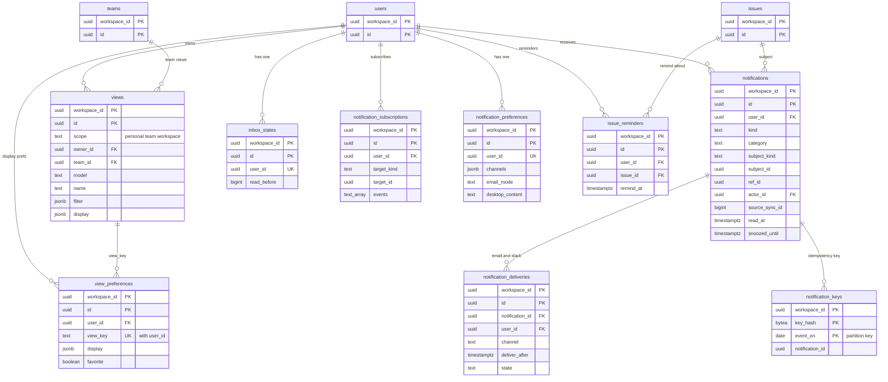

# Data model: ビュー・通知・インボックス

[data-model.md](../data-model.md) の一部。規約は、そちらの 2 節に従う。振る舞いは [views-and-filters.md](../views-and-filters.md) の 7 節、[notifications-and-inbox.md](../notifications-and-inbox.md) を正とする。決定は [ADR-0028](../../decisions/0028-filter-language-and-shared-evaluation.md)、[ADR-0029](../../decisions/0029-view-coverage-planner-and-server-query.md)、[ADR-0036](../../decisions/0036-notifications-derived-by-notifier.md)、[ADR-0037](../../decisions/0037-notification-delivery-channels.md)。

すべてワークスペースの表（`workspace_id`、複合キー、FORCE RLS）。

| 表 | 種類 | グループ | 読み込み |
| --- | --- | --- | --- |
| `views` | モデル `View` | `view_scope` | instant |
| `view_preferences` | モデル `ViewPreference` | `user` | instant |
| `notifications` | モデル `Notification` | `user` | instant |
| `inbox_states` | モデル `InboxState` | `user` | instant |
| `notification_subscriptions` | モデル `NotificationSubscription` | `user` | instant |
| `notification_preferences` | モデル `NotificationPreference` | `user` | instant |
| `issue_reminders` | モデル `IssueReminder` | `user` | instant |
| `notification_keys` | サーバーだけ | — | — |
| `notification_deliveries` | サーバーだけ | — | — |

## 1. ER 図

- `notifications.subject_id` は `subject_kind` で `issues`・`projects`・`project_updates`・`teams`・`views` のどれかを指す（多相。図はイシューだけを描いた）。
- `view_preferences.view_key` は `View` の ID か、既定のビューの名前（`team:<id>:active` など）。既定のビューは行を持たないので、外部キーは張らない。

## 2. ビュー

### views（`View`）

保存したビュー（[views-and-filters.md](../views-and-filters.md) の 7.1 節）。

- モデル：グループ `view_scope`（`personal` は `user:<owner_id>`、`team` は `team:<team_id>`、`workspace` は `members`）、`instant`、`delete: hard`。

| 列 | 型 | NULL | 既定 | 競合 | 説明 |
| --- | --- | --- | --- | --- | --- |
| `scope` | `text` | NO | | `server_only`、`enum<personal,team,workspace>` | 変えない（複製して消す） |
| `owner_id` | `uuid` | YES | | `lww`、`ref:User`、`on_delete: nullify` | 持ち主 |
| `team_id` | `uuid` | YES | | `server_only`、`ref:Team`、`on_delete: cascade` | `scope = team` のとき必須 |
| `model` | `text` | NO | `'Issue'` | `server_only`、`enum<Issue,Project>` | |
| `name` | `text` | NO | | `lww`、`max: 80`、`pii: content` | |
| `filter` | `jsonb` | NO | | `lww`、`schema: Filter` | 参照の範囲の規則（DT-VIEW-003） |
| `display` | `jsonb` | NO | | `lww`、`schema: ViewDisplay` | |

- 主キー：`(workspace_id, id)`。
- 索引：`(workspace_id, owner_id) WHERE scope = 'personal'`、`(workspace_id, team_id) WHERE scope = 'team'`。
- CHECK：`(scope = 'team') = (team_id IS NOT NULL)`、`scope = 'personal'` なら `owner_id IS NOT NULL`。
- S1 の規模：約 50 万行。

### view_preferences（`ViewPreference`）

個人の表示の設定とお気に入り。

- モデル：グループ `user`（`from: user_id`）、`instant`、`delete: hard`。

| 列 | 型 | NULL | 既定 | 競合 | 説明 |
| --- | --- | --- | --- | --- | --- |
| `user_id` | `uuid` | NO | | `server_only`、`ref:User`、`on_delete: cascade` | |
| `view_key` | `text` | NO | | `server_only`、`max: 128` | `View` の ID か既定のビューの名前 |
| `display` | `jsonb` | NO | | `lww`、`schema: ViewDisplay` | |
| `favorite` | `boolean` | NO | `false` | `lww` | |

- 主キー：`(workspace_id, id)`。一意：`(workspace_id, user_id, view_key)`。
- 行の作り方：同じ `(user_id, view_key)` の行は 1 つ。2 台の端末が同時に初めての行を作ると、後の `create` は一意の制約で `already_exists` になる。クライアントは拒否を示さず、差分で届いた行に `set` を当て直す（[issues-and-workflow.md](../issues-and-workflow.md) の 7 節の関連と同じ扱い）。
- S1 の規模：約 100 万行。

## 3. 通知

### notifications（`Notification`）

インボックスの行。中身（タイトルなど）を持たない（[notifications-and-inbox.md](../notifications-and-inbox.md) の 4.2 節）。通知係（`origin = notifier`）が書く。

- モデル：グループ `user`（`from: user_id`）、`instant`（1 人 2,000 件まで）、`delete: hard`。

| 列 | 型 | NULL | 既定 | 競合 | 説明 |
| --- | --- | --- | --- | --- | --- |
| `user_id` | `uuid` | NO | | `server_only`、`ref:User`、`on_delete: cascade`、`index` | 受け手 |
| `kind` | `text` | NO | | `server_only`、`enum<assigned,…,view_references_private_team>` | DT-NOTIF-001 の 17 種 |
| `category` | `text` | NO | | `server_only`、`enum<assignments,mentions,comments,status_changes,triage,projects,reactions,reminders,system>` | |
| `subject_kind` | `text` | NO | | `server_only`、`enum<issue,project,project_update,team,view>` | |
| `subject_id` | `uuid` | NO | | `server_only`、`index` | |
| `ref_id` | `uuid` | YES | | `server_only` | コメントなど |
| `actor_id` | `uuid` | YES | | `server_only`、`ref:User`、`on_delete: nullify` | |
| `urgent` | `boolean` | NO | `false` | `server_only` | |
| `source_sync_id` | `bigint` | NO | | `server_only` | 元の変更の `sync_id`。定期の事象は予定の時刻から作った値 |
| `read_at` | `timestamptz` | YES | | `lww` | |
| `snoozed_until` | `timestamptz` | YES | | `lww` | |

- 主キー：`(workspace_id, id)`。
- 索引：`(workspace_id, user_id, source_sync_id DESC)`（並びと、2,000 件を超えた分の古い順の削除）、`(workspace_id, subject_kind, subject_id)`（主題が読めなくなった人の通知を消す。[notifications-and-inbox.md](../notifications-and-inbox.md) の 7 節）。
- 上限：1 人 2,000 件。超えた分は通知係が同じトランザクションで `delete`。
- 保持：上限と本人の削除だけ。時間では消さない。
- S1 の規模：15 万人 × 平均 500 で約 7,500 万行。1 行 約 300 バイト。

### inbox_states（`InboxState`）

「全部を既読」の水位。1 人 1 行。

- モデル：グループ `user`（`from: user_id`）、`instant`、`delete: hard`。

| 列 | 型 | NULL | 既定 | 競合 | 説明 |
| --- | --- | --- | --- | --- | --- |
| `user_id` | `uuid` | NO | | `server_only`、`ref:User`、`on_delete: cascade` | |
| `read_before` | `bigint` | YES | | `lww` | この `source_sync_id` 以下を既読とみなす |

- 主キー：`(workspace_id, id)`。一意：`(workspace_id, user_id)`。
- 作る時：`User` を作る Writer のトランザクション（派生）。2 台の同時の初めての作成を避けるため、クライアントは作らない。
- S1 の規模：`users` と同じ。

### notification_subscriptions（`NotificationSubscription`）

プロジェクトとチームの購読。イシューの購読は `issues.subscriber_ids`（[issues.md](issues.md)）。

- モデル：グループ `user`（`from: user_id`）、`instant`、`delete: hard`。

| 列 | 型 | NULL | 既定 | 競合 | 説明 |
| --- | --- | --- | --- | --- | --- |
| `user_id` | `uuid` | NO | | `server_only`、`ref:User`、`on_delete: cascade`、`index` | |
| `target_kind` | `text` | NO | | `server_only`、`enum<project,team>` | |
| `target_id` | `uuid` | NO | | `server_only`、`index` | 多相 |
| `events` | `text[]` | NO | `'{}'` | `set`、`set<string>`、`max: 10` | チームは `issue_created`・`triage` |

- 主キー：`(workspace_id, id)`。一意：`(workspace_id, user_id, target_kind, target_id)`。
- 索引：`(workspace_id, target_kind, target_id)`（通知係が購読者を引く）。
- S1 の規模：約 300 万行。

### notification_preferences（`NotificationPreference`）

まとまりごとの手段。1 人 1 行。

- モデル：グループ `user`（`from: user_id`）、`instant`、`delete: hard`。

| 列 | 型 | NULL | 既定 | 競合 | 説明 |
| --- | --- | --- | --- | --- | --- |
| `user_id` | `uuid` | NO | | `server_only`、`ref:User`、`on_delete: cascade` | |
| `channels` | `jsonb` | NO | 4.3 節の既定 | `lww`、`schema: NotificationChannels` | `{<category>: {inbox, desktop, email, slack}}` |
| `email_mode` | `text` | NO | `'digest'` | `lww`、`enum<digest,immediate,off>` | |
| `desktop_content` | `text` | NO | `'full'` | `lww`、`enum<full,minimal>` | |

- 主キー：`(workspace_id, id)`。一意：`(workspace_id, user_id)`。
- 作る時：`InboxState` と同じく `User` の作成の派生。
- S1 の規模：`users` と同じ。

### issue_reminders（`IssueReminder`）

イシューの「後で知らせる」（[notifications-and-inbox.md](../notifications-and-inbox.md) の 6.3 節）。

- モデル：グループ `user`（`from: user_id`）、`instant`、`delete: hard`。

| 列 | 型 | NULL | 既定 | 競合 | 説明 |
| --- | --- | --- | --- | --- | --- |
| `user_id` | `uuid` | NO | | `server_only`、`ref:User`、`on_delete: cascade`、`index` | |
| `issue_id` | `uuid` | NO | | `server_only`、`ref:Issue`、`on_delete: cascade` | |
| `remind_at` | `timestamptz` | NO | | `lww` | サーバーの時計で判定 |

- 主キー：`(workspace_id, id)`。一意：`(workspace_id, user_id, issue_id)`（1 人 1 イシューに 1 つ。時刻を変えるのは `set remind_at`）。
- 索引：`(remind_at)`（関数 `scheduler_due_items('issue_reminder', …)` が期限の来た行の `workspace_id` と `id` を返す）。
- 知らせた後：通知係が `reminder` の通知を作る同じトランザクションで、この行を `delete` する。
- S1 の規模：数万行。

### notification_keys

通知の冪等の鍵（[notifications-and-inbox.md](../notifications-and-inbox.md) の 5.2 節）。

| 列 | 型 | NULL | 既定 | 説明 |
| --- | --- | --- | --- | --- |
| `workspace_id` | `uuid` | NO | | |
| `key_hash` | `bytea` | NO | | `SHA-256(user_id ‖ kind ‖ subject_id ‖ ref_id ‖ source_sync_id)` |
| `event_on` | `date` | NO | | パーティションの鍵。**事象の日**（元の変更の `sync_actions.committed_at` の日、定期の事象は予定の日） |
| `notification_id` | `uuid` | YES | | 作った通知の ID（受け手の設定で作らなかった時は NULL） |
| `created_at` | `timestamptz` | NO | `now()` | |

- 主キー：`(workspace_id, key_hash, event_on)`。同じ事象の再配送は同じ `event_on` を持つので、主キーで重複を捨てられる（`INSERT … ON CONFLICT DO NOTHING`。I-15）。
- パーティション：`RANGE (event_on)`、1 日。保持 30 日（`DROP`）。
- S1 の規模：1 日 数百万行。

> パーティションの鍵を「書いた日」ではなく「事象の日」にするのは、この文書で決めた（[data-model.md](../data-model.md) の 7 節）。書いた日で切ると、日をまたいだ再配送の重複を主キーで捨てられない。

### notification_deliveries

メールと Slack の送りの予定と結果（[notifications-and-inbox.md](../notifications-and-inbox.md) の 8.2・8.3 節）。

| 列 | 型 | NULL | 既定 | 説明 |
| --- | --- | --- | --- | --- |
| `workspace_id` | `uuid` | NO | | |
| `id` | `uuid` | NO | | UUIDv7 |
| `notification_id` | `uuid` | NO | | |
| `user_id` | `uuid` | NO | | 受け手 |
| `channel` | `text` | NO | | `email`・`slack` |
| `deliver_after` | `timestamptz` | NO | | DT-NOTIF-002 |
| `state` | `text` | NO | `'scheduled'` | `scheduled`・`sent`・`dropped`・`failed` |
| `drop_reason` | `text` | YES | | `read`・`snoozed`・`deleted`・`forbidden`・`inactive`・`unlinked`・`bounced` |
| `batch_id` | `uuid` | YES | | 1 通にまとめた送りの ID |
| `provider_message_id` | `text` | YES | | SES・Slack の ID |
| `sent_at` | `timestamptz` | YES | | |
| `created_at` | `timestamptz` | NO | `now()` | |

- 主キー：`(workspace_id, id)`。一意：`(workspace_id, notification_id, channel)`。
- 外部キー：`(workspace_id, notification_id)` → `notifications`（`ON DELETE CASCADE`。通知の削除で予定も消える。送る前の確かめの「行が消された」に当たる）。
- 索引：`(deliver_after) WHERE state = 'scheduled'`（関数 `scheduler_due_items('notification_delivery', …)`）、`(workspace_id, user_id, sent_at)`（10 分の間隔の判定）。
- CHECK：`channel IN ('email','slack')`、`state` の値、`state = 'dropped'` と `drop_reason IS NOT NULL` は同値。
- 保持：`sent`・`dropped`・`failed` の行は 30 日で消す（1 日 1 回のジョブ。本システムの値）。
- 書く主体：通知係（予定）、送り係（結果）。
- S1 の規模：1 日 数十万行。
