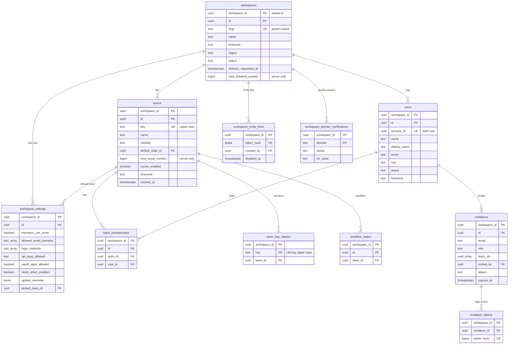
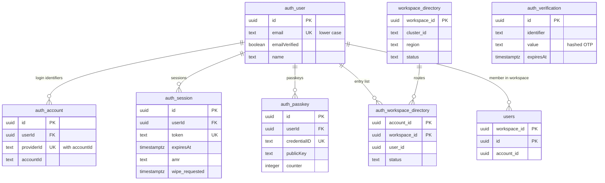

# Data model: ワークスペース・チーム・メンバー・アカウント

[data-model.md](../data-model.md) の一部。規約は、そちらの 2 節に従う。振る舞いは [permissions-and-teams.md](../permissions-and-teams.md)、[accounts-and-auth.md](../accounts-and-auth.md)、[issues-and-workflow.md](../issues-and-workflow.md) の 3.1 節、[cycles-and-projects.md](../cycles-and-projects.md) の 3.1 節、[integrations.md](../integrations.md) の 4.4 節、[infrastructure.md](../infrastructure.md) の 10.1 節を正とする。決定は [ADR-0004](../../decisions/0004-tenancy-and-permissions.md)、[ADR-0020](../../decisions/0020-ids-and-human-identifiers.md)、[ADR-0032](../../decisions/0032-single-policy-module-and-group-mapping.md)、[ADR-0033](../../decisions/0033-team-visibility-changes-and-guests.md)、[ADR-0034](../../decisions/0034-accounts-with-better-auth.md)、[ADR-0035](../../decisions/0035-sessions-and-sync-ticket.md)、[ADR-0051](../../decisions/0051-workspace-sharding-and-cells.md)。

| 表 | 種類 | テナント |
| --- | --- | --- |
| `workspaces` | モデル `Workspace` | 根（RLS あり。`workspace_id = id`） |
| `workspace_settings` | モデル `WorkspaceSettings` | 内 |
| `users` | モデル `User` | 内 |
| `teams` | モデル `Team` | 内 |
| `team_memberships` | モデル `TeamMembership` | 内 |
| `team_key_aliases` | サーバーだけ | 内 |
| `invitations` | モデル `Invitation` | 内 |
| `invitation_tokens` | サーバーだけ | 内 |
| `workspace_invite_links` | サーバーだけ | 内 |
| `workspace_domain_verifications` | サーバーだけ | 内 |
| `auth.user`・`auth.account`・`auth.session`・`auth.verification`・`auth.passkey` | Better Auth | **外**（`auth` スキーマ） |
| `auth.workspace_directory` | 入り口の写し | **外** |
| `workspace_directory` | S2 からの振り分け | **外**（ディレクトリのクラスタ） |

## 1. ER 図

### 1.1 ワークスペースとチーム

- `workspaces` と `workspace_settings` は 1 対 1。`teams.default_state_id` と `workflow_states.team_id` は互いを参照する（外部キーは `DEFERRABLE INITIALLY DEFERRED`。チームと状態は同じトランザクションで作る）。

### 1.2 アカウント（`auth` スキーマ）と振り分け

- 図の `auth_user` などは `auth.user` などを表す（Mermaid の実体の名前に `.` を使えないため）。`auth_verification` は他の表と外部キーで結ばない（`identifier` がメールアドレスを持つ）。
- `auth_user` と `users` の線は、ワークスペースごとの `users.account_id` の論理のつながり。スキーマをまたぐので外部キーは張らない（ADR-0034）。

## 2. ワークスペース

### workspaces（`Workspace`）

ワークスペースの行（[permissions-and-teams.md](../permissions-and-teams.md) の 3.3 節）。

- モデル：グループ `workspace`（`guest_visible`：名前・slug・タイムゾーンはゲストの画面と URL に要る）、`instant`、`delete: hard`（消すのは削除のジョブだけ）。
- 共通の列を持つ。`workspace_id = id`（CHECK）。

| 列 | 型 | NULL | 既定 | 競合 | 説明 |
| --- | --- | --- | --- | --- | --- |
| `slug` | `text` | NO | | `lww`、`max: 48` | URL の `/<workspace-slug>/`。全体で一意 |
| `name` | `text` | NO | | `lww`、`max: 80` | |
| `timezone` | `text` | NO | `'Asia/Tokyo'` | `lww`、`max: 64` | IANA の名前 |
| `region` | `text` | NO | `'tokyo'` | `server_only`、`enum<tokyo>` | 作る時に決め、変えない |
| `status` | `text` | NO | `'active'` | `server_only`、`enum<active,pending_deletion,moving>` | `pending_deletion` は `forbidden`、`moving` は `retry` |
| `deletion_requested_at` | `timestamptz` | YES | | `server_only` | |
| `next_initiative_number` | `bigint` | NO | `1` | サーバーだけの列（モデルにない） | イニシアチブの番号（`I-123`）の次の値。Writer が振る |

- 主キー：`(workspace_id, id)`。一意：`(slug)`（全体。`lower(slug)`）。
- CHECK：`workspace_id = id`、`slug ~ '^[a-z0-9][a-z0-9-]{0,47}$'`、`region IN ('tokyo')`、`status IN (...)`、`status = 'pending_deletion'` と `deletion_requested_at IS NOT NULL` は同値。
- 索引：主キー、`(lower(slug))` 一意（関数 `resolve_workspace_slug`。[data-model.md](../data-model.md) の 5 節）。
- RLS：`workspace_id = current_setting('app.workspace_id')::uuid`。slug からの引きは関数だけ。
- 書く主体：`slug`・`name`・`timezone` は DT-PERM-002。`status`・`region`・`deletion_requested_at` は Writer のシステムのトランザクション（削除・移動のジョブ）。
- 削除：[security.md](../security.md) の 9.1 節の削除のジョブ（依頼から 30 日）。
- S1 の規模：5,000 行。

### workspace_settings（`WorkspaceSettings`）

ゲストに届けないワークスペースの設定（[permissions-and-teams.md](../permissions-and-teams.md) の 3.3 節）。

- モデル：グループ `workspace_members`（`members`）、`instant`、`delete: hard`。1 ワークスペース 1 行。

| 列 | 型 | NULL | 既定 | 競合 | 説明 |
| --- | --- | --- | --- | --- | --- |
| `members_can_invite` | `boolean` | NO | `false` | `lww` | |
| `allowed_email_domains` | `text[]` | NO | `'{}'` | `set`、`max: 10` | 確認の状態は `workspace_domain_verifications` |
| `login_methods` | `text[]` | NO | `'{email_otp,google,passkey}'` | `set`、`max: 4` | 後に `saml` |
| `api_keys_allowed` | `text` | NO | `'all'` | `lww`、`enum<all,admins,none>` | |
| `oauth_apps_allowed` | `boolean` | NO | `true` | `lww` | |
| `slack_unfurl_enabled` | `boolean` | NO | `true` | `lww` | |
| `update_reminder` | `jsonb` | NO | `'{"cadence":"weekly","weekday":5,"hour":10}'` | `lww`、`schema: UpdateReminder` | |
| `default_team_id` | `uuid` | YES | | `lww`、`ref:Team`、`on_delete: nullify` | |

- 主キー：`(workspace_id, id)`。一意：`(workspace_id)`（1 行）。
- 外部キー：`(workspace_id, default_team_id)` → `teams`（`ON DELETE SET NULL` は Writer の `on_delete` で当て、DB は `NO ACTION`）。
- CHECK：`cardinality(allowed_email_domains) <= 10`、`login_methods <@ '{email_otp,google,passkey,saml}'`、`cardinality(login_methods) >= 1`。
- 書く主体：`login_methods` は `owner` だけ、他は `owner`・`admin`（DT-PERM-002）。
- S1 の規模：5,000 行。

### users（`User`）

ワークスペースの中の人（[permissions-and-teams.md](../permissions-and-teams.md) の 3.2 節）。アカウント（`auth.user`）とは別。

- モデル：グループ `workspace`（`guest_visible`：担当の候補とメンションで人を選ぶ）、`instant`、`delete: hard`（実際には消さず、停止と仮名にする。[security.md](../security.md) の 9.2 節）。

| 列 | 型 | NULL | 既定 | 競合 | 説明 |
| --- | --- | --- | --- | --- | --- |
| `account_id` | `uuid` | NO | | `server_only`、`api: internal` | `auth.user.id` |
| `name` | `text` | NO | | `lww`、`max: 128`、`pii: identity` | |
| `display_name` | `text` | NO | | `lww`、`max: 64`、`pii: identity` | |
| `email` | `text` | NO | | `server_only`、`max: 320`、`pii: identity` | アカウントの写し。変更は Worker が写す |
| `avatar_url` | `text` | YES | | `lww`、`max: 1024` | |
| `role` | `text` | NO | `'member'` | `lww`、`enum<owner,admin,member,guest>` | |
| `status` | `text` | NO | `'active'` | `lww`、`enum<active,suspended>` | |
| `timezone` | `text` | NO | `'Asia/Tokyo'` | `lww`、`max: 64` | |

- 主キー：`(workspace_id, id)`。一意：`(workspace_id, account_id)`（1 アカウント 1 ワークスペースに 1 人。I-9）。
- 索引：`(workspace_id, lower(email))`（インポートの利用者の対応付け、招待の重複の確認）。
- CHECK：`role`・`status` の値。
- 書く主体：`role`・`status` は `manage_member`（DT-PERM-002）。Writer は同じトランザクションで購読を計算し直す。最後のオーナーの降格・停止は `workflow_violation`（I-10）。
- S1 の規模：約 15 万行（月間 10 万人 × 1.5）。

## 3. チーム

### teams（`Team`）

チームと、その設定。ワークフロー・見積もり・自動の処理・サイクル・PR の自動化の列を持つ。

- モデル：グループ `team_row`（公開：`workspace`、非公開：`team:<id>` と `role:admin`）、`instant`、`archivable`、`delete: trash`（30 日）。

| 列 | 型 | NULL | 既定 | 競合 | 説明（定義の場所） |
| --- | --- | --- | --- | --- | --- |
| `key` | `text` | NO | | `lww`、`max: 7` | `^[A-Z][A-Z0-9]{0,6}$`（[data-model-and-schema.md](../data-model-and-schema.md) の 5.2 節） |
| `name` | `text` | NO | | `lww`、`max: 80` | |
| `visibility` | `text` | NO | `'public'` | `lww`、`enum<public,private>` | 変えると購読を計算し直す |
| `next_issue_number` | `bigint` | NO | `1` | サーバーだけの列（モデルにない） | 次のイシューの番号（5.3 節） |
| `default_state_id` | `uuid` | NO | | `lww`、`ref:WorkflowState`、`on_delete: restrict` | [issues-and-workflow.md](../issues-and-workflow.md) の 3.1 節 |
| `triage_enabled` | `boolean` | NO | `false` | `lww` | 同上 |
| `estimate_scale` | `text` | NO | `'none'` | `lww`、`enum<none,exponential,fibonacci,linear,tshirt>` | 同上 |
| `estimate_extended`・`estimate_allow_zero` | `boolean` | NO | `false` | `lww` | 同上 |
| `unestimated_as_one` | `boolean` | NO | `true` | `lww` | 同上 |
| `auto_close_months` | `smallint` | NO | `6` | `lww`、`enum<0,1,3,6,9,12>` | 同上 |
| `auto_close_state_id` | `uuid` | YES | | `lww`、`ref:WorkflowState`、`on_delete: nullify` | 同上 |
| `auto_archive_months` | `smallint` | NO | `6` | `lww`、`enum<1,3,6,9,12>` | 同上 |
| `parent_auto_close`・`sub_auto_close` | `boolean` | NO | `false` | `lww` | 同上 |
| `git_on_draft`・`git_on_open`・`git_on_review`・`git_on_merge` | `uuid` | YES | | `lww`、`ref:WorkflowState`、`on_delete: nullify` | [integrations.md](../integrations.md) の 4.4 節 |
| `git_link_comment` | `boolean` | NO | `true` | `lww` | 同上 |
| `cycles_enabled` | `boolean` | NO | `false` | `lww` | [cycles-and-projects.md](../cycles-and-projects.md) の 3.1 節 |
| `cycle_weeks` | `smallint` | NO | `2` | `lww`、`enum<1..8>` | 同上 |
| `cycle_cooldown_weeks` | `smallint` | NO | `0` | `lww`、`enum<0..4>` | 同上 |
| `cycle_start_weekday` | `smallint` | NO | `1` | `lww`、`enum<1..7>` | ISO の曜日 |
| `cycle_upcoming` | `smallint` | NO | `3` | `lww`、`range: [1, 15]` | |
| `cycle_auto_add_started` | `boolean` | NO | `true` | `lww` | |
| `timezone` | `text` | NO | ワークスペースの値 | `lww`、`max: 64` | サイクルの境界 |
| `trashed_at` | `timestamptz` | YES | | `lww` | `delete: trash` の列（[data-model.md](../data-model.md) の 2.6 節） |

- 主キー：`(workspace_id, id)`。一意：`(workspace_id, upper(key))`。
- 外部キー：`(workspace_id, default_state_id)`・`auto_close_state_id`・`git_on_*` → `workflow_states`（`DEFERRABLE INITIALLY DEFERRED`）。
- CHECK：`key ~ '^[A-Z][A-Z0-9]{0,6}$'`、各 `enum` の値、`next_issue_number >= 1`。
- 横断の一意：`key` は、同じワークスペースの `team_key_aliases.key` のどれとも重ならない（別のチームの古い識別子を使わせない）。2 つの表にまたがるので、Writer がロックの中で確かめる（I-7）。
- 書く主体：作成・削除・公開の切り替えは DT-PERM-002、設定は `update_settings`。チームを作る Writer のトランザクションが、最低の状態（`backlog`・`unstarted`・`started`・`completed`・`canceled`・`duplicate`）と `ProgressStat` の行を同時に作る。
- S1 の規模：約 3 万行（ワークスペースあたり平均 6）。

### team_memberships（`TeamMembership`）

チームのメンバー。作ると参加、消すと脱退。

- モデル：グループ `team_row`（`from: team_id`。チームの行と同じ）、`instant`、`delete: hard`。

| 列 | 型 | NULL | 既定 | 競合 | 説明 |
| --- | --- | --- | --- | --- | --- |
| `team_id` | `uuid` | NO | | `server_only`、`ref:Team`、`on_delete: cascade`、`index` | |
| `user_id` | `uuid` | NO | | `server_only`、`ref:User`、`on_delete: cascade`、`index` | |

- 主キー：`(workspace_id, id)`。一意：`(workspace_id, team_id, user_id)`。
- 外部キー：`(workspace_id, team_id)` → `teams`、`(workspace_id, user_id)` → `users`。
- 索引：一意の索引（チームのメンバーの一覧）、`(workspace_id, user_id)`（`groupsFor` の計算）。
- 書く時：参加・脱退は、同じトランザクションで `SyncSubscription` を足す・消す。非公開のチームの脱退は `narrowing_outbox` にも書く（`team_leave`）。
- S1 の規模：約 40 万行。

### team_key_aliases

チームの古い識別子（[data-model-and-schema.md](../data-model-and-schema.md) の 5.4 節）。`resolve(key, number)` と PR の識別子の引き（[integrations.md](../integrations.md) の 4.2 節）で使う。

| 列 | 型 | NULL | 既定 | 説明 |
| --- | --- | --- | --- | --- |
| `workspace_id` | `uuid` | NO | | |
| `key` | `text` | NO | | 大文字に正規化した古い識別子 |
| `team_id` | `uuid` | NO | | 今のチーム |
| `created_at` | `timestamptz` | NO | `now()` | |

- 主キー：`(workspace_id, key)`。外部キー：`(workspace_id, team_id)` → `teams`（`ON DELETE CASCADE`。チームの消去で一緒に消える）。
- 書く時：`Team.key` を変える Writer のトランザクション（派生）。チームの今の識別子と同じ値の別名は書かない（戻したときは別名の行を消す）。
- 同期しない：クライアントは、手元のチームの今の識別子と `IssueAlias` で引き、なければ `GET /sync/resolve` を使う。
- S1 の規模：数千行。

## 4. 招待

### invitations（`Invitation`）

招待（[accounts-and-auth.md](../accounts-and-auth.md) の 7.1 節）。トークンは持たない。

- モデル：グループ `admin`（`role:admin`）、`instant`、`delete: hard`。

| 列 | 型 | NULL | 既定 | 競合 | 説明 |
| --- | --- | --- | --- | --- | --- |
| `email` | `text` | NO | | `server_only`、`max: 320`、`pii: identity` | 小文字 |
| `role` | `text` | NO | `'member'` | `server_only`、`enum<admin,member,guest>` | `guest` はフラグの裏 |
| `team_ids` | `uuid[]` | NO | `'{}'` | `set`、`set<ref:Team>`、`max: 50`、`on_delete: remove` | |
| `invited_by` | `uuid` | YES | | `server_only`、`ref:User`、`on_delete: nullify` | |
| `expires_at` | `timestamptz` | NO | 作成 + 7 日 | `server_only` | |
| `status` | `text` | NO | `'pending'` | `server_only`、`enum<pending,accepted,revoked,expired>` | |

- 主キー：`(workspace_id, id)`。
- 一意：`(workspace_id, lower(email)) WHERE status = 'pending'`（同じ人への未処理の招待は 1 つ。作り直しは前の行を `revoked` にしてから）。
- 索引：`(workspace_id, expires_at) WHERE status = 'pending'`（期限切れのジョブが `expired` にする）。
- 保持：`accepted`・`revoked`・`expired` の行は 90 日で消す（Worker。本システムの値）。
- S1 の規模：数万行。

### invitation_tokens

招待のトークンのハッシュ。同期しない（[accounts-and-auth.md](../accounts-and-auth.md) の 7.1 節）。

| 列 | 型 | NULL | 既定 | 説明 |
| --- | --- | --- | --- | --- |
| `workspace_id` | `uuid` | NO | | |
| `invitation_id` | `uuid` | NO | | |
| `token_hash` | `bytea` | NO | | SHA-256 |
| `created_at` | `timestamptz` | NO | `now()` | |

- 主キー：`(workspace_id, invitation_id)`（作り直しで置き換える。前のトークンは無効）。一意：`(token_hash)`。
- 外部キー：`(workspace_id, invitation_id)` → `invitations`（`ON DELETE CASCADE`）。
- 引き方：招待の URL は `/<workspace-slug>/join?t=…` の形にし、認証のサービスは `resolve_workspace_slug` で決めたワークスペースのコンテキストの中で `token_hash` を引く（ワークスペースをまたいで引かない）。
- S1 の規模：`invitations` の `pending` と同じ。

### workspace_invite_links

ワークスペースの招待のリンク（1 つ）。

| 列 | 型 | NULL | 既定 | 説明 |
| --- | --- | --- | --- | --- |
| `workspace_id` | `uuid` | NO | | |
| `token_hash` | `bytea` | NO | | SHA-256 |
| `created_by` | `uuid` | NO | | `users.id` |
| `created_at` | `timestamptz` | NO | `now()` | |
| `disabled_at` | `timestamptz` | YES | | 無効にした時刻。既定は無効（作った時に NULL にする） |

- 主キー：`(workspace_id)`（作り直しで行を置き換える）。一意：`(token_hash)`。
- 引き方：`invitation_tokens` と同じく、slug で決めたコンテキストの中。
- S1 の規模：5,000 行以下。

### workspace_domain_verifications

許可したドメインの持ち主の確認（DNS の TXT）。

| 列 | 型 | NULL | 既定 | 説明 |
| --- | --- | --- | --- | --- |
| `workspace_id` | `uuid` | NO | | |
| `domain` | `text` | NO | | 小文字 |
| `txt_value` | `text` | NO | | 置いてもらう TXT の値（乱数） |
| `status` | `text` | NO | `'pending'` | `pending`・`verified`・`failed` |
| `checked_at` | `timestamptz` | YES | | |
| `verified_at` | `timestamptz` | YES | | |
| `created_at` | `timestamptz` | NO | `now()` | |

- 主キー：`(workspace_id, domain)`。
- CHECK：公開のメールのドメインの一覧（`gmail.com` など）に入らないことは、アプリで確かめる（一覧が変わるため DB に置かない）。
- 関係：`WorkspaceSettings.allowed_email_domains` に足せるのは `verified` のドメインだけ（Writer の検証）。
- 保持：ドメインを外すまで。
- S1 の規模：数千行。

## 5. アカウント（`auth` スキーマ）

Better Auth の表（[accounts-and-auth.md](../accounts-and-auth.md) の 3.3 節）。表と列の名前は Better Auth の既定のまま（列は camelCase）。ID は `advanced.database.generateId` で UUIDv7 を渡す。RLS の外で、DB のロール `auth` だけが読み書きする。

### auth.user

| 列 | 型 | NULL | 説明 |
| --- | --- | --- | --- |
| `id` | `uuid` | NO | アカウントの ID（`users.account_id`） |
| `name` | `text` | NO | |
| `email` | `text` | NO | 小文字 |
| `emailVerified` | `boolean` | NO | メールの OTP か Google の `email_verified` で真 |
| `image` | `text` | YES | |
| `createdAt`・`updatedAt` | `timestamptz` | NO | |

- 主キー：`(id)`。一意：`(email)`。
- 削除：本人の削除で行を消す（[accounts-and-auth.md](../accounts-and-auth.md) の 4.3 節）。
- S1 の規模：約 12 万行。

### auth.account

ログインの手段の識別子（Google の `sub` など）。

| 列 | 型 | NULL | 説明 |
| --- | --- | --- | --- |
| `id` | `uuid` | NO | |
| `userId` | `uuid` | NO | `auth.user.id` |
| `providerId` | `text` | NO | `google`・`email-otp` など |
| `accountId` | `text` | NO | 提供者の中の ID |
| `accessToken`・`refreshToken`・`idToken`・`scope`・`accessTokenExpiresAt`・`refreshTokenExpiresAt`・`password` | 各型 | YES | 使わない（範囲 `openid email profile` のトークンを使う処理を持たない。パスワードは使わない）。保存させない設定の有無は**未検証**（E4 の `auth-service-skeleton` で確かめる） |
| `createdAt`・`updatedAt` | `timestamptz` | NO | |

- 主キー：`(id)`。一意：`(providerId, accountId)`（DT-AUTH-001 の行 1）。索引：`(userId)`。

### auth.session

| 列 | 型 | NULL | 説明 |
| --- | --- | --- | --- |
| `id` | `uuid` | NO | `session_id`（チケット、`auth:revoked`） |
| `userId` | `uuid` | NO | |
| `token` | `text` | NO | クッキーの値。ハッシュで持つかは部品の既定（**未検証**。[security.md](../security.md) の 7 節） |
| `expiresAt` | `timestamptz` | NO | 使わないまま 30 日 |
| `ipAddress`・`userAgent` | `text` | YES | |
| `activeOrganizationId` | — | — | 使わない（`organization` の部品を入れない） |
| `amr` | `text` | NO | 追加の列。`email_otp`・`google`・`passkey`（後に `saml`） |
| `wipe_requested` | `timestamptz` | YES | 追加の列。遠隔の消去の求めの時刻（DT-AUTH-002 の行 1） |
| `createdAt`・`updatedAt` | `timestamptz` | NO | |

- 主キー：`(id)`。一意：`(token)`。索引：`(userId)`（全部の端末からのログアウト、セッションの一覧）。
- 削除：切れた行は Better Auth の既定で消える（残り方は E4 で確かめる）。`wipe_requested` のある行は、端末が次にチケットを求めるまで消さない。
- S1 の規模：約 30 万行。

### auth.verification

メールの OTP（`hashed`）。

| 列 | 型 | NULL | 説明 |
| --- | --- | --- | --- |
| `id` | `uuid` | NO | |
| `identifier` | `text` | NO | 部品が作る鍵（メールアドレスを含む） |
| `value` | `text` | NO | ハッシュにしたコード |
| `expiresAt` | `timestamptz` | NO | 10 分 |
| `createdAt`・`updatedAt` | `timestamptz` | NO | |

- 主キー：`(id)`。索引：`(identifier)`。
- 削除：期限の後に部品が消す。

### auth.passkey

| 列 | 型 | NULL | 説明 |
| --- | --- | --- | --- |
| `id` | `uuid` | NO | |
| `name` | `text` | YES | |
| `userId` | `uuid` | NO | |
| `credentialID` | `text` | NO | |
| `publicKey` | `text` | NO | |
| `counter` | `integer` | NO | |
| `deviceType`・`backedUp`・`transports`・`aaguid` | 各型 | YES | |
| `createdAt` | `timestamptz` | YES | |

- 主キー：`(id)`。一意：`(credentialID)`。索引：`(userId)`。
- 上限：1 アカウント 10 個（認証のサービスで確かめる）。

### auth.workspace_directory

アカウントから入れるワークスペースの一覧（入り口の写し。[accounts-and-auth.md](../accounts-and-auth.md) の 4.1 節）。権限の判定には使わない。

| 列 | 型 | NULL | 既定 | 説明 |
| --- | --- | --- | --- | --- |
| `account_id` | `uuid` | NO | | |
| `workspace_id` | `uuid` | NO | | |
| `user_id` | `uuid` | NO | | |
| `status` | `text` | NO | | `active`・`suspended` |
| `workspace_name`・`workspace_slug` | `text` | NO | | 一覧に出す名前と slug（写し） |
| `synced_sync_id` | `bigint` | NO | | 写した変更の `sync_id`。古い写しで上書きしない |
| `updated_at` | `timestamptz` | NO | `now()` | |

- 主キー：`(account_id, workspace_id)`。
- 書く主体：Relay の流れの Worker（`directory-sync`）が、`User`・`Workspace` の変更を受けて、関数 `auth.upsert_workspace_directory(...)`（`SECURITY DEFINER`、持ち主 `migrator`、実行できるのは `worker`）で書く。`synced_sync_id` が大きいときだけ書く。
- 削除：`User` の停止は `status = suspended`、ワークスペースの削除で行を消す。
- S1 の規模：約 20 万行。

## 6. 振り分け（S2 から）

### workspace_directory

ワークスペース → クラスタ（[infrastructure.md](../infrastructure.md) の 10.1 節、[ADR-0051](../../decisions/0051-workspace-sharding-and-cells.md)）。ディレクトリのクラスタに置く。S1 では作らない。

| 列 | 型 | NULL | 既定 | 説明 |
| --- | --- | --- | --- | --- |
| `workspace_id` | `uuid` | NO | | |
| `cluster_id` | `text` | NO | | `shard-01` など |
| `cell_id` | `text` | YES | | S3 のセル |
| `region` | `text` | NO | | `tokyo`・`osaka` |
| `status` | `text` | NO | `'active'` | `active`・`moving`・`deleted` |
| `updated_at` | `timestamptz` | NO | `now()` | |

- 主キー：`(workspace_id)`。
- 読む主体：全サービス（60 秒の写しと Valkey の変更の知らせ）。書く主体：`platform`（移動のジョブ）。
- RLS の外（[data-model.md](../data-model.md) の 5 節）。
- S2 の規模：5 万行。
