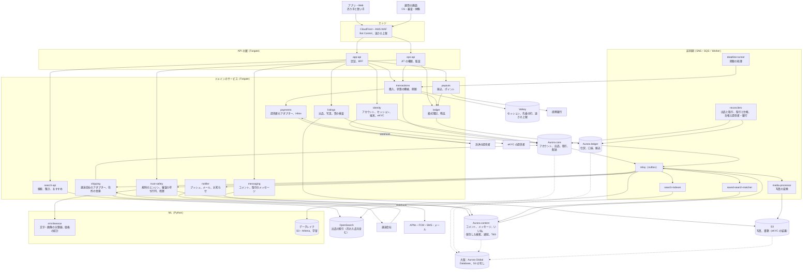

# Architecture: Mercari

全体像と横断的な方針。領域ごとの設計は、同じディレクトリに領域ごとのファイルとして置く（一覧は 7 節、データモデルの正本は [data-model.md](data-model.md) と [data-model/](data-model/)）。品質の戦略は [quality.md](../quality.md)、Epic と Story は [roadmap.md](../roadmap.md)、SLO と運用は [runbooks/](../runbooks/README.md) にある。

## 1. 全体構成

### 1.1 コンテキスト

```
 売り手・買い手（iOS・Android のアプリ、Web）              ブランドの権利者（通報の窓口）
      │ HTTPS <brand>.<domain>、API（X-<Brand>-Client）              │
      ▼                                                              ▼
┌──── 本システム（フリマのアプリと API、運用の画面）──────────────────────────────┐
│  アカウントと端末、出品と写真、カテゴリ・ブランド・価格の提案、検索、保存した検索、         │
│  取引の状態の機械、決済と預かり、台帳と売上金、振込とポイント、配送、メッセージ、        │
│  評価、T&S、本人確認、紛争と CS、通知                                                │
└──────────────────────────────────────────────────────────────────────┘
   ▲ 運用の画面（ops.<brand>.<domain>）       │ 外向き
   │ CS・審査・T&S・財務                       ▼
                     決済の提供者（カード・コンビニ払い、Webhook）、提携銀行（振込）、
                     運送会社（匿名の配送の受け付け、QR、追跡、状態の Webhook）、
                     eKYC の提供者、SMS、APNs・FCM、メールの送信、捜査機関・行政の照会
```

### 1.2 コンテナ



| コンテナ | 責務 |
| --- | --- |
| エッジ（CloudFront、AWS WAF） | TLS の終端、ボットと速さの上限、写真の配信（`static.<brand>.<domain>`）、Web の静的な資産 |
| `app-api` | アプリと Web の入口。セッションの検証、`actor_id` の決定、画面ごとの集約（BFF）。ドメインのサービスの公開の関数だけを呼ぶ |
| `ops-api` | 運用の画面の入口。JIT の権限、理由の入力、全操作の監査ログ（security の領域） |
| `identity` | 電話番号の確認、ログイン、セッション、端末、退会、eKYC の提供者との連携と確認の状態（accounts-and-devices、identity-verification の各領域） |
| `listings` | 出品の作成と編集、写真の受け付け、質の検査、カテゴリ・ブランド・状態、価格の提案の呼び出し、出品の状態（公開、停止、取引中、売り切れ）、`listingVisible()`（[ADR-0007](../decisions/0007-single-tenant-and-party-visibility.md)） |
| `search-api` | 検索、絞り込み、集計、売れた品の検索、おすすめ。結果を返す前に `listingVisible()` の写しで絞る（[ADR-0008](../decisions/0008-search-engine-and-index.md)） |
| `transactions` | `purchaseListing`、取引の状態の機械、期限、キャンセル、紛争の保留、評価の受け付け（[ADR-0002](../decisions/0002-transaction-state-machine-and-single-purchase.md)） |
| `payments` | 決済の提供者のアダプター、冪等キー、Webhook の inbox、照会、返金（[ADR-0005](../decisions/0005-payments-via-providers-and-capture-at-purchase.md)） |
| `ledger` | 複式簿記の仕訳、口座と残高、預かり・手数料・売上金・ポイント・振込の型、冪等な記帳の API（[ADR-0003](../decisions/0003-escrow-and-double-entry-ledger.md)、[ADR-0004](../decisions/0004-proceeds-model-under-payment-services-act.md)） |
| `payouts` | 口座の登録、振込の申請と実行（提携銀行）、振込の失敗の戻し、ポイントの付与と使用 |
| `shipping` | 配送の方法とサイズと料金の表、運送会社のアダプター、匿名の配送の受け付け（QR・番号）、追跡、状態の Webhook の inbox、住所の金庫（封筒の暗号化）（[ADR-0006](../decisions/0006-shipping-orchestration-via-carriers.md)） |
| `messaging` | 商品のコメント、取引のメッセージ、悪用の絞り込みの呼び出し、通報 |
| `trust-safety` | 規則のエンジン、分類器の信号の受け取り、審査の待ち行列と画面、措置（`moderation_actions`）、通報、異議、不正の兆し（[ADR-0009](../decisions/0009-trust-and-safety-pipeline-boundary.md)） |
| `ml-inference` | 文字・画像の分類器、偽ブランドの疑い、価格の外れ値、価格の提案の統計。Python。結果は点と理由のコードだけ（[ADR-0009](../decisions/0009-trust-and-safety-pipeline-boundary.md)、[ADR-0010](../decisions/0010-ml-boundary-for-pricing-and-recommendations.md)） |
| `notifier` | プッシュ・メール・お知らせ、利用者の設定、まとめ（digest）、速さの上限 |
| `relay` | outbox を読み、SNS へ流す |
| `media-processor` | 写真の検査（形式、大きさ）、向きの補正、位置情報の除去、縮小と変換、知覚ハッシュ |
| `search-indexer` | 出品の変更を OpenSearch に入れる（外部のバージョンで順序を守る） |
| `saved-search-matcher` | 新しい出品・値下げを、保存した検索と照合し、通知の依頼を作る（saved-searches-and-alerts の領域） |
| `deadline-runner` | 期限の来た取引を 1 分ごとに拾い、遷移の関数を呼ぶ |
| `reconcilers` | 出品と取引（二重の販売）、取引と台帳（振り替えの一回性）、台帳と提供者・銀行（3 者）の照合 |
| Aurora core | アカウント、出品、取引、配送、評価、本人確認の状態。FORCE RLS（本人・2 者）（[ADR-0007](../decisions/0007-single-tenant-and-party-visibility.md)） |
| Aurora ledger | 口座、仕訳、振込。`ledger` のサービスだけが書く |
| Aurora content | コメント、取引のメッセージ、いいね、保存した検索、通知、T&S の案件と措置 |
| Valkey | セッションの写し、購入の先着の印、速さの上限、`listingVisible()` の写し。失ってよい（正本にしない） |
| OpenSearch | 出品の検索の索引（販売中と売れた品）。正本にしない |
| S3 | 写真（元と変換の後）、eKYC の結果の参照、書き出し。大阪へ写す |
| データレイク | outbox の事象の写し（個人のデータを除く・仮名にする）、分類器と価格の提案の学習 |

原則は 6 つ。

- **一品の売れた状態は 1 つの行で決める。** 出品の行の条件つきの更新と、取引の部分一意の索引で、二重の販売を DB が止める。Valkey の先着の印は、負ける要求を早く返すためだけに使う（[ADR-0002](../decisions/0002-transaction-state-machine-and-single-purchase.md)）。
- **取引の流れと、お金の正本を分ける。** 取引の状態は core、お金は ledger の追記だけの仕訳が正本である。2 つは outbox と冪等キーでつなぎ、照合で食い違いを必ず見つける（[ADR-0003](../decisions/0003-escrow-and-double-entry-ledger.md)）。
- **法的に未決の型を、データの型で分けて持つ。** 預かり・売上金・残高・ポイントを別の口座の種類にし、期限・使い道・本人確認の要否を `legal.*` の設定で決める。法務の結論で、コードを書き直さずに切り替えられる（[ADR-0004](../decisions/0004-proceeds-model-under-payment-services-act.md)）。
- **住所は金庫に閉じる。** 住所・氏名・電話番号は `shipping` と `identity` の封筒の暗号化の列にだけ置き、相手・検索・通知・ログに流さない（[ADR-0006](../decisions/0006-shipping-orchestration-via-carriers.md)）。
- **ML は信号、決定は規則と人。** 分類器と価格の提案は点を出すだけで、措置と価格は規則のエンジン・人・売り手が決める（[ADR-0009](../decisions/0009-trust-and-safety-pipeline-boundary.md)、[ADR-0010](../decisions/0010-ml-boundary-for-pricing-and-recommendations.md)）。
- **外部は遅れ、重なり、入れ替わる。** 決済の提供者・運送会社・銀行の通知は inbox で重複を除き、照会で確かめ、状態を前にだけ進める。

### 1.3 主要な流れ

**A. 出品して検索に出る**

1. 売り手がアプリで写真を撮る。アプリは `listings` から S3 の署名つきの URL（1 枚 20 MB まで）をもらい、直接上げる。
2. `media-processor` が形式と大きさを検査し、向きを直し、位置情報（EXIF の GPS）を消し、3 つの大きさの WebP・JPEG を作り、知覚ハッシュを計算する（p95 5 秒。NFR-015）。
3. 売り手が題名・説明・カテゴリ・状態・ブランド・配送・価格を入れる。価格の欄には、価格の提案（同じカテゴリ・ブランド・状態の、売れた品の直近 90 日の価格の四分位）を出す（[ADR-0010](../decisions/0010-ml-boundary-for-pricing-and-recommendations.md)）。
4. 出品の送信で、`listings` は同期の検査（必須の項目、禁止の語、禁止のハッシュとの一致、アカウントの状態）を p95 2 秒で行う。通れば出品を `on_sale` にし、outbox に `listing.published` を書く。
5. `search-indexer` が索引に入れる（出品のバージョンを外部のバージョンにする）。出品から検索に出るまで p95 10 秒（NFR-001）。
6. 並行して `trust-safety` が非同期の分類器（文字、画像、偽ブランドの疑い、価格の外れ値）を呼び、規則のエンジンで判定する（p95 60 秒）。保留の判定なら、出品を `under_review`（検索から外し、購入を止める）にする（F）。

**B. 人気の商品を買う（一品の一回）**

1. 人気の出品が出た直後に、数千人が「購入」を押す。アプリは（`listing_id`、見た `price`、見た `listing_version`、支払いの方法、購入の試行の ID）を送る。
2. `transactions` は Valkey の出品の写し（`listing:{id}:snap`）を読み、販売中でなければすぐに「売り切れ」を返す。販売中なら `SET purchase:{listing_id} <attempt_id> NX PX 15000` を試し、取れなければ「手続き中」を返す（p99 200ms）。Valkey が使えなければ、この段を飛ばし、出品ごと・タスクごとの同時実行 4（タスク 12 で DB に届くのは 1 出品 48 件まで）と `lock_timeout` 200ms で DB へ進む（正しさは DB が守る。[ADR-0026](../decisions/0026-hot-listing-purchase-admission.md)）。
3. 印を取った要求は、core の 1 つのトランザクションで、`UPDATE listings SET status = 'trading', version = version + 1 WHERE id = $1 AND status = 'on_sale' AND version = $2 AND price = $3` を行う。1 行を更新できたら、取引の行（`state = 'created'`）を挿入する。取引の表の部分一意の索引（`listing_id` に、終わっていない状態の行は 1 つ）が、最後の守りになる。outbox に `transaction.created` を書く。
4. 更新が 0 行なら、価格・バージョンの違い（409、新しい価格を返す）か、売り切れを返す。
5. 支払いは C へ。支払いが失敗・期限切れなら、取引を `cancelled`・`payment_expired` にし、出品を `on_sale` に戻す（同じトランザクション。出品のバージョンを上げ、先着の印を比べて消す）。発送の後の取り消しでは、出品を `paused` に戻す（[ADR-0027](../decisions/0027-cancellation-rules-and-listing-restoration.md)、DT-LST-001 の行 7a）。

**C. 支払いの預かりから売上金まで（台帳）**

1. カードは、取引の作成の後に `payments` が提供者に、冪等キー `<transaction_id>:capture` で売上の確定（オーソリと同時の確定）を依頼する。結果は応答・Webhook（inbox）・照会のどれから来ても、同じ関数で取引を `paid` にする（[ADR-0005](../decisions/0005-payments-via-providers-and-capture-at-purchase.md)）。
2. `ledger` は `transaction.paid` を受け、仕訳「借方 提供者への未収（`psp_receivable`）／貸方 取引の預かり（`escrow:<transaction_id>`）」を、冪等キー `(transaction, <id>, hold)` で 1 回だけ書く（型 `hold_psp`）。売上金・ポイントで払うときは、購入の前に買い手の残高を引き当て、取引の作成で預かりへ振り替える。この振り替えの冪等キーは `(transaction, <id>, hold_balance)` で、カードの hold と分ける（[ADR-0040](../decisions/0040-balance-spend-order-and-reservation.md)）。
3. 取引が `completed` になると、`ledger` は 1 つの仕訳で「借方 預かり／貸方 売り手の売上金（代金 − 手数料 − 送料）・手数料の収益・運送会社への未払い」を書く。冪等キーは `(transaction, <id>, release)`。売上金は完了から 1 分以内に残高に出る（NFR-006）。
4. 取引が `cancelled` になると、預かりを買い手へ戻す仕訳（`refund`）を書き、`payments` が提供者に返金を依頼する。release と refund は、台帳の一意の制約で、同じ取引に両方は書けない（[ADR-0003](../decisions/0003-escrow-and-double-entry-ledger.md)）。
5. `reconcilers` が 5 分ごとに、取引の状態と台帳の仕訳を照らす（`completed` なのに release がない、`cancelled` なのに refund がない、など）。日次で、台帳と提供者の精算・銀行の明細を 3 者で照らす（Stripe の題材の [ADR-0017](../../../stripe/docs/decisions/0017-three-way-reconciliation-with-suspense.md) の考え方）。

**D. 匿名の配送と配送の状態**

1. 売り手が `<Brand>便` のサイズを選び、発送の手続きをする。`shipping` は住所の金庫から配送先と差出人を取り出し、運送会社の API に匿名の配送の受け付けを依頼する（冪等キー `<transaction_id>:ship:<attempt>`）。運送会社が返す受け付けの番号と QR を、売り手に出す。売り手には配送先が見えない。
2. 売り手が営業所・コンビニ・宅配ボックスで QR を読ませる。運送会社の順位 1 以上の事象（引き受け。引き受けが欠けて輸送中・配達済みが先に届いたら引き受けを補う）で、取引を `shipped` にし、受取評価の自動の完了の期限（発送の 9 日後の 13 時）を書く（[ADR-0042](../decisions/0042-carrier-event-ranking-and-implied-acceptance.md)）。
3. 「輸送中」「配達済み」の Webhook は、inbox で重複を除き、事象の順位で古いものを無視する。配達済みで取引を `delivered` にし、買い手に受取評価を促す。`delivered` の後の例外（`lost` など）は取引に渡さず、運用の待ち行列にだけ入れる。
4. Webhook が来ないときは、照会のジョブ（引き受けの後 6 時間ごと）で追跡の状態を取る（[ADR-0006](../decisions/0006-shipping-orchestration-via-carriers.md)）。

**E. 保存した検索の新着の通知**

1. 買い手が検索の条件（語、カテゴリ、ブランド、価格の幅、状態など）を保存する。`saved-search-matcher` は、条件を正規化し、照合の鍵（カテゴリ × ブランド、または語の主な語幹）で逆索引（content の表と Valkey の写し）に入れる。
2. `listing.published` と `listing.price_dropped` を受けると、出品の鍵で候補の保存した検索を引き、条件を全部当てて一致を決める。
3. 一致は利用者ごとにまとめ（3 分の窓。窓ごとに 1 通。保存した検索だけで 1 人 1 日 20 通まで）、`notifier` に依頼する。新着の通知は、出品の公開・値下げの commit から数えて p95 5 分（NFR-008。窓を含む。[ADR-0023](../decisions/0023-saved-search-alert-windows-and-caps.md)）。
4. 通知を送る前に `listingVisible()` を通す。措置した出品・売り切れの出品は送らない。

**F. 偽ブランドの検出と措置**

1. 非同期の分類器が、出品に点（偽ブランドの疑い、禁止の品の種類、価格の外れ値）と理由のコードを付ける。
2. 規則のエンジンが、点・ブランド・価格・売り手の信用・過去の措置から、`allow`・`review`（公開のまま審査）・`hold`（非公開にして審査）・`block` を決める（[ADR-0009](../decisions/0009-trust-and-safety-pipeline-boundary.md)）。
3. 審査の待ち行列で、運用者（偽ブランドは権利者の資料を見る担当）が判定する。偽ブランドと確かめたら、措置を `moderation_actions` に書き、出品を `removed` にし、進行中の取引を取り消して返金する。売り手のアカウントの制限を規則で決める。
4. 措置から 60 秒以内に、検索・おすすめ・通知の候補から消える。審査の結果は評価の集まりと学習のデータに戻す（[quality.md](../quality.md) の 2.2.1 節 F）。

### 1.4 本家の形（確かめたこと）

| 項目 | 本家 | 出典 |
| --- | --- | --- |
| 規模 | 日本のマーケットプレイスの MAU 2,419 万人（2026 年 6 月期の第 4 四半期）。GMV 通期 1,285,675（単位の表記なし。百万円と読むのは本システムの推定） | [Data Sheet（csv）](https://pdf.irpocket.com/C4385/xoA3/ieAo/Ip3B/R8TF.csv) |
| 支払いの期限 | 購入の手続きから 3 日（購入日を含む 3 日目の 23:59:59） | [ヘルプの記事 61sell](https://help.jp.mercari.com/guide/articles/61sell/) |
| 自動の完了（受取評価がないとき） | らくらくメルカリ便は「配達完了」から 2 日後の 13 時以降。ゆうゆうメルカリ便とその他の方法は発送の通知の 9 日後の 13 時以降。問い合わせ・取引のメッセージで延びることがある。「取引を自動完了しない」のボタンで止められる。完了の前に受け取る「早期受取」がある | [ヘルプの記事 115](https://help.jp.mercari.com/guide/articles/115/)、[61sell](https://help.jp.mercari.com/guide/articles/61sell/)、[1016](https://help.jp.mercari.com/guide/articles/1016/) |
| 売り手が評価しないとき | 受取評価の翌日以降に自動で完了 | [ヘルプの記事 115](https://help.jp.mercari.com/guide/articles/115/) |
| 評価 | 「良かった」「残念だった」の 2 つ。取引の完了の時にお互いの評価を同時に公開する。受取評価だけの間は中身を見られない | [ヘルプの記事 1016](https://help.jp.mercari.com/guide/articles/1016/) |
| 出品の上限 | 写真 20 枚、商品名 40 文字、価格 300 円〜9,999,999 円。商品説明の上限は書いていない（**未検証**） | [ヘルプの記事 62](https://help.jp.mercari.com/guide/articles/62/) |
| 販売の手数料 | 販売価格の 10%。取引の完了の時に差し引く。端数の扱いは書いていない（**未検証**） | [ヘルプの記事 65](https://help.jp.mercari.com/guide/articles/65/) |
| 売上金の期限 | 振込の申請の期限 180 日。本人確認で「残高」になり期限なし。期限の後は自動の振込（1 回 200 円、2 回まで）、口座なし・200 円以下は失効 | [ヘルプの記事 96](https://help.jp.mercari.com/guide/articles/96/) |
| 振込の手数料 | 1 回 200 円 | 同上 |
| 匿名の配送 | 運送会社 2 社の専用の配送の商品で匿名。サイズの段と全国一律の料金（160 円〜2,500 円、資材は別）。専用でない方法は匿名でない。専用でない方法への切り替えには売り手の本人確認が要る（2024 年 9 月から） | [公式のコラム](https://jp-news.mercari.com/contents/954)（2026-02-17。料金は 2026 年 1 月時点） |
| 保存した検索の新着 | プッシュは設定から 30 日だけ有効 | [ヘルプの記事 239](https://help.jp.mercari.com/guide/articles/239/) |
| 通知の設定 | 取引関連はプッシュかメールのどちらかが要る。事務局の個別の連絡は切れない。フォロー中の出品の通知は 9 時〜23 時だけ | 同上 |
| ログイン | 2026 年 5 月 29 日から順に、パスキーを設定した利用者はパスキーが必須。外のアカウント（Apple・Google など）とメールのログイン用のリンクを選べる | [ヘルプの記事 1860](https://help.jp.mercari.com/guide/articles/1860/) |
| 退会 | 出品中・取引中の商品、完了から 2 週間たたない売却済みの商品、未完了の振込の申請、登録した口座などがあると退会できない | [ヘルプの記事 250](https://help.jp.mercari.com/guide/articles/250/) |
| 売上金の管理の主体、法的な整理 | 公式の資料で確かめられなかった | **未検証** |
| 検索の基盤 | Elasticsearch（採用の募集だけで確かめた） | **未検証** |
| 偽ブランドの検出の方式、決済の失敗の後の出品の戻し方、発送の期限の後のキャンセル、本家の SLA、コンビニ払いの手数料、保存した検索の件数の上限 | 公式の資料で確かめられなかった | **未検証** |

いずれも 2026-10-10 に確認。この設計は振る舞いを参考にするが、本家のコード・データ・モデルは使わない（[リポジトリ共通の ADR-0007](../../../../docs/decisions/0007-no-reuse-of-original-implementation.md)）。

**本家との意図した違い**：

| 項目 | 本家 | 本システム | 理由・根拠 |
| --- | --- | --- | --- |
| 売上金の期限と残高 | 180 日の振込の申請の期限。本人確認で期限のない残高 | 同じ形を持てる口座の種類にするが、期限の日数と本人確認の要否は `legal.*` の値で、法務の L1 の後に決める | 法的な整理が未確認（[ADR-0004](../decisions/0004-proceeds-model-under-payment-services-act.md)、[ADR-0035](../decisions/0035-proceeds-lots-expiry-and-kyc-conversion.md)） |
| 早期受取 | ある | MVP に入れない | 預かりの性質（法務の L1）と、取り消しの後の回収の設計が要る |
| 値下げ交渉 | コメントでの交渉（決まった形の機能の有無は**未検証**） | MVP はコメントと価格の変更。決まった形のオファーは MVP の後 | 取り置きの設計を後にする |
| 検索のエンジン | Elasticsearch（**未検証**） | Amazon OpenSearch Service と Sudachi | 共通の基盤の AWS の管理のサービス（[ADR-0008](../decisions/0008-search-engine-and-index.md)） |
| 価格の提案 | ある（方式は**未検証**） | MVP は売れた品の統計。ML は MVP の後 | 学習のデータが MVP の取引から始まる（[ADR-0010](../decisions/0010-ml-boundary-for-pricing-and-recommendations.md)） |
| 配送の商品とヘッダーの名前 | 本家の名前を含む | `<Brand>便`、`X-<Brand>-Client` | リポジトリ共通の ADR-0006 |
| データの所在 | 未検証 | すべて日本（東京、DR は大阪） | 日本を最初の市場にする（法務の L5） |
| 写真の枚数 | 20 枚 | 10 枚 | 保管と転送の費用（[capacity.md](capacity.md) の 6 節）と変換の量（[ADR-0012](../decisions/0012-photo-pipeline-and-perceptual-hashes.md)）。題名 40 文字は本家と同じ。説明 1,000 文字は本システムの値（本家の上限は**未検証**） |
| 自動の完了 | 配送の方法で違う（らくらくメルカリ便は配達完了から 2 日後の 13 時、ほかは発送の通知の 9 日後の 13 時） | どの方法も発送の 9 日後の 13 時 | 配達済みは受取評価の代わりにしない（[ADR-0002](../decisions/0002-transaction-state-machine-and-single-purchase.md)、[ADR-0006](../decisions/0006-shipping-orchestration-via-carriers.md)）。期限の列を 1 つの形に保つ |
| 売り手の評価の期限 | 受取評価の翌日以降に自動で完了 | 受取評価から 72 時間 | 売り手が評価を書く時間を残す（[ADR-0025](../decisions/0025-transaction-decision-table-and-deadline-pause.md)、[ADR-0049](../decisions/0049-mutual-ratings-sealed-until-completion.md)）。売上金の反映が最長 2 日ほど遅れる |
| 評価の段 | 「良かった」「残念だった」の 2 つ | `good`・`normal`・`bad` の 3 つ。完了まで伏せて同時に公開するのは本家と同じ | intent の MVP の範囲（[ADR-0049](../decisions/0049-mutual-ratings-sealed-until-completion.md)） |
| 発送の後の取り消しの出品 | **未検証** | 販売中に戻さず、停止（`paused`）に戻す | 品が売り手の手元にあるとは限らない（[ADR-0027](../decisions/0027-cancellation-rules-and-listing-restoration.md)） |
| 返金で戻ったポイントの期限 | **未検証** | 元のロットに戻し、残りが 30 日に満たなければ 30 日に延ばす | 買い手の責めでない取り消しでポイントを失わない（[ADR-0039](../decisions/0039-points-as-separate-lot-accounts.md)） |
| コンビニ払いの手数料 | **未検証** | 1 件 100 円（買い手の負担）。預かりに含め、取り消しでは代金と一緒に返す | [ADR-0031](../decisions/0031-konbini-pending-payments-and-late-payments.md) |
| 振込の失敗の手数料 | **未検証** | 依頼の時点の不能は手数料 200 円も戻す。完了の後の組戻しは戻さない | [ADR-0038](../decisions/0038-payout-batching-execution-and-failure-handling.md) |
| ログイン | パスワード、外のアカウント（Apple・Google・Facebook・LINE）、メールのログイン用のリンクを選べる | パスキーと SMS の一時コードだけ。パスワード・外のアカウント・メールのリンクを持たない | 乗っ取りの入口を減らす（[ADR-0066](../decisions/0066-sign-in-sessions-and-devices.md)） |
| 退会 | 出品中の商品・登録した口座があると退会できない | 出品は退会の流れで一緒に止め、口座の登録は消す。売上金・残高・ポイントが 0 円でない間は受け付けない | 手間を減らす。お金の行き先は法務の L1 の後（[ADR-0068](../decisions/0068-account-deletion-and-minors.md)） |
| 静かな時間 | フォロー中の出品の通知だけ 9 時〜23 時。値下げなどは**未検証** | `engagement`・`announcement` の級を 23:00〜9:00 に送らず、9 時から 60 分に散らした 1 通にまとめる | 夜中の通知の解除を減らす（[ADR-0064](../decisions/0064-fanout-batching-quiet-hours-and-caps.md)） |
| 値下げの通知 | 「一定額以上」の値下げで「あなたへのお知らせ」にだけ出す | 100 円以上かつ 5% 以上でプッシュとお知らせに出す。出品ごとに 24 時間に 1 回 | [ADR-0064](../decisions/0064-fanout-batching-quiet-hours-and-caps.md) |
| 保存した検索の通知 | メール・プッシュ・LINE | プッシュ（3 分のまとめ）とお知らせ。LINE は持たない | [ADR-0023](../decisions/0023-saved-search-alert-windows-and-caps.md) |
| 売れた品の検索 | ログインしていなくても使えるか**未検証** | ログインした利用者だけ | 相場のデータの持ち出しを抑える（6 節の「決定（2026-10-10、統合）」） |
| 取引のメッセージ | 画像の可否は**未検証** | MVP は文字だけ | 住所の写った画像を止められない（[ADR-0046](../decisions/0046-comments-and-transaction-messages-storage.md)） |

## 2. 規模の段階

| 段階 | MAU | 公開中の出品（索引の件数。売れた品を含む） | 新しい出品 | 取引 | 購入の最大（全体） | 人気の 1 出品への購入の試み | 検索の最大 | 保存した検索 | 構成 |
| --- | --- | --- | --- | --- | --- | --- | --- | --- | --- |
| S1（MVP） | 300 万 | 3,000 万（7,000 万） | 30 万件/日 | 10 万件/日 | 50 件/秒 | 5,000 件/秒（1 秒の間） | 3,000 件/秒 | 2,000 万 | 東京の 1 リージョン・3 AZ。Aurora は core・ledger・content の 3 クラスタ。大阪に Aurora Global Database と S3 の写し |
| S2 | 1,000 万 | 1 億（2.8 億） | 100 万件/日 | 50 万件/日 | 300 件/秒 | 2 万件/秒 | 2 万件/秒 | 1 億 | core の読み出しの写しを増やす。content を種類ごとに分ける。OpenSearch を販売中と売れた品の索引に分ける。ledger の熱い口座をスロットに分ける |
| S3 | 2,500 万 | 3 億（8.5 億） | 300 万件/日 | 150 万件/日 | 2,000 件/秒 | 5 万件/秒 | 10 万件/秒 | 5 億 | core を `listing_id` のハッシュで分ける（出品と取引を同じ分け先に置く）。ledger を口座の持ち主のハッシュで分ける |

- 数値は本システムの想定。S3 の MAU は本家の日本のマーケットプレイスの 2,419 万人（[Data Sheet](https://pdf.irpocket.com/C4385/xoA3/ieAo/Ip3B/R8TF.csv)）に合わせた。新しい出品・取引・検索の数は、本家の公式の値を確かめられなかった（**未検証**）ので、本システムの推定である。
- 取引の平均の額を 2,500 円と見込んだ（本システムの推定）。S3 の取引 150 万件/日は、年 5.5 億件・GMV 年 1.37 兆円にあたり、本家の通期の GMV と同じ桁である。
- 購入の最大は、大型の企画の日（ポイントの還元の日など）の夕方の 1 分の平均を、普段の平均の 30 倍と見込んだ。S1 の 10 万件/日は平均 1.2 件/秒である。
- 人気の 1 出品への購入の試みは、限定品の出品の直後の 1 秒に集まる押下を見込んだ。成功は 1 件だけで、残りは負けの応答になる（NFR-002）。
- 索引の件数は、販売中・取引中の出品に、売れた品（取引の完了の数 × 365 日。[ADR-0018](../decisions/0018-search-index-layout-and-japanese-analysis.md) の保持）を足した。S1 は 3,000 万 ＋ 10 万 × 365 ≒ 3,650 万で約 7,000 万、S2 は 1 億 ＋ 1.8 億で約 2.8 億、S3 は 3 億 ＋ 5.5 億で約 8.5 億（統合の工程で直した。最初の設計の 1.5 億・6 億・30 億は、売れた品を販売中の数倍と置いた見積もりだった）。
- 保存した検索の新着の通知は、S3 で 1 日 5 億件の一致を、利用者ごとのまとめで 1 日 1 億通に減らすと見込む（saved-searches-and-alerts の領域で確かめる）。
- 段階を上げる基準と分ける順は [infrastructure.md](infrastructure.md) の 8 節（[ADR-0074](../decisions/0074-stage-up-criteria-and-split-plan.md)）。ledger は S2 で熱い口座をスロットに分け、S3 で口座の持ち主のハッシュで分ける。負荷と費用のモデルは [capacity.md](capacity.md)。

### 2.1 費用のモデル

取引 1 件と、MAU 1 人の月あたりの原価を、次の和で見る。単価は [capacity.md](capacity.md) の 6 節で、AWS の東京の公開の価格から入れた。

```
取引あたりの原価 = 購入と状態の機械（Fargate、Aurora core の書き込み）
                ＋ 台帳（仕訳 3〜4 件、Aurora ledger）
                ＋ 配送の連携（運送会社の API の呼び出し、Webhook）
                ＋ 通知（プッシュ 5〜10 通、メール 1〜2 通）
                ＋ 外部（決済の提供者の手数料、SMS。運送会社の運賃は送料として売り手から差し引く）
MAU あたりの原価 = 検索（OpenSearch のデータノード、索引の大きさ）
                 ＋ 写真（S3 の保管、CloudFront の転送）
                 ＋ 保存した検索の照合と通知
                 ＋ T&S（分類器の推論、審査の人の時間）
```

- 最も大きいのは、決済の提供者の手数料（取引の額に比例）、写真の保管と転送、OpenSearch の索引（売れた品を含めると件数が 2〜3 倍になる）、審査の人の時間と見込む。売れた品の索引の保持の期間と写真の大きさの段が、主な制御の手段になる。
- 取引あたりの原価（決済の提供者の手数料を除く）を S1 で 20 円以下にする（本システムの想定）。S1 の本番の AWS の費用は月 約 8.1 万 USD（±40%）で、取引 1 件あたり約 0.027 USD（約 4 円）、MAU 1 人・月あたりも約 4 円の見込みで、目標を満たす（[capacity.md](capacity.md) の 6 節、[infrastructure.md](infrastructure.md) の 9 節。1 USD = 150 円）。

## 3. 非機能要件

| ID | 項目 | S1 の目標 | 備考 |
| --- | --- | --- | --- |
| NFR-001 | 出品から検索まで | 出品の公開・編集・停止が検索の結果に出るまで p95 10 秒・p99 60 秒。措置・売り切れは p99 60 秒 | [ADR-0008](../decisions/0008-search-engine-and-index.md) |
| NFR-002 | 購入の速さ | `purchaseListing` の確定 p99 800ms（決済の提供者の応答を除く）。人気の出品で負けた要求への応答 p99 200ms。取引の画面の操作（発送の通知、受取評価、評価）p99 500ms | [ADR-0002](../decisions/0002-transaction-state-machine-and-single-purchase.md) |
| NFR-003 | 二重の販売なし | 1 つの出品の進行中の取引が 2 つになった件数 0。Valkey の障害、DB のフェイルオーバーのときも 0 | [ADR-0002](../decisions/0002-transaction-state-machine-and-single-purchase.md) |
| NFR-004 | 台帳の正しさ | 釣り合わない仕訳 0。全口座の残高の和 0。台帳・決済の提供者の精算・銀行の明細の、説明のつかない差を 3 営業日で 0 円にする（仮勘定に置き、期限で人が確かめる） | [ADR-0003](../decisions/0003-escrow-and-double-entry-ledger.md) |
| NFR-005 | 振り替えの一回性 | 1 つの取引で、release か refund のどちらか一方が 1 回だけ。重複 0、両方 0。完了・取り消しから 15 分を超えて、どちらもない件数 0 | [ADR-0003](../decisions/0003-escrow-and-double-entry-ledger.md) |
| NFR-006 | 売上金の使える速さ | 取引の完了から売上金の残高に出るまで p99 1 分。残高と明細の API 月間 99.95%。振込の申請の受け付けから提携銀行への依頼まで、営業日の 1 時間以内（着金の日は提携銀行の値） | payouts-and-points の領域 |
| NFR-007 | 可用性 | 購入と取引 月間 99.95%、検索と出品 月間 99.9%、メッセージと通知の受け付け 月間 99.9%、運用の画面 月間 99.5% | 本家の SLA は確かめなかった（**未検証**） |
| NFR-008 | 通知の速さ | 取引の通知（購入、支払い、発送、受取評価、メッセージ）は事象からプッシュの依頼まで p95 10 秒。いいねした品の値下げの通知、保存した検索の新着の通知は p95 5 分。どれも元の事象（取引の遷移、出品の公開・値下げ）の commit から数え、保存した検索の 3 分のまとめの窓を含む。静かな時間で止めた時間は数えない | [notifications.md](notifications.md) の 4.3 節、[ADR-0023](../decisions/0023-saved-search-alert-windows-and-caps.md) |
| NFR-009 | 偽物と禁止品 | 同期の検査 p95 2 秒。非同期の分類器と規則の判定 p95 60 秒。評価の集まりで、偽ブランドの保留の判定の再現率 90% 以上・適合率 80% 以上（主なブランド 50）。禁止の品の種類の判定の再現率 95% 以上。通報・保留から審査の判定まで p95 24 時間（偽ブランドの疑いの高いものは 4 時間） | [ADR-0009](../decisions/0009-trust-and-safety-pipeline-boundary.md) |
| NFR-010 | 検索の速さ | 検索（絞り込みと集計を含む）p95 200ms・p99 500ms。売れた品の検索も同じ | [ADR-0008](../decisions/0008-search-engine-and-index.md) |
| NFR-011 | 耐久性 | 確認の画面を出した取引・仕訳の消失 0。AZ の障害で RPO 0・RTO 5 分。リージョンの障害で RPO 1 分（Aurora Global Database）・RTO 1 時間 | infrastructure の領域 |
| NFR-012 | 期限 | 取引の期限（支払い、発送、受取評価の自動の完了、評価）が、期限の時刻から 1 分以内に働く。紛争・運用の保留の間は働かない。期限の処理の遅れ p99 1 分 | [ADR-0002](../decisions/0002-transaction-state-machine-and-single-purchase.md) |
| NFR-013 | 配送の状態 | 運送会社の事象から取引の状態の反映まで p95 60 秒。どんな順序・重複でも状態は後ろに戻らない | [ADR-0006](../decisions/0006-shipping-orchestration-via-carriers.md) |
| NFR-014 | 住所と個人のデータ | 匿名の配送で、相手に住所・氏名・電話番号が出た事象 0。本人・2 者だけのデータが他の利用者に出た事象 0 | [ADR-0006](../decisions/0006-shipping-orchestration-via-carriers.md)、[ADR-0007](../decisions/0007-single-tenant-and-party-visibility.md) |
| NFR-015 | 写真の処理 | 上げ終わりから変換の完了まで p95 5 秒。写真の配信（エッジ）p95 100ms | listings-and-photos の領域 |
| NFR-016 | 措置の反映 | 措置から検索・おすすめ・通知・購入の拒否まで p99 60 秒 | [ADR-0009](../decisions/0009-trust-and-safety-pipeline-boundary.md) |

## 4. 技術スタック

| 層 | 選定 | 理由 |
| --- | --- | --- |
| 言語（サービス） | TypeScript（Hono＋Zod）。ドメインごとのパッケージを持つ 1 つのコードベースを、入口・Worker ごとのサービスとして出す | 他の題材と同じ（[ADR-0001](../decisions/0001-platform-and-stack.md)） |
| 言語（ML） | Python（学習と `ml-inference`）。PyTorch などの汎用の枠組み。モデルは自前で学習する | [ADR-0001](../decisions/0001-platform-and-stack.md)。共通の基盤からの外れ |
| DB | Aurora PostgreSQL 18。core・ledger・content の 3 クラスタ。FORCE RLS と `SET LOCAL`、ID は UUIDv7、transactional outbox | [ADR-0003](../decisions/0003-escrow-and-double-entry-ledger.md)、[ADR-0007](../decisions/0007-single-tenant-and-party-visibility.md) |
| キャッシュ | ElastiCache Valkey | 他の題材と同じ。失ってよい部品 |
| 非同期 | outbox → SNS・SQS | 他の題材と同じ |
| 検索 | Amazon OpenSearch Service（Sudachi の解析器、ICU の正規化、2-gram の欄）。順位付けは自前の式 | [ADR-0008](../decisions/0008-search-engine-and-index.md) |
| エッジ | CloudFront、AWS WAF（Bot Control） | 他の題材と同じ |
| 実行基盤 | ECS Fargate。`ml-inference` の画像の分類器は、S2 から GPU の EC2（ECS on EC2）を検討する | [ADR-0001](../decisions/0001-platform-and-stack.md)、capacity の領域 |
| オブジェクトストレージ | S3（写真、書き出し）。写真の変換は sharp | listings-and-photos の領域 |
| データレイク | S3、Glue のカタログ、Athena。個人のデータを除く・仮名にした事象 | [ADR-0010](../decisions/0010-ml-boundary-for-pricing-and-recommendations.md) |
| 外部 | 決済の提供者、提携銀行の API（予備に全銀の形式のファイル）、運送会社の API、eKYC の提供者、SMS、APNs・FCM、Amazon SES | [ADR-0005](../decisions/0005-payments-via-providers-and-capture-at-purchase.md)、[ADR-0006](../decisions/0006-shipping-orchestration-via-carriers.md) |
| アプリ | iOS・Android は React Native（TypeScript）、Web は React | 他の題材（X、Uber）と同じ形（[ADR-0066](../decisions/0066-sign-in-sessions-and-devices.md)） |
| IaC | Terraform | infrastructure の領域 |
| 可観測性 | OpenTelemetry（ADOT）→ CloudWatch・AMP・Managed Grafana | observability の領域 |
| フラグ | AWS AppConfig（`release.*`、`ops.*`、`legal.*`） | 他の題材と同じ |
| テスト | Vitest・fast-check、pytest・Hypothesis、自前の参照の実装（取引の状態の機械、台帳）、Testcontainers（PostgreSQL 18、Valkey、OpenSearch）、LocalStack、提供者と運送会社の模型、k6 と自前の負荷の生成器、Playwright・Maestro | [quality.md](../quality.md) |

## 5. 主な決定

どれも `accepted`。0001〜0010 は最初の設計の起票で、下の表に置く。0011〜0079 は領域の文書の工程で起票した（割り当ての範囲の空きの 0014、0017、0021、0024、0028、0029、0033、0037、0041、0045、0048、0055、0058、0061、0062 は使っていない）。各領域の ADR は 7 節の各文書の頭の表にあり、状態の一覧は [decisions/README.md](../decisions/README.md)。統合の工程で、決定を覆した・具体にした ADR に日付付きの注記を足した（6 節の「決定（2026-10-10、統合）」）。

| ADR | 決定 |
| --- | --- |
| [0001](../decisions/0001-platform-and-stack.md) | 共通の基盤を引き継ぎ、ドメインごとのパッケージを持つ 1 つのコードベースを入口・Worker ごとのサービスで出す。Aurora は core・ledger・content の 3 クラスタ。ML だけ Python。検索は OpenSearch を汎用の部品として使う |
| [0002](../decisions/0002-transaction-state-machine-and-single-purchase.md) | 取引を明示の状態の機械にし、購入を `purchaseListing` の 1 つの関数と 1 つのトランザクション（出品の条件つきの更新と、部分一意の索引）に集める。期限は DB の列と 1 分ごとの処理で動かし、紛争で止める（統合の工程で、発送の後の取り消しで出品を `paused` に戻すこと、先着の印を取り消しで消すことの注記を足した。ADR-0026・0027） |
| [0003](../decisions/0003-escrow-and-double-entry-ledger.md) | お金の正本を、取引ごとの預かりの口座を持つ追記だけの複式簿記の台帳にする。release と refund を冪等キーと一意の制約で 1 回に限り、取引と台帳を 5 分ごと、台帳と提供者・銀行を日次で照合する（統合の工程で、残高の hold の冪等キーを `hold_balance` に分けた注記を足した。ADR-0040） |
| [0004](../decisions/0004-proceeds-model-under-payment-services-act.md) | 売上金・残高・ポイントを別の口座の種類にし、期限・使い道・本人確認の要否・保全を `legal.*` の設定で決める。収納代行・資金移動業・前払式支払手段のどれに整理されても切り替えられる形にし、法務の L1 の結論まで本番の値を有効にしない |
| [0005](../decisions/0005-payments-via-providers-and-capture-at-purchase.md) | 決済は外部の提供者に任せ、本システムはカード番号に触れない。カードは購入の時に売上を確定し、預かりは本システムの台帳で持つ。冪等キー、Webhook の inbox、照会で結果を確かめる。Stripe の題材は提供者の 1 つとして使い、設計し直さない |
| [0006](../decisions/0006-shipping-orchestration-via-carriers.md) | 配送は運送会社の API を包むアダプターで扱い、匿名の配送の受け付け・QR・追跡・状態の Webhook を自前で指揮する。住所は `shipping` の金庫に封筒の暗号化で置き、相手に出さない。運送会社の事象は順位で前にだけ進める（統合の工程で、`shipped` の条件を「順位 1 以上の運送会社の事象」に読み替える注記を足した。ADR-0042） |
| [0007](../decisions/0007-single-tenant-and-party-visibility.md) | テナントは 1 つ。本人だけの表は FORCE RLS、取引の表は買い手と売り手の 2 者の RLS にする。出品の見える範囲は `listingVisible(viewer, listing)` の 1 つの関数で決める。運用者は監査つきの JIT の権限で見る（統合の工程で、見張りの出品を見張りの利用者だけに見せる行の注記を足した） |
| [0008](../decisions/0008-search-engine-and-index.md) | 検索は Amazon OpenSearch Service に、販売中と売れた品の出品を入れ、Sudachi の形態素と 2-gram の欄で日本語を引く。順位付けは自前の決めた式。索引は出品のバージョンを外部のバージョンにして順序を守る。保存した検索の照合は OpenSearch でなく自前の逆索引で行う（統合の工程で、索引の件数の見積もり、`external_gte`、売れた品の検索のログインの注記を足した） |
| [0009](../decisions/0009-trust-and-safety-pipeline-boundary.md) | T&S は、同期の検査・非同期の分類器・規則のエンジン・人の審査・措置の記録の段に分ける。分類器は点と理由のコードだけを出し、措置は規則と人が `moderation_actions` に書いてから効かせる。分類器は自前で学習し、評価の集まりで出す前に確かめる |
| [0010](../decisions/0010-ml-boundary-for-pricing-and-recommendations.md) | 価格の提案とおすすめの ML は助言と順位だけにする。MVP の価格の提案は売れた品の統計、おすすめは規則。ML のモデルは MVP の後に、影の評価を通してから出す。出品の価格・手数料・見える範囲を ML で変えない |

領域ごとの ADR は、7 節の番号の範囲で起票する。リポジトリ共通の決定（開発プロセス、ブランチモデル、本家の名前・接頭辞を使わない規則の [ADR-0006](../../../../docs/decisions/0006-brand-neutral-identifiers.md)、本家の実装を核に使わない規則の [ADR-0007](../../../../docs/decisions/0007-no-reuse-of-original-implementation.md)）は、ルートの [docs/decisions/](../../../../docs/decisions/README.md) にある。

関係する他の題材の設計（参照するだけで、設計し直さない）：

| 題材 | 参照するもの |
| --- | --- |
| Stripe | 複式簿記の台帳（[ADR-0003](../../../stripe/docs/decisions/0003-double-entry-ledger.md)）、保留中と利用可能の口座（[ADR-0015](../../../stripe/docs/decisions/0015-chart-of-accounts-and-balance-transactions.md)）、熱い口座の分け方（[ADR-0016](../../../stripe/docs/decisions/0016-hot-accounts-and-ledger-sharding.md)）、3 者の照合（[ADR-0017](../../../stripe/docs/decisions/0017-three-way-reconciliation-with-suspense.md)）、提携銀行での振込（[ADR-0018](../../../stripe/docs/decisions/0018-payout-execution-via-banking-partner.md)） |
| Shopify | 決済の提供者のアダプター（[ADR-0006](../../../shopify/docs/decisions/0006-payments-via-providers.md)）、日本語の検索の索引（[ADR-0052](../../../shopify/docs/decisions/0052-search-index-per-pod-and-japanese-analysis.md)）と順位付け（[ADR-0053](../../../shopify/docs/decisions/0053-search-ranking-and-recommendations.md)） |
| Uber | 預り金の収納代行の既定と法務の門（[ADR-0024](../../../uber/docs/decisions/0024-fare-collection-model.md)）、台帳と精算（[ADR-0025](../../../uber/docs/decisions/0025-ledger-settlement-and-reconciliation.md)） |
| X | 措置の記録（[ADR-0038](../../../x/docs/decisions/0038-moderation-action-model.md)）、通報と待ち行列（[ADR-0039](../../../x/docs/decisions/0039-reports-queues-and-appeals.md)）、スパムとボット（[ADR-0040](../../../x/docs/decisions/0040-spam-and-bot-defense.md)）、法令の案件（[ADR-0041](../../../x/docs/decisions/0041-legal-requests-and-transparency.md)）、[trust-and-safety](../../../x/docs/architecture/trust-and-safety.md) の領域 |

## 6. リスクと未解決事項

品質の面のリスクの順位と対策は [quality.md](../quality.md) の 1 節にある。ここは設計の面のリスクを書く。

- **二重の販売**：購入の経路が複数になる、価格の変更と購入の競合、決済の失敗の後の出品の戻しと再購入の競合。1 つの関数、条件つきの更新、部分一意の索引、出品と取引の照合で抑える（[ADR-0002](../decisions/0002-transaction-state-machine-and-single-purchase.md)）。
- **熱い行**：人気の出品の行に 1 秒数千の更新が集まると、行のロックの待ちが伸び、DB の接続が尽きる。Valkey の出品の写しと先着の印で DB に届く要求を 1 出品 1 件に絞り、Valkey が使えないときは出品ごと・タスクごとの同時実行 4（`transactions` のタスクは最大 12 なので 1 出品 48 件まで）と `lock_timeout` 200ms で絞る（[ADR-0026](../decisions/0026-hot-listing-purchase-admission.md)）。値は `hot-listing-purchase-poc` で確かめる。
- **お金の食い違い**：取引と台帳の非同期の間の欠け、提供者の結果の不明、返金と振り替えの競合。冪等キー、一意の制約、照合、仮勘定で抑える（[ADR-0003](../decisions/0003-escrow-and-double-entry-ledger.md)、[ADR-0005](../decisions/0005-payments-via-providers-and-capture-at-purchase.md)）。
- **売上金の法的な整理が後で変わる**：期限・使い道・本人確認・保全の値が法務の結論で変わる。口座の種類と `legal.*` の設定に分け、移し替えの仕訳を用意する（[ADR-0004](../decisions/0004-proceeds-model-under-payment-services-act.md)）。
- **期限の誤り**：期限の処理の止まり・遅れ、紛争の中の期限の働き、時刻の境（13 時、23:59:59）の誤り。DB の列と 1 分ごとの処理、仮想の時計の試験、遅れの SLI で抑える（[ADR-0002](../decisions/0002-transaction-state-machine-and-single-purchase.md)）。
- **配送の事象の乱れ**：重複、順序の入れ替え、来ない Webhook、偽の発送（引き受けのない発送の通知）。inbox、順位、照会、匿名の配送の引き受けを発送の条件にすることで抑える（[ADR-0006](../decisions/0006-shipping-orchestration-via-carriers.md)）。
- **住所の漏れ**：メッセージ・コメントへの住所の書き込み、通知の文面、運用の画面、ログ。金庫、悪用の絞り込み、漏れの経路の表、ログの検査で抑える。
- **偽ブランドの見逃しと誤検出**：分類器の再現率が足りないと権利者と買い手の信用を失い、誤検出が多いと売り手が離れる。規則と人の審査、評価の集まり、閾値の段（review・hold）で抑える（[ADR-0009](../decisions/0009-trust-and-safety-pipeline-boundary.md)）。
- **保存した検索の fan-out の爆発**：広い条件（「Tシャツ」だけ）の保存した検索が、新しい出品のたびに多数一致する。照合の鍵で候補を絞り、利用者ごとのまとめと 1 日の上限で抑える。`saved-search-matcher-poc` で確かめる。
- **不正**：乗っ取り（電話番号の乗り換え、SIM の乗っ取り）、盗んだカードでの購入とチャージバック、売上金の現金化、偽の発送、自作自演の評価。端末と行動の兆し、本人確認、売上金の保留、規則のエンジンで抑える（trust-and-safety、identity-verification の各領域）。
- **通信の秘密**：取引のメッセージを機械で調べることの範囲（法務の L11）。結論まで、規約の同意の範囲の検査だけにし、運用者が本文を見るのは通報のあったメッセージに限る。
- **法令**：法務の確認待ちの事項がある（[intent.md](../intent.md) の「法務の確認待ち」の L1〜L13）。結論が出るまで、そこに挙げた Story の spec を承認しない。

### 決定（2026-10-10、既定案）

PM の方針（本家に寄せ、判断が要るところは推奨の既定案で進める）により、最初の設計で次のとおり決めた。法務の判断が要るものは決めず、[intent.md](../intent.md) の「法務の確認待ち」に残した。どれも領域の文書の工程と E1〜E18 の PoC・試験で覆りうる。

- **購入の守り方**：DB の条件つきの更新と部分一意の索引を正本にし、Valkey の先着の印を前に置く。Valkey の Lua での在庫の数えは、障害のときに二重に売りうるので正本にしない（[ADR-0002](../decisions/0002-transaction-state-machine-and-single-purchase.md)）。
- **取引の状態**：`created`（支払い待ち）→ `paid`（預かり）→ `shipped` → `delivered` → `received`（受取評価）→ `completed`（売り手の評価と振り替え）。分かれ道は `cancel_requested`、`cancelled`、`disputed`、`payment_expired`。配達済みは受取評価の代わりにしない（[ADR-0002](../decisions/0002-transaction-state-machine-and-single-purchase.md)。決定表の全 38 行は [ADR-0025](../decisions/0025-transaction-decision-table-and-deadline-pause.md)）。
- **期限の既定値**：コンビニ払いの支払いの期限は購入日を含む 3 日目の 23:59:59、受取評価の自動の完了は発送の 9 日後の 13 時（どちらも本家に寄せる）。売り手の評価の期限は受取評価の後 3 日（72 時間。本システムの値。本家は受取評価の翌日以降に自動で完了することを統合の工程で確かめ、1.4 節の意図した違いにした）。発送の期限は売り手の選んだ発送までの日数の最終日の翌日の 23:59:59 で、過ぎたら買い手がキャンセルを申し出られる（本システムの値）。
- **カードの売上の確定**：購入の時にオーソリと同時に確定する。受取評価まで最長で数週間かかり、オーソリの期限を超えうるため（[ADR-0005](../decisions/0005-payments-via-providers-and-capture-at-purchase.md)）。
- **台帳の置き場所**：core と別の Aurora クラスタ（ledger）。取引の状態とお金の仕訳は outbox と冪等キーでつなぐ。同じ DB で 1 つのトランザクションにする案は、S3 で core を分けたときに作り直しになるので外した（[ADR-0003](../decisions/0003-escrow-and-double-entry-ledger.md)）。
- **手数料**：販売の手数料の率は、カテゴリごとにバージョンの付いた表で持つ。既定 10%（本家と同じ。統合の工程で公式のヘルプで確かめた）、1 円未満は切り捨て（本システムの値。[ADR-0034](../decisions/0034-chart-of-accounts-journal-types-and-fee-rounding.md)）。送料は売り手の負担なら売上金から差し引く。
- **売上金の期限**：口座の種類と期限の仕組みは作る。日数（本家は 180 日）と、本人確認で期限のない残高にする規則は `legal.*` に置き、法務の L1 の後に有効にする（[ADR-0004](../decisions/0004-proceeds-model-under-payment-services-act.md)）。
- **振込**：提携銀行の API。予備に全銀の形式のファイル。手数料は 1 回 200 円（本家に寄せた既定値。値は設定）。
- **ポイント**：MVP では本システムが付けるポイント（キャンペーン、補償）だけ。売上金からポイントへの交換は法務の L1 の後。
- **配送**：MVP は運送会社 2 社の匿名の配送（`<Brand>便`）と、匿名でない配送（追跡の番号の入力）。匿名でない配送に変えるには本人確認を求める（本家に寄せる）。
- **値下げ交渉**：MVP はコメントと価格の変更。値下げは、いいねした利用者に通知する（1 出品 24 時間に 1 回まで）。
- **検索**：OpenSearch と Sudachi。売れた品は同じ索引で `status` の欄で分け、既定の検索は販売中だけ（[ADR-0008](../decisions/0008-search-engine-and-index.md)）。
- **保存した検索の照合**：自前の逆索引（OpenSearch の percolator は、S3 の 5 億件の保存した検索と 1 秒 35 件の新しい出品で、索引と照合の費用が大きいので外した）。
- **価格の提案**：売れた品の直近 90 日の四分位（同じカテゴリ・ブランド・状態。件数が 20 に満たなければ親のカテゴリへ広げる）（[ADR-0010](../decisions/0010-ml-boundary-for-pricing-and-recommendations.md)）。
- **T&S**：出品は同期の検査の後に公開し、非同期の分類器で保留にする（公開の前に分類器を待つと、出品の速さ K10 を守れない）。偽ブランドの疑いの高いブランドは、規則で「公開の前に分類器を待つ」に切り替えられる（[ADR-0009](../decisions/0009-trust-and-safety-pipeline-boundary.md)）。
- **本人確認**：外部の eKYC の提供者（マイナンバーカードの IC を優先、書類と顔の照合を予備）。本システムは結果と確認の水準を持ち、書類の画像を長く持たない（期間は法務の L2・L5 の後）。
- **ログイン**：電話番号の SMS の確認を必須にし、パスキーを勧める。パスワードは持たない（[ADR-0066](../decisions/0066-sign-in-sessions-and-devices.md)）。
- **本家の名前**：識別子は `<Brand>`・`<brand>`（リポジトリ共通の ADR-0006）。

### 決定（2026-10-10、統合）

領域の文書の間の食い違いを、統合の工程で次のとおり解いた。法務の判断が要るものは決めず、[intent.md](../intent.md) の「法務の確認待ち」に残した。最初の設計の ADR は直接直し、決定を覆した・具体にしたところに日付付きの注記を残した（[process.md](../../../../docs/process.md) の 9 節）。

- **残高の hold の冪等キー**（[ADR-0003](../decisions/0003-escrow-and-double-entry-ledger.md) の注記）：カードの hold と残高の hold が同じ冪等キー `(transaction, <id>, hold)` だったので、組み合わせの支払いで 2 つ目が書けなかった。残高の hold を `(transaction, <id>, hold_balance)`（型 `hold_balance`）に分けた（[ADR-0040](../decisions/0040-balance-spend-order-and-reservation.md)、[ledger-and-proceeds.md](ledger-and-proceeds.md) の 4.3 節）。
- **取り消しの後の出品**（[ADR-0002](../decisions/0002-transaction-state-machine-and-single-purchase.md) の注記）：取り消しの後の出品は `on_sale` に戻すが、発送の後の取り消し（紛争の判断）は `paused` に戻す（[ADR-0027](../decisions/0027-cancellation-rules-and-listing-restoration.md)）。DT-LST-001 の行 7a で表した（[listings-and-photos.md](listings-and-photos.md) の 4.2 節）。先着の印は取り消しで比べて消す（[ADR-0026](../decisions/0026-hot-listing-purchase-admission.md)）。
- **匿名の配送の `shipped` の条件**（[ADR-0006](../decisions/0006-shipping-orchestration-via-carriers.md) の注記）：「`accepted` のない匿名の配送は `shipped` にならない」を「順位 1 以上の運送会社の事象のない配送は `shipped` にならない」と読む（[ADR-0042](../decisions/0042-carrier-event-ranking-and-implied-acceptance.md)）。`delivered` の後の例外（`lost` など）は取引に渡さず、運用の待ち行列にだけ入れる。[quality.md](../quality.md) の 2.2.1 節 D と [security.md](security.md) の 3.2 節を揃えた。
- **保存した検索のまとめの窓**：3 分（[ADR-0023](../decisions/0023-saved-search-alert-windows-and-caps.md)）。1.3 節 E の「15 分」と [runbooks/](../runbooks/README.md) の 2 節を直した。NFR-008 は出品の公開・値下げの commit から数え、窓を含む（3 節）。運用で伸ばす口は `ops.saved_search_digest_minutes`。
- **索引の件数**：販売中・取引中に、売れた品（取引の完了 × 365 日）を足して数え直した。S1 約 7,000 万、S2 約 2.8 億、S3 約 8.5 億（2 節）。[search-and-discovery.md](search-and-discovery.md) の 4.1 節、[capacity.md](capacity.md) の 3 節、[ADR-0008](../decisions/0008-search-engine-and-index.md) の注記を直した。S2 の売れた品の索引の分割の準備（2.4 億件、[ADR-0074](../decisions/0074-stage-up-criteria-and-split-plan.md)）は S2 の中で当たる。
- **本家との意図した違い**（1.4 節）：発送の後の取り消しの `paused`、72 時間の売り手の評価の期限、返金で戻ったポイントの最短 30 日、コンビニ払いの手数料 100 円、依頼の時点の振込の不能での手数料の返し、パスワードと外のアカウントのログインを持たないこと、退会の流れ、静かな時間、写真 10 枚、自動の完了の 1 つの形、評価の 3 段、値下げの通知、売れた品の検索のログイン、メッセージの画像なしを足した。評価を完了まで伏せて同時に公開するのは、本家と同じだと確かめた（違いではない）。題名 40 文字も本家と同じ。説明 1,000 文字の本家の上限は**未検証**。
- **法務の番号**：未成年を L12、特定電子メール法（案内のメール）を L13 として [intent.md](../intent.md) に足した。どちらも法務の確認待ち。[accounts-and-devices.md](accounts-and-devices.md)・[identity-verification.md](identity-verification.md)・[categories-brands-and-pricing-suggestions.md](categories-brands-and-pricing-suggestions.md)・[notifications.md](notifications.md)・[ADR-0065](../decisions/0065-notification-preferences-tokens-and-email.md)・[ADR-0068](../decisions/0068-account-deletion-and-minors.md) から参照した。
- **ledger を分ける段階**：S2 は熱い口座のスロット（`fee_revenue`・`psp_receivable`・`shipping_payable` を 16 に分け、残高の行を持たない）、S3 は口座の持ち主のハッシュでの分割（[ADR-0074](../decisions/0074-stage-up-criteria-and-split-plan.md)）。2 節の表と [roadmap.md](../roadmap.md) の延期の一覧を揃えた。
- **領域をまたぐ提案**：
  - 見張りの出品を `listingVisible()` で見張りの利用者だけに見せる：**採る**。見張りの出品が本物の利用者の検索・購入に出ると、見張りの結果が汚れ、本物の購入で取引が残る。`sentinel` の印を持つ出品は、`sentinel` の印を持つ閲覧者のときだけ `visible`、それ以外は `hidden` にする行を `listingVisible()` の決定表の先頭（措置の行の後）に置く（[ADR-0007](../decisions/0007-single-tenant-and-party-visibility.md) の注記、[observability.md](observability.md) の 4 節、[search-and-discovery.md](search-and-discovery.md) の 5.4 節）。
  - DR の切り替えの間の期限を、止まった時間だけ延ばす：**採る**。切り替えの間は利用者が支払い・発送・受取評価をできず、利用者の責任でない期限切れになる。切り替えを始めた時刻を全体の止める時刻として `dr_events` に書き、`deadline-runner` を再開する前に、終わっていない取引の生きている期限を、止まった時間だけ後ろへずらす（[ADR-0025](../decisions/0025-transaction-decision-table-and-deadline-pause.md) の「ずらす」と同じ規則。注記を足した）。S1 で進行中の取引 50 万件前後を 1 万件ずつ更新し、RTO の照合の段の中で終える。
  - 売れた品の検索をログインした利用者に限る：**採る**。売れた品の価格の一覧は、相場のデータとして持ち出しの価値が最も高い。電話番号で確かめたアカウントごとの速さの上限が効くので、IP だけの上限より強い。売り手の価格の提案はログインした出品の画面で使うので影響しない。ログインしていない利用者には販売中の検索だけを出す（[search-and-discovery.md](search-and-discovery.md) の 5.6 節、[security.md](security.md) の 3.3 節、[ADR-0008](../decisions/0008-search-engine-and-index.md) の注記）。
- **人気の出品の数**（[ADR-0026](../decisions/0026-hot-listing-purchase-admission.md) の注記）：同時実行 4、`lock_timeout` 200ms、Valkey がないときに 1 出品の DB に同時に届く購入は 48 件まで。48 件を守るため、`transactions` のタスクの最大を 12 にした（[capacity.md](capacity.md) の 4.2・5 節。1 秒 5,000 件の CPU は約 5 vCPU で、12 タスクで足りる）。[transactions-and-state-machine.md](transactions-and-state-machine.md) の 5.3 節、[infrastructure.md](infrastructure.md) の 7.4 節と揃えた。
- **名前の揃え**：
  - 本人確認の水準：`legal.balance_requires_kyc_level` の開発の値を `verified_document` にした（`ekyc_verified` は水準の名前にない。[ADR-0056](../decisions/0056-ekyc-provider-and-verification-levels.md)）。
  - 振込の上限の `legal.*`：`legal.payout_limit_yen.{level}`・`legal.payout_monthly_limit_yen.{level}` に揃えた（[identity-verification.md](identity-verification.md) の 5 節。[payouts-and-points.md](payouts-and-points.md) を直した）。
  - 本人確認の閲覧の権限は `kyc.view`、鍵は `kms-kyc`（[ADR-0070](../decisions/0070-operator-access-vault-reveal-and-audit.md)、[ADR-0069](../decisions/0069-key-layout-and-vault-envelope-encryption.md)。[ADR-0057](../decisions/0057-identity-data-minimization-and-retention.md) と [identity-verification.md](identity-verification.md) の `kyc_viewer` を直した）。
  - 価格の提案の Valkey の鍵は `price:*`（[ADR-0016](../decisions/0016-price-suggestion-from-sold-percentiles.md)。[infrastructure.md](infrastructure.md) と [ADR-0072](../decisions/0072-accounts-network-and-egress.md) の `price_stats:*` を直した）。
  - 閲覧の履歴の表は `view_history`（[security.md](security.md) の `browsing_history` を直した）。
  - 発送までの日数のコードは `1_2`・`2_3`・`4_7`（[transactions-and-state-machine.md](transactions-and-state-machine.md) を [listings-and-photos.md](listings-and-photos.md) に揃えた）。
  - 照合の記録の表は、core が `reconciliation_runs`・`reconciliation_findings`、ledger が `recon_runs`・`recon_breaks`（[data-model.md](data-model.md)）。
  - runbooks の名前：`ledger-settlement-mismatch.md` を [ledger-reconciliation-mismatch.md](../runbooks/ledger-reconciliation-mismatch.md)、`payout-failures.md` を [payout-failure.md](../runbooks/payout-failure.md) にした。
- **検証の工程での直し（2026-10-10）**：公式の資料を取得し直して、次を確かめ・直した。
  - 本家：販売の手数料 10%（[ヘルプの記事 65](https://help.jp.mercari.com/guide/articles/65/)。未検証を外した）、振込の手数料 200 円と売上金の 180 日（記事 96）、支払いの期限と自動の完了（記事 61sell・115）、配送の方法と料金（公式のコラム。ゆうパケットポストの資材の代金を足した）、写真 20 枚・商品名 40 文字・価格の幅（記事 62）、評価の 2 段と完了での同時の公開と売り手の評価がないときの翌日以降の完了（記事 1016・115）、保存した検索の 30 日（記事 239）。らくらくメルカリ便の自動の完了が「配達完了から 2 日後の 13 時」であることを新たに確かめ、1.4 節に足した。商品説明の上限、手数料の端数、コンビニ払いの手数料は確かめられず**未検証**のまま。
  - AWS：`rds.global_db_rpo` は Aurora PostgreSQL の Global Database のパラメーターで、値は 20 秒以上、全部の二次の RPO の遅れが値を超えると主の commit を止め、2 つのリージョンだけのときは二次のリージョンのパラメーターのグループを既定のままにするよう勧める。switchover は RPO 0。[ADR-0073](../decisions/0073-aurora-layout-osaka-dr-and-ledger-rpo.md) と [infrastructure.md](infrastructure.md) の 7.2 節の記述のまま（確認のみ）。
  - 日本の法令：資金決済法の 2025 年の改正（国境を跨ぐ収納代行への資金移動業の規制の適用）を金融庁の説明資料で確かめ、[intent.md](../intent.md) の出典に足した。国内の収納代行の扱いと本システムへの当てはめは法務の確認待ち（L1）。犯罪収益移転防止法の非対面の本人確認の「ホ」方式が 2027 年 4 月 1 日から使えなくなることを法律事務所の解説で確かめた（改正命令の本文は**未検証**）。`document_face`（書類と顔の照合）が取引時確認の方式として足りなくなりうるので、[identity-verification.md](identity-verification.md) と [ADR-0056](../decisions/0056-ekyc-provider-and-verification-levels.md) に注記を足した（L2）。古物営業法の古物競りあっせん業は競りの方法の売買の場で、フリーマーケットのサイトの運営は届出の要らない例に挙がることを愛知県警察の資料で確かめた（当てはめは L6）。取引デジタルプラットフォーム消費者保護法は日本法令外国語訳データベースの概要のまま（L7）。
- **品質と運用**：
  - 各領域の文書の「テストと性質」の ID の一覧を [quality.md](../quality.md) の 2.2.2 節に置いた。漏れの経路の表（2.2.1 節 G）に見張りの出品と売れた品の検索の行を足した。
  - runbooks の手順を、作ったもの（[incident-response.md](../runbooks/incident-response.md)、[deploy-and-rollback.md](../runbooks/deploy-and-rollback.md)、[disaster-recovery.md](../runbooks/disaster-recovery.md)、[hot-listing-or-campaign-day.md](../runbooks/hot-listing-or-campaign-day.md)、[ledger-reconciliation-mismatch.md](../runbooks/ledger-reconciliation-mismatch.md)、[payout-failure.md](../runbooks/payout-failure.md)、[account-takeover.md](../runbooks/account-takeover.md)）と、計画のものに分けた（[runbooks/README.md](../runbooks/README.md) の 4 節）。
  - 表と置き場所の索引は [data-model.md](data-model.md)。ER 図を含む正本は、データモデルの工程で書いた（下の「決定（2026-10-10、データモデル）」）。
- **数値の正本**：
  - SLO とアラートは [runbooks/README.md](../runbooks/README.md) の 1・4 節。上限は各 ADR と runbooks の 2 節。
  - 期限（支払い 3 日目の 23:59:59、カード 30 分、発送の期限、キャンセルの応答 48 時間、自動の完了 発送の 9 日後の 13:00、売り手の評価 72 時間）は [ADR-0025](../decisions/0025-transaction-decision-table-and-deadline-pause.md) と [transactions-and-state-machine.md](transactions-and-state-machine.md) の 7.1 節。
  - お金（販売の手数料 10%、振込の手数料 200 円、コンビニ払いの手数料 100 円、売上金の期限 180 日は `legal.*` の開発の値、振込の待ち 72 時間）は [ADR-0034](../decisions/0034-chart-of-accounts-journal-types-and-fee-rounding.md)・[ADR-0031](../decisions/0031-konbini-pending-payments-and-late-payments.md)・[ADR-0035](../decisions/0035-proceeds-lots-expiry-and-kyc-conversion.md)・[ADR-0038](../decisions/0038-payout-batching-execution-and-failure-handling.md)・[ADR-0067](../decisions/0067-account-takeover-step-up-and-payout-holds.md)。
  - 上限（写真 10 枚・1 枚 20 MB、価格の変更 1 出品 1 日 10 回、`engagement` のプッシュ 1 人 1 日 30 通、保存した検索のプッシュ 1 人 1 日 20 通）は [ADR-0012](../decisions/0012-photo-pipeline-and-perceptual-hashes.md)・[listings-and-photos.md](listings-and-photos.md) の 9 節・[ADR-0064](../decisions/0064-fanout-batching-quiet-hours-and-caps.md)・[ADR-0023](../decisions/0023-saved-search-alert-windows-and-caps.md)。
  - 運用の承認の上限（返金 3 万円、補償 3,000 円、1 日 3 万円）は [ADR-0060](../decisions/0060-ops-money-interventions-and-proceeds-hold.md)。
  - 負荷と費用のモデル（S1 で月 約 8.1 万 USD、取引 1 件 約 4 円）は [capacity.md](capacity.md)、単位あたりの原価は [infrastructure.md](infrastructure.md) の 9 節。
- 領域ごとの決定は、各文書の「未解決の問い」の「決定」の節にある。

### 決定（2026-10-10、データモデル）

データモデルの工程で、索引だった [data-model.md](data-model.md) を、表の目録と ER 図を持つ正本（[data-model/](data-model/) の 15 のファイル）に書き直した。名前・列・置き場所の決め（D-1〜D-30）と、直した領域の文書の一覧は [data-model.md](data-model.md) の 7 節。ADR の決定は変えていない。アーキテクチャに関わる 2 件は推奨の案で次のとおり決めた。

- **T&S の暗号文の鍵**：取引のメッセージ・コメントの保持の写し、通報の証拠、権利者の連絡先、法令の申出者は「T&S の鍵」で暗号化すると決まっていたが（[messaging-and-comments.md](messaging-and-comments.md) の 4.3 節、[trust-and-safety.md](trust-and-safety.md) の 17 節）、[ADR-0069](../decisions/0069-key-layout-and-vault-envelope-encryption.md) の鍵の一覧にない。**推奨：KMS の鍵 `kms-ts` を足し、`Decrypt` を `trust-safety` のタスクの役割と、法務の書き出しのジョブだけに与える**。データの鍵は content の `data_keys`（`purpose = 'ts'`）に包んで置く。案：content の保存時の鍵 `kms-content` を使う（採らない。DB を読める役割がそのまま本文を読めてしまう）。security の領域で ADR-0069 に注記するか後継の ADR を起票する。
- **記録のバケット `records`**：決済・運送会社の Webhook の本文、外部の明細、全銀の形式のファイル、分割の表の古い区切りの写しを、S3 の `records` のバケットにまとめ、接頭辞ごとに KMS の鍵と書ける役割を分ける。ledger の物（明細、全銀のファイル）は Object Lock のガバナンスのモードで 10 年（[data-model/stores.md](data-model/stores.md) の 3 節）。案：接頭辞ごとに別のバケット（採らない。ライフサイクルと大阪への写しの設定が増えるだけで、鍵と役割の分けは政策でできる）。[infrastructure.md](infrastructure.md) の 4.2 節の S3 の一覧に足した。

### 残る未解決事項（2026-10-10）

| 項目 | いつ・どう決めるか |
| --- | --- |
| 法務の確認待ち（L1〜L13） | [intent.md](../intent.md) の「法務の確認待ち」。結論まで、そこに挙げた Story の spec を承認しない |
| `document_face` が 2027 年 4 月から取引時確認の方式として足りるか（ホ方式の廃止） | 法務の L2。結論で `kyc_gates` の表と、IC を持たない利用者の確認の手段を決める |
| 人気の出品の同時実行の上限（4）、`lock_timeout`、先着の印の期限、写しの更新の遅れ | E7 の前の `hot-listing-purchase-poc` |
| Sudachi の辞書と分割の単位、索引の大きさ（1 文書 2 KB の見込み）、`photo_hashes` の引き方 | E5 の前の `search-index-poc` |
| 保存した検索の照合の鍵、候補の数、通知の量（3 分の窓と 1 日 20 通の値） | E6 の前の `saved-search-matcher-poc` |
| 偽ブランドの分類器の最初の評価、規則と写真のハッシュの閾値 | E14 の前の `counterfeit-classifier-poc` |
| 決済の提供者、提携銀行、運送会社の API、eKYC の提供者、SMS の選定と能力（**未検証**） | E8・E10・E11・E15・E2 の選定の Story |
| 売り手の評価の期限（72 時間）と自動の完了の形を本家に寄せるか（本家は翌日以降、らくらくメルカリ便は配達完了から 2 日後） | S1 の運用の後に PM。売上金の反映の遅れと評価の率を見る |
| 写真の枚数（本家 20 枚）を増やすか | `cost-baseline` の後に PM。保管と転送の費用で決める |
| `rds.global_db_rpo = 60` で平常の commit が止まる頻度 | E1 の後の計測で Dev と Ops。多ければ値を広げる（NFR-011 は PM・財務と） |
| 費用の実績（OpenSearch・大阪の S3・観測・ネットワークの単価は**未検証**） | E18 の `cost-baseline` |
| 審査の体制（S1 で 1 日 210 時間前後の審査） | E14 の前に PM と Ops |
| 本家の振る舞いで未確認のもの（手数料の端数、商品説明の上限、コンビニ払いの手数料、発送の期限の後の扱い、早期受取の条件、SLA） | 公式の資料で確かめられなかった。本システムの値を使う |

## 7. 領域の文書

各領域の文書は 2026-10-10 に書き、統合の工程で整合を取った。領域の担当は、下の表の番号の範囲の中で ADR を採番する（範囲の外に出るときは、この表を先に更新する）。持ち主は、どれも Dev が書き、下の「レビュー」の列のロールが確認する。

| ファイル | 範囲 | ADR | レビュー | 関わる Epic |
| --- | --- | --- | --- | --- |
| [listings-and-photos.md](listings-and-photos.md) | 出品の作成と編集、下書き、出品の状態、写真の受け付けと変換、知覚ハッシュ、出品の質の検査、同期の検査の呼び出し、事業者の印（法務の L3） | 0011–0014（使用：0011、0012、0013） | QA | E3 |
| [categories-brands-and-pricing-suggestions.md](categories-brands-and-pricing-suggestions.md) | カテゴリの木、状態の段、ブランドの辞書と表記の揺れ、サイズ、カテゴリごとの制限（法務の L10）、価格の提案の統計と表示（法務の L4） | 0015–0017（使用：0015、0016） | QA | E4 |
| [search-and-discovery.md](search-and-discovery.md) | 索引の形、日本語の解析、絞り込みと集計、並べ替えと順位付けの式、売れた品の検索、いいねと閲覧の履歴、基本のおすすめ、`listingVisible()` の写し | 0018–0021（使用：0018、0019、0020） | QA | E5 |
| [saved-searches-and-alerts.md](saved-searches-and-alerts.md) | 保存した検索の正規化、照合の鍵と逆索引、照合の Worker、まとめと上限、値下げの通知との共通化 | 0022–0024（使用：0022、0023） | QA、Ops | E6 |
| [transactions-and-state-machine.md](transactions-and-state-machine.md) | `purchaseListing`、状態と遷移の決定表、期限と期限の処理、キャンセル、受取評価と評価、コメントでの値下げ交渉と価格の変更、出品と取引の照合、オファー（MVP の後）、購入の確認の画面（法務の L3） | 0025–0029（使用：0025、0026、0027） | QA、法務 | E7、E12 |
| [payments-and-escrow.md](payments-and-escrow.md) | 提供者のアダプターの契約、カードとコンビニ払い、売上の確定、Webhook の inbox と照会、返金、チャージバック、預かりの性質（法務の L1） | 0030–0033（使用：0030、0031、0032） | QA、セキュリティ、法務 | E8 |
| [ledger-and-proceeds.md](ledger-and-proceeds.md) | 勘定科目、仕訳の型、預かり・手数料・売上金・仮勘定、手数料の表と端数、売上金の期限（法務の L1）、明細、手数料の請求書（法務の L8）、3 者の照合 | 0034–0037（使用：0034、0035、0036） | QA、財務、法務 | E9 |
| [payouts-and-points.md](payouts-and-points.md) | 口座の登録と確かめ、振込の申請・実行・失敗の戻し、振込の上限（法務の L2）、ポイントの付与と使用と期限（法務の L1・L4）、売上金・ポイントでの購入 | 0038–0041（使用：0038、0039、0040） | QA、財務、法務 | E10 |
| [shipping-integrations.md](shipping-integrations.md) | 配送の方法とサイズと料金の表、運送会社のアダプター、匿名の配送の受け付けと QR、追跡と状態の Webhook、照会、住所の金庫と運送会社への渡し方（法務の L5）、配送の事故と補償 | 0042–0045（使用：0042、0043、0044） | QA、セキュリティ | E11 |
| [messaging-and-comments.md](messaging-and-comments.md) | 商品のコメント、取引のメッセージ、悪用の絞り込み（連絡先・外部の取引への誘導・禁止の語）、通信の秘密（法務の L11）、削除の申し出（法務の L9） | 0046–0048（使用：0046、0047） | QA、法務 | E12 |
| [ratings-and-reputation.md](ratings-and-reputation.md) | 相互の評価、評価の期限、評価の集計と表示、自作自演の検出、評価の表示の規則（法務の L4） | 0049–0050（使用：0049、0050） | QA | E13 |
| [trust-and-safety.md](trust-and-safety.md) | 同期の検査、分類器の信号、規則のエンジンと規則の言語、審査の待ち行列と画面、措置と異議、偽ブランド・禁止品・盗品（法務の L6・L10）、不正（乗っ取り、偽の発送、チャージバック）、通報、権利者の窓口、情報流通プラットフォーム対処法（法務の L9）、要請への対応（法務の L7） | 0051–0055（使用：0051、0052、0053、0054） | QA、セキュリティ、法務 | E14 |
| [identity-verification.md](identity-verification.md) | eKYC の提供者の連携、確認の水準と状態、確認で開く機能と上限、書類の保存と削除（法務の L2・L5）、再確認 | 0056–0058（使用：0056、0057） | セキュリティ、法務 | E15 |
| [disputes-and-customer-support.md](disputes-and-customer-support.md) | 問題の報告、紛争の状態と期限の停止、運用の介入（キャンセル、返金、売上金の保留）、補償、問い合わせ、開示の請求（法務の L7）、捜査機関の照会（法務の L6） | 0059–0062（使用：0059、0060） | QA、Ops、法務 | E16 |
| [notifications.md](notifications.md) | プッシュ・メール・お知らせ、配信の設定、まとめ、値下げ・いいねの fan-out、速さの上限、端末のトークンの管理、文言（法務の L4） | 0063–0065（使用：0063、0064、0065） | QA、Ops | E17 |
| [accounts-and-devices.md](accounts-and-devices.md) | 電話番号の確認、ログイン（パスキー、SMS）、セッション、端末、乗っ取りの兆しと再確認、ブロック、退会とデータの削除（法務の L5）、アプリの形 | 0066–0068（使用：0066、0067、0068） | セキュリティ | E2 |
| [security.md](security.md) | 脅威モデル、暗号化と鍵（住所の金庫、口座）、運用者の JIT の権限と監査、個人のデータの扱い、漏えいの対応、不正の兆しの基盤 | 0069–0071（使用：0069、0070、0071） | セキュリティ | E1、E18 |
| [data-model.md](data-model.md)・[data-model/](data-model/) | データモデルの正本（規約、core・ledger・content の 145 表の目録と ER 図、購入から振込までの道筋、横断の不変条件、Valkey・S3・SNS と SQS・OpenSearch・外部の形式・AppConfig と `legal.*`） | なし（各領域の ADR を参照する） | QA | 全 Epic |
| [infrastructure.md](infrastructure.md) | AWS のアカウントとネットワーク、3 つの Aurora、OpenSearch、egress（提供者・銀行・運送会社）、DR（大阪）、段階を上げる基準と分け方 | 0072–0074（使用：0072、0073、0074） | Ops | E1、E18 |
| [observability.md](observability.md) | ログ・メトリクス・トレース、SLI の計測、合成監視、照合の指標、外部送信規律（法務の L11） | 0075–0076（使用：0075、0076） | Ops | E1、E18 |
| [capacity.md](capacity.md) | 負荷のモデル（出品、検索、購入、人気の出品、通知の fan-out、大型の企画の日）、部品ごとの必要量、費用のモデル、負荷試験 | 0077（使用：0077） | Ops | E18 |
| [delivery.md](delivery.md) | CI/CD、段階のデプロイ、スキーマの変更、フラグ（`release.*`・`ops.*`・`legal.*`）、アプリのリリースと最小のバージョン、ML のモデルの出し方 | 0078–0079（使用：0078、0079） | QA、Ops | E1、E18 |

- 次に採番する ADR は 0080。

## 8. Epic

Epic と Story の計画は [roadmap.md](../roadmap.md) にある（PM が持つ）。E1〜E18 が MVP（S1）。各 Epic の品質の重点と合否基準は [quality.md](../quality.md) の 5 節にある。

| Epic | 目的 |
| --- | --- |
| E1 | 基盤：AWS・Terraform・CI、3 つの Aurora と RLS、outbox、フラグ、監査ログ、運用の画面の骨格、大阪の骨格 |
| E2 | アカウントと端末：電話番号の確認、ログイン、セッション、端末、退会 |
| E3 | 出品と写真：出品、写真の処理、質の検査、出品の状態 |
| E4 | カテゴリ・ブランド・価格の提案 |
| E5 | 検索と発見：索引、日本語、絞り込みと集計、売れた品、いいね、基本のおすすめ |
| E6 | 保存した検索と新着の通知 |
| E7 | 取引：`purchaseListing`、状態の機械、期限、キャンセル、受取評価、照合 |
| E8 | 決済と預かり：提供者の連携、カード・コンビニ払い、返金、チャージバック |
| E9 | 台帳と売上金：仕訳、手数料、売上金の残高と明細、照合 |
| E10 | 振込とポイント：口座、振込、ポイント、売上金・ポイントでの購入 |
| E11 | 配送の連携：運送会社 2 社、匿名の配送、追跡、住所の金庫 |
| E12 | メッセージとコメント：コメント、取引のメッセージ、値下げ交渉、悪用の絞り込み |
| E13 | 評価と信用 |
| E14 | T&S：同期の検査、分類器、規則のエンジン、審査、措置、通報、偽ブランド・禁止品・不正 |
| E15 | 本人確認（eKYC） |
| E16 | 紛争と CS：問題の報告、介入、補償、問い合わせ、照会 |
| E17 | 通知：プッシュ、メール、お知らせ、値下げ・いいねの fan-out |
| E18 | 本番の準備と GA の判定：負荷試験（人気の出品、大型の企画の日）、DR の訓練、外部のペンテスト |
| E19 以降（MVP の後） | オファー、事業者の出品、ML の価格の提案とおすすめ、早期受取、鑑定、越境、後払い |
