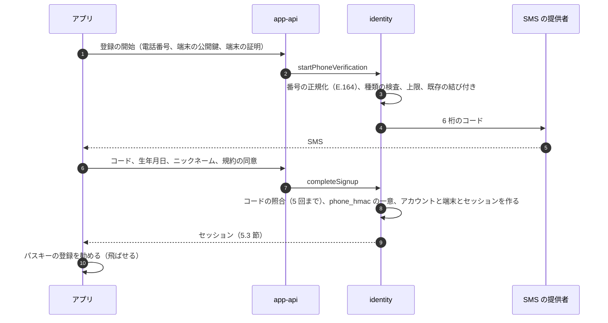
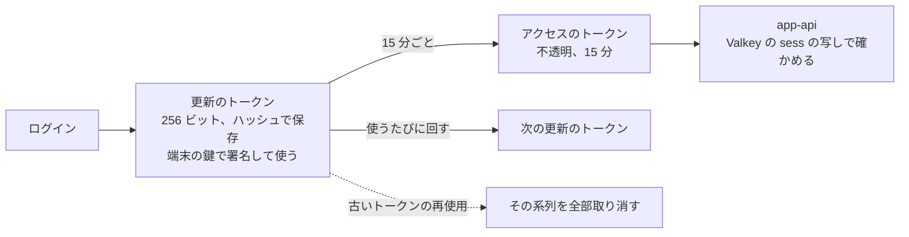
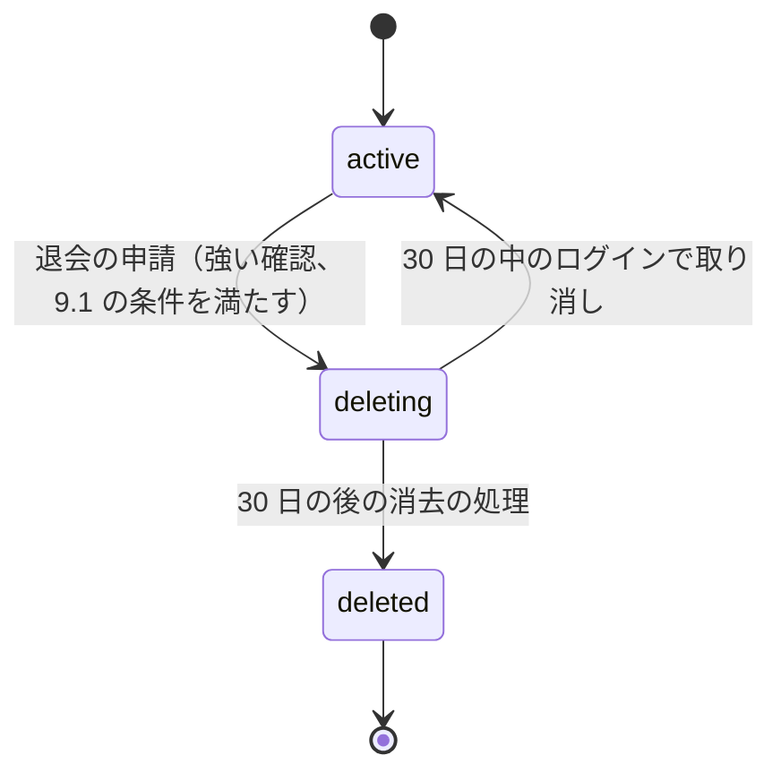

# Accounts and Devices: Mercari

アカウントの登録（電話番号の SMS の確認）、ログイン（パスキー、SMS の一時コード）、セッション、端末、乗っ取りの守り（売上金を狙う乗っ取り）、プロフィールとブロック、退会（取引が残るとき）、未成年の扱い、アプリの形を決める。

前提となる決定は次のとおり。

- 本人だけの表は FORCE RLS と `SET LOCAL app.actor_id`。`actor_id` はセッションからだけ決める（[ADR-0007](../decisions/0007-single-tenant-and-party-visibility.md)）
- 住所は `shipping` の金庫に置く（[ADR-0006](../decisions/0006-shipping-orchestration-via-carriers.md)）。鍵の配置は [security.md](security.md)
- ML と規則の点は信号で、アカウントの停止・売上金の保留は人の審査を通す（[ADR-0009](../decisions/0009-trust-and-safety-pipeline-boundary.md)）
- 売上金・残高の法的な扱いは `legal.*` の値で持つ（[ADR-0004](../decisions/0004-proceeds-model-under-payment-services-act.md)）

この文書で決めたことは次の ADR にある。

| ADR | 決定 |
| --- | --- |
| [0066](../decisions/0066-sign-in-sessions-and-devices.md) | 登録は電話番号の SMS の確認を必須にし、1 つの番号に有効なアカウントは 1 つ。ログインはパスキーを第一にし、パスキーのないアカウントだけ SMS の一時コードでログインできる。パスワードと、メールのログイン用のリンクは持たない。アプリのセッションは、端末の鍵で署名する回す更新のトークンと、15 分の不透明なアクセスのトークンで持ち、取り消しは 5 秒で効く。端末は利用者ごとに 20 まで。アプリは React Native（iOS・Android）、Web は React |
| [0067](../decisions/0067-account-takeover-step-up-and-payout-holds.md) | 口座の登録と変更、振込の申請、電話番号・メールアドレス・パスキーの変更を「大事な操作」とし、直近 10 分の強い確認（パスキー、パスキーがなければ SMS とメールの 2 つのコード）を求める。新しい端末での SMS のログイン、回復、電話番号・メール・口座の変更の後 72 時間は、振込を待たせる（本人の操作に結び付く決まった待ちで、措置ではない）。本人が「これは私ではない」を押すとアカウントを `locked` にする。危険の点だけでは錠をかけず、強い確認を求めるまでにする |
| [0068](../decisions/0068-account-deletion-and-minors.md) | 退会は、進行中の取引、完了から 14 日の中の取引、未完了の振込、0 円でない売上金・残高、開いた紛争・T&S の案件があれば受け付けない。受け付けたら 30 日の `deleting` の後に仮名にし、住所の金庫は鍵の破棄で消す。台帳と法令で残すものは残す（期間は法務の確認待ち：L5）。生年月日を登録で求め、18 歳未満は保護者の同意の確認を記録する。年齢で制限するカテゴリは `ageOf()` の 1 つの関数で判定する。未成年の上限の値は法務の確認待ち |

暗号化と運用者のアクセスは [security.md](security.md)、不正の兆しの規則は [trust-and-safety.md](trust-and-safety.md)、振込の実行は [payouts-and-points.md](payouts-and-points.md)、本人確認は [identity-verification.md](identity-verification.md)、通知は [notifications.md](notifications.md) にある。

## 1. 範囲

| 含む | 含まない（置き場所） |
| --- | --- |
| 登録、電話番号の確認、メールアドレスの確認 | eKYC と確認の水準（[identity-verification.md](identity-verification.md)） |
| ログイン、回復、セッション、端末 | 不正の規則のエンジンと審査（[trust-and-safety.md](trust-and-safety.md)） |
| 大事な操作の強い確認と、振込の待ち | 振込の実行と口座の確かめ（[payouts-and-points.md](payouts-and-points.md)） |
| 公開のプロフィール、ブロック | 評価の集計の表示（[ratings-and-reputation.md](ratings-and-reputation.md)） |
| 退会とデータの消し方の流れ | データの区分と保持の期間（[security.md](security.md) の 7 節） |
| 生年月日、未成年の扱いの枠、`ageOf()` | カテゴリごとの年齢の制限の値（[categories-brands-and-pricing-suggestions.md](categories-brands-and-pricing-suggestions.md)） |
| アプリの形（React Native）、端末の鍵、端末の証明 | アプリのリリースと最小のバージョン（[delivery.md](delivery.md) の 6 節） |

## 2. 要件

| 出どころ | 要件 | この文書の答え |
| --- | --- | --- |
| [intent.md](../intent.md) の MVP | 電話番号の SMS の確認、メールアドレス、パスキーと SMS の一時コード、セッション、端末の一覧と取り消し、プロフィール、ブロック、退会 | 4〜9 節 |
| NFR-014 | 本人だけのデータが他の利用者に出ない | `sessions`・`devices`・`accounts` の本人の列は FORCE RLS。公開のプロフィールは別の表 |
| NFR-007 | 購入と取引 月間 99.95% | ログインの部品が落ちても、発行済みのセッションで購入できる（12 節） |
| [architecture/README.md](README.md) の 6 節 | 乗っ取り（電話番号の乗り換え、SIM の乗っ取り）、売上金の現金化 | 7 節（ADR-0067） |
| [quality.md](../quality.md) の 5 節 E2 | 電話番号の確認、セッションの取り消し、乗っ取りの兆し。決定表と性質が緑 | 14 節 |
| 法務の L5 | 退会の後の保持の期限 | 9 節。期間は法務の確認待ち |
| 未成年（法務の確認待ち：L12） | 未成年の同意、取消し、上限 | 10 節。枠だけを作る |

## 3. 本家の形（確かめたこと）

いずれも 2026-10-10 に確認。

| 項目 | 事実 | この設計 |
| --- | --- | --- |
| パスキー | 端末のロックの解除（指紋、顔、パスコード）で使う。2 台目は登録済みの端末で QR を読んで足す。Web はアプリで登録したパスキーで、QR を読んでログインする（[ヘルプの記事 1874](https://help.jp.mercari.com/guide/articles/1874/)、[1875](https://help.jp.mercari.com/guide/articles/1875/)） | 同じ形（5.2 節） |
| パスキーの必須化 | 2026 年 5 月 29 日から順に、パスキーを設定した利用者はログインでパスキーが必須になり、メールアドレス・電話番号とパスワードのログインが一覧から外れる。代わりに Apple・Google・Facebook・LINE のアカウントと、メールのログイン用のリンクを選べる。パスキーのない利用者は今のまま（[ヘルプの記事 1860](https://help.jp.mercari.com/guide/articles/1860/)） | パスキーを設定したらパスキーを必須にする点を寄せる。パスワード、外のアカウントのログイン、メールのリンクは持たない（本家との違い。13 節） |
| 退会できない条件 | 出品中の商品、取引中の商品、取引の完了から 2 週間たたない売却済みの商品、完了していない振込の申請、登録したお支払い用の銀行口座、などがあると退会できない（[ヘルプの記事 250](https://help.jp.mercari.com/guide/articles/250/)） | 寄せる（9.1 節）。出品中の商品は退会の流れで一緒に止める |
| 未成年 | 規約の上の最低の年齢はない。未成年の登録・出品・購入には保護者の包括の同意が要る（口頭でもよい）。事務局が保護者に確かめることがある。自動車の出品・購入、オートバイの購入は 18 歳未満はできない。マイナンバーカードの IC の読み取りは 15 歳未満は使えない（[公式のコラム](https://jp-news.mercari.com/contents/26374)、2025-10-20。「掲載当時の内容」と断っている） | 枠を寄せる（10 節）。値は法務の確認待ち |
| 電話番号の確認の方式、1 番号のアカウントの数、乗っ取りの対策の中身 | 公式の資料で確かめられなかった（**未検証**） | 本システムの値 |

## 4. 登録と電話番号（ADR-0066）

### 4.1 流れ

### 4.2 規則

| 項目 | 値 |
| --- | --- |
| 受け付ける番号 | 日本の携帯の番号（`+81` の 70・80・90 で始まるもの）。050 の IP 電話と国外の番号は MVP で受けない（本システムの値。SMS の悪用の料金の対策を兼ねる） |
| コード | 6 桁、10 分で失効、照合 5 回で失効 |
| 送り直し | 60 秒の後。1 番号 1 日 5 通、1 IP 1 時間 10 通、1 端末 1 日 10 通 |
| 1 番号のアカウント | 有効なアカウント（`active`・`restricted`・`locked`）は 1 つ。`accounts.phone_hmac` に部分一意の索引 |
| 番号の持ち方 | 平文は `identity` の封筒の暗号化の列（[security.md](security.md) の 5 節）。引くのは HMAC（`phone_hmac`） |
| ニックネーム | 1〜20 文字。禁止の語の辞書（[trust-and-safety.md](trust-and-safety.md)）と、電話番号・メールアドレスの形を拒む |

- **番号の再利用**：携帯の番号は解約の後に別の人へ回る。新しい人が、すでに別のアカウント A に結び付いた番号を確かめたとき、A がその番号で 365 日 SMS を受けておらず、A の最後のログインが 365 日より前なら、新しい登録を許し、A を `phone_unbound` にする（A はパスキーでログインし、新しい番号を足す）。それ以外は登録を拒み、「この番号は使われています」と CS の窓口を出す（本システムの値）。
- **メールアドレス**：登録では任意。確かめるときは 6 桁のコードを送る（リンクにしない。[security.md](security.md) の 3.5 節）。口座の登録の前に、確認済みのメールアドレスを求める（`security` の通知の 2 つ目の経路にするため）。
- SMS の提供者は E2 の `sms-provider-selection` で選ぶ。1 社が落ちたときのために 2 社目を予備に持つ（9 節）。

## 5. ログインとセッション（ADR-0066）

### 5.1 方式

| 方式 | 使えるとき | 得る強さ |
| --- | --- | --- |
| パスキー（WebAuthn。端末のロックの解除） | パスキーを登録したアカウント | `strong` |
| SMS の一時コード | パスキーのないアカウント | `sms` |
| 回復（SMS のコード＋確認済みのメールのコード） | パスキーのあるアカウントで、パスキーの端末を失ったとき | `recovery`（7.3 節の 72 時間の制限） |
| Web のパスキー（登録した電話で QR を読む） | パスキーのあるアカウントの Web | `strong` |

- パスキーを登録したアカウントは、SMS のコードだけでは新しい端末にログインできない（本家の 2026 年 5 月の変更に寄せる）。
- パスキー：RP ID は `<brand>.<domain>`、見つけられる資格情報（discoverable）、`userVerification = required`。1 アカウント 10 まで。最後の 1 つを消すには、別のパスキーを足すか、回復を通す。
- パスワードは持たない。外のアカウント（Apple・Google など）のログインは MVP に入れない（[architecture/README.md](README.md) の 6 節の決定。識別の元を電話番号に 1 本にし、乗っ取りの入口を減らす）。

### 5.2 アプリのセッション

- 端末は登録の時に、取り出せない P-256 の鍵（iOS の Secure Enclave、Android の Keystore）を作り、公開鍵を `devices` に置く。更新の要求は、サーバーの nonce と時刻を端末の鍵で署名する。トークンを盗んでも、端末の鍵なしには使えない。
- 更新のトークンは使うたびに回す。古いトークンが再び使われたら、その系列（同じログインから続くトークン）を全部取り消し、`security` の通知を送る。
- 期限：使わない 90 日で失効、ログインから 1 年で再ログイン（本システムの値）。
- アクセスのトークンは 15 分の不透明な値。`app-api` は Valkey の `sess:{token_hash}`（`sessions` の写し）で、利用者、端末、強さ、ログインの時刻を引く。写しがなければ core の読み出しの写しで引く。
- 取り消し（ログアウト、端末の取り消し、`locked`、再使用の検出）は、`sessions` を書き、同じ処理で Valkey の写しを消す。5 秒以内に効く。

### 5.3 Web のセッション

- `__Host-session` の Cookie（`HttpOnly`、`Secure`、`SameSite=Lax`）。使わない 14 日、ログインから 30 日で失効。
- 状態を変える要求は、`SameSite` に加えて、ページに埋めた CSRF のトークンのヘッダーを求める。
- 購入・振込などの画面は、アプリと同じ API を通り、同じ強い確認（7 節）を求める。

### 5.4 セッションの一覧

- 利用者は、端末ごとのセッション（端末の名前、OS、アプリのバージョン、最後の利用、おおよその地域）を見られ、1 つずつ、または「この端末の他をすべて」取り消せる。
- おおよその地域は IP からの都道府県の推定だけを出し、IP そのものは出さない。

## 6. 端末（ADR-0066）

| 欄 | 内容 |
| --- | --- |
| `device_id` | サーバーが出す UUIDv7。端末の Keychain・Keystore に置く。機械の固有の ID を使わない |
| `platform`、`os_version`、`app_version`、`model_class` | 表示と最小のバージョンの判定（[delivery.md](delivery.md) の 6 節） |
| `device_pubkey` | 更新のトークンの署名の検証 |
| `attestation` | App Attest（iOS）・Play Integrity（Android）の結果の要約。信号だけで、通さない理由にしない |
| `push_token`、`push_permission` | プッシュ（[notifications.md](notifications.md) の 8 節） |
| `first_seen_at`、`last_seen_at`、`revoked_at` | 一覧と整理 |

- 1 人 20 台まで。21 台目の登録で、最後の利用の古い端末を取り消す。
- 180 日使わない端末は、プッシュのトークンを消す。1 年で行を取り消す。
- 端末の変更の事象（`device.registered`・`device.revoked`・`device.push_token_changed`）を outbox に書く。`notifier` の写しと、T&S の兆しが受ける。

## 7. 乗っ取りの守り（ADR-0067）

### 7.1 狙われるもの

乗っ取りの目的は、主に売上金・残高を自分の口座へ振り込ませること、残高・ポイントで品を買って転売すること、信用の高いアカウントで詐欺の出品をすることである（[security.md](security.md) の 3.1 節）。入口は、SMS のコードの詐取（偽の SMS・偽のサイトに入力させる）、SIM の乗っ取り、番号の再利用、盗んだ端末。

### 7.2 大事な操作（DT-ACC-001 の草案）

上から順に評価し、最初に一致した行を使う。

| # | 操作 | 条件 | 求めること | 待ち |
| --- | --- | --- | --- | --- |
| 1 | どれでも | アカウントが `locked`・`suspended` | 拒む（403） | — |
| 2 | 振込の口座の登録・変更 | — | 直近 10 分の `strong`（パスキーがなければ SMS とメールの 2 つのコード） | 新しい口座への振込は 72 時間待つ |
| 3 | 振込の申請 | 直近 72 時間に、新しい端末の `sms` のログイン、`recovery`、電話番号・メール・口座の変更がある | 直近 10 分の強い確認 | 申請は受け付け、実行は 72 時間の終わりまで待つ |
| 4 | 振込の申請 | それ以外 | 直近 10 分の強い確認 | なし |
| 5 | 電話番号の変更 | パスキーがある | `strong`＋新しい番号のコード | 72 時間の振込の待ち |
| 6 | 電話番号の変更 | パスキーがない | 古い番号のコード＋新しい番号のコード＋メールのコード（メールがなければ回復の流れ） | 同上 |
| 7 | メールアドレスの変更 | — | 強い確認＋新しいアドレスのコード。古いアドレスへ知らせる | 同上 |
| 8 | パスキーの追加・削除 | — | `strong`（最初の 1 つは `sms` から足してよい） | なし（削除だけ知らせる） |
| 9 | 売上金・残高・ポイントでの購入 | 新しい端末の最初の 24 時間、かつ 1 万円以上 | 強い確認 | なし |
| 10 | 配送先の住所の追加 | 新しい端末の最初の 24 時間 | 強い確認 | なし |
| 11 | それ以外の操作 | — | セッションだけ | なし |

- 「強い確認」は、パスキーがあればパスキー、なければ SMS のコード（2 の行はメールのコードも）。
- 72 時間の待ちは、本人の操作に結び付く決まった待ちで、規則のエンジンや ML の判定による売上金の保留（[ADR-0009](../decisions/0009-trust-and-safety-pipeline-boundary.md) の人の審査を要る措置）ではない。`identity` は `account_holds`（理由、終わりの時刻）を書き、`payouts` は振込の実行の前に `payoutHoldUntil(user)` を読む（[payouts-and-points.md](payouts-and-points.md)）。
- 待ちの始まりで、`security` の通知を全経路に送る（「振込の口座が変わりました。心当たりがなければ…」）。

### 7.3 回復と「これは私ではない」

- 回復（パスキーの端末を失った）：SMS のコード＋確認済みのメールのコードで `recovery` のセッションを得る。新しいパスキーを登録できる。72 時間は、振込・口座・電話番号・メールの変更ができない。他の端末のセッションには「回復が始まりました」を出し、72 時間の間に「これは私ではない」で回復を取り消せる。
- メールがない利用者の回復は、CS の窓口と本人確認（[identity-verification.md](identity-verification.md)）を通す。
- 「これは私ではない」（`security` の通知と、セッションの一覧から押せる）：アカウントを `locked` にし、全セッションを取り消し、振込を止め、口座と電話番号の変更を元に戻す依頼を CS の案件にする。進行中の取引は続ける（相手の買い手・売り手を守るため。発送の画面と受取評価は CS が代わりに進められる）。
- `locked` を解くのは、パスキー＋CS の確認、または本人確認（eKYC）＋CS の確認。

### 7.4 危険の兆し

| 兆し | 使い方 |
| --- | --- |
| 新しい端末、端末の証明の失敗 | 7.2 節の「新しい端末」の条件。T&S の兆しへ |
| IP の種類（データセンター、匿名の中継）、日本の外 | SMS のログインに強い確認（パスキーのないアカウントはメールのコードを足す） |
| 短い間の SMS のコードの要求の多さ（番号、IP、端末） | 4.2 節の上限。超えたら WAF の規則とチャレンジ |
| 電話番号の変更の直後のログイン、回復の直後の口座の変更 | 72 時間の待ち（7.2 節） |
| 同じ口座が多くのアカウントに登録される | T&S の兆し（[trust-and-safety.md](trust-and-safety.md)。口座の HMAC で数える） |

- 兆しは `fraud_signals` の事象として T&S に渡す。錠（`locked`）は、本人の操作か、T&S の人の判定でだけかける。危険の点だけでかけない（[ADR-0009](../decisions/0009-trust-and-safety-pipeline-boundary.md) と同じ考え）。
- SIM の乗っ取りの検出（携帯の会社の照会の API）は、使える API があるか**未検証**。MVP は持たず、パスキーを勧めることで守る。

## 8. プロフィールとブロック

- 公開のプロフィールは `profiles`（RLS の外の公開の表。[ADR-0007](../decisions/0007-single-tenant-and-party-visibility.md)）：ニックネーム、写真、自己紹介、本人確認の印、評価の集計（[ratings-and-reputation.md](ratings-and-reputation.md)）、出品の一覧。売上金、住所、閲覧の履歴、電話番号、メールアドレスは置かない。
- ブロック：`blocks`（本人の FORCE RLS）に（`blocker_id`、`blocked_id`）。ブロックした相手は、自分の出品を購入できない・コメントできない。ブロックの一覧は `listingVisible()` の入力（[ADR-0007](../decisions/0007-single-tenant-and-party-visibility.md)）。1 人 1,000 件まで。進行中の取引の相手をブロックしても、取引のメッセージと配送は続く。

## 9. 退会（ADR-0068）

### 9.1 受け付けの条件

次のどれかがあれば、退会を受け付けず、理由と次の手順を出す。

| 条件 | 理由 |
| --- | --- |
| 進行中の取引（`completed`・`cancelled`・`payment_expired` 以外） | 相手を残さない |
| 完了・取り消しから 14 日たたない取引 | 問題の報告と評価の窓（本家の 2 週間に寄せる） |
| 未完了の振込の申請 | お金の行き先 |
| 売上金・残高・ポイントが 0 円でない | 預かったお金の扱いは法務の確認待ち（L1）。少ない額（振込の手数料以下）の扱いも L1 の後に決める |
| 開いた紛争、`chargeback_receivable` の残り | 回収の相手 |
| 開いた T&S の案件、`suspended`・`locked` | 措置の逃れを防ぐ |

- 出品中の出品は、退会の流れの中で一括して止める（本家は自分で削除させる。本システムは手間を減らす）。
- 振込の口座の登録は、退会で消す（本家は登録があると退会できない。本システムは、売上金が 0 円なら口座を残す理由がない）。

### 9.2 流れ

- `deleting`：全セッションを取り消し、プロフィールと出品を非公開にし、通知を止める。30 日の間はログインで取り消せる。
- `deleted` への処理（`account-eraser` のジョブ。冪等で、段ごとに記録する）：
  1. 公開のプロフィールを消し、ニックネームを「退会したユーザー」にする。
  2. 出品を検索から外す（売れた品の検索からも外す）。写真は [listings-and-photos.md](listings-and-photos.md) の保持の規則で消す。
  3. 住所の金庫の利用者の鍵を破棄する（鍵の破棄で消す。[security.md](security.md) の 5.3 節）。
  4. 電話番号・メールアドレスの平文を消し、`phone_hmac` は再登録の制限のために残す（期間は法務の確認待ち：L5）。
  5. 閲覧の履歴、いいね、保存した検索、通知、設定、端末を消す。
  6. 台帳の仕訳、取引の記録、措置の記録、監査ログは残す（会計と法令の保持。期間は法務の確認待ち：L5・L8。利用者の ID のまま、個人のデータを含まない）。
  7. 取引の相手から見た取引の画面とメッセージは、相手のデータとして保持の期間まで残し、名前は「退会したユーザー」にする。
- 本人確認の書類と結果は、[identity-verification.md](identity-verification.md) の保持の規則（法務の確認待ち：L2・L5）に従う。
- 再登録：退会が終わった番号は再び登録できる。ただし、T&S の措置で `suspended` のまま退会したアカウントの番号は、`phone_hmac` で登録を拒む（期間は法務の確認待ち：L5）。

## 10. 未成年（ADR-0068）

- 登録で生年月日を求める（本人の申告）。年齢は `ageOf(user, at)` の 1 つの関数（`packages/identity`）で計算する。生年月日の変更は CS を通す（年齢の制限の逃れを防ぐ）。
- 18 歳未満の利用者は、登録で「保護者の同意を得た」ことの確認を求め、確認の日時と文のバージョンを記録する（本家の「包括の同意」に寄せた枠。同意の取り方と、同意のない取引の扱い（未成年者の取消し）は**法務の確認待ち：L12**。統合の工程で [intent.md](../intent.md) に足した）。
- **年齢で制限するカテゴリ**：カテゴリごとの `min_buyer_age`・`min_seller_age` は [categories-brands-and-pricing-suggestions.md](categories-brands-and-pricing-suggestions.md) が持つ（法務の確認待ち：L10）。出品の作成と `purchaseListing` は、`ageOf()` で判定する。生年月日のないアカウント（ない想定だが）は制限のあるカテゴリを使えない。
- **未成年の上限**：購入・振込の 1 回・1 か月の上限の枠を `legal.minor_purchase_limit_yen`・`legal.minor_payout_limit_yen` に置く。法務の結論（L12）まで、値は設定せず（制限なし）、本番で有効にしない。
- 本人確認の方式の年齢の制限（マイナンバーカードの IC の 15 歳未満など）は [identity-verification.md](identity-verification.md) が持つ。

## 11. アプリの形（ADR-0066）

| 面 | 技術 | 本システムで持つもの |
| --- | --- | --- |
| iOS・Android | React Native（TypeScript）。パスキー、端末の鍵、端末の証明、プッシュ、カメラは OS の API を薄いネイティブの部品で包む | 写真の撮影と縮小（[listings-and-photos.md](listings-and-photos.md)）、決済の提供者の入力部品（[ADR-0005](../decisions/0005-payments-via-providers-and-capture-at-purchase.md)）、運送会社の QR の表示 |
| Web | React | パスキー（QR）、SMS のログイン、同じ API |

- すべての要求に `X-<Brand>-Client: <platform>/<version> (<build>)` を付ける。最小のバージョンの判定に使う（[delivery.md](delivery.md) の 6 節）。
- アプリは API の応答をキャッシュしてよいが、住所・売上金・口座・本人確認の画面は端末の暗号化された領域にだけ置き、ログアウトで消す。

## 12. 失敗と回復

| 事象 | 影響 | 扱い |
| --- | --- | --- |
| SMS の提供者の障害 | 登録と SMS のログインができない | 2 社目へ切り替える（`ops.sms_provider`）。パスキーのログインと発行済みのセッションは影響なし |
| `identity` の障害 | 新しいログイン・更新ができない | アクセスのトークンは Valkey の写しで確かめるので、15 分は使える。更新の失敗はアプリが後退して再試行 |
| Valkey の障害 | セッションの写しがない | `app-api` は core の読み出しの写しで引く（遅れる。[capacity.md](capacity.md) の 4 節で読み出しの写しに余力を持つ） |
| 更新のトークンの再使用の誤検出（端末の時計、重なった要求） | 正しい利用者のログアウト | 2 秒の中の同じトークンの要求は同じ応答を返す（再使用とみなさない） |
| 乗っ取りの波（大量の SMS のコードの詐取） | 多くの振込の申請 | 72 時間の待ちが効く。[account-takeover.md](../runbooks/account-takeover.md) の手順で、必要なら `ops.payouts_enabled` で振込を止める（新しい口座だけに絞る枠は [payouts-and-points.md](payouts-and-points.md) で決める） |
| 消去の処理の途中の失敗 | 一部だけ消えた | 段ごとの記録から再開する。`deleted` は全段の後に付ける |

## 13. 上限

| 対象 | 値 | 持ち場所 |
| --- | --- | --- |
| SMS のコード | 6 桁、10 分、照合 5 回 | ADR-0066 |
| SMS の送信 | 1 番号 1 日 5 通、1 IP 1 時間 10 通、1 端末 1 日 10 通 | ADR-0066 |
| パスキー | 1 アカウント 10 | ADR-0066 |
| 端末 | 1 アカウント 20 | ADR-0066 |
| アプリのセッション | 使わない 90 日、最長 1 年 | ADR-0066 |
| Web のセッション | 使わない 14 日、最長 30 日 | ADR-0066 |
| アクセスのトークン | 15 分 | ADR-0066 |
| 強い確認の有効な間 | 10 分 | ADR-0067 |
| 振込の待ち | 72 時間 | ADR-0067 |
| 退会の取り消しの期間 | 30 日 | ADR-0068 |
| 退会の前の取引の窓 | 完了・取り消しから 14 日 | ADR-0068 |
| ブロック | 1 人 1,000 | この文書 |

**本家との意図した違い**（統合の工程で [architecture/README.md](README.md) の 1.4 節に足した）：パスワード、外のアカウントのログイン、メールのログイン用のリンクを持たない。出品中の出品と口座の登録があっても退会の流れで止める。

## 14. data-model への項目

| 置き場所 | 中身 | 鍵・索引 | 節 |
| --- | --- | --- | --- |
| core：`accounts` | `id`、`status`（`active`・`restricted`・`locked`・`suspended`・`phone_unbound`・`deleting`・`deleted`）、`phone_hmac`、`phone_ct`、`email_hmac`、`email_ct`、`email_verified_at`、`birth_date_ct`、`minor_consent_at`・`minor_consent_version`、`created_at`、`deleting_until`。本人の FORCE RLS | `phone_hmac` の部分一意（有効な状態）、`email_hmac` | 4、9、10 |
| core：`passkeys` | 資格情報の ID、公開鍵、署名の数、AAGUID、作成・最後の利用。本人の FORCE RLS | `(user_id)`、資格情報の ID の一意 | 5.1 |
| core：`sessions`、`refresh_tokens` | 系列の ID、今のアクセスのトークンのハッシュ（`access_token_hash`）、`device_id`、強さ（`strong`・`sms`・`recovery`）、ログインの時刻、最後の利用、取り消しの時刻と理由。更新のトークンの履歴は `refresh_tokens`（再使用の検出。[data-model.md](data-model.md) の D-8） | `access_token_hash` の一意、`(user_id)`、`refresh_tokens.token_hash` | 5 |
| core：`devices` | 6 節の欄 | `(user_id, last_seen_at)` | 6 |
| core：`phone_verifications` | 番号の HMAC、コードのハッシュ、試行の数、期限、IP の HMAC、端末。24 時間で消す | `(phone_hmac, created_at)` | 4.2 |
| core：`account_holds` | 理由（`new_device_sms`・`recovery`・`phone_changed`・`email_changed`・`bank_changed`）、始まり、終わり | `(user_id, ends_at)` | 7.2 |
| core：`step_ups` | 強い確認の記録（方式、時刻、操作）。90 日 | `(session_id, created_at)` | 7.2 |
| core：`profiles` | 公開のプロフィール（RLS の外の公開の表） | `user_id` | 8 |
| core：`blocks` | `blocker_id`、`blocked_id`、作成。本人の FORCE RLS | 主キー（2 列）、`blocked_id` | 8 |
| core：`account_erasure_jobs` | 退会の消去の段と結果 | `user_id` | 9.2 |
| Valkey | `sess:{token_hash}`（期限 15 分の写し）、SMS の上限の数え | — | 5.2、4.2 |
| outbox の事象 | `account.*`、`device.*`、`session.revoked`、`account.hold_started` | — | 6、7 |
| AppConfig | `ops.sms_provider`、`legal.minor_purchase_limit_yen`、`legal.minor_payout_limit_yen` | — | 10、12 |

## 15. テストと性質

| ID（草案） | 内容 | テスト |
| --- | --- | --- |
| DT-ACC-001 | 7.2 節の表の全行 | 表駆動 |
| PROP-ACC-001 | 任意の登録・番号の変更・退会・再利用の列で、1 つの `phone_hmac` に有効なアカウントは 0 か 1 | 性質ベース（Testcontainers の PostgreSQL、並行） |
| PROP-ACC-002 | 取り消したセッション・端末のトークンは、取り消しの 5 秒後から、どの API でも 401 | 性質ベース（取り消しと要求の並行） |
| PROP-ACC-003 | 更新のトークンの系列で、古いトークンの再使用（2 秒の外）の後、系列のどのトークンも使えない | 性質ベース |
| PROP-ACC-004 | 任意の操作の列で、`account_holds` の終わりの前に、待ちの対象の振込が実行されない | 性質ベース（`payouts` と結合、仮想の時計） |
| PROP-ACC-005 | 9.1 節の条件のどれかを満たすアカウントは `deleting` にならない。`deleted` のアカウントの電話番号・メール・住所の平文と金庫の鍵が残らない | 性質ベースと消去の後の走査 |
| — | 端末の鍵の署名のない更新の要求、別の端末の鍵の署名は 401 | 結合 |
| — | 年齢の制限：`ageOf()` の誕生日の境（前日・当日・うるう日） | 単体（仮想の時計） |
| — | 漏れの経路：公開のプロフィールとエラーの応答に、電話番号・メール・生年月日が出ない | [quality.md](../quality.md) の 2.2.1 節 G |

## 16. Story の候補

| Epic | Story | 中身 |
| --- | --- | --- |
| E2 | `sms-provider-selection` | 4.2 節。2 社目の予備 |
| E2 | `phone-verification-and-signup` | 4 節（ADR-0066） |
| E2 | `passkeys-and-sessions` | 5 節（ADR-0066） |
| E2 | `devices` | 6 節 |
| E2 | `account-takeover-signals` | 7 節（ADR-0067）。DT-ACC-001、`account_holds` |
| E2 | `profiles-and-blocks` | 8 節 |
| E2 | `account-deletion` | 9 節（ADR-0068）。保持の期間は法務：L5 |
| E2 | `age-and-minor-consent` | 10 節（ADR-0068）。同意と上限は法務の確認待ち |
| E10 | `payouts`（[payouts-and-points.md](payouts-and-points.md) と共同） | `payoutHoldUntil()` の読み出し |

## 17. 未解決の問い

### 決定（2026-10-10、既定案）

- **ログイン**：パスキーを第一、パスキーのないアカウントだけ SMS。パスワード・外のアカウント・メールのリンクなし（ADR-0066）。
- **セッション**：端末の鍵で署名する回す更新のトークン、15 分のアクセスのトークン、取り消し 5 秒（ADR-0066）。
- **番号**：日本の携帯の番号だけ。1 番号 1 有効アカウント。365 日の再利用の規則（ADR-0066）。
- **大事な操作**：DT-ACC-001、強い確認 10 分、振込の 72 時間の待ち（ADR-0067）。
- **錠**：本人か人の判定だけ（ADR-0067）。
- **退会**：9.1 節の条件、30 日の `deleting`、鍵の破棄（ADR-0068）。
- **未成年**：生年月日、同意の記録、`ageOf()`、上限は `legal.*` の枠（ADR-0068）。

### 持ち越し

| 問い | いつ・どう決めるか |
| --- | --- |
| 退会の後の保持の期間（電話番号の HMAC、取引の記録、メッセージ） | **法務の確認待ち：L5** |
| 売上金・残高の残る退会、少ない額の扱い | **法務の確認待ち：L1** |
| 未成年の同意の取り方、取消し、上限 | **法務の確認待ち：L12** |
| SMS の提供者と料金、SMS の悪用の料金の見積もり | E2 の `sms-provider-selection`（**未検証**） |
| SIM の乗っ取りの検出の API の有無 | E2 の後（**未検証**） |
| App Attest・Play Integrity の判定の扱い（信号の重み） | E14 の `fraud-signals` で T&S と決める |
| 外のアカウントのログイン（Apple など）を足すか | MVP の後。登録の離脱の率を見て PM が判断する |

## 出典

いずれも 2026-10-10 に確認。

- メルカリ, [ヘルプの記事 1860（生体認証を利用したログイン方法アップデートについてよくある質問）](https://help.jp.mercari.com/guide/articles/1860/)：2026 年 5 月 29 日から順に適用。パスキーを設定した人はパスキーが必須。パスキーを設定しない人は今のまま
- メルカリ, [ヘルプの記事 1874](https://help.jp.mercari.com/guide/articles/1874/)、[1875](https://help.jp.mercari.com/guide/articles/1875/)（パスキーでのログイン、Web の QR のログイン）
- メルカリ, [ヘルプの記事 250（退会手順・退会時の注意点・退会後の再登録）](https://help.jp.mercari.com/guide/articles/250/)：退会できない条件
- メルカリ, [公式のコラム（未成年の利用）](https://jp-news.mercari.com/contents/26374)（2025-10-20 の記事。掲載当時の内容）
- W3C, [Web Authentication Level 3](https://www.w3.org/TR/webauthn-3/)
- IETF, [RFC 6265bis](https://datatracker.ietf.org/doc/draft-ietf-httpbis-rfc6265bis/)（`__Host-` の接頭辞）
