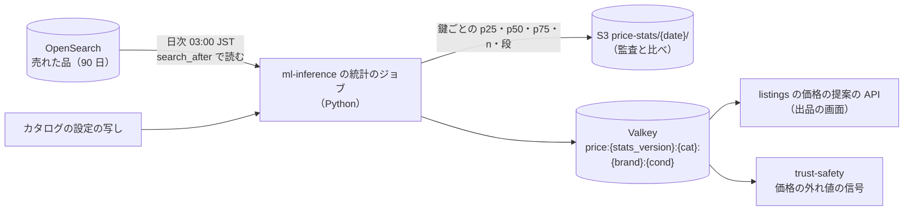

# Categories, brands and pricing suggestions: Mercari

カテゴリの木、状態の段、サイズ、ブランドの辞書と表記の揺れ、カテゴリごとの制限（法務の L10）、価格の提案の統計と表示（法務の L4）を決める。

前提となる決定は次のとおり。

- 価格の提案は助言だけ。MVP は、同じカテゴリ（最も深い階層）・ブランド・状態の、直近 90 日に売れた出品の価格の四分位と件数。件数が 20 に満たなければ状態を外し、次に親のカテゴリへ広げる。値は `ml-inference` の統計の関数が、検索の索引の売れた品から日次で計算し、Valkey に置く。出品の価格・手数料・送料・売上金の計算に使わない（[ADR-0010](../decisions/0010-ml-boundary-for-pricing-and-recommendations.md)）
- 同期の検査は、カテゴリごとの制限（法務の L10）を見る（[ADR-0009](../decisions/0009-trust-and-safety-pipeline-boundary.md)）
- 索引はブランドを正規化した ID と表記の揺れの辞書の展開で持ち、カテゴリは木の全祖先の ID で持つ（[ADR-0008](../decisions/0008-search-engine-and-index.md)）
- 販売の手数料の率は、カテゴリごとにバージョンの付いた表で持つ（[architecture/README.md](README.md) の 6 節の決定。表そのものは `ledger-and-proceeds.md`）

この文書で決めたことは次の ADR にある。

| ADR | 決定 |
| --- | --- |
| [0015](../decisions/0015-category-tree-brand-dictionary-and-restrictions.md) | カテゴリの木・状態の段・サイズの方式・ブランドの辞書・カテゴリごとの制限を、1 つのバージョンの付いた「カタログの設定」として出す。カテゴリの ID は変えず、廃止は後継の ID で写す。出品は木のバージョンを持つ。ブランドは ID と別名の表で持ち、正規化の関数を索引・検索・保存した検索・価格の提案で共有する。制限の値は法務の L10 の後に入れる |
| [0016](../decisions/0016-price-suggestion-from-sold-percentiles.md) | 価格の提案は、完了した取引の売れた価格から、1 売り手あたり 5 件までに絞り、措置した出品を除いて、線形の補間の四分位（25%・50%・75%）を日次で出す。広げ方は（カテゴリ、ブランド、状態）→（カテゴリ、ブランド）→（親のカテゴリ、ブランド）→（カテゴリ）の 4 段。表示は 10 円・100 円の単位に丸める。同じ値を T&S の価格の外れ値の信号に使う |

## 1. 範囲

- 扱う：カテゴリの木（3 階層）と各カテゴリの属性、状態の段（6 段）、サイズの方式、ブランドの辞書と正規化、カテゴリの語の辞書、カテゴリごとの制限の枠組み、価格の提案の計算・置き場所・表示、カタログの設定のバージョンと出し方。
- 扱わない：
  - 手数料の表（`ledger-and-proceeds.md`）。カテゴリはその表の鍵になる `fee_class` だけを持つ。
  - 配送の方法とサイズの段（`shipping-integrations.md`）。カテゴリは既定の配送の段の候補だけを持つ。
  - 禁止の品の一覧の中身と措置（[trust-and-safety.md](trust-and-safety.md) の 11 節）。この文書は制限を持つ場所と効き方を決める。
  - ML の価格の提案（MVP の後。ADR-0010）。

## 2. 事実（確かめたこと）

いずれも 2026-10-10 に確認。

| 項目 | 事実 | この設計 |
| --- | --- | --- |
| 本家のカテゴリの階層と状態の段 | 3 階層と 6 段は [intent.md](../intent.md) の MVP の範囲。本家の現在の木の中身と段の文言は、この設計では写さない | 木と文言は自前に作る。本家のカテゴリの一覧・ブランドの一覧を取り出して使わない（[リポジトリ共通の ADR-0007](../../../../docs/decisions/0007-no-reuse-of-original-implementation.md)） |
| 本家の価格の提案の方式 | 公式の資料で確かめられなかった（**未検証**。ADR-0010） | 売れた品の統計 |
| Sudachi の辞書の差し替え | Amazon OpenSearch Service の Sudachi のプラグインは、辞書を付け直しても次の blue/green のデプロイまで反映しない。新しいパッケージで新しい索引を作って作り直す方法もある（[Plugins by engine version](https://docs.aws.amazon.com/opensearch-service/latest/developerguide/supported-plugins.html)） | ブランドの別名は Sudachi の辞書に入れず、索引の時の展開（5.3 節）で持つ。辞書の更新を待たずにブランドを足せる |

## 3. 要件

| 要件 | 値 | 出どころ |
| --- | --- | --- |
| 出品の速さ | 写真の撮影から公開まで中央値 60 秒。カテゴリ・ブランドの候補と価格の提案は出品の画面で 300ms 以内に出す | K10 |
| 価格の提案の境界 | 提案の値が、出品の価格・手数料・送料・売上金の計算の入力に現れない | ADR-0010 |
| 価格の提案の新しさ | 日次。前日の 23:59:59 までに完了した取引を、翌日 06:00 までに反映 | 本システムの値 |
| 設定の変更 | カタログの設定の変更が、出品・検索・保存した検索・価格の提案で同じバージョンに揃う | 4.5 節 |
| 制限 | カテゴリごとの制限を同期の検査で効かせる（p95 2 秒の中で） | NFR-009 |

## 4. カテゴリと属性（ADR-0015）

### 4.1 木

- 3 階層。1 階層目 15 前後、2 階層目 150 前後、3 階層目 1,200 前後（本システムの見込み）。出品は 3 階層目を必ず選ぶ。
- カテゴリの ID は整数で、一度付けたら変えない・使い回さない。名前の変更・移動（親の変更）は ID を変えない。
- 廃止は `retired` にし、後継の ID（`successor_id`）を持つ。廃止したカテゴリでは新しく出品できない。既存の出品は ID を変えず、検索・絞り込み・価格の提案では後継に写して数える。
- 移動・廃止は、検索の索引のカテゴリの祖先の欄を変える。カタログの設定のバージョンを上げたら、影響する出品を索引で作り直す（[search-and-discovery.md](search-and-discovery.md) の 4.5 節）。

### 4.2 カテゴリの属性

| 属性 | 例 | 使い道 |
| --- | --- | --- |
| `size_scheme` | `apparel_alpha`（XS〜4XL、FREE）、`shoes_cm`（14.0〜32.0、0.5 刻み）、`kids_cm`（50〜160、10 刻み）、`none` | サイズの欄の選択肢 |
| `brand_mode` | `required`・`optional`・`none` | ブランドの欄 |
| `condition_scheme` | `standard`（6 段）、`media`（本・CD などで同じ 6 段に別の説明） | 状態の説明の文 |
| `fee_class` | `standard`（既定） | 手数料の表の鍵（`ledger-and-proceeds.md`） |
| `default_shipping_tiers` | `<Brand>便` のサイズの段の候補 | 配送の欄の初期値 |
| `restriction` | 4.6 節 | 同期の検査 |
| `min_seller_age`・`min_buyer_age` | 18 など（値は法務の確認待ち L10・L12） | 出品の作成と `purchaseListing` が `ageOf()` で判定する（[accounts-and-devices.md](accounts-and-devices.md)、[ADR-0068](../decisions/0068-account-deletion-and-minors.md)） |
| `keywords` | 代表の語（Sudachi の正規化した形） | 題名とカテゴリの食い違いの警告、カテゴリの候補（4.4 節） |

### 4.3 状態の段

| コード | 画面の文言（本システムの案） |
| --- | --- |
| `new_unused` | 新品・未使用 |
| `nearly_unused` | 未使用に近い |
| `no_visible_damage` | 目立った傷や汚れはない |
| `minor_damage` | 少し傷や汚れがある |
| `visible_damage` | 傷や汚れがある |
| `poor` | 全体に状態が悪い |

- コードは英語の識別子で持ち、文言はカタログの設定に置く。文言を変えてもコードを変えない。
- 価格の提案と順位の式は、コードで状態を扱う。

### 4.4 カテゴリの候補

- 出品の画面で、題名の語から候補のカテゴリを 3 つ出す。
- 計算：題名を Sudachi の正規化した形に分け、各語について「その語を題名に持つ出品が選んだ 3 階層目のカテゴリ」の分布（直近 90 日の公開の出品、日次で集計）を引き、語ごとの対数の確率を足す（多項の素朴なベイズ。平滑化の α = 1）。上位 3 つを出す。
- 始めは出品のデータがない。カタログの設定の `keywords` を、1 語につき 20 件の仮の出品として数えて始める。
- 候補は助言で、選ぶのは売り手。題名とカテゴリの食い違いの警告（[listings-and-photos.md](listings-and-photos.md) の 6.2 節）も、同じ分布を使う。

### 4.5 カタログの設定とバージョン

- カテゴリの木・属性・状態の段の文言・サイズの方式・ブランドの辞書・制限を、1 つのカタログの設定（`catalog_version`、整数）にまとめる。
- 正本は Aurora core の `catalog_*` の表で、運用の画面（カタログの担当）が下書きを作り、別の担当が承認して公開する。公開で `catalog_version` を上げ、S3 に全体の写し（JSON）を書き、outbox に `catalog.published` を出す。
- 各サービス（`listings`、`search-api`、`search-indexer`、`saved-search-matcher`、`ml-inference`、アプリ）は写しを読み、メモリーに置く。読み込みは `catalog.published` で行い、5 分ごとにもバージョンを確かめる。
- 出品は作った時の `category_tree_version` を持つ。古いバージョンの出品は、後継の写しで今のバージョンに読み替える。
- アプリは起動時と 1 時間ごとにバージョンを確かめ、違えば写しを取り直す。

### 4.6 カテゴリごとの制限（枠組み。法務の確認待ち L10）

| 制限の種類 | 効き方 |
| --- | --- |
| `prohibited` | 出品できない。同期の検査が `block` を返す（禁止のカテゴリを選んだことは完全な一致にあたる） |
| `requires_review` | 公開の前に非同期の分類器と規則を待つ（`wait_for_async`） |
| `requires_kyc` | 売り手が決めた本人確認の水準を満たさないと出品できない（[identity-verification.md](identity-verification.md) の 5 節） |
| `seller_cap` | 1 人が同時に出せる数の上限 |
| `notice` | 出品の画面に注意の文を出す（法令の表示など） |

- どのカテゴリにどの制限を置くか（医薬品、酒類、たばこ、チケット、武器、生き物など）は、法務の確認待ち（[intent.md](../intent.md) の L10）。カタログの設定の `restriction` の値は、結論の後に入れる。
- 結論の前は、開発の環境だけで仮の値を置く。本番の `restriction` が空のままなら、GA の判定（E18）を通さない。禁止の品の語・規則は [trust-and-safety.md](trust-and-safety.md) の 11 節で持つ。

## 5. ブランドの辞書（ADR-0015）

### 5.1 形

- `brands`：`brand_id`（整数）、正式な名前（日本語、英字）、`status`（`active`・`merged`）、`merged_into`、`category_scope`（よく出る 1 階層目のカテゴリ）。
- 偽ブランドの危険の段（`counterfeit_risk`：`high`・`normal`）は T&S の `brand_risk_profiles` が持つ（[trust-and-safety.md](trust-and-safety.md) の 11.1 節。[data-model.md](data-model.md) の D-12）。`brands` には置かない。
- `brand_aliases`：`alias`（正規化した後の文字）、`brand_id`、`kind`（`ja`・`en`・`abbr`・`typo`）、`ambiguous`（別のブランド・普通の語と重なる）。
- S1 の見込み：ブランド 2 万、別名 10 万。中身は自前で作る（カタログの担当、権利者の窓口からの申し出、出品の題名の頻出の語の候補）。本家・他のサービスの一覧を取り出して使わない。

### 5.2 正規化（`normalizeBrandText`）

索引・検索・保存した検索・価格の提案・ブランドの候補が、同じ 1 つの関数（`packages/catalog/normalize`）を使う。

1. NFKC（全角の英数を半角へ、半角カナを全角へ）。
2. 英字を小文字に。
3. ひらがなをカタカナに。
4. 空白・中黒（・）・ハイフン類（-‐－―）・ピリオド・アポストロフィ・アンド記号（&）を除く。
5. 長音の揺れ：「ー」「〜」「～」を「ー」に揃え、末尾の「ー」を除く。
6. 「ヴァ・ヴィ・ヴ・ヴェ・ヴォ」を「バ・ビ・ブ・ベ・ボ」に揃える。

例：「ルイ・ヴィトン」「ルイヴィトン」「LOUIS VUITTON」（英字の別名を登録）は、「ルイビトン」と「louisvuitton」になり、どちらも同じ `brand_id` を引く。英字とカナは別名の行で結ぶ（正規化で英字をカナに直さない）。

### 5.3 使い方

- **ブランドの候補**：出品の題名を正規化し、全別名の Aho–Corasick の照合で一致を引く。`ambiguous` の別名だけの一致は候補にしない（例：普通の語と同じ綴りのブランド）。上位 3 つを出す。
- **索引**：出品の `brand_id` と、そのブランドの正式な名前と全別名を、索引の `brand_text` の欄に入れる（[search-and-discovery.md](search-and-discovery.md) の 4.2 節）。
- **検索**：問い合わせの文を正規化し、ブランドの別名に完全に一致する部分があれば `brand_id` の語を `should` に足し、順位の点を上げる。
- **統合**：同じブランドの重複は、片方を `merged` にし、`merged_into` で写す。出品の `brand_id` は書き換えず、読み出しで写す。

## 6. 価格の提案（ADR-0016）

### 6.1 標本

- **元**：検索の索引の、`status = sold` で `sold_at` が直近 90 日の文書（[search-and-discovery.md](search-and-discovery.md) の 4 節）。`sold` は取引の `completed` で付く（ADR-0011）。取り消し・期限切れの取引の価格は入らない。
- **除くもの**：
  - 措置の記録のある出品（偽ブランド、禁止の品）。索引の `mod_flags` で除く。
  - 価格が 300 円の出品のうち、同じ売り手と買い手の組で 30 日に 3 件以上のもの（評価の稼ぎの疑い。[ratings-and-reputation.md](ratings-and-reputation.md) の 6 節）。
- **1 売り手の上限**：1 つの鍵の中で、1 人の売り手の標本は新しい順に 5 件まで。1 人が高く・安く売り続けて提案を動かすのを抑える。
- **価格**：出品の価格（買い手が払った代金）。送料の負担の違いは補正しない。画面に「送料の負担を問わない」と出す。

### 6.2 広げ方

| 段 | 鍵 | 画面の注記 |
| --- | --- | --- |
| 1 | （3 階層目のカテゴリ、ブランド、状態） | なし |
| 2 | （3 階層目のカテゴリ、ブランド） | 「状態を問わない」 |
| 3 | （2 階層目のカテゴリ、ブランド） | 「近いカテゴリを含む」 |
| 4 | （3 階層目のカテゴリ）（ブランドが「なし」のときは段 1 で状態つき、段 2 で状態なし） | 「ブランドを問わない」 |

- 上から順に、上限で絞った後の件数 n が 20 以上の最初の段を使う。どの段でも 20 未満なら出さない（ADR-0010）。
- ブランドが「なし」の出品は、ブランドの鍵を「なし」として段 1・2 を作り、段 3 は（2 階層目、なし）、段 4 は使わない。

### 6.3 計算

- 四分位は線形の補間（標本を小さい順に x₁ ≤ … ≤ xₙ、p の分位は h = (n − 1)p + 1、⌊h⌋ と ⌈h⌉ の間を補間）。整数の円で、補間の端数は四捨五入する。
- 表示の丸め：1 万円未満は 10 円単位、1 万円以上は 100 円単位に四捨五入。丸めは表示の時だけで、保存は円のまま。
- 出すもの：p25、p50、p75、n、段、`computed_at`、`catalog_version`、`stats_version`（計算の規則のバージョン）。

**例：ワイヤレスイヤホン（3 階層目 1203）、ブランド 88、状態 `nearly_unused`**

1. 段 1（1203、88、`nearly_unused`）：直近 90 日の標本 14 件。上限で絞っても 14 件で、20 未満。
2. 段 2（1203、88）：標本 23 件。売り手 S が 7 件を売っていたので、S の古い 2 件を除き 21 件。20 以上なので段 2 を使う。
3. 小さい順の 21 件（円）：4,800、5,500、6,000、6,200、6,500、6,800、7,000、7,200、7,500、7,800、8,000、8,000、8,300、8,500、8,800、9,000、9,500、9,800、10,500、12,000、18,000。
4. p25：h = 20 × 0.25 + 1 = 6 → x₆ = 6,800。p50：h = 11 → x₁₁ = 8,000。p75：h = 16 → x₁₆ = 9,000。
5. 画面：「同じような品が売れた価格：6,800〜9,000 円（真ん中 8,000 円、21 件、状態を問わない、直近 90 日）」。18,000 円の 1 件は四分位に効かない。
6. 売り手が価格の欄に 7,500 円と入れても、提案の値は出品に保存しない。保存するのは売り手の入れた価格だけ。

### 6.4 置き場所と流れ

- S1 の量：売れた品 10 万件/日 × 90 日 ≒ 900 万件。1 日 1 回、全件を読んで計算する（Python の単一のタスクで 20 分程度の見込み）。鍵の数は、標本のある組だけで 50 万前後の見込み。Valkey の量は 1 鍵 100 バイトで 50 MB。
- 段ごとに全部の鍵を計算して置く（段 1〜4 の鍵を別々に）。API は段 1 から順に引き、最初に n ≥ 20 の値を返す（Valkey の 4 回の取得を 1 回のパイプラインで）。
- 新しい計算は `price:{stats_version}:{date}` の新しい名前空間に書き、書き終えてから「今の日付」の印を付け替える。途中の失敗で半分の値を出さない。前日の値を 3 日残す。
- 計算が 2 日続けて失敗したら、提案を出さない（古すぎる相場を出さない）。

### 6.5 表示（法務の確認待ち L4）

- 価格の欄の上に、幅（p25〜p75）と真ん中の値と件数と注記を出す。価格の欄に自動で入れない。「真ん中の値を使う」のボタンは置いてよい（ADR-0010）。
- 出品の公開の後に、買い手の画面に「相場より安い」などの比べの表示を出さない（二重価格表示・誤認の表示のおそれ。法務の確認待ち L4）。
- 文言と、表示してよい範囲（売り手の画面だけか、買い手の画面にも出すか）は、法務の L4 の確認の後に確定する。それまで `release.price-suggestion-display` の裏に置く。

### 6.6 T&S の価格の外れ値の信号

- `price_ratio = 出品の価格 / p50`（段 1〜3 のどれかで n ≥ 20 のとき。段 4 は使わない）。
- 信号は `price_ratio` の値そのものと、使った段と n。閾値は規則で決める（[trust-and-safety.md](trust-and-safety.md) の 7.3 節）。提案の値を措置の決定に直接使わない（ADR-0009）。

## 7. 失敗と回復

| 事象 | 影響 | 扱い |
| --- | --- | --- |
| 統計のジョブの失敗 | 前日の値のまま | 再試行 2 回。2 日続けば提案を止め、T&S の価格の外れ値は「信号なし」で回す |
| Valkey の喪失 | 提案が出ない | S3 の写しから入れ直す（10 分） |
| カタログの設定の誤った公開 | 誤ったカテゴリ・文言が出る | 前のバージョンを公開し直す（バージョンを上げて内容を戻す）。出品の `category_tree_version` は変えない |
| ブランドの別名の誤り（普通の語を別名にした） | ブランドの候補・検索の点が誤る | 別名を `ambiguous` にするか消す。索引の `brand_text` は作り直しの対象の出品だけ直す |
| 標本の操作（自作自演の高値・安値） | 提案が動く | 1 売り手 5 件の上限、評価の稼ぎの除外。動きは日次の差の監視（p50 が前日から ±30% 以上動いた鍵の数）で見る |

## 8. 上限

| 対象 | 値 |
| --- | --- |
| カテゴリ | 3 階層、3 階層目 3,000 まで |
| ブランド | 10 万、別名 1 ブランド 50 まで |
| カタログの設定の公開 | 1 日 4 回まで（索引の作り直しの量を抑える） |
| 価格の提案 | n ≥ 20、標本 90 日、1 売り手 5 件 |
| 提案の API | 出品の画面から p99 100ms（Valkey の 1 回のパイプライン） |

## 9. data-model への項目

| 置き場所 | 中身 | 節 |
| --- | --- | --- |
| Aurora core `catalog_versions`（`catalog_version`、`state`（`draft`・`approved`・`published`）、`created_by`、`approved_by`、`published_at`、`s3_key`） | カタログの設定のバージョン | 4.5 |
| Aurora core `categories`（`category_id`、`parent_id`、`depth`、`name_ja`、`status`、`successor_id`、`size_scheme`、`brand_mode`、`condition_scheme`、`fee_class`、`default_shipping_tiers`、`restriction`（JSON）、`min_seller_age`、`min_buyer_age`、`keywords`、`from_version`・`to_version`（その行が効くカタログのバージョンの範囲。[data-model.md](data-model.md) の D-7）） | カテゴリ | 4 |
| Aurora core `brands`、`brand_aliases`（5.1 節の列と `from_version`・`to_version`） | ブランドの辞書 | 5 |
| Aurora core `category_term_stats`（`term`、`category_id`、`term_count`、`window_end`）。日次 | カテゴリの候補 | 4.4 |
| S3 `catalog/{catalog_version}.json`、`price-stats/{date}/{stats_version}.parquet` | 写し | 4.5、6.4 |
| Valkey `price:{stats_version}:{date}:{level}:{cat}:{brand}:{cond}`、`price:current` | 価格の提案 | 6.4 |
| outbox の話題 `catalog.published` | バージョンの公開 | 4.5 |
| AppConfig `release.price-suggestion-display` | 表示の切り替え | 6.5 |

## 10. テストと性質

| ID | 性質・試験 |
| --- | --- |
| PROP-CAT-001 | 任意のカテゴリの木の変更（追加、移動、廃止）の列で、各カテゴリの ID は 1 つの意味だけを持つ（使い回さない）。廃止したカテゴリの後継の連なりは循環しない |
| PROP-CAT-002 | `normalizeBrandText` は冪等（2 回かけても同じ）で、索引・検索・保存した検索で同じ結果を返す（3 つの呼び出しの口で同じ関数を使うことを依存の lint で確かめる） |
| PROP-CAT-003 | 任意の標本で、p25 ≤ p50 ≤ p75、どれも標本の最小と最大の間。標本の順序を入れ替えても結果は同じ |
| PROP-CAT-004 | 任意の標本で、1 人の売り手の標本を何件足しても、その売り手が鍵の標本に占める数は 5 以下 |
| PROP-CAT-005 | 価格の提案の値が、出品の価格・手数料・送料・売上金の計算の関数の入力に現れない（依存の lint と型。ADR-0010） |
| PROP-CAT-006 | n < 20 の段は使わない。どの段も 20 未満なら提案を返さない |
| 試験のベクトル | 6.3 節の例（21 件 → 6,800・8,000・9,000）。ブランドの正規化（全角・半角、かな・カナ、中黒、ヴ、長音） |
| 表駆動 | 4.6 節の制限の種類ごとの同期の検査の結果 |

## 11. Story の候補

| Epic | Story | 中身 |
| --- | --- | --- |
| E4 | `category-tree-and-conditions` | カテゴリの木、属性、状態の段、サイズの方式、カタログの設定のバージョン（4 節） |
| E4 | `brand-dictionary` | ブランドと別名、正規化、候補、統合（5 節） |
| E4 | `category-suggestions` | カテゴリの候補と食い違いの警告の分布（4.4 節） |
| E4 | `category-restrictions` | 制限の種類と同期の検査への受け渡し（4.6 節）。範囲は法務：L10 |
| E4 | `price-suggestion-stats` | 標本、広げ方、四分位、日次のジョブ、Valkey（6.1〜6.4 節） |
| E4 | `price-suggestion-display` | 出品の画面の表示（6.5 節）。文言は法務：L4 |

## 12. 未解決の問い

### 決定（2026-10-10、既定案）

- **カタログの設定**：木・属性・状態の段・ブランド・制限を 1 つのバージョンで出す。ID は変えない。廃止は後継で写す（ADR-0015）。
- **ブランドの別名**：Sudachi の辞書に入れず、索引の時の展開で持つ。
- **価格の提案**：完了した取引の価格、措置した出品を除く、1 売り手 5 件、線形の補間の四分位、4 段の広げ方、表示の丸め（ADR-0016）。
- **送料の負担**：補正しない。注記を出す。

### 持ち越し

| 問い | いつ・どう決めるか |
| --- | --- |
| 制限するカテゴリと禁止の品の範囲（L10） | 法務の確認待ち。E4 の `category-restrictions` の spec の承認の前 |
| 価格の提案の文言と、買い手の画面に出してよいか（L4） | 法務の確認待ち。E4 の `price-suggestion-display` の spec の承認の前 |
| 送料の負担で価格を補正するか（売り手の負担の出品は送料の分だけ高い） | S1 の運用で、補正した場合との誤差を比べて PM が決める |
| カテゴリの木の中身（1・2・3 階層目の一覧） | E4 の前に PM とカタログの担当が作る（本家の木を写さない） |
| 1 売り手 5 件と n ≥ 20 の値 | S1 の 3 か月のデータで、提案と実際の売れた価格の誤差を見て Dev と QA が見直す |
