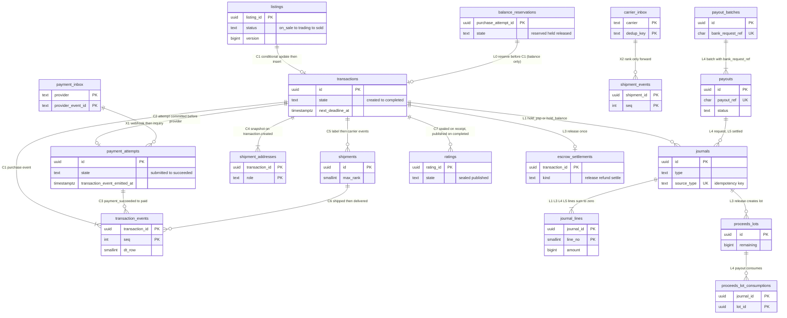

# Data model: Mercari

データモデルの正本。規約、置き場所、全体の ER 図、購入から振込までの道筋、横断の不変条件、この工程で決めたことを、ここに置く。領域ごとの表の目録（列・キー・索引・CHECK・RLS・分割・保持・量）と ER 図、Aurora の外の置き場所は [data-model/](data-model/) に置く。

- **列・制約・索引・置き場所の形の正本は、このファイルと `data-model/` の各ファイル**である。領域の文書は振る舞いの正本で、各文書の「data-model への項目」の節は提案の記録として残す。両者が食い違ったら、このデータモデルに合わせて領域の文書を直す。
- 実装の変更（開発リポジトリの `changes/`）でマイグレーションや形を変えるときは、同じ PR でここを更新する。移行の段（広げる → 移す → 縮める）と守る物は [delivery.md](delivery.md) の 5 節（[ADR-0078](../decisions/0078-pipeline-schema-ordering-ledger-migrations-and-flag-governance.md)）。
- 方針の元は [ADR-0002](../decisions/0002-transaction-state-machine-and-single-purchase.md)（一品の一回の購入）、[ADR-0003](../decisions/0003-escrow-and-double-entry-ledger.md)（預かりと複式簿記）、[ADR-0004](../decisions/0004-proceeds-model-under-payment-services-act.md)（売上金と `legal.*`）、[ADR-0007](../decisions/0007-single-tenant-and-party-visibility.md)（単一のテナントと 2 者の RLS）、[ADR-0069](../decisions/0069-key-layout-and-vault-envelope-encryption.md)（鍵と封筒の暗号化）、[ADR-0071](../decisions/0071-data-classes-and-lifecycle.md)（データの区分と寿命）、[ADR-0073](../decisions/0073-aurora-layout-osaka-dr-and-ledger-rpo.md)（3 つの Aurora）。
- 「S1 の量」は S1（MAU 300 万、公開中の出品 3,000 万、新しい出品 30 万件/日、取引 10 万件/日、保存した検索 2,000 万）の**初期見積もり**である（[README.md](README.md) の 2 節、[capacity.md](capacity.md)）。登録のアカウントは MAU の 3 倍の 900 万と置いた。E18 の負荷試験で置き換える。
- 保持の期間の多くは**法務の確認待ち（L5。本人確認は L2、会計は L8）**である。結論まで、表の「保持」は既定の値を書く。

2026-10-10 のデータモデルの工程で、索引だった文書を、表の目録と ER 図を持つ正本に書き直した（7 節）。

## 1. ファイルの構成

| ファイル | 領域 | 表の数 |
| --- | --- | --- |
| [data-model/accounts-devices-and-verification.md](data-model/accounts-devices-and-verification.md) | アカウント、プロフィール、パスキー、セッションと更新のトークン、端末、電話番号の確認、振込の待ち、強い確認、ブロック、退会の消去、本人確認（セッション、記録、指紋、inbox、開く機能の表） | 16 |
| [data-model/listings-photos-and-catalog.md](data-model/listings-photos-and-catalog.md) | 出品、遷移の記録、下書き、写真、事業者の兆し、カタログのバージョン、カテゴリ、ブランドと別名、カテゴリの候補の統計 | 10 |
| [data-model/search-and-saved-searches.md](data-model/search-and-saved-searches.md) | 索引の作り直し、いいね、閲覧の履歴、発見の設定、保存した検索、照合の鍵、鍵の流量、一致、まとめの窓 | 9 |
| [data-model/transactions.md](data-model/transactions.md) | 取引、取引の事象、キャンセルの申し出、出品と取引の照合 | 5 |
| [data-model/payments.md](data-model/payments.md) | 支払いの試行、Webhook の inbox、保存したカード、返金、チャージバック | 5 |
| [data-model/ledger-and-proceeds.md](data-model/ledger-and-proceeds.md) | 口座（22 の種類）、残高、仕訳（30 の型）と行、預かりの決着、売上金のロットと消費、期限の状態、資金の日次の集計、外部の明細、3 段の照合、運送会社の請求、売上金の保留、手数料の表。3,000 円の売買の仕訳の例 | 17 |
| [data-model/payouts-and-points.md](data-model/payouts-and-points.md) | 振込先の口座、金融機関、営業日、振込、まとめ、振込の止め、ポイントのロット、キャンペーンと付与、残高の引き当て | 10 |
| [data-model/shipping-and-address-vault.md](data-model/shipping-and-address-vault.md) | 送料の表、配送、受け付けの番号と QR、運送会社の事象と inbox、事故の請求、住所録、配送ごとの住所の写し | 9 |
| [data-model/messaging-comments-and-ratings.md](data-model/messaging-comments-and-ratings.md) | 商品のコメント、取引のメッセージ、未読、保持の写し、絞り込みの記録と辞書、評価、評価の集計 | 8 |
| [data-model/trust-and-safety.md](data-model/trust-and-safety.md) | 措置と事象、規則の評価、信号、規則の束と承認、禁止の語・写真のハッシュ・品の種類、ブランドの危険の段、審査の案件、異議、通報と証拠、権利者、法令の案件 | 17 |
| [data-model/disputes-and-support.md](data-model/disputes-and-support.md) | 案件（紛争、問い合わせ、受取評価の後、法令の照会）、事象、添付、承認 | 4 |
| [data-model/notifications.md](data-model/notifications.md) | お知らせの一覧、送信の記録、配信の設定、通知の設定、fan-out の仕事、止めたメールアドレス | 6 |
| [data-model/security-audit-and-lifecycle.md](data-model/security-audit-and-lifecycle.md) | 金庫の鍵、データの鍵、監査の事象と鎖の頭、保全の印、運用者の JIT の権限と見せた記録、保持と削除の規則 | 7（クラスタごとの写しを数えて 16） |
| [data-model/ops.md](data-model/ops.md) | outbox、スキーマの移行、DR の記録、キャパシティのレビュー、企画の日の拡大、デプロイ、アプリのバージョン、`legal.*` の変更の記録、熱い出品の枠 | 9（同 13） |
| [data-model/stores.md](data-model/stores.md) | Aurora の外：Valkey の鍵、写真の URL、S3 のバケットとキー、事象の封筒と話題とキュー、データレイク、プッシュとメールの中身、OpenSearch の対応表、逆索引の形、運送会社の事象と全銀の形式、提供者のコールバック、AppConfig と `legal.*` の値 | — |

合計：Aurora の 145 表（名前の違う表は 132。`outbox`・`schema_migrations`・`audit_events`・`audit_chain_heads`・`legal_holds`・`data_keys` は 3 つのクラスタに、`vault_keys` は core と ledger にある）。core 66、ledger 32、content 47。ER 図は 16 個（領域ごとに 14 個、4 節の全体図 1 個、5 節の道筋 1 個）。

## 2. 置き場所

| 置き場所 | 中身 | 見える範囲の分け方 | 詳細 |
| --- | --- | --- | --- |
| Aurora core（PostgreSQL 18、書き込み 1・読み出し 2。大阪に Global Database） | アカウント、本人確認、出品とカタログ、取引、決済、配送と住所の金庫、評価、手数料と送料の表、鍵、運用 | 本人の FORCE RLS、2 者の RLS、公開（RLS なし）、サービスの役割の許可リスト（3.3 節） | 3.1 節、各 `data-model/` |
| Aurora ledger（同、書き込み 1・読み出し 1。`rds.global_db_rpo = 60`） | 口座、仕訳、売上金のロット、照合、振込、ポイント、口座の金庫 | 口座の持ち主の RLS。`ledger_owner` の表は追記だけ | 同上 |
| Aurora content（同、書き込み 1・読み出し 1） | いいね、閲覧の履歴、保存した検索、コメント、メッセージ、T&S、紛争と CS、通知 | 本人・2 者の RLS、公開、サービス | 同上 |
| Valkey | 出品の写し、先着の印、`listingVisible()` の写し、セッションの写し、逆索引の写し、価格の提案、通知の数え、速さの上限 | 失ってよい | [stores.md](data-model/stores.md) の 1 節 |
| OpenSearch | 出品の索引（`listings_v<n>`）、写真のハッシュ（`photo_hashes`）、順位の式 | 索引の `vis`・`status` と、返す前の `listingVisible()` | 同 6 節 |
| S3 | 写真（元は 24 時間）、`records`（inbox の本文、外部の明細、全銀のファイル、古い区切りの写し）、設定の写し、案件の添付、監査の写し（Object Lock） | バケットと接頭辞ごとの KMS の鍵と役割 | 同 3 節 |
| SNS・SQS | outbox の事象（クラスタごとの話題）、消費者のキュー、通知のレーン | 事象は ID・状態・数・金額だけ | 同 4 節 |
| AppConfig | `release.*`・`ops.*`・設定のバージョンの番号・`models.*`・`rules.*`・`legal.*`（別のアプリケーション） | `legal` は法務・財務の承認の記録つき | 同 10 節 |
| データレイク（data のアカウント） | outbox の事象の写し（V の欄と P の本文を落とし、利用者の ID を HMAC に） | 元の ID へ戻せない | 同 4.4 節 |

## 3. 規約

### 3.1 クラスタと表

DB の中のスキーマは `public` の 1 つ。表は持ち主のパッケージだけが書く（lint。[ADR-0001](../decisions/0001-platform-and-stack.md)）。見える範囲は 3.3 節、区分は 3.6 節。

**core（66）**

| 領域 | 表 | 見える範囲 | 区分 | ファイル |
| --- | --- | --- | --- | --- |
| アカウントと端末 | `accounts`、`passkeys`、`sessions`、`devices`、`account_holds`、`step_ups`、`blocks` | 本人 | O・V | [accounts-devices-and-verification.md](data-model/accounts-devices-and-verification.md) |
| 同 | `profiles` | 公開 | U | 同 |
| 同 | `refresh_tokens`、`phone_verifications`、`account_erasure_jobs` | サービス | S・M | 同 |
| 本人確認 | `kyc_sessions`、`kyc_records` | 本人（運用者は `kyc.view`） | V | 同 |
| 同 | `kyc_fingerprints`、`kyc_inbox` | サービス | V・M | 同 |
| 同 | `kyc_gates` | 公開（設定） | U | 同 |
| 出品と写真 | `listings`、`listing_photos` | 公開（`listingVisible()`） | U | [listings-photos-and-catalog.md](data-model/listings-photos-and-catalog.md) |
| 同 | `listing_drafts` | 本人 | O | 同 |
| 同 | `listing_events`、`seller_business_signals` | サービス | M | 同 |
| カタログ | `catalog_versions`、`categories`、`brands`、`brand_aliases` | 公開（設定） | U | 同 |
| 同 | `category_term_stats` | サービス | M | 同 |
| 検索 | `reindex_jobs` | サービス | M | [search-and-saved-searches.md](data-model/search-and-saved-searches.md) |
| 取引 | `transactions`、`transaction_events`、`cancel_requests` | 2 者 | P | [transactions.md](data-model/transactions.md) |
| 照合 | `reconciliation_runs`、`reconciliation_findings` | サービス | M | 同 |
| 決済 | `payment_attempts` | 2 者（買い手だけ） | P・F | [payments.md](data-model/payments.md) |
| 同 | `payment_methods` | 本人 | O | 同 |
| 同 | `payment_inbox`、`refund_attempts`、`chargebacks` | サービス | M・F | 同 |
| 手数料の表 | `fee_tables`、`fee_table_rows` | 公開（設定） | F | [ledger-and-proceeds.md](data-model/ledger-and-proceeds.md) |
| 配送 | `shipping_rate_tables`、`shipping_rates` | 公開（設定） | U | [shipping-and-address-vault.md](data-model/shipping-and-address-vault.md) |
| 同 | `shipments` | 2 者 | P | 同 |
| 同 | `shipment_labels` | 本人（差し出す人） | P | 同 |
| 同 | `shipment_events`、`carrier_inbox`、`shipping_claims` | サービス | P・F | 同 |
| 住所の金庫 | `address_vault` | 本人 | V | 同 |
| 同 | `shipment_addresses` | サービス（`shipping` の役割だけ） | V | 同 |
| 評価 | `ratings` | 書いた本人（`sealed`）・公開（`published`） | P・U | [messaging-comments-and-ratings.md](data-model/messaging-comments-and-ratings.md) |
| 同 | `reputation` | 公開（数の列だけ） | U・M | 同 |
| 鍵と運用者 | `vault_keys`（`address`・`identity_pii`・`kyc`） | 本人の FORCE RLS（サービスの許可リスト） | S | [security-audit-and-lifecycle.md](data-model/security-audit-and-lifecycle.md) |
| 同 | `ops_grants`、`ops_reveals` | サービス（`ops-api`） | A | 同 |
| 運用 | `dr_events`、`capacity_reviews`、`campaign_scaling_plans`、`deployments`、`app_versions`、`legal_config_changes`、`hot_listing_slots` | サービス | M・A | [ops.md](data-model/ops.md) |
| 各クラスタに共通 | `outbox`、`schema_migrations`、`audit_events`、`audit_chain_heads`、`legal_holds`、`data_keys` | サービス | M・A・S | ops.md、security-audit-and-lifecycle.md |

**ledger（32）**

| 領域 | 表 | 見える範囲 | 区分 | ファイル |
| --- | --- | --- | --- | --- |
| 台帳 | `ledger_accounts`、`account_balances`、`journal_lines` | 口座の持ち主（読みだけ） | F | [ledger-and-proceeds.md](data-model/ledger-and-proceeds.md) |
| 同 | `journals`、`escrow_settlements` | サービス | F | 同 |
| 売上金 | `proceeds_lots`、`proceeds_expiry_state`、`proceeds_holds` | 本人（読みだけ） | F | 同 |
| 同 | `proceeds_lot_consumptions`、`customer_funds_daily` | サービス | F | 同 |
| 照合 | `external_statement_files`、`external_statement_lines`、`recon_runs`、`recon_breaks`、`carrier_invoices` | サービス（財務） | F | 同 |
| 振込 | `bank_accounts` | 本人 | V | [payouts-and-points.md](data-model/payouts-and-points.md) |
| 同 | `payouts`、`points_lots` | 本人（読みだけ） | F | 同 |
| 同 | `bank_master`、`bank_calendar` | 公開（設定） | U | 同 |
| 同 | `payout_batches`、`payout_blocks`、`point_campaigns`、`point_campaign_grants`、`balance_reservations` | サービス | F | 同 |
| 鍵 | `vault_keys`（`bank`） | サービス（`payouts`） | S | [security-audit-and-lifecycle.md](data-model/security-audit-and-lifecycle.md) |
| 各クラスタに共通 | `outbox`、`schema_migrations`、`audit_events`、`audit_chain_heads`、`legal_holds`、`data_keys` | サービス | M・A・S | 同 |

**content（47）**

| 領域 | 表 | 見える範囲 | 区分 | ファイル |
| --- | --- | --- | --- | --- |
| いいねと履歴 | `likes`、`view_history`、`user_discovery_settings` | 本人 | O | [search-and-saved-searches.md](data-model/search-and-saved-searches.md) |
| 保存した検索 | `saved_searches`、`alert_matches` | 本人（とサービス） | O | 同 |
| 同 | `saved_search_keys`、`ss_key_rates`、`alert_windows` | サービス | O・M | 同 |
| コメントとメッセージ | `listing_comments` | 公開 | U | [messaging-comments-and-ratings.md](data-model/messaging-comments-and-ratings.md) |
| 同 | `transaction_messages` | 2 者 | P | 同 |
| 同 | `message_read_state` | 本人 | P | 同 |
| 同 | `retained_bodies`、`abuse_filter_events`、`abuse_dictionaries` | サービス | P・M | 同 |
| T&S | `moderation_actions`、`moderation_action_events`、`rule_evaluations`、`ts_signals`、`ts_rule_bundles`、`ts_rule_approvals`、`moderation_cases` | サービス（T&S） | A | [trust-and-safety.md](data-model/trust-and-safety.md) |
| 同 | `ts_terms`、`ts_photo_blocklist`、`ts_prohibited_classes`、`brand_risk_profiles` | サービス（設定） | M・A | 同 |
| 同 | `appeals`、`reports` | 本人（読みだけ）とサービス | A・P | 同 |
| 同 | `report_evidence`、`rights_holders`、`rights_holder_documents`、`legal_cases` | サービス（T&S と法務。読み出しは監査） | P・V・A | 同 |
| 紛争と CS | `cases`、`case_events`、`case_attachments` | 2 者（紛争）・報告者（問い合わせ）・サービス | P | [disputes-and-support.md](data-model/disputes-and-support.md) |
| 同 | `case_approvals` | サービス | A | 同 |
| 通知 | `notifications`、`notification_prefs`、`notification_settings` | 本人 | O | [notifications.md](data-model/notifications.md) |
| 同 | `notification_sends`、`fanout_jobs`、`email_suppressions` | サービス | O・M | 同 |
| 各クラスタに共通 | `outbox`、`schema_migrations`、`audit_events`、`audit_chain_heads`、`legal_holds`、`data_keys` | サービス | M・A・S | [ops.md](data-model/ops.md) |

- S2：content を `content-social`（いいね、コメント、閲覧の履歴）、`content-notify`（通知、保存した検索）、`content-ts`（T&S の案件と措置）に分ける。S3：core を `core-accounts`（アカウント、端末、セッション、住所の金庫）と `core-market`（出品、取引、取引の事象、配送。`listing_id` のハッシュで 16）に分ける（[ADR-0074](../decisions/0074-stage-up-criteria-and-split-plan.md)）。

### 3.2 ID

| 種類 | 型 | 作り方 | 対象 |
| --- | --- | --- | --- |
| UUIDv7 | `uuid` | PostgreSQL 18 の `uuidv7()` | ほぼすべての行の ID。時刻の順に並ぶ |
| 整数の ID | `integer` | カタログの公開の関数 | `category_id`、`brand_id`（変えない・使い回さない）、`catalog_version`、表のバージョン |
| 口座の ID | `bigint` | `GENERATED ALWAYS AS IDENTITY` | `ledger_accounts.id`（D-2） |
| 参照の番号 | `char(20)` | `PO` ＋ 日付 6 桁 ＋ 連番 12 桁 | `payouts.payout_ref`、`payout_batches.bank_request_ref`（全銀の EDI 情報） |
| 秘密のハッシュ | `bytea`（32） | SHA-256 | セッションと更新のトークン |
| HMAC の引き | `bytea`（32） | HMAC-SHA256（Secrets Manager の鍵） | `phone_hmac`・`email_hmac`・`bank_account_hmac`・`ip_hmac`・`method_fingerprint_hmac`・本人確認の指紋 |

- **主キーの列の名前**は、表を持つ領域の文書の名前に従う（`id` か `<単数形>_id`）。他の表から指す列は必ず `<単数形>_id`（`listing_id`、`seller_id`、`buyer_id`、`transaction_id`）。出品の主キーは `listings.listing_id`（D-3）。
- UUIDv7 の時刻を分割の鍵に使う（3.9 節）。外に見せる ID も UUIDv7 のまま（推測しにくい。写真の URL は `object_id`）。

### 3.3 見える範囲と RLS

単一のテナントで、`tenant_id` を持たない（[ADR-0007](../decisions/0007-single-tenant-and-party-visibility.md)）。トランザクションごとに `SET LOCAL app.actor_id`（セッションからだけ決める）か `SET LOCAL app.service` を置く。

**本人の表**（持ち主の列は `user_id`・`owner_id`・`seller_id`・`blocker_id` など）：

```sql
ALTER TABLE <t> ENABLE ROW LEVEL SECURITY;
ALTER TABLE <t> FORCE ROW LEVEL SECURITY;
CREATE POLICY owner_rw ON <t>
  USING      (<owner_col> = current_setting('app.actor_id')::uuid)
  WITH CHECK (<owner_col> = current_setting('app.actor_id')::uuid);
CREATE POLICY svc_rw ON <t> TO <svc_role_1>, <svc_role_2>   -- allowlist per table
  USING (true) WITH CHECK (true);
```

**2 者の表**（`transactions`、`transaction_events`、`cancel_requests`、`payment_attempts`（買い手だけ）、`shipments`、`transaction_messages`、`cases` の紛争）：

```sql
CREATE POLICY party_read ON <t> FOR SELECT
  USING (current_setting('app.actor_id')::uuid IN (buyer_id, seller_id));
```

- 2 者の表は `buyer_id`・`seller_id` を行に持つ（子の表も写しを持つ）。書き込みは利用者の要求でも遷移の関数を通り、サービスの役割で書く。
- `current_setting` の `missing_ok` を使わない（`app.actor_id` も `app.service` もなければ失敗する）。
- アプリの DB の役割は表の持ち主でなく、`BYPASSRLS` を持たない。`BYPASSRLS` はマイグレーションの役割だけ（ledger の仕訳の表は `ledger_owner` が持ち、`ledger_migrator` も書き換えられない）。
- 運用者は RLS を外さない。`ops-api` が案件に結んだ JIT の権限（`ops_grants`）を確かめ、持ち主のサービスの API を呼ぶ（[ADR-0070](../decisions/0070-operator-access-vault-reveal-and-audit.md)）。

**公開の表（RLS なし）**：`profiles`、`listings`、`listing_photos`、`listing_comments`、`reputation`（数の列だけ GRANT）、`ratings` の `published`（方針で絞る）と、設定の表（`kyc_gates`、`catalog_versions`、`categories`、`brands`、`brand_aliases`、`fee_tables`、`fee_table_rows`、`shipping_rate_tables`、`shipping_rates`、`bank_master`、`bank_calendar`）。出品とコメントは `listingVisible()` で絞る。

**サービスだけの表（RLS なし、役割の GRANT で絞る）**：上の表の「サービス」の行の全部。どの役割が触れるかの許可リストは開発リポジトリの `db/grants/<cluster>.sql` に置く。

- CI のスキーマの検査は、全表が 3.1 節の一覧に載ること、本人・2 者の表に FORCE RLS と方針があること、公開・サービスの表がこの一覧と一致すること、全表に区分（3.6 節）と保持の規則（3.9 節）があることを確かめる（[ADR-0071](../decisions/0071-data-classes-and-lifecycle.md)）。

### 3.4 クラスタをまたぐ参照

- 別のクラスタの行を指す列には外部キーを張らない（論理の参照）。一致は outbox の冪等な消費と照合で守る（D-24）。
- 主なまたぎ：

| 指す列 | 指される行 | 守り方 |
| --- | --- | --- |
| content の `likes`・`view_history`・`alert_matches`・`listing_comments` の `listing_id` | core の `listings` | `listingVisible()` で表示の前に確かめる |
| content の `transaction_messages`・`cases` の `transaction_id` | core の `transactions` | 書く前に core で 2 者かを確かめる |
| core の `listing_events`・`transaction_events` の `moderation_action_id`・`case_id`、`ratings.excluded_by_action_id`、`kyc_records.revoked_by_action_id` | content の `moderation_actions`・`cases` | 措置の適用の消費者（冪等）と照合（PROP-TS-001・008） |
| ledger の `journals.transaction_id`・`source_id`、`escrow:<transaction_id>` | core の `transactions`・`payment_attempts`・`chargebacks` | 第 1 段の照合（T1〜T5） |
| core の `refund_attempts.source_journal_id` | ledger の `journals` | 第 3 段の照合（E1） |
| ledger の `payouts` の振込の待ち | core の `account_holds` | `identity` の `payoutHoldUntil(user)`（API） |

### 3.5 金額と台帳

- 金額は整数の円の `bigint`。列の名前は `price`・`amount`・`*_amount`・`*_yen`・`fee`。浮動小数点を使わない。率は基点の整数（`*_bp`、1,000 = 10%）。
- 手数料は `floor(price × sales_fee_bp / 10000)`（`packages/fees` の 1 か所）。取引は手数料の表と送料の表のバージョンを作成の時に記録し、完了でもそれを使う（[ADR-0034](../decisions/0034-chart-of-accounts-journal-types-and-fee-rounding.md)）。
- **複式簿記**：仕訳の行は借方を正、貸方を負で持ち、1 つの仕訳の行の和は 0（遅延の制約のトリガー）。残高の行は口座の正常な側の向きで正の数に直して持つ。
- **追記だけ**：仕訳・仕訳の行・預かりの決着・ロットの消費は `UPDATE`・`DELETE` できない（権限とトリガー）。誤りは打ち消しの仕訳で直す（同じ型、`reverses_journal_id`。D-16）。
- **1 つの仕訳に 1 つの冪等キー**：`journals` の `UNIQUE (source_type, source_id, event)`。同じ事象を何度受けても仕訳は 1 つ（[ADR-0003](../decisions/0003-escrow-and-double-entry-ledger.md)）。
- 口座の種類 22 と仕訳の型 30 は固定（ADR-0034）。一覧は [ledger-and-proceeds.md](data-model/ledger-and-proceeds.md) の 3.1.1・3.3.1 節。型の追加は ADR の更新から。
- `legal.*` で動く型（期限・移し替え・失効・期限の後の自動の振込）は、使った構成のバージョンを `journals.legal_config_version` に記録する。

### 3.6 データの区分と暗号化

区分（[ADR-0071](../decisions/0071-data-classes-and-lifecycle.md)）：**S** 秘密、**V** 金庫、**P** 2 者、**O** 本人、**U** 公開、**F** お金、**A** 監査、**M** 運用、**L** 分析。ログ・トレースに出してよいのは ID、状態、理由のコード、数、金額（F）まで。

**金庫の行の封筒の暗号化**（`address_vault`、`shipment_addresses`、`bank_accounts`。[ADR-0069](../decisions/0069-key-layout-and-vault-envelope-encryption.md)）

| 列 | 形 |
| --- | --- |
| `ciphertext` | AES-256-GCM の暗号文と認証タグ。中身は欄の JSON |
| `nonce` | 行ごとの 96 ビットの乱数 |
| `key_version` | `vault_keys (user_id, vault, key_version)` の鍵 |
| `aad_version` | 追加の認証データの列の組のバージョン |
| 追加の認証データ | `vault`、`user_id`（鍵の持ち主）、行の ID（`address_vault.id`、`shipment_addresses` は `transaction_id` と `role`、`bank_accounts.id`）、`aad_version` |

- 利用者の鍵は `vault_keys` に KMS で包んで置く（`kms-vault-address`・`kms-identity-pii`・`kms-kyc`・`kms-vault-bank`）。復号の文脈 `purpose` と `user_id` を鍵の政策が求める。退会と住所の削除は鍵の破棄（`wrapped_key = NULL`）で消す。

**列の暗号**（`*_ct`。D-9）：1 つの `bytea` に `0x01`（形のバージョン）‖ 鍵のバージョン（4 バイト）‖ nonce（12 バイト）‖ 暗号文と認証タグ を詰める。追加の認証データは（表、列、行の主キー）。

| 表 | 列 | 鍵 |
| --- | --- | --- |
| `accounts` | `phone_ct`、`email_ct`、`birth_date_ct` | 利用者の鍵（`identity_pii`） |
| `kyc_records` | `attributes_ct` | 利用者の鍵（`kyc`） |
| `retained_bodies` | `body_ct` | `data_keys`（`ts`） |
| `report_evidence` | `payload_ct` | 同 |
| `rights_holders` | `contacts_ct` | 同 |
| `legal_cases` | `requester_ct` | 同 |
| `audit_events`、`ops_grants` | `reason_ct` | `data_keys`（`audit_reason`） |

- **HMAC の引き**の列（`*_hmac`）は完全一致の検索だけに使う。鍵は Secrets Manager。
- **持たないもの**：カード番号とセキュリティコード（提供者の参照、ブランド、下 4 桁、有効期限だけ）、パスワード（持たない）、本人確認の書類と顔の画像（提供者だけ）、マイナンバーカードの電子証明書のシリアル。

### 3.7 時刻

- 時刻は `timestamptz`（UTC で保存）。期限の計算は日本時間（`Asia/Tokyo`）で 1 つの関数（`packages/transactions/deadlines`）。日の列（`as_of_date`、`day`、`window_end`）は日本時間の暦。
- 期限は DB の時刻（`now()`）で決める。列の名前は時刻 `_at`、期限 `_due_at`・`expires_at`・`_until`、長さは単位を付ける（`_seconds`、`_days`、`_bytes`）。

### 3.8 バージョンと番号

| 値 | 置き場所 | 進め方 | 使い方 |
| --- | --- | --- | --- |
| `listings.version` | 出品 | 買い手に見える変更で 1 上げる（下げる更新を拒む） | 購入の条件、`If-Match`、索引の外部のバージョン |
| `transactions.version` | 取引 | 遷移ごとに 1 | 遷移の `expected_version` |
| `catalog_version` | カタログ | 公開で 1 | 出品の `category_tree_version`、カタログの行の `from_version`・`to_version`（D-7） |
| `fee_table_version`・`shipping_rate_table_version` | 表、取引、仕訳 | 変更で新しいバージョン | 手数料・送料の再現 |
| `legal_config_version` | AppConfig の `legal`、仕訳、`legal_config_changes` | 配信ごと | 期限・移し替え・失効の仕訳 |
| `rules_version` | `ts_rule_bundles` | 束ごと | 規則の評価の再現 |
| `filter_version` | コメント・メッセージ | 絞り込みの規則のバージョン | 記録 |
| `keys_version`・`analyzer_version` | 保存した検索 | 解析器の切り替え | 逆索引の作り直し |
| `gates_version` | `kyc_gates` | 変更で 1 | 開く機能の判定 |
| `schema_version` | 事象の封筒 | 互換でない変更 | 消費者の読み分け |
| `key_version` | 金庫・データの鍵 | 鍵を回すたび | 復号の鍵の選び |

- お金・取引の状態・期限の規則をフラグにしない。コードのバージョンとして出す（[AGENTS.md](../../AGENTS.md)）。

### 3.9 分割・保持・削除

| 表 | 分割の鍵（S1） | DB に置く期間 | その後 |
| --- | --- | --- | --- |
| `journal_lines` | `journal_id`（UUIDv7 の月の境） | 2 年 | `records` へ Parquet で写して `DETACH`（10 年残す） |
| `transaction_events` | `transaction_id`（月） | 2 年 | `records` へ写して `DROP`（10 年） |
| `transaction_messages` | `transaction_id`（月） | 26 か月 | `DROP` |
| `shipment_events` | `shipment_id`（月） | 2 年 | `records` へ写して `DROP` |
| `listing_events` | `created_at`（月） | 2 年 | `records` へ写して `DROP` |
| `notification_sends` | `source_event_id`（日） | 30 日 | `DROP` |
| `notifications` | `id`（月） | 90 日 | `DROP` |
| `rule_evaluations`・`abuse_filter_events` | 自分の ID（月） | 90 日 | `DROP` |
| `ts_signals` | `created_at`（月） | 90 日 | `DROP` |
| `audit_events` | `id`（月） | 13 か月 | `DROP`（S3 に 7 年） |
| `outbox` | `id`（日） | 送って 3 日 | `DROP` |
| 分割しない表 | — | 各表の「保持」 | `retention-sweeper` の日次の削除（`legal_holds` を飛ばす） |

- **親の ID の範囲で分ける**（D-21）：子の表の一意の制約が分割の鍵（親の UUIDv7）を含むので、冪等の一意を全期間に張れる。1 つの親の子は 1 つの区切りに入る。
- 一意の重複の除きが全期間に要る表（`journals`、`payment_inbox`、`carrier_inbox`、`alert_matches`、`kyc_inbox`）は分割しない。
- 分割は `pg_partman` で先に作る（日 14 個、月 3 個）。分割の表へは外部キーを張らない（`journal_lines` → `journals` は張る。親が分割でないため）。
- 論理の削除の列は、状態で表すものだけ（`listings.status = 'deleted'`、`listing_comments.state`、`accounts.status = 'deleted'`）。他は行を消す。
- 保持と消し方の表は [security-audit-and-lifecycle.md](data-model/security-audit-and-lifecycle.md) の 3 節。

### 3.10 命名と型

- 表は英語の複数形の `snake_case`、列は `snake_case`。SQL の予約語と関数名（`key`、`group`、`window`、`date`、`count`、`rank`、`class`）を列の名前にしない（D-13）。
- 状態の列は `status`（`accounts`、`listings`、`cases`、`payouts` など領域の文書の言葉）か `state`。値は小文字の `snake_case`。
- 列挙は `text` と `CHECK (… IN (…))`（PostgreSQL の enum を使わない。値を足すマイグレーションを広げる段だけにするため）。
- 形の決まった入れ子で検索しないもの（`params`、`facts`、`args`、`fields`、`restriction`）は `jsonb`。形は開発リポジトリの Zod で検証してから書く。
- 配列は上限の小さい集合（ブランドの ID 5 つ、状態の 6 段、承認者）だけ。
- 主体の列：`actor_kind`・`actor_id`、作った人・承認者は `*_by`。

## 4. 全体の ER 図

領域をまたぐ主な関係だけを描く。列は主キーと主な列だけで、詳細は各領域の図にある。クラスタをまたぐ線は論理の参照（3.4 節）。

```mermaid
erDiagram
    accounts ||--o| profiles : "public face"
    accounts ||--o{ devices : "uses"
    accounts ||--o| kyc_records : "verified as"
    accounts ||--o{ address_vault : "owns addresses"
    accounts ||--o{ listings : "sells"
    listings ||--o{ listing_photos : "shows"
    categories ||--o{ listings : "classifies"
    brands ||--o{ listings : "branded"
    listings ||--o{ transactions : "sold through (one active)"
    accounts ||--o{ transactions : "buys"
    transactions ||--|{ transaction_events : "records"
    transactions ||--o| payment_attempts : "paid by"
    transactions ||--o{ shipments : "shipped"
    transactions ||--|{ shipment_addresses : "address snapshot"
    transactions ||--o{ ratings : "rated"
    transactions ||--o{ transaction_messages : "messages (content)"
    transactions ||--o{ cases : "disputed (content)"
    transactions ||--o| escrow_settlements : "settled once (ledger)"
    journals ||--|{ journal_lines : "lines (ledger)"
    ledger_accounts ||--o{ journal_lines : "posted to"
    journals ||--o{ proceeds_lots : "creates lot"
    accounts ||--o{ payouts : "withdraws (ledger)"
    accounts ||--o{ points_lots : "holds points (ledger)"
    accounts ||--o{ likes : "likes (content)"
    accounts ||--o{ saved_searches : "saves (content)"
    saved_searches ||--|{ saved_search_keys : "indexed by"
    listings ||--o{ listing_comments : "commented (content)"
    moderation_actions ||--o{ listing_events : "applied as"
    moderation_cases ||--o{ moderation_actions : "decided into"
    accounts ||--o{ notifications : "inbox (content)"
    vault_keys ||--o{ address_vault : "wraps"

    accounts {
        uuid id PK
        text status
        bytea phone_hmac UK "partial live"
    }
    profiles {
        uuid user_id PK
    }
    devices {
        uuid device_id PK
    }
    kyc_records {
        uuid user_id PK
        text level
    }
    address_vault {
        uuid id PK
        uuid owner_id
    }
    vault_keys {
        uuid user_id PK
        text vault PK
        int key_version PK
    }
    listings {
        uuid listing_id PK
        text status
        bigint version
        bigint price
    }
    listing_photos {
        uuid photo_id PK
        uuid object_id
    }
    categories {
        int category_id PK
        int from_version PK
    }
    brands {
        int brand_id PK
        int from_version PK
    }
    transactions {
        uuid id PK
        uuid listing_id UK "partial active"
        text state
    }
    transaction_events {
        uuid transaction_id PK
        int seq PK
    }
    payment_attempts {
        uuid id PK
        uuid transaction_id UK
    }
    shipments {
        uuid id PK
        smallint max_rank
    }
    shipment_addresses {
        uuid transaction_id PK
        text role PK
    }
    ratings {
        uuid rating_id PK
        text state
    }
    transaction_messages {
        uuid transaction_id PK
        uuid message_id PK
    }
    cases {
        uuid id PK
        text kind
    }
    escrow_settlements {
        uuid transaction_id PK
        text kind
    }
    journals {
        uuid id PK
        text source_type UK "with source_id and event"
    }
    journal_lines {
        uuid journal_id PK
        smallint line_no PK
    }
    ledger_accounts {
        bigint id PK
        text kind
    }
    proceeds_lots {
        uuid id PK
        bigint remaining
    }
    payouts {
        uuid id PK
        char payout_ref UK
    }
    points_lots {
        uuid lot_id PK
    }
    likes {
        uuid user_id PK
        uuid listing_id PK
    }
    saved_searches {
        uuid ss_id PK
    }
    saved_search_keys {
        int keys_version PK
        text match_key PK
        uuid ss_id PK
    }
    listing_comments {
        uuid comment_id PK
    }
    listing_events {
        uuid listing_id PK
        int seq PK
    }
    moderation_actions {
        uuid action_id PK
    }
    moderation_cases {
        uuid case_id PK
    }
    notifications {
        uuid id PK
    }
```



- `accounts ||--o| profiles`：アカウントの作成と同じトランザクションでプロフィールを作るので、実際は常に 1 つ。
- `listings ||--o{ transactions`：取引は何件でもあるが、進行中は 0 か 1（部分一意の索引）。
- `transactions ||--o| payment_attempts`：残高だけで払った取引は試行を持たない。
- `transactions ||--o| escrow_settlements`：決着は 0（進行中・支払いの前の取り消し）か 1。

## 5. 購入から振込までの道筋

購入、支払い、預かり、発送、受取評価、評価、振り替え、振込で、どの表のどの行が、どのトランザクションで書かれるかを概念の図にする。線の名前の記号はトランザクションの順（C は core、L は ledger、X は外部の事象）。



| 段 | トランザクション | 書く行 | 守るもの |
| --- | --- | --- | --- |
| 前 | Valkey | `listing:{id}:snap` を読み、`purchase:{id}` を `SET NX`（失ってよい） | DB に届く購入を 1 出品 1 件に絞る（[ADR-0026](../decisions/0026-hot-listing-purchase-admission.md)） |
| L0 | ledger の 1 つ（印を取った試行だけ） | `balance_reservations`、`reserve` の仕訳（ポイントのロットの口座、売上金のロットの消費）、`account_balances` | 冪等キー `(purchase_attempt, <id>, reserve)`。足りなければ 402 |
| C1 | core の 1 つ（`lock_timeout` 200ms） | `listings` の条件つきの更新（`on_sale`・`version`・`price`）→ `listing_events` → `transactions`（`created`、期限の列）→ `transaction_events`（`purchase`、`listing_price`）→ `outbox`（`transaction.created`） | 部分一意の索引、`(buyer_id, purchase_attempt_id)` の一意。0 行なら 409 と L0 の戻し |
| C2 | core の 1 つ | `payment_attempts`（`created`）をコミットしてから提供者へ | 試行の ID = 参照の番号。冪等キー `<transaction_id>:capture` |
| X1・C3 | core | `payment_inbox`（一意）→ 照会 → `payment_attempts` の条件つきの更新 → `transition(payment_succeeded)` → `transactions`（`paid`、`ship_due_at`）・`transaction_events`・`outbox`（`transaction.paid`） | 結果は 1 回（`transaction_event_emitted_at`）。照会で確かめない結果で進めない |
| L1 | ledger の 1 つ | `ledger_accounts`（`escrow:<id>` を作る）、`journals`（`hold_psp`・`hold_balance`）、`journal_lines`、`account_balances`、`balance_reservations.state = held` | 冪等キー `(transaction, <id>, hold)`・`(…, hold_balance)`。和 0 |
| C4 | core（`shipping` の消費者） | `shipment_addresses` の 2 行（売り手の差出人、買い手の配送先。それぞれの鍵で暗号化） | 復号は `openAddress` だけ。監査の事象 |
| C5 | core | `shipments`（`label_issued`）・`shipment_labels`（QR、差し出す人だけ） | 冪等キー `<transaction_id>:ship:<attempt>` |
| X2・C6 | core | `carrier_inbox`（一意）→ `shipments`（`max_rank` を進める）・`shipment_events` → `transition(carrier_accepted・carrier_delivered)` | 前にだけ進む。順位 1 以上の事象のない匿名の配送は `shipped` にならない |
| C7 | core の 1 つ（受取評価） | `transactions`（`received`、`seller_rating_due_at`）・`ratings`（買い手、`sealed`）・`transaction_events` | 評価は遷移と同じトランザクション。配達済みは受取評価の代わりにしない |
| C8 | core の 1 つ（売り手の評価・期限） | `listings`（`sold`）→ `transactions`（`completed`）・`ratings`（売り手、`sealed`）→ その取引の評価を全部 `published` → `outbox`（`transaction.completed`） | ロックの順は出品 → 取引 |
| L3 | ledger の 1 つ | `journals`（`release`）・`journal_lines`・`escrow_settlements`・`proceeds_lots`・`account_balances`（`escrow` 0）・必要なら `receivable_offset`・`outbox`（`ledger.proceeds_available`） | 決着は 1 回。完了から p99 1 分で売上金に出る（NFR-006） |
| L4 | ledger の 1 つ（振込の申請） | `payouts`（`requested`）・`journals`（`payout_request`）・`proceeds_lot_consumptions`・`account_balances` | 1 人の同時の申請は 1 件。72 時間の待ちと止めはまとめの前に確かめる |
| L5 | ledger（まとめと銀行） | `payout_batches`（`bank_request_ref` を先に保存）→ 依頼 → `payouts`（`settled`）・`journals`（`payout_settled`） | 結果が不明なら再依頼しない |
| 日次 | ledger | `external_statement_files`・`external_statement_lines`、`recon_runs`・`recon_breaks`、必要なら `suspense_open` | 説明のつかない差を 3 営業日で 0 円 |

- 取り消し（支払いの後）は C1 の逆：`transactions`（`cancelled`）と `listings`（`on_sale`、発送の後なら `paused`）を 1 つのトランザクションで書き、Valkey の印を比べて消す。ledger は `refund`（`escrow_settlements` の 1 行）と、残高の分の `reserve_release` を同じトランザクションで書き、`ledger.refund_due` で `refund_attempts` を作る。
- 金額の例（3,000 円、送料 210 円、手数料 300 円、振込の手数料 200 円）の行は [ledger-and-proceeds.md](data-model/ledger-and-proceeds.md) の 4 節。

## 6. 横断の不変条件

| 不変条件 | 守り方（DB・形式・試験） | 根拠 |
| --- | --- | --- |
| **二重の販売なし**：1 つの出品の進行中の取引は 0 か 1 | `transactions (listing_id) WHERE state NOT IN ('cancelled','payment_expired')` の部分一意の索引。購入は `listings` の条件つきの更新の後に挿入。Valkey の印は正本にしない。照合 R1〜R3（5 分ごと）。PROP-TXN-001・003・008、PROP-LST-001 | [ADR-0002](../decisions/0002-transaction-state-machine-and-single-purchase.md)、[ADR-0026](../decisions/0026-hot-listing-purchase-admission.md) |
| **表示した価格で売る** | 条件つきの更新の `version = $seen AND price = $seen`。`transaction_events.listing_price` と照合 R5。PROP-TXN-002 | ADR-0002 |
| **取引の状態は遷移の関数と決定表だけ** | `transaction_events.dt_row`（1〜38）、`(transaction_id, idempotency_key)` の一意、状態の列の更新の権限。PROP-TXN-004・005 | [ADR-0025](../decisions/0025-transaction-decision-table-and-deadline-pause.md) |
| **期限は前に働かず、紛争・保留・DR の間は止まる** | `next_deadline_at` の部分索引、`paused_at` と `next_deadline_at` の CHECK、`dr_events`。PROP-TXN-006・009、PROP-DSP-001 | ADR-0025 |
| **受取評価を経て完了する**（配達済みで代えない） | 決定表の行 31・32・36。PROP-TXN-007、PROP-SHP-004、PROP-RAT-001 | ADR-0002、[ADR-0006](../decisions/0006-shipping-orchestration-via-carriers.md) |
| **仕訳ごとの和 0、全口座の和 0** | `journal_lines` の遅延の制約のトリガー、`amount <> 0`。照合 I1（夜間）。PROP-LED-001・007 | [ADR-0003](../decisions/0003-escrow-and-double-entry-ledger.md) |
| **仕訳は追記だけ** | `ledger_owner` の表、`UPDATE`・`DELETE` を拒む権限とトリガー、`ledger_migrator` も持たない | ADR-0003、[ADR-0078](../decisions/0078-pipeline-schema-ordering-ledger-migrations-and-flag-governance.md) |
| **1 つの事象に 1 つの仕訳** | `journals` の `UNIQUE (source_type, source_id, event)`。衝突は前の仕訳を返す | ADR-0003 |
| **release か refund（settle）を取引ごとに 1 回だけ** | `escrow_settlements (transaction_id)` の主キー、決着の後の `escrow` 0 の検査。照合 T2・T3・I3。PROP-LED-002、PROP-DSP-002 | ADR-0003 |
| **売上金・保留・残高・引き当て・ポイント・振込中・預かりは負にならない** | `account_balances` の CHECK（種類の写しの列）。PROP-LED-004 | [ADR-0034](../decisions/0034-chart-of-accounts-journal-types-and-fee-rounding.md) |
| **売上金の額は表のバージョンで再現できる** | `transactions` と `journals` の `fee_table_version`・`shipping_rate_table_version`、`packages/fees` の 1 か所。照合 T4。PROP-LED-003 | ADR-0034 |
| **送料と一部の返金で売上金が負にならない** | 出品と発送の時の段の確かめ、`settle` の額の確かめ（422）。PROP-SHP-006、PROP-DSP-003 | ADR-0034、[ADR-0043](../decisions/0043-shipping-rate-tables-and-size-tiers.md) |
| **ロットの残りの和 = 売上金、戻しで期限が変わらない** | `proceeds_lot_consumptions` の戻しの行、`proceeds_lots.remaining` の CHECK。照合 I4。PROP-LED-005 | [ADR-0035](../decisions/0035-proceeds-lots-expiry-and-kyc-conversion.md) |
| **無効の `legal.*` の型を書かない** | `ledger_post` の入口の確かめ、`journals.legal_config_version` の CHECK、照合 I6。PROP-LED-006、PROP-KYC-005 | [ADR-0004](../decisions/0004-proceeds-model-under-payment-services-act.md) |
| **`legal.*` は承認した PR でだけ変わる** | 値は `config/legal/<env>.json`、CODEOWNERS は法務と財務、本番の禁じた値の変更は `approval_ref` がなければ CI が失敗、配信は Ops だけ、`legal_config_changes` と監査の事象 | ADR-0078 |
| **決済の結果は 1 回、照会で確かめてから** | `payment_inbox` の主キー、`payment_attempts` の条件つきの更新と `transaction_event_emitted_at`、終わった状態から動かさないトリガー。PROP-PAY-001・003 | [ADR-0030](../decisions/0030-payment-attempt-states-and-outcome-normalization.md) |
| **カード番号をどこにも持たない** | カード番号の列を作らない。inbox の本文はカード番号を含まない形だけを S3 に置く。ログの検査 | [ADR-0005](../decisions/0005-payments-via-providers-and-capture-at-purchase.md) |
| **二重の振込なし** | `payouts` の部分一意（1 人 1 件）、`payout_ref`・`bank_request_ref` の一意、不明のときは照会だけ。PROP-PAYOUT-001・002 | [ADR-0038](../decisions/0038-payout-batching-execution-and-failure-handling.md) |
| **止める条件の間は振り込まない** | まとめの前に `payout_blocks`・`account_holds`（API）・`chargeback_receivable`・`seller_proceeds_held` を確かめる。PROP-PAYOUT-003、PROP-ACC-004、PROP-DSP-005 | ADR-0038、[ADR-0067](../decisions/0067-account-takeover-step-up-and-payout-holds.md)、[ADR-0060](../decisions/0060-ops-money-interventions-and-proceeds-hold.md) |
| **配送は前にだけ進み、偽の発送で `shipped` にならない** | `carrier_inbox` の主キー、`shipments.max_rank` を下げる更新を拒むトリガー、順位 1 以上の事象だけが `carrier_accepted` を出す。PROP-SHP-001・002・005 | [ADR-0042](../decisions/0042-carrier-event-ranking-and-implied-acceptance.md) |
| **住所は `openAddress` だけが開ける** | `kms-vault-address` の `Decrypt` は `shipping` の役割だけ、`shipment_addresses` は `shipping` の役割だけに GRANT、目的のコードと監査の事象、追加の認証データで行を写しても開けない。PROP-SEC-001・002 | [ADR-0044](../decisions/0044-address-vault-snapshots-and-access.md)、[ADR-0069](../decisions/0069-key-layout-and-vault-envelope-encryption.md) |
| **住所・氏名を相手に見せない** | 2 者の表と通知と事象に住所の列がない（スキーマの検査と応答の型）。運送会社の本文は住所の欄を落としてから保存 | ADR-0006、[ADR-0007](../decisions/0007-single-tenant-and-party-visibility.md) |
| **本人・2 者のデータは本人・2 者だけ** | FORCE RLS と `SET LOCAL app.actor_id`、CI の RLS の一覧の検査。PROP-MSG-001、PROP-KYC-002 | ADR-0007 |
| **評価は完了まで伏せる** | `ratings.state = 'sealed'` の行は書いた本人の方針だけ。`completed` の遷移と同じトランザクションで `published`。PROP-RAT-002・003 | [ADR-0049](../decisions/0049-mutual-ratings-sealed-until-completion.md) |
| **通知に本文・住所・残高を入れない** | `notifications.args` と中身の許可の一覧（Zod）、知らない欄は送らない。PROP-NTF-002 | [ADR-0063](../decisions/0063-notification-kinds-lanes-and-payload.md) |
| **通知は（種類、対象、宛先、元の事象）ごとに 1 回** | `notification_sends` の主キー（分割の鍵を含む）。PROP-NTF-001 | [ADR-0064](../decisions/0064-fanout-batching-quiet-hours-and-caps.md) |
| **措置は記録してから効く** | T&S の理由の `listing_events` は `moderation_action_id` を持つ（CHECK）、適用は `moderation_action_id` で冪等、照合（5 分）。PROP-TS-001・008 | [ADR-0009](../decisions/0009-trust-and-safety-pipeline-boundary.md) |
| **規則だけで効かせる措置は出品の `hold` と完全な一致の `block` まで** | `moderation_actions` の CHECK、束の検査。PROP-TS-002 | ADR-0009、[ADR-0051](../decisions/0051-rules-engine-declarative-tables.md) |
| **2 人の承認** | `moderation_actions`・`ops_grants`・`case_approvals`・`journals.approved_by`・`proceeds_holds`・`catalog_versions` の CHECK（承認者 ≠ 申請者）。PROP-DSP-004、PROP-TS-006 | ADR-0060、[ADR-0070](../decisions/0070-operator-access-vault-reveal-and-audit.md) |
| **1 つの番号に有効なアカウントは 1 つ** | `accounts (phone_hmac) WHERE status IN (...)` の部分一意。PROP-ACC-001 | [ADR-0066](../decisions/0066-sign-in-sessions-and-devices.md) |
| **保存した検索の取りこぼしなし** | どの鍵でも取りこぼさない鍵の作り方、正本の `saved_search_keys`、Valkey の喪失は照合を止めて作り直す、夜間の `saved-search-ref` の比べ。PROP-SS-001 | [ADR-0022](../decisions/0022-saved-search-match-keys-and-inverted-index.md) |
| **監査は欠けず、書き換えられない** | 操作と同じトランザクションの `audit_events`（INSERT だけ）、`audit_chain_heads` の鎖、Object Lock、日次の照合。PROP-SEC-003 | ADR-0070 |
| **見えない出品を出さない** | 索引の `vis`・`status` と返す前の `listingVisible()`、`vis:{listing_id}` を優先の待ち行列で先に書く。PROP-SRCH-002・003・007、PROP-NTF-003 | ADR-0007 |

## 7. この工程で決めたこと（2026-10-10）

領域の文書と ADR の間で、名前・列・置き場所が決まっていなかったところを、推奨の案で決めた。ADR の決定は変えていない。アーキテクチャに関わる決定が要るもの（D-10 の T&S の KMS の鍵、D-25 の `records` のバケット）は推奨の案で決め、[README.md](README.md) の 6 節の「決定（2026-10-10、データモデル）」に書いた。

| # | 決めたこと | 理由 |
| --- | --- | --- |
| D-1 | ledger の口座の表を `ledger_accounts` にした（領域の文書は `accounts`） | core の `accounts` と同じ名前で、全体の ER 図・横断の照合・運用の画面で紛れる |
| D-2 | `ledger_accounts.id` と `journal_lines.account_id` は `bigint`（IDENTITY）。ほかの ID は UUIDv7 | 領域の文書の仕訳の SQL のとおり。行が多く（1 日 150 万行）、索引を小さくする |
| D-3 | 主キーの列の名前は持ち主の領域の文書に従い、出品は `listings.listing_id` にした。指す列は `<単数形>_id` | 出品の文書は `listing_id`、取引の文書の SQL は `id` で食い違っていた |
| D-4 | 下書きは `listing_drafts` に置き、`listings` の行は最初の送信で作る。`listings.status` に `draft` を持たない。`listing_photos` は `listing_id` だけを持ち外部キーを張らない | ADR-0011 の状態の `draft` を、本人だけの表（[listings-and-photos.md](listings-and-photos.md) の 4.5 節）に置くため |
| D-5 | `listing_photos.object_id` を足し、S3 のキーと配信の URL に使う。再出品の写真は元の `object_id` を指す | 「写真の実体を写さず、参照の数で消す」（4.5 節）を形にする |
| D-6 | 出品の配送の列は `shipping_method_code`・`ship_days_code`（取引も同じ） | 取引の文書と出品の文書で `shipping_method`・`ship_days` と食い違い、送料の表の `method_code` に合わせた |
| D-7 | カタログの行（`categories`・`brands`・`brand_aliases`）は `from_version`・`to_version` の範囲で持つ | 公開ごとに全部の行を写すと 1 年で 1 億行を超える。変わった行だけが増える |
| D-8 | `sessions` に今のアクセスのトークンのハッシュ（`access_token_hash`）を持ち、更新のトークンの履歴を `refresh_tokens` に分けた | 古いトークンの再使用の検出（ADR-0066）に履歴が要る |
| D-9 | 列の暗号は `*_ct` の 1 つの `bytea`（形のバージョン・鍵のバージョン・nonce を頭に詰める）。`*_enc` を改めた | 列の名前の揃え。金庫の行だけは security の 5.3 節の 4 列の形 |
| D-10 | `vault_keys` の `vault` に `kyc` を足し、利用者に結び付かない列の鍵を各クラスタの `data_keys` に置いた。T&S の暗号文の KMS の鍵は README の 6 節で `kms-ts` を推した | 本人確認の属性の鍵の形と、T&S の鍵（[messaging-and-comments.md](messaging-and-comments.md) の 4.3 節）の置き場所がなかった。ADR-0069 の鍵の一覧に T&S の鍵がない |
| D-11 | `kyc_gates` を core の表（`gates_version`、`feature`）にした | 「バージョンつきの設定」の置き場所がなかった |
| D-12 | 偽ブランドの危険の段の正本は T&S の `brand_risk_profiles`。`brands` は持たない | 2 か所に同じ値があった（categories の 5.1 節と trust-and-safety の 11.1 節） |
| D-13 | 予約語・関数名の列を改めた：`window` → `window_days`、`count` → `term_count`・`doc_count`・`item_count`、`key` → `match_key`・`config_key`、`group` → `pref_group`、`date` → `as_of_date`・`day`、`rank` → `event_rank`、`class`・`match` → `term_class`・`match_mode` | 引用符が要る名前を避ける |
| D-14 | 置き場所のなかった表を最小の形で足した：`refresh_tokens`、`kyc_gates`、`shipment_labels`、`external_statement_files`、`carrier_invoices`、`point_campaign_grants`、`notification_settings`、`data_keys`、`audit_chain_heads` | 領域の文書の振る舞い（再使用の検出、外部のファイルの重複の除き、`carrier_payment` と `points_grant` の冪等キーの元、静かな時間と同意、監査の鎖）が参照するが表がなかった |
| D-15 | `journals` は分割しない。冪等の一意を全期間に張る | ADR-0003 の一意の制約を `journals` に置く決定を保つ。S2 の後に大きさを見て分け方を ADR にする（9 節） |
| D-16 | 打ち消しの仕訳は型を足さず、元の型・`source_type = 'journal'`・`event = 'reverse'`・`reverses_journal_id` で書く | 30 の型を固定する決定（ADR-0034）を保ったまま、打ち消しを冪等にする |
| D-17 | `payment_attempts` は `transaction_id` で一意（1 取引 1 試行） | 提供者の冪等キー `<transaction_id>:capture` と同じ。カードの失敗は取引の取り消しで、新しい取引で買い直す |
| D-18 | 手数料の表の行は `(version, fee_class)`。カテゴリごとの率はカテゴリの `fee_class` で引く | ledger の文書の `(version, category_id)` と categories の文書の `fee_class` が食い違っていた。カテゴリの移動で率が変わらない |
| D-19 | 匿名の配送の QR と受け付けの番号を `shipment_labels`（差し出す人の RLS）に分けた | 行の RLS は列ごとに 2 者を分けられない。返送では差し出す人が買い手になる |
| D-20 | 評価の外しは、content の措置を受けた core の適用の消費者が `excluded_by_action_id` を書く（冪等） | 措置（content）と評価（core）は別のクラスタで、1 つのトランザクションにできない（trust-and-safety の 9.2 節と同じ形） |
| D-21 | 子の表は親の UUIDv7 の範囲で分ける（`transaction_events`、`transaction_messages`、`journal_lines`、`shipment_events`、`notification_sends`） | 冪等の一意が分割の鍵を含み、全期間に効く。1 つの親の子が 1 つの区切りに入る |
| D-22 | `view_history` は分割せず、90 日・200 件を `retention-sweeper` で消す | 同じ出品の閲覧を上書きする主キーと月の区切りが両立しない。90 日は ADR-0020（ADR-0071 の区分の既定 180 日より短い） |
| D-23 | `cases` に `buyer_id`・`seller_id` の写しを持ち、紛争は 2 者、問い合わせは報告者の RLS にした。ADR-0007 の `disputes` は `cases` の `kind = 'dispute'` | 2 者の RLS の列がなかった |
| D-24 | クラスタをまたぐ参照に外部キーを張らず、論理の参照と照合で守る（3.4 節） | 別の DB で、S3 で分け先も変わる |
| D-25 | inbox の本文・外部の明細・全銀のファイル・古い区切りの写しを S3 の `records` のバケットにまとめ、接頭辞ごとに鍵と役割を分けた。設定の写しは `config` のバケット | 領域の文書の接頭辞（`payments/inbox/` など）のバケットが決まっていなかった |
| D-26 | 手数料・送料の表の正本は Aurora の表。AppConfig の `fees.table`・`shipping.rate_table` は新しい取引に使うバージョンの番号だけ | 索引に両方が書かれ、どちらが正本か決まっていなかった |
| D-27 | 取引・取引の事象・配送・紛争の保持は 10 年（ADR-0071）。取引の文書の 7 年を直した | ADR-0071 の「お金と取引の記録 10 年」と食い違っていた |
| D-28 | outbox の共通の形（`aggregate_*`、`schema_version`、`trace_parent`、`relayed_at`、日の区切り）と、SNS の話題をクラスタごとに 1 つにし属性 `topic` で絞る形 | 事象の封筒の形がなかった |
| D-29 | Valkey の鍵、S3 のキー、SQS のキュー、事象の話題の名前のうち決まっていなかったもの（[stores.md](data-model/stores.md)） | 実装で名前がばらつかないため |
| D-30 | `transactions` に `listing_title`（題名の写し）、`payment_fee`、`payment_method`、`balance_amount`、`cancel_reason_code` と各状態の時刻を足した | 明細の題名の写し、預かりの額（代金 ＋ 支払いの手数料）、組み合わせの支払いの額の置き場所がなかった |

**領域の文書の直し（この工程）**

| 文書 | 直したこと |
| --- | --- |
| [ledger-and-proceeds.md](ledger-and-proceeds.md) | 13 節：`accounts` を `ledger_accounts`（D-1）、手数料の表の鍵を `(version, fee_class)`（D-18）、`customer_funds_daily` の `as_of_date`、外部の明細の鍵（D-13・D-14） |
| [listings-and-photos.md](listings-and-photos.md) | 10 節：`shipping_method_code`・`ship_days_code`（D-6）、`listing_photos.object_id`（D-5）、`seller_business_signals.window_days`（D-13）、下書きと `listings` の行の関係（D-4） |
| [transactions-and-state-machine.md](transactions-and-state-machine.md) | 5.1 節の SQL の `WHERE id =` を `WHERE listing_id =`（D-3）。13 節の取引の事象の保持を 10 年（D-27）。14 節の「期限の 6 列」を 5 列、照合の索引を `(kind, started_at)` |
| [accounts-and-devices.md](accounts-and-devices.md) | 14 節：`*_enc` を `*_ct`（D-9）、`sessions` の `access_token_hash` と `refresh_tokens`（D-8） |
| [identity-verification.md](identity-verification.md) | 12 節：`attributes_key_id` を `attributes_key_version`、`kyc_gates` を表に（D-10・D-11） |
| [security.md](security.md) | 4 節の V の列を `*_ct`。7.1 節の閲覧の履歴を 90 日・200 件、7.2 節の区切りの表から `view_history` を外した（D-22）。11 節：`vault_keys` の `kyc`、`reason_enc` を `reason_ct`、`data_keys`・`audit_chain_heads`（D-9・D-10・D-14） |
| [categories-brands-and-pricing-suggestions.md](categories-brands-and-pricing-suggestions.md) | 5.1 節の `counterfeit_risk` の持ち主（D-12）。9 節：カタログの行の `from_version`・`to_version`、`term_count`（D-7・D-13） |
| [payments-and-escrow.md](payments-and-escrow.md) | 15 節：`payment_attempts` の `(transaction_id)` を一意に（D-17） |
| [shipping-integrations.md](shipping-integrations.md) | 6.1 節と 13 節：QR と受け付けの番号を `shipment_labels` に（D-19） |
| [infrastructure.md](infrastructure.md) | 4.2 節の S3 の一覧に `records`・`config`・`cases`・`ts-docs`（D-25） |
| [ratings-and-reputation.md](ratings-and-reputation.md) | 6.2 節：外しの書き方を適用の消費者に（D-20） |
| [notifications.md](notifications.md) | 10 節：`pref_group`、`notification_settings`、`item_count`（D-13・D-14） |
| [saved-searches-and-alerts.md](saved-searches-and-alerts.md) | 10 節：`match_key`、`saved_search_keys` の主キー（D-13） |
| [search-and-discovery.md](search-and-discovery.md) | 10 節：`reindex_jobs.doc_count`（D-13） |
| [trust-and-safety.md](trust-and-safety.md) | 17 節：`ts_terms` の `term_class`・`match_mode`（D-13） |
| [payouts-and-points.md](payouts-and-points.md) | 13 節：`bank_calendar.day`、`point_campaign_grants`（D-13・D-14） |
| [README.md](README.md) | 冒頭、6 節（「決定（2026-10-10、データモデル）」、統合の決定の data-model の行、残る未解決事項から正本の行を外した）、7 節の data-model の行 |
| [../README.md](../README.md) | 文書の一覧の data-model の行 |

## 8. 段階ごとの変化

| 段階 | 変化 |
| --- | --- |
| S1 | 3 つのクラスタ。core の最大の表は `listing_photos`（1 年 5.5 億行）、`listings`（1.1 億）、`refresh_tokens`、`transaction_events`。content は `notifications`（1 日 1,500 万）、`notification_sends`、`ts_signals`、`rule_evaluations`。ledger は `journal_lines`（1 日 150 万）と `journals`（1 年 1.5 億） |
| S2 | content を 3 つに分ける（3.1 節）。ledger の熱い口座（`psp_receivable`・`fee_revenue`・`shipping_payable`）を 16 のスロット（`sub_key` に `:<slot>`）に分け、残高の行を持たず 1 分ごとに集計する。OpenSearch を `listings_active`・`listings_sold` に分ける |
| S3 | core を `core-accounts` と `core-market`（`listing_id` のハッシュで 16）に分ける。取引の表は出品と同じ分け先。ledger を口座の持ち主のハッシュで分け、`escrow` は売り手の分け先に置く（[ADR-0074](../decisions/0074-stage-up-criteria-and-split-plan.md)）。分け先をまたぐ refund の仮の口座は S3 の ADR で決める |

## 9. 持ち越し

| 項目 | いつ・どう決めるか |
| --- | --- |
| 保持の期間（住所の写し、メッセージ、本人確認、取引と仕訳、監査、問い合わせ） | 法務の L2・L5・L8。結論まで既定の値（[security-audit-and-lifecycle.md](data-model/security-audit-and-lifecycle.md) の 3 節） |
| `journals` の 10 年の大きさ（1 年 1.5 億行）と、冪等の鍵の表への分け方 | S2 の前に `ledger-core` の負荷試験で測り、ADR にする |
| `refresh_tokens` の書き込みの量（1 日 2,000 万行）と、Valkey に移すか | E2 の `identity-sessions` の負荷試験 |
| `listing_photos` の行の量と、`object_id` の参照の数え方の費用 | E3 の `photo-pipeline` |
| `view_history` の削除の量（分割しない表の日次の削除） | E5 の後の計測。多ければ利用者の ID のハッシュで分ける |
| T&S の KMS の鍵（`kms-ts`）の ADR-0069 への追加 | [README.md](README.md) の 6 節の決定。security の領域で ADR-0069 の後継か注記にする |
| 全銀の形式の項目の位置と桁、運送会社と eKYC の提供者のコールバックの形 | E10・E11・E15 の選定（**未検証**） |
| S3 の分け先をまたぐ仕訳の仮の口座、`core-market` での取引と配送の写し | S3 の準備の ADR |
| オファー（`reserved_for_offer`）、事業者の出品、売上金からポイントへの交換の表と型 | MVP の後の Epic（型の追加は ADR-0034 の更新から） |
