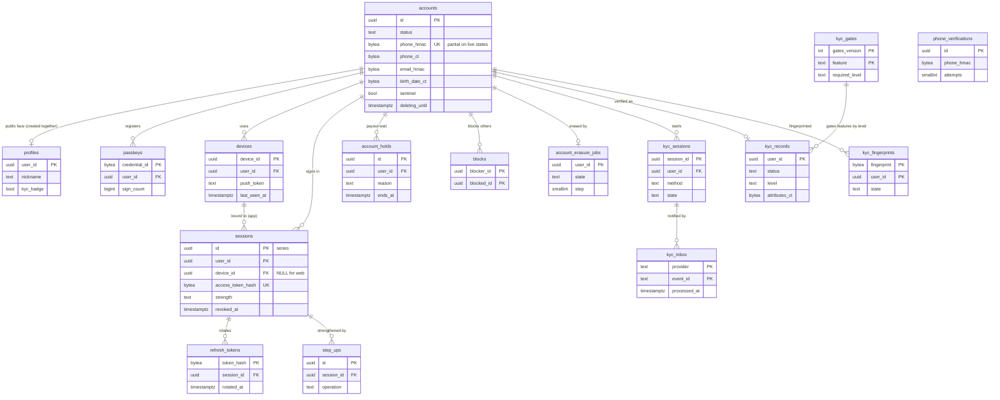

# Data model: アカウント・端末・本人確認

アカウント、公開のプロフィール、パスキー、セッション、端末、電話番号の確認、振込の待ち、強い確認、ブロック、退会の消去、本人確認（eKYC）。振る舞いは [accounts-and-devices.md](../accounts-and-devices.md) と [identity-verification.md](../identity-verification.md)、方針は [ADR-0066](../../decisions/0066-sign-in-sessions-and-devices.md)・[ADR-0067](../../decisions/0067-account-takeover-step-up-and-payout-holds.md)・[ADR-0068](../../decisions/0068-account-deletion-and-minors.md)・[ADR-0056](../../decisions/0056-ekyc-provider-and-verification-levels.md)・[ADR-0057](../../decisions/0057-identity-data-minimization-and-retention.md)。規約は [data-model.md](../data-model.md) の 3 節。

- どの表も core のクラスタにあり、`identity` のサービスだけが書く。
- 利用者の ID は `accounts.id`。他の表は `user_id`（本人の表）・`seller_id`・`buyer_id` などの名前で指す。
- 電話番号・メール・生年月日の平文は持たない。`*_ct` の列（`vault = 'identity_pii'` の利用者の鍵。[security-audit-and-lifecycle.md](security-audit-and-lifecycle.md) の 2 節）と、引くための `*_hmac` の列だけ。

## 1. ER 図

- `phone_verifications` は登録の前にも作るので、`accounts` への線を持たない。
- `kyc_gates` から `kyc_records` への線は、水準の比べの意味の線で、外部キーはない。

## 2. 表

### 2.1 `accounts`

利用者のアカウント。定義元：[accounts-and-devices.md](../accounts-and-devices.md) の 4・9・10 節。

| 列 | 型 | NULL | 既定 | 説明 |
| --- | --- | --- | --- | --- |
| `id` | `uuid` | NOT NULL | `uuidv7()` | 利用者の ID |
| `status` | `text` | NOT NULL | `'active'` | `active`・`restricted`・`locked`・`suspended`・`phone_unbound`・`deleting`・`deleted` |
| `phone_hmac` | `bytea` | NULL | — | E.164 に正規化した番号の HMAC。`deleted` の後も 1 年残す |
| `phone_ct` | `bytea` | NULL | — | 番号の暗号文。`deleted` で NULL |
| `phone_last_verified_at` | `timestamptz` | NULL | — | 最後に SMS のコードを確かめた時刻（番号の再利用の判定） |
| `email_hmac` | `bytea` | NULL | — | 正規化したメールアドレスの HMAC |
| `email_ct` | `bytea` | NULL | — | メールアドレスの暗号文 |
| `email_verified_at` | `timestamptz` | NULL | — | |
| `birth_date_ct` | `bytea` | NULL | — | 申告の生年月日の暗号文。確かめた値は `kyc_records` |
| `minor_consent_at` | `timestamptz` | NULL | — | 18 歳未満の保護者の同意の確認の時刻（L12） |
| `minor_consent_version` | `text` | NULL | — | 同意の文のバージョン |
| `last_sign_in_at` | `timestamptz` | NULL | — | 番号の再利用の判定（365 日） |
| `sentinel` | `boolean` | NOT NULL | `false` | 見張りの利用者（[observability.md](../observability.md) の 4 節） |
| `created_at` | `timestamptz` | NOT NULL | `now()` | |
| `updated_at` | `timestamptz` | NOT NULL | `now()` | |
| `deleting_until` | `timestamptz` | NULL | — | 退会の取り消しの期限（申請 ＋ 30 日） |
| `deleted_at` | `timestamptz` | NULL | — | |

- キー：PK `(id)`。部分 UK `(phone_hmac) WHERE status IN ('active','restricted','locked')` — 1 番号に有効なアカウントは 1 つ（PROP-ACC-001）。
- 索引：`(email_hmac) WHERE email_hmac IS NOT NULL` — 重複の検査と `email_suppressions` の照合。`(phone_hmac) WHERE status IN ('phone_unbound','deleted','suspended')` — 再登録の制限。`(deleting_until) WHERE status = 'deleting'` — `account-eraser` の拾い。`(id) WHERE sentinel` — 見張りの一覧。
- CHECK：`status IN (...)`。`status <> 'deleting' OR deleting_until IS NOT NULL`。`status <> 'deleted' OR (phone_ct IS NULL AND email_ct IS NULL AND birth_date_ct IS NULL)`。`(minor_consent_at IS NULL) = (minor_consent_version IS NULL)`。
- RLS：本人（`id = app.actor_id`）。サービスの役割は `identity`・`account-eraser`・`visibility`（状態の列だけ）。
- 区分：O（状態）・V（`*_ct`）。
- 保持と削除：行は消さない。`deleted` で暗号の列を NULL にし、`phone_hmac` は 1 年（`suspended` のまま退会したものは T&S の規則の期間）で NULL にする（L5）。
- S1 の量：登録 900 万（MAU 300 万の 3 倍と置いた見込み）。

### 2.2 `profiles`

公開のプロフィール。RLS の外の公開の表。定義元：[accounts-and-devices.md](../accounts-and-devices.md) の 8 節。

| 列 | 型 | NULL | 既定 | 説明 |
| --- | --- | --- | --- | --- |
| `user_id` | `uuid` | NOT NULL | — | → `accounts(id)` |
| `nickname` | `text` | NOT NULL | — | 1〜20 文字。退会で「退会したユーザー」 |
| `photo_object_id` | `uuid` | NULL | — | プロフィールの写真（`photos` のバケット） |
| `bio` | `text` | NULL | — | 自己紹介（1,000 文字まで） |
| `kyc_badge` | `boolean` | NOT NULL | `false` | 本人確認の印（`verified_document`・`verified_ic`） |
| `listed` | `boolean` | NOT NULL | `true` | `deleting`・`suspended` で `false`（公開しない） |
| `updated_at` | `timestamptz` | NOT NULL | `now()` | |

- キー：PK `(user_id)`。FK `user_id` → `accounts(id)`。
- CHECK：`char_length(nickname) BETWEEN 1 AND 20`。
- RLS：なし（公開）。書くのは `identity` だけ。評価の数は `reputation`（[messaging-comments-and-ratings.md](messaging-comments-and-ratings.md)）。
- 区分：U。売上金・住所・電話番号・メールを持たない。
- S1 の量：900 万行。

### 2.3 `passkeys`

WebAuthn の資格情報。定義元：[accounts-and-devices.md](../accounts-and-devices.md) の 5.1 節。

| 列 | 型 | NULL | 既定 | 説明 |
| --- | --- | --- | --- | --- |
| `credential_id` | `bytea` | NOT NULL | — | 資格情報の ID |
| `user_id` | `uuid` | NOT NULL | — | → `accounts(id)` |
| `public_key` | `bytea` | NOT NULL | — | COSE の公開鍵 |
| `sign_count` | `bigint` | NOT NULL | `0` | |
| `aaguid` | `uuid` | NULL | — | |
| `transports` | `text[]` | NULL | — | |
| `created_at` | `timestamptz` | NOT NULL | `now()` | |
| `last_used_at` | `timestamptz` | NULL | — | |

- キー：PK `(credential_id)`。FK `user_id`。
- 索引：`(user_id)` — 一覧と 10 個の上限の数え。
- 上限：1 アカウント 10。登録は `accounts` の行を `FOR UPDATE` で取って数える。
- RLS：本人。区分：O。保持：消されるか退会まで。S1 の量：300 万行（見込み）。

### 2.4 `sessions`

ログインの系列。1 回のログインで 1 行。定義元：[accounts-and-devices.md](../accounts-and-devices.md) の 5 節。

| 列 | 型 | NULL | 既定 | 説明 |
| --- | --- | --- | --- | --- |
| `id` | `uuid` | NOT NULL | `uuidv7()` | 系列の ID |
| `user_id` | `uuid` | NOT NULL | — | |
| `device_id` | `uuid` | NULL | — | アプリの端末。Web は NULL |
| `kind` | `text` | NOT NULL | — | `app`・`web` |
| `strength` | `text` | NOT NULL | — | `strong`・`sms`・`recovery` |
| `access_token_hash` | `bytea` | NULL | — | 今のアクセスのトークン（15 分）の SHA-256。Web は Cookie の値のハッシュ |
| `access_expires_at` | `timestamptz` | NULL | — | |
| `signed_in_at` | `timestamptz` | NOT NULL | `now()` | |
| `last_used_at` | `timestamptz` | NOT NULL | `now()` | |
| `idle_expires_at` | `timestamptz` | NOT NULL | — | アプリ 90 日、Web 14 日 |
| `absolute_expires_at` | `timestamptz` | NOT NULL | — | アプリ 1 年、Web 30 日 |
| `revoked_at` | `timestamptz` | NULL | — | |
| `revoke_reason` | `text` | NULL | — | `logout`・`device_revoked`・`locked`・`reuse_detected`・`expired`・`account_deleting` |
| `region_hint` | `smallint` | NULL | — | IP から推した都道府県のコード（一覧の表示だけ。IP は持たない） |

- キー：PK `(id)`。部分 UK `(access_token_hash) WHERE access_token_hash IS NOT NULL`。
- 索引：`(user_id) WHERE revoked_at IS NULL` — セッションの一覧と全取り消し。`(device_id)` — 端末の取り消し。
- CHECK：`kind IN ('app','web')`。`kind <> 'app' OR device_id IS NOT NULL`。`(revoked_at IS NULL) = (revoke_reason IS NULL)`。
- RLS：本人。`app-api` のトークンの確かめは `identity` の役割で読む（Valkey の `sess:{token_hash}` がなければ）。
- 区分：O。保持：失効・取り消しから 1 年で消す（[security.md](../security.md) の 7.1 節）。
- S1 の量：生きている行 600 万、1 年で 2,000 万行（見込み）。

### 2.5 `refresh_tokens`

更新のトークンの履歴。古いトークンの再使用を見つけるために持つ（ADR-0066）。

| 列 | 型 | NULL | 既定 | 説明 |
| --- | --- | --- | --- | --- |
| `token_hash` | `bytea` | NOT NULL | — | 256 ビットのトークンの SHA-256 |
| `session_id` | `uuid` | NOT NULL | — | → `sessions(id)` |
| `issued_at` | `timestamptz` | NOT NULL | `now()` | |
| `rotated_at` | `timestamptz` | NULL | — | 次のトークンに替えた時刻。NULL が今のトークン |

- キー：PK `(token_hash)`。FK `session_id` → `sessions(id)` ON DELETE CASCADE。部分 UK `(session_id) WHERE rotated_at IS NULL` — 系列の今のトークンは 1 つ。
- 規則：使われたトークンの行の `rotated_at` が 2 秒より前なら再使用。系列（`sessions`）を取り消す（PROP-ACC-003）。
- RLS：なし（`identity` の役割だけに GRANT）。区分：S。保持：`rotated_at` から 30 日、系列の取り消しで消す。
- S1 の量：1 日 2,000 万行の書き込み（15 分ごとの更新）、残る行 1 億前後（見込み。`identity-sessions` の負荷試験で確かめる）。

### 2.6 `devices`

端末。プッシュのトークンの正本（[notifications.md](../notifications.md) の 8 節）。定義元：[accounts-and-devices.md](../accounts-and-devices.md) の 6 節。

| 列 | 型 | NULL | 既定 | 説明 |
| --- | --- | --- | --- | --- |
| `device_id` | `uuid` | NOT NULL | `uuidv7()` | サーバーが出す ID |
| `user_id` | `uuid` | NOT NULL | — | |
| `platform` | `text` | NOT NULL | — | `ios`・`android` |
| `os_version` | `text` | NOT NULL | — | |
| `app_version` | `text` | NOT NULL | — | |
| `model_class` | `text` | NULL | — | 機種の大まかな分類 |
| `device_pubkey` | `bytea` | NOT NULL | — | P-256 の公開鍵 |
| `attestation` | `jsonb` | NULL | — | App Attest・Play Integrity の結果の要約（信号だけ） |
| `push_token` | `text` | NULL | — | 180 日使わなければ NULL |
| `push_permission` | `boolean` | NOT NULL | `false` | OS の通知の許可 |
| `first_seen_at` | `timestamptz` | NOT NULL | `now()` | |
| `last_seen_at` | `timestamptz` | NOT NULL | `now()` | |
| `revoked_at` | `timestamptz` | NULL | — | |

- キー：PK `(device_id)`。FK `user_id`。
- 索引：`(user_id, last_seen_at)` — 一覧、20 台の上限、`ntf:devices` の作り直し。`(push_token) WHERE push_token IS NOT NULL` — APNs・FCM の無効の知らせからの引き当て。
- CHECK：`platform IN ('ios','android')`。
- RLS：本人。`notifier` は Valkey の写しを読み、表を直接読まない（作り直しだけ `identity` の API）。
- 区分：O。保持：1 年使わなければ取り消し、取り消しから 1 年で消す。S1 の量：600 万行。

### 2.7 `phone_verifications`

SMS の 6 桁のコード。定義元：[accounts-and-devices.md](../accounts-and-devices.md) の 4.2 節。

| 列 | 型 | NULL | 既定 | 説明 |
| --- | --- | --- | --- | --- |
| `id` | `uuid` | NOT NULL | `uuidv7()` | |
| `phone_hmac` | `bytea` | NOT NULL | — | |
| `purpose` | `text` | NOT NULL | — | `signup`・`sign_in`・`phone_change`・`recovery`・`step_up` |
| `code_hash` | `bytea` | NOT NULL | — | コードと `id` の HMAC |
| `attempts` | `smallint` | NOT NULL | `0` | 照合の回数（5 で失効） |
| `expires_at` | `timestamptz` | NOT NULL | — | 作成 ＋ 10 分 |
| `ip_hmac` | `bytea` | NULL | — | 上限の数え |
| `device_id` | `uuid` | NULL | — | |
| `consumed_at` | `timestamptz` | NULL | — | |
| `created_at` | `timestamptz` | NOT NULL | `now()` | |

- キー：PK `(id)`。
- 索引：`(phone_hmac, created_at)` — 1 番号 1 日 5 通の数えと最新のコード。
- CHECK：`attempts BETWEEN 0 AND 5`。
- RLS：なし（`identity` の役割だけ）。区分：S。保持：24 時間で消す。S1 の量：1 日 50 万行。

### 2.8 `account_holds`

振込の 72 時間の待ち（ADR-0067）。`payouts` は `identity` の `payoutHoldUntil(user)` で読む（クラスタをまたぐので API）。

| 列 | 型 | NULL | 既定 | 説明 |
| --- | --- | --- | --- | --- |
| `id` | `uuid` | NOT NULL | `uuidv7()` | |
| `user_id` | `uuid` | NOT NULL | — | |
| `reason` | `text` | NOT NULL | — | `new_device_sms`・`recovery`・`phone_changed`・`email_changed`・`bank_changed` |
| `starts_at` | `timestamptz` | NOT NULL | `now()` | |
| `ends_at` | `timestamptz` | NOT NULL | — | `starts_at` ＋ 72 時間 |
| `session_id` | `uuid` | NULL | — | きっかけのセッション |
| `cancelled_at` | `timestamptz` | NULL | — | 「これは私ではない」の後の CS の判断だけ |

- キー：PK `(id)`。索引：`(user_id, ends_at)` — `payoutHoldUntil` は `max(ends_at) WHERE cancelled_at IS NULL`。
- CHECK：`ends_at > starts_at`。`reason IN (...)`。
- RLS：本人は読みだけ。区分：O。保持：`ends_at` から 1 年。S1 の量：1 日 2 万行。

### 2.9 `step_ups`

強い確認の記録（直近 10 分の判定）。

| 列 | 型 | NULL | 既定 | 説明 |
| --- | --- | --- | --- | --- |
| `id` | `uuid` | NOT NULL | `uuidv7()` | |
| `user_id` | `uuid` | NOT NULL | — | |
| `session_id` | `uuid` | NOT NULL | — | |
| `method` | `text` | NOT NULL | — | `passkey`・`sms`・`sms_email` |
| `operation` | `text` | NOT NULL | — | DT-ACC-001 の操作のコード |
| `created_at` | `timestamptz` | NOT NULL | `now()` | |

- キー：PK `(id)`。索引：`(session_id, created_at)`。
- RLS：本人は読みだけ。区分：O。保持：90 日。S1 の量：1 日 10 万行。

### 2.10 `blocks`

ブロック。`listingVisible()` と購入・コメントの判定の入力（ADR-0007）。

| 列 | 型 | NULL | 既定 | 説明 |
| --- | --- | --- | --- | --- |
| `blocker_id` | `uuid` | NOT NULL | — | |
| `blocked_id` | `uuid` | NOT NULL | — | |
| `created_at` | `timestamptz` | NOT NULL | `now()` | |

- キー：PK `(blocker_id, blocked_id)`。索引：`(blocked_id)` — 「相手が自分をブロックしたか」の判定。
- CHECK：`blocker_id <> blocked_id`。上限 1 人 1,000（作成の関数で数える）。
- RLS：本人（`blocker_id`）。`visibility`・`messaging`・`transactions`・`notifier` の役割は両方向を読む。
- 区分：O。保持：消されるか、どちらかの退会まで。S1 の量：500 万行（見込み）。

### 2.11 `account_erasure_jobs`

退会の消去の段（ADR-0068）。

| 列 | 型 | NULL | 既定 | 説明 |
| --- | --- | --- | --- | --- |
| `user_id` | `uuid` | NOT NULL | — | |
| `state` | `text` | NOT NULL | `'waiting'` | `waiting`（30 日の取り消しの窓）・`running`・`done`・`cancelled`・`failed` |
| `step` | `smallint` | NOT NULL | `0` | 済んだ段（[accounts-and-devices.md](../accounts-and-devices.md) の 9.2 節の 1〜7） |
| `step_results` | `jsonb` | NOT NULL | `'{}'` | 段ごとの件数と時刻 |
| `erase_after` | `timestamptz` | NOT NULL | — | `accounts.deleting_until` と同じ |
| `last_error_code` | `text` | NULL | — | |
| `created_at` | `timestamptz` | NOT NULL | `now()` | |
| `completed_at` | `timestamptz` | NULL | — | |

- キー：PK `(user_id)`。索引：`(state, erase_after)`。
- RLS：なし（`account-eraser` の役割）。区分：M。保持：`done` から 1 年。S1 の量：1 日 3,000 行（見込み）。

### 2.12 `kyc_sessions`

eKYC のセッション。定義元：[identity-verification.md](../identity-verification.md) の 6 節。

| 列 | 型 | NULL | 既定 | 説明 |
| --- | --- | --- | --- | --- |
| `session_id` | `uuid` | NOT NULL | `uuidv7()` | 提供者への冪等キー |
| `user_id` | `uuid` | NOT NULL | — | |
| `method` | `text` | NOT NULL | — | `ic_chip`・`document_face` |
| `provider` | `text` | NOT NULL | — | `kyc.provider.{method}` の値 |
| `provider_session_ref` | `text` | NULL | — | |
| `state` | `text` | NOT NULL | `'created'` | `created`・`in_progress`・`submitted`・`reviewing`・`approved`・`rejected`・`expired` |
| `result_code` | `text` | NULL | — | 理由のコード |
| `next_poll_at` | `timestamptz` | NULL | — | 10 分ごとの照会（72 時間まで） |
| `created_at` | `timestamptz` | NOT NULL | `now()` | |
| `submitted_at` | `timestamptz` | NULL | — | |
| `decided_at` | `timestamptz` | NULL | — | |
| `expires_at` | `timestamptz` | NOT NULL | — | 作成 ＋ 30 分（提出の前） |

- キー：PK `(session_id)`。部分 UK `(provider, provider_session_ref) WHERE provider_session_ref IS NOT NULL`。
- 索引：`(next_poll_at) WHERE state IN ('submitted','reviewing')` — 照会のジョブ。`(user_id, created_at)`。
- RLS：本人と、`kyc.view` の JIT の運用者（`identity` の API 経由）。区分：V（参照）。保持：1 年（結論で直す。L2・L5）。S1 の量：1 日 5,000 行。

### 2.13 `kyc_records`

本人確認の正本。利用者ごとに 1 行。定義元：[identity-verification.md](../identity-verification.md) の 6.2・7 節、[ADR-0057](../../decisions/0057-identity-data-minimization-and-retention.md)。

| 列 | 型 | NULL | 既定 | 説明 |
| --- | --- | --- | --- | --- |
| `user_id` | `uuid` | NOT NULL | — | |
| `status` | `text` | NOT NULL | `'unverified'` | `unverified`・`pending`・`verified`・`on_hold`・`revoked` |
| `level` | `text` | NOT NULL | `'unverified'` | `unverified`・`verified_document`・`verified_ic` |
| `method` | `text` | NULL | — | |
| `provider` | `text` | NULL | — | |
| `provider_ref` | `text` | NULL | — | 提供者の記録の参照 |
| `session_id` | `uuid` | NULL | — | 最後に当てたセッション |
| `verified_at` | `timestamptz` | NULL | — | |
| `attributes_ct` | `bytea` | NULL | — | 氏名・カナ・生年月日・住所・書類の種類（`vault = 'kyc'` の利用者の鍵。`kms-kyc` で包む） |
| `attributes_key_version` | `integer` | NULL | — | 包んだ鍵のバージョン（鍵の破棄の掃除に使う） |
| `age_band` | `text` | NULL | — | `under_18`・`adult` |
| `revoked_by_action_id` | `uuid` | NULL | — | `moderation_actions`（content。論理の参照） |
| `updated_at` | `timestamptz` | NOT NULL | `now()` | |

- キー：PK `(user_id)`。FK `user_id` → `accounts(id)`。
- 索引：`(level) WHERE level <> 'unverified'` — 集計。
- CHECK：`status IN (...)`。`level IN (...)`。`status <> 'verified' OR level <> 'unverified'`。`status NOT IN ('on_hold','revoked') OR level = 'unverified' OR verified_at IS NOT NULL`（水準の扱いは `kycLevel()` が `on_hold`・`revoked` を `unverified` とみなす）。
- RLS：本人と `kyc.view` の JIT。区分：V。保持：法務の結論まで消さない（L2・L5）。
- S1 の量：100 万行（見込み）。

### 2.14 `kyc_fingerprints`

同じ人の検出。`HMAC-SHA256(k_identity, normalize(カナの氏名) | 生年月日)`（[identity-verification.md](../identity-verification.md) の 6.3 節）。

| 列 | 型 | NULL | 既定 | 説明 |
| --- | --- | --- | --- | --- |
| `fingerprint` | `bytea` | NOT NULL | — | |
| `user_id` | `uuid` | NOT NULL | — | |
| `state` | `text` | NOT NULL | — | `verified`・`on_hold`・`revoked` |
| `created_at` | `timestamptz` | NOT NULL | `now()` | |

- キー：PK `(fingerprint, user_id)`。索引：`(user_id)`。
- RLS：なし（`identity` の役割だけ）。区分：V。データレイクに入れない。保持：`kyc_records` と同じ。

### 2.15 `kyc_inbox`

eKYC の Webhook の inbox。中身を信じず、照会で確かめる。

| 列 | 型 | NULL | 既定 | 説明 |
| --- | --- | --- | --- | --- |
| `provider` | `text` | NOT NULL | — | |
| `event_id` | `text` | NOT NULL | — | 提供者の事象の ID |
| `provider_session_ref` | `text` | NOT NULL | — | |
| `event_type` | `text` | NOT NULL | — | |
| `received_at` | `timestamptz` | NOT NULL | `now()` | |
| `processed_at` | `timestamptz` | NULL | — | |

- キー：PK `(provider, event_id)`。索引：`(received_at) WHERE processed_at IS NULL`。
- RLS：なし（`identity` の役割だけ）。区分：M。本文は保存しない（[stores.md](stores.md) の 9 節）。保持：90 日。

### 2.16 `kyc_gates`

確認で開く機能の表（バージョンつきの設定）。定義元：[identity-verification.md](../identity-verification.md) の 5 節。

| 列 | 型 | NULL | 既定 | 説明 |
| --- | --- | --- | --- | --- |
| `gates_version` | `integer` | NOT NULL | — | 変えるたびに 1 上げる |
| `feature` | `text` | NOT NULL | — | `non_anonymous_shipping`・`balance_conversion`・`restricted_category`・`payout_limit` など |
| `required_level` | `text` | NULL | — | 必要な水準。値が `legal.*` にあるものは NULL |
| `legal_key` | `text` | NULL | — | 参照する `legal.*` の名前 |
| `approved_by` | `uuid` | NOT NULL | — | |
| `created_at` | `timestamptz` | NOT NULL | `now()` | |

- キー：PK `(gates_version, feature)`。CHECK：`required_level IS NOT NULL OR legal_key IS NOT NULL`。
- 今の表は `max(gates_version)`。変えたら `kyc.gates_changed` を outbox に書く。
- RLS：なし（設定。読みは全サービス）。区分：U。保持：残す。

## 3. 外の置き場所

- Valkey：`sess:{token_hash}`（15 分）、`sms:rl:*`（SMS の上限の数え）。[stores.md](stores.md) の 1 節。
- outbox の話題：`account.*`、`device.*`、`session.revoked`、`account.hold_started`、`kyc.level_changed`、`kyc.gates_changed`、`kyc.on_hold`。
- AppConfig：`ops.sms_provider`、`kyc.*`、`legal.minor_*`、`legal.kyc_*`（[stores.md](stores.md) の 10 節）。
