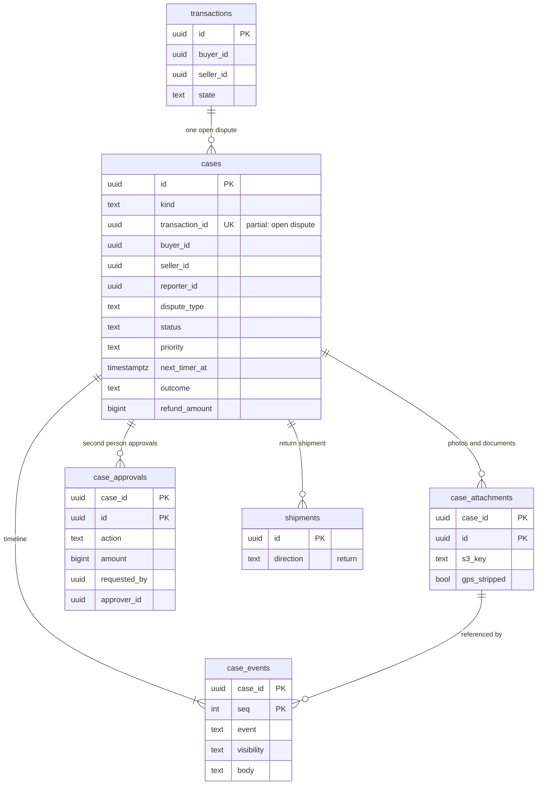

# Data model: 紛争と CS

案件（紛争、問い合わせ、受取評価の後、法令の照会）、案件の事象、添付、承認。振る舞いは [disputes-and-customer-support.md](../disputes-and-customer-support.md)、方針は [ADR-0059](../../decisions/0059-dispute-cases-and-sla-timers.md)・[ADR-0060](../../decisions/0060-ops-money-interventions-and-proceeds-hold.md)。規約は [data-model.md](../data-model.md) の 3 節。

- どの表も content のクラスタにあり、`ops-api` の案件の関数と `case-timer`（`deadline-runner` と同じ 1 分ごとの処理）が書く。
- 案件の結論は遷移の関数の `ops_resolve` だけを通す。お金は台帳の仕訳の型（`refund`・`settle`・`compensation`・`proceeds_hold`・`proceeds_unhold`）だけで動く。売上金の保留の表 `proceeds_holds` は ledger（[ledger-and-proceeds.md](ledger-and-proceeds.md) の 3.15 節）。
- 案件の表は 3 つある：この `cases`、T&S の `moderation_cases`、法令の `legal_cases`（[trust-and-safety.md](trust-and-safety.md)）。[ADR-0007](../../decisions/0007-single-tenant-and-party-visibility.md) の「`disputes`」は `cases` の `kind = 'dispute'` の行を指す（D-23）。

## 1. ER 図

- `transactions`・`shipments` は core にあり、`cases.transaction_id`・`return_shipment_id` は論理の参照。
- `transactions ||--o{ cases`：問い合わせ・受取評価の後の案件は取引に何件でも付く。開いた紛争（`kind = 'dispute'`）は取引ごとに 1 つ（部分一意の索引）。

## 2. 表

### 2.1 `cases`

案件。取引の状態とは別の状態を持つ（ADR-0059）。定義元：[disputes-and-customer-support.md](../disputes-and-customer-support.md) の 4・5・9・10 節。

| 列 | 型 | NULL | 既定 | 説明 |
| --- | --- | --- | --- | --- |
| `id` | `uuid` | NOT NULL | `uuidv7()` | |
| `kind` | `text` | NOT NULL | — | `dispute`・`inquiry`・`post_receipt`・`legal_request` |
| `transaction_id` | `uuid` | NULL | — | |
| `listing_id` | `uuid` | NULL | — | |
| `buyer_id` | `uuid` | NULL | — | 取引の 2 者の写し（RLS） |
| `seller_id` | `uuid` | NULL | — | 同 |
| `reporter_id` | `uuid` | NULL | — | system の案件（チャージバック、例外、措置）は NULL |
| `dispute_type` | `text` | NULL | — | `not_received`・`not_as_described`・`wrong_item`・`damaged`・`counterfeit_suspected`・`seller_unresponsive`・`buyer_unresponsive`・`other`・`chargeback`・`carrier_exception`・`moderation` |
| `inquiry_topic` | `text` | NULL | — | 問い合わせの種類（アカウント、出品、取引、支払い、売上金・振込、配送、通報の続き、その他） |
| `status` | `text` | NOT NULL | `'open'` | `open`・`under_review`・`awaiting_party`・`awaiting_return`・`resolved`・`closed` |
| `priority` | `text` | NOT NULL | — | `high`・`medium`・`low` |
| `assignee` | `uuid` | NULL | — | |
| `first_response_due_at` | `timestamptz` | NULL | — | 時計（5.2 節） |
| `party_response_due_at` | `timestamptz` | NULL | — | |
| `return_ship_due_at` | `timestamptz` | NULL | — | |
| `return_confirm_due_at` | `timestamptz` | NULL | — | |
| `resolution_target_at` | `timestamptz` | NULL | — | |
| `chargeback_evidence_due_at` | `timestamptz` | NULL | — | |
| `next_timer_at` | `timestamptz` | NULL | — | 生きている時計の最小 |
| `flags` | `text[]` | NOT NULL | `'{}'` | `no_party_response`・`no_return`・`no_confirmation` |
| `chargeback_id` | `uuid` | NULL | — | core の `chargebacks`（論理の参照） |
| `return_shipment_id` | `uuid` | NULL | — | 返送の配送 |
| `outcome` | `text` | NULL | — | `continue`・`treat_received`・`partial_refund`・`cancel_refund` |
| `refund_amount` | `bigint` | NULL | — | 一部の返金の額 |
| `dt_row` | `smallint` | NULL | — | 既定の結論の DT-DSP-001 の行 |
| `reason_code` | `text` | NULL | — | 表と違う結論の理由 |
| `parties_agreed_at` | `timestamptz` | NULL | — | 一部の返金の両者の同意 |
| `created_at` | `timestamptz` | NOT NULL | `now()` | |
| `resolved_at` | `timestamptz` | NULL | — | |
| `closed_at` | `timestamptz` | NULL | — | 取引の遷移とお金の効きを確かめた時刻 |

- キー：PK `(id)`。部分 UK `(transaction_id) WHERE kind = 'dispute' AND status NOT IN ('resolved','closed')`。
- 索引：`(status, priority, next_timer_at)` — 待ち行列の順（優先度 → 期限の近い時計 → 開いた時刻）。`(next_timer_at) WHERE next_timer_at IS NOT NULL` — `case-timer`。`(transaction_id)`。`(reporter_id, created_at)` — 本人の問い合わせの一覧。`(status, resolved_at) WHERE status = 'resolved'` — 15 分の確かめのチケット。
- CHECK：
  - `kind IN (...)`。`status IN (...)`。`priority IN ('high','medium','low')`。
  - `kind <> 'dispute' OR (transaction_id IS NOT NULL AND buyer_id IS NOT NULL AND seller_id IS NOT NULL AND dispute_type IS NOT NULL)`。
  - `(outcome = 'partial_refund') = (refund_amount IS NOT NULL)`。`outcome <> 'partial_refund' OR parties_agreed_at IS NOT NULL`。
  - `status NOT IN ('resolved','closed') OR outcome IS NOT NULL OR kind <> 'dispute'`。
- RLS：
  - `kind = 'dispute'`：2 者（`app.actor_id IN (buyer_id, seller_id)`）が報告の内容を読む。
  - `kind IN ('inquiry','post_receipt')`：報告者（`reporter_id`）。
  - `kind = 'legal_request'`：利用者は読めない。`legal_officer` の役割だけ。
  - 運用者は案件に結んだ JIT（`case.view`）。
- 区分：P。保持：紛争は取引と同じ 10 年。問い合わせ・受取評価の後は終わりから 3 年（L5）。法令の照会は L6・L7 の後。
- S1 の量：紛争 1 日 1,500 行、問い合わせ 1 日 1 万行（見込み）。

### 2.2 `case_events`

案件の事象（追記だけ）：状態の変更、報告者・相手・担当のメッセージ、証拠の参照、承認。

| 列 | 型 | NULL | 既定 | 説明 |
| --- | --- | --- | --- | --- |
| `case_id` | `uuid` | NOT NULL | — | |
| `seq` | `integer` | NOT NULL | — | |
| `event` | `text` | NOT NULL | — | `opened`・`status_changed`・`message`・`evidence_added`・`timer_fired`・`approval_requested`・`approval_decided`・`resolved`・`closed` |
| `actor_kind` | `text` | NOT NULL | — | `buyer`・`seller`・`reporter`・`operator`・`system` |
| `actor_id` | `uuid` | NULL | — | |
| `visibility` | `text` | NOT NULL | — | `internal`・`parties`・`reporter` |
| `body` | `text` | NULL | — | メッセージの本文（2,000 文字まで） |
| `attachment_id` | `uuid` | NULL | — | |
| `from_status` | `text` | NULL | — | |
| `to_status` | `text` | NULL | — | |
| `reason_code` | `text` | NULL | — | |
| `created_at` | `timestamptz` | NOT NULL | `now()` | |

- キー：PK `(case_id, seq)`。
- RLS：`visibility = 'parties'` の行は案件の 2 者、`reporter` の行は報告者、`internal` は運用者だけ（案件の行を結んで判定する方針）。
- 区分：P。保持：案件と同じ。S1 の量：1 日 8 万行。

### 2.3 `case_attachments`

写真・書類（位置情報を消した印）。実体は S3 の `cases/` のバケット（暗号化）。

| 列 | 型 | NULL | 既定 | 説明 |
| --- | --- | --- | --- | --- |
| `case_id` | `uuid` | NOT NULL | — | |
| `id` | `uuid` | NOT NULL | `uuidv7()` | |
| `uploader_id` | `uuid` | NOT NULL | — | |
| `s3_key` | `text` | NOT NULL | — | `cases/<case_id>/<id>` |
| `content_type` | `text` | NOT NULL | — | |
| `size_bytes` | `integer` | NOT NULL | — | |
| `gps_stripped` | `boolean` | NOT NULL | — | 写真の処理と同じ形でメタデータを消した |
| `delete_after` | `timestamptz` | NULL | — | 保存の期間の終わり |
| `created_at` | `timestamptz` | NOT NULL | `now()` | |

- キー：PK `(case_id, id)`。CHECK：`gps_stripped OR content_type NOT LIKE 'image/%'`。上限 1 案件の 1 回の報告 10 枚。
- RLS：案件と同じ。区分：P。保持：案件と同じ（S3 の物も消す）。

### 2.4 `case_approvals`

上限を超える介入と保留の解除の、2 人目の承認（ADR-0060）。

| 列 | 型 | NULL | 既定 | 説明 |
| --- | --- | --- | --- | --- |
| `case_id` | `uuid` | NOT NULL | — | |
| `id` | `uuid` | NOT NULL | `uuidv7()` | |
| `action` | `text` | NOT NULL | — | `cancel_refund`・`partial_refund`・`compensation_points`・`compensation_proceeds`・`proceeds_unhold`・`ledger_adjust` |
| `amount` | `bigint` | NULL | — | |
| `requested_by` | `uuid` | NOT NULL | — | |
| `approver_role` | `text` | NOT NULL | — | `cs_lead`・`finance_approver` |
| `approver_id` | `uuid` | NULL | — | |
| `result` | `text` | NOT NULL | `'pending'` | `pending`・`approved`・`rejected` |
| `created_at` | `timestamptz` | NOT NULL | `now()` | |
| `decided_at` | `timestamptz` | NULL | — | |

- キー：PK `(case_id, id)`。索引：`(result, created_at) WHERE result = 'pending'`。
- CHECK：`approver_id IS NULL OR approver_id <> requested_by`（PROP-DSP-004）。
- 仕訳の `approved_by` に申請者と承認者の両方を残す。RLS：なし（運用者）。区分：A。保持：7 年。

## 3. 外の置き場所

- S3：`cases/<case_id>/<attachment_id>`（`kms-content` の SSE-KMS、保存の期間の後に消す）（[stores.md](stores.md) の 3 節）。
- outbox の話題：`case.opened`、`case.resolved`、`case.closed`。
