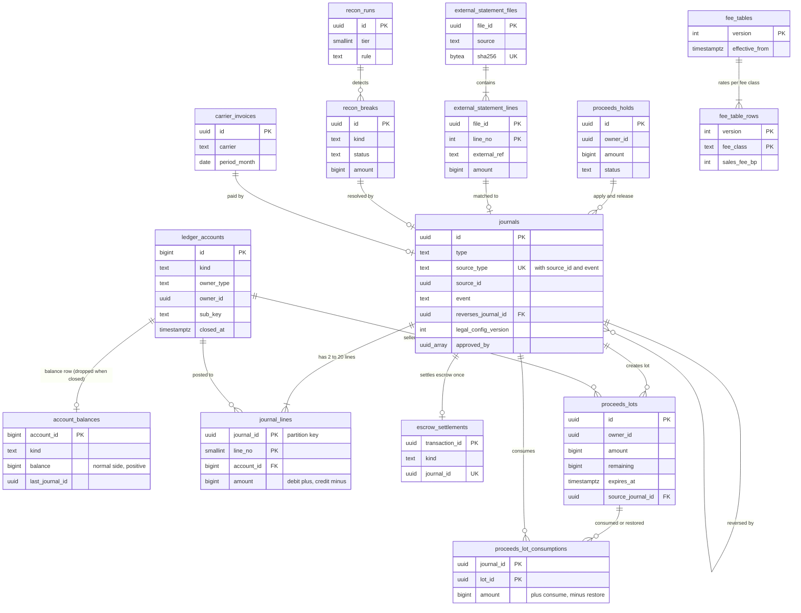

# Data model: 台帳と売上金

複式簿記の台帳（口座、残高、仕訳、仕訳の行）、預かりの決着、売上金のロット、期限の状態、利用者の資金の日次の集計、外部の明細、3 段の照合、運送会社の請求、売上金の保留、手数料の表。振る舞いは [ledger-and-proceeds.md](../ledger-and-proceeds.md)、方針は [ADR-0003](../../decisions/0003-escrow-and-double-entry-ledger.md)・[ADR-0004](../../decisions/0004-proceeds-model-under-payment-services-act.md)・[ADR-0034](../../decisions/0034-chart-of-accounts-journal-types-and-fee-rounding.md)・[ADR-0035](../../decisions/0035-proceeds-lots-expiry-and-kyc-conversion.md)・[ADR-0036](../../decisions/0036-three-tier-reconciliation-and-suspense.md)・[ADR-0060](../../decisions/0060-ops-money-interventions-and-proceeds-hold.md)。規約は [data-model.md](../data-model.md) の 3.5 節。

- 手数料の表（`fee_tables`・`fee_table_rows`）は core のクラスタ、他は ledger のクラスタ。ledger の表は `ledger` のサービスだけが書く。
- 仕訳は `ledger_post(type, key, lines[])` の 1 つの関数だけが書く。アプリから `journals`・`journal_lines` に直接 `INSERT` しない（lint）。
- 振込・ポイント・引き当ての表は [payouts-and-points.md](payouts-and-points.md)。

## 1. ER 図

- `fee_tables`・`fee_table_rows` は core にあり、ledger の表と外部キーを持たない。仕訳は使ったバージョンを `journals.fee_table_version` に持つ。
- `proceeds_holds ||--o{ journals` は、保留の行が `proceeds_hold`・`proceeds_unhold` の仕訳の元（`source_type = 'hold'`）になる意味の線。外部キーは仕訳の ID の列で持つ。

## 2. 制約の実装

| 制約 | 実装 |
| --- | --- |
| 仕訳ごとの釣り合い、2〜20 行、0 の行がない | `journal_lines` の `AFTER INSERT` の制約トリガー `ledger_check_journal()`（`DEFERRABLE INITIALLY DEFERRED`）。コミットの時に、そのトランザクションで書いた仕訳ごとに `SUM(amount) = 0` と行の数を確かめる。`amount <> 0` は CHECK |
| 追記だけ | `journals`・`journal_lines`・`escrow_settlements`・`proceeds_lot_consumptions` の持ち主は `ledger_owner`（ログインなし）。`ledger_app` と `ledger_migrator` に `UPDATE`・`DELETE`・`TRUNCATE` を与えない。加えて `BEFORE UPDATE OR DELETE` のトリガーで例外（[ADR-0078](../../decisions/0078-pipeline-schema-ordering-ledger-migrations-and-flag-governance.md)） |
| 冪等（1 つの事象に 1 つの仕訳） | `journals` の `UNIQUE (source_type, source_id, event)`。`ledger_post` は `INSERT … ON CONFLICT DO NOTHING RETURNING` で、衝突したら前の仕訳を返す |
| release・refund・settle は取引ごとに 1 回 | `escrow_settlements (transaction_id PRIMARY KEY)` を決着の仕訳と同じトランザクションで挿入。種類が同じ 2 回目は成功、違えば page |
| 決着した預かりは 0 | 決着のトランザクションの終わりに、`escrow:<transaction_id>` の `account_balances.balance = 0` を制約トリガーで確かめる |
| 負にならない口座 | `account_balances` の CHECK（3.2 節）。更新は `balance = balance + $d` の 1 文で、CHECK の違反は仕訳ごと失敗する |
| ロットの和 = 売上金 | 照合 I4（夜間と、ロットを動かす仕訳のたびの関数の中の確かめ） |
| 無効の `legal.*` の型を書かない | `ledger_post` の入口で `legal` の構成を確かめる。照合 I6 |

## 3. 表

### 3.1 `ledger_accounts`

台帳の口座。「種類 × 持ち主 × 副の鍵」で 1 つ。定義元：[ledger-and-proceeds.md](../ledger-and-proceeds.md) の 4.1 節。領域の文書の `accounts` を、core の `accounts` と分けるためにこの名前にした（D-1）。

| 列 | 型 | NULL | 既定 | 説明 |
| --- | --- | --- | --- | --- |
| `id` | `bigint` | NOT NULL | `GENERATED ALWAYS AS IDENTITY` | 行の数が多く、行から何度も指すので 8 バイトにした（D-2） |
| `kind` | `text` | NOT NULL | — | 22 の種類（3.1.1） |
| `owner_type` | `text` | NOT NULL | — | `user`・`transaction`・`platform` |
| `owner_id` | `uuid` | NULL | — | 利用者の ID、取引の ID。`platform` は NULL |
| `sub_key` | `text` | NOT NULL | `''` | 提供者のコード、運送会社のコード、銀行口座のコード、手数料の種類、ポイントのロットの ID、仮勘定の理由、S2 のスロット |
| `normal_side` | `text` | NOT NULL | — | `debit`・`credit`・`either` |
| `created_at` | `timestamptz` | NOT NULL | `now()` | |
| `closed_at` | `timestamptz` | NULL | — | 決着した `escrow` に夜間に付ける |

- キー：PK `(id)`。UK `(kind, owner_type, owner_id, sub_key) NULLS NOT DISTINCT`。
- 索引：`(owner_id, kind) WHERE owner_type = 'user'` — 本人の口座の一覧（残高・明細の API）。
- CHECK：`kind IN (…22…)`。`(owner_type = 'platform') = (owner_id IS NULL)`。種類と持ち主の組（`escrow` は `transaction`、`seller_proceeds`・`seller_proceeds_held`・`user_balance`・`balance_reserved`・`points`・`payout_in_transit`・`chargeback_receivable` は `user`、ほかは `platform`）。種類と `normal_side` の組（下の表）。
- 作り方：`escrow` は最初の hold の仕訳で作る。`points` はロットごとに付与の仕訳で作る（`sub_key` = ロットの ID）。
- RLS：持ち主（`owner_type = 'user' AND owner_id = app.actor_id`）は読みだけ。サービスの役割：`ledger`、照合（読み出しの写し）。
- 区分：F。保持：10 年。
- S1 の量：`escrow` 1 年 3,650 万、利用者の口座 900 万 × 平均 2、ポイントのロット 1,000 万（見込み）。計 6,500 万行前後。

#### 3.1.1 口座の種類（22）

[ADR-0034](../../decisions/0034-chart-of-accounts-journal-types-and-fee-rounding.md)。「負でない」は `account_balances` の CHECK。

| `kind` | `owner_type` | `sub_key` | `normal_side` | 負でない |
| --- | --- | --- | --- | --- |
| `psp_receivable` | `platform` | 提供者（S2 から `<provider>:<slot>`） | `debit` | — |
| `psp_clearing` | `platform` | 提供者 | `debit` | — |
| `psp_chargeback_held` | `platform` | 提供者 | `debit` | ○ |
| `escrow` | `transaction` | `''` | `credit` | ○（決着で 0） |
| `seller_proceeds` | `user` | `''` | `credit` | ○ |
| `seller_proceeds_held` | `user` | `''` | `credit` | ○ |
| `user_balance` | `user` | `''` | `credit` | ○（上限 `legal.balance_max_yen` は関数で） |
| `balance_reserved` | `user` | `''` | `credit` | ○ |
| `points` | `user` | ロットの ID | `credit` | ○ |
| `fee_revenue` | `platform` | `sales`・`payment`・`payout`（S2 から `<種類>:<slot>`） | `credit` | — |
| `shipping_payable` | `platform` | 運送会社（S2 から `<carrier>:<slot>`） | `credit` | — |
| `payout_in_transit` | `user` | `''` | `credit` | ○ |
| `bank_operating` | `platform` | 本システムの銀行口座 | `debit` | — |
| `unapplied_payments` | `platform` | 提供者 | `credit` | ○ |
| `chargeback_receivable` | `user` | `''` | `debit` | ○ |
| `promotion_expense` | `platform` | `''` | `debit` | — |
| `compensation_expense` | `platform` | `''` | `debit` | — |
| `chargeback_loss_expense` | `platform` | `''` | `debit` | — |
| `psp_fee_expense` | `platform` | 提供者 | `debit` | — |
| `points_breakage` | `platform` | `''` | `credit` | — |
| `proceeds_forfeiture` | `platform` | `''` | `credit` | — |
| `suspense` | `platform` | 理由（`psp_unidentified` など） | `either` | — |

### 3.2 `account_balances`

口座ごとの残高の行。仕訳と同じトランザクションで更新する（ADR-0003）。

| 列 | 型 | NULL | 既定 | 説明 |
| --- | --- | --- | --- | --- |
| `account_id` | `bigint` | NOT NULL | — | → `ledger_accounts(id)` |
| `kind` | `text` | NOT NULL | — | 口座の種類の写し（CHECK のため） |
| `balance` | `bigint` | NOT NULL | `0` | 正常な側の向きの残高（借方が正常なら Σ、貸方なら −Σ。`either` は Σ） |
| `last_journal_id` | `uuid` | NULL | — | |
| `updated_at` | `timestamptz` | NOT NULL | `now()` | |

- キー：PK `(account_id)`。FK `account_id` → `ledger_accounts(id)`。
- CHECK：`kind NOT IN ('psp_chargeback_held','escrow','seller_proceeds','seller_proceeds_held','user_balance','balance_reserved','points','payout_in_transit','unapplied_payments','chargeback_receivable') OR balance >= 0`。
- 照合 I2：残高の行 = 仕訳の行の和（夜間）。ずれたら残高の行だけを直す（仕訳は変えない）。
- 消し方：決着して `closed_at` の付いた `escrow` の行は夜間に消す（仕訳は残す）。S2 でスロットに分けた口座は残高の行を持たず、残高は仕訳の行の和を 1 分ごとに集計する。
- 設定：`fillfactor = 50`（熱い口座の HOT 更新）。
- RLS：持ち主は読みだけ（口座の持ち主を `ledger_accounts` から引く方針）。区分：F。S1 の量：生きている口座の数（3,000 万行前後）。

### 3.3 `journals`

仕訳の頭（追記だけ）。定義元：同 4.2・4.3 節。

| 列 | 型 | NULL | 既定 | 説明 |
| --- | --- | --- | --- | --- |
| `id` | `uuid` | NOT NULL | `uuidv7()` | |
| `type` | `text` | NOT NULL | — | 30 の型（3.3.1） |
| `source_type` | `text` | NOT NULL | — | 冪等キーの 1 つ目（`transaction`・`purchase_attempt`・`chargeback`・`journal`・`hold`・`compensation`・`campaign_grant`・`points_lot`・`proceeds_lot`・`payout`・`psp_settlement`・`carrier_invoice`・`payment_attempt`・`recon_break`） |
| `source_id` | `uuid` | NOT NULL | — | 冪等キーの 2 つ目 |
| `event` | `text` | NOT NULL | — | 冪等キーの 3 つ目（`hold`・`release`・`line:<n>` など） |
| `effective_at` | `timestamptz` | NOT NULL | `now()` | 会計の日時 |
| `transaction_id` | `uuid` | NULL | — | 取引に結び付く仕訳（明細と照合 T1〜T4） |
| `fee_table_version` | `integer` | NULL | — | release・settle・payout_request |
| `shipping_rate_table_version` | `integer` | NULL | — | release・settle |
| `legal_config_version` | `integer` | NULL | — | `legal.*` で動く型（期限・移し替え・失効・期限の後の自動の振込） |
| `reverses_journal_id` | `uuid` | NULL | — | 打ち消しの仕訳のとき、元の仕訳（D-16） |
| `approved_by` | `uuid[]` | NULL | — | 手の仕訳と運用の介入の承認者 |
| `created_at` | `timestamptz` | NOT NULL | `now()` | |

- キー：PK `(id)`。UK `(source_type, source_id, event)`。FK `reverses_journal_id` → `journals(id)`。
- 索引：`(transaction_id) WHERE transaction_id IS NOT NULL` — 第 1 段の照合と取引ごとの仕訳。`(type, created_at)` — 型ごとの集計、I6。`(reverses_journal_id) WHERE reverses_journal_id IS NOT NULL`。
- CHECK：`type IN (…30…)`。`type NOT IN ('suspense_resolve') OR cardinality(approved_by) >= 2`。`reverses_journal_id IS NULL OR cardinality(approved_by) >= 2`。`type NOT IN ('points_expire','proceeds_to_balance','proceeds_forfeit') OR legal_config_version IS NOT NULL`。
- 分割しない：冪等の一意の制約を全期間に張るため（D-15）。S2 の後に大きさを見て、`journal_keys` の表への分け方を ADR で決める（9 節の持ち越し）。
- RLS：なし（`ledger` の役割。明細は `journal_lines` と口座の RLS を通して出す）。区分：F。保持：10 年（L8 と財務の確認待ち）。
- S1 の量：1 日 40 万行（取引 10 万 × 3〜4）、1 年 1.5 億行。

#### 3.3.1 仕訳の型（30）

[ledger-and-proceeds.md](../ledger-and-proceeds.md) の 4.3 節の表と同じ。冪等キーは `(source_type, source_id, event)`。

| # | `type` | `source_type` | `event` |
| --- | --- | --- | --- |
| 1 | `hold_psp` | `transaction` | `hold` |
| 2 | `hold_balance` | `transaction` | `hold_balance` |
| 3 | `release` | `transaction` | `release` |
| 4 | `refund` | `transaction` | `refund` |
| 5 | `settle` | `transaction` | `settle` |
| 6 | `reserve` | `purchase_attempt` | `reserve` |
| 7 | `reserve_release` | `purchase_attempt` | `reserve_release` |
| 8 | `chargeback_open` | `chargeback` | `open` |
| 9 | `chargeback_won` | `chargeback` | `won` |
| 10 | `chargeback_lost_seller` | `chargeback` | `lost` |
| 11 | `chargeback_lost_platform` | `chargeback` | `lost` |
| 12 | `receivable_offset` | `journal`（release の仕訳） | `offset` |
| 13 | `proceeds_hold` | `hold` | `apply` |
| 14 | `proceeds_unhold` | `hold` | `release` |
| 15 | `held_recovery` | `chargeback` | `recover` |
| 16 | `compensation` | `compensation`（案件） | `grant` |
| 17 | `points_grant` | `campaign_grant` | `grant` |
| 18 | `points_expire` | `points_lot` | `expire` |
| 19 | `proceeds_to_balance` | `proceeds_lot` | `to_balance` |
| 20 | `proceeds_forfeit` | `proceeds_lot` | `forfeit` |
| 21 | `payout_request` | `payout` | `request` |
| 22 | `payout_settled` | `payout` | `settled` |
| 23 | `payout_failed` | `payout` | `failed` |
| 24 | `payout_returned` | `payout` | `returned` |
| 25 | `psp_settlement` | `psp_settlement`（明細のファイル） | `line:<line_no>` |
| 26 | `carrier_payment` | `carrier_invoice` | `pay` |
| 27a | `unapplied_receipt` | `payment_attempt` | `unapplied` |
| 27b | `unapplied_refund` | `payment_attempt` | `orphan_refund` |
| 28a | `suspense_open` | `recon_break` | `open` |
| 28b | `suspense_resolve` | `recon_break` | `resolve` |

- 10 と 11 は同じ冪等キー（1 つのチャージバックの負けはどちらか 1 つ）。
- 16 は 1 つの案件に補償 1 回（ADR-0003 の冪等キーのまま）。追加の補償・別の利用者への補償は案件を分ける（[disputes-and-customer-support.md](../disputes-and-customer-support.md) の 7.2 節）。
- 打ち消しの仕訳は型を足さず、元の型のまま `source_type = 'journal'`・`source_id` = 元の仕訳・`event = 'reverse'`・`reverses_journal_id` で書く（D-16）。

### 3.4 `journal_lines`

仕訳の行（追記だけ）。

| 列 | 型 | NULL | 既定 | 説明 |
| --- | --- | --- | --- | --- |
| `journal_id` | `uuid` | NOT NULL | — | 分割の鍵 |
| `line_no` | `smallint` | NOT NULL | — | 1〜20 |
| `account_id` | `bigint` | NOT NULL | — | → `ledger_accounts(id)` |
| `amount` | `bigint` | NOT NULL | — | 借方が正、貸方が負。1 行 1〜99,999,999 円 |

- キー：PK `(journal_id, line_no)`。FK `journal_id` → `journals(id)`、`account_id` → `ledger_accounts(id)`。
- 分割：`journal_id` の範囲（UUIDv7 の月の境）。仕訳の頭と行が同じ月に入る。
- 索引：`(account_id, journal_id)`（区切りごと）— 明細の API（本人の口座で絞り、新しい順に 100 行）、I2 の再計算。
- CHECK：`amount <> 0`。`abs(amount) <= 99999999`。`line_no BETWEEN 1 AND 20`。
- RLS：口座の持ち主（`account_id` が本人の口座）。区分：F。保持：10 年。13 か月を過ぎた区切りは S3 の `records` に Parquet で写し、2 年を過ぎた区切りを `DETACH` して保管する（行は消さない。[stores.md](stores.md) の 3 節）。
- S1 の量：1 日 150 万行（1 仕訳 3.7 行）。

### 3.5 `escrow_settlements`

預かりの決着の排他（ADR-0003）。

| 列 | 型 | NULL | 既定 | 説明 |
| --- | --- | --- | --- | --- |
| `transaction_id` | `uuid` | NOT NULL | — | |
| `kind` | `text` | NOT NULL | — | `release`・`refund`・`settle` |
| `journal_id` | `uuid` | NOT NULL | — | → `journals(id)` |
| `created_at` | `timestamptz` | NOT NULL | `now()` | |

- キー：PK `(transaction_id)`。UK `(journal_id)`。CHECK：`kind IN (...)`。
- 守る物（ADR-0078）。RLS：なし（`ledger` の役割）。区分：F。保持：10 年。S1 の量：1 日 10 万行。

### 3.6 `proceeds_lots`

売上金のロット（ADR-0035）。定義元：同 6.1 節。

| 列 | 型 | NULL | 既定 | 説明 |
| --- | --- | --- | --- | --- |
| `id` | `uuid` | NOT NULL | `uuidv7()` | |
| `owner_id` | `uuid` | NOT NULL | — | 売り手 |
| `account_id` | `bigint` | NOT NULL | — | 本人の `seller_proceeds` の口座 |
| `amount` | `bigint` | NOT NULL | — | 入った額 |
| `remaining` | `bigint` | NOT NULL | — | 残り |
| `entered_at` | `timestamptz` | NOT NULL | — | 入った時刻（元の仕訳の時刻） |
| `expires_at` | `timestamptz` | NULL | — | 期限。`legal.proceeds_expiry_enabled` が偽なら NULL |
| `source_journal_id` | `uuid` | NOT NULL | — | 入りの仕訳（release・settle・compensation） |
| `state` | `text` | NOT NULL | `'active'` | `active`・`expiry_exhausted` |
| `legal_config_version` | `integer` | NULL | — | 期限を付けた時の構成 |

- キー：PK `(id)`。UK `(source_journal_id, account_id)`。
- 索引：`(owner_id, expires_at NULLS LAST, entered_at) WHERE remaining > 0` — 期限の近い順の消費。`(expires_at) WHERE remaining > 0 AND expires_at IS NOT NULL` — `proceeds-expiry-runner`（毎日 00:10）。
- CHECK：`amount > 0`。`remaining BETWEEN 0 AND amount`。
- 更新：`remaining` だけ（消費と戻し、`proceeds_lot_consumptions` と同じトランザクション）。期限は戻しで変えない。
- RLS：本人は読みだけ。区分：F。保持：10 年（`remaining = 0` から）。S1 の量：1 日 10 万行。

### 3.7 `proceeds_lot_consumptions`

ロットの消費と戻しの記録。戻しは消した記録の通りに元のロットへ（ADR-0035）。

| 列 | 型 | NULL | 既定 | 説明 |
| --- | --- | --- | --- | --- |
| `journal_id` | `uuid` | NOT NULL | — | 消費か戻しの仕訳 |
| `lot_id` | `uuid` | NOT NULL | — | → `proceeds_lots(id)` |
| `owner_id` | `uuid` | NOT NULL | — | |
| `amount` | `bigint` | NOT NULL | — | 正は消費、負は戻し |
| `restores_journal_id` | `uuid` | NULL | — | 戻しのとき、元の消費の仕訳 |
| `created_at` | `timestamptz` | NOT NULL | `now()` | |

- キー：PK `(journal_id, lot_id)`。FK `lot_id`。索引：`(lot_id)`、`(restores_journal_id) WHERE restores_journal_id IS NOT NULL`。
- CHECK：`amount <> 0`。`(amount < 0) = (restores_journal_id IS NOT NULL)`。上限 1 仕訳 500 ロット（関数で分ける）。
- RLS：なし（`ledger` の役割）。区分：F。保持：10 年。S1 の量：1 日 15 万行（見込み）。

### 3.8 `proceeds_expiry_state`

期限の後の扱いの回数と通知（本人だけ）。定義元：同 6.3 節。

| 列 | 型 | NULL | 既定 | 説明 |
| --- | --- | --- | --- | --- |
| `owner_id` | `uuid` | NOT NULL | — | |
| `action_count` | `smallint` | NOT NULL | `0` | `legal.proceeds_expiry_actions` の何番目まで当てたか |
| `last_action` | `text` | NULL | — | `auto_payout`・`forfeit`・`skipped` |
| `last_action_at` | `timestamptz` | NULL | — | |
| `notices` | `jsonb` | NOT NULL | `'{}'` | ロットごとの済んだ通知（30・7・1 日前） |
| `updated_at` | `timestamptz` | NOT NULL | `now()` | |

- キー：PK `(owner_id)`。RLS：本人は読みだけ。区分：F。本番の既定では動かない（L1）。

### 3.9 `customer_funds_daily`

利用者の資金の日次の集計（保全の枠。L1）。定義元：同 8 節。

| 列 | 型 | NULL | 既定 | 説明 |
| --- | --- | --- | --- | --- |
| `as_of_date` | `date` | NOT NULL | — | 日本時間 00:00 の締め |
| `kind` | `text` | NOT NULL | — | `seller_proceeds`・`seller_proceeds_held`・`user_balance`・`balance_reserved`・`points`・`escrow`・`payout_in_transit` |
| `total` | `bigint` | NOT NULL | — | |
| `accounts_count` | `bigint` | NOT NULL | — | 残高のある口座の数 |
| `computed_at` | `timestamptz` | NOT NULL | `now()` | |

- キー：PK `(as_of_date, kind)`。名前：領域の文書の `date` は型の名前と紛れるので `as_of_date` にした（D-13）。
- RLS：なし（財務）。区分：F。保持：10 年。

### 3.10 `external_statement_files`

外部の明細のファイル（精算、銀行の入出金、運送会社の請求、振込の結果）。2 回目の取り込みを除く。領域の文書になかった表（D-14）。

| 列 | 型 | NULL | 既定 | 説明 |
| --- | --- | --- | --- | --- |
| `file_id` | `uuid` | NOT NULL | `uuidv7()` | |
| `source` | `text` | NOT NULL | — | `psp:<code>`・`bank:<code>`・`carrier:<code>` |
| `file_kind` | `text` | NOT NULL | — | `settlement`・`bank_statement`・`carrier_invoice`・`transfer_result` |
| `s3_key` | `text` | NOT NULL | — | `records` の `ledger/statements/…` |
| `sha256` | `bytea` | NOT NULL | — | |
| `period_from` | `date` | NULL | — | |
| `period_to` | `date` | NULL | — | |
| `line_count` | `integer` | NOT NULL | — | |
| `imported_at` | `timestamptz` | NOT NULL | `now()` | |

- キー：PK `(file_id)`。UK `(sha256)`。索引：`(source, period_to)` — 提供者ごとの猶予（2 営業日）の確かめ。
- RLS：なし（`reconcilers`・財務）。区分：F。保持：10 年。

### 3.11 `external_statement_lines`

明細の行を共通の形にしたもの。定義元：同 9.1 節。

| 列 | 型 | NULL | 既定 | 説明 |
| --- | --- | --- | --- | --- |
| `file_id` | `uuid` | NOT NULL | — | |
| `line_no` | `integer` | NOT NULL | — | |
| `source` | `text` | NOT NULL | — | ファイルの写し |
| `line_kind` | `text` | NOT NULL | — | `capture`・`refund`・`chargeback`・`fee`・`deposit`・`withdrawal`・`return`・`shipping_charge` |
| `external_ref` | `text` | NOT NULL | — | 試行の ID、返金の ID、`payout_ref`、配送の受け付けの番号など |
| `amount` | `bigint` | NOT NULL | — | 符号つき |
| `value_date` | `date` | NOT NULL | — | |
| `matched_journal_id` | `uuid` | NULL | — | 突き合わせた仕訳 |
| `matched_at` | `timestamptz` | NULL | — | |

- キー：PK `(file_id, line_no)`。FK `file_id`。索引：`(source, external_ref)` — E1〜E4 の突き合わせ。`(value_date) WHERE matched_journal_id IS NULL`。
- 名前：領域の文書の `(source, file_id, line_no)` の鍵は、ファイルの ID が全体で一意なので `(file_id, line_no)` にした。
- RLS：なし。区分：F。保持：10 年。S1 の量：1 日 30 万行。

### 3.12 `recon_runs`

ledger の照合の実行（第 1〜3 段）。

| 列 | 型 | NULL | 既定 | 説明 |
| --- | --- | --- | --- | --- |
| `id` | `uuid` | NOT NULL | `uuidv7()` | |
| `tier` | `smallint` | NOT NULL | — | 1〜3 |
| `rule` | `text` | NOT NULL | — | `T1`〜`T5`、`I1`〜`I6`、`E1`〜`E4` |
| `run_at` | `timestamptz` | NOT NULL | `now()` | |
| `finished_at` | `timestamptz` | NULL | — | |
| `examined` | `bigint` | NOT NULL | `0` | |
| `breaks` | `integer` | NOT NULL | `0` | |

- キー：PK `(id)`。索引：`(tier, rule, run_at)`。RLS：なし。区分：F。保持：13 か月。

### 3.13 `recon_breaks`

照合の外れ（3 営業日で人が決める）。定義元：同 9.2 節。

| 列 | 型 | NULL | 既定 | 説明 |
| --- | --- | --- | --- | --- |
| `id` | `uuid` | NOT NULL | `uuidv7()` | |
| `run_id` | `uuid` | NOT NULL | — | |
| `tier` | `smallint` | NOT NULL | — | |
| `rule` | `text` | NOT NULL | — | |
| `kind` | `text` | NOT NULL | — | `missing_journal`・`duplicate`・`both_release_refund`・`late_capture`・`amount_mismatch`・`unidentified`・`return_diff` など |
| `external_ref` | `text` | NULL | — | |
| `transaction_id` | `uuid` | NULL | — | |
| `amount` | `bigint` | NULL | — | |
| `detected_at` | `timestamptz` | NOT NULL | `now()` | |
| `status` | `text` | NOT NULL | `'open'` | `open`・`investigating`・`resolved`・`written_off` |
| `assignee` | `uuid` | NULL | — | |
| `suspense_journal_id` | `uuid` | NULL | — | `suspense_open` |
| `resolution_journal_id` | `uuid` | NULL | — | `suspense_resolve`・`unapplied_*` |
| `resolved_at` | `timestamptz` | NULL | — | |

- キー：PK `(id)`。FK `run_id` → `recon_runs(id)`。索引：`(status, detected_at)` — 営業日の年齢と 3 営業日のチケット。
- CHECK：`status IN (...)`。`status NOT IN ('resolved','written_off') OR resolved_at IS NOT NULL`。
- RLS：なし（財務）。区分：F。保持：10 年。

### 3.14 `carrier_invoices`

運送会社の月の請求（`carrier_payment` の元）。領域の文書になかった表（D-14）。

| 列 | 型 | NULL | 既定 | 説明 |
| --- | --- | --- | --- | --- |
| `id` | `uuid` | NOT NULL | `uuidv7()` | |
| `carrier` | `text` | NOT NULL | — | |
| `period_month` | `date` | NOT NULL | — | 月の初日 |
| `file_id` | `uuid` | NOT NULL | — | 請求の明細のファイル |
| `total` | `bigint` | NOT NULL | — | |
| `status` | `text` | NOT NULL | `'received'` | `received`・`matched`・`paid` |
| `paid_journal_id` | `uuid` | NULL | — | `carrier_payment` |
| `created_at` | `timestamptz` | NOT NULL | `now()` | |

- キー：PK `(id)`。UK `(carrier, period_month)`。RLS：なし（財務）。区分：F。保持：10 年。

### 3.15 `proceeds_holds`

運用・チャージバックの売上金の保留（ADR-0060）。定義元：[disputes-and-customer-support.md](../disputes-and-customer-support.md) の 7.3 節。

| 列 | 型 | NULL | 既定 | 説明 |
| --- | --- | --- | --- | --- |
| `id` | `uuid` | NOT NULL | `uuidv7()` | 仕訳の `source_id`（`source_type = 'hold'`） |
| `owner_id` | `uuid` | NOT NULL | — | |
| `amount` | `bigint` | NOT NULL | — | 保留した額（全額の指定でも、その時の残りの額） |
| `scope` | `text` | NOT NULL | — | `amount`・`all` |
| `reason` | `text` | NOT NULL | — | `dispute`・`chargeback`・`ts_investigation`・`legal` |
| `case_id` | `uuid` | NULL | — | 案件（content。論理の参照） |
| `chargeback_id` | `uuid` | NULL | — | |
| `status` | `text` | NOT NULL | `'active'` | `active`・`released`・`recovered` |
| `applied_by` | `uuid` | NOT NULL | — | |
| `apply_journal_id` | `uuid` | NOT NULL | — | `proceeds_hold` |
| `review_due_at` | `timestamptz` | NOT NULL | — | 90 日ごとの見直し |
| `released_by` | `uuid` | NULL | — | |
| `release_journal_id` | `uuid` | NULL | — | `proceeds_unhold` |
| `created_at` | `timestamptz` | NOT NULL | `now()` | |
| `released_at` | `timestamptz` | NULL | — | |

- キー：PK `(id)`。索引：`(owner_id, status)` — 本人の画面と振込の可否。`(review_due_at) WHERE status = 'active'` — 見直しの時計。
- CHECK：`amount > 0`。`released_by IS NULL OR released_by <> applied_by`（付けた人と別の人が解く）。`(status = 'released') = (release_journal_id IS NOT NULL)`。
- RLS：本人は読みだけ。区分：F。保持：10 年。

### 3.16 `fee_tables`・`fee_table_rows`（core）

手数料の表（バージョンつき）。取引は作成の時のバージョンを記録し、完了でもそれを使う（ADR-0034）。定義元：[ledger-and-proceeds.md](../ledger-and-proceeds.md) の 5.1 節。

`fee_tables`

| 列 | 型 | NULL | 既定 | 説明 |
| --- | --- | --- | --- | --- |
| `version` | `integer` | NOT NULL | — | |
| `effective_from` | `timestamptz` | NOT NULL | — | |
| `payment_fee_yen` | `jsonb` | NOT NULL | — | 支払いの手段ごとの額（`{"konbini":100,"card":0}`） |
| `payout_fee_yen` | `integer` | NOT NULL | — | 200 |
| `approved_by` | `uuid[]` | NOT NULL | — | PM・財務 |
| `created_at` | `timestamptz` | NOT NULL | `now()` | |

`fee_table_rows`

| 列 | 型 | NULL | 既定 | 説明 |
| --- | --- | --- | --- | --- |
| `version` | `integer` | NOT NULL | — | → `fee_tables(version)` |
| `fee_class` | `text` | NOT NULL | — | カテゴリの `fee_class`（既定 `standard`） |
| `sales_fee_bp` | `integer` | NOT NULL | — | 基点。既定 1,000（10%） |
| `tax_rate_bp` | `integer` | NULL | — | 消費税（L8 の後に入れる） |

- キー：`fee_tables` は PK `(version)`。`fee_table_rows` は PK `(version, fee_class)`。カテゴリごとの率は、カテゴリの `fee_class` で引く（D-18）。
- CHECK：`sales_fee_bp BETWEEN 0 AND 10000`。`payout_fee_yen >= 0`。`cardinality(approved_by) >= 2`。
- 計算：`sales_fee = floor(price × sales_fee_bp / 10000)`（`packages/fees` の 1 か所）。
- RLS：なし（設定、公開）。区分：F。保持：残す。変更は新しいバージョン。

## 4. 例：3,000 円の売買の仕訳

[ledger-and-proceeds.md](../ledger-and-proceeds.md) の 5.2 節の例を、表の行で書く。前提：価格 3,000 円、カード、提供者 `psp_a`、売り手 S が送料を負担（運送会社 A、`ymt.post_flat` 210 円）、手数料の表のバージョン 7（`standard` 1,000 bp）、提供者の手数料 108 円（例）、S は全額を振り込む。

**口座**（`ledger_accounts`。ID は例）

| `id` | `kind` | `owner_type` | `owner_id` | `sub_key` |
| --- | --- | --- | --- | --- |
| 11 | `psp_receivable` | `platform` | NULL | `psp_a` |
| 12 | `fee_revenue` | `platform` | NULL | `sales` |
| 13 | `fee_revenue` | `platform` | NULL | `payout` |
| 14 | `shipping_payable` | `platform` | NULL | `ymt` |
| 15 | `bank_operating` | `platform` | NULL | `main` |
| 16 | `psp_fee_expense` | `platform` | NULL | `psp_a` |
| 501 | `seller_proceeds` | `user` | S | `''` |
| 502 | `payout_in_transit` | `user` | S | `''` |
| 9001 | `escrow` | `transaction` | T1 | `''`（hold の仕訳で作る） |

**仕訳と行**

| # | `journals`（`type`、冪等キー） | `journal_lines`（`account_id`: `amount`） | 他の表 |
| --- | --- | --- | --- |
| 1 | `hold_psp`、`(transaction, T1, hold)` | 11: +3,000 / 9001: −3,000 | — |
| 2 | `release`、`(transaction, T1, release)`、`fee_table_version` 7、`shipping_rate_table_version` 3 | 9001: +3,000 / 501: −2,490 / 12: −300 / 14: −210 | `escrow_settlements (T1, release, J2)`。`proceeds_lots`（S、2,490、残り 2,490、`expires_at` NULL、`source_journal_id` J2） |
| 3 | `psp_settlement`、`(psp_settlement, F1, line:42)` | 15: +2,892 / 16: +108 / 11: −3,000 | `external_statement_lines (F1, 42)` の `matched_journal_id` = J3 |
| 4 | `carrier_payment`、`(carrier_invoice, CI1, pay)`（請求の 1 行分） | 14: +210 / 15: −210 | `carrier_invoices.paid_journal_id` |
| 5 | `payout_request`、`(payout, P1, request)`、`fee_table_version` 7 | 501: +2,490 / 502: −2,290 / 13: −200 | `proceeds_lot_consumptions (J5, lot, 2,490)`。ロットの残り 0。`payouts` P1（申請 2,490、振り込む 2,290、手数料 200） |
| 6 | `payout_settled`、`(payout, P1, settled)` | 502: +2,290 / 15: −2,290 | `payouts.status = settled` |

**残高**（`account_balances.balance`。正常な側の向き）

| 口座 | 1 の後 | 2 の後 | 3 の後 | 4 の後 | 5 の後 | 6 の後 |
| --- | --- | --- | --- | --- | --- | --- |
| 11 `psp_receivable`（借方） | 3,000 | 3,000 | 0 | 0 | 0 | 0 |
| 9001 `escrow`（貸方） | 3,000 | 0（決着、夜間に閉じる） | — | — | — | — |
| 501 `seller_proceeds`（貸方） | 0 | 2,490 | 2,490 | 2,490 | 0 | 0 |
| 12 `fee_revenue:sales`（貸方） | 0 | 300 | 300 | 300 | 300 | 300 |
| 13 `fee_revenue:payout`（貸方） | 0 | 0 | 0 | 0 | 200 | 200 |
| 14 `shipping_payable`（貸方） | 0 | 210 | 210 | 0 | 0 | 0 |
| 15 `bank_operating`（借方） | 0 | 0 | 2,892 | 2,682 | 2,682 | 392 |
| 16 `psp_fee_expense`（借方） | 0 | 0 | 108 | 108 | 108 | 108 |
| 502 `payout_in_transit`（貸方） | 0 | 0 | 0 | 0 | 2,290 | 0 |

- 各仕訳の行の和は 0。最後の符号つきの和：借方の口座 392 ＋ 108 = 500、貸方の口座 300 ＋ 200 = 500 で、全口座の和は 0。本システムの手元は 392 円（手数料 500 円 − 提供者の手数料 108 円）。
- 照合：T1（hold がある）、T2（release が 1 つ）、T4（2,490 ＋ 300 ＋ 210 = 3,000 を表のバージョン 7・3 で計算し直して一致）、I3（`escrow` 0）、I4（ロットの残り 0 = 売上金 0）、E1（精算の行 42 = 試行の ID）、E3（`payout_ref` で銀行の出金と一致）。
- 期限を有効にした環境（開発の値 180 日）では、2 のロットの `expires_at` は入った日 ＋ 180 日の 23:59:59 になる（[ledger-and-proceeds.md](../ledger-and-proceeds.md) の 6.4 節）。

## 5. 外の置き場所

- S3：`records` の `ledger/statements/<source>/<yyyy>/<mm>/<dd>/<file>`、仕訳の区切りの写し `archive/ledger/journal_lines/…`（[stores.md](stores.md) の 3 節）。
- outbox の話題：`ledger.proceeds_available`、`ledger.refund_due`、`ledger.payout_due`、`ledger.proceeds_expiring`、`ledger.recon_break`、`proceeds_hold.applied`、`proceeds_hold.released`。
- AppConfig：`legal.proceeds_*`・`legal.balance_*`（[stores.md](stores.md) の 10 節）。
