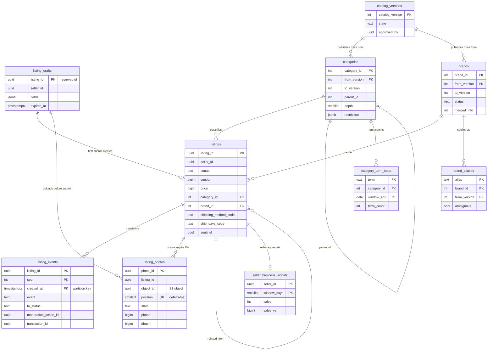

# Data model: 出品・写真・カタログ

出品、出品の遷移の記録、下書き、写真、事業者の兆し、カタログ（カテゴリの木、ブランドの辞書、バージョンの公開）、カテゴリの候補の統計。振る舞いは [listings-and-photos.md](../listings-and-photos.md) と [categories-brands-and-pricing-suggestions.md](../categories-brands-and-pricing-suggestions.md)、方針は [ADR-0011](../../decisions/0011-listing-state-machine-and-versions.md)・[ADR-0012](../../decisions/0012-photo-pipeline-and-perceptual-hashes.md)・[ADR-0013](../../decisions/0013-photo-reuse-index.md)・[ADR-0015](../../decisions/0015-category-tree-brand-dictionary-and-restrictions.md)・[ADR-0016](../../decisions/0016-price-suggestion-from-sold-percentiles.md)。規約は [data-model.md](../data-model.md) の 3 節。

- どの表も core のクラスタにある。出品と写真は `listings`、カタログは `catalog` のパッケージが書く。
- 出品の状態は `transitionListing()` だけが書く。`purchaseListing` と取引の遷移の関数は、同じ core のトランザクションでこの関数を呼ぶ（ADR-0011）。
- 下書き（状態 `draft`）は `listing_drafts` に置き、`listings` の行は最初の送信で作る（[data-model.md](../data-model.md) の 7 節 D-4）。
- 写真のハッシュの索引（`photo_hashes`）と価格の提案（`price:*`）は Aurora の外（[stores.md](stores.md) の 1・6 節）。

## 1. ER 図

- `categories`・`brands` から `listings` への線は論理の参照。出品は作った時の `category_tree_version` を持ち、行のバージョンは問わない（後継に写して読む）。外部キーは張らない。
- `listings ||--o| seller_business_signals` は売り手ごとの集計の意味の線で、キーは `seller_id`。
- `listing_photos` は `listing_id` だけを持ち、`listings` にも `listing_drafts` にも外部キーを張らない（下書きの写真は `listings` の行の前にできる）。

## 2. 制約の実装

| 制約 | 実装 |
| --- | --- |
| 購入の条件つきの更新（ADR-0002） | `UPDATE listings SET status = 'trading', version = version + 1 WHERE listing_id = $1 AND status = 'on_sale' AND version = $2 AND price = $3 AND seller_id <> $buyer`。この列（`status`・`version`・`price`）は守る物（[ADR-0078](../../decisions/0078-pipeline-schema-ordering-ledger-migrations-and-flag-governance.md)） |
| 遷移の記録 | `transitionListing()` が出品の行を `FOR UPDATE` で取り、`listing_events` に `seq = 前の seq + 1` で 1 行足す。T&S の理由の遷移は `moderation_action_id` を必ず持つ（CHECK） |
| `version` は下がらない | `BEFORE UPDATE` のトリガーで `NEW.version >= OLD.version` |
| 写真の並び | `(listing_id, position)` の一意の制約を `DEFERRABLE INITIALLY DEFERRED` にし、並べ替えを 1 つのトランザクションで書く。`failed`・`withdrawn` の行は `position = NULL` |
| カタログの今の行 | `categories`・`brands` に部分 UK `(… ) WHERE to_version IS NULL`。公開の関数だけが `to_version` を閉じ、新しい行を足す |

## 3. 表

### 3.1 `listings`

出品の正本。公開の表（RLS なし）で、見える範囲は `listingVisible()` で決める（ADR-0007）。定義元：[listings-and-photos.md](../listings-and-photos.md) の 4 節。

| 列 | 型 | NULL | 既定 | 説明 |
| --- | --- | --- | --- | --- |
| `listing_id` | `uuid` | NOT NULL | — | 下書きで予約した UUIDv7 |
| `seller_id` | `uuid` | NOT NULL | — | → `accounts(id)` |
| `status` | `text` | NOT NULL | — | `screening`・`on_sale`・`paused`・`trading`・`sold`・`under_review`・`removed`・`deleted` |
| `resume_to` | `text` | NULL | — | `under_review` の戻り先（`on_sale`・`paused`） |
| `version` | `bigint` | NOT NULL | `1` | 買い手に見える変更で 1 上げる（4.3 節） |
| `title` | `text` | NOT NULL | — | NFKC の後 1〜40 書記素（書記素はアプリで数える） |
| `description` | `text` | NOT NULL | `''` | 0〜1,000 文字 |
| `category_id` | `integer` | NOT NULL | — | 3 階層目 |
| `category_tree_version` | `integer` | NOT NULL | — | 作った時の `catalog_version` |
| `condition` | `text` | NOT NULL | — | `new_unused` など 6 段 |
| `brand_id` | `integer` | NULL | — | NULL は「なし」 |
| `size_code` | `text` | NULL | — | カテゴリの `size_scheme` のコード |
| `shipping_method_code` | `text` | NOT NULL | — | `shipping_rates.method_code`（`ymt.box_60` など） |
| `shipping_payer` | `text` | NOT NULL | — | `seller`・`buyer` |
| `ship_days_code` | `text` | NOT NULL | — | `1_2`・`2_3`・`4_7` |
| `ship_from_pref` | `smallint` | NOT NULL | — | 都道府県のコード（1〜47） |
| `price` | `bigint` | NOT NULL | — | 円。300〜9,999,999 |
| `like_count` | `integer` | NOT NULL | `0` | 目安（`like-counter` が加算。[search-and-saved-searches.md](search-and-saved-searches.md)） |
| `photo_quality` | `real` | NULL | — | 1 枚目の写真の質の点（0.1〜1.0） |
| `relisted_from` | `uuid` | NULL | — | 再出品の元 |
| `sentinel` | `boolean` | NOT NULL | `false` | 見張りの出品 |
| `published_at` | `timestamptz` | NULL | — | 最初に `on_sale` に入った時刻 |
| `sold_at` | `timestamptz` | NULL | — | `sold` に入った時刻 |
| `created_at` | `timestamptz` | NOT NULL | `now()` | 最初の送信の時刻 |
| `updated_at` | `timestamptz` | NOT NULL | `now()` | |

- キー：PK `(listing_id)`。FK なし（`seller_id` も含め、行は残すので論理の参照。カテゴリ・ブランドはバージョンの範囲を持つ表）。
- 索引：
  - `(seller_id, status)` — 自分の出品の一覧、プロフィールの一覧、公開中の上限（2,000）の数え。
  - `(status, published_at)` — 作り直しの範囲の読み出し、照合。
  - `(category_id, published_at DESC) WHERE status = 'on_sale'` — OpenSearch の停止の時の「カテゴリの新着」（[infrastructure.md](../infrastructure.md) の 7.3 節）。
  - `(relisted_from) WHERE relisted_from IS NOT NULL` — 自分の再出品の連なり（写真の使い回しの除き）。
  - `(listing_id) WHERE sentinel` — 見張りの一覧。
- CHECK：`status IN (...)`。`price BETWEEN 300 AND 9999999`。`(status = 'under_review') = (resume_to IS NOT NULL)`。`shipping_payer IN ('seller','buyer')`。`ship_days_code IN ('1_2','2_3','4_7')`。`ship_from_pref BETWEEN 1 AND 47`。`char_length(title) BETWEEN 1 AND 200`・`char_length(description) <= 4000`（上限の安全網。正しい数えはアプリ）。`status <> 'sold' OR sold_at IS NOT NULL`。
- RLS：なし（公開）。書くのは `listings` の役割だけ（`transactions` は `transitionListing()` を同じプロセスの中で呼ぶ）。
- 区分：U。題名・説明はログに出さない。
- 保持と削除：行は消さない（取引・措置の記録が指す。取引と同じ 10 年）。`deleted` と、`sold` から 1 年の出品は、索引と写真を消す（[security.md](../security.md) の 7.1 節）。
- S1 の量：販売中・取引中 3,000 万、1 年で 1.1 億行（新しい出品 30 万件/日）。1 行 1.5 KB として 170 GB 前後（見込み）。

### 3.2 `listing_events`

出品の遷移と編集の記録（追記だけ）。定義元：[listings-and-photos.md](../listings-and-photos.md) の 4.2 節。

| 列 | 型 | NULL | 既定 | 説明 |
| --- | --- | --- | --- | --- |
| `listing_id` | `uuid` | NOT NULL | — | |
| `seq` | `integer` | NOT NULL | — | 出品ごとの連番（1 から） |
| `created_at` | `timestamptz` | NOT NULL | `now()` | 分割の鍵 |
| `event` | `text` | NOT NULL | — | `submit`・`publish`・`edit`・`price_changed`・`pause`・`resume`・`purchase`・`txn_cancelled`・`txn_completed`・`moderation_hold`・`moderation_remove`・`moderation_restore`・`appeal_restore`・`delete` |
| `from_status` | `text` | NULL | — | 最初の送信は NULL |
| `to_status` | `text` | NOT NULL | — | 編集は `from_status` と同じ |
| `actor_kind` | `text` | NOT NULL | — | `seller`・`buyer`・`system`・`ts_rule`・`reviewer` |
| `actor_id` | `uuid` | NULL | — | |
| `reason_code` | `text` | NULL | — | |
| `moderation_action_id` | `uuid` | NULL | — | `moderation_actions`（content。論理の参照） |
| `transaction_id` | `uuid` | NULL | — | 取引の遷移のとき |
| `version` | `bigint` | NOT NULL | — | 遷移の後の `listings.version` |
| `price_before` | `bigint` | NULL | — | `price_changed` だけ |
| `price_after` | `bigint` | NULL | — | 同上 |

- キー：PK `(listing_id, seq, created_at)`（分割の鍵を含める。`seq` の一意は出品の行のロックで守る）。
- 索引：`(listing_id, created_at)` — 1 日 10 回の価格の変更の数え、出品の履歴。`(moderation_action_id) WHERE moderation_action_id IS NOT NULL` — 措置の適用の照合（PROP-TS-001・008）。
- CHECK：`actor_kind IN (...)`。`actor_kind NOT IN ('ts_rule','reviewer') OR moderation_action_id IS NOT NULL`。`(event = 'price_changed') = (price_after IS NOT NULL)`。
- RLS：なし（`listings`・`trust-safety` の照合・運用の画面の役割だけに GRANT）。区分：M。
- 分割：`created_at` の月。保持：2 年を DB に置き、古い区切りは S3 の `records` へ写して `DROP`（[stores.md](stores.md) の 3 節）。10 年残す。
- S1 の量：1 日 100 万行（見込み）。

### 3.3 `listing_drafts`

下書き（本人だけ）。定義元：[listings-and-photos.md](../listings-and-photos.md) の 4.5 節。

| 列 | 型 | NULL | 既定 | 説明 |
| --- | --- | --- | --- | --- |
| `listing_id` | `uuid` | NOT NULL | `uuidv7()` | 送信で `listings.listing_id` になる |
| `seller_id` | `uuid` | NOT NULL | — | |
| `fields` | `jsonb` | NOT NULL | `'{}'` | 4.1 節の項目（途中の値を許す。形はアプリの Zod） |
| `relisted_from` | `uuid` | NULL | — | |
| `version` | `bigint` | NOT NULL | `1` | `If-Match` の比べ |
| `created_at` | `timestamptz` | NOT NULL | `now()` | |
| `updated_at` | `timestamptz` | NOT NULL | `now()` | |
| `expires_at` | `timestamptz` | NOT NULL | — | `updated_at` ＋ 180 日 |

- キー：PK `(listing_id)`。索引：`(seller_id, updated_at DESC)` — 一覧と 50 件の上限。`(expires_at)` — 掃除。
- RLS：本人（`seller_id`）。区分：O。
- 送信：同じトランザクションで `listings` の行を足し、下書きの行を消す。`listings` の行が残っていれば（`paused` からの再開など）下書きを使わない。
- 保持：180 日で消し、`listing_photos` の行と写真も消す。S1 の量：500 万行（見込み）。

### 3.4 `listing_photos`

写真の行。定義元：[listings-and-photos.md](../listings-and-photos.md) の 5 節。

| 列 | 型 | NULL | 既定 | 説明 |
| --- | --- | --- | --- | --- |
| `photo_id` | `uuid` | NOT NULL | `uuidv7()` | 行の ID |
| `listing_id` | `uuid` | NOT NULL | — | 出品か下書き |
| `object_id` | `uuid` | NOT NULL | — | S3 の物の ID。新しい写真は `photo_id` と同じ。再出品は元の `object_id`（D-5） |
| `position` | `smallint` | NULL | — | 0〜9。0 が表紙。`failed`・`withdrawn` は NULL |
| `state` | `text` | NOT NULL | `'uploading'` | `uploading`・`processing`・`ready`・`failed`・`withdrawn` |
| `fail_reason` | `text` | NULL | — | `rejected_format`・`rejected_dimensions`・`metadata_check`・`transform` |
| `width` | `integer` | NULL | — | 元の幅 |
| `height` | `integer` | NULL | — | 元の高さ |
| `phash` | `bigint` | NULL | — | 64 ビット |
| `dhash` | `bigint` | NULL | — | 64 ビット |
| `hash_degenerate` | `boolean` | NOT NULL | `false` | 濃淡の標準偏差 8 未満 |
| `dark_score` | `real` | NULL | — | 0〜255 |
| `blur_score` | `real` | NULL | — | Laplacian の分散 |
| `photo_version` | `integer` | NOT NULL | `1` | 配信の URL の `?v=` |
| `created_at` | `timestamptz` | NOT NULL | `now()` | |
| `ready_at` | `timestamptz` | NULL | — | |
| `withdrawn_at` | `timestamptz` | NULL | — | 措置・削除で配信を止めた時刻 |

- キー：PK `(photo_id)`。UK `(listing_id, position)` DEFERRABLE INITIALLY DEFERRED。
- 索引：`(object_id)` — 参照の数（0 になったら S3 の物を消す）。`(listing_id) WHERE state = 'ready'` — 出品の表示と索引。
- CHECK：`position BETWEEN 0 AND 9`。`state IN (...)`。`state NOT IN ('failed','withdrawn') OR position IS NULL`。`state <> 'ready' OR (phash IS NOT NULL AND dhash IS NOT NULL)`。`(state = 'failed') = (fail_reason IS NOT NULL)`。
- RLS：なし（公開の参照）。配信は `listingVisible()` を通した出品の写真だけ（URL は推測しにくい `object_id`）。
- 区分：U。保持：出品の削除・`sold` から 1 年で `withdrawn` にし、参照の数 0 で S3 の物を消す。S1 の量：1 日 150 万行、1 年で 5.5 億行（見込み。1 行 150 バイトで 80 GB）。

### 3.5 `seller_business_signals`

数多く売る個人の兆し（枠組み。L3）。定義元：[listings-and-photos.md](../listings-and-photos.md) の 7 節。

| 列 | 型 | NULL | 既定 | 説明 |
| --- | --- | --- | --- | --- |
| `seller_id` | `uuid` | NOT NULL | — | |
| `window_days` | `smallint` | NOT NULL | — | `30`・`365` |
| `listings` | `integer` | NOT NULL | — | 出品の数 |
| `sales` | `integer` | NOT NULL | — | 販売の数 |
| `sales_yen` | `bigint` | NOT NULL | — | 販売の額 |
| `new_ratio` | `real` | NOT NULL | — | 新品・未使用の割合 |
| `repeat_items` | `integer` | NOT NULL | — | 同じ品の繰り返しの数 |
| `computed_at` | `timestamptz` | NOT NULL | — | |

- キー：PK `(seller_id, window_days)`。CHECK：`window_days IN (30, 365)`。
- RLS：なし（`listings` の集計のジョブと T&S の役割だけ）。区分：M。印の判定（`legal.business_seller_*`）は本番で無効（L3）。
- 保持：上書き。S1 の量：売った売り手 × 2 で 400 万行（見込み）。

### 3.6 `catalog_versions`

カタログの設定のバージョンの公開（作成者と別の承認者）。定義元：[categories-brands-and-pricing-suggestions.md](../categories-brands-and-pricing-suggestions.md) の 4.5 節。

| 列 | 型 | NULL | 既定 | 説明 |
| --- | --- | --- | --- | --- |
| `catalog_version` | `integer` | NOT NULL | — | 公開の順に 1 上げる |
| `state` | `text` | NOT NULL | `'draft'` | `draft`・`approved`・`published`・`abandoned` |
| `created_by` | `uuid` | NOT NULL | — | 運用者 |
| `approved_by` | `uuid` | NULL | — | |
| `created_at` | `timestamptz` | NOT NULL | `now()` | |
| `published_at` | `timestamptz` | NULL | — | |
| `s3_key` | `text` | NULL | — | `catalog/{catalog_version}.json` |

- キー：PK `(catalog_version)`。部分 UK `(state) WHERE state = 'draft'`（下書きは 1 つ）。
- CHECK：`approved_by IS NULL OR approved_by <> created_by`。`state <> 'published' OR (approved_by IS NOT NULL AND s3_key IS NOT NULL)`。
- 公開は 1 日 4 回まで。公開で `catalog.published` を outbox に書く。RLS：なし（設定）。区分：U。保持：残す。

### 3.7 `categories`

カテゴリの木（3 階層）。行はバージョンの範囲（`from_version` から `to_version` の前まで）を持つ。定義元：同 4 節。

| 列 | 型 | NULL | 既定 | 説明 |
| --- | --- | --- | --- | --- |
| `category_id` | `integer` | NOT NULL | — | 変えない・使い回さない |
| `from_version` | `integer` | NOT NULL | — | この行が効く最初のバージョン |
| `to_version` | `integer` | NULL | — | この行が効かなくなったバージョン。NULL は今の行 |
| `parent_id` | `integer` | NULL | — | 1 階層目は NULL |
| `depth` | `smallint` | NOT NULL | — | 1〜3 |
| `name_ja` | `text` | NOT NULL | — | |
| `status` | `text` | NOT NULL | `'active'` | `active`・`retired` |
| `successor_id` | `integer` | NULL | — | 廃止の後継 |
| `size_scheme` | `text` | NOT NULL | `'none'` | `apparel_alpha`・`shoes_cm`・`kids_cm`・`none` |
| `brand_mode` | `text` | NOT NULL | `'optional'` | `required`・`optional`・`none` |
| `condition_scheme` | `text` | NOT NULL | `'standard'` | `standard`・`media` |
| `fee_class` | `text` | NOT NULL | `'standard'` | 手数料の表の鍵（[ledger-and-proceeds.md](ledger-and-proceeds.md) の 3.16 節） |
| `default_shipping_tiers` | `text[]` | NOT NULL | `'{}'` | 方法のコードの候補 |
| `restriction` | `jsonb` | NOT NULL | `'[]'` | `prohibited`・`requires_review`・`requires_kyc`・`seller_cap`・`notice` の並び（値は L10 の後） |
| `min_seller_age` | `smallint` | NULL | — | L10・L12 |
| `min_buyer_age` | `smallint` | NULL | — | 同上 |
| `keywords` | `text[]` | NOT NULL | `'{}'` | Sudachi の正規化した形 |

- キー：PK `(category_id, from_version)`。部分 UK `(category_id) WHERE to_version IS NULL`。
- 索引：`(parent_id) WHERE to_version IS NULL` — 木の組み立て。
- CHECK：`depth BETWEEN 1 AND 3`。`(depth = 1) = (parent_id IS NULL)`。`status <> 'retired' OR successor_id IS NOT NULL`。`to_version IS NULL OR to_version > from_version`。
- RLS：なし（設定）。区分：U。S1 の量：3 階層目 3,000 まで。バージョンごとに変わった行だけが増える。

### 3.8 `brands`

ブランドの辞書。定義元：同 5.1 節。偽ブランドの危険の段は T&S の `brand_risk_profiles` が持つ（D-12）。

| 列 | 型 | NULL | 既定 | 説明 |
| --- | --- | --- | --- | --- |
| `brand_id` | `integer` | NOT NULL | — | |
| `from_version` | `integer` | NOT NULL | — | |
| `to_version` | `integer` | NULL | — | |
| `name_ja` | `text` | NOT NULL | — | 正式な名前 |
| `name_en` | `text` | NULL | — | |
| `status` | `text` | NOT NULL | `'active'` | `active`・`merged` |
| `merged_into` | `integer` | NULL | — | |
| `category_scope` | `integer[]` | NOT NULL | `'{}'` | よく出る 1 階層目のカテゴリ |

- キー：PK `(brand_id, from_version)`。部分 UK `(brand_id) WHERE to_version IS NULL`。
- CHECK：`(status = 'merged') = (merged_into IS NOT NULL)`。`merged_into IS NULL OR merged_into <> brand_id`。
- RLS：なし（設定）。区分：U。S1 の量：2 万ブランド（上限 10 万）。

### 3.9 `brand_aliases`

ブランドの別名（`normalizeBrandText` の後の文字）。

| 列 | 型 | NULL | 既定 | 説明 |
| --- | --- | --- | --- | --- |
| `alias` | `text` | NOT NULL | — | 正規化した後の文字 |
| `brand_id` | `integer` | NOT NULL | — | |
| `from_version` | `integer` | NOT NULL | — | |
| `to_version` | `integer` | NULL | — | |
| `kind` | `text` | NOT NULL | — | `ja`・`en`・`abbr`・`typo` |
| `ambiguous` | `boolean` | NOT NULL | `false` | 別のブランド・普通の語と重なる |

- キー：PK `(alias, brand_id, from_version)`。部分 UK `(alias, brand_id) WHERE to_version IS NULL`。
- 索引：`(brand_id) WHERE to_version IS NULL` — 索引の `brand_text` の展開。
- 上限：1 ブランド 50。RLS：なし（設定）。区分：U。S1 の量：10 万行。

### 3.10 `category_term_stats`

題名の語ごとのカテゴリの分布（カテゴリの候補。日次）。定義元：同 4.4 節。

| 列 | 型 | NULL | 既定 | 説明 |
| --- | --- | --- | --- | --- |
| `term` | `text` | NOT NULL | — | Sudachi の正規化した形 |
| `category_id` | `integer` | NOT NULL | — | 3 階層目 |
| `window_end` | `date` | NOT NULL | — | 直近 90 日の窓の終わりの日 |
| `term_count` | `integer` | NOT NULL | — | 出品の数 |

- キー：PK `(term, category_id, window_end)`。索引：`(window_end)` — 古い窓の掃除。
- 名前：領域の文書の `count` は SQL の関数名と紛れるので `term_count` にした（D-13）。
- RLS：なし（`catalog` の集計のジョブと `listings` の役割）。区分：M。保持：直近 2 つの窓。S1 の量：1 窓 500 万行（見込み）。

## 4. 外の置き場所

- S3：`photos-incoming/{listing_id}/{photo_id}`（24 時間）、`photos/{object_id}/{variant}.{ext}`、`photos/quarantine/…`、`config/catalog/{catalog_version}.json`、`config/price-stats/{date}/{stats_version}.parquet`（[stores.md](stores.md) の 3 節）。
- OpenSearch：`photo_hashes`（[stores.md](stores.md) の 6.2 節）。
- Valkey：`listing:{id}:snap`、`vis:{listing_id}`、`price:*`（[stores.md](stores.md) の 1 節）。
- SQS：`media-process`。outbox の話題：`listing.published`・`listing.updated`・`listing.price_changed`・`listing.price_dropped`・`listing.status_changed`・`listing.seller_tier_changed`・`photo.ready`・`catalog.published`。
