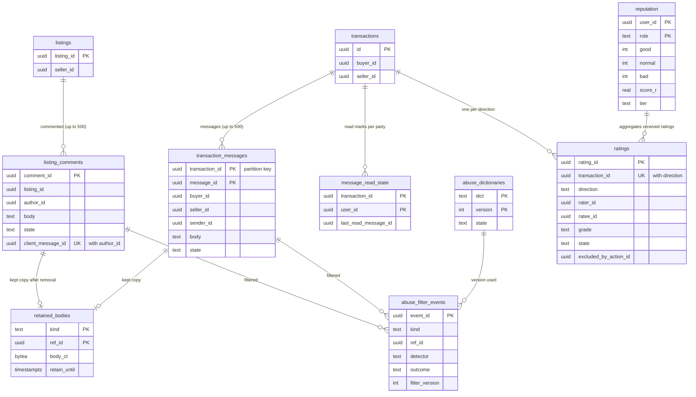

# Data model: コメント・メッセージ・評価

商品のコメント、取引のメッセージ、未読、保持の写し、悪用の絞り込みの記録と辞書、評価、評価の集計。振る舞いは [messaging-and-comments.md](../messaging-and-comments.md) と [ratings-and-reputation.md](../ratings-and-reputation.md)、方針は [ADR-0046](../../decisions/0046-comments-and-transaction-messages-storage.md)・[ADR-0047](../../decisions/0047-send-time-abuse-filter-and-scan-modes.md)・[ADR-0049](../../decisions/0049-mutual-ratings-sealed-until-completion.md)・[ADR-0050](../../decisions/0050-reputation-score-and-manipulation-review.md)。規約は [data-model.md](../data-model.md) の 3 節。

- コメントとメッセージの 6 表は content（`messaging` が書く。辞書は `trust-safety`）、評価の 2 表は core（`transactions` の中の評価の関数が書く）。
- 本文は通知・ログ・データレイクに出さない。絞り込みの記録は種類とバージョンだけで、一致した文字を残さない（PROP-MSG-003）。

## 1. ER 図

- `listings`・`transactions` は core、コメントとメッセージは content にあり、`listing_id`・`transaction_id` は論理の参照。
- `abuse_filter_events.ref_id` は `block` の送信では NULL（送らなかったので行がない）。図の線は記録した送信だけの意味。

## 2. 表

### 2.1 `listing_comments`（content）

商品のコメント（公開）。定義元：[messaging-and-comments.md](../messaging-and-comments.md) の 4.1 節。

| 列 | 型 | NULL | 既定 | 説明 |
| --- | --- | --- | --- | --- |
| `comment_id` | `uuid` | NOT NULL | `uuidv7()` | |
| `listing_id` | `uuid` | NOT NULL | — | |
| `seller_id` | `uuid` | NOT NULL | — | 出品の売り手の写し（売り手の削除と通知） |
| `author_id` | `uuid` | NOT NULL | — | |
| `body` | `text` | NOT NULL | — | NFKC の後 1〜300 文字 |
| `state` | `text` | NOT NULL | `'visible'` | `visible`・`deleted_by_author`・`deleted_by_seller`・`removed` |
| `client_message_id` | `uuid` | NOT NULL | — | 送信の冪等キー |
| `filter_version` | `integer` | NOT NULL | — | |
| `filter_outcome` | `text` | NOT NULL | — | `allow`・`warn` |
| `created_at` | `timestamptz` | NOT NULL | `now()` | |
| `deleted_at` | `timestamptz` | NULL | — | |

- キー：PK `(comment_id)`。UK `(author_id, client_message_id)`。
- 索引：`(listing_id, created_at)` — 出品の詳細の一覧と 500 件の上限。`(author_id, created_at)` — 「同じ出品にコメントした人」の通知（直近 30 日）と退会。
- CHECK：`char_length(body) BETWEEN 1 AND 300`。`state IN (...)`。`(state = 'visible') = (deleted_at IS NULL)`。
- 削除：論理の削除。消した・措置した本文は `retained_bodies` に写してから `body` を空にする。
- RLS：なし（公開。出品が見える人に出す）。書くのは `messaging` の役割だけ。区分：U。
- 保持：出品の行と同じ。売れてから 1 年で出品の詳細から外れたものは、本文を空にする。S1 の量：1 日 50 万行（見込み）。

### 2.2 `transaction_messages`（content）

取引のメッセージ（2 者の RLS）。定義元：同 4.2 節。

| 列 | 型 | NULL | 既定 | 説明 |
| --- | --- | --- | --- | --- |
| `transaction_id` | `uuid` | NOT NULL | — | 分割の鍵 |
| `message_id` | `uuid` | NOT NULL | `uuidv7()` | |
| `buyer_id` | `uuid` | NOT NULL | — | |
| `seller_id` | `uuid` | NOT NULL | — | |
| `sender_id` | `uuid` | NOT NULL | — | |
| `body` | `text` | NOT NULL | — | 1〜1,000 文字 |
| `state` | `text` | NOT NULL | `'visible'` | `visible`・`removed` |
| `client_message_id` | `uuid` | NOT NULL | — | |
| `filter_version` | `integer` | NOT NULL | — | |
| `filter_outcome` | `text` | NOT NULL | — | `allow`・`warn` |
| `created_at` | `timestamptz` | NOT NULL | `now()` | |

- キー：PK `(transaction_id, message_id)`。UK `(transaction_id, sender_id, client_message_id)`。
- 分割：`transaction_id` の範囲（UUIDv7 の月の境。D-21）。1 つの取引のメッセージは 1 つの区切りに入る。
- 索引：`(transaction_id, created_at)` — 取引の画面。
- CHECK：`sender_id IN (buyer_id, seller_id)`。`char_length(body) BETWEEN 1 AND 1000`。`state IN (...)`。
- 書き込み：`messaging` が core の取引で 2 者かと、終わりから 14 日の内かを確かめてから書く。利用者は消せない。
- RLS：2 者。運用者は案件に結んだ JIT（`case.view_messages`）で、`messaging` の API を通す。
- 区分：P。保持：取引の終わりから 2 年（ADR-0071。L5・L11）。区切りを取引を作った月の 26 か月後に `DROP`（紛争の保全の取引は先に `retained_bodies` へ写す）。
- S1 の量：1 日 40 万行（1 取引 4 件の見込み）。

### 2.3 `message_read_state`（content）

未読の位置。

| 列 | 型 | NULL | 既定 | 説明 |
| --- | --- | --- | --- | --- |
| `transaction_id` | `uuid` | NOT NULL | — | |
| `user_id` | `uuid` | NOT NULL | — | |
| `last_read_message_id` | `uuid` | NULL | — | |
| `updated_at` | `timestamptz` | NOT NULL | `now()` | |

- キー：PK `(transaction_id, user_id)`。RLS：本人。区分：P。保持：メッセージと同じ。

### 2.4 `retained_bodies`（content）

削除・措置の後の本文の写し（T&S の鍵で暗号化）。通報・措置・紛争・照会のために持つ。

| 列 | 型 | NULL | 既定 | 説明 |
| --- | --- | --- | --- | --- |
| `kind` | `text` | NOT NULL | — | `comment`・`message`・`rating` |
| `ref_id` | `uuid` | NOT NULL | — | コメント・メッセージ・評価の ID |
| `body_ct` | `bytea` | NOT NULL | — | `data_keys`（`purpose = 'ts'`）の鍵の暗号文（3.6 節の形） |
| `reason` | `text` | NOT NULL | — | `author_deleted`・`seller_deleted`・`moderation`・`report`・`dispute`・`legal_hold` |
| `retain_until` | `timestamptz` | NOT NULL | — | 期間は L5・L9・L11 の後。開発は 180 日 |
| `created_at` | `timestamptz` | NOT NULL | `now()` | |

- キー：PK `(kind, ref_id)`。索引：`(retain_until)` — 掃除（`legal_holds` の対象を飛ばす）。
- RLS：なし（`trust-safety`・`ops-api` の役割。読み出しは監査ログに案件の ID とともに残す）。区分：P。

### 2.5 `abuse_filter_events`（content）

送る時の絞り込みの記録。本文の部分を持たない。定義元：同 5.1 節。

| 列 | 型 | NULL | 既定 | 説明 |
| --- | --- | --- | --- | --- |
| `event_id` | `uuid` | NOT NULL | `uuidv7()` | 分割の鍵 |
| `kind` | `text` | NOT NULL | — | `comment`・`message`・`rating` |
| `ref_id` | `uuid` | NULL | — | 送ったときのコメント・メッセージ・評価の ID。`block` は NULL |
| `context_id` | `uuid` | NOT NULL | — | 出品か取引の ID |
| `sender_id` | `uuid` | NOT NULL | — | |
| `detector` | `text` | NOT NULL | — | `phone`・`email`・`url`・`external_id`・`address`・`offplatform_payment`・`prohibited_term`・`harassment` |
| `outcome` | `text` | NOT NULL | — | `block`・`warn` |
| `filter_version` | `integer` | NOT NULL | — | |
| `created_at` | `timestamptz` | NOT NULL | `now()` | |

- キー：PK `(event_id)`。分割：`event_id` の範囲（月）。索引：`(sender_id, created_at)` — T&S の信号（回数）。
- CHECK：`detector IN (...)`。`outcome IN ('block','warn')`。`outcome <> 'block' OR ref_id IS NULL`。
- RLS：なし（`messaging`・`trust-safety`）。区分：M。保持：90 日。S1 の量：1 日 5 万行（見込み）。

### 2.6 `abuse_dictionaries`（content）

絞り込みの辞書（T&S が持つ。他のサービスの名前、市区町村、侮辱の語。禁止の語は `ts_terms`）。

| 列 | 型 | NULL | 既定 | 説明 |
| --- | --- | --- | --- | --- |
| `dict` | `text` | NOT NULL | — | `external_services`・`municipalities`・`harassment`・`payment_terms`・`allowlist` |
| `version` | `integer` | NOT NULL | — | |
| `entries` | `jsonb` | NOT NULL | — | 語の一覧 |
| `state` | `text` | NOT NULL | `'shadow'` | `shadow`（7 日）・`active`・`retired` |
| `approved_by` | `uuid` | NULL | — | |
| `created_at` | `timestamptz` | NOT NULL | `now()` | |

- キー：PK `(dict, version)`。部分 UK `(dict) WHERE state = 'active'`。
- RLS：なし（設定。`messaging` のタスクがメモリーに読む）。区分：M。保持：残す。

### 2.7 `ratings`（core）

相互の評価。`sealed` の間は書いた本人だけが読む（ADR-0049）。定義元：[ratings-and-reputation.md](../ratings-and-reputation.md) の 4 節。

| 列 | 型 | NULL | 既定 | 説明 |
| --- | --- | --- | --- | --- |
| `rating_id` | `uuid` | NOT NULL | `uuidv7()` | |
| `transaction_id` | `uuid` | NOT NULL | — | |
| `direction` | `text` | NOT NULL | — | `buyer_to_seller`・`seller_to_buyer` |
| `rater_id` | `uuid` | NOT NULL | — | |
| `ratee_id` | `uuid` | NOT NULL | — | |
| `grade` | `text` | NOT NULL | — | `good`・`normal`・`bad` |
| `comment` | `text` | NOT NULL | `''` | 0〜150 文字（`bad` は 10 文字以上） |
| `state` | `text` | NOT NULL | `'sealed'` | `sealed`・`published`・`voided` |
| `rater_completed_trades_at_time` | `integer` | NOT NULL | — | 重み（3 件未満は 0.5） |
| `excluded_by_action_id` | `uuid` | NULL | — | `rating_exclude` の措置（content。論理の参照） |
| `created_at` | `timestamptz` | NOT NULL | `now()` | |
| `published_at` | `timestamptz` | NULL | — | 取引の `completed` の時刻 |

- キー：PK `(rating_id)`。UK `(transaction_id, direction)`。
- 索引：`(ratee_id, direction, published_at DESC) WHERE state = 'published' AND excluded_by_action_id IS NULL` — プロフィールの一覧と集計。`(rater_id, created_at)`。
- CHECK：`rater_id <> ratee_id`。`grade <> 'bad' OR char_length(comment) >= 10`。`char_length(comment) <= 150`。`(state = 'published') = (published_at IS NOT NULL)`。
- 書き込み：遷移の関数と同じ core のトランザクションで `sealed` で書き、`completed` の遷移で同じ取引の評価を全部 `published` にする。
- 外し：措置は content に書かれ、`ratings` の適用の消費者が `moderation.action_applied` を受けて core の 1 つのトランザクションで `excluded_by_action_id` と集計を直す（冪等。D-20）。
- RLS：`state = 'published' AND excluded_by_action_id IS NULL` は公開の読み出しの役割（プロフィールの API）、それ以外は書いた本人（`rater_id = app.actor_id`）。外した評価は書いた人と受けた人に「運営により非表示」と出す（API）。
- 区分：P（公開の後は U）。保持：取引と同じ。S1 の量：1 日 15 万行。

### 2.8 `reputation`（core）

評価の集計と内部の段（ADR-0050）。定義元：同 5 節。

| 列 | 型 | NULL | 既定 | 説明 |
| --- | --- | --- | --- | --- |
| `user_id` | `uuid` | NOT NULL | — | |
| `role` | `text` | NOT NULL | — | `seller`・`buyer`（評価を受けた側） |
| `good` | `integer` | NOT NULL | `0` | 表示の数（公開） |
| `normal` | `integer` | NOT NULL | `0` | 同 |
| `bad` | `integer` | NOT NULL | `0` | 同 |
| `weighted_sum` | `real` | NOT NULL | `0` | 内部（重みの和） |
| `weighted_good` | `real` | NOT NULL | `0` | 内部（Σ 重み × 良さ） |
| `score_r` | `real` | NOT NULL | `0.95` | 内部の R |
| `tier` | `text` | NOT NULL | `'new'` | `new`・`standard`・`trusted`・`low`（内部） |
| `updated_at` | `timestamptz` | NOT NULL | `now()` | |

- キー：PK `(user_id, role)`。CHECK：`score_r BETWEEN 0 AND 1`。`tier IN (...)`。
- 見せ方：公開の役割には列の GRANT で `user_id`・`role`・`good`・`normal`・`bad` だけを与える（内部の点と段を出さない）。
- RLS：なし（公開の表。列の権限で絞る）。区分：U（数）・M（内部の列）。保持：上書き。S1 の量：900 万 × 2 行。

## 3. 外の置き場所

- outbox の話題：`comment.created`・`comment.deleted`・`transaction_message.created`・`abuse_filter.signal`・`rating.published`・`rating.excluded`・`reputation.tier_changed`・`listing.seller_tier_changed`。
- AppConfig：`legal.message_scan_mode`（[stores.md](stores.md) の 10 節）。
- 通知の中身に本文を入れない（[stores.md](stores.md) の 5 節の許可の一覧）。
