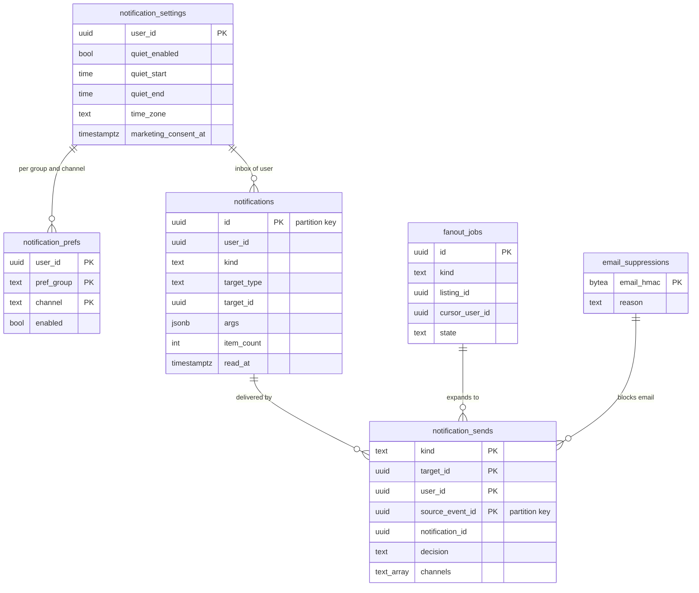

# Data model: 通知

お知らせの一覧、送信の記録、配信の設定、利用者ごとの通知の設定（静かな時間、同意）、fan-out の仕事、止めたメールアドレス。振る舞いは [notifications.md](../notifications.md)、方針は [ADR-0063](../../decisions/0063-notification-kinds-lanes-and-payload.md)・[ADR-0064](../../decisions/0064-fanout-batching-quiet-hours-and-caps.md)・[ADR-0065](../../decisions/0065-notification-preferences-tokens-and-email.md)。規約は [data-model.md](../data-model.md) の 3 節。

- どの表も content のクラスタにあり、`notifier` だけが書く（設定は本人の API）。S2 で `content-notify` に移る。
- 端末とプッシュのトークンの正本は core の `devices`（[accounts-devices-and-verification.md](accounts-devices-and-verification.md) の 2.6 節）。`notifier` は Valkey の写しを読む。
- 中身（`args`・プッシュの本文）は許可の一覧の欄だけ（[stores.md](stores.md) の 5 節）。メッセージ・コメントの本文、住所、本名、電話番号、残高を持たない。

## 1. ER 図

- `notification_settings` は利用者ごとに 0 か 1 行（行がなければ既定）。図の線は利用者でつながる意味の線で、外部キーはない（`notifications` は分割の表）。
- `email_suppressions ||--o{ notification_sends` は「止めた宛先にはメールを送らない」意味の線。

## 2. 表

### 2.1 `notifications`

お知らせの一覧（本人だけ）。定義元：[notifications.md](../notifications.md) の 4.1 節。

| 列 | 型 | NULL | 既定 | 説明 |
| --- | --- | --- | --- | --- |
| `id` | `uuid` | NOT NULL | `uuidv7()` | 分割の鍵。プッシュの `n` |
| `user_id` | `uuid` | NOT NULL | — | |
| `kind` | `text` | NOT NULL | — | 4.2 節の種類（`txn.purchased` など） |
| `target_type` | `text` | NOT NULL | — | `transaction`・`listing`・`saved_search`・`moderation_action`・`payout`・`campaign` |
| `target_id` | `uuid` | NULL | — | |
| `args` | `jsonb` | NOT NULL | `'{}'` | 許可の一覧の欄だけ（題名 40 文字、価格、相手のニックネーム、件数、期限の日時） |
| `item_count` | `integer` | NOT NULL | `1` | まとめた数（同じ出品のいいね） |
| `read_at` | `timestamptz` | NULL | — | |
| `created_at` | `timestamptz` | NOT NULL | `now()` | |
| `updated_at` | `timestamptz` | NOT NULL | `now()` | まとめで数を足した時刻 |

- キー：PK `(id)`。分割：`id` の範囲（月）。
- 索引：`(user_id, created_at DESC)` — 一覧。`(user_id) WHERE read_at IS NULL` — 未読の数。`(user_id, kind, target_id) WHERE read_at IS NULL` — 未読の同じ対象のまとめ（`listing.liked`）。
- 名前：領域の文書の `count` を `item_count` にした（D-13）。
- CHECK：`item_count >= 1`。`jsonb_typeof(args) = 'object'`。中身の欄の検査は `notifier-decide` の Zod（PROP-NTF-002）。
- RLS：本人。区分：O。保持：90 日（区切りを落とす）。S1 の量：1 日 1,500 万行（見込み）。

### 2.2 `notification_sends`

送信の記録と一回性の鍵（ADR-0064）。定義元：同 6.3・9 節。

| 列 | 型 | NULL | 既定 | 説明 |
| --- | --- | --- | --- | --- |
| `kind` | `text` | NOT NULL | — | |
| `target_id` | `uuid` | NOT NULL | — | 対象がない種類はゼロの UUID |
| `user_id` | `uuid` | NOT NULL | — | 宛先 |
| `source_event_id` | `uuid` | NOT NULL | — | 元の outbox の事象の ID（UUIDv7）。分割の鍵 |
| `notification_id` | `uuid` | NULL | — | 書いたお知らせ |
| `lane` | `text` | NOT NULL | — | `security`・`transactional`・`engagement`・`announcement` |
| `decision` | `text` | NOT NULL | — | `sent`・`inbox_only`・`deferred_quiet`・`deferred_window`・`dropped` |
| `dt_row` | `smallint` | NOT NULL | — | DT-NTF-001 の行 |
| `drop_reason` | `text` | NULL | — | `account_state`・`not_visible`・`blocked`・`pref_off`・`daily_cap`・`stale` |
| `channels` | `text[]` | NOT NULL | `'{}'` | `push`・`email` |
| `push_result` | `text` | NULL | — | `accepted`・`unregistered`・`throttled`・`failed` |
| `email_result` | `text` | NULL | — | `accepted`・`suppressed`・`failed` |
| `provider_code` | `text` | NULL | — | 提供者の応答のコード |
| `queued_at` | `timestamptz` | NOT NULL | — | 依頼の時刻 |
| `decided_at` | `timestamptz` | NOT NULL | `now()` | |
| `accepted_at` | `timestamptz` | NULL | — | 提供者が受け付けた時刻（NFR-008 の終わり） |

- キー：PK `(kind, target_id, user_id, source_event_id)`。分割：`source_event_id` の範囲（日。D-21）。一意の鍵が分割の鍵を含み、SQS の重複と fan-out の再開を吸う（PROP-NTF-001）。
- 索引：`(user_id, decided_at)` — 1 人の送信の調べ。
- RLS：なし（`notifier` の役割）。区分：O。保持：30 日。S1 の量：1 日 2,000 万行（見込み）。

### 2.3 `notification_prefs`

まとまりと経路ごとの設定（本人だけ）。行がなければ種類の一覧の既定。定義元：同 7 節。

| 列 | 型 | NULL | 既定 | 説明 |
| --- | --- | --- | --- | --- |
| `user_id` | `uuid` | NOT NULL | — | |
| `pref_group` | `text` | NOT NULL | — | `security`・`transaction`・`comments_and_moderation`・`likes`・`price_drops`・`liked_listing_comments`・`saved_searches`・`announcements` |
| `channel` | `text` | NOT NULL | — | `push`・`email` |
| `enabled` | `boolean` | NOT NULL | — | |
| `updated_at` | `timestamptz` | NOT NULL | `now()` | |

- キー：PK `(user_id, pref_group, channel)`。名前：領域の文書の `group` は SQL の予約語なので `pref_group` にした（D-13）。
- CHECK：`pref_group <> 'security' OR enabled`（切れない）。`transaction` の両方の経路を切る更新は API が 422 で拒む。
- RLS：本人。区分：O。保持：退会まで。S1 の量：500 万行（既定から変えた利用者だけ）。

### 2.4 `notification_settings`

利用者ごとの静かな時間・時間帯・案内の同意。領域の文書は `notification_prefs` に置くとしたが、行の形が違うので表を分けた（D-14）。

| 列 | 型 | NULL | 既定 | 説明 |
| --- | --- | --- | --- | --- |
| `user_id` | `uuid` | NOT NULL | — | |
| `quiet_enabled` | `boolean` | NOT NULL | `true` | |
| `quiet_start` | `time` | NOT NULL | `'23:00'` | 30 分の単位 |
| `quiet_end` | `time` | NOT NULL | `'09:00'` | |
| `time_zone` | `text` | NOT NULL | `'Asia/Tokyo'` | |
| `marketing_consent_at` | `timestamptz` | NULL | — | 案内（`announcement`）の同意（L13） |
| `marketing_consent_version` | `text` | NULL | — | 同意の文のバージョン |
| `updated_at` | `timestamptz` | NOT NULL | `now()` | |

- キー：PK `(user_id)`。CHECK：`extract(minute FROM quiet_start) IN (0, 30)`・`extract(minute FROM quiet_end) IN (0, 30)`。`(marketing_consent_at IS NULL) = (marketing_consent_version IS NULL)`。
- RLS：本人。区分：O。保持：退会まで。

### 2.5 `fanout_jobs`

値下げ・案内の fan-out の続きの位置と、出品ごとの 24 時間に 1 回の判定。定義元：同 6.1 節。

| 列 | 型 | NULL | 既定 | 説明 |
| --- | --- | --- | --- | --- |
| `id` | `uuid` | NOT NULL | `uuidv7()` | |
| `kind` | `text` | NOT NULL | — | `price_drop`・`announcement` |
| `listing_id` | `uuid` | NULL | — | |
| `campaign_id` | `uuid` | NULL | — | |
| `source_event_id` | `uuid` | NOT NULL | — | |
| `partition_no` | `smallint` | NOT NULL | `0` | 10 万を超えるいいねの 4 つの分け（0〜3） |
| `cursor_user_id` | `uuid` | NULL | — | `likes` の `(listing_id, user_id)` の続きの位置 |
| `state` | `text` | NOT NULL | `'running'` | `running`・`done`・`skipped`・`failed` |
| `enqueued` | `integer` | NOT NULL | `0` | 入れた宛先の数 |
| `started_at` | `timestamptz` | NOT NULL | `now()` | |
| `finished_at` | `timestamptz` | NULL | — | |

- キー：PK `(id)`。UK `(source_event_id, partition_no)`。
- 索引：`(listing_id, kind, started_at)` — 24 時間に 1 回の判定。`(state) WHERE state = 'running'` — 再開。
- CHECK：`(kind = 'price_drop') = (listing_id IS NOT NULL)`。`partition_no BETWEEN 0 AND 3`。
- RLS：なし（`notifier-fanout`）。区分：M。保持：30 日。

### 2.6 `email_suppressions`

送り返し・苦情で止めたアドレス。定義元：同 8.3 節。

| 列 | 型 | NULL | 既定 | 説明 |
| --- | --- | --- | --- | --- |
| `email_hmac` | `bytea` | NOT NULL | — | `accounts.email_hmac` と同じ鍵 |
| `reason` | `text` | NOT NULL | — | `bounce`・`complaint` |
| `source` | `text` | NOT NULL | `'ses'` | |
| `created_at` | `timestamptz` | NOT NULL | `now()` | |

- キー：PK `(email_hmac)`。RLS：なし（`notifier`）。区分：O。保持：アドレスの変更か退会まで。

## 3. 外の置き場所

- Valkey：`ntf:devices:{user_id}`（24 時間）、`ntf:cap:{user_id}:{yyyymmdd}`、`ntf:digest:{user_id}`、`ntf:dev:{device_id}:{minute}`（[stores.md](stores.md) の 1 節）。
- SQS：`ntf-security`・`ntf-transactional`・`ntf-engagement`・`ntf-announcement`、各 DLQ。プッシュとメールの中身は [stores.md](stores.md) の 5 節。
- AppConfig：`ops.fanout_enabled`、`ops.saved_search_digest_minutes`。
