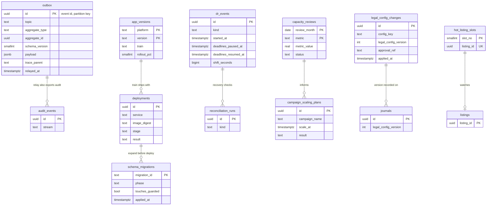

# Data model: 運用

outbox、スキーマの移行の記録、DR の記録、キャパシティのレビュー、企画の日の拡大の予定、デプロイ、アプリのバージョン、`legal.*` の変更の記録、熱い出品の枠。振る舞いは [delivery.md](../delivery.md)、[infrastructure.md](../infrastructure.md)、[capacity.md](../capacity.md)、[observability.md](../observability.md)、方針は [ADR-0073](../../decisions/0073-aurora-layout-osaka-dr-and-ledger-rpo.md)・[ADR-0074](../../decisions/0074-stage-up-criteria-and-split-plan.md)・[ADR-0077](../../decisions/0077-sizing-tiers-and-campaign-prescaling.md)・[ADR-0078](../../decisions/0078-pipeline-schema-ordering-ledger-migrations-and-flag-governance.md)・[ADR-0079](../../decisions/0079-app-release-trains-min-versions-and-model-releases.md)。規約は [data-model.md](../data-model.md) の 3 節。

- `outbox`・`schema_migrations` は 3 つのクラスタのどれにもある。他は core。
- 事象の封筒と話題の一覧は [stores.md](stores.md) の 4 節。

## 1. ER 図

- 線はどれも意味の線（同じクラスタの中でも外部キーは張らない）。`legal_config_changes` と `journals` は別のクラスタで、構成のバージョンの値でつながる。

## 2. 表

### 2.1 `outbox`（各クラスタ）

事象の送り出し（transactional outbox）。状態を書くトランザクションで同時に書く。`relay` が読んで SNS へ流す。

| 列 | 型 | NULL | 既定 | 説明 |
| --- | --- | --- | --- | --- |
| `id` | `uuid` | NOT NULL | `uuidv7()` | 事象の ID。消費者の冪等キー。分割の鍵 |
| `topic` | `text` | NOT NULL | — | `transaction.paid` など（[stores.md](stores.md) の 4.2 節） |
| `aggregate_type` | `text` | NOT NULL | — | `transaction`・`listing`・`journal` など |
| `aggregate_id` | `uuid` | NOT NULL | — | 順序の鍵（SNS FIFO のグループ、または消費者の並べ） |
| `aggregate_version` | `bigint` | NULL | — | 出品・取引の `version`（古い事象を捨てる） |
| `schema_version` | `smallint` | NOT NULL | — | `packages/events` の型のバージョン |
| `payload` | `jsonb` | NOT NULL | — | ID・状態・数・理由のコード・金額。V の値と P の本文を入れない |
| `trace_parent` | `text` | NULL | — | W3C の Trace Context（[observability.md](../observability.md) の 2.3 節） |
| `created_at` | `timestamptz` | NOT NULL | `now()` | |
| `relayed_at` | `timestamptz` | NULL | — | |

- キー：PK `(id)`。分割：`id` の範囲（日）。
- 索引：`(id) WHERE relayed_at IS NULL` — `relay` の読み出し（区切りごと、`FOR UPDATE SKIP LOCKED` で 8 区画に分ける）。
- 役割：`relay` は `SELECT` と `UPDATE (relayed_at)` だけ。
- CHECK：`jsonb_typeof(payload) = 'object'`。中身の形は CI の型の検査（[delivery.md](../delivery.md) の 5.3 節）。
- RLS：なし（各サービスは自分の話題だけを書く。lint）。区分：M。保持：送って 3 日（区切りの `DROP`）。データレイクの写しは 2 年（L）。
- S1 の量：core 1 日 500 万行、ledger 100 万行、content 1,500 万行（見込み）。

### 2.2 `schema_migrations`（各クラスタ）

スキーマの移行の記録（ADR-0078）。定義元：[delivery.md](../delivery.md) の 5 節。

| 列 | 型 | NULL | 既定 | 説明 |
| --- | --- | --- | --- | --- |
| `migration_id` | `text` | NOT NULL | — | `<yyyymmddhhmm>_<slug>` |
| `phase` | `text` | NOT NULL | — | `expand`・`migrate`・`contract` |
| `touches_guarded` | `boolean` | NOT NULL | — | 守る物（部分一意の索引、条件つきの更新の列、仕訳の冪等、`escrow_settlements`、釣り合いのトリガー、負でない CHECK、FORCE RLS、許可リスト、金庫の表）に触れたか |
| `approved_by` | `text[]` | NOT NULL | `'{}'` | テックリード（ledger は財務も） |
| `image_digest` | `text` | NOT NULL | — | 移行のイメージ |
| `applied_at` | `timestamptz` | NOT NULL | `now()` | |

- キー：PK `(migration_id)`。CHECK：`NOT touches_guarded OR cardinality(approved_by) >= 1`。RLS：なし（移行の役割）。区分：M。保持：残す。

### 2.3 `dr_events`（core）

大阪への切り替えの記録。期限を止めた時刻と戻した時刻を持つ（[ADR-0025](../../decisions/0025-transaction-decision-table-and-deadline-pause.md) の注記）。定義元：[infrastructure.md](../infrastructure.md) の 7.3 節。

| 列 | 型 | NULL | 既定 | 説明 |
| --- | --- | --- | --- | --- |
| `id` | `uuid` | NOT NULL | `uuidv7()` | |
| `kind` | `text` | NOT NULL | — | `failover`・`switchover`・`drill` |
| `decided_by` | `uuid[]` | NOT NULL | — | IC と Ops の責任者 |
| `started_at` | `timestamptz` | NOT NULL | — | 全体の止める時刻 |
| `deadlines_paused_at` | `timestamptz` | NULL | — | |
| `deadlines_resumed_at` | `timestamptz` | NULL | — | |
| `shift_seconds` | `bigint` | NULL | — | 生きている期限に足した秒 |
| `shift_progress` | `uuid` | NULL | — | ずらしの済んだ最後の取引の ID（1 万件ずつ） |
| `lost_ranges` | `jsonb` | NULL | — | クラスタごとの失った時刻の範囲 |
| `recon_results` | `jsonb` | NULL | — | 照合の結果（出品と取引、取引と台帳、支払い、配送） |
| `completed_at` | `timestamptz` | NULL | — | |

- キー：PK `(id)`。CHECK：`deadlines_resumed_at IS NULL OR deadlines_resumed_at >= deadlines_paused_at`。
- RLS：なし（DR のワークフロー、Ops）。区分：M。保持：残す。

### 2.4 `capacity_reviews`（core）

月次の 8 指標（[ADR-0074](../../decisions/0074-stage-up-criteria-and-split-plan.md)）。定義元：[capacity.md](../capacity.md) の 8 節。

| 列 | 型 | NULL | 既定 | 説明 |
| --- | --- | --- | --- | --- |
| `review_month` | `date` | NOT NULL | — | 月の初日 |
| `metric` | `text` | NOT NULL | — | `core_write_cpu`・`core_write_rows`・`ledger_hot_lock_wait`・`content_write_rows`・`opensearch_docs`・`valkey_memory`・`deadline_per_minute`・`account_limits` |
| `metric_value` | `real` | NOT NULL | — | |
| `prepare_threshold` | `real` | NOT NULL | — | 60% |
| `limit_value` | `real` | NOT NULL | — | |
| `status` | `text` | NOT NULL | — | `ok`・`prepare`・`over` |
| `reviewed_by` | `uuid[]` | NOT NULL | — | Ops、PM |

- キー：PK `(review_month, metric)`。RLS：なし。区分：M。保持：残す。

### 2.5 `campaign_scaling_plans`（core）

大型の企画の日の事前の拡大（[ADR-0077](../../decisions/0077-sizing-tiers-and-campaign-prescaling.md)）。定義元：[capacity.md](../capacity.md) の 5 節。

| 列 | 型 | NULL | 既定 | 説明 |
| --- | --- | --- | --- | --- |
| `id` | `uuid` | NOT NULL | `uuidv7()` | |
| `campaign_name` | `text` | NOT NULL | — | |
| `starts_at` | `timestamptz` | NOT NULL | — | |
| `expected_purchases_per_s` | `integer` | NOT NULL | — | |
| `components` | `jsonb` | NOT NULL | — | 足す部品と数（`transactions` は 12 まで） |
| `scale_at` | `timestamptz` | NOT NULL | — | 予定の拡大の時刻 |
| `scaled_at` | `timestamptz` | NULL | — | |
| `result` | `text` | NULL | — | |
| `created_by` | `uuid` | NOT NULL | — | |

- キー：PK `(id)`。RLS：なし。区分：M。保持：残す。

### 2.6 `deployments`（core）

デプロイの段（[delivery.md](../delivery.md) の 4 節）。

| 列 | 型 | NULL | 既定 | 説明 |
| --- | --- | --- | --- | --- |
| `id` | `uuid` | NOT NULL | `uuidv7()` | |
| `service` | `text` | NOT NULL | — | |
| `image_digest` | `text` | NOT NULL | — | |
| `stage` | `text` | NOT NULL | — | `verify`・`sentinel`・`p5`・`p25`・`p100` |
| `started_at` | `timestamptz` | NOT NULL | `now()` | |
| `finished_at` | `timestamptz` | NULL | — | |
| `result` | `text` | NULL | — | `promoted`・`rolled_back`・`halted` |
| `rollback_reason` | `text` | NULL | — | |

- キー：PK `(id)`。索引：`(service, started_at DESC)`。RLS：なし（CI の役割）。区分：M。保持：2 年。

### 2.7 `app_versions`（core）

アプリのバージョンと段階のリリース（[ADR-0079](../../decisions/0079-app-release-trains-min-versions-and-model-releases.md)）。

| 列 | 型 | NULL | 既定 | 説明 |
| --- | --- | --- | --- | --- |
| `platform` | `text` | NOT NULL | — | `ios`・`android` |
| `version` | `text` | NOT NULL | — | |
| `build` | `text` | NOT NULL | — | |
| `train` | `text` | NOT NULL | — | 列車の名前 |
| `released_at` | `timestamptz` | NULL | — | |
| `rollout_pct` | `smallint` | NOT NULL | `0` | |
| `halted_at` | `timestamptz` | NULL | — | |
| `halt_reason` | `text` | NULL | — | |

- キー：PK `(platform, version)`。CHECK：`rollout_pct BETWEEN 0 AND 100`。RLS：なし。区分：M。保持：残す。

### 2.8 `legal_config_changes`（core）

`legal.*` の値の変更の記録（ADR-0078）。定義元：[delivery.md](../delivery.md) の 3.3 節。

| 列 | 型 | NULL | 既定 | 説明 |
| --- | --- | --- | --- | --- |
| `id` | `uuid` | NOT NULL | `uuidv7()` | |
| `config_key` | `text` | NOT NULL | — | `legal.proceeds_expiry_days` など |
| `old_value` | `jsonb` | NULL | — | |
| `new_value` | `jsonb` | NOT NULL | — | |
| `effective_from` | `timestamptz` | NOT NULL | — | |
| `approval_ref` | `text` | NOT NULL | — | 法務と財務の 2 人の承認の記録の ID（L の番号） |
| `legal_config_version` | `integer` | NOT NULL | — | AppConfig の `legal` の構成のバージョン |
| `applied_at` | `timestamptz` | NOT NULL | `now()` | |
| `applied_by` | `uuid` | NOT NULL | — | Ops |

- キー：PK `(id)`。索引：`(config_key, applied_at)`。`(legal_config_version)`。
- 名前：領域の文書の「キー」を `config_key` にした（D-13）。
- RLS：なし（Ops の役割。書くのは適用のワークフローだけ）。区分：A。保持：残す。

### 2.9 `hot_listing_slots`（core）

熱い出品の枠と出品の対応（同時に 20 まで）。指標のラベルに出品の ID を使わないための表（[observability.md](../observability.md) の 2.2 節）。

| 列 | 型 | NULL | 既定 | 説明 |
| --- | --- | --- | --- | --- |
| `slot_no` | `smallint` | NOT NULL | — | 1〜20 |
| `listing_id` | `uuid` | NULL | — | 空の枠は NULL |
| `assigned_at` | `timestamptz` | NULL | — | |
| `released_at` | `timestamptz` | NULL | — | |

- キー：PK `(slot_no)`。部分 UK `(listing_id) WHERE listing_id IS NOT NULL`。CHECK：`slot_no BETWEEN 1 AND 20`。
- RLS：なし（運用の画面だけ）。区分：M。保持：上書き。
