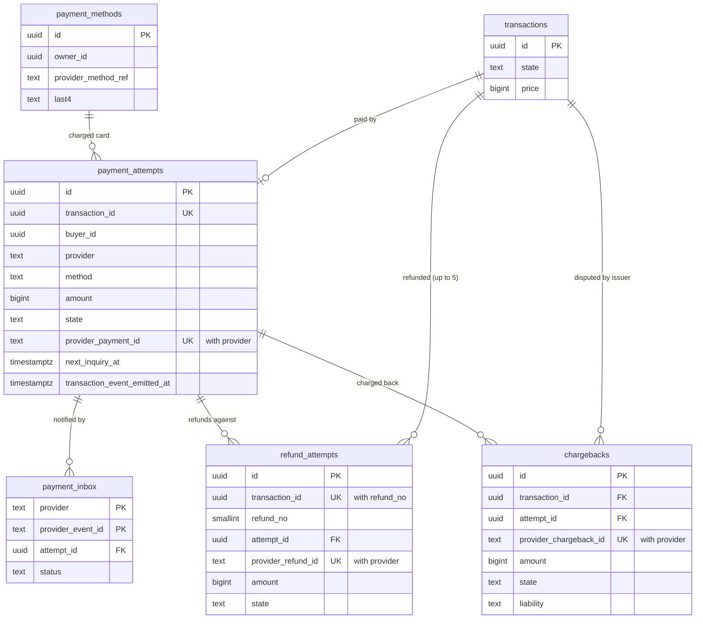

# Data model: 決済

支払いの試行、Webhook の inbox、保存したカード、返金、チャージバック。振る舞いは [payments-and-escrow.md](../payments-and-escrow.md)、方針は [ADR-0005](../../decisions/0005-payments-via-providers-and-capture-at-purchase.md)・[ADR-0030](../../decisions/0030-payment-attempt-states-and-outcome-normalization.md)・[ADR-0031](../../decisions/0031-konbini-pending-payments-and-late-payments.md)・[ADR-0032](../../decisions/0032-chargeback-accounting-and-liability.md)。規約は [data-model.md](../data-model.md) の 3 節。

- どの表も core のクラスタにあり、`payments` のサービスだけが書く。
- カード番号・セキュリティコードの列はない。持つのは提供者の参照、ブランド、下 4 桁、有効期限の月と年だけ（ADR-0005）。
- お金の正本は ledger の仕訳。ここは提供者との約束と結果の記録で、仕訳との対応は 3 段の照合で確かめる（[ledger-and-proceeds.md](ledger-and-proceeds.md)）。

## 1. ER 図

- `payment_inbox` の `attempt_id` は、照会で試行に結べた後に入る（NULL を許す）。
- `refund_attempts` の `attempt_id` は、期限の後の入金の返金（`orphan`）でも元の試行を指す。

## 2. 表

### 2.1 `payment_attempts`

支払いの試行。提供者を呼ぶ前にコミットし、ID を提供者への参照の番号にする。定義元：[payments-and-escrow.md](../payments-and-escrow.md) の 5・6・8 節。

| 列 | 型 | NULL | 既定 | 説明 |
| --- | --- | --- | --- | --- |
| `id` | `uuid` | NOT NULL | `uuidv7()` | 提供者への参照の番号 |
| `transaction_id` | `uuid` | NOT NULL | — | |
| `buyer_id` | `uuid` | NOT NULL | — | RLS（買い手だけ） |
| `provider` | `text` | NOT NULL | — | 提供者のコード |
| `method` | `text` | NOT NULL | — | `card`・`konbini` |
| `payment_method_id` | `uuid` | NULL | — | 保存したカードで払ったとき |
| `amount` | `bigint` | NOT NULL | — | 提供者に依頼した額（代金 ＋ 支払いの手数料 − 残高で払う額） |
| `state` | `text` | NOT NULL | `'created'` | `created`・`submitted`・`requires_action`・`awaiting_payment`・`unknown`・`succeeded`・`failed`・`voided`・`expired` |
| `outcome` | `text` | NULL | — | 最後の正規の結果（DT-PAY-001。`mismatch` を含む） |
| `dt_pay_row` | `smallint` | NULL | — | 当てた DT-PAY-001 の行 |
| `provider_payment_id` | `text` | NULL | — | |
| `konbini_type` | `text` | NULL | — | コンビニの種類 |
| `konbini_ref` | `text` | NULL | — | 支払いの番号・払込票の参照（買い手に見せる値） |
| `provider_expires_at` | `timestamptz` | NULL | — | 提供者の期限（`payment_due_at` 以前） |
| `decline_code` | `text` | NULL | — | `insufficient_funds`・`card_declined`・`authentication_failed`・`expired_card`・`fraud_suspected`・`other` |
| `orphan` | `boolean` | NOT NULL | `false` | 番号の取り消しの後の入金（全額を返す） |
| `next_inquiry_at` | `timestamptz` | NULL | — | 照会の予定（5 秒、30 秒、2 分、5 分、30 分ごとに 24 時間） |
| `inquiry_count` | `smallint` | NOT NULL | `0` | |
| `submitted_at` | `timestamptz` | NULL | — | |
| `finished_at` | `timestamptz` | NULL | — | 終わった状態に着いた時刻 |
| `transaction_event_emitted_at` | `timestamptz` | NULL | — | `payment_succeeded`・`payment_failed` を出した時刻（1 回だけ） |
| `created_at` | `timestamptz` | NOT NULL | `now()` | |
| `updated_at` | `timestamptz` | NOT NULL | `now()` | |

- キー：PK `(id)`。UK `(transaction_id)` — 提供者の冪等キー `<transaction_id>:capture` と同じく、1 取引 1 試行（D-17）。部分 UK `(provider, provider_payment_id) WHERE provider_payment_id IS NOT NULL`。
- 索引：`(next_inquiry_at) WHERE next_inquiry_at IS NOT NULL` — 照会の予定。`(state, updated_at) WHERE state = 'unknown'` — 24 時間の呼び出し。`(buyer_id, created_at)` — 買い手の履歴と、未払いのコンビニ払いの数え（取引の側でも数える）。
- CHECK：`method IN ('card','konbini')`。`state IN (...)`。`amount > 0`。`method <> 'konbini' OR payment_method_id IS NULL`。`(state IN ('succeeded','failed','voided','expired')) = (finished_at IS NOT NULL)`。
- 状態の更新：`UPDATE … WHERE id = $1 AND state = $from`（条件つき）。終わった状態から動かさない（トリガーで拒む）。
- RLS：買い手だけ（`buyer_id = app.actor_id`）。売り手には見せない。サービスの役割：`payments`、照合。
- 区分：P（金額は F）。保持：10 年（お金の記録）。S1 の量：1 日 9 万行（残高だけの取引を除く見込み）。

### 2.2 `payment_inbox`

提供者の Webhook の inbox。中身を信じず、照会の結果で試行を進める。定義元：同 6 節。

| 列 | 型 | NULL | 既定 | 説明 |
| --- | --- | --- | --- | --- |
| `provider` | `text` | NOT NULL | — | |
| `provider_event_id` | `text` | NOT NULL | — | |
| `event_type` | `text` | NOT NULL | — | 正規の事象の種類 |
| `reference` | `text` | NULL | — | 本文の参照の番号（試行の ID） |
| `attempt_id` | `uuid` | NULL | — | 照会で結べた試行 |
| `status` | `text` | NOT NULL | `'pending'` | `pending`・`processed`・`unmatched` |
| `received_at` | `timestamptz` | NOT NULL | `now()` | |
| `processed_at` | `timestamptz` | NULL | — | |
| `s3_key` | `text` | NOT NULL | — | 署名を確かめた本文（`records` の `payments/inbox/…`） |

- キー：PK `(provider, provider_event_id)`（重複を除く。`INSERT … ON CONFLICT DO NOTHING`）。
- 索引：`(status, received_at) WHERE status = 'pending'` — 処理のジョブ（`FOR UPDATE SKIP LOCKED`）と 2 分の遅れの警告。
- 分割しない（日をまたぐ重複を除くため）。
- RLS：なし（`payments` の役割）。区分：M（本文は S3）。保持：13 か月。S1 の量：1 日 30 万行。

### 2.3 `payment_methods`

保存したカード（本人だけ）。定義元：同 7 節。

| 列 | 型 | NULL | 既定 | 説明 |
| --- | --- | --- | --- | --- |
| `id` | `uuid` | NOT NULL | `uuidv7()` | |
| `owner_id` | `uuid` | NOT NULL | — | |
| `provider` | `text` | NOT NULL | — | |
| `provider_customer_ref` | `text` | NOT NULL | — | |
| `provider_method_ref` | `text` | NOT NULL | — | |
| `brand` | `text` | NULL | — | 表示用 |
| `last4` | `char(4)` | NULL | — | 表示用 |
| `exp_month` | `smallint` | NULL | — | |
| `exp_year` | `smallint` | NULL | — | |
| `method_fingerprint_hmac` | `bytea` | NULL | — | 提供者の手段の識別子の HMAC（評価の兆し `rating_link_payment`） |
| `created_at` | `timestamptz` | NOT NULL | `now()` | |
| `disabled_at` | `timestamptz` | NULL | — | |

- キー：PK `(id)`。UK `(provider, provider_method_ref)`。
- 索引：`(owner_id, id)` — 一覧。`(method_fingerprint_hmac)` — 兆しの比べ（T&S の役割）。
- CHECK：`exp_month BETWEEN 1 AND 12`。`last4 ~ '^[0-9]{4}$'`。
- RLS：本人。区分：O。保持：消されるか退会まで。S1 の量：200 万行。

### 2.4 `refund_attempts`

提供者への返金の依頼。台帳の refund・settle の仕訳の後に、`ledger.refund_due` から作る。定義元：同 9 節。

| 列 | 型 | NULL | 既定 | 説明 |
| --- | --- | --- | --- | --- |
| `id` | `uuid` | NOT NULL | `uuidv7()` | |
| `transaction_id` | `uuid` | NOT NULL | — | |
| `refund_no` | `smallint` | NOT NULL | — | 1〜5。冪等キー `<transaction_id>:refund:<n>` |
| `attempt_id` | `uuid` | NOT NULL | — | 返す元の試行 |
| `provider` | `text` | NOT NULL | — | 試行の提供者の写し |
| `kind` | `text` | NOT NULL | — | `full`・`partial`・`orphan` |
| `amount` | `bigint` | NOT NULL | — | |
| `source_journal_id` | `uuid` | NOT NULL | — | 依頼のもとの仕訳（ledger。論理の参照） |
| `state` | `text` | NOT NULL | `'requested'` | `requested`・`submitted`・`unknown`・`succeeded`・`failed` |
| `provider_refund_id` | `text` | NULL | — | |
| `failure_code` | `text` | NULL | — | |
| `next_inquiry_at` | `timestamptz` | NULL | — | |
| `created_at` | `timestamptz` | NOT NULL | `now()` | |
| `finished_at` | `timestamptz` | NULL | — | |

- キー：PK `(id)`。UK `(transaction_id, refund_no)`。部分 UK `(provider, provider_refund_id) WHERE provider_refund_id IS NOT NULL`。UK `(source_journal_id)` — 1 つの仕訳から依頼は 1 つ。
- 索引：`(next_inquiry_at) WHERE next_inquiry_at IS NOT NULL`。`(state) WHERE state = 'failed'` — `refund_failed` の待ち行列。
- CHECK：`refund_no BETWEEN 1 AND 5`。`amount > 0`。`kind IN (...)`。
- RLS：なし（`payments` の役割。買い手には取引の画面の状態として出す）。区分：F。保持：10 年。S1 の量：1 日 3,000 行（見込み）。

### 2.5 `chargebacks`

チャージバック（[ADR-0032](../../decisions/0032-chargeback-accounting-and-liability.md)）。定義元：同 10 節。

| 列 | 型 | NULL | 既定 | 説明 |
| --- | --- | --- | --- | --- |
| `id` | `uuid` | NOT NULL | `uuidv7()` | |
| `transaction_id` | `uuid` | NOT NULL | — | |
| `attempt_id` | `uuid` | NOT NULL | — | |
| `provider` | `text` | NOT NULL | — | |
| `provider_chargeback_id` | `text` | NOT NULL | — | |
| `reason_kind` | `text` | NOT NULL | — | `fraud`・`not_received`・`not_as_described`・`other` |
| `amount` | `bigint` | NOT NULL | — | |
| `state` | `text` | NOT NULL | `'open'` | `open`・`evidence_submitted`・`won`・`lost`・`accepted` |
| `opened_after_completion` | `boolean` | NOT NULL | — | 開始の時に取引が `completed` だったか |
| `evidence_due_at` | `timestamptz` | NOT NULL | — | 提供者の期限の 2 営業日前 |
| `dt_cb_row` | `smallint` | NULL | — | 負けたときに当てた DT-CB-001 の行 |
| `liability` | `text` | NULL | — | `seller`・`platform` |
| `case_id` | `uuid` | NULL | — | 紛争の案件（content。論理の参照） |
| `opened_at` | `timestamptz` | NOT NULL | `now()` | |
| `closed_at` | `timestamptz` | NULL | — | |

- キー：PK `(id)`。UK `(provider, provider_chargeback_id)`。
- 索引：`(transaction_id)`。`(state, evidence_due_at) WHERE state IN ('open','evidence_submitted')` — 反証の締めの知らせと照合 I5。
- CHECK：`amount > 0`。`state NOT IN ('lost','accepted') OR liability IS NOT NULL OR NOT opened_after_completion`。`dt_cb_row BETWEEN 1 AND 9`。
- RLS：なし（`payments`・`ops-api` の役割）。区分：F。保持：10 年。S1 の量：月 300 行（見込み）。

## 3. 外の置き場所

- S3：`records` の `payments/inbox/<provider>/<yyyy>/<mm>/<dd>/<event_id>.json`（[stores.md](stores.md) の 3 節）。
- outbox の話題：`payment.succeeded`、`payment.failed`、`payment.orphan_received`、`refund.completed`、`refund.failed`、`chargeback.opened`、`chargeback.closed`。
- Valkey：提供者ごとの遮断器 `psp:cb:{provider}:{method}`（[stores.md](stores.md) の 1 節）。
