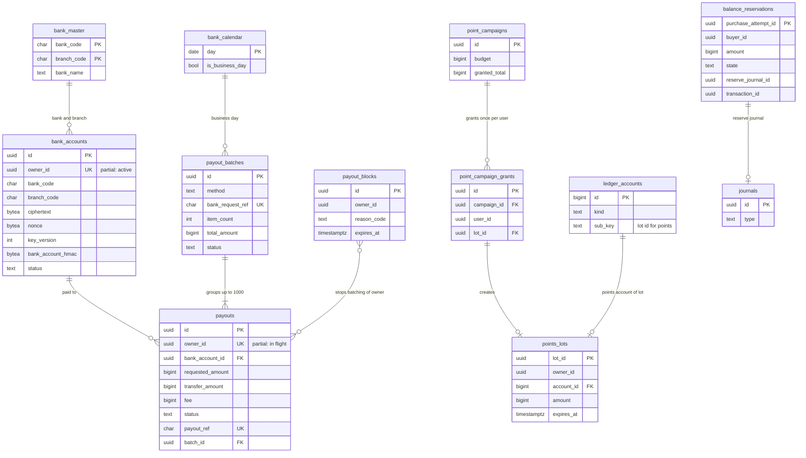

# Data model: 振込とポイント

振込先の口座、金融機関の一覧、銀行の営業日、振込の申請、まとめ、振込の止め、ポイントのロット、キャンペーン、付与、残高の引き当て。振る舞いは [payouts-and-points.md](../payouts-and-points.md)、方針は [ADR-0038](../../decisions/0038-payout-batching-execution-and-failure-handling.md)・[ADR-0039](../../decisions/0039-points-as-separate-lot-accounts.md)・[ADR-0040](../../decisions/0040-balance-spend-order-and-reservation.md)・[ADR-0067](../../decisions/0067-account-takeover-step-up-and-payout-holds.md)。規約は [data-model.md](../data-model.md) の 3 節。

- どの表も ledger のクラスタにあり、`payouts` のサービス（口座・振込・ポイント）と `ledger`（引き当て）が書く。
- お金の動きは仕訳（[ledger-and-proceeds.md](ledger-and-proceeds.md) の型 2・6・7・16〜18・21〜24）。ここの表は約束・状態・参照を持つ。
- 口座の番号と名義は封筒の暗号化の列（`vault = 'bank'`、`kms-vault-bank`）。復号は `payouts` の役割だけ（[ADR-0069](../../decisions/0069-key-layout-and-vault-envelope-encryption.md)）。

## 1. ER 図

- `payout_blocks }o--o{ payouts` は「同じ持ち主の振込をまとめに入れない」意味の線で、外部キーはない。
- `ledger_accounts ||--o| points_lots`：ポイントはロットごとの口座（`kind = 'points'`、`sub_key` = ロットの ID）。ロットの残りは口座の残高（ADR-0039）。ほかの種類の口座はロットを持たない。
- 補償で作ったロットは `point_campaign_grants` を持たない（`grant_reason = 'compensation'`）。付与の行の `lot_id` は付与の仕訳の後に入る。

## 2. 表

### 2.1 `bank_accounts`

振込先の口座（本人だけ）。定義元：[payouts-and-points.md](../payouts-and-points.md) の 4 節。

| 列 | 型 | NULL | 既定 | 説明 |
| --- | --- | --- | --- | --- |
| `id` | `uuid` | NOT NULL | `uuidv7()` | |
| `owner_id` | `uuid` | NOT NULL | — | |
| `bank_code` | `char(4)` | NOT NULL | — | |
| `branch_code` | `char(3)` | NOT NULL | — | |
| `account_type` | `text` | NOT NULL | — | `ordinary`・`current`・`savings` |
| `ciphertext` | `bytea` | NOT NULL | — | 口座番号（7 桁）と名義（カナ）の暗号文 |
| `nonce` | `bytea` | NOT NULL | — | 96 ビット |
| `key_version` | `integer` | NOT NULL | — | `vault_keys`（ledger、`vault = 'bank'`） |
| `aad_version` | `smallint` | NOT NULL | `1` | 追加の認証データの列の組のバージョン |
| `last4` | `char(4)` | NOT NULL | — | 画面の表示 |
| `bank_account_hmac` | `bytea` | NOT NULL | — | 金融機関・支店・番号の HMAC（同じ口座の多くのアカウント） |
| `status` | `text` | NOT NULL | `'active'` | `active`・`unusable`・`replaced` |
| `unusable_reason` | `text` | NULL | — | `account_closed`・`no_account`・`invalid_account_number`・`name_mismatch`・`invalid_account_type` |
| `registered_at` | `timestamptz` | NOT NULL | `now()` | 72 時間の待ちの起点（`account_holds` は core） |
| `replaced_at` | `timestamptz` | NULL | — | |

- キー：PK `(id)`。部分 UK `(owner_id) WHERE status = 'active'` — 1 人 1 口座（MVP）。
- 索引：`(owner_id, id)`。`(bank_account_hmac)` — 同じ口座の数え（T&S の兆し）。
- CHECK：`bank_code ~ '^[0-9]{4}$'`。`branch_code ~ '^[0-9]{3}$'`。`(status = 'unusable') = (unusable_reason IS NOT NULL)`。
- RLS：本人（読みは下 4 桁と金融機関だけを返す API を通す）。全桁は `vault.reveal_bank`（2 人目の承認）だけ。
- 区分：V。保持：口座の削除・退会まで。退会で鍵（`vault_keys`）を破棄。S1 の量：300 万行。

### 2.2 `bank_master`

全銀の金融機関・支店の一覧（年 1 回以上取り込む）。

| 列 | 型 | NULL | 既定 | 説明 |
| --- | --- | --- | --- | --- |
| `bank_code` | `char(4)` | NOT NULL | — | |
| `branch_code` | `char(3)` | NOT NULL | — | |
| `bank_name` | `text` | NOT NULL | — | |
| `bank_name_kana` | `text` | NOT NULL | — | |
| `branch_name` | `text` | NOT NULL | — | |
| `branch_name_kana` | `text` | NOT NULL | — | |
| `valid_to` | `date` | NULL | — | 廃止の日 |

- キー：PK `(bank_code, branch_code)`。RLS：なし（設定）。区分：U。S1 の量：3 万行。

### 2.3 `bank_calendar`

銀行の営業日（土日、祝日、12 月 31 日〜1 月 3 日）。

| 列 | 型 | NULL | 既定 | 説明 |
| --- | --- | --- | --- | --- |
| `day` | `date` | NOT NULL | — | |
| `is_business_day` | `boolean` | NOT NULL | — | |
| `note` | `text` | NULL | — | |

- キー：PK `(day)`。名前：領域の文書の `date` を `day` にした（D-13）。RLS：なし（設定）。区分：U。

### 2.4 `payouts`

振込の申請（本人だけ）。定義元：同 5・6 節。

| 列 | 型 | NULL | 既定 | 説明 |
| --- | --- | --- | --- | --- |
| `id` | `uuid` | NOT NULL | `uuidv7()` | |
| `owner_id` | `uuid` | NOT NULL | — | |
| `bank_account_id` | `uuid` | NOT NULL | — | |
| `reason` | `text` | NOT NULL | `'user'` | `user`・`expiry_auto_payout` |
| `requested_amount` | `bigint` | NOT NULL | — | 201 円以上 |
| `fee` | `bigint` | NOT NULL | — | 手数料の表のバージョンの値（200） |
| `transfer_amount` | `bigint` | NOT NULL | — | `requested_amount − fee` |
| `fee_table_version` | `integer` | NOT NULL | — | |
| `status` | `text` | NOT NULL | `'requested'` | `requested`・`cancelled`・`batched`・`submitted`・`unknown`・`accepted`・`settled`・`failed`・`returned` |
| `payout_ref` | `char(20)` | NOT NULL | — | `PO` ＋ 日付 6 桁 ＋ 連番 12 桁（EDI 情報） |
| `batch_id` | `uuid` | NULL | — | |
| `failure_code` | `text` | NULL | — | 銀行の不能の理由のコード |
| `returned_amount` | `bigint` | NULL | — | 組戻し・資金返却の額 |
| `request_journal_id` | `uuid` | NOT NULL | — | `payout_request` |
| `final_journal_id` | `uuid` | NULL | — | `payout_settled`・`payout_failed`・`payout_returned` |
| `requested_at` | `timestamptz` | NOT NULL | `now()` | |
| `batched_at` | `timestamptz` | NULL | — | |
| `settled_at` | `timestamptz` | NULL | — | |
| `failed_at` | `timestamptz` | NULL | — | |
| `returned_at` | `timestamptz` | NULL | — | |
| `updated_at` | `timestamptz` | NOT NULL | `now()` | |

- キー：PK `(id)`。UK `(payout_ref)`。部分 UK `(owner_id) WHERE status IN ('requested','batched','submitted','unknown','accepted')` — 1 人の同時の申請は 1 件。
- 索引：`(status, requested_at) WHERE status = 'requested'` — `payout-batcher`（営業日の 08:30〜14:30、30 分ごと）。`(batch_id)`。`(owner_id, requested_at DESC)` — 本人の履歴。`(requested_at) WHERE status = 'requested'` — 7 日を超えて止まった申請の知らせ。
- CHECK：`requested_amount >= 201`。`transfer_amount = requested_amount - fee`。`transfer_amount >= 1`。`status IN (...)`。`status <> 'returned' OR returned_amount IS NOT NULL`。
- 状態：条件つきの更新（`WHERE status = $from`）で進め、終わった状態から動かさない。
- RLS：本人（読みだけ。申請は API）。区分：F。保持：10 年。S1 の量：1 日 3 万行（見込み）。

### 2.5 `payout_batches`

まとめと銀行への依頼。定義元：同 6 節。

| 列 | 型 | NULL | 既定 | 説明 |
| --- | --- | --- | --- | --- |
| `id` | `uuid` | NOT NULL | `uuidv7()` | |
| `source_account` | `text` | NOT NULL | — | 払出口座のコード（`bank_operating` の `sub_key`） |
| `method` | `text` | NOT NULL | — | `api`・`zengin_file` |
| `bank_request_ref` | `char(20)` | NOT NULL | — | 依頼の番号。依頼の前に保存し、再送も同じ |
| `item_count` | `integer` | NOT NULL | — | 1,000 まで |
| `total_amount` | `bigint` | NOT NULL | — | 振り込む額の合計 |
| `status` | `text` | NOT NULL | `'created'` | `created`・`submitted`・`unknown`・`accepted`・`completed`・`rejected` |
| `file_s3_key` | `text` | NULL | — | 全銀の形式のファイル（`records` の `payouts/zengin/…`） |
| `file_sha256` | `bytea` | NULL | — | |
| `handed_over_by` | `uuid` | NULL | — | ファイルを渡した人 |
| `handed_over_at` | `timestamptz` | NULL | — | |
| `approved_by` | `uuid` | NULL | — | ファイルへの切り替えの Ops の承認 |
| `created_at` | `timestamptz` | NOT NULL | `now()` | |
| `submitted_at` | `timestamptz` | NULL | — | |
| `last_inquiry_at` | `timestamptz` | NULL | — | 30 分ごとの結果の照会 |

- キー：PK `(id)`。UK `(bank_request_ref)`。索引：`(status, created_at) WHERE status IN ('submitted','unknown','accepted')` — 結果の照会。
- CHECK：`item_count BETWEEN 1 AND 1000`。`method <> 'zengin_file' OR approved_by IS NOT NULL`。`(method = 'zengin_file') = (file_s3_key IS NOT NULL)`（ファイルを書いた後）。
- RLS：なし（`payouts` の役割、財務）。区分：F。保持：10 年。S1 の量：1 日 30 行。

### 2.6 `payout_blocks`

T&S・運用の判断による振込の止め（ADR-0067 の決まった待ちとは別）。定義元：同 10 節。

| 列 | 型 | NULL | 既定 | 説明 |
| --- | --- | --- | --- | --- |
| `id` | `uuid` | NOT NULL | `uuidv7()` | |
| `owner_id` | `uuid` | NOT NULL | — | |
| `reason_code` | `text` | NOT NULL | — | |
| `issued_by_kind` | `text` | NOT NULL | — | `rule`・`operator` |
| `issued_by` | `uuid` | NULL | — | |
| `moderation_action_id` | `uuid` | NULL | — | content の措置（論理の参照） |
| `case_id` | `uuid` | NULL | — | |
| `expires_at` | `timestamptz` | NULL | — | |
| `lifted_at` | `timestamptz` | NULL | — | |
| `lifted_by` | `uuid` | NULL | — | |
| `created_at` | `timestamptz` | NOT NULL | `now()` | |

- キー：PK `(id)`。索引：`(owner_id, id)`。`(owner_id) WHERE lifted_at IS NULL` — まとめの前の確かめ。
- RLS：なし（本人には「確認中」とだけ出す）。区分：F。保持：10 年。

### 2.7 `points_lots`

ポイントのロット（本人だけ）。ロットごとに `points` の口座を 1 つ持つ（ADR-0039）。定義元：同 8 節。

| 列 | 型 | NULL | 既定 | 説明 |
| --- | --- | --- | --- | --- |
| `lot_id` | `uuid` | NOT NULL | `uuidv7()` | 口座の `sub_key` |
| `owner_id` | `uuid` | NOT NULL | — | |
| `account_id` | `bigint` | NOT NULL | — | → `ledger_accounts(id)` |
| `grant_reason` | `text` | NOT NULL | — | `campaign`・`compensation` |
| `campaign_id` | `uuid` | NULL | — | |
| `case_id` | `uuid` | NULL | — | 補償の案件 |
| `amount` | `bigint` | NOT NULL | — | 付与の額 |
| `expires_at` | `timestamptz` | NULL | — | 既定 180 日（キャンペーンの規則） |
| `expiry_extended_at` | `timestamptz` | NULL | — | 返金の戻しで 30 日に延ばした時刻 |
| `source_journal_id` | `uuid` | NOT NULL | — | `points_grant`・`compensation` |
| `created_at` | `timestamptz` | NOT NULL | `now()` | |

- キー：PK `(lot_id)`。UK `(account_id)`。
- 索引：`(owner_id, expires_at NULLS LAST)` — 使用の順（期限の近い順）。`(expires_at)` — 失効のジョブ（`legal.points_expiry_enabled` のときだけ、毎日 00:20）。
- CHECK：`amount > 0`。`(grant_reason = 'campaign') = (campaign_id IS NOT NULL)`。`(grant_reason = 'compensation') = (case_id IS NOT NULL)`。
- 期限の延長：`expires_at` だけを更新する（仕訳は変えない。PROP-PAYOUT-005）。
- RLS：本人は読みだけ。区分：F。保持：10 年。S1 の量：1,000 万行（見込み）。

### 2.8 `point_campaigns`

キャンペーン（PM・財務の承認）。

| 列 | 型 | NULL | 既定 | 説明 |
| --- | --- | --- | --- | --- |
| `id` | `uuid` | NOT NULL | `uuidv7()` | |
| `name` | `text` | NOT NULL | — | |
| `budget` | `bigint` | NOT NULL | — | |
| `granted_total` | `bigint` | NOT NULL | `0` | 付与の済んだ合計 |
| `grant_rule` | `jsonb` | NOT NULL | — | 対象と額の規則（上限は L4） |
| `lot_expiry_days` | `integer` | NULL | — | |
| `state` | `text` | NOT NULL | `'draft'` | `draft`・`approved`・`running`・`closed` |
| `approved_by` | `uuid[]` | NULL | — | PM と財務 |
| `starts_at` | `timestamptz` | NOT NULL | — | |
| `ends_at` | `timestamptz` | NOT NULL | — | |

- キー：PK `(id)`。CHECK：`granted_total <= budget`。`state NOT IN ('approved','running') OR cardinality(approved_by) >= 2`。
- RLS：なし。区分：F。保持：10 年。

### 2.9 `point_campaign_grants`

キャンペーンの付与。1 キャンペーン・1 利用者に 1 回。冪等キー `(campaign_grant, <id>, grant)` の `<id>`。領域の文書になかった表（D-14）。

| 列 | 型 | NULL | 既定 | 説明 |
| --- | --- | --- | --- | --- |
| `id` | `uuid` | NOT NULL | `uuidv7()` | |
| `campaign_id` | `uuid` | NOT NULL | — | |
| `user_id` | `uuid` | NOT NULL | — | |
| `amount` | `bigint` | NOT NULL | — | |
| `lot_id` | `uuid` | NULL | — | 付与の仕訳の後に入る |
| `created_at` | `timestamptz` | NOT NULL | `now()` | |

- キー：PK `(id)`。UK `(campaign_id, user_id)`。FK `campaign_id`、`lot_id`。
- 付与のジョブは 1,000 件ずつ、`point_campaigns` を `FOR UPDATE` で取って予算を確かめる。
- RLS：なし。区分：F。保持：10 年。

### 2.10 `balance_reservations`

購入の前の残高の引き当て（ADR-0040）。勝った試行だけが作る（ADR-0026）。

| 列 | 型 | NULL | 既定 | 説明 |
| --- | --- | --- | --- | --- |
| `purchase_attempt_id` | `uuid` | NOT NULL | — | 購入の要求の `Idempotency-Key` |
| `buyer_id` | `uuid` | NOT NULL | — | |
| `amount` | `bigint` | NOT NULL | — | 引き当ての合計 |
| `points_amount` | `bigint` | NOT NULL | `0` | |
| `proceeds_amount` | `bigint` | NOT NULL | `0` | 売上金のロットから |
| `balance_amount` | `bigint` | NOT NULL | `0` | `user_balance` から |
| `state` | `text` | NOT NULL | `'reserved'` | `reserved`・`held`・`released` |
| `reserve_journal_id` | `uuid` | NOT NULL | — | `reserve` |
| `transaction_id` | `uuid` | NULL | — | 取引に結べたら |
| `hold_journal_id` | `uuid` | NULL | — | `hold_balance` |
| `release_journal_id` | `uuid` | NULL | — | `reserve_release` |
| `created_at` | `timestamptz` | NOT NULL | `now()` | |

- キー：PK `(purchase_attempt_id)`。部分 UK `(transaction_id) WHERE transaction_id IS NOT NULL`。
- 索引：`(created_at) WHERE state = 'reserved'` — 照合 T5（15 分の孤立を `reserve_release` で戻す）。
- CHECK：`amount = points_amount + proceeds_amount + balance_amount`。`amount > 0`。`(state = 'held') = (hold_journal_id IS NOT NULL)`。`(state = 'released') = (release_journal_id IS NOT NULL)`。
- 引き当ての中身（どのロット・口座から幾ら）は `reserve` の仕訳の行と `proceeds_lot_consumptions` が正本。
- RLS：なし（`ledger` の役割）。区分：F。保持：10 年。S1 の量：1 日 2 万行（見込み）。

## 3. 外の置き場所

- S3：`records` の `payouts/zengin/<yyyy>/<mm>/<dd>/<batch_id>.txt`（[stores.md](stores.md) の 3・8 節）。
- outbox の話題：`payout.requested`、`payout.settled`、`payout.failed`、`payout.returned`、`points.granted`、`points.expiring`。
- AppConfig：`ops.payouts_enabled`、`legal.payout_limit_yen.{level}`、`legal.payout_monthly_limit_yen.{level}`、`legal.points_expiry_enabled`、`legal.balance_spend_limit_yen.{level}`、`legal.minor_payout_limit_yen`。
