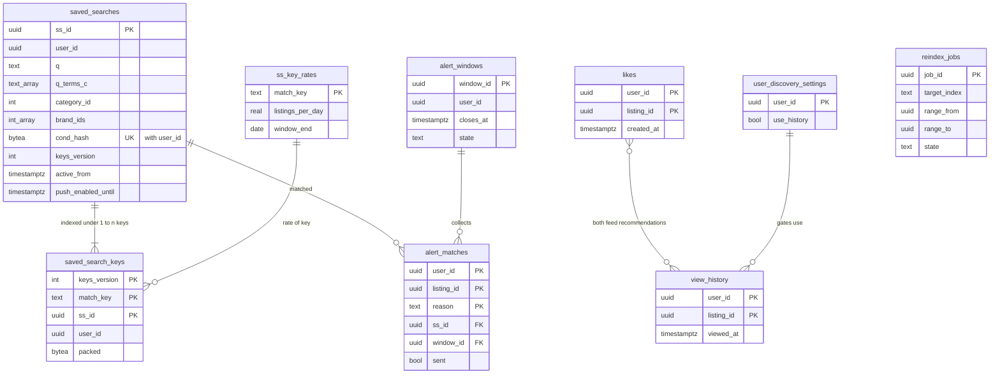

# Data model: 検索・いいね・保存した検索

索引の作り直し、いいね、閲覧の履歴、発見の設定、保存した検索、照合の鍵（逆索引の正本）、鍵の流量、一致、まとめの窓。振る舞いは [search-and-discovery.md](../search-and-discovery.md) と [saved-searches-and-alerts.md](../saved-searches-and-alerts.md)、方針は [ADR-0008](../../decisions/0008-search-engine-and-index.md)・[ADR-0018](../../decisions/0018-search-index-layout-and-japanese-analysis.md)・[ADR-0019](../../decisions/0019-ranking-formula-v1.md)・[ADR-0020](../../decisions/0020-likes-history-and-rule-recommendations.md)・[ADR-0022](../../decisions/0022-saved-search-match-keys-and-inverted-index.md)・[ADR-0023](../../decisions/0023-saved-search-alert-windows-and-caps.md)。規約は [data-model.md](../data-model.md) の 3 節。

- `reindex_jobs` は core、他は content のクラスタ。
- 検索の索引（`listings_v<n>`）、逆索引の写し（`ss:*`）、おすすめのキャッシュは Aurora の外（[stores.md](stores.md) の 1・6・7 節）。正本は core の `listings` と content の `saved_searches`・`saved_search_keys`。
- S2 で content を分けるとき、`likes`・`view_history`・`user_discovery_settings` は `content-social`、保存した検索の 5 表は `content-notify` へ移る（[ADR-0074](../../decisions/0074-stage-up-criteria-and-split-plan.md)）。

## 1. ER 図

- `ss_key_rates ||--o{ saved_search_keys` は鍵の名前が同じ行の意味の線で、外部キーはない（流量は見込みで、鍵の選び方にだけ使う）。
- `likes }o--o{ view_history` は、両方がおすすめの入力になる意味の線（どちらも利用者と出品の組）。
- `likes`・`view_history`・`alert_matches` の `listing_id` は core の `listings` への論理の参照。

## 2. 表

### 2.1 `reindex_jobs`（core）

索引の作り直しの範囲ごとの印。定義元：[search-and-discovery.md](../search-and-discovery.md) の 4.5 節。

| 列 | 型 | NULL | 既定 | 説明 |
| --- | --- | --- | --- | --- |
| `job_id` | `uuid` | NOT NULL | `uuidv7()` | |
| `target_index` | `text` | NOT NULL | — | `listings_v<n>` |
| `range_from` | `uuid` | NOT NULL | — | `listing_id` の範囲（含む） |
| `range_to` | `uuid` | NOT NULL | — | 同（含まない） |
| `state` | `text` | NOT NULL | `'pending'` | `pending`・`running`・`done`・`failed` |
| `doc_count` | `bigint` | NOT NULL | `0` | 入れた件数 |
| `created_at` | `timestamptz` | NOT NULL | `now()` | |
| `finished_at` | `timestamptz` | NULL | — | |

- キー：PK `(job_id)`。UK `(target_index, range_from)`。索引：`(target_index, state)`。
- 名前：領域の文書の `count` を `doc_count` にした（D-13）。
- RLS：なし（`search-indexer` の役割）。区分：M。保持：作り直しの完了から 90 日。

### 2.2 `likes`

いいね（本人だけ）。定義元：[search-and-discovery.md](../search-and-discovery.md) の 7.1 節。

| 列 | 型 | NULL | 既定 | 説明 |
| --- | --- | --- | --- | --- |
| `user_id` | `uuid` | NOT NULL | — | |
| `listing_id` | `uuid` | NOT NULL | — | |
| `created_at` | `timestamptz` | NOT NULL | `now()` | |

- キー：PK `(user_id, listing_id)`。
- 索引：`(user_id, created_at DESC)` — いいねの一覧。`(listing_id, user_id)` — 値下げの fan-out（`notifier-fanout` が出品ごとに `user_id` の順で 1,000 件ずつ読む。[ADR-0064](../../decisions/0064-fanout-batching-quiet-hours-and-caps.md)）と、日次の数え直し。
- 上限：1 人 5,000（足す関数が数える）。
- RLS：本人。`notifier-fanout`・`like-counter` の役割は出品ごとに読む（許可リスト）。
- 区分：O。保持：消されるか退会まで。S1 の量：1.5 億行（MAU 1 人 50 件の見込み）。

### 2.3 `view_history`

閲覧の履歴（本人だけ）。1 人 200 件・90 日（ADR-0020）。

| 列 | 型 | NULL | 既定 | 説明 |
| --- | --- | --- | --- | --- |
| `user_id` | `uuid` | NOT NULL | — | |
| `listing_id` | `uuid` | NOT NULL | — | |
| `viewed_at` | `timestamptz` | NOT NULL | `now()` | 最後に見た時刻（同じ出品は上書き） |

- キー：PK `(user_id, listing_id)`。索引：`(user_id, viewed_at DESC)` — 直近 20 件、200 件を超えた古い行の削除。`(viewed_at)` — 90 日の掃除。
- 分割しない：同じ出品を上書きする主キーと、月の区切りは両立しないため（D-22）。`retention-sweeper` が 1 日 1 回、90 日を過ぎた行と 201 件目以降を消す。
- RLS：本人。`search-api`（おすすめ）の役割は `use_history = true` の利用者だけ読む。
- 区分：O。保持：90 日（ADR-0020。区分の既定 180 日より短い）。S1 の量：1.8 億行（1 人 60 件の見込み）。

### 2.4 `user_discovery_settings`

| 列 | 型 | NULL | 既定 | 説明 |
| --- | --- | --- | --- | --- |
| `user_id` | `uuid` | NOT NULL | — | |
| `use_history` | `boolean` | NOT NULL | `true` | 閲覧の履歴をおすすめに使うか（範囲は L5） |
| `updated_at` | `timestamptz` | NOT NULL | `now()` | |

- キー：PK `(user_id)`。行がなければ既定。RLS：本人。区分：O。

### 2.5 `saved_searches`

保存した検索の正本（本人だけ）。定義元：[saved-searches-and-alerts.md](../saved-searches-and-alerts.md) の 4 節。

| 列 | 型 | NULL | 既定 | 説明 |
| --- | --- | --- | --- | --- |
| `ss_id` | `uuid` | NOT NULL | `uuidv7()` | |
| `user_id` | `uuid` | NOT NULL | — | |
| `name` | `text` | NOT NULL | — | 自動の名前。利用者が変えてよい |
| `q` | `text` | NULL | — | 50 文字まで |
| `q_terms_c` | `text[]` | NOT NULL | `'{}'` | `ja_c` の語（8 語まで） |
| `q_terms_b` | `jsonb` | NOT NULL | `'[]'` | 各語の `ja_b` の分け方（語ごとの配列） |
| `category_id` | `integer` | NULL | — | 後継に写した ID |
| `brand_ids` | `integer[]` | NOT NULL | `'{}'` | `merged_into` で写した ID（5 つまで） |
| `price_min` | `bigint` | NULL | — | |
| `price_max` | `bigint` | NULL | — | |
| `conditions` | `text[]` | NOT NULL | `'{}'` | |
| `shipping_payer` | `text` | NULL | — | |
| `shipping_methods` | `text[]` | NOT NULL | `'{}'` | |
| `push_enabled` | `boolean` | NOT NULL | `true` | |
| `push_enabled_until` | `timestamptz` | NULL | — | 入れてから 30 日 |
| `cond_hash` | `bytea` | NOT NULL | — | 正規化した条件のハッシュ |
| `analyzer_version` | `text` | NOT NULL | — | 索引のスキーマの番号と辞書のバージョン |
| `chosen_keys` | `text[]` | NOT NULL | — | 選んだ照合の鍵（`cb:…`・`b:…`・`c:…`・`t:…`） |
| `keys_version` | `integer` | NOT NULL | `1` | `saved_search_keys` の今のバージョン |
| `active_from` | `timestamptz` | NULL | — | `ss-index-writer` が Valkey を直した時刻。NULL の間は「準備中」 |
| `created_at` | `timestamptz` | NOT NULL | `now()` | |
| `updated_at` | `timestamptz` | NOT NULL | `now()` | |

- キー：PK `(ss_id)`。UK `(user_id, cond_hash)`。
- 索引：`(user_id, created_at)` — 一覧と 30 件の上限。`(push_enabled_until) WHERE push_enabled` — 期限の 3 日前の知らせ。
- CHECK：`q IS NOT NULL OR category_id IS NOT NULL OR cardinality(brand_ids) > 0`（鍵が作れない検索を拒む）。`cardinality(brand_ids) <= 5`。`cardinality(q_terms_c) <= 8`。`price_min IS NULL OR price_max IS NULL OR price_min <= price_max`。`char_length(q) <= 50`。
- RLS：本人。`saved-search-matcher`・`ss-index-writer`・`alert-digester` の役割（許可リスト）。
- 区分：O。保持：消されるか退会まで。S1 の量：2,000 万行（1 行 600 バイトで 12 GB）。

### 2.6 `saved_search_keys`

逆索引の正本（サービスの役割だけ）。定義元：[saved-searches-and-alerts.md](../saved-searches-and-alerts.md) の 5.3 節。

| 列 | 型 | NULL | 既定 | 説明 |
| --- | --- | --- | --- | --- |
| `keys_version` | `integer` | NOT NULL | — | 解析器の切り替えで 1 上げる（7.3 節） |
| `match_key` | `text` | NOT NULL | — | `cb:{category_id}:{brand_id}`・`b:{brand_id}`・`c:{category_id}`・`t:{語}` |
| `ss_id` | `uuid` | NOT NULL | — | |
| `user_id` | `uuid` | NOT NULL | — | |
| `packed` | `bytea` | NOT NULL | — | MessagePack で詰めた条件（語は 64 ビットのハッシュ。[stores.md](stores.md) の 7 節） |
| `updated_at` | `timestamptz` | NOT NULL | `now()` | |

- キー：PK `(keys_version, match_key, ss_id)`。
- 索引：`(keys_version, ss_id)` — 保存した検索の変更・削除で古い鍵を消す。
- 名前：領域の文書の `key` は SQL の予約語なので `match_key` にした（D-13）。
- 書き込み：保存・変更・削除は content の 1 つのトランザクションで `saved_searches`・`saved_search_keys`・outbox（`saved_search.changed`）を書く。
- RLS：なし（`saved-search-matcher`・`ss-index-writer` の役割だけに GRANT）。区分：O。
- 保持：保存した検索と同じ。古い `keys_version` は切り替えの 1 日後に消す。S1 の量：2,600 万行（1 検索 1.3 鍵）。

### 2.7 `ss_key_rates`

鍵ごとの出品の流量の見込み（直近 7 日の平均、日次）。

| 列 | 型 | NULL | 既定 | 説明 |
| --- | --- | --- | --- | --- |
| `match_key` | `text` | NOT NULL | — | |
| `listings_per_day` | `real` | NOT NULL | — | |
| `window_end` | `date` | NOT NULL | — | |

- キー：PK `(match_key)`。日次で上書き。RLS：なし（`saved-search-matcher` の役割）。区分：M。
- S1 の量：語の鍵を含めて 300 万行前後（見込み）。

### 2.8 `alert_matches`

保存した検索の一致（上限で送らなかった分も全部）。定義元：同 5.4・6.4 節。

| 列 | 型 | NULL | 既定 | 説明 |
| --- | --- | --- | --- | --- |
| `user_id` | `uuid` | NOT NULL | — | |
| `listing_id` | `uuid` | NOT NULL | — | |
| `reason` | `text` | NOT NULL | — | `published`・`price_dropped` |
| `ss_id` | `uuid` | NOT NULL | — | 当たった保存した検索（複数なら最初の 1 つ） |
| `matched_at` | `timestamptz` | NOT NULL | `now()` | |
| `window_id` | `uuid` | NULL | — | 入れた窓。5 分を超えた遅い一致と 7 日の重複は NULL（一覧だけ） |
| `sent` | `boolean` | NOT NULL | `false` | プッシュの依頼に入ったか |
| `suppressed_reason` | `text` | NULL | — | `daily_cap`・`not_visible`・`not_on_sale`・`late`・`dup_7d`・`push_off` |

- キー：PK `(user_id, listing_id, reason)`（照合の冪等）。
- 索引：`(window_id) WHERE window_id IS NOT NULL` — 窓を閉じる時の読み出し。`(user_id, matched_at DESC)` — アプリの中の新着の一覧（7 日・500 件）とおすすめの候補 B。`(matched_at)` — 7 日の掃除と夜間の比べ（7.2 節）。
- 規則：同じ利用者と出品は 7 日に 1 回だけ窓に入れる（公開と値下げで別の行でも）。2 行目は `window_id = NULL`、`suppressed_reason = 'dup_7d'`。
- RLS：本人（読みだけ）。`saved-search-matcher`・`alert-digester` の役割。区分：O。
- 保持：7 日。分割しない（7 日の重複の判定に、日をまたぐ一意が要るため）。S1 の量：1 日 210 万行、置く行 1,500 万。

### 2.9 `alert_windows`

利用者ごとのまとめの窓（3 分）。定義元：同 6.1 節。

| 列 | 型 | NULL | 既定 | 説明 |
| --- | --- | --- | --- | --- |
| `window_id` | `uuid` | NOT NULL | `uuidv7()` | |
| `user_id` | `uuid` | NOT NULL | — | |
| `opens_at` | `timestamptz` | NOT NULL | `now()` | 最初の一致 |
| `closes_at` | `timestamptz` | NOT NULL | — | `opens_at` ＋ `ops.saved_search_digest_minutes` |
| `state` | `text` | NOT NULL | `'open'` | `open`・`sent`・`empty`・`capped` |
| `push_seq_day` | `smallint` | NULL | — | その日の何通目のプッシュか（20 通の上限の表示） |
| `closed_at` | `timestamptz` | NULL | — | |

- キー：PK `(window_id)`。部分 UK `(user_id) WHERE state = 'open'` — 開いた窓は 1 人 1 つ。
- 索引：`(closes_at) WHERE state = 'open'` — `alert-digester` が 10 秒ごとに `FOR UPDATE SKIP LOCKED` で拾う。
- CHECK：`closes_at > opens_at`。`push_seq_day BETWEEN 1 AND 20`。
- RLS：なし（`alert-digester` の役割）。区分：O。保持：7 日。S1 の量：1 日 84 万行。

## 3. 外の置き場所

- OpenSearch：`listings_v<n>`（別名 `listings`）の対応表、保存したスクリプト `ranking_v1`（[stores.md](stores.md) の 6 節）。
- Valkey：`vis:{listing_id}`、`rec:{user_id}`（10 分）、`sq:{hash}`（10 秒）、`ss:k:{key}:{shard}`・`ss:ks:{key}`・`ss:kv:{key}`・`ss:ready:{gen}`（[stores.md](stores.md) の 1・7 節）。
- SQS：`search-index`・`search-index-priority`・`saved-search-match`。outbox の話題：`like.added`・`like.removed`・`listing.viewed`・`saved_search.changed`・`alert.digest_requested`。
- AppConfig：`search.sold_retention_days`、`ops.search_degraded_mode`、`ops.saved_search_digest_minutes`、`alerts.max_push_per_day`。
