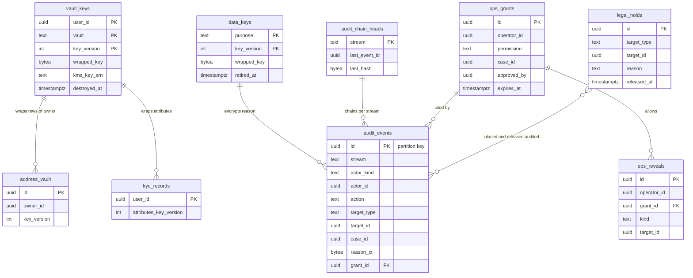

# Data model: 鍵・監査・データの寿命

利用者ごとの金庫の鍵、列の暗号のデータの鍵、監査の事象と鎖、保全の印、運用者の JIT の権限と見せた記録、保持と削除の規則。振る舞いは [security.md](../security.md)、方針は [ADR-0069](../../decisions/0069-key-layout-and-vault-envelope-encryption.md)・[ADR-0070](../../decisions/0070-operator-access-vault-reveal-and-audit.md)・[ADR-0071](../../decisions/0071-data-classes-and-lifecycle.md)・[ADR-0068](../../decisions/0068-account-deletion-and-minors.md)。規約は [data-model.md](../data-model.md) の 3.6・3.9 節。

- `vault_keys` は core（`address`・`identity_pii`・`kyc`）と ledger（`bank`）にある。`data_keys`・`audit_events`・`audit_chain_heads`・`legal_holds` は 3 つのクラスタのどれにもある。`ops_grants`・`ops_reveals` は core。
- 平文の利用者の鍵は持ち主のサービスのタスクのメモリーに 5 分・1 万件だけ。ディスク・Valkey に置かない。

## 1. ER 図

- `vault_keys` から金庫の行への線は、`(owner_id, vault, key_version)` で鍵を引く意味の線で、外部キーは張らない（鍵の行を消して暗号文を読めなくするため）。
- `legal_holds }o--o{ audit_events`：保全の付け外しは監査の事象に残る。

## 2. 表

### 2.1 `vault_keys`（core・ledger）

利用者ごと・金庫ごとの 256 ビットの鍵を KMS で包んだもの（ADR-0069）。定義元：[security.md](../security.md) の 5.3 節。

| 列 | 型 | NULL | 既定 | 説明 |
| --- | --- | --- | --- | --- |
| `user_id` | `uuid` | NOT NULL | — | |
| `vault` | `text` | NOT NULL | — | core：`address`・`identity_pii`・`kyc`。ledger：`bank` |
| `key_version` | `integer` | NOT NULL | — | 回すたびに 1 上げる |
| `wrapped_key` | `bytea` | NULL | — | 破棄で NULL |
| `kms_key_arn` | `text` | NOT NULL | — | `kms-vault-address`・`kms-identity-pii`・`kms-kyc`・`kms-vault-bank` |
| `created_at` | `timestamptz` | NOT NULL | `now()` | |
| `destroyed_at` | `timestamptz` | NULL | — | 退会・住所の削除で鍵を破棄した時刻 |

- キー：PK `(user_id, vault, key_version)`。CHECK：`(wrapped_key IS NULL) = (destroyed_at IS NOT NULL)`。core は `vault IN ('address','identity_pii','kyc')`、ledger は `vault = 'bank'`。
- 暗号化の文脈：`purpose`（`address-vault`・`identity-pii`・`kyc`・`bank-vault`）と `user_id`。鍵の政策が文脈を求める。
- `kyc` の金庫は領域の文書の「`kms-kyc` の鍵の封筒の暗号化」を、他の金庫と同じ形にしたもの（D-10）。
- RLS：本人の FORCE RLS（読めるのはサービスの役割の許可リスト：core は `shipping`（`address`）・`identity`（`identity_pii`・`kyc`）、ledger は `payouts`）。人の役割に GRANT しない。
- 区分：S。保持：鍵の行は破棄の印として残す（`wrapped_key` を NULL）。Aurora の自動のバックアップ（35 日）の後に完全に読めなくなる。
- S1 の量：core 2,500 万行、ledger 300 万行。

### 2.2 `data_keys`（各クラスタ）

利用者に結び付かない列の暗号のデータの鍵（T&S の証拠・保持の本文・権利者の連絡先・法令の申出者、監査の理由の自由文）。領域の文書になかった表（D-10・D-14）。

| 列 | 型 | NULL | 既定 | 説明 |
| --- | --- | --- | --- | --- |
| `purpose` | `text` | NOT NULL | — | content：`ts`。各クラスタ：`audit_reason` |
| `key_version` | `integer` | NOT NULL | — | 月ごとに回す |
| `wrapped_key` | `bytea` | NOT NULL | — | |
| `kms_key_arn` | `text` | NOT NULL | — | `ts` は T&S の鍵（README の 6 節の決定）、`audit_reason` は `kms-audit` |
| `created_at` | `timestamptz` | NOT NULL | `now()` | |
| `retired_at` | `timestamptz` | NULL | — | 新しい暗号化に使わない |

- キー：PK `(purpose, key_version)`。RLS：なし（`trust-safety`・`ops-api`・監査の照合の役割）。区分：S。保持：その鍵の暗号文が残る間。

### 2.3 `audit_events`（各クラスタ）

監査の事象。操作と同じトランザクションで、その表のあるクラスタに書く（ADR-0070）。定義元：[security.md](../security.md) の 6.4 節。

| 列 | 型 | NULL | 既定 | 説明 |
| --- | --- | --- | --- | --- |
| `id` | `uuid` | NOT NULL | `uuidv7()` | 分割の鍵 |
| `stream` | `text` | NOT NULL | — | `ops`・`reveal`・`grant`・`moderation`・`legal_config`・`ledger_manual`・`break_glass`・`vault_decrypt` |
| `actor_kind` | `text` | NOT NULL | — | `operator`・`service`・`user` |
| `actor_id` | `uuid` | NULL | — | |
| `service` | `text` | NULL | — | `app.service` |
| `action` | `text` | NOT NULL | — | `shipping.revealAddress`、`openAddress:create_shipment` など |
| `target_type` | `text` | NOT NULL | — | |
| `target_id` | `uuid` | NULL | — | |
| `case_id` | `uuid` | NULL | — | |
| `reason_code` | `text` | NULL | — | |
| `reason_ct` | `bytea` | NULL | — | 短い自由文の暗号文（`data_keys` の `audit_reason`） |
| `grant_id` | `uuid` | NULL | — | `ops_grants`（core。他のクラスタからは論理の参照） |
| `created_at` | `timestamptz` | NOT NULL | `now()` | |

- キー：PK `(id)`。分割：`id` の範囲（月）。索引：`(stream, id)` — `relay` の写しの読み出し。`(target_type, target_id)` — 対象の監査。
- 書き込み：アプリの役割は `INSERT` だけ。`UPDATE`・`DELETE` を拒むトリガー。値（住所、口座の番号、本文）を書かない。
- 写し：`relay` が流れ（クラスタ × `stream`）ごとに `prev_hash` の鎖を付け、5 分ごとに log-archive の S3（Object Lock のコンプライアンスのモード）へ書く（[stores.md](stores.md) の 3 節）。
- 名前：領域の文書の `reason_enc` を `reason_ct` にした（D-9）。
- RLS：なし（監査の役割だけが読む）。区分：A。保持：DB は 13 か月（区切りを落とす）、S3 は 7 年（L5・L2）。S1 の量：1 日 300 万行（`vault_decrypt` を含む見込み）。

### 2.4 `audit_chain_heads`（各クラスタ）

流れごとの鎖の頭。`relay` が写すときに直列にする。領域の文書になかった表（D-14）。

| 列 | 型 | NULL | 既定 | 説明 |
| --- | --- | --- | --- | --- |
| `stream` | `text` | NOT NULL | — | |
| `last_event_id` | `uuid` | NULL | — | S3 に写した最後の事象 |
| `last_hash` | `bytea` | NULL | — | その事象までの鎖のハッシュ（SHA-256） |
| `exported_at` | `timestamptz` | NULL | — | |

- キー：PK `(stream)`。日次の照合が鎖の続きと DB と S3 の件数を照らす（PROP-SEC-003）。RLS：なし（`relay`）。区分：A。

### 2.5 `legal_holds`（各クラスタ）

保全の印（照会、紛争、措置）。印の間は保持の削除をしない（ADR-0071）。

| 列 | 型 | NULL | 既定 | 説明 |
| --- | --- | --- | --- | --- |
| `id` | `uuid` | NOT NULL | `uuidv7()` | |
| `target_type` | `text` | NOT NULL | — | `user`・`transaction`・`listing`・`message`・`case` |
| `target_id` | `uuid` | NOT NULL | — | |
| `reason` | `text` | NOT NULL | — | `legal_request`・`dispute`・`moderation`・`law_enforcement` |
| `case_id` | `uuid` | NULL | — | |
| `placed_by` | `uuid` | NOT NULL | — | `legal.respond` の権限 |
| `placed_at` | `timestamptz` | NOT NULL | `now()` | |
| `expires_at` | `timestamptz` | NULL | — | |
| `released_by` | `uuid` | NULL | — | |
| `released_at` | `timestamptz` | NULL | — | |

- キー：PK `(id)`。索引：`(target_type, target_id) WHERE released_at IS NULL` — `retention-sweeper` が飛ばす対象。
- 付け外しは outbox の `legal_hold.placed`・`legal_hold.released` で他のクラスタに知らせ、各クラスタの写し（`shipment_addresses.legal_hold` など）を直す。
- RLS：なし（`legal_officer` の役割と `retention-sweeper`）。区分：A。保持：解いてから 7 年。

### 2.6 `ops_grants`（core）

運用者の JIT の権限（2 時間）。定義元：同 6.1 節。

| 列 | 型 | NULL | 既定 | 説明 |
| --- | --- | --- | --- | --- |
| `id` | `uuid` | NOT NULL | `uuidv7()` | 権限の証の ID |
| `operator_id` | `uuid` | NOT NULL | — | |
| `permission` | `text` | NOT NULL | — | `case.view`・`case.view_messages`・`vault.reveal_address`・`vault.reveal_bank`・`kyc.view`・`ledger.adjust`・`legal.respond` |
| `case_id` | `uuid` | NOT NULL | — | |
| `reason_code` | `text` | NOT NULL | — | |
| `reason_ct` | `bytea` | NULL | — | |
| `approved_by` | `uuid` | NULL | — | 2 人目の承認の権限 |
| `issued_at` | `timestamptz` | NOT NULL | `now()` | |
| `expires_at` | `timestamptz` | NOT NULL | — | `issued_at` ＋ 2 時間 |
| `revoked_at` | `timestamptz` | NULL | — | |

- キー：PK `(id)`。索引：`(operator_id, expires_at)`。
- CHECK：`permission NOT IN ('vault.reveal_address','vault.reveal_bank','kyc.view','ledger.adjust','legal.respond') OR (approved_by IS NOT NULL AND approved_by <> operator_id)`。`expires_at <= issued_at + interval '2 hours'`。
- RLS：なし（`ops-api`）。区分：A。保持：7 年。

### 2.7 `ops_reveals`（core）

見せた記録（1 回 1 件、運用者ごとに 1 日 20 件）。定義元：同 6.2 節。

| 列 | 型 | NULL | 既定 | 説明 |
| --- | --- | --- | --- | --- |
| `id` | `uuid` | NOT NULL | `uuidv7()` | |
| `operator_id` | `uuid` | NOT NULL | — | |
| `grant_id` | `uuid` | NOT NULL | — | |
| `kind` | `text` | NOT NULL | — | `address`・`bank`・`kyc` |
| `target_type` | `text` | NOT NULL | — | `shipment`・`bank_account`・`kyc_record` |
| `target_id` | `uuid` | NOT NULL | — | |
| `case_id` | `uuid` | NOT NULL | — | |
| `created_at` | `timestamptz` | NOT NULL | `now()` | |

- キー：PK `(id)`。FK `grant_id` → `ops_grants(id)`。索引：`(operator_id, created_at)` — 1 日 20 件の判定と毎週の集計。
- RLS：なし（`ops-api`）。区分：A。保持：7 年。

## 3. 保持と削除の規則

`retention-sweeper` が区分ごとの規則を日次で当てる。`legal_holds` の対象を飛ばす。期限を 7 日過ぎて残る件数をチケットにする（[security.md](../security.md) の 7.2 節）。どの期間も既定で、**法務の確認待ち（L5。本人確認は L2、会計は L8）**。

| 表 | 区分 | 既定の保持 | 消し方 |
| --- | --- | --- | --- |
| `address_vault` | V | 消されるか退会まで | 行の削除、退会は鍵の破棄 |
| `shipment_addresses` | V | 取引の終わりから 180 日 | 行の削除 |
| `accounts` の `*_ct` | V | 退会まで | 列を NULL、鍵の破棄 |
| `accounts.phone_hmac`（退会の後） | V | 1 年 | 列を NULL |
| `kyc_records`・`kyc_fingerprints` | V | 結論まで消さない（L2・L5） | 鍵の破棄と提供者の `deleteData` |
| `bank_accounts` | V | 口座の削除・退会まで | 鍵の破棄 |
| `transaction_messages` | P | 取引の終わりから 2 年 | 区切りの `DROP` |
| `transactions`・`transaction_events`・`shipments`・`cases`（紛争） | P | 10 年 | 区切りを `records` へ写して `DROP`、行は仮名にして残す |
| `view_history` | O | 90 日・200 件 | 行の削除 |
| `notifications` | O | 90 日 | 区切りの `DROP` |
| `notification_sends` | O | 30 日 | 区切りの `DROP` |
| `sessions`・`devices` | O | 失効から 1 年 | 行の削除 |
| `listings`・`listing_photos` | U | 行は 10 年。写真は売れてから 1 年 | 写真の物を消す |
| 仕訳・振込・照合 | F | 10 年 | 残す（区切りを `records` へ） |
| `audit_events`・措置 | A | 7 年（DB は 13 か月） | Object Lock の期限 |
| `rule_evaluations`・`ts_signals`・`abuse_filter_events` | A・M | 90 日 | 区切りの `DROP` |
| `outbox` | M | 送って 3 日 | 区切りの `DROP` |

- 退会の消去の段は `account_erasure_jobs`（[accounts-devices-and-verification.md](accounts-devices-and-verification.md) の 2.11 節）。台帳、取引の記録、措置、監査は利用者の ID のまま残す。
- データレイクへは outbox の事象の写しを、V の欄と P の本文を落とし、利用者の ID をレイクの鍵の HMAC にしてから入れる（[stores.md](stores.md) の 4.3 節）。
