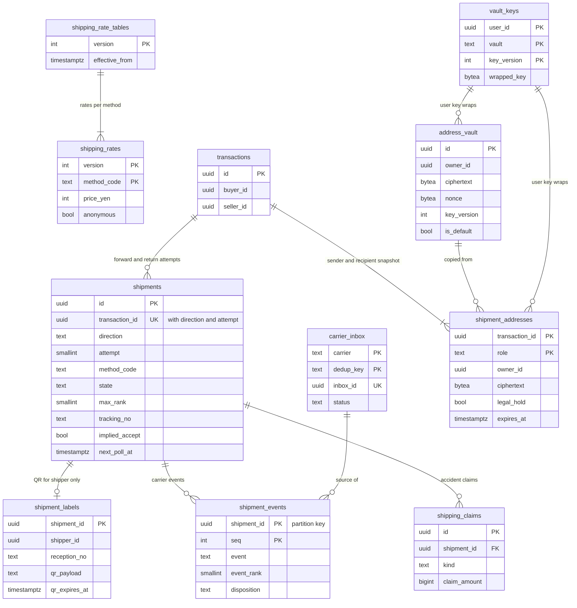

# Data model: 配送と住所の金庫

送料の表、配送、受け付けの番号と QR、運送会社の事象、Webhook の inbox、配送の事故、住所録（金庫）、配送ごとの住所の写し。振る舞いは [shipping-integrations.md](../shipping-integrations.md)、方針は [ADR-0006](../../decisions/0006-shipping-orchestration-via-carriers.md)・[ADR-0042](../../decisions/0042-carrier-event-ranking-and-implied-acceptance.md)・[ADR-0043](../../decisions/0043-shipping-rate-tables-and-size-tiers.md)・[ADR-0044](../../decisions/0044-address-vault-snapshots-and-access.md)・[ADR-0069](../../decisions/0069-key-layout-and-vault-envelope-encryption.md)。規約は [data-model.md](../data-model.md) の 3 節、封筒の形は同 3.6 節。

- どの表も core のクラスタにあり、`shipping` のサービスだけが書く。
- 住所の平文は `shipping` のプロセスのメモリーの中だけ。復号は `openAddress(purpose, subject)` の 1 つの関数だけ（ADR-0044）。
- 運送会社の名前は相手先の名前として列の値（`ymt`・`jp`）に使う。商品の名前は `<Brand>便`。

## 1. ER 図

- `vault_keys` は [security-audit-and-lifecycle.md](security-audit-and-lifecycle.md) の 2.1 節。`shipment_addresses` の暗号文は、差出人は売り手の鍵、配送先は買い手の鍵で包む。
- `transactions ||--|{ shipment_addresses`：取引ごとに `sender`・`recipient` の 2 行。返送は同じ 2 行を入れ替えて使う。

## 2. 制約の実装

| 制約 | 実装 |
| --- | --- |
| 前にだけ進む | 処理は配送の行を `FOR UPDATE` で取り、事象の順位が `max_rank` より高いときだけ状態と `max_rank` を進める。`max_rank` を下げる更新をトリガーで拒む |
| 偽の発送なし | 匿名の配送の取引への `carrier_accepted` は、順位 1 以上の事象の処理だけが出す（補った `accepted` を含む）。売り手の操作は `shipments` を `accepted` にできない |
| 重複を除く | `carrier_inbox` の PK `(carrier, dedup_key)` に `INSERT … ON CONFLICT DO NOTHING` |
| 受け付けの冪等 | 運送会社への冪等キー `<transaction_id>:ship:<attempt>`。`(transaction_id, direction, attempt)` の一意 |
| 生きた受け付けは 1 つ | 部分 UK `(transaction_id, direction) WHERE state <> 'cancelled'` |
| QR は差し出す人だけ | QR と受け付けの番号を `shipment_labels` に分け、RLS を `shipper_id` にした（D-19） |

## 3. 表

### 3.1 `shipping_rate_tables`・`shipping_rates`

送料の表（バージョンつき）。取引は作成の時のバージョンを記録する（ADR-0043）。定義元：[shipping-integrations.md](../shipping-integrations.md) の 4 節。

`shipping_rate_tables`

| 列 | 型 | NULL | 既定 | 説明 |
| --- | --- | --- | --- | --- |
| `version` | `integer` | NOT NULL | — | |
| `effective_from` | `timestamptz` | NOT NULL | — | |
| `approved_by` | `uuid[]` | NOT NULL | — | PM・財務 |
| `created_at` | `timestamptz` | NOT NULL | `now()` | |

`shipping_rates`

| 列 | 型 | NULL | 既定 | 説明 |
| --- | --- | --- | --- | --- |
| `version` | `integer` | NOT NULL | — | |
| `method_code` | `text` | NOT NULL | — | `<carrier>.<tier>`（`ymt.post_flat`、`jp.parcel_60`、`other.tracked`、`other.cod`） |
| `carrier` | `text` | NOT NULL | — | `ymt`・`jp`・`other` |
| `price_yen` | `integer` | NOT NULL | — | 売り手の負担のとき差し引く額（`other.*` は 0） |
| `materials_yen` | `integer` | NOT NULL | `0` | 資材の代金（台帳に載せない） |
| `size_limits` | `jsonb` | NOT NULL | — | 3 辺の合計・長辺・厚さ・重さの上限 |
| `anonymous` | `boolean` | NOT NULL | — | |
| `tracking` | `boolean` | NOT NULL | — | |

- キー：`shipping_rate_tables` は PK `(version)`。`shipping_rates` は PK `(version, method_code)`、FK `version`。
- CHECK：`price_yen >= 0`。`cardinality(approved_by) >= 2`。`method_code ~ '^(ymt|jp|other)\.[a-z0-9_]+$'`。
- RLS：なし（設定、公開）。区分：U（額は F）。保持：残す。S1 の量：1 バージョン 30 行。

### 3.2 `shipments`

配送（2 者の RLS）。定義元：同 5・6 節。

| 列 | 型 | NULL | 既定 | 説明 |
| --- | --- | --- | --- | --- |
| `id` | `uuid` | NOT NULL | `uuidv7()` | |
| `transaction_id` | `uuid` | NOT NULL | — | |
| `buyer_id` | `uuid` | NOT NULL | — | RLS の写し |
| `seller_id` | `uuid` | NOT NULL | — | 同 |
| `direction` | `text` | NOT NULL | `'forward'` | `forward`・`return` |
| `attempt` | `smallint` | NOT NULL | `1` | 受け付けのやり直しで 1 上げる（5 回まで） |
| `method_code` | `text` | NOT NULL | — | 発送の時の段（同じ運送会社の中で変えられる） |
| `rate_price_yen` | `integer` | NOT NULL | — | 取引の表のバージョンでの段の料金（差し引く額） |
| `carrier` | `text` | NOT NULL | — | |
| `state` | `text` | NOT NULL | `'label_issued'` | `label_issued`・`accepted`・`in_transit`・`out_for_delivery`・`delivered`・`exception`・`cancelled` |
| `max_rank` | `smallint` | NOT NULL | `0` | 0〜4 |
| `tracking_no` | `text` | NULL | — | 追跡の番号（相手にも見せる） |
| `implied_accept` | `boolean` | NOT NULL | `false` | 補った引き受け |
| `unverified_tracking` | `boolean` | NOT NULL | `false` | 匿名でない配送で照会で確かめられない番号 |
| `held_at_office` | `boolean` | NOT NULL | `false` | 持ち戻り・留め置きの印 |
| `exception_kind` | `text` | NULL | — | `returned_to_sender`・`lost`・`damaged`・`refused`・`shipped_after_cancel` |
| `accepted_at` | `timestamptz` | NULL | — | 引き受けの時刻（補ったときは元の事象の時刻） |
| `delivered_at` | `timestamptz` | NULL | — | |
| `next_poll_at` | `timestamptz` | NULL | — | 照会の予定（6 時間ごと、Webhook のある運送会社は 12 時間まで） |
| `poll_until` | `timestamptz` | NULL | — | 引き受けから 30 日 |
| `created_at` | `timestamptz` | NOT NULL | `now()` | |
| `updated_at` | `timestamptz` | NOT NULL | `now()` | |

- キー：PK `(id)`。UK `(transaction_id, direction, attempt)`。部分 UK `(transaction_id, direction) WHERE state <> 'cancelled'`。
- 索引：`(carrier, tracking_no) WHERE tracking_no IS NOT NULL` — 照会の結果・同じ番号の複数の取引（偽の発送の兆し）。`(next_poll_at) WHERE next_poll_at IS NOT NULL` — 照会のジョブ。
- CHECK：`direction IN ('forward','return')`。`attempt BETWEEN 1 AND 5`。`max_rank BETWEEN 0 AND 4`。`(state = 'exception') = (exception_kind IS NOT NULL)`。`rate_price_yen >= 0`。
- RLS：2 者（`app.actor_id IN (buyer_id, seller_id)`）。QR と受け付けの番号はこの表に置かない。
- 区分：P。保持：取引と同じ 10 年。S1 の量：1 日 9 万行、進行中 50 万行。

### 3.3 `shipment_labels`

匿名の配送の受け付けの番号と QR。差し出す人（往路は売り手、返送は買い手）だけが読む。領域の文書の「`shipments` の売り手の側の列」を表に分けた（D-19）。

| 列 | 型 | NULL | 既定 | 説明 |
| --- | --- | --- | --- | --- |
| `shipment_id` | `uuid` | NOT NULL | — | → `shipments(id)` |
| `shipper_id` | `uuid` | NOT NULL | — | 差し出す人 |
| `reception_no` | `text` | NOT NULL | — | 受け付けの番号 |
| `qr_payload` | `text` | NOT NULL | — | QR の中身（配送先を含まない運送会社の値） |
| `qr_expires_at` | `timestamptz` | NULL | — | 運送会社の値 |
| `created_at` | `timestamptz` | NOT NULL | `now()` | |
| `cancelled_at` | `timestamptz` | NULL | — | `cancelShipment` の後 |

- キー：PK `(shipment_id)`。UK `(reception_no)`（運送会社の請求の明細の突き合わせ E4）。
- 索引：`(qr_expires_at) WHERE cancelled_at IS NULL` — 期限の 24 時間前と期限の後の知らせ。
- RLS：本人（`shipper_id = app.actor_id`）。区分：P。保持：取引と同じ。

### 3.4 `shipment_events`

運送会社の事象の記録（追記だけ）。採らなかった事象も残す。定義元：同 5.1 節。

| 列 | 型 | NULL | 既定 | 説明 |
| --- | --- | --- | --- | --- |
| `shipment_id` | `uuid` | NOT NULL | — | 分割の鍵 |
| `seq` | `integer` | NOT NULL | — | 配送ごとの連番（200 まで） |
| `event` | `text` | NOT NULL | — | `label_created`・`accepted`・`in_transit`・`out_for_delivery`・`delivered`・`held_at_office`・`returned_to_sender`・`lost`・`damaged`・`refused` |
| `event_rank` | `smallint` | NULL | — | 0〜4。例外は NULL |
| `implied` | `boolean` | NOT NULL | `false` | 補った `accepted` |
| `carrier_occurred_at` | `timestamptz` | NOT NULL | — | 運送会社の時刻 |
| `received_at` | `timestamptz` | NOT NULL | `now()` | |
| `disposition` | `text` | NOT NULL | — | `advanced`・`lower`・`duplicate`・`exception`・`after_cancel` |
| `source` | `text` | NOT NULL | — | `webhook`・`poll` |
| `inbox_id` | `uuid` | NULL | — | `carrier_inbox.inbox_id` |

- キー：PK `(shipment_id, seq)`。分割：`shipment_id` の範囲（UUIDv7 の月の境。D-21）。
- 名前：領域の文書の「順位」の列を `event_rank` にした（`rank` は関数の名前）（D-13）。
- RLS：なし（`shipping` の役割。2 者には API が状態と時刻だけを出す）。区分：P。保持：取引と同じ。2 年を過ぎた区切りは `records` へ写して `DROP`。
- S1 の量：1 日 45 万行。

### 3.5 `carrier_inbox`

運送会社の Webhook と照会の結果の inbox。定義元：同 5.2 節。

| 列 | 型 | NULL | 既定 | 説明 |
| --- | --- | --- | --- | --- |
| `carrier` | `text` | NOT NULL | — | |
| `dedup_key` | `text` | NOT NULL | — | 運送会社の事象の ID、なければ `(追跡の番号, 正規の事象, 運送会社の時刻)` |
| `inbox_id` | `uuid` | NOT NULL | `uuidv7()` | 取引の遷移の冪等キー |
| `shipment_id` | `uuid` | NULL | — | 引き当てた配送 |
| `received_at` | `timestamptz` | NOT NULL | `now()` | |
| `status` | `text` | NOT NULL | `'pending'` | `pending`・`processed`・`unmatched` |
| `processed_at` | `timestamptz` | NULL | — | |
| `s3_key` | `text` | NOT NULL | — | 住所の欄を落とした本文（`records` の `shipping/inbox/…`） |

- キー：PK `(carrier, dedup_key)`。UK `(inbox_id)`。
- 索引：`(status, received_at) WHERE status = 'pending'`。
- RLS：なし（`shipping` の役割）。区分：P。保持：90 日（本文の S3 は 13 か月）。S1 の量：1 日 50 万行。

### 3.6 `shipping_claims`

運送会社への事故の請求。定義元：同 8 節。

| 列 | 型 | NULL | 既定 | 説明 |
| --- | --- | --- | --- | --- |
| `id` | `uuid` | NOT NULL | `uuidv7()` | |
| `shipment_id` | `uuid` | NOT NULL | — | |
| `case_id` | `uuid` | NULL | — | 紛争の案件（content。論理の参照） |
| `kind` | `text` | NOT NULL | — | `lost`・`damaged` |
| `claim_amount` | `bigint` | NOT NULL | — | |
| `state` | `text` | NOT NULL | `'filed'` | `filed`・`accepted`・`rejected`・`paid` |
| `carrier_result` | `text` | NULL | — | |
| `recovered_amount` | `bigint` | NULL | — | 運送会社からの入金（補償の費用を戻す。財務と決める） |
| `created_at` | `timestamptz` | NOT NULL | `now()` | |
| `settled_at` | `timestamptz` | NULL | — | |

- キー：PK `(id)`。FK `shipment_id`。RLS：なし（`shipping`・`ops-api`）。区分：F。保持：10 年。

### 3.7 `address_vault`

住所録（本人だけ。1 人 20 件）。定義元：同 7.1 節、[security.md](../security.md) の 5.3 節。

| 列 | 型 | NULL | 既定 | 説明 |
| --- | --- | --- | --- | --- |
| `id` | `uuid` | NOT NULL | `uuidv7()` | 追加の認証データの `row_id` |
| `owner_id` | `uuid` | NOT NULL | — | |
| `ciphertext` | `bytea` | NOT NULL | — | 郵便番号・都道府県・市区町村・番地・建物・氏名・電話番号の JSON の暗号文 |
| `nonce` | `bytea` | NOT NULL | — | 96 ビットの乱数 |
| `key_version` | `integer` | NOT NULL | — | `vault_keys`（`vault = 'address'`） |
| `aad_version` | `smallint` | NOT NULL | `1` | |
| `is_default` | `boolean` | NOT NULL | `false` | |
| `created_at` | `timestamptz` | NOT NULL | `now()` | |
| `updated_at` | `timestamptz` | NOT NULL | `now()` | |

- キー：PK `(id)`。部分 UK `(owner_id) WHERE is_default`。索引：`(owner_id, id)`。
- CHECK：`octet_length(nonce) = 12`。
- RLS：本人（行の読み出しは `shipping` の `owner_view` を通す）。KMS の `Decrypt` は `shipping` の役割だけ。
- 区分：V。保持：消されるか退会まで。退会は鍵の破棄（バックアップの 35 日の後に完全に読めない）。S1 の量：1,000 万行。

### 3.8 `shipment_addresses`

配送ごとの差出人・配送先の写し（`shipping` の役割だけ）。`transaction.created` を受けて作る（ADR-0044）。

| 列 | 型 | NULL | 既定 | 説明 |
| --- | --- | --- | --- | --- |
| `transaction_id` | `uuid` | NOT NULL | — | |
| `role` | `text` | NOT NULL | — | `sender`（売り手）・`recipient`（買い手） |
| `owner_id` | `uuid` | NOT NULL | — | 鍵の持ち主 |
| `source_address_id` | `uuid` | NOT NULL | — | 写した元の `address_vault.id` |
| `ciphertext` | `bytea` | NOT NULL | — | |
| `nonce` | `bytea` | NOT NULL | — | |
| `key_version` | `integer` | NOT NULL | — | |
| `aad_version` | `smallint` | NOT NULL | `1` | |
| `legal_hold` | `boolean` | NOT NULL | `false` | 紛争・照会の保全（`legal_holds` の写し） |
| `expires_at` | `timestamptz` | NULL | — | 取引の終わり ＋ 180 日。保全を解いた日から数え直す |
| `created_at` | `timestamptz` | NOT NULL | `now()` | |

- キー：PK `(transaction_id, role)`。
- 索引：`(expires_at) WHERE NOT legal_hold` — `retention-sweeper` の削除。
- CHECK：`role IN ('sender','recipient')`。
- RLS：なし。`shipping` の役割だけに GRANT し、他の役割は表を読めない（非 RLS の許可リスト。[data-model.md](../data-model.md) の 3.3 節）。
- 区分：V。保持：取引の終わりから 180 日（L5）。S1 の量：1 日 20 万行、置く行 4,000 万前後。

## 4. 外の置き場所

- S3：`records` の `shipping/inbox/<carrier>/<yyyy>/<mm>/<dd>/<id>.json`（住所の欄を落とした本文）。
- 運送会社の Webhook の形と正規の事象への写しは [stores.md](stores.md) の 8 節。
- outbox の話題：`shipment.label_issued`、`shipment.accepted`、`shipment.delivered`、`shipment.exception`。
- KMS：`kms-vault-address`（`Decrypt` は `shipping` の役割だけ）。AppConfig：`ops.carrier_enabled.<carrier>`。
