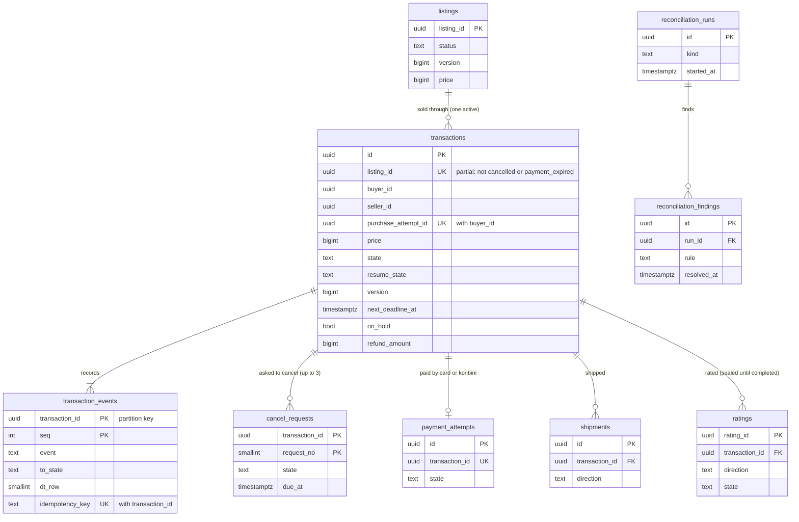

# Data model: 取引

取引、取引の事象、キャンセルの申し出、出品と取引の照合。振る舞いは [transactions-and-state-machine.md](../transactions-and-state-machine.md)、方針は [ADR-0002](../../decisions/0002-transaction-state-machine-and-single-purchase.md)・[ADR-0025](../../decisions/0025-transaction-decision-table-and-deadline-pause.md)・[ADR-0026](../../decisions/0026-hot-listing-purchase-admission.md)・[ADR-0027](../../decisions/0027-cancellation-rules-and-listing-restoration.md)。規約は [data-model.md](../data-model.md) の 3 節。

- どの表も core のクラスタにあり、`transactions` のサービスだけが書く。
- 取引の状態は遷移の関数 `transition()` だけが書く。DT-TXN-001 の 38 行（[transactions-and-state-machine.md](../transactions-and-state-machine.md) の 6.2 節）。
- お金は ledger のクラスタにあり、outbox の事象（`transaction.paid`・`completed`・`cancelled`・`dispute_resolved`）でつなぐ（[ledger-and-proceeds.md](ledger-and-proceeds.md)）。
- 評価（`ratings`）は同じ core のトランザクションで書く（[messaging-comments-and-ratings.md](messaging-comments-and-ratings.md)）。

## 1. ER 図

- `listings ||--o{ transactions`：1 つの出品に取引は何件でもあるが（取り消しの後の再購入）、進行中（`cancelled`・`payment_expired` 以外。`completed` を含む）は 0 か 1。部分一意の索引で守る（ADR-0002）。
- `transactions ||--o| payment_attempts`：残高だけで払った取引は試行を持たない。カード・コンビニ払いの取引は 1 つ（[payments.md](payments.md)）。
- `payment_attempts`・`shipments`・`ratings` の列は代表だけ。各表は該当のファイル。

## 2. 制約の実装

| 制約 | 実装 |
| --- | --- |
| 二重の販売なし | `CREATE UNIQUE INDEX transactions_one_active_per_listing ON transactions (listing_id) WHERE state NOT IN ('cancelled','payment_expired')`。購入は出品の条件つきの更新の後に挿入する（[listings-photos-and-catalog.md](listings-photos-and-catalog.md) の 2 節）。この索引は守る物（ADR-0078） |
| 購入の冪等 | `UNIQUE (buyer_id, purchase_attempt_id)`。同じ試行の再送は既存の取引を返す |
| 操作の冪等 | `transaction_events` の `UNIQUE (transaction_id, idempotency_key)`。2 回目は前の結果を返す |
| 状態は遷移の関数だけ | `transactions` の `state`・期限の列の `UPDATE` 権限を `transactions` の役割だけに与え、関数の外の更新は lint で拒む |
| 期限の拾い | `CREATE INDEX transactions_due ON transactions (next_deadline_at) WHERE next_deadline_at IS NOT NULL` |
| ロックの順 | 出品 → 取引（[transactions-and-state-machine.md](../transactions-and-state-machine.md) の 5.2 節） |

## 3. 表

### 3.1 `transactions`

取引の正本。2 者の RLS。定義元：[transactions-and-state-machine.md](../transactions-and-state-machine.md) の 5〜7 節。

| 列 | 型 | NULL | 既定 | 説明 |
| --- | --- | --- | --- | --- |
| `id` | `uuid` | NOT NULL | `uuidv7()` | 取引の ID |
| `listing_id` | `uuid` | NOT NULL | — | |
| `buyer_id` | `uuid` | NOT NULL | — | |
| `seller_id` | `uuid` | NOT NULL | — | |
| `purchase_attempt_id` | `uuid` | NOT NULL | — | 購入の要求の `Idempotency-Key`（勝った試行だけが残る） |
| `listing_title` | `text` | NOT NULL | — | 作成の時の題名の写し（明細・通知に使う） |
| `price` | `bigint` | NOT NULL | — | 買い手が見た価格（= 出品の価格） |
| `payment_fee` | `bigint` | NOT NULL | `0` | 支払いの手数料（コンビニ払い 100） |
| `fee_table_version` | `integer` | NOT NULL | — | 手数料の表のバージョン |
| `shipping_rate_table_version` | `integer` | NOT NULL | — | 送料の表のバージョン |
| `shipping_method_code` | `text` | NOT NULL | — | 出品の時の方法。発送の時の段は `shipments.method_code` |
| `shipping_payer` | `text` | NOT NULL | — | `seller`・`buyer` |
| `ship_days_code` | `text` | NOT NULL | — | `1_2`・`2_3`・`4_7` |
| `payment_method` | `text` | NOT NULL | — | `card`・`konbini`・`balance` |
| `balance_amount` | `bigint` | NOT NULL | `0` | ポイント・売上金・残高で払う額（`hold_balance`） |
| `state` | `text` | NOT NULL | `'created'` | `created`・`paid`・`cancel_requested`・`shipped`・`delivered`・`received`・`completed`・`disputed`・`cancelled`・`payment_expired` |
| `resume_state` | `text` | NULL | — | `disputed` に入る前の状態 |
| `version` | `bigint` | NOT NULL | `1` | 遷移ごとに 1 上げる |
| `payment_due_at` | `timestamptz` | NULL | — | 期限の列（5 つ） |
| `ship_due_at` | `timestamptz` | NULL | — | |
| `cancel_response_due_at` | `timestamptz` | NULL | — | |
| `auto_receive_at` | `timestamptz` | NULL | — | |
| `seller_rating_due_at` | `timestamptz` | NULL | — | |
| `next_deadline_at` | `timestamptz` | NULL | — | 生きている期限の最小。止めている間は NULL |
| `on_hold` | `boolean` | NOT NULL | `false` | 運用の保留 |
| `paused_at` | `timestamptz` | NULL | — | 止めた時刻（紛争・保留） |
| `paused_seconds` | `bigint` | NOT NULL | `0` | ずらした秒の合計 |
| `ship_overdue` | `boolean` | NOT NULL | `false` | 発送の期限を過ぎた |
| `refund_amount` | `bigint` | NULL | — | 一部の返金の額（行 36） |
| `cancel_reason_code` | `text` | NULL | — | 取り消しの理由（`ship_overdue`・`mutual`・`payment_failed`・`moderation`・`dispute` など） |
| `shipped_at` | `timestamptz` | NULL | — | 引き受けの時刻（補正の後） |
| `delivered_at` | `timestamptz` | NULL | — | |
| `received_at` | `timestamptz` | NULL | — | |
| `completed_at` | `timestamptz` | NULL | — | |
| `cancelled_at` | `timestamptz` | NULL | — | `cancelled`・`payment_expired` の時刻 |
| `created_at` | `timestamptz` | NOT NULL | `now()` | |
| `updated_at` | `timestamptz` | NOT NULL | `now()` | |

- キー：PK `(id)`。部分 UK `(listing_id) WHERE state NOT IN ('cancelled','payment_expired')`。UK `(buyer_id, purchase_attempt_id)`。
- 索引：
  - `(next_deadline_at) WHERE next_deadline_at IS NOT NULL` — `deadline-runner`（1 分ごと、100 件ずつ、`FOR UPDATE SKIP LOCKED`）。
  - `(seller_id, state)`・`(buyer_id, state)` — 取引の一覧、退会の条件、未払いのコンビニ払いの数え（1 人 2 件）。
  - `(listing_id)` — 出品と取引の照合（R1〜R4）と取引の履歴。
  - `(state, updated_at) WHERE state NOT IN ('completed','cancelled','payment_expired')` — DR の再開の時のずらし（1 万件ずつ）と R6。
- CHECK：
  - `buyer_id <> seller_id`。`state IN (...)`。`payment_method IN ('card','konbini','balance')`。
  - `price BETWEEN 300 AND 9999999`。`payment_fee >= 0`。`balance_amount BETWEEN 0 AND price + payment_fee`。`payment_method <> 'balance' OR balance_amount = price + payment_fee`。
  - `(state = 'disputed') = (resume_state IS NOT NULL)`。`resume_state IN ('paid','cancel_requested','shipped','delivered','received')`。
  - `refund_amount IS NULL OR (refund_amount > 0 AND refund_amount < price + payment_fee)`。
  - `(state = 'disputed' OR on_hold) OR paused_at IS NULL`。`NOT (state = 'disputed' OR on_hold) OR next_deadline_at IS NULL`。`paused_seconds >= 0`。
- RLS：2 者（`app.actor_id IN (buyer_id, seller_id)`）。サービスの役割：`deadline-runner`、`payments`・`shipping`・`ledger`・`ops-api` の事象の消費者（遷移の関数を通る）、`listing-transaction-reconciler`（読み出しの写し）。
- 区分：P（金額の列は F）。
- 保持：取引の終わりから 10 年（ADR-0071。L5・L8）。期間の後は買い手・売り手の ID を残して題名の写しを消す（仮名）。
- S1 の量：1 日 10 万行、1 年 3,650 万行（1 行 600 バイトで 22 GB）。進行中 50 万行前後。

### 3.2 `transaction_events`

取引の事象（追記だけ）。DT-TXN-001 の行の番号を持つ。定義元：同 6.1 節。

| 列 | 型 | NULL | 既定 | 説明 |
| --- | --- | --- | --- | --- |
| `transaction_id` | `uuid` | NOT NULL | — | 分割の鍵 |
| `seq` | `integer` | NOT NULL | — | 取引ごとの連番 |
| `buyer_id` | `uuid` | NOT NULL | — | RLS のための写し |
| `seller_id` | `uuid` | NOT NULL | — | 同 |
| `event` | `text` | NOT NULL | — | 4.2 節の事象（`purchase`・`payment_succeeded`・`deadline` など） |
| `deadline_column` | `text` | NULL | — | `event = 'deadline'` のとき、どの期限か |
| `actor_kind` | `text` | NOT NULL | — | `buyer`・`seller`・`system`・`operator` |
| `actor_id` | `uuid` | NULL | — | |
| `reason_code` | `text` | NULL | — | |
| `from_state` | `text` | NULL | — | 作成は NULL |
| `to_state` | `text` | NOT NULL | — | |
| `dt_row` | `smallint` | NOT NULL | — | DT-TXN-001 の行（1〜38） |
| `idempotency_key` | `text` | NULL | — | 画面の `Idempotency-Key`、`payment_inbox`・`carrier_inbox` の ID、期限は `deadline:<列>:<値>` |
| `case_id` | `uuid` | NULL | — | `cases`（content。論理の参照） |
| `moderation_action_id` | `uuid` | NULL | — | `moderation_cancel` のとき |
| `rating_id` | `uuid` | NULL | — | `buyer_receipt`・`seller_rating` のとき |
| `listing_price` | `bigint` | NULL | — | `purchase` のときの出品の価格（照合 R5） |
| `created_at` | `timestamptz` | NOT NULL | `now()` | |

- キー：PK `(transaction_id, seq)`。UK `(transaction_id, idempotency_key)`（NULL は重ならない）。
- 分割：`transaction_id` の範囲（UUIDv7 の月の境）。1 つの取引の事象は取引を作った月の区切りに入り、一意の制約が分割の鍵を含む（D-21）。
- 索引：`(created_at)`（区切りごと）— 期限の遅れの SLI。
- CHECK：`dt_row BETWEEN 1 AND 38`。`(event = 'purchase') = (listing_price IS NOT NULL)`。`actor_kind IN (...)`。
- RLS：2 者（`buyer_id`・`seller_id` の写し）。区分：P。
- 保持：取引と同じ 10 年。区切りごと S3 の `records` へ写し、2 年を過ぎた区切りを `DROP`（[stores.md](stores.md) の 3 節）。
- S1 の量：1 日 60 万行（1 取引 6 事象の見込み）。

### 3.3 `cancel_requests`

キャンセルの申し出（[ADR-0027](../../decisions/0027-cancellation-rules-and-listing-restoration.md)）。定義元：同 8 節。

| 列 | 型 | NULL | 既定 | 説明 |
| --- | --- | --- | --- | --- |
| `transaction_id` | `uuid` | NOT NULL | — | |
| `request_no` | `smallint` | NOT NULL | — | 1〜3 |
| `buyer_id` | `uuid` | NOT NULL | — | RLS の写し |
| `seller_id` | `uuid` | NOT NULL | — | 同 |
| `requested_by` | `text` | NOT NULL | — | `buyer`・`seller` |
| `reason_code` | `text` | NOT NULL | — | `ship_overdue`・`mutual`・`buyer_mistake`・`seller_out_of_stock`・`other` |
| `state` | `text` | NOT NULL | `'open'` | `open`・`accepted`・`rejected`・`withdrawn`・`expired`・`superseded_by_shipment` |
| `due_at` | `timestamptz` | NOT NULL | — | 申し出 ＋ 48 時間 |
| `created_at` | `timestamptz` | NOT NULL | `now()` | |
| `closed_at` | `timestamptz` | NULL | — | |

- キー：PK `(transaction_id, request_no)`。部分 UK `(transaction_id) WHERE state = 'open'` — 開いた申し出は 1 つ。
- CHECK：`request_no BETWEEN 1 AND 3`。`reason_code <> 'ship_overdue' OR requested_by = 'buyer'`。`(state = 'open') = (closed_at IS NULL)`。
- RLS：2 者。区分：P。保持：取引と同じ。S1 の量：1 日 3,000 行（見込み）。

### 3.4 `reconciliation_runs`

core の照合の実行の記録（出品と取引の照合、措置の適用の照合）。定義元：[observability.md](../observability.md) の 3 節、[transactions-and-state-machine.md](../transactions-and-state-machine.md) の 10 節。ledger の照合は `recon_runs`（[ledger-and-proceeds.md](ledger-and-proceeds.md)）。

| 列 | 型 | NULL | 既定 | 説明 |
| --- | --- | --- | --- | --- |
| `id` | `uuid` | NOT NULL | `uuidv7()` | |
| `kind` | `text` | NOT NULL | — | `listing_transaction`・`moderation_apply`・`search_index`・`dr_recovery` |
| `started_at` | `timestamptz` | NOT NULL | `now()` | |
| `finished_at` | `timestamptz` | NULL | — | |
| `examined` | `bigint` | NOT NULL | `0` | 見た件数 |
| `mismatches` | `integer` | NOT NULL | `0` | |
| `result` | `text` | NULL | — | `ok`・`mismatch`・`failed` |

- キー：PK `(id)`。索引：`(kind, started_at)`。
- RLS：なし（`reconcilers` の役割）。区分：M。保持：13 か月。S1 の量：1 日 300 行。

### 3.5 `reconciliation_findings`

照合の不一致の対象。

| 列 | 型 | NULL | 既定 | 説明 |
| --- | --- | --- | --- | --- |
| `id` | `uuid` | NOT NULL | `uuidv7()` | |
| `run_id` | `uuid` | NOT NULL | — | → `reconciliation_runs(id)` |
| `rule` | `text` | NOT NULL | — | `R1`〜`R6` など |
| `target_type` | `text` | NOT NULL | — | `listing`・`transaction`・`moderation_action` |
| `target_id` | `uuid` | NOT NULL | — | |
| `severity` | `text` | NOT NULL | — | `page`・`ticket` |
| `detected_at` | `timestamptz` | NOT NULL | `now()` | |
| `resolved_at` | `timestamptz` | NULL | — | |
| `resolved_by` | `uuid` | NULL | — | |
| `resolution` | `text` | NULL | — | 直した遷移・措置の参照 |

- キー：PK `(id)`。FK `run_id`。索引：`(target_type, target_id)`。`(detected_at) WHERE resolved_at IS NULL` — 開いた不一致の一覧と指標。
- RLS：なし（`reconcilers`・`ops-api` の役割）。区分：M。保持：解決から 13 か月。

## 4. 外の置き場所

- Valkey：`listing:{id}:snap`（状態・バージョン・価格。60 秒以内）、`purchase:{listing_id}`（先着の印、15 秒、取り消しで比べて消す）（[stores.md](stores.md) の 1 節）。
- outbox の話題：`transaction.created`・`paid`・`shipped`・`delivered`・`received`・`completed`・`cancelled`・`payment_expired`・`disputed`・`dispute_resolved`・`cancel_requested`。
- AppConfig：`ops.purchase_enabled`（全体・カテゴリ・出品）。
