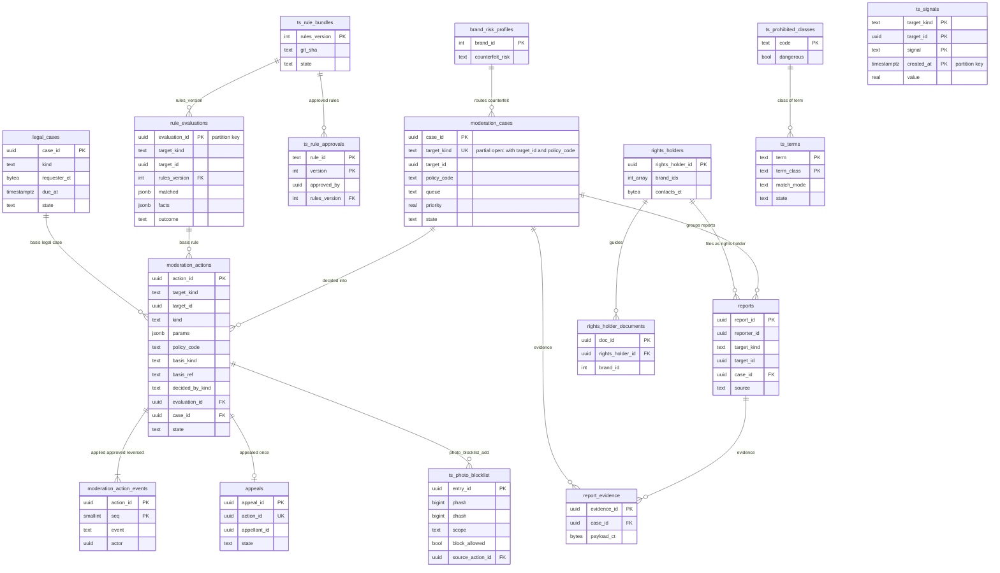

# Data model: T&S

措置と措置の事象、規則の評価、信号、規則の束と承認、辞書と一覧（禁止の語、禁止の写真のハッシュ、禁止の品の種類、ブランドの危険の段）、審査の案件、異議、通報と証拠、権利者、法令の案件。振る舞いは [trust-and-safety.md](../trust-and-safety.md)、方針は [ADR-0009](../../decisions/0009-trust-and-safety-pipeline-boundary.md)・[ADR-0051](../../decisions/0051-rules-engine-declarative-tables.md)・[ADR-0052](../../decisions/0052-review-cases-queues-and-appeals.md)・[ADR-0053](../../decisions/0053-counterfeit-detection-signals-and-brand-profiles.md)・[ADR-0054](../../decisions/0054-photo-hash-block-list.md)。規約は [data-model.md](../data-model.md) の 3 節。

- どの表も content のクラスタにあり、`trust-safety` のサービスだけが書く。S2 で `content-ts` に移る（[ADR-0074](../../decisions/0074-stage-up-criteria-and-split-plan.md)）。
- 措置の記録と outbox を 1 つのトランザクションで書き、各サービスの適用の消費者が自分のクラスタで状態を変える（`moderation_action_id` で冪等。[trust-and-safety.md](../trust-and-safety.md) の 9.2 節）。
- 証拠・権利者の連絡先・申出者は T&S の鍵（`data_keys` の `purpose = 'ts'`）で暗号化し、T&S と法務の役割だけが読む。読み出しは監査ログに案件の ID とともに残す。

## 1. ER 図

- `moderation_actions.basis_ref` は根拠の種類（`rule`・`review`・`legal_case`・`appeal`）ごとに、評価の ID・案件の ID・法令の案件の ID・異議の ID を持つ。図の線は代表の外部キー（`evaluation_id`・`case_id`）と、法令の案件への論理の参照。
- `brand_risk_profiles ||--o{ moderation_cases` は待ち行列の振り分けの意味の線で、外部キーはない。
- 出品・アカウント・コメント・メッセージ・評価への `target_id` は、他のクラスタ・表への論理の参照。

## 2. 表

### 2.1 `moderation_actions`

措置の正本（追記だけ。`state` だけを更新できる）。定義元：[trust-and-safety.md](../trust-and-safety.md) の 9 節。

| 列 | 型 | NULL | 既定 | 説明 |
| --- | --- | --- | --- | --- |
| `action_id` | `uuid` | NOT NULL | `uuidv7()` | |
| `target_kind` | `text` | NOT NULL | — | `listing`・`comment`・`message`・`rating`・`account`・`photo_hash`・`proceeds`・`transaction` |
| `target_id` | `uuid` | NOT NULL | — | |
| `kind` | `text` | NOT NULL | — | 9.1 節の 13 種類（`listing_hold`・`listing_remove`・`listing_restore`・`comment_remove`・`message_remove`・`rating_exclude`・`account_listing_limit`・`account_no_listing`・`account_no_purchase`・`account_suspend`・`proceeds_hold_request`・`transaction_cancel_request`・`photo_blocklist_add`） |
| `params` | `jsonb` | NOT NULL | `'{}'` | 上限の値、外す評価の ID の一覧など |
| `policy_code` | `text` | NOT NULL | — | `counterfeit`・`prohibited`・`fraud` など |
| `basis_kind` | `text` | NOT NULL | — | `rule`・`review`・`legal_case`・`appeal` |
| `basis_ref` | `text` | NOT NULL | — | 根拠の ID（`legal_case:{id}` など） |
| `decided_by_kind` | `text` | NOT NULL | — | `rule`・`human` |
| `decided_by` | `uuid` | NULL | — | 審査員 |
| `approved_by` | `uuid` | NULL | — | 2 人の承認の措置の承認者 |
| `rules_version` | `integer` | NULL | — | |
| `evaluation_id` | `uuid` | NULL | — | |
| `case_id` | `uuid` | NULL | — | `moderation_cases` |
| `reverses_action_id` | `uuid` | NULL | — | 戻す措置のとき、元の措置 |
| `state` | `text` | NOT NULL | — | `pending_approval`・`applied`・`reversed` |
| `created_at` | `timestamptz` | NOT NULL | `now()` | |

- キー：PK `(action_id)`。
- 索引：`(target_kind, target_id, created_at)` — 対象の措置の履歴、`listingVisible()` の写しの作り直し、照合（効いているはずの措置）。`(case_id)`。`(state, created_at) WHERE state = 'pending_approval'`。
- CHECK：
  - `decided_by_kind <> 'rule' OR kind IN ('listing_hold','listing_remove')`（規則で効かせてよい範囲。ADR-0009、PROP-TS-002）。
  - `decided_by_kind <> 'human' OR decided_by IS NOT NULL`。
  - `kind NOT IN ('account_suspend','account_no_purchase','proceeds_hold_request','transaction_cancel_request') OR state = 'pending_approval' OR (approved_by IS NOT NULL AND approved_by <> decided_by)`（2 人の承認。PROP-TS-006）。
- RLS：なし（`trust-safety` の役割。本人への知らせはお知らせの一覧）。区分：A。保持：7 年（ADR-0071）。S1 の量：1 日 1 万行（見込み）。

### 2.2 `moderation_action_events`

措置の状態の変化（追記だけ）。

| 列 | 型 | NULL | 既定 | 説明 |
| --- | --- | --- | --- | --- |
| `action_id` | `uuid` | NOT NULL | — | |
| `seq` | `smallint` | NOT NULL | — | |
| `event` | `text` | NOT NULL | — | `created`・`approved`・`applied`・`reversed` |
| `actor` | `uuid` | NULL | — | 規則は NULL |
| `reason_code` | `text` | NULL | — | |
| `created_at` | `timestamptz` | NOT NULL | `now()` | |

- キー：PK `(action_id, seq)`。FK `action_id`。RLS：なし。区分：A。保持：7 年。

### 2.3 `rule_evaluations`

規則の評価の記録。同じ事実と `rules_version` なら同じ結果（PROP-TS-003）。定義元：同 7.2 節。

| 列 | 型 | NULL | 既定 | 説明 |
| --- | --- | --- | --- | --- |
| `evaluation_id` | `uuid` | NOT NULL | `uuidv7()` | 分割の鍵 |
| `target_kind` | `text` | NOT NULL | — | |
| `target_id` | `uuid` | NOT NULL | — | |
| `applies_to` | `text` | NOT NULL | — | `listing_sync`・`listing_async`・`report`・`txn_event`・`rating_published`・`payout_request`・`login`・`message_signal` |
| `rules_version` | `integer` | NOT NULL | — | |
| `matched` | `jsonb` | NOT NULL | — | 当たった規則の ID・バージョン・結果・影かどうか |
| `facts` | `jsonb` | NOT NULL | — | 使った事実（ID・点・数。本文と住所を含まない） |
| `outcome` | `text` | NOT NULL | — | `allow`・`review`・`wait_for_async`・`hold`・`block` |
| `created_at` | `timestamptz` | NOT NULL | `now()` | |

- キー：PK `(evaluation_id)`。分割：`evaluation_id` の範囲（月）。索引：`(target_kind, target_id, created_at)`。
- RLS：なし。区分：A。保持：90 日（区切りを落とす）。S1 の量：1 日 200 万行（見込み）。

### 2.4 `ts_signals`

分類器と事実の信号（最新の値と 90 日の履歴）。定義元：同 6 節。

| 列 | 型 | NULL | 既定 | 説明 |
| --- | --- | --- | --- | --- |
| `target_kind` | `text` | NOT NULL | — | `listing`・`account`・`transaction` |
| `target_id` | `uuid` | NOT NULL | — | |
| `signal` | `text` | NOT NULL | — | `cf_text`・`cf_image`・`prohibited_text`・`prohibited_image`・`price_ratio`・`photo_reuse`・`photo_blocklist_near`・`term_signal`・`rating_link_*`・`abuse_filter`・`fraud_*` |
| `created_at` | `timestamptz` | NOT NULL | `now()` | 分割の鍵 |
| `value` | `real` | NULL | — | 点・比 |
| `detail` | `jsonb` | NOT NULL | `'{}'` | 相手の ID、段、n、ブランドの ID など（本文を含まない） |
| `reason_codes` | `text[]` | NOT NULL | `'{}'` | |
| `model_version` | `text` | NULL | — | |

- キー：PK `(target_kind, target_id, signal, created_at)`。分割：`created_at` の月。
- 索引：PK の降順の走査で最新の値を引く。
- RLS：なし。区分：A。保持：90 日。S1 の量：1 日 300 万行（見込み）。

### 2.5 `ts_rule_bundles`・`ts_rule_approvals`

規則の束と承認（ADR-0051）。規則の本体は開発リポジトリの YAML で、束は S3 の `config/ts-rules/{rules_version}.json`。

`ts_rule_bundles`

| 列 | 型 | NULL | 既定 | 説明 |
| --- | --- | --- | --- | --- |
| `rules_version` | `integer` | NOT NULL | — | |
| `git_sha` | `text` | NOT NULL | — | |
| `state` | `text` | NOT NULL | — | `shadow`・`active`・`retired` |
| `created_at` | `timestamptz` | NOT NULL | `now()` | |
| `activated_at` | `timestamptz` | NULL | — | |

`ts_rule_approvals`

| 列 | 型 | NULL | 既定 | 説明 |
| --- | --- | --- | --- | --- |
| `rule_id` | `text` | NOT NULL | — | `R-CF-010` など |
| `version` | `integer` | NOT NULL | — | |
| `rules_version` | `integer` | NOT NULL | — | 承認した束 |
| `approved_by` | `uuid` | NOT NULL | — | T&S の責任者（人） |
| `shadow_from` | `timestamptz` | NOT NULL | — | |
| `shadow_to` | `timestamptz` | NOT NULL | — | |
| `sample_agreement` | `real` | NULL | — | 無作為の 200 件の一致の率 |
| `queue_delta` | `real` | NULL | — | 待ち行列の量の増え（倍） |
| `approved_at` | `timestamptz` | NOT NULL | `now()` | |

- キー：`(rules_version)`、`(rule_id, version)`。部分 UK `ts_rule_bundles (state) WHERE state = 'active'`。
- CHECK：`shadow_to - shadow_from >= interval '24 hours'`（`hold` の規則の 7 日は承認の関数で確かめる）。
- RLS：なし。区分：A。保持：残す。

### 2.6 `ts_terms`

禁止の語の辞書（メッセージの絞り込みと共有）。定義元：同 5.2 節。

| 列 | 型 | NULL | 既定 | 説明 |
| --- | --- | --- | --- | --- |
| `term` | `text` | NOT NULL | — | 正規化した後の文字 |
| `term_class` | `text` | NOT NULL | — | 禁止の品の種類のコード、`counterfeit_phrase`・`offplatform`・`harassment` |
| `match_mode` | `text` | NOT NULL | — | `exact_block`・`signal` |
| `state` | `text` | NOT NULL | `'shadow'` | `shadow`・`active` |
| `version` | `integer` | NOT NULL | — | 辞書のバージョン（足した・変えた時） |
| `approved_by` | `uuid` | NULL | — | `exact_block` は T&S の責任者 |

- キー：PK `(term, term_class)`。名前：領域の文書の `class`・`match` を `term_class`・`match_mode` にした（D-13）。
- CHECK：`match_mode <> 'exact_block' OR (char_length(term) >= 4 AND approved_by IS NOT NULL)`。
- RLS：なし（設定）。区分：M。S1 の量：2 万行。

### 2.7 `ts_photo_blocklist`

禁止の写真のハッシュ（ADR-0054）。定義元：同 5.3 節。

| 列 | 型 | NULL | 既定 | 説明 |
| --- | --- | --- | --- | --- |
| `entry_id` | `uuid` | NOT NULL | `uuidv7()` | |
| `phash` | `bigint` | NOT NULL | — | |
| `dhash` | `bigint` | NOT NULL | — | |
| `scope` | `text` | NOT NULL | — | `global`・`brand:{brand_id}` |
| `block_allowed` | `boolean` | NOT NULL | `false` | 写真そのものが証拠のとき |
| `source_action_id` | `uuid` | NOT NULL | — | 登録の措置（`photo_blocklist_add`） |
| `state` | `text` | NOT NULL | `'active'` | `active`・`revoked` |
| `created_at` | `timestamptz` | NOT NULL | `now()` | |
| `revoked_at` | `timestamptz` | NULL | — | 異議が認められた |

- キー：PK `(entry_id)`。FK `source_action_id` → `moderation_actions(action_id)`。索引：`(state, created_at)` — タスクの差分の読み込み。
- 引き方の索引（8 つの帯）は各タスクのメモリーにある（[stores.md](stores.md) の 6.2 節）。
- RLS：なし。区分：A。保持：残す。S1 の量：100 万行まで。

### 2.8 `ts_prohibited_classes`

禁止の品の種類（値は L10 の後）。定義元：同 11.2 節。

| 列 | 型 | NULL | 既定 | 説明 |
| --- | --- | --- | --- | --- |
| `code` | `text` | NOT NULL | — | |
| `description` | `text` | NOT NULL | — | |
| `dangerous` | `boolean` | NOT NULL | `false` | 危険な品（4 時間の待ち行列） |
| `detection` | `jsonb` | NOT NULL | `'{}'` | 語、分類器の頭、カテゴリ |
| `default_queue` | `text` | NOT NULL | `'prohibited'` | |
| `state` | `text` | NOT NULL | `'active'` | |

- キー：PK `(code)`。RLS：なし（設定）。区分：M。

### 2.9 `brand_risk_profiles`

ブランドの偽ブランドの危険の段（正本）。`brand.counterfeit_risk` の事実はここから作る（D-12）。定義元：同 11.1 節。

| 列 | 型 | NULL | 既定 | 説明 |
| --- | --- | --- | --- | --- |
| `brand_id` | `integer` | NOT NULL | — | core の `brands`（論理の参照） |
| `counterfeit_risk` | `text` | NOT NULL | `'normal'` | `high`・`normal` |
| `guide_doc_ids` | `uuid[]` | NOT NULL | `'{}'` | `rights_holder_documents` |
| `price_floor_yen` | `bigint` | NULL | — | 価格の下限の目安 |
| `reviewer_group` | `text` | NULL | — | 担当の審査員の組 |
| `updated_by` | `uuid` | NOT NULL | — | T&S の責任者 |
| `updated_at` | `timestamptz` | NOT NULL | `now()` | |

- キー：PK `(brand_id)`。RLS：なし（設定）。区分：M。S1 の量：`high` は 50 から。

### 2.10 `moderation_cases`

審査の案件（ADR-0052）。（対象、方針）の組で開いた案件は 1 つ。定義元：同 8.2 節。

| 列 | 型 | NULL | 既定 | 説明 |
| --- | --- | --- | --- | --- |
| `case_id` | `uuid` | NOT NULL | `uuidv7()` | |
| `target_kind` | `text` | NOT NULL | — | |
| `target_id` | `uuid` | NOT NULL | — | |
| `policy_code` | `text` | NOT NULL | — | |
| `queue` | `text` | NOT NULL | — | `counterfeit_high`・`prohibited`・`counterfeit`・`general`・`fraud`・`appeals`・`legal`・`stolen`・`rating_manipulation` |
| `priority` | `real` | NOT NULL | — | `severity × exposure × confidence × age`（age は読む時に掛ける） |
| `state` | `text` | NOT NULL | `'open'` | `open`・`assigned`・`decided`・`escalated` |
| `assignee` | `uuid` | NULL | — | |
| `due_at` | `timestamptz` | NOT NULL | — | 待ち行列の目標 |
| `decided_at` | `timestamptz` | NULL | — | |
| `outcome` | `text` | NULL | — | `no_violation`・`remove`・`restore`・`escalate` |
| `created_at` | `timestamptz` | NOT NULL | `now()` | |

- キー：PK `(case_id)`。部分 UK `(target_kind, target_id, policy_code) WHERE state <> 'decided'`。
- 索引：`(queue, state, priority DESC)` — 審査の画面。`(due_at) WHERE state <> 'decided'` — 期限の 2 時間前の知らせ。
- RLS：なし（審査員の役割）。区分：A。保持：7 年。S1 の量：1 日 8,000 行。

### 2.11 `appeals`

異議（1 つの措置に 1 回、30 日以内）。定義元：同 10 節。

| 列 | 型 | NULL | 既定 | 説明 |
| --- | --- | --- | --- | --- |
| `appeal_id` | `uuid` | NOT NULL | `uuidv7()` | |
| `action_id` | `uuid` | NOT NULL | — | |
| `appellant_id` | `uuid` | NOT NULL | — | |
| `statement` | `text` | NOT NULL | — | 1,000 文字まで |
| `state` | `text` | NOT NULL | `'open'` | `open`・`decided` |
| `reviewer` | `uuid` | NULL | — | 元の判断者と別の審査員（関数で確かめる） |
| `outcome` | `text` | NULL | — | `upheld`・`reversed` |
| `created_at` | `timestamptz` | NOT NULL | `now()` | |
| `decided_at` | `timestamptz` | NULL | — | |

- キー：PK `(appeal_id)`。UK `(action_id)`。FK `action_id`。RLS：本人（`appellant_id`）は読みだけ。区分：A。保持：7 年。

### 2.12 `reports`

利用者・権利者の通報。定義元：同 8.1 節。

| 列 | 型 | NULL | 既定 | 説明 |
| --- | --- | --- | --- | --- |
| `report_id` | `uuid` | NOT NULL | `uuidv7()` | |
| `reporter_id` | `uuid` | NOT NULL | — | |
| `rights_holder_id` | `uuid` | NULL | — | 権利者の通報 |
| `target_kind` | `text` | NOT NULL | — | `listing`・`comment`・`message`・`account`・`rating` |
| `target_id` | `uuid` | NOT NULL | — | |
| `reason_code` | `text` | NOT NULL | — | `contact_exchange`・`offplatform`・`harassment`・`counterfeit_suspect`・`prohibited`・`other` |
| `note` | `text` | NULL | — | 300 文字まで |
| `case_id` | `uuid` | NULL | — | まとめた案件 |
| `source` | `text` | NOT NULL | — | `user`・`rights_holder` |
| `created_at` | `timestamptz` | NOT NULL | `now()` | |

- キー：PK `(report_id)`。索引：`(reporter_id, created_at)` — 1 人 1 日 50 件と通報者の信頼。`(case_id)`。
- CHECK：`(source = 'rights_holder') = (rights_holder_id IS NOT NULL)`。
- RLS：本人（`reporter_id`）は読みだけ（閉じたことだけを知らせる）。区分：P。保持：7 年。

### 2.13 `report_evidence`

通報・案件の証拠の写し（暗号化）。

| 列 | 型 | NULL | 既定 | 説明 |
| --- | --- | --- | --- | --- |
| `evidence_id` | `uuid` | NOT NULL | `uuidv7()` | |
| `case_id` | `uuid` | NOT NULL | — | |
| `report_id` | `uuid` | NULL | — | |
| `kind` | `text` | NOT NULL | — | `listing_snapshot`・`messages`・`comment` |
| `payload_ct` | `bytea` | NOT NULL | — | 出品の写し、メッセージの対象と前後 10 件（L11 の結論で直す） |
| `captured_at` | `timestamptz` | NOT NULL | `now()` | |

- キー：PK `(evidence_id)`。索引：`(case_id)`。RLS：なし（T&S・法務の役割、読み出しは監査）。区分：P。保持：案件の終わりから 7 年（L5・L11）。

### 2.14 `rights_holders`・`rights_holder_documents`

権利者の窓口（ADR-0053）。

`rights_holders`

| 列 | 型 | NULL | 既定 | 説明 |
| --- | --- | --- | --- | --- |
| `rights_holder_id` | `uuid` | NOT NULL | `uuidv7()` | |
| `account_id` | `uuid` | NOT NULL | — | 窓口に入るアカウント |
| `brand_ids` | `integer[]` | NOT NULL | — | |
| `verified_at` | `timestamptz` | NULL | — | 権利の確かめ（手順は L9） |
| `contacts_ct` | `bytea` | NOT NULL | — | 担当者の連絡先 |

`rights_holder_documents`

| 列 | 型 | NULL | 既定 | 説明 |
| --- | --- | --- | --- | --- |
| `doc_id` | `uuid` | NOT NULL | `uuidv7()` | |
| `rights_holder_id` | `uuid` | NOT NULL | — | |
| `brand_id` | `integer` | NOT NULL | — | |
| `s3_key` | `text` | NOT NULL | — | `ts-docs/…` |
| `usage_scope` | `text` | NOT NULL | — | `review_only`・`eval_set` |
| `created_at` | `timestamptz` | NOT NULL | `now()` | |

- キー：`(rights_holder_id)`、`(doc_id)`。UK `rights_holders (account_id)`。FK `rights_holder_id`。
- RLS：本人（`account_id`）は自分の行と資料。T&S の役割。区分：V（連絡先）・M。保持：契約の終わりから 7 年。

### 2.15 `legal_cases`

法令の案件（削除の申し出、利用の停止等の要請、盗品の通知。L6・L7・L9）。開示の請求と捜査機関の照会は `cases` の `legal_request`（[disputes-and-support.md](disputes-and-support.md)）。定義元：同 14 節。

| 列 | 型 | NULL | 既定 | 説明 |
| --- | --- | --- | --- | --- |
| `case_id` | `uuid` | NOT NULL | `uuidv7()` | |
| `kind` | `text` | NOT NULL | — | `takedown_request`・`platform_request`・`stolen_goods_notice` |
| `requester_ct` | `bytea` | NOT NULL | — | 申出者・要請の元 |
| `targets` | `jsonb` | NOT NULL | — | 対象の出品・コメントの ID |
| `received_at` | `timestamptz` | NOT NULL | — | |
| `due_at` | `timestamptz` | NULL | — | `legal.*` の期限（L の後） |
| `deadline_rule_version` | `integer` | NULL | — | 期限の計算の規則のバージョン |
| `state` | `text` | NOT NULL | `'received'` | `received`・`reviewing`・`decided`・`closed` |
| `decision` | `text` | NULL | — | |
| `decided_by` | `uuid[]` | NULL | — | 審査員と法務の担当の 2 人 |
| `decided_at` | `timestamptz` | NULL | — | |

- キー：PK `(case_id)`。索引：`(state, due_at)` — 48 時間前・24 時間前の警告。
- CHECK：`state <> 'decided' OR cardinality(decided_by) >= 2`。
- RLS：なし（T&S・法務）。区分：V（申出者）・A。保持：法務の結論まで消さない（L6・L7・L9）。

## 3. 外の置き場所

- SQS：`ts-screen`、`ts-actions`。outbox の話題：`moderation.action_applied`・`moderation.action_reversed`・`ts.case_opened`・`ts.photo_blocklist_changed`・`ts.rules_changed`。
- S3：`config/ts-rules/{rules_version}.json`、`ts-docs/…`（権利者の資料）（[stores.md](stores.md) の 3 節）。
- AppConfig：`rules.*`、`legal.takedown_*`、`legal.platform_request_*`、`legal.stolen_goods_*`。
