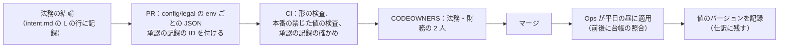
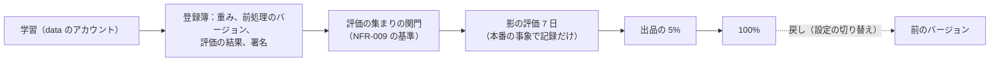

# Delivery: Mercari

変更からマージまで、CI、成果物、フラグ（`release.*`・`ops.*`・`legal.*`）と `legal.*` の値の管理、段階のデプロイと自動のロールバック、スキーマの変更の順序、台帳のマイグレーションの守り、アプリのリリースと最小のバージョン、ML のモデルと T&S の規則の出し方を決める。

前提となる決定と文書は次のとおり。

- トランクベース開発、squash、merge queue、Conventional Commits（[process.md](../../../../docs/process.md) の 4.1 節）
- リリースとロールバックの方針、デプロイの時間帯と凍結、自動のロールバックの条件（[runbooks/](../runbooks/README.md) の 3 節。値の正本）
- お金・取引の状態・期限の規則をフラグにしない。`legal.*` は法務の結論を入れる値（[AGENTS.md](../../AGENTS.md)、[ADR-0004](../decisions/0004-proceeds-model-under-payment-services-act.md)）
- 台帳は追記だけで、`UPDATE`・`DELETE` を DB の権限で禁止する（[ADR-0003](../decisions/0003-escrow-and-double-entry-ledger.md)）
- ML は影の評価を通してから出す（[ADR-0009](../decisions/0009-trust-and-safety-pipeline-boundary.md)、[ADR-0010](../decisions/0010-ml-boundary-for-pricing-and-recommendations.md)）

この文書で決めたことは次の ADR にある。

| ADR | 決定 |
| --- | --- |
| [0078](../decisions/0078-pipeline-schema-ordering-ledger-migrations-and-flag-governance.md) | デプロイの順を、広げる段のマイグレーション → Worker → ドメインのサービス（`ledger` は最後に単独）→ 入口 → Web にする。スキーマは広げる・移す・縮めるの 3 段で、縮める段は 2 回のリリースと 7 日と、古いアプリの最小のバージョンを過ぎてから。守る物（部分一意の索引、仕訳の釣り合いのトリガー、冪等の一意、排他の行、RLS のポリシー）を一覧にし、触れる変更はテックリードの承認を要る。台帳のマイグレーションは別の流れで、足すだけの DDL、仕訳の表への書き換えの禁止（権限とトリガー）、前後の不変条件と照合、参照の実装の再生、2 人の承認で行う。`legal.*` は別の AppConfig のアプリケーションにし、値の変更は法務と財務の承認の記録を付けた PR だけで、CI が本番の禁じた値を記録なしに変えさせない |
| [0079](../decisions/0079-app-release-trains-min-versions-and-model-releases.md) | アプリは週 1 回の列車で出し、App Store の段階のリリース（7 日）と Google Play の段階の公開で広げ、バージョンごとのクラッシュと API の誤りで止める。最小のバージョンは `ops.app_min_version_<platform>`（更新を促す）と `ops.app_force_version_<platform>`（426 で止める）の 2 つで持ち、`X-<Brand>-Client` で判定する。支える範囲は直近 26 の列車。強制の引き上げは、安全、お金と法令の表示、API の契約の削除のときだけ。ML のモデルと T&S の規則は、署名した成果物を評価の集まりの関門 → 7 日の影 → 出品の 5% → 100% で出し、戻しは前のバージョンへの設定の切り替え（デプロイなし） |

インフラの形は [infrastructure.md](infrastructure.md)、計測は [observability.md](observability.md)、品質の関門は [quality.md](../quality.md) の 2 節にある。

## 1. 変更からマージまで

- 変更は開発リポジトリの `changes/YYMMDD-<slug>/`（spec と plan）に結び付き、ブランチ `mercari/<YYMMDD-slug>` と worktree で作る（[process.md](../../../../docs/process.md) の 4.1 節）。
- エージェントの PR は GitHub App から作り、人が承認する。CODEOWNERS：`packages/transactions`・`ledger`・`fees`・`visibility`・`ml/` はテックリード、`config/legal/` は法務と財務、`infra/` は Ops、`migrations/ledger/` はテックリードと財務（[roadmap.md](../roadmap.md) の `dev-repo-bootstrap`）。
- merge queue は、キューの先頭の組み合わせで PR の CI をもう一度回してからマージする。

## 2. CI

### 2.1 PR の CI（必須）

| 検査 | 中身 | 失敗で止める |
| --- | --- | --- |
| lint・型 | TypeScript（`pnpm lint && pnpm typecheck`）、Python（ruff、mypy） | はい |
| 境界の lint | パッケージをまたぐ表の書き込み、ledger の表を `ledger`・`payouts` 以外が書く、`purchaseListing` の外で取引を作る、`listingVisible()` を通さない出品の返し（[ADR-0001](../decisions/0001-platform-and-stack.md)、[ADR-0002](../decisions/0002-transaction-state-machine-and-single-purchase.md)、[ADR-0007](../decisions/0007-single-tenant-and-party-visibility.md)） | はい |
| 依存 | 許可の一覧の外の依存、本家のコード・SDK、ライセンス、既知の脆弱性。SBOM の生成 | はい |
| 単体・表駆動・試験のベクトル | spec の決定表を読み込む表駆動（DT-TXN-001 など） | はい |
| 性質ベース | 2,000 試行（[quality.md](../quality.md) の 2.2 節） | はい。再実行で緑にしない |
| 参照の実装・仮想の時計・模型 | `txn-ref`・`ledger-ref`・`saved-search-ref`、`clock-sim`、`psp-sim`・`carrier-sim`・`push-sim`（触れたときだけ） | はい |
| 結合 | Testcontainers（PostgreSQL 18、Valkey、OpenSearch）、LocalStack | はい |
| ML | `ml/` に触れたとき：pytest、評価の集まりの関門（[ADR-0009](../decisions/0009-trust-and-safety-pipeline-boundary.md)） | はい |
| マイグレーション | 5 節の検査（広げる段だけか、守る物、ロックの時間の設定、索引の `CONCURRENTLY`） | はい |
| 事象の形 | outbox の事象の形の互換（5.3 節） | はい |
| `legal.*` の設定 | 3.3 節の検査 | はい |
| 個人のデータ | ロガー・トレースへの金庫・2 者の型の受け渡し、通知の中身の型（[ADR-0063](../decisions/0063-notification-kinds-lanes-and-payload.md)） | はい |
| 追跡 | 要件・性質・決定表の ID がテストの名前から参照されている（[process.md](../../../../docs/process.md) の 7 節） | はい |
| テストの緩和の検出 | テストの削除・skip・期待値の緩和、並行度・試行の数の引き下げ | 人の承認を求める |
| `release.*` の寿命 | 100% の後 30 日を過ぎたフラグ | 警告（45 日で失敗） |

### 2.2 夜間の CI

| 検査 | 中身 |
| --- | --- |
| 性質ベース | 各 20 万試行。購入は並行度 500（[quality.md](../quality.md) の 2.2.1 節 A） |
| 台帳 | 100 万の場面と `ledger-ref`（同 B） |
| 障害の注入 | 提供者・運送会社の時間切れ・重複・入れ替え、DB のフェイルオーバー、Valkey の停止、outbox の遅れ、ledger の停止 |
| E2E | 全部の流れ（Playwright、Maestro） |
| 負荷（縮めた規模） | 人気の出品、通知の fan-out（[capacity.md](capacity.md) の 7 節） |
| ログの走査 | 合成の利用者で全経路を流し、個人のデータの形を探す（[observability.md](observability.md) の 2.1 節） |
| eval | エージェントの eval（[quality.md](../quality.md) の 3 節）。`AGENTS.md`・Skills・Hooks が変わった週は必ず |

## 3. 成果物とフラグ

### 3.1 成果物

| 成果物 | 置き場所 | 検査 |
| --- | --- | --- |
| サービスのイメージ（TypeScript、Python） | ECR（東京、大阪へ写す） | 署名、SBOM、Inspector の走査。署名のないイメージを ECS のタスクの定義に使えない（デプロイの関門） |
| Web の資産 | S3（ハッシュの名前） | 署名した一覧（manifest） |
| マイグレーション | イメージの中（クラスタごとの別のイメージ） | 5 節 |
| ML のモデル | data のアカウントの登録簿 → prod の `ml-models` | 7 節 |
| アプリ | App Store Connect、Google Play | 6 節 |
| 設定（`legal.*`、手数料の表、送料の表、モデルの選択） | 開発リポジトリの `config/` → AppConfig | 3.3 節、JSON Schema の検査 |

### 3.2 フラグ

| 種類 | 名前の形 | 中身 | 変える人 | 寿命 |
| --- | --- | --- | --- | --- |
| `release.*` | kebab-case（`release.offers`） | 未完成の振る舞いの出し入れ、利用者の割合 | PM（リリースの判断） | 100% の後 30 日で消す |
| `ops.*` | snake_case（`ops.purchase_enabled`） | 止める・絞るだけの運用の切り替え（[runbooks/](../runbooks/README.md) の 2 節）、アプリの最小のバージョン | Ops | 常設 |
| `legal.*` | 法務の結論の値（`legal.proceeds_expiry_days`） | 売上金の期限、残高への移し替え、未成年の上限など | 法務と財務の承認（3.3 節） | 常設 |
| バージョンの付いた設定 | `fees.table`、`shipping.rate_table`、`models.<name>.active_version` | 手数料・送料の表、モデルと規則のバージョンの選択 | PM・財務（表）、T&S の責任者（規則・モデル） | 常設 |

- お金・取引の状態・期限の規則は `release.*` で切り替えない。コードのバージョンとして出し、本番の照合の指標で見る（[runbooks/](../runbooks/README.md) の 3 節）。
- `release.*` の評価は `app-api` と各サービスで同じ値を読む。アプリには、サーバーが評価した結果だけを返す（アプリの中でフラグを評価しない）。

### 3.3 `legal.*` の値の管理（ADR-0078）

- `legal.*` は AppConfig の別のアプリケーション `legal` に置き、`release`・`ops` と構成を分ける。本番の `legal` の構成の配信は、Ops の役割だけが行え、配信の方法は一度にすべて（段階なし。値の食い違いを作らない）。
- 値は開発リポジトリの `config/legal/<env>.json` に置き、JSON Schema（型、範囲、既定）で検査する。各値は `value`、`effective_from`、`approval_ref`（承認の記録の ID）を持つ。
- **本番の禁じた値の検査**：`legal.proceeds_forfeit_enabled`・`legal.proceeds_to_points_enabled`・残高への移し替え・期限切れの有効化、`legal.minor_*` の値を、本番の構成で既定（無効・未設定）から変える PR は、`approval_ref` が承認の記録（法務と財務の 2 人の署名、[intent.md](../intent.md) の L の番号）を指していなければ失敗にする（[ADR-0004](../decisions/0004-proceeds-model-under-payment-services-act.md) の Confirmation）。
- 適用は平日の 10〜15 時（[runbooks/](../runbooks/README.md) の 3 節）。適用の前と後で、取引と台帳の照合と台帳の不変条件を回す。
- `ledger` は、移し替え・期限切れの仕訳に、そのとき使った `legal` の構成のバージョンと `effective_from` を記録する。値を戻しても、過去の仕訳は書き換えない。
- `legal.*` の値の変更は監査の事象に残す（[security.md](security.md) の 6.4 節）。

## 4. デプロイ

### 4.1 段階

[runbooks/](../runbooks/README.md) の 3 節の段（検証 → 見張りの利用者 → 5% → 25% → 100%、各 30 分）を、次の仕組みで行う。

| 対象 | 割合の分け方 |
| --- | --- |
| 入口とドメインのサービス（HTTP） | ALB の重みつきのターゲットグループで、新旧のタスクの組に割合で送る。見張りの段は、`sentinel` の利用者の要求だけを新しい組へ送る規則（ヘッダー `X-<Brand>-Canary` を `app-api` が付ける） |
| Worker（SQS の消費者） | 新しいバージョンのタスクを 1 つだけ足して 30 分、次に半分、次に全部。消費者は同じキューを分け合う |
| `ledger`・`reconcilers`・`deadline-runner` | 単独の日に出し、新しいバージョンのタスクを 1 つ足して 30 分、照合の指標を見てから全部 |
| Web の資産 | 新しい manifest を見張りの利用者 → 全員 |

### 4.2 順序

1. マイグレーション（広げる段だけ。クラスタごと。ledger は 5.4 節の別の流れ）
2. Worker（`relay`、`deadline-runner`、`reconcilers`、消費者）
3. ドメインのサービス（`ledger` は最後に単独で）
4. `app-api`・`ops-api`
5. Web の資産

- 新しい事象の型を出すときは、消費者（2）を先に出して、作る側（3）を後に出す。新しい API の欄は、サービス（3）を先に、入口（4）を後に出す。

### 4.3 自動のロールバック

[runbooks/](../runbooks/README.md) の 3 節の条件（購入の 5xx・p99、出品と取引の照合の不一致、取引と台帳の照合の重複・両方、台帳の不変条件、期限の遅れ、措置の反映の遅れ、検索の 5xx）を、段ごとに新旧の組で比べる。

- 新しい組の値が、古い組の値の 2 倍を 5 分超える（または絶対の閾値を超える）と、新しい組への重みを 0 にして、タスクを止める。
- 正しさの指標（照合の不一致、台帳の不変条件）は、組で分けられない。デプロイの段の中で 1 件でも出たら、その段を止め、前のイメージへ戻し、人を呼ぶ。
- マイグレーションは戻さない（広げる段だけなので、前のイメージが今の DB で動く）。

### 4.4 時間帯と凍結

[runbooks/](../runbooks/README.md) の 3.1 節。デプロイの関門（CI の最後の段）が、対象のサービスの時間帯と凍結を確かめ、外れていれば Ops の承認（修正だけ）を求める。

## 5. スキーマの変更（ADR-0078）

### 5.1 3 つの段

| 段 | 中身 | 条件 |
| --- | --- | --- |
| 広げる | 表・列（NULL を許すか既定の値つき）・索引（`CONCURRENTLY`）・制約（`NOT VALID` で足し、後で `VALIDATE`）を足す | いつでも |
| 移す | 新旧の両方を書くコードを出し、古い行を埋める（バッチ 1,000 行、読み出しの写しの遅れと CPU で速さを絞る） | 広げる段の後 |
| 縮める | 古い列・表・索引を消す | 移す段の後、2 回のリリースと 7 日。古い列を読むアプリのバージョンが最小のバージョン（6 節）より古くなっていること |

- ロック：マイグレーションのセッションは `lock_timeout = 2s`、`statement_timeout = 5min`（索引の作成は別）。ロックを取れなければやり直す。
- 列の型の変更は、その場で行わない。新しい列を足して移す。
- マイグレーションはクラスタごと（core、ledger、content）に別のイメージで、別の順で当てる。クラスタをまたぐ一貫は outbox と冪等で取り、マイグレーションでは取らない。

### 5.2 守る物

次の DB の物に触れるマイグレーションは、CI が見つけて、テックリードの承認を求める（ledger の物は財務も）。

| 物 | 守るもの |
| --- | --- |
| `transactions` の部分一意の索引（出品ごとに進行中の取引は 1 つ） | 二重の販売なし（[ADR-0002](../decisions/0002-transaction-state-machine-and-single-purchase.md)） |
| `listings` の条件つきの更新に使う列（`status`、`version`、`price`） | 同上 |
| `journals` の `(source_type, source_id, event)` の一意、`escrow_settlements` の `transaction_id` の一意 | 振り替えの一回性（[ADR-0003](../decisions/0003-escrow-and-double-entry-ledger.md)） |
| 仕訳の釣り合いの遅延の制約のトリガー、`seller_proceeds`・`balance_reserved` の負でない CHECK | 台帳の不変条件 |
| FORCE RLS のポリシー、サービスの役割の許可リスト | 本人・2 者の分離（[ADR-0007](../decisions/0007-single-tenant-and-party-visibility.md)） |
| `vault_keys`、`address_vault` の暗号の列 | 住所の金庫（[ADR-0069](../decisions/0069-key-layout-and-vault-envelope-encryption.md)） |

### 5.3 outbox の事象の形

- 事象の形は `packages/events` に型で持ち、事象ごとに `schema_version` を持つ。
- 欄を足すのは互換（消費者は知らない欄を捨てる）。欄の削除・意味の変更は、新しい `schema_version` を作り、全部の消費者が新しい形を読めるようになるまで両方を出す。
- CI が、前のリリースの型と比べて、互換でない変更を見つける。
- データレイクへの写しも同じ型を読む。

### 5.4 台帳のマイグレーション（ADR-0078）

| 段 | 中身 |
| --- | --- |
| 権限 | 仕訳の表（`journals`、`journal_lines`、`escrow_settlements`）の持ち主は `ledger_owner`（ログインできない役割）。マイグレーションの役割 `ledger_migrator` は表の作成と変更はできるが、仕訳の表の `UPDATE`・`DELETE`・`TRUNCATE` の権限を持たない。加えて、仕訳の表に `UPDATE`・`DELETE` で例外を投げるトリガーを置く |
| 中身の制限 | 足すだけの DDL（表、列、索引、新しい口座の種類と仕訳の型の参照の行）。過去の仕訳の書き換え・埋め直しをしない。過去の値の直しは、打ち消しの仕訳（[ADR-0003](../decisions/0003-escrow-and-double-entry-ledger.md)） |
| 前の確かめ | 台帳の不変条件の検査が緑、直近の取引と台帳の照合の不一致 0、3 者の照合の 3 営業日を過ぎた差 0 |
| 試し | staging の本番の形の大きさの合成の台帳（1 億行）で当てて、時間とロックを測る。新しいスキーマで `ledger-ref` の 100 万の場面を再生して、残高が一致する |
| 承認 | テックリードと財務の 2 人（勘定科目・仕訳の型の追加は財務が必須） |
| 時間帯 | 平日 10〜15 時。月末と月初の 2 営業日、大型の企画の日の前後 48 時間を除く（[runbooks/](../runbooks/README.md) の 3.1 節） |
| 後の確かめ | 台帳の不変条件、取引と台帳の照合、残高の行と仕訳の和 |
| 戻し | DDL は戻さない（足しただけ）。コードを前のイメージに戻す。仕訳の誤りは打ち消しの仕訳 |

## 6. アプリのリリースと最小のバージョン（ADR-0079）

### 6.1 列車

| 曜日 | 作業 |
| --- | --- |
| 月 10:00 | 列車の切り出し（`main` から release のブランチ。以後は修正の cherry-pick だけ） |
| 月〜火 | E2E（Maestro）、見張りの利用者の端末での確かめ、QA の判定 |
| 水 | 審査に出す |
| 審査の後 | iOS は App Store の段階のリリース（7 日で 1%・2%・5%・10%・20%・50%・100%）。Android は Google Play の段階の公開（1% → 5% → 20% → 50% → 100%、各 1〜2 日） |

- 止める条件：そのバージョンのクラッシュのない利用者の率が 99.5% を下回る、そのバージョンの API の 5xx・4xx の率が前のバージョンの 2 倍、そのバージョンの購入の失敗の率が前のバージョンより 1 ポイント高い。App Store の段階のリリースは止められ（合計 30 日まで）、Play の段階の公開も止められる（出典）。
- 新しい機能は、アプリに入れた上で `release.*` で閉じておき、アプリの普及の後にサーバーで開ける。アプリのリリースの日と機能の公開の日を分ける。

### 6.2 最小のバージョン

| 設定 | 動き |
| --- | --- |
| `ops.app_min_version_ios`、`ops.app_min_version_android` | これより古いバージョンには、起動の時に更新を促す画面（閉じられる） |
| `ops.app_force_version_ios`、`ops.app_force_version_android` | これより古いバージョンの要求に、`app-api` が 426（`upgrade_required`）を返す。アプリは更新の画面だけを出す |

- 判定は `X-<Brand>-Client: <platform>/<version> (<build>)` で行う（[accounts-and-devices.md](accounts-and-devices.md) の 11 節）。ヘッダーのない要求は、Web 以外は 426。
- 支える範囲：直近 26 の列車（約 6 か月）。それより古いバージョンは `ops.app_min_version_*` で促す。
- 強制（`force`）を上げるのは、次のときだけ：安全の脆弱性の修正、お金と法令の表示の変更（購入の確認の画面の事項。法務の確認待ち：L3）、API の契約の削除（5.1 節の縮める段の条件）。安全の修正を除き、14 日前からアプリの中で知らせる。
- 強制の引き上げは Ops が行い、PM に知らせる。強制で止まる利用者の数（バージョンごとの DAU）を事前に見る（[observability.md](observability.md) の 3 節）。

### 6.3 API の互換

- `app-api` の応答は欄を足すだけにする。欄の削除・意味の変更は、その欄を読む全部のバージョンが支える範囲から外れてから行う。
- 各経路に `min_client`（その経路を使える最小のバージョン）を注釈で持ち、古いバージョンからの呼び出しの数を指標にする。
- Web はサーバーと同時に出す。

## 7. ML のモデルと T&S の規則の出し方（ADR-0079）

- 成果物：重み、前処理のコードのバージョン、評価の集まりのバージョンと結果、学習のデータの出どころの一覧、署名。署名のないモデルを `ml-inference` は読まない。
- 関門：評価の集まりで NFR-009 の基準（偽ブランドの保留の再現率 90%・適合率 80%、禁止の品の種類の再現率 95%）を満たす。満たさなければ出さない（[ADR-0009](../decisions/0009-trust-and-safety-pipeline-boundary.md)）。
- 影の評価：本番の事象で 7 日、措置せずに点と規則の結果を記録し、今のモデルとの差（`hold` の量、審査の判定との一致）を見る。審査の待ち行列の量が 1.5 倍を超える変更は Ops と合意してから出す（[quality.md](../quality.md) の 2.2.1 節 F）。
- 切り替え：`models.<name>.active_version` と、割合の `models.<name>.rollout_percent`（出品の ID のハッシュで分ける）。T&S の規則のセットも同じ形（`rules.<set>.active_version`）で、規則の変更は T&S の責任者の承認（[ADR-0009](../decisions/0009-trust-and-safety-pipeline-boundary.md)）。
- 戻し：`active_version` を前のバージョンに戻す（デプロイなし。[runbooks/](../runbooks/README.md) の 3 節）。
- 時間帯：平日 10〜16 時、大型の企画の日の前後 24 時間を除く（[runbooks/](../runbooks/README.md) の 3.1 節）。
- 価格の提案の統計（MVP）は ML ではなく、コードのバージョンとして出す（[ADR-0010](../decisions/0010-ml-boundary-for-pricing-and-recommendations.md)）。

## 8. ホットフィックス

- 本番の障害の修正は、`main` に入れて通常の段で出す。段の各 30 分は、Ops の判断で 10 分に縮めてよい（自動のロールバックの条件は同じ）。
- アプリの修正は、列車の外の臨時のバージョンで出し、審査の短縮を申請できる（Apple の迅速の審査。条件は**未検証**）。
- 凍結の中の修正は、Ops の承認（作成者と別の人）。

## 9. 指標

| 指標 | 目標（S1） |
| --- | --- |
| デプロイの頻度（サービス） | 平日に毎日 |
| 変更のリードタイム（マージから本番 100%） | 中央値 1 日 |
| 変更の失敗の率（自動のロールバック・ホットフィックス） | 10% 以下 |
| 復旧までの時間（ロールバック） | 中央値 15 分 |
| アプリのクラッシュのない利用者の率（バージョンごと） | 99.5% 以上 |
| 支える範囲より古いアプリの DAU の率 | 2% 以下 |
| `release.*` の 30 日を過ぎた残り | 0 |

## 10. data-model への項目

| 表・置き場所 | 中身 | 節 |
| --- | --- | --- |
| core：`deployments` | サービス、イメージのダイジェスト、段、始まり、終わり、結果、ロールバックの理由 | 4 |
| 各クラスタ：`schema_migrations` | マイグレーションの ID、段（広げる・移す・縮める）、守る物に触れたか、承認者、当てた時刻 | 5 |
| core：`app_versions` | プラットフォーム、バージョン、ビルド、列車、公開の日、段階の割合、止めた時刻と理由 | 6 |
| core：`legal_config_changes` | キー、前と後の値、`effective_from`、`approval_ref`、適用の時刻、適用した人 | 3.3 |
| ledger：仕訳に足す列 | `legal_config_version`（移し替え・期限切れの仕訳） | 3.3 |
| data のアカウント：モデルの登録簿 | モデル、バージョン、重みの場所、署名、評価の結果、影の評価の結果、状態 | 7 |
| AppConfig | `ops.app_min_version_*`、`ops.app_force_version_*`、`models.*`、`rules.*`、`legal` のアプリケーション | 3、6、7 |

## 11. テストと性質

| ID（草案） | 内容 | テスト |
| --- | --- | --- |
| — | マイグレーションの検査：広げる段の PR に、列の削除・型の変更・`CONCURRENTLY` でない索引が入らない。守る物に触れたら承認を求める | CI の自己の試験（悪い例のマイグレーションを流して失敗すること） |
| — | 台帳：`ledger_migrator` の役割で仕訳の表の `UPDATE`・`DELETE` が失敗する。トリガーが例外を投げる | 結合 |
| — | `legal.*`：承認の記録のない本番の禁じた値の変更が失敗する | CI の自己の試験 |
| — | 最小のバージョン：`force` より古い `X-<Brand>-Client` に 426、ヘッダーなしのアプリに 426 | 表駆動 |
| — | 事象の形：互換でない変更を CI が見つける | CI の自己の試験 |
| — | 自動のロールバック：staging で購入の 5xx を注入し、新しい組の重みが 0 になる | staging |

## 12. Story の候補

| Epic | Story | 中身 |
| --- | --- | --- |
| E1 | `ci-pipeline-baseline` | 2 節 |
| E1 | `flags-appconfig` | 3.2・3.3 節（ADR-0078） |
| E1 | `deploy-pipeline-and-rollback` | 4 節 |
| E1 | `migration-guardrails` | 5.1〜5.3 節（ADR-0078） |
| E9 | `ledger-migration-pipeline` | 5.4 節（ADR-0078） |
| E2 | `app-release-train` | 6 節（ADR-0079） |
| E14 | `model-and-rule-release` | 7 節（ADR-0079） |

## 13. 未解決の問い

### 決定（2026-10-10、既定案）

- **順序**：マイグレーション → Worker → サービス（ledger 最後）→ 入口 → Web（ADR-0078）。
- **スキーマ**：広げる・移す・縮める、縮めるは 2 回のリリースと 7 日と最小のバージョンの後、守る物の一覧（ADR-0078）。
- **台帳のマイグレーション**：別の流れ、権限とトリガー、前後の確かめ、2 人の承認（ADR-0078）。
- **`legal.*`**：別のアプリケーション、承認の記録の付いた PR だけ、平日の昼の適用（ADR-0078）。
- **アプリ**：週 1 回の列車、段階のリリース、最小と強制の 2 つのバージョン、26 の列車を支える（ADR-0079）。
- **ML と規則**：関門 → 影 7 日 → 5% → 100%、戻しは設定（ADR-0079）。

### 持ち越し

| 問い | いつ・どう決めるか |
| --- | --- |
| 購入の確認の画面の事項（強制の引き上げの理由になる） | **法務の確認待ち：L3** |
| Apple の迅速の審査の条件 | E2 の `app-release-train`（**未検証**） |
| ALB の重みつきの分け方と ECS の青と緑のデプロイの組み方 | E1 の `deploy-pipeline-and-rollback` |
| 合成の台帳の 1 億行でのマイグレーションの時間 | E9 の `ledger-migration-pipeline` |

## 出典

いずれも 2026-10-10 に確認。

- Apple, [Release a version update in phases](https://developer.apple.com/help/app-store-connect/update-your-app/release-a-version-update-in-phases/)：7 日で 1%・2%・5%・10%・20%・50%・100%。止められ、止めた時間は合計 30 日まで
- Google, [Release app updates with staged rollouts](https://support.google.com/googleplay/android-developer/answer/6346149)：割合を選び、手で上げ、止められる
