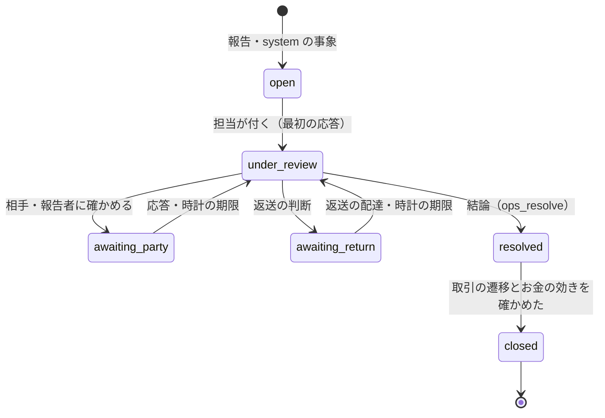
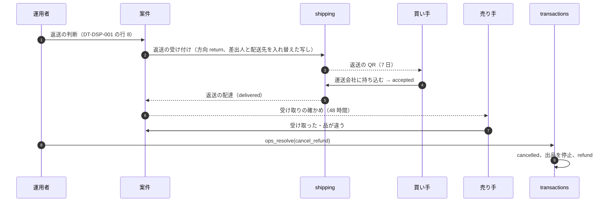

# Disputes and Customer Support: Mercari

取引の問題と、運用の介入を決める。問題の報告と紛争の案件、紛争の状態と SLA の時計、証拠と相手への確かめ、運用の判断の結論と取引・お金への効き方、返送、補償、売上金の保留、受取評価の後の問題、問い合わせ、運用者の権限と承認、開示の請求（法務の確認待ち L7）と捜査機関の照会（法務の確認待ち L6）の枠を扱う。

前提となる決定は次のとおり。

- 紛争（`disputed`）と運用の保留（`on_hold`）の間は取引の期限を止め、再開で止めた時間だけずらす。運用の介入も遷移の関数と DT-TXN-001 を通る（[ADR-0002](../decisions/0002-transaction-state-machine-and-single-purchase.md)、[ADR-0025](../decisions/0025-transaction-decision-table-and-deadline-pause.md)、[transactions-and-state-machine.md](transactions-and-state-machine.md)）
- お金は仕訳の型でだけ動かす。手の仕訳は財務の承認と 2 人の確認の後に、打ち消しの仕訳だけで行う（[ADR-0003](../decisions/0003-escrow-and-double-entry-ledger.md)、[ledger-and-proceeds.md](ledger-and-proceeds.md)）
- 運用者は RLS を外す役割を持たず、案件に結び付けた JIT の権限、理由の入力、監査ログで見る。住所・本人確認・口座は別の権限（[ADR-0007](../decisions/0007-single-tenant-and-party-visibility.md)）
- チャージバックの流れと負担の表は [payments-and-escrow.md](payments-and-escrow.md) の 10 節、返送と配送の事故は [shipping-integrations.md](shipping-integrations.md) の 8 節
- 措置（偽ブランド、禁止品、アカウントの制限）は T&S の規則と審査が `moderation_actions` に書いてから効かせる（[ADR-0009](../decisions/0009-trust-and-safety-pipeline-boundary.md)。trust-and-safety の領域）

この文書で決めたことは次の ADR にある。

| ADR | 決定 |
| --- | --- |
| [0059](../decisions/0059-dispute-cases-and-sla-timers.md) | 紛争を案件（`cases`）として持ち、6 つの状態と 6 種類の SLA の時計を DB の期限の列で動かす。時計の期限は案件の優先度を上げ、待ち行列の先頭に出すだけで、お金を自動では動かさない。結論は 4 つ（続ける、受取とみなす、一部の返金、返金）で、遷移の関数の `ops_resolve` だけを通す |
| [0060](../decisions/0060-ops-money-interventions-and-proceeds-hold.md) | 運用のお金の介入（返金、一部の返金、補償、売上金の保留と解除）は、決まった仕訳の型だけで行い、額の閾値（返金 3 万円、補償 3,000 円）を超えたら別の人の承認を要する。売上金の保留は `seller_proceeds_held` の口座への振り替えで持ち、90 日ごとに見直す |

## 1. 範囲

- 扱う：
  - 問題の報告（買い手・売り手）、紛争の種類、報告できる時点
  - 紛争の案件、状態、SLA の時計、待ち行列の優先度
  - 証拠（写真、運送会社の追跡、メッセージの記録）と相手への確かめ
  - 結論の決め方の既定（DT-DSP-001）と、取引・お金への効き方
  - 返送の流れ
  - 運用のお金の介入（返金、一部の返金、補償、売上金の保留）と承認
  - 受取評価・完了の後の問題
  - 問い合わせ（取引に結び付かない問い合わせを含む）
  - 運用者の役割と権限
  - 販売業者等の情報の開示の請求（法務の確認待ち L7）、捜査機関・行政の照会（法務の確認待ち L6）の枠
- 扱わない：
  - 措置の判定（偽ブランドの確定、アカウントの停止）と異議（trust-and-safety の領域）
  - 運用の画面の作り、JIT の権限の発行と監査ログの仕組み（security の領域）
  - 通知の文言（notifications の領域）

## 2. 要件

| 要件 | 目標 | NFR |
| --- | --- | --- |
| 期限の停止 | 紛争・保留の間、取引の期限は働かない。再開で止めた時間だけ延びる | NFR-012 |
| 一回性 | 運用の介入で、release・refund・settle の重複・両方 0 | NFR-005 |
| お金が合う | 介入の仕訳は型の表の中だけ。手の仕訳は 2 人の承認 | NFR-004 |
| 見える範囲 | 運用者は案件に結び付いた範囲だけを見る。住所・口座・本人確認は別の権限。CS が住所を見た事象は記録つきだけ | NFR-014 |
| 応答の速さ | 紛争の最初の応答 p95 24 時間（偽ブランドの疑いは 4 時間） | NFR-009（審査の待ち時間）、この領域の値 |
| 運用の画面 | 月間 99.5% | NFR-007 |

## 3. 本家の形（確かめたこと）

- 受取評価も事務局への問い合わせもなければ、発送の通知の 9 日後の 13 時以降に自動で取引が完了する（[ヘルプの記事 61sell](https://help.jp.mercari.com/guide/articles/61sell/)、2026-10-10 に確認）。問い合わせが自動の完了を止めることが読める。
- 紛争の種類、事務局の応答の時間、返品の送料の負担、補償の規則は、公式の資料で確かめられなかった（**未検証**）。本システムの値を使う。

## 4. 問題の報告と紛争の種類

| 種類 | 報告できる人 | 報告できる取引の状態 | 優先度の既定 |
| --- | --- | --- | --- |
| `not_received`（届かない） | 買い手 | `shipped`・`delivered` | 中 |
| `not_as_described`（説明と違う） | 買い手 | `delivered`・`shipped` | 中 |
| `wrong_item`（違う品） | 買い手 | 同上 | 中 |
| `damaged`（破損） | 買い手 | 同上 | 中 |
| `counterfeit_suspected`（偽ブランドの疑い） | 買い手 | 同上 | 高（4 時間） |
| `seller_unresponsive`（売り手の応答がない） | 買い手 | `paid`・`cancel_requested` | 低 |
| `buyer_unresponsive`（買い手の応答がない） | 売り手 | `paid`・`cancel_requested`・`shipped`・`delivered` | 低 |
| `other` | どちらも | `paid`〜`delivered` | 低 |
| `chargeback` | system | `paid`〜`received`、完了の後 | 高 |
| `carrier_exception` | system | `shipped`・`delivered` | 中 |
| `moderation` | system（T&S の措置） | `shipped`・`delivered` | 高 |

- 報告は取引の画面から、種類・本文・写真（10 枚まで、写真の処理は listings-and-photos の領域と同じ形で位置情報を消す）で出す。本文と写真は案件にだけ置き、取引のメッセージには出さない。
- 報告で DT-TXN-001 の行 20（system の種類は行 21・29・30）を通し、取引を `disputed` にする。1 つの取引に開いている紛争の案件は 1 つ。2 つ目の報告は同じ案件に足す。
- `received` 以降は報告を受けない。受取評価の後の問題は問い合わせ（9 節）にする。完了の後のチャージバックは、取引の状態を変えずに案件だけを開く。

## 5. 紛争の案件（[ADR-0059](../decisions/0059-dispute-cases-and-sla-timers.md)）

### 5.1 状態

- 案件の状態は `cases` の行で持ち、取引の状態とは別。取引は案件の間ずっと `disputed`（完了の後のチャージバックは取引を変えない）。
- `resolved` で `ops_resolve` を遷移の関数に送る。遷移とお金の仕訳（outbox の後）を確かめてから `closed` にする。確かめが 15 分を超えたらチケット。

### 5.2 SLA の時計

| 時計 | 始まり | 長さ（本システムの値） | 期限で起きること |
| --- | --- | --- | --- |
| `first_response_due_at` | `open` | 24 時間（優先度 高 は 4 時間） | 待ち行列の先頭へ、CS の責任者に通知 |
| `party_response_due_at` | `awaiting_party` | 48 時間 | `under_review` に戻し、「応答なし」の印を付ける |
| `return_ship_due_at` | `awaiting_return` | 7 日（返送の QR の発行から） | `under_review` に戻し、「返送なし」の印 |
| `return_confirm_due_at` | 返送の配達 | 48 時間（売り手の受け取りの確かめ） | `under_review` に戻し、「確かめなし」の印 |
| `resolution_target_at` | `open` | 7 日 | 責任者に通知。超えた案件の数を SLI にする |
| `chargeback_evidence_due_at` | チャージバックの開始 | 提供者の期限の 2 営業日前 | 責任者と財務に通知 |

- 時計は案件の行の期限の列と `next_timer_at` で持ち、`deadline-runner` と同じ 1 分ごとの処理で拾う（[ADR-0002](../decisions/0002-transaction-state-machine-and-single-purchase.md) の考え方）。
- **時計の期限は、案件の状態と優先度を変えるだけで、お金を自動では動かさない**。結論は運用者が決める（[ADR-0059](../decisions/0059-dispute-cases-and-sla-timers.md)）。
- 待ち行列の順：優先度（高 → 中 → 低）→ 期限の近い時計 → 開いた時刻。

### 5.3 例：届かない（配達済みの記録がある）

前提：価格 3,000 円、匿名の配送、10/12 17:40 に引き受け、`auto_receive_at` 10/21 13:00。

| 時刻 | 事象 | 案件 | 取引 |
| --- | --- | --- | --- |
| 10/14 11:20 | 運送会社の配達済み | — | `delivered` |
| 10/16 09:00 | 買い手が `not_received` を報告 | `open`、`first_response_due_at` 10/17 09:00 | `disputed`（止める。残り 5 日 4 時間） |
| 10/16 15:00 | 担当が付き、運送会社の照会を見て、配達の場所（宅配ボックス）の確かめを買い手に頼む | `under_review` → `awaiting_party`（10/18 15:00） | 同じ |
| 10/17 20:00 | 買い手が「宅配ボックスにあった」と応答 | `under_review` | 同じ |
| 10/17 20:30 | 結論 `continue` | `resolved` | `delivered` に戻る。`auto_receive_at` = 10/21 13:00 ＋ 1 日 11 時間 30 分 = 10/23 00:30 |
| 10/17 20:31 | 遷移を確かめた | `closed` | — |
| 10/18 08:00 | 買い手の受取評価 | — | `received` |

- 最初の応答まで 6 時間、結論まで 1 日 11 時間 30 分。

## 6. 結論と、取引・お金への効き方

### 6.1 結論の種類

| 結論 | DT-TXN-001 | お金 | 出品 |
| --- | --- | --- | --- |
| `continue` | 行 35（`resume_state` に戻す、期限をずらす） | なし | 取引中のまま |
| `treat_received` | 行 36（`received`） | 完了で release | 完了で売り切れ |
| `partial_refund`（額） | 行 36（`received`、`refund_amount`） | 完了で settle（買い手へ額、残りを売り手へ） | 完了で売り切れ |
| `cancel_refund` | 行 37（`cancelled`） | refund（全額） | 発送の後は停止（[ADR-0027](../decisions/0027-cancellation-rules-and-listing-restoration.md)） |

- 一部の返金の settle：残りの代金（価格 − 返金の額）に、[ledger-and-proceeds.md](ledger-and-proceeds.md) の 5.1 節の式（販売の手数料と送料）を当てる。売り手の売上金が負になる額は選べない（それなら `cancel_refund`）。
- 一部の返金は、買い手と売り手の両方の同意（案件に記録）を要する。片方が同意しなければ、`cancel_refund`（返送つき）か `treat_received` にする。

**例：価格 3,000 円、送料 210 円、破損が軽く、両者が 1,000 円の返金に同意**

| 口座 | settle の行 |
| --- | --- |
| `escrow:T1` | 借方 3,000 |
| 買い手へ（カードなら `psp_receivable`） | 貸方 1,000 |
| `fee_revenue:sales` | 貸方 200（残りの 2,000 円の 10%） |
| `shipping_payable:A` | 貸方 210 |
| `seller_proceeds:S` | 貸方 1,590（2,000 − 200 − 210） |
| 和 | 0 |

- 返金の上限：この取引では `2,000 − 200 − 210 ≥ 0` を保つ額まで（2,790 円の返金なら残り 210、手数料 21、売上金 −21 で不可）。

### 6.2 結論の既定 DT-DSP-001

運用者の判断の既定。上から最初に一致した行を出し、運用者が根拠を案件に書いて決める。表と違う結論には理由のコードを要する。

| # | 種類 | 証拠 | → 既定の結論 | お金の補い |
| --- | --- | --- | --- | --- |
| 1 | どれでも | T&S が売り手に措置（偽の発送、偽ブランドの確定） | `cancel_refund`（返送なし） | — |
| 2 | `counterfeit_suspected` | T&S の審査の前 | 審査を待つ（`awaiting_party` で T&S へ） | — |
| 3 | `counterfeit_suspected` | 審査で偽ブランドでない | `continue` | — |
| 4 | `not_received` | 運送会社の `lost` | `cancel_refund` | 売り手に補償（売上金の見込みの額。匿名の配送のとき）、運送会社に事故の請求 |
| 5 | `not_received` | 配達済み、買い手が見つけた・応答なし | `continue` | — |
| 6 | `not_received` | 引き受けの後 7 日動かない | 運送会社に照会、`awaiting_party` | — |
| 7 | `damaged` | 運送会社の `damaged`（輸送中の破損） | `cancel_refund`（返送は運送会社の手順） | 行 4 と同じ |
| 8 | `not_as_described`・`wrong_item`・`damaged`（梱包） | 写真が説明と違うことを示す | 返送（`awaiting_return`）→ 返送の配達と売り手の確かめで `cancel_refund` | 返送の送料は MVP では本システムが持つ。売り手の責めの印を T&S へ |
| 9 | 同上 | 両者が一部の返金に同意 | `partial_refund` | — |
| 10 | 同上 | 証拠が足りない、報告者の応答なし | `treat_received` | — |
| 11 | `seller_unresponsive` | 発送の期限を過ぎた | 買い手にキャンセルの申し出を案内（DT-TXN-001 の行 18）して `continue` | — |
| 12 | `buyer_unresponsive` | 配達済み | `continue`（自動の完了の期限に任せる） | — |
| 13 | `carrier_exception`（`returned_to_sender`・`refused`） | 品が売り手に戻った | `cancel_refund` | 受け取りの拒否なら、往復の送料の負担を運用が決める |
| 14 | それ以外 | — | 運用の判断 | — |

- 偽ブランドと確かめた品の扱い（売り手に返すか、保管・廃棄か、警察への連絡）は、**法務の確認待ち（L6・L10）**。確認まで、返送の判断をせず運用の待ち行列に止める。

### 6.3 返送

- 返送の間、取引は `disputed` のまま。返送の送料は、MVP では本システムが `compensation_expense` で持つ（運送会社への支払いは `shipping_payable`）。売り手から返送の送料を回収する仕組み（回収の口座、release からの差し引き）は MVP の後に検討し、それまでは売り手の責めの事実を T&S の信号にする。
- 返送が 7 日の内に出されなければ、案件を `under_review` に戻し、既定は `treat_received`。

## 7. 運用のお金の介入（[ADR-0060](../decisions/0060-ops-money-interventions-and-proceeds-hold.md)）

### 7.1 介入の一覧と承認

| 介入 | 通る所 | 仕訳の型 | 1 人で行える上限（本システムの値） | 超えたとき |
| --- | --- | --- | --- | --- |
| 取引の取り消しと返金 | `ops_resolve(cancel_refund)` | `refund` | 30,000 円 | 別の人（`cs_lead`）の承認 |
| 一部の返金 | `ops_resolve(partial_refund)` | `settle` | 30,000 円 | 同上 |
| 補償（ポイント） | ledger の API | `compensation`（→ `points`） | 3,000 円 | `cs_lead` の承認 |
| 補償（売上金） | ledger の API | `compensation`（→ `seller_proceeds`） | 3,000 円 | `finance_approver` の承認 |
| 売上金の保留 | ledger の API | `proceeds_hold` | 上限なし（守りの操作） | — |
| 売上金の保留の解除 | ledger の API | `proceeds_unhold` | 保留を付けた人と別の人 | — |
| 取引の期限の保留 | `ops_hold`・`ops_release` | なし | — | — |
| 手の仕訳（打ち消し、仮勘定の解消） | ledger の API | `suspense_resolve`、打ち消し | 不可 | 財務の 2 人の承認（[ledger-and-proceeds.md](ledger-and-proceeds.md) の 9.2 節） |

- どの介入も、案件の ID、理由のコード、JIT の権限を持つ。承認は `case_approvals` に記録し、承認者は申請者と別の人。仕訳の `approved_by` に両者を残す。
- 運用者 1 人の 1 日の補償の合計の上限（既定 30,000 円）を置き、超えたら止める。
- 運用の画面から取引を作る・遷移の関数を通らずに状態を変える・型の表にない仕訳を書く経路は作らない（[quality.md](../quality.md) の 3 節の eval）。

### 7.2 補償

- 補償は、本システムの負担で利用者に払う（`compensation_expense`）。ポイントか売上金。売上金の補償は売上金のロットになり、期限の規則に従う（[ADR-0035](../decisions/0035-proceeds-lots-expiry-and-kyc-conversion.md)）。
- 冪等キーは `(compensation, <case_id>, grant)`。1 つの案件の同じ利用者に補償は 1 回。追加の補償は案件を分ける。
- 運送会社の事故の請求で戻った額は、補償の費用を戻す形で記録する（財務と決める。[shipping-integrations.md](shipping-integrations.md) の 8 節）。

### 7.3 売上金の保留

- 保留は `seller_proceeds` から `seller_proceeds_held` への振り替え（型 13）。保留の行（`proceeds_holds`：利用者、額、理由、案件、期限、付けた人）を持つ。額は「指定の額」か「全額」。
- 理由：紛争（売り手の側の疑い）、チャージバック（完了の後。額はチャージバックの額）、T&S の調べ（偽の発送、乗っ取りの疑い）、法令の照会。
- 保留中の売上金は、振込・購入・期限の処理の対象にならない（保留はロットを消し、解除で元のロットへ戻す。保留の間もロットの期限は進むが、解除の時に期限を過ぎていれば、その日の期限の処理が扱う。期限の処理の 30 日前の通知は保留の間は出さない）。
- 保留は 90 日ごとに見直す（期限の時計で `cs_lead` に通知）。解除しない保留を延ばすには理由の入力を要する。
- 振込中（`payout_in_transit`）の額は保留できない。保留は残りの売上金だけに効く。

## 8. 受取評価・完了の後の問題

- `received`・`completed` の後の問題は、問い合わせの案件（種類 `post_receipt`）にする。取引の状態は変えない。
- 本システムができるのは、本システムの負担での補償（7.2 節）と、T&S への通報（偽ブランドの疑い、偽の発送）まで。売り手から売上金を取り戻すことは、チャージバック（[payments-and-escrow.md](payments-and-escrow.md) の 10 節）と、T&S の措置に伴う保留と回収だけにする。措置に伴う回収の規約の根拠は **法務の確認待ち（L1・L7）**。

## 9. 問い合わせ

| 項目 | 決め |
| --- | --- |
| 受け付け | アプリ・Web の問い合わせのフォーム（種類、本文、写真 10 枚まで、関係する取引・出品の ID） |
| 種類 | アカウント、出品、取引（受取評価の後を含む）、支払い、売上金・振込、配送、通報の続き、その他 |
| 見える範囲 | 問い合わせた本人と、案件の担当。取引の ID を付けたら、担当はその取引の 2 者の範囲を JIT で読める |
| SLA | 最初の応答 p95 24 時間（本システムの値） |
| 返事 | 運用の画面の返事の型（文言は notifications の領域、法務の確認が要る文言は L4・L7） |
| 個人のデータ | 本文と写真は content の Aurora と S3 に置き、ログ・データレイクに入れない。案件の終わりから 3 年で消す（法務の確認待ち L5） |

- エージェントは、問い合わせの分類と返事の草案を作れるが、送信・お金の介入・措置は人が行う（[roadmap.md](../roadmap.md) の「エージェントに任せないこと」）。

## 10. 開示の請求と、捜査機関・行政の照会（枠）

| 請求 | 枠 | 法務の確認待ち |
| --- | --- | --- |
| 販売業者等の情報の開示の請求（取引デジタルプラットフォーム消費者保護法 第 5 条） | 専用の受け付け、請求者の確かめ、売り手が販売業者等に当たるかの判断の記録、開示する項目の最小化、売り手への通知、記録の保存 | L7（本システムが取引デジタルプラットフォームに当たるか、手順、期限） |
| 捜査機関・行政の照会（盗品の疑い、詐欺など） | 専用の窓口、照会の文書の確かめ、法務の担当（`legal_officer`）の判断、出すデータの最小化、`legal_hold`（住所の写しを消さない、取引と仕訳を保全） | L6（古物営業法の照会・品触れへの対応、記録の保存の期間） |

- どちらも `cases`（種類 `legal_request`）で扱い、通常の CS の待ち行列と分ける。担当は `legal_officer` の役割だけ。データの書き出しは、JIT の権限、2 人の確認、書き出しの記録（何を、誰に、いつ）を要する。
- 応答の判断はエージェントに任せない（[roadmap.md](../roadmap.md)）。E16 の `disclosure-requests`・`law-enforcement-requests` の spec は、L7・L6 の確認まで承認しない。

## 11. 運用者の役割

権限の種類、JIT の発行、見せる操作、監査の形は security の領域で決めた（[security.md](security.md) の 6 節、[ADR-0070](../decisions/0070-operator-access-vault-reveal-and-audit.md)）。ここでは、紛争と CS の役が、どの権限で何を行えるかを決める。

| 役 | 権限（ADR-0070） | 行える操作（この領域） |
| --- | --- | --- |
| `cs_agent` | `case.view`、`case.view_messages`（通報・紛争のメッセージだけ。範囲は法務の確認待ち L11） | 案件の更新、`ops_hold`、`ops_resolve`（7.1 節の上限まで）、ポイントの補償（上限まで） |
| `cs_lead` | 上に加えて `vault.reveal_address`（2 人目の承認） | 承認、保留の解除、上限を超える返金、配送の事故の住所の確かめ |
| `finance_approver` | `ledger.adjust`、`vault.reveal_bank`（2 人目の承認） | 売上金の補償の承認、手の仕訳の承認 |
| `ts_reviewer` | trust-and-safety の領域の権限 | 措置（`moderation_actions`）、売上金の保留の依頼 |
| `legal_officer` | `legal.respond`（法務の責任者の承認） | `legal_request` の案件、書き出し、`legal_hold` |

- 本人確認の書類（`kyc.view`）は紛争の案件の役に付けない（identity-verification の領域）。

## 12. 障害のときの振る舞い

| 障害 | 影響 | 振る舞い |
| --- | --- | --- |
| 運用の画面の停止 | 判断ができない | 取引は `disputed` のまま期限が止まっているので、利用者のお金は動かない。SLA の時計は進み、復旧の後に優先度で並ぶ |
| 遷移の失敗（`version_conflict`） | `ops_resolve` が通らない | 取引を読み直し、案件の画面に最新の状態を出してやり直す |
| 仕訳の失敗（残高の不足：保留する売上金がない） | 保留ができない | 保留できた額を記録し、残りは次の release で保留する印を付ける |
| 時計の処理の停止 | SLA の通知が遅れる | 再開で拾う。お金は動かないので、遅れの影響は応答の遅れだけ |
| 承認者の不在 | 上限を超える介入が止まる | 承認の待ち行列の古さが 4 時間を超えたら `cs_lead` 全員に通知 |

## 13. 上限

| 対象 | 値 |
| --- | --- |
| 1 取引の開いている紛争の案件 | 1 |
| 報告の写真 | 10 枚、1 枚 20 MB |
| 報告の本文 | 2,000 文字 |
| 1 人で行える返金・一部の返金 | 30,000 円 |
| 1 人で行える補償 | 3,000 円、1 日の合計 30,000 円 |
| 売上金の保留の見直し | 90 日ごと |
| SLA の時計 | 5.2 節 |
| 案件の保存 | 終わりから 3 年（法務の確認待ち L5・L7） |

## 14. data-model への項目

| 表・置き場 | 中身 | 主キー・索引 | 節 |
| --- | --- | --- | --- |
| `cases`（content。紛争の案件は取引の 2 者が報告の内容を読める） | 種類（`dispute`・`inquiry`・`post_receipt`・`legal_request`）、取引・出品、報告者、紛争の種類、状態、優先度、担当、時計の列、`next_timer_at`、結論、DT-DSP-001 の行、理由のコード | `id`、部分一意 `(transaction_id) WHERE kind = 'dispute' AND status NOT IN ('resolved','closed')`、`(status, priority, next_timer_at)` | 5 |
| `case_events`（content、追記だけ） | 状態の変更、メッセージ（報告者・相手・担当）、証拠の参照、主体 | `(case_id, seq)` | 5 |
| `case_attachments`（content、S3 の参照） | 写真・書類、位置情報を消した印 | `(case_id, id)` | 4 |
| `case_approvals`（content） | 申請、承認者、額、結果 | `(case_id, id)` | 7.1 |
| `proceeds_holds`（ledger、本人の RLS で読みだけ） | 利用者、額、理由、案件、付けた人、見直しの期限、解除の人 | `id`、`(owner_id, status)` | 7.3 |
| `transactions` の列 | `resume_state`、`refund_amount`、`on_hold`（[transactions-and-state-machine.md](transactions-and-state-machine.md)） | — | 6 |
| S3 | `cases/<case_id>/<attachment_id>`（暗号化、保存の期間の後に消す） | — | 4 |
| outbox の事象 | `case.opened`、`case.resolved`、`case.closed`、`proceeds_hold.applied`、`proceeds_hold.released` | — | 5、7 |

## 15. テスト

- **PROP-DSP-001（期限の停止）**：任意の紛争の開始・解消と保留の列で、取引の期限の遷移は止まっている間に起きず、再開で止めた時間だけ延びる（[quality.md](../quality.md) の 2.2.1 節 C）。
- **PROP-DSP-002（介入の一回性）**：任意の運用の介入の重複（同じ案件の `ops_resolve` の二重押し）で、取引の遷移と決着の仕訳は 1 回（同 B）。
- **PROP-DSP-003（一部の返金の額）**：任意の価格・送料・返金の額で、settle の和は 0、売り手の売上金は 0 以上、選べない額は 422。
- **PROP-DSP-004（承認）**：上限を超える介入は、別の人の承認なしに仕訳にならない。
- **PROP-DSP-005（保留）**：保留中の売上金は振込・購入・期限の処理に使われない。解除で元のロットへ戻る。
- **表駆動**：DT-DSP-001、5.2 節の時計、7.1 節の承認の上限、11 節の役割と操作。
- **漏れの経路**：運用の画面の役割ごとの範囲（[quality.md](../quality.md) の 2.2.1 節 G の「運用の画面」）。
- **E2E**：5.3 節の例、6.3 節の返送、6.1 節の一部の返金。

## 16. Story の候補

| Epic | Story | 中身 |
| --- | --- | --- |
| E16 | `problem-reports-and-disputes` | 4・5 節（ADR-0059。PROP-DSP-001） |
| E16 | `ops-interventions` | 6・7.1 節（ADR-0060。PROP-DSP-002〜004） |
| E16 | `compensation` | 7.2 節 |
| E16 | `proceeds-holds`（新しい Story の提案） | 7.3 節（PROP-DSP-005） |
| E16 | `return-shipments`（新しい Story の提案） | 6.3 節 |
| E16 | `support-inquiries` | 8・9 節 |
| E16 | `disclosure-requests` | 10 節。法務：L7 |
| E16 | `law-enforcement-requests` | 10 節。法務：L6 |

## 17. 未解決の問い

### 決定

2026-10-10 の既定案。

- **案件と時計**：6 つの状態、6 種類の時計、時計はお金を動かさない（ADR-0059）。
- **結論**：4 つ、DT-DSP-001 の既定、表と違う結論には理由のコード（ADR-0059）。
- **一部の返金**：両者の同意、残りの代金に手数料と送料の式、売上金が負の額は選べない。
- **介入の承認**：返金 30,000 円、補償 3,000 円、1 日 30,000 円（ADR-0060）。
- **保留**：`seller_proceeds_held` への振り替え、90 日ごとの見直し（ADR-0060）。
- **受取評価の後**：問い合わせと本システムの負担の補償だけ。

### 持ち越し

| 問い | いつ・どう決めるか |
| --- | --- |
| 偽ブランドと確かめた品の扱い（返送、保管、廃棄、警察） | 法務の確認待ち（L6・L10） |
| 開示の請求の手順と期限 | 法務の確認待ち（L7） |
| 捜査機関の照会と品触れ、記録の保存 | 法務の確認待ち（L6） |
| 運用者がメッセージの本文を見る条件 | 法務の確認待ち（L11） |
| 案件と添付の保存の期間 | 法務の確認待ち（L5・L7） |
| 措置に伴う売り手からの回収の規約の根拠 | 法務の確認待ち（L1・L7） |
| 承認の上限の値、SLA の値 | Ops・財務。開始の後の量で見直す |
| 本家の紛争の規則と事務局の応答の時間 | 公式の資料で確かめられなかった（**未検証**） |
