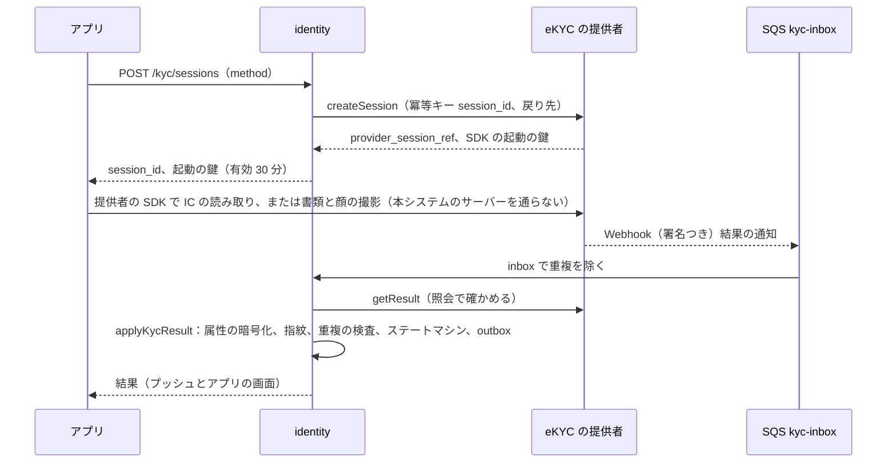
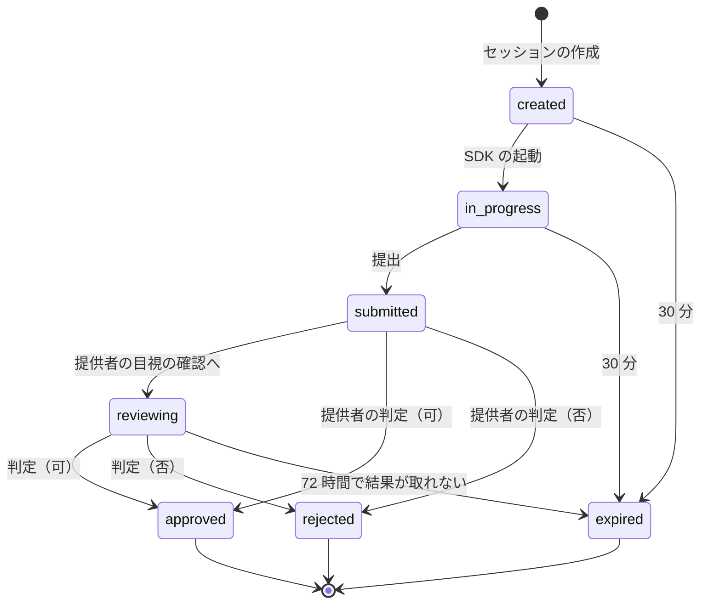

# Identity verification: Mercari

本人確認（eKYC）。外部の eKYC の提供者との連携、確認の方式と水準、確認のステートマシン、確認で開く機能と上限、確認の記録の持ち方と削除、同じ人の複数のアカウントの検出、再確認、疑わしい取引の届出の枠組みを決める。法令の結論（方式の選び方、記録の保存、上限の値）は書かず、法務の確認待ち（L1・L2・L5）とする。

前提となる決定は次のとおり。

- 本人確認は外部の eKYC の提供者を使う（マイナンバーカードの IC を優先、書類と顔の照合を予備）。本システムは結果と確認の水準を持ち、書類の画像を長く持たない。期間は法務の L2・L5 の後（[architecture/README.md](README.md) の 6 節の決定、[intent.md](../intent.md) の Non-goals）
- 売上金を期限のない残高へ移す条件（`legal.balance_requires_kyc_level`）など、売上金の法的な扱いは `legal.*` の設定で持ち、法務の L1 の結論まで本番の値を有効にしない（[ADR-0004](../decisions/0004-proceeds-model-under-payment-services-act.md)）
- 匿名でない配送に変えるには売り手の本人確認を求める（本家に寄せる。[ADR-0006](../decisions/0006-shipping-orchestration-via-carriers.md)）
- 本人確認のデータは本人だけのデータで、FORCE RLS と、運用者の別の種類の権限で守る（[ADR-0007](../decisions/0007-single-tenant-and-party-visibility.md)）
- `identity` のサービスが eKYC の提供者との連携と確認の状態を持つ（[architecture/README.md](README.md) の 1.2 節）

この文書で決めたことは次の ADR にある。

| ADR | 決定 |
| --- | --- |
| [0056](../decisions/0056-ekyc-provider-and-verification-levels.md) | eKYC は提供者のアダプター（セッションの作成、結果の取得、Webhook、データの削除の 4 つの口）の裏に置き、方式（`ic_chip`・`document_face`）ごとに提供者を替えられるようにする。利用者の確認の水準は `unverified`・`verified_document`・`verified_ic` の 3 つ。確認で開く機能と上限はバージョンの付いた表 `kyc_gates` に置き、法令に関わる値は `legal.*` を参照する。結果は Webhook と照会のどちらから来ても 1 つの関数でステートマシンを進める |
| [0057](../decisions/0057-identity-data-minimization-and-retention.md) | 本システムは、確認の結果、方式、提供者の参照、確認の時刻と、確認した属性（氏名、カナ、生年月日、住所）を `kms-kyc` の鍵の封筒の暗号化で持つ。書類と顔の画像は本システムの S3 に置かない（提供者に置き、保存の期間は法務の結論で提供者の設定にする）。同じ人の検出は、カナの氏名と生年月日を秘密の鍵の HMAC にした指紋で行う。保存の期間・削除は `legal.kyc_*` に置き、結論まで記録を消さない |

## 1. 範囲

- 扱う：提供者のアダプターの契約、確認の方式、確認のセッションと利用者の確認の状態、確認の水準、確認で開く機能と上限の表、確認した属性の持ち方と使い道、同じ人の検出、再確認、記録の保存と削除の枠組み、提供者の障害の扱い、疑わしい取引の届出の枠組み。
- 扱わない：
  - 電話番号の確認、ログイン、端末（`accounts-and-devices.md`）。
  - 振込の口座の名義の照合と振込の上限の実行（`payouts-and-points.md`）。この文書は水準ごとの上限の値の置き場所を決める。
  - 売上金の残高の型と期限（`ledger-and-proceeds.md`、ADR-0004）。
  - 暗号化の鍵の構成（`security.md`）。
  - 提供者の選定（E15 の `ekyc-provider-selection`）。候補の名前と能力は未確認。

## 2. 事実（確かめたこと）

| 項目 | 事実 | この設計 |
| --- | --- | --- |
| 本家の匿名でない配送と本人確認 | 2024 年 9 月から、専用でない配送の方法に変えるには本人確認が要る（[公式のコラム](https://jp-news.mercari.com/contents/954)、2026-02-17。[intent.md](../intent.md) の出典） | `kyc_gates` の `non_anonymous_shipping` を `verified_*` にする |
| 本家の売上金と本人確認 | 本人確認を済ませると売上金が期限のない「残高」になる（[ヘルプの記事 96](https://help.jp.mercari.com/guide/articles/96/)。[intent.md](../intent.md) の出典） | `legal.balance_requires_kyc_level` に置き、L1 の後に有効にする |
| eKYC の方式と法令の当てはめ | 犯罪収益移転防止法の取引時確認の方式（施行規則の「ホ」「ワ」など）と、本システムが特定事業者に当たるかは法務の確認待ち（L2）。施行規則の改正で、非対面の「ホ」方式（書類の画像と容貌の画像の送信）は 2027 年 4 月 1 日から使えなくなり、IC チップの読み取りと公的個人認証（「ワ」）が中心になる（法律事務所の解説で確かめた。改正命令の本文は**未検証**。[intent.md](../intent.md) の出典） | 方式を `method` として持ち、水準との対応を設定にする。`document_face` は「ホ」方式に当たりうるので、取引時確認に使う機能（振込の上限の引き上げ、残高）の条件に `verified_document` を入れるかは L2 の結論で決める |

いずれも 2026-10-10 に確認。

## 3. 要件

| 要件 | 値 | 出どころ |
| --- | --- | --- |
| データの秘匿 | 本人確認の属性・結果が、本人と権限のある運用者以外に出た事象 0 | NFR-014 |
| 確認の決定表 | 確認の水準の決定表が緑 | E15 の合否（[quality.md](../quality.md) の 5 節） |
| 結果の反映 | 提供者の結果（Webhook）から、水準の変更と機能の開放まで p95 10 秒 | 本システムの値 |
| 提供者の契約 | アダプターの契約の試験が緑（提供者の模型と試験の環境） | E15 の合否 |
| 法令 | 方式・記録・上限は法務の L1・L2・L5 の確認の後に有効にする | [intent.md](../intent.md) |

## 4. 方式と水準（ADR-0056）

| 水準 | 方式 | 中身 | 印 |
| --- | --- | --- | --- |
| `unverified` | - | 電話番号の確認だけ（`accounts-and-devices.md`） | なし |
| `verified_document` | `document_face` | 本人確認の書類の撮影と、顔の撮影の照合（提供者が判定） | 「本人確認済み」 |
| `verified_ic` | `ic_chip` | マイナンバーカードの IC の読み取り（公的個人認証の電子証明書）。提供者が判定 | 「本人確認済み」 |

- 印は 2 つの水準で同じに出す（公開のプロフィール。[ratings-and-reputation.md](ratings-and-reputation.md) の 5.1 節）。
- 2 つの方式が法令の取引時確認の方式として同じ扱いになるか、どちらかだけが足りるかは、法務の確認待ち（L2）。`kyc_gates` は水準の一覧で条件を書くので、結論で表を替えればよい。
- アプリは `ic_chip` を先に勧め、端末が NFC を読めない・カードがない利用者に `document_face` を出す。
- 方式ごとの年齢の制約（年齢によって IC の電子証明書が使えない場合など）は、提供者の選定で確かめる（**未検証**）。使えない利用者には `document_face` を出す。
- 確かめた生年月日は、年齢の制限の判定 `ageOf()`（[accounts-and-devices.md](accounts-and-devices.md)）の入力になる。

## 5. 確認で開く機能と上限

`kyc_gates`（バージョンの付いた設定。`identity` が持ち、各サービスは `identity` の `kycLevel(user_id)` と表で判定する）。

| 機能 | 条件 | 値の置き場所 | 本番の値 |
| --- | --- | --- | --- |
| 匿名でない配送（`shipping-integrations.md`） | 売り手が `verified_document` か `verified_ic` | `kyc.gate.non_anonymous_shipping` | 本家に寄せる（方針。法令の値ではない） |
| 売上金を期限のない残高へ（ADR-0004） | `legal.balance_requires_kyc_level` | `legal.*` | 法務の確認待ち（L1）。結論まで無効 |
| 振込の 1 回・1 か月の上限（`payouts-and-points.md`） | 水準ごとの値 | `legal.payout_limit_yen.{level}`、`legal.payout_monthly_limit_yen.{level}` | 法務の確認待ち（L2） |
| 売上金・ポイントでの購入の上限 | 水準ごとの値 | `legal.balance_spend_limit_yen.{level}` | 法務の確認待ち（L1・L2） |
| 制限つきのカテゴリの出品（[categories-brands-and-pricing-suggestions.md](categories-brands-and-pricing-suggestions.md) の 4.6 節） | カテゴリの `requires_kyc` | カタログの設定 | 法務の確認待ち（L10） |
| 不正の措置の後の制限の解除（[trust-and-safety.md](trust-and-safety.md) の 13 節） | 審査員が求めたとき | 措置の `params` | 方針 |

- 開発・検証の環境の仮の値（試すためだけ）：`legal.payout_limit_yen.unverified` = 100,000、`verified_*` = 1,000,000。`legal.balance_requires_kyc_level` = `verified_document`。本番では、結論までこれらの機能を無効（振込は `legal.*` の結論の後に開く値にする）か、`payouts-and-points.md` が決める既定に従う。
- 表を変えたらバージョンを上げ、`kyc.gates_changed` を出す。各サービスはバージョンを確かめて読み直す。
- 上限の判定は、それぞれの実行の場所（振込なら `payouts`）で行う。`identity` は水準だけを返す。

## 6. 流れと状態

### 6.1 確認の流れ

- 書類・顔の画像と IC の読み取りは、提供者の SDK と提供者のサーバーの間だけで流れる。本システムのサーバー・ログ・S3 を通らない。
- Webhook の中身は信じず、署名を確かめた後に提供者の照会で結果を取る（決済の提供者と同じ考え方。[ADR-0005](../decisions/0005-payments-via-providers-and-capture-at-purchase.md)）。
- Webhook が来ないときは、`submitted` から 10 分ごとに照会する（最長 72 時間）。
- 結果は Webhook と照会のどちらから来ても、1 つの関数 `applyKycResult(session_id, provider_result)` で状態を進める。冪等（同じ結果を何度当てても同じ）。

### 6.2 状態

**セッション**

**利用者の確認の状態**

| 状態 | 水準 | 入る時 |
| --- | --- | --- |
| `unverified` | `unverified` | 初め |
| `pending` | 前の水準のまま | セッションが `submitted`・`reviewing` |
| `verified` | `verified_document`・`verified_ic` | セッションが `approved` で、6.3 節の検査を通った |
| `on_hold` | `unverified` として扱う | `approved` だが、同じ人の別のアカウントがある・属性の食い違いで審査の待ち |
| `revoked` | `unverified` として扱う | 審査員が取り消した（なりすまし、提供者の取り消しの通知） |

**決定表 DT-KYC-001（`applyKycResult`、草案）**：上から順に評価する。

| # | セッション | 提供者の結果 | 条件 | → セッション、利用者 |
| --- | --- | --- | --- | --- |
| 1 | `approved`・`rejected`・`expired` | どれでも | - | そのまま（冪等） |
| 2 | どれでも | 署名・照会が合わない | - | そのまま（記録だけ） |
| 3 | `submitted`・`reviewing` | `approved` | 指紋が別の `verified` のアカウントにある | `approved`、利用者は `on_hold`（T&S の `fraud` の案件） |
| 4 | `submitted`・`reviewing` | `approved` | 確かめた生年月日が、登録の申告の生年月日と違う | `approved`、利用者は `on_hold`（CS の確かめ。確かめた生年月日を `ageOf()` の入力にする） |
| 5 | `submitted`・`reviewing` | `approved` | 上のどれでもない | `approved`、利用者は `verified`（水準は方式から） |
| 6 | `submitted`・`reviewing` | `rejected` | - | `rejected`、利用者は前の状態（理由のコードを本人に） |
| 7 | `submitted` | `needs_review` | - | `reviewing`、利用者は `pending` |
| 8 | `created`・`in_progress` | どれでも | - | 照会して結果に従う（行 3〜7）。結果がなければそのまま |

- 水準が上がるのは行 5 だけ。下がるのは `revoked`（審査員の措置）と、法令で求められる再確認の期限（9 節）だけ。

### 6.3 同じ人の検出

- 指紋：`HMAC-SHA256(k_identity, normalize(氏名のカナ) || "|" || 生年月日)`。`normalize` は NFKC、カタカナ、空白と中黒の除き。鍵 `k_identity` は KMS で `identity` だけが使う。
- `kyc_fingerprints`（指紋 → `user_id` の一覧、状態）。`verified` の利用者が 1 人以上いる指紋で、別のアカウントが `approved` になったら `on_hold` にし、T&S の `fraud` の待ち行列に案件を作る（[trust-and-safety.md](trust-and-safety.md) の 13 節）。
- 1 人が持てる確認の済んだアカウントの数は、規約の方針（S1 は 1）で、審査員が例外（家族の同名同日は生年月日で別になるので、まれ）を判断する。
- 指紋は秘密の鍵の HMAC で、鍵なしに氏名・生年月日を戻せない。指紋をデータレイクに入れない。

## 7. 記録の持ち方（ADR-0057）

| 項目 | 置き場所 | 持つ期間 |
| --- | --- | --- |
| 確認の結果（水準、方式、提供者、提供者の参照、時刻、理由のコード） | Aurora core `kyc_records`（本人だけ。FORCE RLS） | 法務の確認待ち（L2・L5）。結論まで消さない |
| 確認した属性（氏名、カナ、生年月日、住所、書類の種類） | 同じ行の `attributes_ct`（`kms-kyc` の鍵の封筒の暗号化） | 同上 |
| 指紋 | `kyc_fingerprints` | 同上 |
| 書類・顔の画像、IC の読み取りの中身 | 提供者だけ。本システムの S3 に置かない | 提供者の設定。値は法務の結論の後（`legal.kyc_provider_retention_days`） |
| セッションの記録 | `kyc_sessions` | 1 年（本システムの値。結論で直す） |

- **使い道**：属性は、振込の口座の名義の照合（`payouts-and-points.md` がカナの氏名の一致だけを `identity` に問い、`identity` が真偽を返す）、年齢の帯（18 歳未満か）、同じ人の検出にだけ使う。住所は、配送の住所の金庫と結ばない（配送先は利用者が別に登録する）。
- **見せ方**：本人は自分の確認の状態と水準を見られる。属性は、本人が「登録した氏名」として一部（姓だけなど）を見られる。運用者は `kyc.view` の別の権限（JIT、理由、監査）でだけ見る（ADR-0007、`security.md`）。
- **退会**：退会しても、法令の保存の期間がある記録は消さない。期間は法務の確認待ち（L2・L5）。期間の後に、属性・指紋を消し、提供者の削除の口（`deleteData`）を呼ぶ。
- **ログ**：属性・指紋・提供者の参照をログに出さない。`session_id` と結果のコードだけ。

## 8. 提供者のアダプター

| 口 | 中身 |
| --- | --- |
| `createSession(session_id, method, return_url)` | 冪等キー `session_id`。提供者のセッションの参照と SDK の起動の鍵を返す |
| `getResult(provider_session_ref)` | 結果（`approved`・`rejected`・`needs_review`・`pending`）、方式、属性、理由のコード |
| `verifyWebhook(headers, body)` | 署名の確かめ。通ったら `provider_session_ref` と事象の種類だけを取り出す |
| `deleteData(provider_session_ref)` | 提供者の画像・記録の削除の依頼 |

- 提供者ごとのアダプターは `packages/identity/providers/<name>` に置き、契約の試験（提供者の模型 `kyc-sim` と、提供者の試験の環境）で確かめる。
- `ic_chip` と `document_face` で別の提供者を使ってよい。方式ごとの提供者の選び先は設定（`kyc.provider.{method}`）。

## 9. 法令の枠組み（法務の確認待ち）

| 論点 | 関係する L | この設計 |
| --- | --- | --- |
| 本システムが特定事業者に当たるか、取引時確認の方式、確認の記録と保存の期間 | L2 | 方式と水準を分けて持ち、`kyc_gates` と `legal.kyc_*` で結論に合わせる |
| 疑わしい取引の届出の手順と基準 | L2 | T&S の不正の兆し（[trust-and-safety.md](trust-and-safety.md) の 13 節）とは別に、届出の候補の案件の種類（`str_candidate`）だけを用意する。基準と届出の判断は法務の結論の後。規則で届出を決めない |
| 振込の上限と確認の段 | L2 | 5 節の `legal.payout_limit_yen.{level}` |
| 売上金の残高と本人確認 | L1 | 5 節の `legal.balance_requires_kyc_level` |
| 書類と顔の画像の利用目的と保存の期間、退会の後の保持 | L5 | 7 節。結論まで消さず、画像は提供者だけに置く |
| 未成年の扱い（確認の可否、機能の制限） | L2・L5・L12 | 未成年の枠（申告の生年月日、保護者の同意の記録、`ageOf()`、上限の `legal.*`）は [ADR-0068](../decisions/0068-account-deletion-and-minors.md)。この文書は、確かめた生年月日を `ageOf()` の入力として渡す（`verified` の利用者は申告より確かめた値を使う）。未成年の確認の可否は結論の後 |
| 再確認の要否と間隔（書類の有効期限など） | L2 | `legal.kyc_reverify_days`。結論まで再確認を求めない |

## 10. 失敗と回復

| 事象 | 影響 | 扱い |
| --- | --- | --- |
| 提供者の停止 | 確認ができない | 確認の画面に「一時的に使えない」。確認の要る機能は閉じたまま（迂回しない）。方式ごとに別の提供者があれば、もう一方の方式を勧める |
| Webhook の欠け | 結果が届かない | 10 分ごとの照会で拾う |
| Webhook の重複・順序の入れ替え | 二重の反映 | inbox と DT-KYC-001 の 1 行（冪等） |
| 提供者の結果の取り消し（後でなりすましと判明） | 誤った `verified` | 提供者の通知か T&S の審査で `revoked`。開いた機能を閉じ、進行中の振込は `payouts-and-points.md` の手順で止める |
| `kms-kyc` の鍵の障害 | 属性が読めない | 水準の判定は属性を読まずにできる（`kyc_records` の水準の列）。名義の照合は止まり、振込の確かめは待つ |
| 指紋の誤一致（同姓同名・同じ生年月日の別人） | 正しい利用者が `on_hold` | 審査員が書類の参照（提供者の画面）で判断し、例外として `verified` にする |

## 11. 上限

| 対象 | 値 |
| --- | --- |
| セッションの作成 | 1 人 1 日 5 回 |
| `rejected` の後の再挑戦 | 24 時間後から。30 日に 5 回まで（超えたら CS の案内） |
| セッションの有効 | 30 分 |
| 提供者の目視の確認の待ち | 72 時間 |

## 12. data-model への項目

| 置き場所 | 中身 | 節 |
| --- | --- | --- |
| Aurora core `kyc_sessions`（`session_id`（UUIDv7）、`user_id`、`method`、`provider`、`provider_session_ref`、`state`、`result_code`、`created_at`、`submitted_at`、`decided_at`、`expires_at`）。FORCE RLS | セッション | 6 |
| Aurora core `kyc_records`（`user_id`、`status`、`level`、`method`、`provider`、`provider_ref`、`verified_at`、`attributes_ct`、`attributes_key_version`（`vault_keys` の `kyc` の鍵。[data-model.md](data-model.md) の D-10）、`age_band`、`revoked_by_action_id`、`updated_at`）。FORCE RLS。運用者は `kyc.view` の JIT | 確認の正本 | 6.2、7 |
| Aurora core `kyc_fingerprints`（`fingerprint`、`user_id`、`state`、`created_at`）。サービスの役割だけ | 同じ人の検出 | 6.3 |
| Aurora core `kyc_inbox`（`provider`、`event_id`、`received_at`、`processed_at`） | Webhook の inbox | 6.1 |
| Aurora core `kyc_gates`（`gates_version`、`feature`、必要な水準か `legal.*` の名前。[data-model.md](data-model.md) の D-11）、AppConfig `kyc.*`、`legal.balance_requires_kyc_level`、`legal.payout_limit_yen.*`、`legal.payout_monthly_limit_yen.*`、`legal.balance_spend_limit_yen.*`、`legal.kyc_*` | 開く機能と法令の値 | 5、9 |
| outbox の話題 `kyc.level_changed`、`kyc.gates_changed`、`kyc.on_hold` | 事象 | 5、6 |

## 13. テストと性質

| ID | 性質・試験 |
| --- | --- |
| PROP-KYC-001 | 任意の提供者の事象（Webhook と照会の結果）の重複・順序の入れ替え・欠けで、利用者の水準は DT-KYC-001 の 5 行でだけ上がり、同じ結果を何度当てても変わらない |
| PROP-KYC-002 | 任意の利用者と主体で、`kyc_records`・`kyc_sessions` の行は本人と `kyc.view` の権限の運用者だけが読める（RLS の性質ベーステスト） |
| PROP-KYC-003 | 属性・指紋・提供者の参照が、ログ・トレース・データレイク・通知に現れない（ログの検査。[quality.md](../quality.md) の 2.2.1 節 G） |
| PROP-KYC-004 | `kyc_gates` のどのバージョンでも、条件を満たさない水準の利用者に、その機能が開かない（各サービスの判定の表駆動テスト） |
| PROP-KYC-005 | `legal.*` の値が未設定（法務の結論の前）のとき、残高への移し替えと、水準による振込の上限の引き上げが本番で一度も効かない |
| DT-KYC-001 | 6.2 節の決定表の全行（E15 の合否） |
| 契約 | アダプターの 4 つの口を、`kyc-sim` と提供者の試験の環境で確かめる |
| 結合 | 確認 → `verified` → 匿名でない配送の選択が開く。`revoked` → 閉じる |

## 14. Story の候補

| Epic | Story | 中身 |
| --- | --- | --- |
| E15 | `ekyc-provider-selection` | 提供者の選定（方式ごと）、契約、データの置き場所と削除の口。方式は法務：L2 |
| E15 | `ekyc-integration` | アダプター、セッション、Webhook の inbox と照会、`applyKycResult`、DT-KYC-001（6・8 節）。法務：L2・L5 |
| E15 | `kyc-gated-features` | `kyc_gates`、各サービスの判定（5 節）。法務：L1・L2 |
| E15 | `kyc-duplicate-detection` | 指紋と `on_hold`、T&S への案件（6.3 節） |
| E15 | `kyc-document-retention` | 記録の持ち方、退会の後、提供者の削除（7 節）。法務：L2・L5 |

## 15. 未解決の問い

### 決定（2026-10-10、既定案）

- **アダプター**：4 つの口、方式ごとに提供者を替えられる（ADR-0056）。
- **水準**：`unverified`・`verified_document`・`verified_ic`。印は 2 つの確認の水準で同じ。
- **開く機能**：`kyc_gates` のバージョンの付いた表。法令の値は `legal.*`。
- **画像**：本システムに置かない。属性は封筒の暗号化。同じ人は HMAC の指紋（ADR-0057）。
- **同じ人の確認の済んだアカウント**：1 つ。2 つ目は `on_hold` と審査。

### 持ち越し

| 問い | いつ・どう決めるか |
| --- | --- |
| 特定事業者に当たるか、取引時確認の方式、記録の保存の期間、疑わしい取引の届出（L2） | 法務の確認待ち。E15 の全 Story の spec の承認の前 |
| 振込・残高・購入の上限の値（L1・L2） | 法務の確認待ち。E10・E15 の spec の承認の前 |
| 画像と属性の利用目的、退会の後の保持（L5） | 法務の確認待ち。E15 の `kyc-document-retention` の承認の前 |
| 未成年の確認の可否 | 法務の確認待ち（L2・L5・L12）。枠は [ADR-0068](../decisions/0068-account-deletion-and-minors.md) |
| 提供者の選定（IC と書類の両方を 1 社にするか） | E15 の `ekyc-provider-selection` で、費用・合格の率・障害の実績を比べて PM と Dev が決める |
| マイナンバーカードの IC で得る情報のうち、何を属性として持つか（電子証明書のシリアルの扱いを含む） | 法務の確認待ち（L2・L5）。結論まで、シリアルを本システムに持たない |
