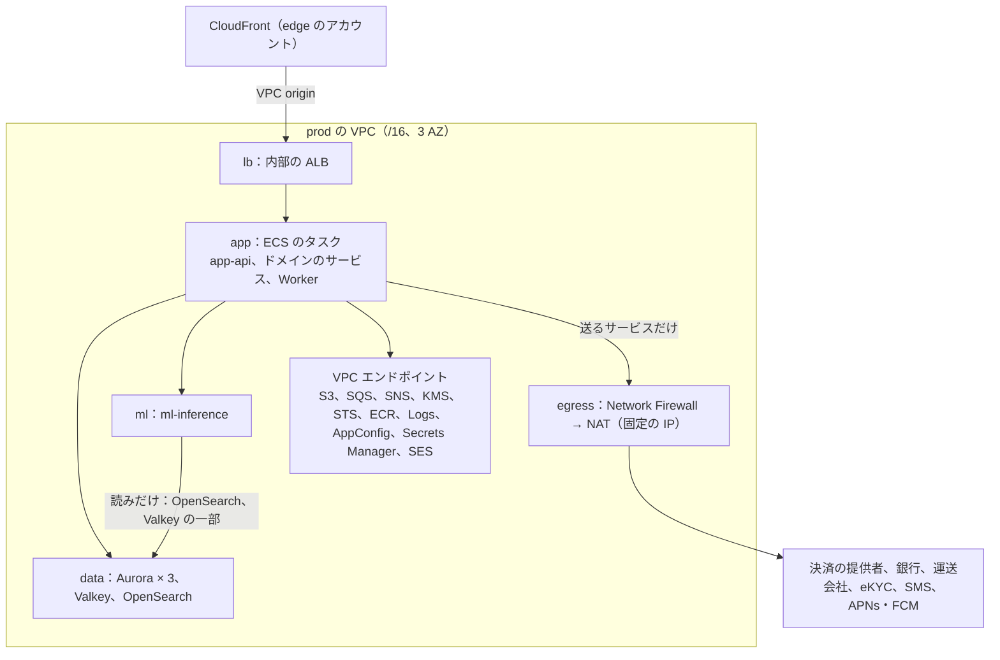
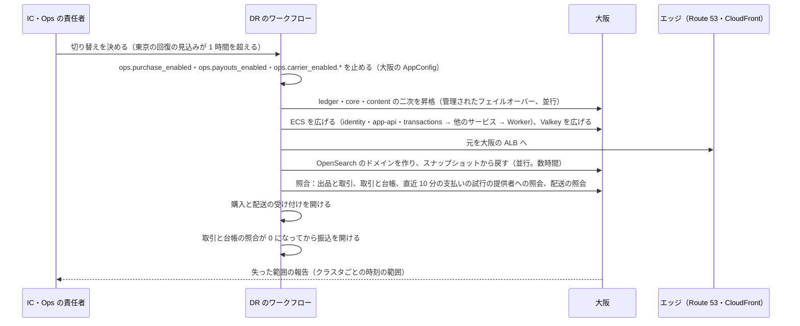

# Infrastructure: Mercari

AWS のアカウントとネットワーク、エッジ、3 つの Aurora（core・ledger・content）、Valkey、OpenSearch、SQS・SNS、S3、ML の推論（Python）の境界、決済の提供者・銀行・運送会社への送信（egress）と Webhook の受け口、大阪への DR、段階を上げる基準と分け方、取引 1 件と MAU 1 人あたりの原価を決める。

前提となる決定は次のとおり。

- 共通の基盤と、core・ledger・content の 3 クラスタ、ML だけ Python（[ADR-0001](../decisions/0001-platform-and-stack.md)）
- 購入は core の 1 つのトランザクション、お金は ledger の 1 つのトランザクション（[ADR-0002](../decisions/0002-transaction-state-machine-and-single-purchase.md)、[ADR-0003](../decisions/0003-escrow-and-double-entry-ledger.md)）
- 検索は Amazon OpenSearch Service（[ADR-0008](../decisions/0008-search-engine-and-index.md)）
- ML の出力は信号・助言だけ（[ADR-0009](../decisions/0009-trust-and-safety-pipeline-boundary.md)、[ADR-0010](../decisions/0010-ml-boundary-for-pricing-and-recommendations.md)）
- 鍵の配置（[ADR-0069](../decisions/0069-key-layout-and-vault-envelope-encryption.md)）

要件は NFR-007（可用性）、NFR-011（AZ の障害で RPO 0・RTO 5 分、リージョンの障害で RPO 1 分・RTO 1 時間）、NFR-002・NFR-010（速さ）。この文書で決めたことは次の ADR にある。

| ADR | 決定 |
| --- | --- |
| [0072](../decisions/0072-accounts-network-and-egress.md) | 本番の作業負荷は 1 つの本番のアカウントの 1 つの VPC（3 AZ）に置き、サブネットを `lb`・`app`・`ml`・`data`・`egress` に分ける。データレイクと学習は別の `data` のアカウント。外への送信は、決済の提供者・銀行・運送会社・eKYC・SMS・APNs・FCM を送るサービスだけに許し、Network Firewall の宛先の名前の許可の一覧と、AZ ごとの固定の IP の NAT を通す。銀行が閉じた網を求めたら、shared のアカウントの Site-to-Site VPN で受ける。Webhook は `hooks.<brand>.<domain>` の別の配信と WAF で受ける。`ml-inference` は `ml` のサブネットに置き、Aurora と金庫と外へ出る経路を持たない |
| [0073](../decisions/0073-aurora-layout-osaka-dr-and-ledger-rpo.md) | Aurora は 3 クラスタとも I/O-Optimized、書き込み 1 と別の AZ の読み出し、自動のバックアップ 35 日、Global Database で大阪へ。AZ の障害の RPO 0 は Aurora の共有のストレージ（3 AZ）による。ledger だけ主のクラスタに `rds.global_db_rpo = 60` を置き、大阪への遅れが 60 秒を超えたら commit を待たせて、リージョンの障害でも失う仕訳を 60 秒以内に限る。大阪は各クラスタの二次（読み出し 1）、ECS の定義（タスク 0）、空の Valkey、S3 の写し、複数のリージョンの鍵を持つウォームスタンバイ。OpenSearch は持たず、スナップショットから戻す。切り替えは、購入・振込・配送の受け付けを止める → 3 クラスタを昇格 → 広げる → 照合 → 振込を最後に開ける順で、IC と Ops の責任者が決める |
| [0074](../decisions/0074-stage-up-criteria-and-split-plan.md) | 段階を上げる基準を 8 つの指標で見て、各指標の上限の 60% で準備を始める。分ける順は、S2 で content を種類ごとのクラスタに分け、OpenSearch を販売中と売れた品の索引に分け、ledger の熱い口座をスロットに分ける。S3 で core を `core-accounts`（利用者ごと）と `core-market`（`listing_id` のハッシュで 16 に分ける。出品・取引・配送を同じ分け先）に分け、ledger を口座の持ち主のハッシュで分ける。まず大きい型へ上げ、上げきる前に分ける準備を終える |

負荷と台数の根拠は [capacity.md](capacity.md)、CI とデプロイは [delivery.md](delivery.md)、計測は [observability.md](observability.md)、鍵と運用者のアクセスは [security.md](security.md) にある。「初期見積もり」は負荷試験と PoC の前の仮の値である。AWS の仕様で確かめていないものは「未検証」と書く。

## 1. AWS アカウント

ADR-0072。

| アカウント | OU | 中身 |
| --- | --- | --- |
| management | Root | Organizations、SCP、IAM Identity Center、請求 |
| security | Security | GuardDuty・Security Hub・Inspector の委任管理者 |
| log-archive | Security | 組織の CloudTrail、Config、VPC フローログ、監査の写し（Object Lock。[security.md](security.md) の 6.4 節）、Session Manager の記録。大阪へ写す |
| shared | Infrastructure | ECR（東京・大阪へ写す）、Route 53（`<brand>.<domain>`）、Terraform の状態のバケット、銀行への Site-to-Site VPN（求められたとき） |
| edge | Infrastructure | CloudFront、WAF、ACM（us-east-1） |
| observability | Infrastructure | AMP、Managed Grafana、CloudWatch のまとめ、アラートの送り先 |
| canary | Infrastructure | 外からの見張り（`canary`。[observability.md](observability.md) の 4 節）。本番と別の資格情報 |
| data | Workloads/Data | データレイク（S3、Glue、Athena）、学習のジョブ、モデルの登録簿。本番の DB に経路を持たない |
| prod | Workloads/Prod | 本番の作業負荷（4・5 節） |
| staging | Workloads/NonProd | 本番と同じ形を小さく。負荷試験と DR の訓練のときだけ広げる |
| dev | Workloads/NonProd | 開発 |

- 本番を 1 つのアカウントにする（Shopify の題材のようなポッドの分け方を持たない）。S1〜S2 の部品の数はアカウントの既定の上限に収まる。S3 で core を分けるとき、上限を見て `prod-market` のアカウントを足すかを決める（8 節）。
- **SCP**（Workloads の OU）：東京（ap-northeast-1）・大阪（ap-northeast-3）以外のリージョンを禁止する（CloudFront・WAF・ACM・IAM の us-east-1 を除く）。CloudTrail・Config・GuardDuty の停止、KMS の鍵の削除の予約と無効化、Object Lock の解除、バケットのバージョニングの停止を、break-glass の外に禁止する。
- データの所在（東京・大阪）は [intent.md](../intent.md) の制約。

## 2. ネットワーク

ADR-0072。

### 2.1 本番の VPC

| サブネット | 置くもの | 入る側 | 出る側 |
| --- | --- | --- | --- |
| `lb` | 内部の ALB（`api`、`ops`、`hooks`） | CloudFront の VPC origin | `app` |
| `app` | ECS のタスク（`app-api`、`ops-api`、ドメインのサービス、Worker） | `lb` | `data`、`ml`、VPC エンドポイント、`egress`（送るサービスのセキュリティグループだけ） |
| `ml` | `ml-inference`、価格の統計の日次のジョブ | `app` の `trust-safety`・`listings`・`search-api` | `data` の OpenSearch（読み）と Valkey（価格の統計の鍵だけ）、S3 のエンドポイント（写真の読み、モデルの読み） |
| `data` | Aurora、Valkey、OpenSearch | `app`、`ml`（限った宛先） | なし |
| `egress` | Network Firewall、NAT | `app` | インターネット（許可の一覧の名前だけ） |

- アドレス：VPC は `/16`、各サブネットは AZ ごとに `/20`。
- セキュリティグループは役割ごと。`egress` へのルートを持つのは、送るサービス（2.4 節）のセキュリティグループだけで、plan のポリシー検査で他を拒む（6 節）。
- インスタンスのメタデータは IMDSv2 だけ（ECS on EC2 を使うとき）。

### 2.2 入口とホスト名

| ホスト名 | 入口 | 元 |
| --- | --- | --- |
| `<brand>.<domain>` | CloudFront（Web） | S3（Web の資産）、`app-api` の ALB |
| `api.<brand>.<domain>` | CloudFront（API。キャッシュしない） | `app-api` の ALB |
| `static.<brand>.<domain>` | CloudFront（写真） | S3（変換の後の写真） |
| `hooks.<brand>.<domain>` | CloudFront（Webhook） | `hooks` の ALB → `payments`・`shipping` の受け口 |
| `ops.<brand>.<domain>` | CloudFront（運用の画面） | S3（画面の資産）、`ops-api` の ALB |
| `mail.<brand>.<domain>`、`news.<brand>.<domain>` | SES の送り元（DNS だけ） | — |

### 2.3 Webhook の受け口

- 決済の提供者・運送会社・銀行の通知は、`hooks.<brand>.<domain>` の別の配信で受ける。WAF で本文の大きさ（256 KB）と速さを絞り、提供者が送り元の IP を公開していれば IP の許可の一覧を足す。
- 受け口は署名を確かめ、inbox に一度だけ入れて 200 を返す（[ADR-0005](../decisions/0005-payments-via-providers-and-capture-at-purchase.md)、[ADR-0006](../decisions/0006-shipping-orchestration-via-carriers.md)）。受け口のタスクは `payments`・`shipping` の中の別の経路で、外への送信の権限を持たない。

### 2.4 外への送信

| 宛先 | 送るサービス | 経路 | 備考 |
| --- | --- | --- | --- |
| 決済の提供者の API | `payments` | Network Firewall（SNI の許可の一覧）→ NAT（AZ ごとの固定の IP） | 提供者が IP の登録を求めれば固定の IP を渡す |
| 提携銀行の API・全銀の形式のファイル | `payouts` | 同上＋mTLS。閉じた網を求められたら shared の Site-to-Site VPN | 銀行の接続の方式は**未検証**（E10 の `bank-partner-selection`） |
| 運送会社の API | `shipping` | 同上 | IP の登録の要否は**未検証**（E11 の `carrier-selection`） |
| eKYC の提供者 | `identity` | 同上 | |
| SMS の提供者 | `identity` | 同上 | |
| APNs（`api.push.apple.com`）、FCM | `notifier-send` | 同上 | |
| Amazon SES | `notifier-send` | VPC エンドポイント | |
| AWS の API | すべて | VPC エンドポイント | |

- 送らないサービス（`app-api`、`ops-api`、`listings`、`search-api`、`transactions`、`ledger`、`messaging`、`trust-safety`、`ml-inference`、送らない Worker）は、`egress` への経路を持たない。外の URL を取りに行く機能（画像の URL の取り込みなど）は MVP に持たない。
- Network Firewall の料金と、SNI の許可の一覧の振る舞いは**未検証**（E1 の `aws-accounts-and-network` で確かめる）。

## 3. エッジ

| 配信 | WAF の規則 | 備考 |
| --- | --- | --- |
| Web・API | AWS の管理の規則、IP ごとの速さの上限、Bot Control（共通）を検索・出品の詳細・ログイン・購入・SMS の要求の経路に | 速さの上限は [security.md](security.md) の 3.3 節。購入の経路は人気の出品の連打を絞る（[runbooks/](../runbooks/README.md) の 5.1 節） |
| 写真 | 速さの上限だけ | キャッシュに当たる経路に Bot Control を掛けない（費用） |
| Webhook | 本文の大きさ、送り元の IP（公開されていれば） | 2.3 節 |
| 運用の画面 | 社の出口の IP だけを通す | SSO とフィッシングに強い MFA（[security.md](security.md) の 6.1 節） |

- WAF の規則の変更は、凍結の時間帯と承認（[runbooks/](../runbooks/README.md) の 3.1 節）に従う。

## 4. 作業負荷の部品

ADR-0073。大きさと台数は [capacity.md](capacity.md) の 4 節。

### 4.1 Aurora

| クラスタ | S1 の構成 | パラメーター | 書くパッケージ |
| --- | --- | --- | --- |
| core | 書き込み 1、読み出し 2（別の AZ）。I/O-Optimized | `rds.force_ssl = 1`、`lock_timeout`・`statement_timeout` はロールごと | `identity`、`listings`、`transactions`、`shipping` |
| ledger | 書き込み 1、読み出し 1。I/O-Optimized | 同上と、主のクラスタに `rds.global_db_rpo = 60` | `ledger`、`payouts` |
| content | 書き込み 1、読み出し 1。I/O-Optimized | 同上 | `messaging`、`search`、`notifier`、`trust-safety` |

- どれも Aurora PostgreSQL 18、自動のバックアップ 35 日、Global Database で大阪へ。Aurora PostgreSQL 18 は 2026-06 に一般提供になった（出典）。
- **AZ の障害（RPO 0・RTO 5 分）**：Aurora のクラスタのボリュームは 1 つのリージョンの 3 つの AZ に写しを持つ（出典）。commit したデータは AZ を 1 つ失っても残る。書き込みのインスタンスの AZ を失うと、別の AZ の読み出しが昇格する（30 秒前後。**未検証**）。ledger もこれで AZ の中の RPO 0 を満たす。
- 接続：タスクごとのプール 8（読み出しは別に 8）。core の書き込みへの接続の総数を 1,200 以下に収める（[capacity.md](capacity.md) の 4.2 節の最大のタスクの数から）。RDS Proxy は S1 で使わない（Global Database と組むときの制約を確かめていない。**未検証**）。

### 4.2 その他の部品

| 部品 | S1 の構成 |
| --- | --- |
| ElastiCache（Valkey） | クラスタモード、2 シャード × 主 1・写し 1、転送中と保存の暗号化。失ってよい（正本にしない） |
| OpenSearch | 1 つのドメイン、3 AZ、データのノード 9、専用のマスター 3、gp3。細かいアクセス制御で、`search-indexer` は書き、`search-api`・`ml-inference` は読みだけ |
| SQS・SNS | outbox の話題（クラスタごと）と、消費者ごとのキュー。各キューに DLQ。通知のレーンは [notifications.md](notifications.md) の 4.1 節 |
| S3 | `photos-incoming`（元の写真。`kms-core`、変換の後 24 時間で消す。[listings-and-photos.md](listings-and-photos.md)）、`photos`（変換の後。SSE-S3、`static` の元）、`exports`（`kms-ops-exports`）、`opensearch-snapshots`、`ml-models`（data のアカウントから署名つきで入る）、`records`（inbox の本文、外部の明細、全銀のファイル、古い区切りの写し。接頭辞ごとの鍵）、`config`（カタログ・価格の統計・規則の写し）、`cases`・`ts-docs`（`kms-content`）。キーと保持は [data-model/stores.md](data-model/stores.md) の 3 節 |
| ECS（Fargate、ARM64） | [capacity.md](capacity.md) の 4.2 節のサービスの一覧 |
| ALB | 内部、`lb` のサブネット、VPC origin |
| AppConfig | `release.*`・`ops.*`・`legal.*`（`legal` は別のアプリケーション。[delivery.md](delivery.md) の 3.3 節） |

## 5. ML の推論の境界

ADR-0072。

| 項目 | 形 |
| --- | --- |
| 置き場所 | prod の `ml` のサブネットの ECS のサービス `ml-inference`（Python）。S1 は Fargate の CPU。画像の分類器が S2 で足りなくなれば、GPU の ECS on EC2 を同じサブネットに足す（[capacity.md](capacity.md) の 4.3 節） |
| 呼ぶもの | `trust-safety`（分類器）、`listings`（出品の質の検査の補助）。内部の ALB と gRPC |
| 入力 | 出品の ID、題名・説明・ブランド・カテゴリ・価格、写真の S3 の鍵（変換の後の `photos` を `ml-inference` が読む）。住所・メッセージの本文・利用者の個人のデータは送らない |
| 出力 | 点（0〜1）、理由のコード、モデルのバージョンだけ（[ADR-0009](../decisions/0009-trust-and-safety-pipeline-boundary.md)） |
| 触れないもの | Aurora（3 つとも）、金庫の KMS の鍵、外への送信 |
| 価格の統計 | 日次のジョブが OpenSearch の売れた品を読み、Valkey の `price:*` に書く（[ADR-0010](../decisions/0010-ml-boundary-for-pricing-and-recommendations.md)）。Valkey の ACL で、この鍵の接頭辞だけを書ける |
| モデル | data のアカウントの学習のジョブが作り、署名して、prod の `ml-models` に入れる。出し方は [delivery.md](delivery.md) の 7 節 |
| 止まったとき | 非同期の分類器が遅れる。出品の公開は止めない（同期の検査は `listings` と `trust-safety` の規則で行う）。公開の前に分類器を待つ規則の対象は「確認中」のまま待つ。60 秒を超えたら規則のエンジンの既定（`review`）に倒す（[trust-and-safety.md](trust-and-safety.md)） |

## 6. Terraform

開発リポジトリの `infra/` に置く。状態ファイルは shared のバケット（東京、大阪へ写す）。

| ルートモジュール | 中身 | 変更の承認 |
| --- | --- | --- |
| `org/`、`security/` | Organizations、SCP、Identity Center、GuardDuty、log-archive | Ops の責任者＋セキュリティの担当 |
| `shared/` | ECR、Route 53、銀行の VPN | Ops |
| `edge/` | 配信、WAF、ACM | Ops（WAF の規則は `security:sensitive`） |
| `prod/<region>/network` | VPC、サブネット、エンドポイント、Network Firewall、NAT | Ops |
| `prod/<region>/data` | Aurora × 3、Valkey、OpenSearch、S3、KMS | Ops。状態を持つ資源の削除・置き換えは CI で拒む。ledger の変更は財務の担当の確認も |
| `prod/<region>/compute` | ECS のサービス、ALB、オートスケーリング | Ops |
| `data/` | データレイク、学習 | Ops＋データの担当 |

- plan のポリシー検査（OPA・Checkov）で、次を拒む：`egress` への経路を、許可したサービス以外のセキュリティグループに付ける。`ml` のサブネットから Aurora への経路。人の権限のセットに `kms-vault-*`・`kms-identity-pii`・`kms-kyc` の `kms:Decrypt`（[ADR-0069](../decisions/0069-key-layout-and-vault-envelope-encryption.md)）。Aurora の `rds.force_ssl` が 0。ledger の主のクラスタの `rds.global_db_rpo` の削除。本番の ECS の Exec の有効化。

## 7. 大阪と DR

ADR-0073。

### 7.1 平常の構成

| 部品 | 大阪の平常 |
| --- | --- |
| Aurora × 3 | Global Database の二次（読み出し 1、`db.r8g.large`） |
| ECS | サービスの定義とタスクの定義（イメージは ECR の写し）。タスクは 0 |
| Valkey | 最小の空のクラスタ（切り替えで広げる）。セッションの写しと `listingVisible()` の写しは core から作り直す |
| OpenSearch | なし。日次のスナップショット（`opensearch-snapshots`）を大阪へ写す |
| S3 | `photos`（変換の後）、`opensearch-snapshots`、log-archive の写し（CRR）。`photos-incoming` は写さない（24 時間で消える元の写真で、配信に使わない） |
| KMS | `kms-vault-*`・`kms-identity-pii`・`kms-kyc` は複数のリージョンの鍵。他は大阪の鍵 |
| ECR、AppConfig、Secrets Manager | 写し、同じ構成 |
| egress | 大阪の NAT の固定の IP。提供者・銀行・運送会社に、東京と大阪の両方の IP を登録しておく |

### 7.2 ledger の RPO

- AZ の障害：3 クラスタとも RPO 0（4.1 節）。
- リージョンの障害：Global Database の複製の遅れは通常 1 秒未満（出典）。core と content は遅れの上限を置かない（可用性を先にする）。
- ledger は、主のクラスタのパラメーターに `rds.global_db_rpo = 60` を置く。Aurora は、二次の遅れが 60 秒を超えると、主の commit を止め、追いつくと再開する（出典。値は 20 秒以上）。お金の仕訳の失う範囲を 60 秒以内に限る代わりに、大阪への複製が遅れた間は ledger の書き込みが止まる。止まった間は、core の outbox が仕訳の事象を溜め、残高での購入の引き当ては 503 で断る（その支払い方法だけ）。
- AWS は、2 つのリージョンだけのとき、二次のリージョンのパラメーターのグループは既定のままにするよう勧める（出典）。大阪の ledger のパラメーターは既定にし、切り替えの後の大阪の主が commit を止めないようにする。
- 失った 60 秒以内の仕訳は、core の outbox の事象（冪等キーつき）の出し直しと、提供者の照会で作り直す。core の側も失った事象は、日次の 3 者の照合で仮勘定に入れて人が確かめる（[ADR-0003](../decisions/0003-escrow-and-double-entry-ledger.md)）。

### 7.3 リージョンの障害

- **RTO 1 時間**：昇格（数分）、ECS の拡大（S1 で 200 前後のタスク。大阪の Fargate で起こせる量と時間は**未検証**。半年ごとの DR の訓練で測る）、照合。OpenSearch の戻しは待たない。
- **検索の落ちた形**：OpenSearch を戻す間、検索は core の読み出しの写しからの「カテゴリの新着」だけを返す（[search-and-discovery.md](search-and-discovery.md) と合意する）。保存した検索の照合は OpenSearch を使わないので続く。
- **期限**：切り替えの間、`deadline-runner` は止めたままにする。再開の前に、終わっていない取引の生きている期限を、止まった時間だけ後ろへずらす（利用者の責任でない期限切れを作らない。統合の工程で採った。[transactions-and-state-machine.md](transactions-and-state-machine.md) の 7.3 節、[ADR-0025](../decisions/0025-transaction-decision-table-and-deadline-pause.md) の注記）。止めた時刻と戻した時刻は `dr_events` に書く。
- 東京へ戻すのは計画作業で、Global Database の管理された切り替え（switchover。RPO 0）で行う（出典）。

### 7.4 部品の障害

| 障害 | 影響 | 扱い |
| --- | --- | --- |
| 1 つの AZ | 容量の 1/3 | 各サービスは 2 AZ で平常の山を受けられる最小のタスクの数を持つ（[capacity.md](capacity.md) の 4.2 節）。Aurora は別の AZ へ |
| Valkey | 先着の印、セッションの写し、`listingVisible()` の写しがない | 購入は出品ごと・タスクごとの同時実行 4 と `lock_timeout` 200ms で DB へ。`transactions` のタスクは最大 12 なので、1 出品の DB に同時に届く購入は 48 件まで（[ADR-0026](../decisions/0026-hot-listing-purchase-admission.md)、[capacity.md](capacity.md) の 4.2 節）。セッションは core の読み出しの写し |
| OpenSearch | 検索ができない | 7.3 節の落ちた形。購入と取引は影響なし |
| ledger の書き込み | 仕訳が書けない | 取引は進む（outbox に溜まる）。残高での購入と振込は止まる。売上金の反映が遅れる（NFR-006） |
| Network Firewall・NAT | 外への送信ができない | 決済の提供者の照会が遅れる。AZ ごとに持ち、他の AZ の経路へ回す |

## 8. 段階を上げる基準と分け方

ADR-0074。月次のキャパシティのレビュー（[capacity.md](capacity.md) の 8 節）で見る。準備に 1 四半期かかる前提で、上限の 60% で準備を始める。

| 指標 | 上限（想定） | 準備を始める | 準備の中身 |
| --- | --- | --- | --- |
| core の書き込みの CPU（大型の企画の日の p95） | 選べる最大の型で 70% | 今の型で 70% に近づいたら上の型へ。`db.r8g.8xlarge` で 40% | S3 の分け方（`core-accounts`・`core-market`）の準備 |
| core の書き込みの行（大型の企画の日） | 2 万行/秒（初期見積もり） | 1.2 万行/秒 | 同上 |
| ledger の熱い口座のロックの待ち（`fee_revenue`・`psp_receivable`）p99 | 50ms | 30ms | 熱い口座のスロット（[ADR-0003](../decisions/0003-escrow-and-double-entry-ledger.md)） |
| content の書き込みの行（通知、いいね） | 1.5 万行/秒 | 9,000 行/秒 | content を種類ごとに分ける |
| OpenSearch の件数・シャードの大きさ | 4 億件、シャード 40 GB | 2.4 億件、24 GB | 販売中と売れた品の索引に分ける（[ADR-0008](../decisions/0008-search-engine-and-index.md)） |
| Valkey のメモリー | 70% | 42% | シャードを足す（オンライン） |
| 期限の処理の 1 分の件数 | 2 万件 | 1.2 万件 | `deadline-runner` を `listing_id` のハッシュで分ける |
| アカウントの上限（Fargate の vCPU、ENI、Aurora のクラスタ） | 既定の上限 | 60% | 引き上げの申請。S3 で `prod-market` のアカウントの要否 |

- S2 への移り：上の 8 指標のうち 2 つが準備の基準を超えたら、S2 の計画を PM と Ops が始める。
- **分ける順**：

| 段階 | 分けるもの | 分け方 |
| --- | --- | --- |
| S2 | content | `content-social`（いいね、コメント、閲覧の履歴）、`content-notify`（通知、保存した検索）、`content-ts`（T&S の案件と措置）の 3 クラスタ。表の持ち主のパッケージごとに移す（[ADR-0001](../decisions/0001-platform-and-stack.md) の lint で境界が守られている前提） |
| S2 | OpenSearch | 販売中の索引と売れた品の索引。売れた品は複製を少なく |
| S2 | ledger の熱い口座 | `fee_revenue`・`psp_receivable` をスロットに分け、残高の行を持たない |
| S3 | core | `core-accounts`（アカウント、端末、セッション、住所の金庫。利用者の ID で引く）と、`core-market`（出品、取引、取引の事象、配送。`listing_id` のハッシュで 16 の分け先）。買い手の「購入した取引」の一覧は、content の読み出しの表（取引の事象から作る）で引く |
| S3 | ledger | 口座の持ち主のハッシュで分ける。`escrow:<transaction_id>` は売り手の分け先に置き、release を 1 つの分け先のトランザクションに閉じる。refund の買い手の側は分け先をまたぐ仕訳になるので、分け先の間の移し（仮の口座）を作る |

- S3 の分け方の細部は、S3 の準備を始める時に、この ADR の後継の ADR で決める。

## 9. 単位あたりの原価

[capacity.md](capacity.md) の 6 節の月の原価（S1、本番、約 8.1 万 USD/月、±40%）を割り振った値。1 USD = 150 円は本システムの想定。S1 の取引は月 300 万件、MAU 300 万（[architecture/README.md](README.md) の 2 節）。

| 単位 | 原価 | 大きい項目 |
| --- | --- | --- |
| 取引 1 件（全原価の按分） | 約 0.027 USD（約 4 円） | エッジ（写真の転送と要求）が 33% |
| 取引 1 件（取引の経路だけ） | 約 0.002 USD（約 0.3 円） | core の書き込みの按分、ledger、`transactions`・`payments`・`ledger`・`shipping` のタスク、取引の通知 |
| MAU 1 人・月 | 約 0.027 USD（約 4 円） | 同上 |
| 写真 1 枚の 1 年の保管（変換の後 0.5 MB） | 約 0.00015 USD（Standard） | — |

- [architecture/README.md](README.md) の 2.1 節の目標（取引あたりの原価、決済の提供者の手数料を除く、S1 で 20 円以下）を満たす見込み。
- 原価に入れないもの：決済の提供者の手数料（率は提供者の選定の後。**未検証**）、SMS（1 通の料金は SMS の提供者の選定の後。**未検証**）、運送会社の運賃（送料として売り手から差し引く）、審査の人の時間。
- 最も大きいのは写真のエッジ（転送と要求）で、写真の大きさの段と形式（WebP・AVIF）、一覧の小さい写真の大きさが主な手段になる。

## 10. Story の候補

| Epic | Story | 中身 |
| --- | --- | --- |
| E1 | `aws-accounts-and-network` | 1・2 節（ADR-0072）。Network Firewall の確かめ |
| E1 | `aurora-clusters-and-rls` | 4.1 節（ADR-0073）。`rds.global_db_rpo` |
| E1 | `edge-baseline` | 3 節 |
| E1 | `osaka-warm-standby` | 7.1 節（ADR-0073） |
| E1 | `ml-serving-boundary` | 5 節 |
| E8・E10・E11 | 各選定の Story | 2.4 節の固定の IP の登録、銀行の接続の方式 |
| E18 | `dr-failover-drill` | 7.3 節（半年ごと） |
| E18 | `cost-baseline` | 9 節を請求の実績で置き換える |

## 11. 未解決の問い

### 決定（2026-10-10、既定案）

- **アカウント**：本番は 1 つ、データレイクと学習は別（ADR-0072）。
- **ネットワーク**：5 層のサブネット、送るサービスだけの egress、固定の IP、Webhook の別の配信（ADR-0072）。
- **ML**：`ml` のサブネット、Aurora と外へ出る経路なし（ADR-0072）。
- **ledger の RPO**：AZ は Aurora のストレージで 0、リージョンは `rds.global_db_rpo = 60`（ADR-0073）。
- **DR**：ウォームスタンバイ、OpenSearch はスナップショット、振込を最後に開ける（ADR-0073）。
- **段階**：8 指標、60% で準備、S2 で content・OpenSearch・熱い口座、S3 で core と ledger（ADR-0074）。

### 持ち越し

| 問い | いつ・どう決めるか |
| --- | --- |
| 銀行・運送会社の接続の方式（閉じた網、IP の登録） | E10・E11 の選定（**未検証**） |
| Network Firewall の料金と SNI の振る舞い | E1 の `aws-accounts-and-network`（**未検証**） |
| 大阪で ECS のタスクを起こせる量と時間、OpenSearch の戻しの時間 | `dr-failover-drill`（**未検証**） |
| `rds.global_db_rpo` の 60 秒で、平常の commit が止まる頻度 | E1 の後の計測。止まりが多ければ値を広げる（NFR-011 の 1 分との兼ね合いを PM・財務と決める） |
| RDS Proxy と Global Database の組み合わせ | S2 の前（**未検証**） |
| 大阪の S3 の単価 | `cost-baseline`（**未検証**。東京の単価で置いた） |
| データの所在の法令上の約束 | **法務の確認待ち：L5** |

## 12. data-model への項目

| 表・置き場所 | 中身 | 節 |
| --- | --- | --- |
| core：`dr_events` | 切り替えの記録、失った範囲（クラスタごとの時刻の範囲）、照合の結果、期限を止めた時刻と戻した時刻 | 7.3 |
| core：`capacity_reviews` | 月次の 8 指標の値（[capacity.md](capacity.md) と共有） | 8 |
| AppConfig | `ops.purchase_enabled`、`ops.payouts_enabled`、`ops.carrier_enabled.<carrier>`（[runbooks/](../runbooks/README.md) の 2 節）、`ops.search_degraded_mode` | 7.3 |
| S3 | `opensearch-snapshots`、`ml-models`、`photos-incoming`、`photos`（後の 2 つは [listings-and-photos.md](listings-and-photos.md) が持つ） | 4.2、5 |
| Valkey | `price:*`（`ml-inference` だけが書ける） | 5 |

## 出典

いずれも 2026-10-10 に確認。

- AWS, [Using Amazon Aurora Global Database](https://docs.aws.amazon.com/AmazonRDS/latest/AuroraUserGuide/aurora-global-database.html)：二次のリージョンは 10 まで、複製の遅れは通常 1 秒未満
- AWS, [Using switchover or failover in Amazon Aurora Global Database](https://docs.aws.amazon.com/AmazonRDS/latest/AuroraUserGuide/aurora-global-database-disaster-recovery.html)：switchover は RPO 0、failover は秒の単位の RPO。`rds.global_db_rpo`（20 秒以上）で、全部の二次の遅れが値を超えると主の commit を止める。2 つのリージョンだけのとき、二次のリージョンのパラメーターのグループは既定のままにするよう勧める
- AWS, [Amazon Aurora storage](https://docs.aws.amazon.com/AmazonRDS/latest/AuroraUserGuide/Aurora.Overview.StorageReliability.html)：クラスタのボリュームは 3 つの AZ に写しを持つ
- AWS, [Amazon Aurora で PostgreSQL メジャーバージョン 18 のサポートを開始](https://aws.amazon.com/jp/about-aws/whats-new/2026/06/amazon-aurora-postgresql-major-version-18/)（2026-06。[Shopify の infrastructure.md](../../../shopify/docs/architecture/infrastructure.md) の出典と同じ）
- 単価は [capacity.md](capacity.md) の出典
