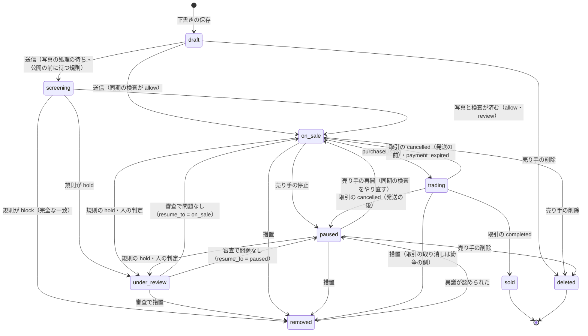
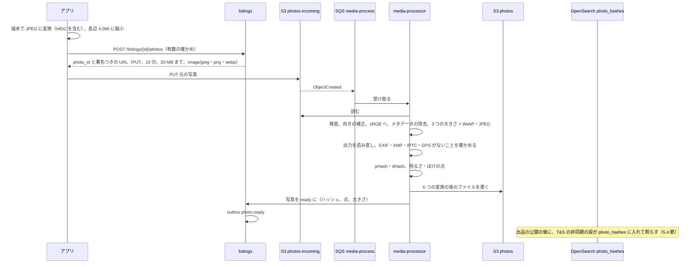
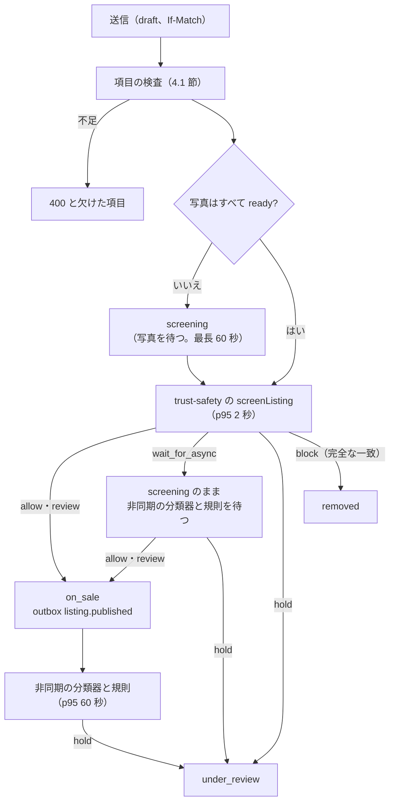

# Listings and photos: Mercari

出品と写真。出品の作成・編集・下書き・停止・削除・再出品、出品の状態の機械とバージョン、写真の受け付けと変換（向きの補正、位置情報の除去、縮小、形式の変換）、知覚ハッシュと写真の使い回しの検出、出品の質の検査、同期の検査の呼び出し、事業者に当たりうる売り手の印（法務の L3）を決める。

前提となる決定は次のとおり。

- 購入は `purchaseListing` だけが行い、出品の行の条件つきの更新（`status = 'on_sale' AND version = $expected AND price = $price`）と取引の挿入を同じトランザクションで書く（[ADR-0002](../decisions/0002-transaction-state-machine-and-single-purchase.md)）
- 出品の見える範囲は `listingVisible(viewer, listing)` の 1 か所で決める（[ADR-0007](../decisions/0007-single-tenant-and-party-visibility.md)）
- 索引は出品のバージョンを外部のバージョンにする（[ADR-0008](../decisions/0008-search-engine-and-index.md)）
- T&S は同期の検査 → 公開 → 非同期の分類器 → 規則 → 人の審査 → 措置の記録の段に分ける。規則だけで効かせてよいのは `hold` と完全な一致の `block` まで（[ADR-0009](../decisions/0009-trust-and-safety-pipeline-boundary.md)）
- 写真の変換は sharp を汎用の部品として使う（[ADR-0001](../decisions/0001-platform-and-stack.md)）

この文書で決めたことは次の ADR にある。

| ADR | 決定 |
| --- | --- |
| [0011](../decisions/0011-listing-state-machine-and-versions.md) | 出品の状態を `draft`・`screening`・`on_sale`・`paused`・`trading`・`sold`・`under_review`・`removed`・`deleted` の 9 つにし、遷移は `packages/listings` の `transitionListing()` だけが書く。取引に伴う遷移も、取引の同じトランザクションの中でこの関数を呼ぶ。買い手に見える変更のたびに `version` を 1 上げる。再出品は新しい出品を作り、元を変えない |
| [0012](../decisions/0012-photo-pipeline-and-perceptual-hashes.md) | 写真は署名つきの URL で S3 に直接上げ、`media-processor` が sharp で検査・向きの補正・メタデータの全部の除去・3 つの大きさの WebP と JPEG への変換を行う。出力を読み直して EXIF・XMP・GPS がないことを確かめてから使う。知覚ハッシュは 64 ビットの pHash と dHash を持つ |
| [0013](../decisions/0013-photo-reuse-index.md) | 他の売り手の写真の使い回しの検出は、OpenSearch の別の索引 `photo_hashes` に、pHash を 16 ビットずつ 4 つに分けた帯を入れ、帯の一致で候補を引いて Hamming 距離で確かめる。距離 3 以下は必ず見つける。結果は T&S の信号だけにする |

## 1. 範囲

- 扱う：出品の項目と上限、出品の状態の機械とバージョン、下書き、編集、価格の変更、停止と再開、削除、再出品、写真のアップロードと変換、知覚ハッシュ、写真の使い回しの索引、出品の質の検査、同期の検査の呼び出しと「確認中」、事業者に当たりうる売り手の印の枠組み。
- 扱わない：
  - カテゴリ・状態の段・ブランド・サイズの定義と、価格の提案（[categories-brands-and-pricing-suggestions.md](categories-brands-and-pricing-suggestions.md)）。
  - 同期の検査の中身、規則、措置（[trust-and-safety.md](trust-and-safety.md)）。この文書は呼び出しの口と結果の扱いを決める。
  - 索引への反映と検索（[search-and-discovery.md](search-and-discovery.md)）。
  - `purchaseListing` と取引の状態（`transactions-and-state-machine.md`）。この文書は、取引が出品の状態を変える口を決める。
  - 写真の配信の CDN の設定（`infrastructure.md`）。この文書は URL の形とキャッシュの規則だけを決める。

## 2. 事実（確かめたこと）

いずれも 2026-10-10 に確認。

| 項目 | 事実 | この設計 |
| --- | --- | --- |
| 本家の写真の枚数 | 20 枚まで（[ヘルプの記事 62](https://help.jp.mercari.com/guide/articles/62/)。統合の工程で確かめた） | 10 枚（本家との意図した違い。[README.md](README.md) の 1.4 節） |
| 本家の題名・説明の文字数、価格の幅 | 商品名 40 文字、価格 300 円〜9,999,999 円（同上）。説明の上限は書いていない（**未検証**） | 題名 40 文字（本家と同じ）、説明 1,000 文字（本システムの値） |
| sharp のメタデータ | 既定で出力からすべてのメタデータ（EXIF の向きを含む）を除く。`keepMetadata()`・`withMetadata()` で残す（[sharp の Output options](https://sharp.pixelplumbing.com/api-output)） | 残す関数を呼ばない。lint で禁じる |
| 本家の重複・盗用の写真の検出 | 公式の資料で確かめられなかった（**未検証**） | 自前の知覚ハッシュ（4・5 節） |

## 3. 要件

| 要件 | 値 | 出どころ |
| --- | --- | --- |
| 写真の処理 | 上げ終わりから変換の完了まで p95 5 秒。配信 p95 100ms | NFR-015 |
| 位置情報 | 配る写真のすべてに EXIF・XMP の GPS が 0 件 | [quality.md](../quality.md) の 5 節（E3 の合否） |
| 同期の検査 | 出品の送信から公開の判定まで p95 2 秒 | NFR-009 |
| 検索への反映 | 公開・編集・停止から検索に出るまで p95 10 秒 | NFR-001（[search-and-discovery.md](search-and-discovery.md) の 4.4 節で予算を分ける） |
| 措置の反映 | 措置から購入の拒否まで p99 60 秒。core の出品の状態で必ず拒む | NFR-016 |
| 出品の速さ | 写真の撮影から公開まで中央値 60 秒以内 | K10 |
| 二重の販売 | 出品の状態の遷移で、進行中の取引 0 か 1 を壊さない | NFR-003 |

## 4. 出品

### 4.1 項目と上限

| 項目 | 型・上限 | 必須 |
| --- | --- | --- |
| 写真 | 1〜10 枚。並び順を持つ。1 枚目が表紙 | 公開に必須 |
| 題名 | 1〜40 文字（書記素の数。NFKC の後） | 公開に必須 |
| 説明 | 0〜1,000 文字 | 任意 |
| カテゴリ | 最も深い階層（3 階層目）の ID。木のバージョンつき | 公開に必須 |
| 状態 | 6 段のコード | 公開に必須 |
| ブランド | ブランドの ID か「なし」 | 任意（カテゴリの設定で必須にできる） |
| サイズ | カテゴリのサイズの方式のコード | カテゴリの設定に従う |
| 配送の方法 | `<Brand>便` のサイズの段、または匿名でない方法（本人確認が要る。[identity-verification.md](identity-verification.md)） | 公開に必須 |
| 配送料の負担 | `seller`・`buyer` | 公開に必須 |
| 発送までの日数 | `1_2`・`2_3`・`4_7` | 公開に必須 |
| 発送元の地域 | 都道府県のコード | 公開に必須 |
| 価格 | 整数の円、300〜9,999,999 | 公開に必須 |

- 文字は保存の前に NFKC で正規化し、制御文字とゼロ幅の文字を除く。絵文字は残す。
- 題名・説明の本文はログに出さない（[AGENTS.md](../../AGENTS.md)）。

### 4.2 状態の機械（ADR-0011）

| 状態 | 検索 | 購入 | 売り手の編集 | `listingVisible()` の既定 |
| --- | --- | --- | --- | --- |
| `draft` | 出ない | できない | できる | 売り手だけ |
| `screening` | 出ない | できない | できない（「確認中」） | 売り手だけ |
| `on_sale` | 出る | できる | できる | `visible` |
| `paused` | 出ない | できない | できる | 売り手だけ（共有のページは `hidden`） |
| `trading` | 売り切れとして出る（既定の検索は販売中だけ） | できない | できない | `visible_readonly` |
| `sold` | 売れた品の検索に出る（保持の期間） | できない | できない | `visible_readonly` |
| `under_review` | 出ない | できない | できない | 売り手には理由のコードつきで見える |
| `removed` | 出ない | できない | できない | 売り手と取引の 2 者に理由つきで見える |
| `deleted` | 出ない | できない | できない | `hidden` |

- 遷移は `packages/listings` の `transitionListing(listing_id, event, actor, expected_version)` だけが書く。行を `SELECT ... FOR UPDATE` で取り、決定表（DT-LST-001、下）で次の状態を決め、`listing_events` に行を足し、outbox を書く。
- `purchaseListing` と取引の遷移の関数は、core の同じトランザクションの中でこの関数を呼ぶ。`on_sale → trading` は、ADR-0002 の条件つきの更新（`status`・`version`・`price` の一致）としてこの関数が書く。
- `trading` の出品は、措置（`removed`）以外の事象を拒む。売り手は取引中に価格・写真・題名を変えられない。
- `cancelled`（発送の前）・`payment_expired` の取引で `on_sale` に戻すとき、出品が `removed` なら戻さない（ADR-0002）。発送の後の取り消しは `paused` に戻す（`transactions-and-state-machine.md` の 6.3 節、ADR-0027）。戻すときは `version` を上げ、古い画面からの購入を 409 にする。
- `under_review` は、入る前の状態を `resume_to`（`on_sale`・`paused`）に持つ。審査で問題がなければそこへ戻す。
- `removed` から戻るのは異議が認められたときだけで、`paused` に戻す（売り手が中身を見直して再開する）。措置の記録は [trust-and-safety.md](trust-and-safety.md) の 9 節。

**決定表 DT-LST-001（草案）**：上から順に評価し、最初に一致した行を使う。

| # | 今の状態 | 事象 | 条件 | → 次の状態 |
| --- | --- | --- | --- | --- |
| 1 | `sold`・`deleted` | どれでも | - | そのまま（409 `listing_closed`） |
| 2 | どれでも | どれでも | `expected_version` が違う | そのまま（409 `version_mismatch`） |
| 3 | どれでも（`sold`・`deleted` を除く） | 措置 `remove` | `moderation_actions` の行がある | `removed` |
| 4 | `on_sale`・`paused`・`screening` | 措置 `hold` | `moderation_actions` の行がある | `under_review` |
| 5 | `trading` | 措置 `hold` | - | そのまま（審査の案件だけ作る。取引の扱いは紛争の側） |
| 6 | `on_sale` | 購入 | 価格・バージョンが一致 | `trading` |
| 7 | `trading` | 取引の取り消し（発送の前）・支払いの期限切れ | - | `on_sale` |
| 7a | `trading` | 取引の取り消し（発送の後） | - | `paused`（品が売り手の手元にあるとは限らない。[ADR-0027](../decisions/0027-cancellation-rules-and-listing-restoration.md)） |
| 8 | `trading` | 取引の完了 | - | `sold` |
| 9 | `draft` | 送信 | 写真がすべて `ready`、同期の検査が `allow`・`review` | `on_sale` |
| 10 | `draft` | 送信 | 写真の処理の待ち、または規則が `wait_for_async` | `screening` |
| 11 | `draft`・`screening` | 同期の検査が `block` | 完全な一致 | `removed` |
| 12 | `screening` | 写真と検査が済む | `allow`・`review` | `on_sale` |
| 13 | `screening` | 規則の判定 | `hold` | `under_review` |
| 14 | `on_sale` | 停止 | 主体は売り手 | `paused` |
| 15 | `paused` | 再開 | 同期の検査が `allow`・`review` | `on_sale` |
| 16 | `under_review` | 審査で問題なし | - | `resume_to` |
| 17 | `removed` | 異議が認められた | `moderation_actions` の取り消しの行がある | `paused` |
| 18 | `draft`・`on_sale`・`paused` | 削除 | 主体は売り手 | `deleted` |
| 19 | どれでも | 上のどれにも当たらない | - | そのまま（422 `invalid_transition`） |

### 4.3 バージョン

- `listings.version`（bigint）は、買い手に見える変更（状態、価格、題名、説明、写真、カテゴリ、ブランド、状態の段、配送）のたびに 1 上げる。いいねの数・閲覧の数では上げない。
- 購入の要求は見た `version` と `price` を持つ（ADR-0002）。検索の索引の外部のバージョンにも使う（[search-and-discovery.md](search-and-discovery.md) の 4.4 節）。
- 編集は `If-Match: <version>` を求め、違えば 409 と今の内容を返す。2 つの端末からの編集の後勝ちを防ぐ。

### 4.4 価格の変更

- `on_sale` で変えられる（条件つきの更新は `transactions-and-state-machine.md` の 5.4 節）。範囲は 300〜9,999,999 円。
- 変えたら outbox に `listing.price_changed` を、下げたときは加えて `listing.price_dropped`（前の価格、新しい価格）を書く。いいねした人への値下げの通知（1 出品 24 時間に 1 回まで）は `notifications.md`、保存した検索への当て直しは [saved-searches-and-alerts.md](saved-searches-and-alerts.md) の 5 節。
- 1 出品の価格の変更は 1 日 10 回まで。値下げの通知の釣り（上げて下げる）を抑える。
- 値下げ交渉（コメント）と価格の変更の結び付きは `transactions-and-state-machine.md`。

### 4.5 下書き・削除・再出品

- 下書きは 1 人 50 件まで、最後の更新から 180 日で消す（写真も消す）。下書きは本人だけの表に置く（FORCE RLS）。
- 削除は論理の削除（`deleted`）。公開の画面から消え、写真の配信を止める（6.3 節）。行は、取引・措置の記録との結び付きのために残す。消す時期は保持の規則（`security.md`）に従う。
- 再出品は、`sold`・`deleted`・`paused` の出品の項目と写真の参照を写した新しい出品（新しい ID、`relisted_from`）を下書きで作る。元の出品は変えない。いいね・コメントは引き継がない。写真は新しい出品の写真として参照を足す（写真の実体は写さない。参照の数で消す時期を決める）。

## 5. 写真

### 5.1 流れ（ADR-0012）

| 段 | 内容 | 失敗のとき |
| --- | --- | --- |
| 受け付け | 署名つきの URL の条件で、大きさ 20 MB まで、Content-Type は `image/jpeg`・`image/png`・`image/webp` | S3 が拒む |
| 形式の検査 | 先頭のバイトで形式を確かめ、宣言の Content-Type と違えば `rejected_format` | 写真を `failed`、アプリに理由 |
| 大きさの検査 | 画素の数 5,000 万以下、短辺 320 以上（展開の前にヘッダーで確かめる。sharp の `limitInputPixels` を 5,000 万にする） | `rejected_dimensions` |
| 向き | EXIF の Orientation で回す（`rotate()`）。その後、メタデータを残さない | - |
| 色 | sRGB に変換する。ICC は残さない | - |
| 変換 | `thumb`（長辺 240）、`medium`（長辺 640）、`large`（長辺 1,280）。どれも WebP（品質 80）と JPEG（品質 82、プログレッシブ） | 1 回だけ再試行、続けば `failed` |
| メタデータの確かめ | 6 つの出力を読み直し、EXIF・XMP・IPTC の塊がないこと、ファイルに `GPS` の印がないことを確かめる | 1 つでも残れば `failed`、SEV2 の候補として警告 |
| ハッシュ | 5.3 節 | - |
| 質の点 | 5.5 節 | - |

- 元の写真（`photos-incoming`）は、変換の後 24 時間で消す（S3 のライフサイクル）。位置情報を含みうる元を長く持たない。審査で元が要るときは、変換の後の `large` を使う。
- アプリは送る前に端末で JPEG にし、長辺 4,096 に縮める。HEIC をサーバーで受けない（サーバーの変換の部品に HEVC の復号を入れない）。
- sharp のメタデータを残す関数（`keepMetadata`・`withMetadata`・`keepExif`・`keepIccProfile`）の呼び出しは lint で禁じる。

### 5.2 処理の時間の予算

| 区間 | p95 |
| --- | --- |
| S3 の通知から Worker の受け取り | 0.5 秒 |
| 元を読む（平均 3 MB） | 0.4 秒 |
| 展開、向き、色、6 つの変換 | 2.2 秒（2 vCPU） |
| 読み直しの確かめ、ハッシュ、質の点 | 0.4 秒 |
| 書き込み（6 ファイル）と `listings` への登録 | 0.7 秒 |
| 計 | 4.2 秒（NFR-015 の 5 秒に 0.8 秒の余り） |

- S1 の量：新しい出品 30 万件/日 × 平均 5 枚 = 150 万枚/日、平均 17 枚/秒。夕方の山を平均の 4 倍と見て 70 枚/秒。1 枚 2.6 秒の CPU なら 2 vCPU のタスクで 0.8 枚/秒、山に 90 タスク。数は `capacity.md` で確かめる（見込み）。
- 待ち行列の最古の仕事の年齢が 10 秒を 5 分続けたら警告し、タスクを増やす。

### 5.3 知覚ハッシュ

2 つの 64 ビットのハッシュを、`large` の JPEG を作る前の画素（向きを直した sRGB）から計算する。

- **pHash**：濃淡にし、32×32 に縮め（面積の平均）、2 次元の DCT をかけ、左上 8×8 の 64 個の係数を取る。直流を除く 63 個の中央の値を求め、64 個の各係数が中央の値より大きければ 1 にする。上の行から順に詰める。
- **dHash**：濃淡にし、9×8 に縮め、各行で隣どうしを比べて左が大きければ 1 にする（8×8 = 64 ビット）。
- 距離は Hamming 距離（XOR のビットの数）。

| 距離（pHash） | 意味 | 使い道 |
| --- | --- | --- |
| 0（かつ dHash も 0） | 同じ写真とみなす | 禁止のハッシュの一覧の完全な一致（規則で `block` できる唯一の写真の一致。[trust-and-safety.md](trust-and-safety.md) の 5.3 節） |
| 1〜6 | 再圧縮・縮小・小さな切り抜きの近い写真 | 禁止の一覧なら `hold` の信号、他の売り手との一致なら使い回しの信号 |
| 7〜10 | 似ているが別の写真でありうる | 信号に使わない（記録だけ） |

- 値は `counterfeit-classifier-poc` と同時に、生成した写真の歪みの集まり（JPEG の品質 50〜95、縮小 0.25〜1 倍、切り抜き 0〜10%、明るさ ±20%）で確かめる。確かめるまでの閾値は上の表の値にする。
- 一面がほぼ同じ色の写真（濃淡の標準偏差が 8 未満）は、ハッシュがつぶれるので `hash_degenerate` にし、一致の信号に使わない。

### 5.4 写真の使い回しの索引（ADR-0013）

他の売り手の写真をそのまま使った出品（盗用の写真、偽ブランドの業者の使い回し）を見つける。

- **置き場所**：OpenSearch の別の索引 `photo_hashes`（出品の索引と同じドメイン）。文書は写真ごと：`photo_id`、`listing_id`、`seller_id`、`phash`（long）、`dhash`（long）、`b0`〜`b3`（pHash の 16 ビットずつの帯。keyword、16 進 4 文字）、`listing_status`、`created_at`。
- **入れる範囲**：`on_sale`・`trading`・`sold`（売れてから 90 日）の出品の写真。S1 で 3,000 万件 × 5 枚 + 売れた品 900 万件 × 5 枚 ≒ 2 億枚。
- **引き方**：新しい出品の写真ごとに、`b0`〜`b3` のどれかが同じ文書を引き（`bool.should` の 4 つの `term`、`seller_id` が同じものを除く）、`script` の絞り込みで `Long.bitCount(phash ^ q) <= 6` のものだけを返す（最大 50 件）。
- **鳩の巣の保証**：64 ビットを 4 つの帯に分けると、距離 3 以下の 2 つのハッシュは少なくとも 1 つの帯が同じになる。距離 3 以下は必ず見つける。距離 4〜6 は確率で見つかる。

**例：距離 4 の写真を見つける確率**

- 4 つのビットの違いが 64 ビットに一様に散るとする。4 つの帯がすべて 1 つずつ違いを持つ（＝どの帯も一致しない）並べ方は 16⁴ = 65,536 通り。4 ビットの選び方の全体は C(64, 4) = 635,376 通り。
- 見つからない確率は 65,536 / 635,376 ≒ 0.103。見つかる確率は約 90%。
- 距離 5 では、どの帯も一致しない確率が約 0.26 で、見つかる確率は約 74%。距離 6 は、どの帯も一致しない確率が約 0.42 で、見つかる確率は約 58%。
- 再圧縮・縮小だけの写真は、生成した集まりで多くが距離 0〜3 に入る見込み（`counterfeit-classifier-poc` で確かめる）。距離 4〜6 の取りこぼしは許し、記録した見つかる率を T&S の評価の集まりで見る。

- **量**：帯の値 1 つあたりの平均の文書の数は 2 億 ÷ 65,536 ≒ 3,050。4 つの帯で約 1.2 万件を `script` で比べる。1 回 20〜40ms の見込み（`search-index-poc` で測る）。新しい写真は平均 17 枚/秒、山 70 枚/秒。
- 同じ色の写真・よくある背景で帯の値が偏るときは、1 つの帯の値の文書の数が 5 万を超えたら、その帯の値を「よくある値」の一覧に入れて引かない（残りの帯で引く）。
- **結果**：一致は信号 `photo_reuse`（相手の出品、相手の売り手、距離、相手の出品の状態と公開の時刻）として `trust-safety` に渡す。自分の再出品（`relisted_from` の連なり）は除く。どちらが元かは公開の時刻の早いほうとみなす。措置は規則と人が決める（[trust-and-safety.md](trust-and-safety.md) の 6 節）。
- 索引は出品の状態の事象で直す（`sold` から 90 日で消す日次のジョブ）。正本は core の `listing_photos` の列で、索引は作り直せる。

### 5.5 写真の質の点

警告だけに使い、出品を止めない。

| 点 | 計算 | 警告 |
| --- | --- | --- |
| 暗さ | 640 の濃淡の平均（0〜255） | 45 未満で「写真が暗い」 |
| ぼけ | 640 の濃淡の Laplacian の分散 | 60 未満で「写真がぼけている」 |
| 小ささ | 元の短辺 | 640 未満で「写真が小さい」 |
| 写真の質の点 `photo_quality` | 1 枚目の写真について、暗さ・ぼけ・小ささの警告が 0 で 1.0、1 つごとに 0.3 を引く（下限 0.1） | 順位の式の入力（[search-and-discovery.md](search-and-discovery.md) の 5 節） |

### 5.6 配信

- URL：`https://static.<brand>.<domain>/p/{photo_id}/{variant}.{webp|jpg}?v={photo_version}`。`photo_id` は UUIDv7 で推測しにくい。出品の ID を URL に入れない。
- キャッシュ：エッジに 30 日。`Accept` で WebP と JPEG を選ぶ。
- 停止：出品が `removed`・`deleted` になったら、写真の参照を `withdrawn` にし、エッジの無効化を依頼し、配信の元の S3 の物を隔離の接頭辞（`quarantine/`）へ移す。措置から 60 秒以内に無効化を依頼する（NFR-016）。取引の 2 者と審査には、署名つきの短い URL（15 分）で隔離の物を見せる。配信の停止の CDN の仕組みは `infrastructure.md`。

## 6. 出品の送信と同期の検査

### 6.1 流れ

- `screenListing(listing_snapshot)` の契約（中身は [trust-and-safety.md](trust-and-safety.md) の 5 節）：
  - 入力：出品の項目、写真のハッシュ、売り手の ID。
  - 出力：`allow`・`review`・`wait_for_async`・`hold`・`block`、理由のコード、規則のバージョン。
- 同期の検査が 2 秒で返らない・`trust-safety` が落ちているときは、閉じる側に倒し、出品を `screening` にする。`trust-safety` が戻ると、溜まった出品を順に検査する。売り手には「確認中」と示す。公開を検査なしで通さない。
- `screening` で写真を 60 秒待っても `ready` にならなければ、送信を戻して下書きにし、写真の失敗を示す。
- 公開の時刻（`published_at`）は `on_sale` に入った時刻。`screening` の時間は含めない。

### 6.2 出品の質の検査

送信の前に、アプリの画面と送信の時に同じ関数（`packages/listings/quality`）で出す。警告は公開を止めない。必須の項目の欠けだけが止める。

| 検査 | 内容 | 結果 |
| --- | --- | --- |
| 必須 | 4.1 節 | 止める |
| 写真の質 | 5.5 節 | 警告 |
| 題名とカテゴリの食い違い | 題名の語（Sudachi の正規化した形）を、カテゴリの語の辞書（カテゴリごとの代表の語。[categories-brands-and-pricing-suggestions.md](categories-brands-and-pricing-suggestions.md) の 4.4 節）に当てる。別の 1 階層目のカテゴリの強い語だけがあり、選んだカテゴリの語がないとき | 警告と、候補のカテゴリ 3 つ |
| ブランドの書き忘れ | 題名にブランドの辞書の別名があり、ブランドが「なし」 | 警告とブランドの候補 |
| 価格の桁 | 価格の提案の中央の値の 1/10 未満か 10 倍超 | 警告「桁を確かめてください」 |

## 7. 事業者に当たりうる売り手の印（枠組み。法務の確認待ち L3）

- 数多く売る個人が「販売業者」に当たる基準と、当たったときの表示の義務・匿名の配送との両立は、法務の確認待ち（[intent.md](../intent.md) の L3）。
- 設計は、印を付ける計算と、印の効果を分ける。
  - 計算：日次のジョブが、売り手ごとに直近 30 日・365 日の出品の数、販売の数、販売の額、新品・未使用の割合、同じ品の繰り返しの数を集め、`seller_business_signals` に書く。
  - 判定：閾値は `legal.business_seller_*` に置く。法務の結論までは本番で無効にし、印を付けない。開発の環境では仮の値（30 日に販売 50 件以上、または 365 日に販売の額 100 万円以上）で試す。
  - 効果：表示の欄の提供、規約の案内、運用の確かめの待ち行列への登録を、結論に合わせて `release.business-seller-flag` の裏で開く。

## 8. 失敗と回復

| 事象 | 影響 | 扱い |
| --- | --- | --- |
| `media-processor` の停止・遅れ | 写真が `processing` のまま、公開が `screening` で待つ | SQS に溜まる。最古の年齢で警告、タスクを増やす。60 秒を超えた送信は下書きに戻る |
| 変換の失敗（壊れたファイル） | その写真が使えない | `failed` と理由をアプリに出し、撮り直しを促す |
| メタデータの確かめの失敗 | 位置情報が残りうる | その写真を `failed` にし、配信しない。部品の更新の誤りとして SEV2 の候補 |
| `trust-safety` の停止 | 公開が止まる | 閉じる側（6.1 節）。運用の手順で状況を出品の画面に出す |
| `photo_hashes` の停止 | 使い回しの信号が欠ける | 信号なしで規則を回し、復旧の後に止まった間の写真を流し直す（`photo.ready` を再生） |
| 出品の更新の競合 | 編集が 409 | 今の内容を返し、アプリが差を出す |
| `transitionListing` と取引の競合 | 決定表の 2 行目で一方が 409 | 取引の側は ADR-0002 の手順で返す |
| core のフェイルオーバー | 書き込みが数十秒止まる | 送信は冪等キー（`Idempotency-Key`）で再送できる |

## 9. 上限

| 対象 | 値 | 備考 |
| --- | --- | --- |
| 写真 | 1 出品 10 枚、1 枚 20 MB、5,000 万画素、短辺 320 以上 | 本家は 20 枚（1 枚の大きさは**未検証**） |
| 題名・説明 | 40 文字・1,000 文字 | 題名は本家と同じ。説明は本システムの値 |
| 価格 | 300〜9,999,999 円 | [intent.md](../intent.md) |
| 価格の変更 | 1 出品 1 日 10 回 | 本システムの値 |
| 公開中の出品 | 1 人 2,000 件（新しいアカウントは 30 日の間 50 件） | 規則で絞れる（[trust-and-safety.md](trust-and-safety.md)） |
| 新しい出品 | 1 人 1 日 200 件 | 規則で絞れる |
| 下書き | 1 人 50 件、180 日 | - |
| 写真のアップロード | 1 人 1 時間 300 枚、同時 10 | 速さの上限（`security.md`） |
| 署名つきの URL | 10 分 | - |

## 10. data-model への項目

列・鍵・索引の正本は data-model の領域（`data-model.md`）でまとめる。下の表は、この領域が求めた項目の要点である。

| 置き場所 | 中身 | 節 |
| --- | --- | --- |
| Aurora core `listings`（`listing_id`（UUIDv7）、`seller_id`、`status`、`resume_to`、`version`、`title`、`description`、`category_id`、`category_tree_version`、`condition`、`brand_id`、`size_code`、`shipping_method`、`shipping_payer`、`ship_days`、`ship_from_pref`、`price`、`like_count`、`photo_quality`、`relisted_from`、`published_at`、`sold_at`、`created_at`、`updated_at`）。索引 `(seller_id, status)`、`(status, published_at)` | 出品の正本 | 4 |
| Aurora core `listing_events`（`listing_id`、`seq`、`from_status`、`to_status`、`event`、`actor_kind`（`seller`・`buyer`・`system`・`ts_rule`・`reviewer`）、`actor_id`、`reason_code`、`moderation_action_id`、`transaction_id`、`version`、`created_at`）。追記だけ | 遷移の記録 | 4.2 |
| Aurora core `listing_drafts`（本人だけ。FORCE RLS） | 下書き | 4.5 |
| Aurora core `listing_photos`（`photo_id`（UUIDv7）、`listing_id`、`position`、`state`（`uploading`・`processing`・`ready`・`failed`・`withdrawn`）、`fail_reason`、`width`、`height`、`phash`、`dhash`、`hash_degenerate`、`dark_score`、`blur_score`、`photo_version`、`created_at`） | 写真 | 5 |
| Aurora core `seller_business_signals`（`seller_id`、`window`、`listings`、`sales`、`sales_yen`、`new_ratio`、`computed_at`） | 事業者の兆し | 7 |
| S3 `photos-incoming/{listing_id}/{photo_id}`（24 時間）、`photos/{photo_id}/{variant}.{ext}`、`photos/quarantine/…` | 写真の置き場 | 5 |
| OpenSearch `photo_hashes` | 使い回しの索引 | 5.4 |
| SQS `media-process`、outbox の話題 `listing.published`・`listing.updated`・`listing.price_changed`・`listing.price_dropped`・`listing.status_changed`・`photo.ready` | 事象 | 5、6 |
| AppConfig `legal.business_seller_*`、`release.business-seller-flag` | 事業者の印 | 7 |

## 11. テストと性質

| ID | 性質・試験 |
| --- | --- |
| PROP-LST-001 | 任意の出品の事象（送信、停止、再開、価格の変更、購入、取引の取り消し・完了、措置、異議、削除）の並行の列で、出品の状態は DT-LST-001 の遷移だけを通る。`trading` の出品にはちょうど 1 つの進行中の取引があり、`on_sale` の出品には 0（[quality.md](../quality.md) の 2.2.1 節 A と同じ生成器） |
| PROP-LST-002 | 任意の編集の列で、`version` は買い手に見える変更のたびに 1 だけ増え、減らない |
| PROP-LST-003 | `removed` の出品は、取引の取り消しの後も `on_sale` に戻らない |
| PROP-LST-004 | 任意の合成の写真（EXIF・XMP・IPTC の GPS、Orientation 1〜8、ICC を含む）で、6 つの出力のすべてにメタデータの塊と `GPS` の印がない。向きは Orientation に従って正しい（E3 の合否） |
| PROP-LST-005 | 任意の 64 ビットのハッシュの組で、距離 3 以下なら `photo_hashes` の引き方が必ず見つける（帯の分け方の参照の実装との比べ） |
| PROP-LST-006 | `screening` の出品は、同期の検査の結果がない限り `on_sale` にならない（`trust-safety` の停止を注入しても） |
| DT-LST-001 | 4.2 節の決定表の全行を表駆動テストで確かめる |
| 試験のベクトル | pHash・dHash の計算（固定の画像と期待するビット列）、写真の質の点 |
| 負荷 | 写真 70 枚/秒を 1 時間、変換の完了 p95 5 秒（NFR-015） |
| 外からの見張り | 見張りの出品の写真から位置情報が消えていること、出品から検索まで（NFR-001） |

## 12. Story の候補

| Epic | Story | 中身 |
| --- | --- | --- |
| E3 | `photo-upload-and-processing` | 署名つきの URL、検査、向き、メタデータの除去と確かめ、変換、ハッシュ、質の点（5.1〜5.5 節） |
| E3 | `photo-delivery-and-withdrawal` | 配信の URL、停止と隔離（5.6 節） |
| E3 | `listings-crud-and-drafts` | 作成・編集・下書き・削除・再出品、バージョン、`If-Match`（4 節） |
| E3 | `listing-states` | 状態の機械、DT-LST-001、取引・措置との結び付き（4.2 節） |
| E3 | `listing-quality-checks` | 質の検査（6.2 節） |
| E3 | `listing-sync-checks` | `screenListing` の呼び出し、`screening`、閉じる側への倒し方（6.1 節） |
| E3 | `photo-reuse-index` | `photo_hashes` の索引と引き方（5.4 節） |
| E3 | `business-seller-flag` | 兆しの計算と印の枠組み（7 節）。基準は法務：L3 |

## 13. 未解決の問い

### 決定（2026-10-10、既定案）

- **出品の状態**：9 つの状態と DT-LST-001。遷移の関数は 1 つ（ADR-0011）。
- **再出品**：新しい出品を作る。いいね・コメントを引き継がない。
- **写真**：10 枚、20 MB、端末で JPEG にする。サーバーで HEIC を受けない。メタデータは全部除き、出力を読み直して確かめる。元は 24 時間で消す（ADR-0012）。
- **ハッシュ**：pHash と dHash。完全な一致は両方の距離 0。近いは pHash の距離 1〜6。
- **使い回し**：OpenSearch の `photo_hashes` と 4 つの帯。距離 3 以下は必ず、4〜6 は確率で見つける（ADR-0013）。
- **同期の検査が落ちたとき**：閉じる側（`screening`）。

### 持ち越し

| 問い | いつ・どう決めるか |
| --- | --- |
| 数多く売る個人の基準と、印の効果（表示の欄、匿名の配送との両立）（L3） | 法務の確認待ち。E3 の `business-seller-flag` の spec の承認の前 |
| ハッシュの閾値（完全な一致、1〜6）と、歪みへの強さ | E14 の前の `counterfeit-classifier-poc` の生成した写真の集まりで Dev と QA が決める |
| `photo_hashes` の引き方の速さと、よくある帯の値の一覧の閾値 | E5 の前の `search-index-poc` で測る |
| 写真の配信の大きさの段（`large` を 1,280 にするか 1,080 にするか）と費用 | `capacity.md` で費用のモデルと合わせて決める |
| 写真の枚数を本家（20 枚）に寄せるか | `cost-baseline` の後に PM。保管と転送の費用で決める（説明の上限の本家の値は**未検証**） |
| 出品の行・写真の保持の期間（削除・退会の後） | `security.md` の保持の規則と法務の L5 |
