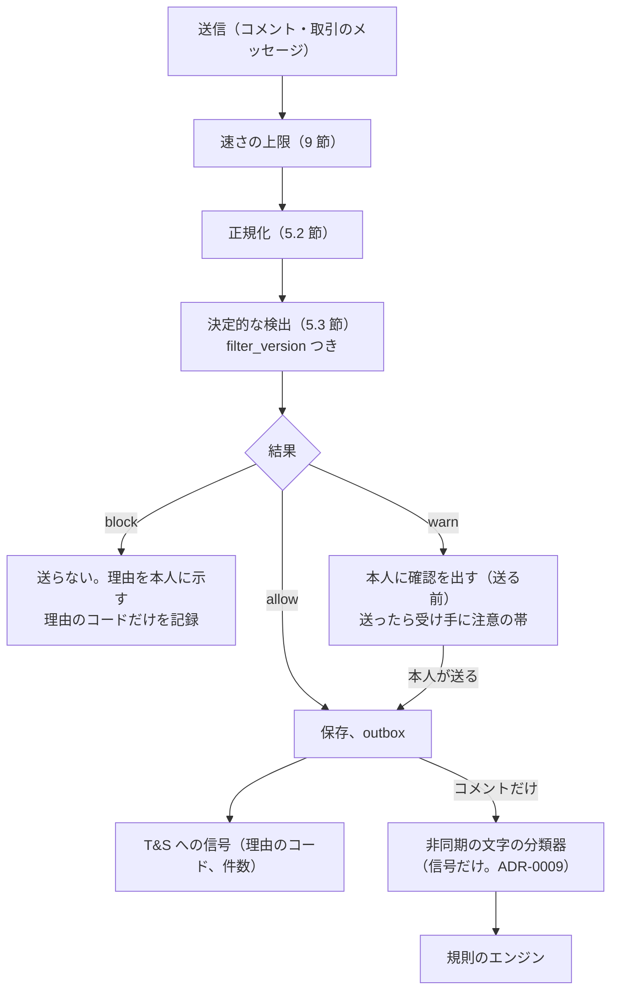

# Messaging and comments: Mercari

商品のコメント（公開）と取引のメッセージ（2 者）。置き場所と見える範囲、書ける期間、悪用の絞り込み（禁止の語、連絡先の交換、住所の書き込み、外部の取引・支払いへの誘導）、通信の秘密との関係の枠組み（法務の L11）、通報、削除の申し出（法務の L9）を決める。

前提となる決定は次のとおり。

- 取引のメッセージは取引の 2 者の表で、買い手と売り手の RLS にする。商品のコメントは公開の表（[ADR-0007](../decisions/0007-single-tenant-and-party-visibility.md)）
- コメント・メッセージは Aurora content に置く（[ADR-0001](../decisions/0001-platform-and-stack.md)）
- 分類器の点は信号だけで、措置は規則と人が `moderation_actions` に書いてから効かせる（[ADR-0009](../decisions/0009-trust-and-safety-pipeline-boundary.md)）
- 本文をログに出さない。運用者が本文を見るのは通報のあったメッセージに限る（[AGENTS.md](../../AGENTS.md)、[architecture/README.md](README.md) の 6 節）
- 匿名の配送では、相手の住所・氏名・電話番号をメッセージに出さない（NFR-014、[ADR-0006](../decisions/0006-shipping-orchestration-via-carriers.md)）

この文書で決めたことは次の ADR にある。

| ADR | 決定 |
| --- | --- |
| [0046](../decisions/0046-comments-and-transaction-messages-storage.md) | 商品のコメントは content の公開の表 `listing_comments` に、出品の `listingVisible()` に従って出す。書けるのは `on_sale` の間だけ。取引のメッセージは content の 2 者の表 `transaction_messages`（FORCE RLS、`buyer_id`・`seller_id`）に置き、取引が終わった後 14 日で読み取りだけにする。本文は文字だけ（MVP は画像なし）。どちらも削除は論理の削除で、本文を消した後も通報・措置のために暗号化した写しを保持の期間だけ持つ |
| [0047](../decisions/0047-send-time-abuse-filter-and-scan-modes.md) | 悪用の絞り込みは、送る時の同期の決定的な検査（`packages/abuse-filter`、バージョンつき）にする。正規化（NFKC、かな数字・漢数字・丸数字の数字への直し、区切りの除き）の後、電話・メール・URL・他のサービスの ID・住所・外部の支払いの誘導・禁止の語を見つけ、`block`・`warn`・`allow` を返す。記録は理由のコードだけで、本文の一致の部分を残さない。取引のメッセージに当てる範囲は `legal.message_scan_mode` で決め、法務の L11 の結論まで本番は送る時の決定的な検査だけにする。分類器はコメントだけに当てる |

## 1. 範囲

- 扱う：コメントとメッセージの項目・上限・状態、見える範囲、書ける期間、削除、悪用の絞り込みの流れと検出の規則、結果の扱い、通信の秘密の枠組み、通報の入口、削除の申し出の入口、通知の事象。
- 扱わない：
  - 値下げ交渉の後の価格の変更と購入（`transactions-and-state-machine.md`）。
  - 通報の案件・審査・措置の流れ（[trust-and-safety.md](trust-and-safety.md) の 8・9 節）。この文書は通報の入口と証拠の写しを決める。
  - 削除の申し出の期限・通知の手順（[trust-and-safety.md](trust-and-safety.md) の 14 節）。
  - 通知の配信（`notifications.md`）。
  - 問題の報告と紛争（`disputes-and-customer-support.md`）。

## 2. 事実（確かめたこと）

| 項目 | 事実 | この設計 |
| --- | --- | --- |
| 本家のコメントの文字数・取引のメッセージの画像 | 公式の資料で確かめられなかった（**未検証**） | コメント 300 文字、メッセージ 1,000 文字、画像なし（本システムの値） |
| 本家のメッセージの検査 | 公式の資料で確かめられなかった（**未検証**） | 送る時の決定的な検査（5 節） |

2026-10-10 に確認。

## 3. 要件

| 要件 | 値 | 出どころ |
| --- | --- | --- |
| 受け付けの可用性 | メッセージと通知の受け付け 月間 99.9% | NFR-007 |
| 送る速さ | 送信の確定 p99 500ms（絞り込みを含む） | NFR-002 の取引の画面の操作に合わせる |
| 通知 | 取引のメッセージの事象からプッシュの依頼まで p95 10 秒 | NFR-008 |
| 住所の秘匿 | 匿名の配送の取引で、相手の住所・氏名・電話番号がメッセージに出た事象 0 | NFR-014、[quality.md](../quality.md) の 2.2.1 節 G |
| 見える範囲 | 取引のメッセージは 2 者だけ。コメントは出品が見える人だけ | ADR-0007 |
| 絞り込みの試験 | 試験のベクトルが緑（E12 の合否） | [quality.md](../quality.md) の 5 節 |

## 4. コメントとメッセージ（ADR-0046）

### 4.1 商品のコメント

| 項目 | 値 |
| --- | --- |
| 本文 | 1〜300 文字（NFKC の後） |
| 書ける人 | ログインした利用者。売り手にブロックされた人、売り手をブロックした人は書けない |
| 書ける時 | 出品が `on_sale` の間 |
| 見える人 | 出品が見える人（`listingVisible()` の文脈 `detail`）。`trading`・`sold` の出品のコメントは読み取りだけで見える |
| 削除 | 書いた人と、出品の売り手が消せる。論理の削除で、画面には「削除されました」 |
| 1 出品の上限 | 500 件 |

- 状態：`visible`、`deleted_by_author`、`deleted_by_seller`、`removed`（措置）。
- コメントの事象（`comment.created`）で、売り手と、同じ出品にコメントした人（直近 30 日、最大 50 人）に通知する（`notifications.md`）。

### 4.2 取引のメッセージ

| 項目 | 値 |
| --- | --- |
| 本文 | 1〜1,000 文字 |
| 書ける人 | 取引の買い手と売り手。運用者は書かない（運用からの連絡は別の「事務局からのお知らせ」で `disputes-and-customer-support.md`） |
| 書ける時 | 取引が `created` から終わった状態（`completed`・`cancelled`・`payment_expired`）になって 14 日まで |
| 見える人 | 2 者だけ（RLS）。運用者は案件に結んだ JIT の権限と通報の範囲だけ（5.6 節） |
| 削除 | できない（取引の記録。紛争の証拠になる）。措置の `removed` だけ |
| 1 取引の上限 | 500 件 |

- 2 者の RLS：`transaction_messages` は `buyer_id`・`seller_id` を持ち、`app.actor_id` がどちらかの行だけを読める（ADR-0007）。書き込みは `messaging` が取引の 2 者かを core の取引で確かめてから行う。
- 取引のメッセージの事象（`transaction_message.created`）で相手に通知する。通知の文に本文を入れない（「メッセージが届きました」と出品の題名）。本文は端末で開いてから読む。

### 4.3 保持

- 削除・措置の後も、通報・措置・紛争・法令の照会のために、本文の暗号化した写し（content の KMS の鍵とは別の T&S の鍵）を保持の期間だけ持つ。保持の期間は法務の確認待ち（L5・L9・L11）。決まるまで、開発の環境の仮の値（180 日）で作る。
- 退会の後の扱いは `accounts-and-devices.md` の退会の規則に従う。取引の相手の見る画面では「退会した利用者」と出し、本文は保持の期間だけ残す。

## 5. 悪用の絞り込み（ADR-0047）

### 5.1 流れ

- 絞り込みは `messaging` のプロセスの中で、メモリーの中だけで行う。本文を外部のサービスに送らない。
- 結果の記録（`abuse_filter_events`）は、メッセージ・コメントの ID、送り手、検出の種類のコード、`filter_version`、結果だけ。一致した文字の部分を残さない。
- `block` の理由は、本人に種類で示す（「電話番号・メールアドレス・住所は送れません」）。どの文字が当たったかは示さない（すり抜けの手がかりを減らす）。

### 5.2 正規化

検出の前に、次を順にかける（`packages/abuse-filter/normalize`）。正規化した文は検出だけに使い、保存しない。

1. NFKC。全角の英数・記号を半角に。
2. ゼロ幅の文字・制御文字を除く。
3. ひらがなをカタカナに。
4. 数字の読み替え：漢数字（〇一二三四五六七八九、零壱弐参）、丸数字（①〜⑳）、かなの読み（ゼロ、レイ、マル、イチ、ニ、サン、ヨン、ゴ、ロク、ナナ、ハチ、キュウ、ク）を、数字の並びの文脈（前後 3 文字の中に数字か区切りがある）で数字に直す。
5. 数字の間の区切り（空白、ハイフン類、ドット、スラッシュ、括弧、「の」）を除いた写しを別に作る。
6. メールの読み替え：「アットマーク」「(at)」「＠」を「@」、「ドット」「(dot)」を「.」に。

### 5.3 検出の規則（`filter_version` 1）

| 種類 | 規則 | コメント | 取引のメッセージ |
| --- | --- | --- | --- |
| `phone` | 5.2 節の 5 の写しで、`0` で始まる 10〜11 桁の数字の並び（携帯 `0[5789]0`、固定 `0[1-9]`）。または `+81` で始まる並び | `block` | `block` |
| `email` | 6 の後で `[^\s@]+@[^\s@]+\.[a-z]{2,}` | `block` | `block` |
| `url` | `http`・`www.`・既知の TLD の並び。本システムの出品の URL（`https://<brand>.<domain>/item/…`）は除く | `block` | `block` |
| `external_id` | 他のサービスの名前の辞書（チャットのアプリ、SNS、決済のアプリ。本システムの値の一覧）と、ID らしい並び（英数と記号 `_`・`.` の 4 文字以上、または `@` の後の並び）が 20 文字の中に両方ある | `block` | `block` |
| `address` | 都道府県の名前（47）＋市区町村の名前の辞書＋番地の形（`\d+(丁目|番地?|号|-\d+)`）が 40 文字の中に並ぶ。または `〒?\d{3}-?\d{4}` の郵便番号 | `block` | 匿名の配送の取引で `block`。匿名でない配送の取引では `warn` |
| `offplatform_payment` | 5.4 節の点が 0.8 以上 | `block` | `block` |
| `offplatform_payment` | 5.4 節の点が 0.5 以上 0.8 未満 | `warn` | `warn` |
| `prohibited_term` | T&S の禁止の語の辞書の完全な一致（[trust-and-safety.md](trust-and-safety.md) の 5.2 節） | `block` | `block` |
| `harassment` | 侮辱・差別の語の辞書 | `warn` | `warn` |

- 規則は `filter_version` の付いたコードのバージョンとして出す。辞書（他のサービスの名前、市区町村、禁止の語、侮辱の語）は T&S が持つバージョンの付いた設定で、変更は影の評価（送らせたまま結果だけ記録する 7 日）を通す。
- 本システムの運用の窓口の電話番号などは許可の一覧に置く。

### 5.4 外部の支払いへの誘導の点

語の組の重みを足し、1.0 で頭打ちにする。語は正規化の後の文で、40 文字の窓の中の組だけを数える。

| 語の組 | 重み |
| --- | --- |
| 「直接」「アプリの外」「ここ以外」「個人的に」 | 0.3 |
| 「振込」「振り込み」「口座」「現金」「手渡し」「現金書留」 | 0.4 |
| 決済のアプリ・送金のサービスの名前（辞書） | 0.4 |
| 「手数料」と「かからない」「なし」「浮く」「もったいない」の組 | 0.3 |
| 「値引き」「半額」「安く」と、上の支払いの語の組 | 0.2 |
| 取引がまだない（コメント）か、`created` の前の取引のメッセージ | ＋0.1 |

**例 1（取引のメッセージ）**：「ぜろはち ぜろ の 1234 - ５６７８ に連絡ください」

1. NFKC とカタカナ：「ゼロハチ ゼロ ノ 1234 - 5678 ニ連絡クダサイ」。
2. 数字の文脈で「ゼロ」「ハチ」「ゼロ」を 0・8・0 に。区切り（空白、「ノ」、ハイフン）を除いた写し：「08012345678ニ連絡クダサイ」。
3. `0[5789]0` で始まる 11 桁 → `phone` → `block`。本人に「電話番号は送れません」。記録は（`message_id` なし、送り手、`phone`、`filter_version` 1、`block`）だけ。

**例 2（コメント）**：「手数料もったいないので直接振込で半額にしませんか」

- 「手数料」＋「もったいない」0.3、「直接」0.3、「振込」0.4、「半額」＋支払いの語 0.2、取引がまだない ＋0.1。和 1.3 → 1.0 で頭打ち。0.8 以上 → `block`。

**例 3（取引のメッセージ、`paid` の後）**：「振込の確認ありがとうございます。明日発送します」

- 「振込」0.4 だけ。0.4 → `allow`。決済の確認の普通の文を止めない（この文脈の振込は本システムの支払いを指す）。

### 5.5 取引のメッセージに当てる範囲（枠組み。法務の確認待ち L11）

取引のメッセージを、悪用の絞り込みのために機械で調べることと、通信の秘密の関係・同意の取り方・調べてよい範囲・運用者が本文を見る条件は、法務の確認待ち（[intent.md](../intent.md) の L11）。

| `legal.message_scan_mode` | 中身 |
| --- | --- |
| `none` | 取引のメッセージを検査しない |
| `send_time_pattern` | 送る時に、5.3 節の決定的な検査だけを、メモリーの中で行う。保存した本文を後から調べない。分類器に渡さない |
| `send_time_pattern_and_classifier` | 上に加えて、文字の分類器の信号を T&S に渡す |

- 本番の最終の値は法務の結論の後に決める。結論までは、[ADR-0047](../decisions/0047-send-time-abuse-filter-and-scan-modes.md) と [architecture/README.md](README.md) の 6 節の方針（規約の同意の範囲の検査だけ）のとおり、規約の同意の文と一緒に `send_time_pattern`（送る時の決定的な検査）で本番を始める。住所・電話番号の `block` を早くから効かせるため。分類器を足す `send_time_pattern_and_classifier` など、範囲を広げる値は L11 の確認の後に限る（E12 の `abuse-filtering` の承認の条件）。
- 開発・検証の環境では `send_time_pattern_and_classifier` で試す。
- どの値でも、住所・電話番号の `block`（NFR-014 の守り）を外す値を作らない。`none` を選ぶ結論になった場合は、住所の守りの方法（送る前の端末の中の検査など）を法務と再設計する（13 節）。

### 5.6 運用者が本文を見る条件

- 運用者は、通報のあったメッセージ・コメントと、紛争の案件に結んだ取引のメッセージだけを、JIT の権限と理由の入力で見る（ADR-0007、`security.md`）。
- 通報の時に、通報の対象のメッセージと前後 10 件を証拠として写す（`report_evidence`。[trust-and-safety.md](trust-and-safety.md) の 8.1 節）。写しの範囲は法務の L11 の結論で直す。

## 6. 通報と削除の申し出

- 利用者は、コメント・メッセージ・出品・利用者を通報できる。理由のコード（`contact_exchange`、`offplatform`、`harassment`、`counterfeit_suspect`、`prohibited`、`other`）と、任意の文（300 文字）。通報の案件の扱いは [trust-and-safety.md](trust-and-safety.md) の 8 節。
- 権利の侵害の申し出（情報流通プラットフォーム対処法。法務の確認待ち L9）は、通報と別の窓口で受け、法令の案件として扱う（[trust-and-safety.md](trust-and-safety.md) の 14 節）。コメントの削除の判断と申出者・発信者への通知の期限は、結論の後に `legal.*` に入れる。

## 7. 失敗と回復

| 事象 | 影響 | 扱い |
| --- | --- | --- |
| content の書き込みの停止 | 送れない | アプリは送信を端末に保ち、冪等キー（`client_message_id`）で再送する。重複は一意の制約で 1 つ |
| 絞り込みの辞書の読み込みの失敗 | 検出が効かない | 前のバージョンで続ける。どのバージョンも読めなければ、取引のメッセージ・コメントの受け付けを止める（閉じる側。住所の守りのため） |
| 絞り込みの誤検出 | 正しい文が送れない | 本人は言い換えて送れる。誤検出の通報（「この判定はおかしい」）で件数を集め、辞書・規則を直す。影の評価を通してから出す |
| 絞り込みのすり抜け | 連絡先が届く | 受け手の通報、T&S の信号、規則の追加。すり抜けの例を試験のベクトルに足す |
| 通知の失敗 | 相手が気づかない | 取引の画面の未読の数で補う。通知の送り直しは `notifications.md` |

## 8. 上限

| 対象 | 値 |
| --- | --- |
| コメント | 300 文字、1 出品 500 件、1 人 10 分 30 件・1 日 300 件（新しいアカウントは 30 日の間 1 日 50 件） |
| 取引のメッセージ | 1,000 文字、1 取引 500 件、1 人 1 分 10 件 |
| 書ける期間 | コメントは `on_sale` の間、メッセージは取引の終わりから 14 日 |
| 通報 | 1 人 1 日 50 件 |
| `block` の続き | 1 人 1 時間に 10 回 `block` されたら、T&S に `filter_repeat` の信号 |

## 9. data-model への項目

| 置き場所 | 中身 | 節 |
| --- | --- | --- |
| Aurora content `listing_comments`（`comment_id`（UUIDv7）、`listing_id`、`author_id`、`body`、`state`、`client_message_id`、`filter_version`、`filter_outcome`、`created_at`、`deleted_at`）。索引 `(listing_id, created_at)`。一意 `(author_id, client_message_id)` | コメント | 4.1 |
| Aurora content `transaction_messages`（`message_id`（UUIDv7）、`transaction_id`、`buyer_id`、`seller_id`、`sender_id`、`body`、`state`、`client_message_id`、`filter_version`、`filter_outcome`、`created_at`）。FORCE RLS（2 者）。索引 `(transaction_id, created_at)` | 取引のメッセージ | 4.2 |
| Aurora content `message_read_state`（`transaction_id`、`user_id`、`last_read_message_id`） | 未読 | 4.2 |
| Aurora content `retained_bodies`（`kind`、`ref_id`、`body_ct`（T&S の鍵で暗号化）、`retain_until`） | 保持の写し | 4.3 |
| Aurora content `abuse_filter_events`（`event_id`、`kind`（`comment`・`message`）、`ref_id`、`sender_id`、`detector`、`outcome`、`filter_version`、`created_at`）。本文の部分を持たない | 絞り込みの記録 | 5.1 |
| 設定（T&S が持つ）`abuse_dictionaries`（`dict`、`version`、`entries`、`state`（`shadow`・`active`）） | 辞書 | 5.3 |
| outbox の話題 `comment.created`・`comment.deleted`・`transaction_message.created`・`abuse_filter.signal` | 事象 | 4、5 |
| AppConfig `legal.message_scan_mode` | 範囲 | 5.5 |

## 10. テストと性質

| ID | 性質・試験 |
| --- | --- |
| PROP-MSG-001 | 任意の利用者と取引で、取引の 2 者以外は `transaction_messages` の行を読めない（RLS の性質ベーステスト） |
| PROP-MSG-002 | 任意の電話番号・メールアドレス・住所の生成器（合成の値）と変形（全角、かな数字、漢数字、丸数字、区切りの挿入、ゼロ幅の文字、「アットマーク」）で、匿名の配送の取引のメッセージは `block` になる（NFR-014） |
| PROP-MSG-003 | `abuse_filter_events` とログに、本文の一部が現れない（ログの検査と、記録の型に本文の欄がないこと） |
| PROP-MSG-004 | `legal.message_scan_mode` のどの値でも、住所・電話番号の `block` は外れない |
| PROP-MSG-005 | 正規化は冪等。正規化の前と後で `block` の判定が同じ文の組は、正規化を 2 回かけても同じ |
| PROP-MSG-006 | `on_sale` でない出品にコメントを書けない。取引の終わりから 14 日を過ぎたメッセージは書けない（仮想の時計） |
| 試験のベクトル | 5.4 節の例 1〜3、すり抜けの既知の形、誤検出の既知の形（「振込の確認ありがとうございます」、型番の数字の並び「SC-01234567」など）。QA が期待する値を持つ（E12 の合否） |
| 結合 | 送信 → 絞り込み → 保存 → 通知（本文を含まない）→ 相手の画面 |

## 11. Story の候補

| Epic | Story | 中身 |
| --- | --- | --- |
| E12 | `listing-comments` | コメントの表、書ける時、削除、見える範囲、通知の事象（4.1 節）。削除の申し出は法務：L9 |
| E12 | `transaction-messages` | 2 者の表と RLS、書ける期間、未読、通知の事象（4.2 節） |
| E12 | `abuse-filtering` | 正規化、検出の規則、外部の支払いの点、結果の扱い、辞書の影の評価（5.1〜5.4 節）。範囲は法務：L11 |
| E12 | `message-scan-modes` | `legal.message_scan_mode` の 3 つの値と同意の文（5.5 節）。法務：L11 |
| E12 | `message-reports` | 通報の入口と証拠の写し（6 節、5.6 節） |
| E12 | `message-retention` | 保持の写しと期限（4.3 節）。法務：L5・L9・L11 |

## 12. 未解決の問い

### 決定（2026-10-10、既定案）

- **置き場所**：コメントは公開の表、メッセージは 2 者の RLS の表（ADR-0046）。
- **書ける期間**：コメントは `on_sale` の間、メッセージは取引の終わりから 14 日。
- **画像**：MVP の取引のメッセージに画像を付けない。問題の写真は紛争の報告で受ける。
- **絞り込み**：送る時の決定的な検査。結果は理由のコードだけ。分類器はコメントだけ（ADR-0047）。
- **住所・電話番号**：どの範囲の値でも `block`。

### 持ち越し

| 問い | いつ・どう決めるか |
| --- | --- |
| 取引のメッセージを機械で調べてよい範囲、同意の取り方、運用者が本文を見る条件、通報の証拠の写しの範囲（L11） | 法務の確認待ち。E12 の `abuse-filtering`・`message-scan-modes` の spec の承認の前 |
| `legal.message_scan_mode` が `none` になった場合の住所の守り方 | L11 の結論の後に、Dev（テックリード）と法務で再設計する |
| コメントの削除の申し出の期限・通知（L9） | 法務の確認待ち。E12 の `listing-comments` の削除の申し出の部分 |
| 本文の保持の期間（L5・L9・L11） | 法務の確認待ち |
| 外部の支払いの点の重みと閾値（0.5・0.8） | S1 の影の評価と通報の数で、Dev と QA が見直す |
