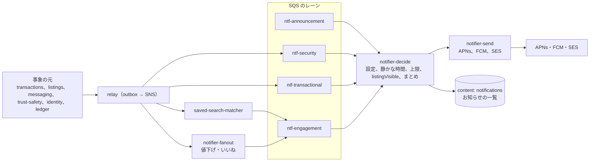
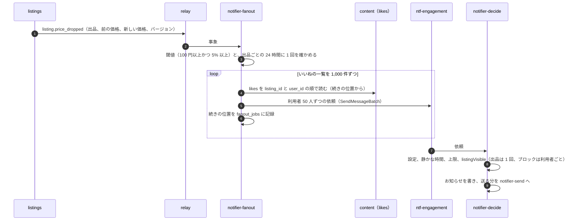

# Notifications: Mercari

プッシュ（APNs・FCM）、メール、アプリの中のお知らせを扱う。通知の種類と級、送る経路（レーン）、値下げ・いいね・保存した検索の fan-out、まとめ、静かな時間、上限、利用者の設定、端末のトークン、プッシュの中身の規則を決める。

前提となる決定は次のとおり。

- 出品の見える範囲は `listingVisible(viewer, listing)` の 1 か所で決め、通知も送る前にこれを通す（[ADR-0007](../decisions/0007-single-tenant-and-party-visibility.md)）
- 住所・氏名・電話番号を、取引の相手・画面・通知・メッセージのどこにも出さない（[ADR-0006](../decisions/0006-shipping-orchestration-via-carriers.md)）
- 保存した検索の照合は自前の逆索引で行い、一致を通知の依頼にする（[ADR-0008](../decisions/0008-search-engine-and-index.md)）。照合とまとめの窓は [saved-searches-and-alerts.md](saved-searches-and-alerts.md) が持つ
- 措置は記録してから効かせ、措置から 60 秒で通知の候補から消す（[ADR-0009](../decisions/0009-trust-and-safety-pipeline-boundary.md)、NFR-016）

この文書で決めたことは次の ADR にある。

| ADR | 決定 |
| --- | --- |
| [0063](../decisions/0063-notification-kinds-lanes-and-payload.md) | 通知を種類（`kind`）の一覧で定め、種類ごとに級（`security`・`transactional`・`engagement`・`announcement`）を 1 つ持たせる。級ごとに SQS のレーンと消費者を分け、fan-out が取引の通知を待たせない。プッシュの中身は、種類のコード、不透明な ID、決まった文の鍵と、許可した公開の欄（出品の題名、価格、相手のニックネーム）だけにする。メッセージ・コメントの本文、住所、本名、電話番号、金額の残高、口座、本人確認の情報は入れない |
| [0064](../decisions/0064-fanout-batching-quiet-hours-and-caps.md) | 値下げの fan-out は、出品のいいねの一覧を 1,000 件ずつ読み、利用者ごとの依頼に分けて `engagement` のレーンへ入れる。送る直前に、設定・静かな時間・上限・`listingVisible()` を利用者ごとに当てる。`engagement`・`announcement` の級は、既定の静かな時間（23:00〜9:00、日本時間）に送らず、9:00 から 60 分に散らして 1 通のまとめにする。`engagement` のプッシュは 1 人 1 日 30 通まで、超えた分はお知らせにだけ置く |
| [0065](../decisions/0065-notification-preferences-tokens-and-email.md) | 設定は（利用者、種類のまとまり、経路）の行で持ち、行のないものは既定値で決める。`security` は切れない。`transactional` はプッシュかメールの少なくとも 1 つを残す。端末のトークンは `identity` の `devices` の行が正本で、`notifier` は Valkey の写しを読む。無効なトークンは応答で消す。メールは Amazon SES で、取引の通知と案内を別のサブドメインと別の構成のセットに分け、送り返しと苦情を止める一覧に入れる |

負荷の数は [capacity.md](capacity.md)、計測とアラートは [observability.md](observability.md)、端末とセッションは [accounts-and-devices.md](accounts-and-devices.md) にある。文言のうち、値下げ・ポイントの表示は法務の確認待ち（L4）である。

## 1. 範囲

| 含む | 含まない（置き場所） |
| --- | --- |
| 通知の種類の一覧と級、レーン、送信、再送、まとめ、静かな時間、上限 | 保存した検索の正規化と照合、照合のまとめの窓（[saved-searches-and-alerts.md](saved-searches-and-alerts.md)） |
| 値下げ・いいねの fan-out | 値下げの事象の発生（[listings-and-photos.md](listings-and-photos.md)、[transactions-and-state-machine.md](transactions-and-state-machine.md) の価格の変更） |
| 利用者の設定、お知らせの一覧（アプリの中） | 端末の登録とトークンの受け取り（[accounts-and-devices.md](accounts-and-devices.md)） |
| APNs・FCM・SES の接続、送り返しと苦情 | 取引のメッセージの本文と悪用の絞り込み（[messaging-and-comments.md](messaging-and-comments.md)） |
| プッシュとメールの中身の規則 | 文言の法的な確認（法務の L4） |

## 2. 要件

| 出どころ | 要件 | この文書の答え |
| --- | --- | --- |
| NFR-008 | 取引の通知は事象からプッシュの依頼まで p95 10 秒。値下げ・保存した検索の新着は p95 5 分 | レーンを分ける（4 節）。`transactional` は静かな時間と上限の外 |
| NFR-007 | メッセージと通知の受け付け 月間 99.9% | 依頼は SQS に確定してから受け付ける。APNs・FCM の障害は再送で吸う（9 節） |
| NFR-014 | 通知の本文に住所・相手の本名が入らない。宛先は正しい利用者の端末だけ | 中身の許可の一覧（5 節）。トークンは利用者の端末の行だけから引く |
| NFR-016 | 措置・売り切れの出品は 60 秒以内に通知されない | 送る直前に `listingVisible()` を当てる（6.3 節） |
| [quality.md](../quality.md) の 2.2.1 節 I | 1 万いいねの値下げを p95 5 分、同じ出品の値下げは 24 時間に 1 回 | 6.1 節 |
| 法務の L4 | 値下げ・ポイントの文言 | 文言は鍵で持ち、法務の確認の後に確定する |
| 法務の L5 | APNs・FCM（国外の事業者）に渡すもの | 最小にする（5 節） |

## 3. 本家の形（確かめたこと）

いずれも 2026-10-10 に確認。

| 項目 | 事実 | この設計 |
| --- | --- | --- |
| 設定の場所と項目 | 「お知らせ・機能設定」に、いいね、コメント、取引関連、アナウンス、いいねした商品の値下げ、いいねした商品へのコメント、保存した検索条件の新着、フォロー中のユーザーの出品などがある。取引関連は、プッシュかメールのどちらかを有効にする必要がある。事務局からの個別のメッセージは切れない（[ヘルプの記事 239](https://help.jp.mercari.com/guide/articles/239/)） | 種類のまとまりを寄せる（7 節）。`transactional` の「どちらか 1 つ」と、`security` の切れない扱いを寄せる |
| 値下げの通知 | 「一定額以上」値下げされたときに出る。今は「あなたへのお知らせ」だけに出す（同上）。一定額の値は書いていない（**未検証**） | 本システムの閾値（100 円以上かつ 5% 以上）。プッシュとお知らせの両方に出し、設定で選べる |
| 保存した検索の新着 | メール・プッシュ・LINE で届く。プッシュは設定から 30 日だけ有効（同上） | 30 日の扱いは [saved-searches-and-alerts.md](saved-searches-and-alerts.md) で決める。LINE は MVP に入れない |
| フォロー中のユーザーの出品 | 9 時〜23 時の新しい出品だけを通知する（同上） | `engagement` の既定の静かな時間を 23:00〜9:00 にした根拠の 1 つ。フォローは MVP に入れない |
| APNs・FCM の中身の大きさ | 4 KB まで（Apple・Firebase の文書。原文を確かめられなかった：**未検証**） | 中身を 2 KB 以下に収める（5 節） |

## 4. 構成（ADR-0063）

### 4.1 流れ



- 事象の元は、自分の outbox に事象（`transaction.paid` など）を書くだけで、通知の文を作らない。`notifier` が種類の一覧（4.2 節）で、事象から通知の種類と宛先を決める。
- `notifier` は 3 つの役のタスクに分ける：`notifier-fanout`（値下げ・いいねの宛先を広げる）、`notifier-decide`（送るかを決め、お知らせを書く）、`notifier-send`（外の提供者へ送る）。同じイメージを役の引数で起こす。
- 級ごとに SQS のキューと `notifier-decide` の消費者のプールを分ける。`ntf-engagement` が 100 万件溜まっても、`ntf-transactional` の消費者は別にある。`notifier-send` も級ごとの内部の待ち行列を持ち、`security`・`transactional` を先に送る。
- お知らせの一覧（アプリの中）は、送るかの判定の結果によらず、`announcement` の級の一部を除いて必ず書く。プッシュを止めても、お知らせで見られる。

### 4.2 種類の一覧（MVP）

| `kind` | 級 | 宛先 | 既定の経路 | まとめの鍵 |
| --- | --- | --- | --- | --- |
| `account.new_device_sign_in`、`account.phone_changed`、`account.email_changed`、`account.passkey_changed`、`account.bank_account_changed`、`account.locked` | `security` | 本人 | プッシュ＋メール＋お知らせ | なし |
| `payout.requested`、`payout.completed`、`payout.failed` | `security` | 本人 | プッシュ＋メール＋お知らせ | なし |
| `txn.purchased`（売り手へ） | `transactional` | 売り手 | プッシュ＋メール＋お知らせ | 取引 |
| `txn.paid`、`txn.shipped`、`txn.delivered`、`txn.received`、`txn.rated`、`txn.completed`、`txn.cancel_requested`、`txn.cancelled`、`txn.disputed`、`txn.resolved` | `transactional` | 相手 | プッシュ＋お知らせ（`txn.completed` はメールも） | 取引 |
| `txn.message` | `transactional` | 相手 | プッシュ＋お知らせ | 取引（1 分にまとめる） |
| `txn.deadline_reminder`（発送の期限の前日、受取評価・評価の期限の前日、コンビニ払いの期限の前日） | `transactional` | 期限を持つ側 | プッシュ＋お知らせ | 取引と期限の種類 |
| `proceeds.available`（売上金の反映） | `transactional` | 売り手 | お知らせ（プッシュは `txn.completed` に含める） | 取引 |
| `listing.commented`（自分の出品に） | `transactional` | 売り手 | プッシュ＋お知らせ | 出品（5 分にまとめる） |
| `listing.comment_replied`（自分がコメントした出品への新しいコメント。直近 30 日、最大 50 人。[messaging-and-comments.md](messaging-and-comments.md)） | `transactional` | コメントした人 | プッシュ＋お知らせ | 出品（5 分にまとめる） |
| `listing.moderated`（措置、異議の結果） | `transactional` | 売り手 | プッシュ＋メール＋お知らせ | 措置 |
| `listing.liked`（自分の出品に） | `engagement` | 売り手 | お知らせ（プッシュは 1 時間に 1 通のまとめ） | 売り手 |
| `listing.price_dropped`（いいねした出品） | `engagement` | いいねした人 | プッシュ＋お知らせ | 出品 |
| `liked_listing.commented` | `engagement` | いいねした人 | お知らせ | 出品 |
| `saved_search.digest` | `engagement` | 保存した人 | プッシュ＋お知らせ（メールは日次のまとめ） | 保存した検索 |
| `announcement.*`（企画、ポイントの付与の知らせ） | `announcement` | 対象の利用者 | お知らせ（プッシュ・メールは同意した人だけ） | 企画 |

- 種類の一覧は `packages/notifications/kinds.ts` の 1 か所に置き、事象 → 種類 → 宛先 → 級 → 既定の経路 → 文の鍵を表で持つ。種類を足すときは、この表と [quality.md](../quality.md) の 2.2.1 節 G の通知の行を同じ PR で直す。
- **運用の個別の連絡**（CS からの問い合わせの返事、措置の知らせ）は `security` か `transactional` で送り、切れない。
- 本家の「フォロー中のユーザーの出品」「オークション」は MVP に入れない（[intent.md](../intent.md) の MVP の範囲）。

### 4.3 遅れの予算（NFR-008）

NFR-008 は、元の事象（取引の遷移、出品の公開・値下げ）の commit から、`notifier-send` が APNs・FCM・SES に依頼を受け付けられるまでで数える。

| 区間 | `transactional` の p95 | 値下げ（`engagement`）の p95 | 保存した検索（`engagement`）の p95 |
| --- | --- | --- | --- |
| 事象の commit → outbox → SNS（relay） | 1 秒 | 1 秒 | 照合の側の予算に含む |
| fan-out・照合・まとめの窓 | — | 60 秒（いいねの読み出しと束の書き込み） | 3.3 分（照合と 3 分の窓。[saved-searches-and-alerts.md](saved-searches-and-alerts.md) の 6.1 節、[ADR-0023](../decisions/0023-saved-search-alert-windows-and-caps.md)） |
| SQS → `notifier-decide` | 1 秒 | 30 秒（レーンの溜まりを含む） | 20 秒 |
| 判定（設定、上限、`listingVisible()`）とお知らせの書き込み | 200ms | 1 秒 | 1 秒 |
| `notifier-send` → 提供者の受け付け | 2 秒 | 30 秒 | 30 秒 |
| 合計（予算） | 5 秒（目標 10 秒の半分） | 2.1 分（目標 5 分） | 4.2 分（目標 5 分） |

- 保存した検索のまとめの窓は 3 分で、NFR-008 の数えに含める（[ADR-0023](../decisions/0023-saved-search-alert-windows-and-caps.md)。最初の設計の README の 1.3 節 E の「15 分」は、この ADR で置き換わった）。`notifier` の側の持ち分は 1 分以内にする。
- 静かな時間で止めた通知は、止めた時間を数えない（定義は [observability.md](observability.md) の 3 節）。

## 5. プッシュの中身（ADR-0063）

APNs の例：

```json
{
  "aps": {
    "alert": { "title-loc-key": "TXN_PURCHASED_TITLE", "loc-key": "TXN_PURCHASED_BODY", "loc-args": ["ニットのカーディガン"] },
    "thread-id": "t:3f9a1c",
    "sound": "default",
    "mutable-content": 1
  },
  "k": "txn.purchased",
  "r": "0191f6c0-7b2e-7c11-9a0e-2c4d5e6f7a8b",
  "n": "0191f6c1-02aa-7d3e-8b1f-9c0d1e2f3a4b"
}
```

- `k` は種類、`r` は対象（取引・出品・保存した検索）の ID、`n` は通知の ID。アプリは `r` で画面を開き、中身は API から取る（API は RLS と `listingVisible()` を通る）。
- `thread-id`・`apns-collapse-id`・FCM の `collapse_key` には、まとめの鍵の HMAC（利用者ごとの鍵）の先頭 6 文字を入れる。取引の ID をそのまま入れない。
- 文は端末の言語の鍵で持ち、`loc-args` に入れてよいのは次の **許可の一覧** だけにする。

| 入れてよい | 理由 |
| --- | --- |
| 出品の題名（40 文字で切る） | 公開の欄 |
| 価格（値下げの前と後） | 公開の欄 |
| 相手のニックネーム（公開のプロフィールの名前） | 公開の欄 |
| 件数（いいね n 件、新着 n 件） | 個人を指さない |
| 期限の日時（「明日 23:59 まで」） | 本人の取引の情報。相手の情報を含まない |

| 入れない | 理由 |
| --- | --- |
| 取引のメッセージ・コメントの本文 | 2 者のデータ、利用者の自由な文（電話番号や外の連絡先が入りうる）。法務の L11 |
| 住所、本名、電話番号、メールアドレス | NFR-014 |
| 売上金・残高・ポイントの残高、振込の額、口座 | 端末のロック画面に出る。乗っ取りの手がかりになる |
| 本人確認の状態と書類 | 本人だけのデータ |
| 措置の詳しい理由 | アプリの中で見せる |

- `transactional` と `security` の通知は、アプリの Notification Service Extension（iOS）とアプリの受け手（Android）で、端末のセッションを使って文を足してよい。足すのは許可の一覧と同じ欄だけで、本文は足さない（端末の中で作る文も、ロック画面に出るため）。
- 中身は 2 KB 以下に収める（4 KB の上限は**未検証**のため余白を取る）。`notifier-send` が大きさを検査し、超えたら題名を短くする。
- 中身の検査：`notifier-send` は、送る前に中身を許可の一覧の型（Zod）で検査し、知らない欄があれば送らずにエラーの指標を出す。

メールの規則：

- 宛先は本人の確認済みのメールアドレスだけ。
- 本文に入れてよいのは、プッシュの許可の一覧に加えて、本人の取引の金額（代金、手数料、送料、売上金の増分）と、本人の振込の額。残高そのものは入れない。
- 住所・本名・電話番号・口座の番号・本人確認の情報は入れない。
- ログインのための鍵を含むリンクを入れない。リンクは `<brand>.<domain>` のパスだけで、開くとアプリかログインを通る（フィッシングと見分けやすくする。[security.md](security.md) の 3.5 節）。

## 6. fan-out とまとめ（ADR-0064）

### 6.1 値下げ



- **閾値**：値下げの額が 100 円以上で、かつ前の価格の 5% 以上のときだけ通知する（本システムの値。本家の「一定額」は**未検証**）。
- **出品ごとの 24 時間に 1 回**：`fanout_jobs` に（出品、種類、日時）を書き、24 時間の中の 2 回目の値下げは fan-out しない（[architecture/README.md](README.md) の 6 節の決定）。2 回目の値下げの後の価格は、お知らせの一覧の表示の時に今の価格を出すので、古い価格は残らない。
- **再開**：`notifier-fanout` が止まっても、`fanout_jobs` の続きの位置から再開する。同じ依頼が 2 度入っても、`notifier-decide` は（通知の種類、対象、宛先、事象の ID）の一意の鍵で 1 回だけ送る（9 節）。
- **大きさ**：1 万いいねは 10 ページ、200 回の `SendMessageBatch`（1 回 10 件 × 利用者 50 人の束）。1 タスクで 30 秒以内（初期見積もり）。いいねが 10 万を超える出品は、ページを 4 つのタスクに分ける。

### 6.2 いいね（自分の出品に）

- いいねの事象は数が多く、1 件ずつ送ると嵐になる。`listing.liked` はお知らせの一覧にだけ即座に書き（同じ出品のいいねは 1 行に数を足す）、プッシュは売り手ごとに 1 時間に 1 通（「n 件のいいね」）にまとめる。

### 6.3 送る直前の判定（DT-NTF-001 の草案）

`notifier-decide` は依頼ごとに、上から順に評価し、最初に一致した行を使う。

| # | 条件 | 結果 |
| --- | --- | --- |
| 1 | 宛先のアカウントが `deleting`・`deleted`・`suspended` | 捨てる（`security` も送らない。`locked` は 2 へ） |
| 2 | 級が `security` | お知らせ＋設定によらず全経路で送る |
| 3 | 対象の出品があり、`listingVisible(宛先, 出品, notification)` が `hidden` | 捨てる（理由のコードを記録）。取引の 2 者への `transactional` は文脈を `transaction` にして判定する |
| 4 | 宛先が送り手（相手）をブロックしている、かつ級が `engagement` | 捨てる |
| 5 | 級が `transactional` | お知らせを書き、設定の経路で送る（静かな時間・上限の外） |
| 6 | 級が `engagement`・`announcement`、かつ利用者の設定で種類が無効 | 捨てる（お知らせにも書かない） |
| 7 | 級が `engagement`・`announcement`、かつ静かな時間の中 | お知らせを書き、プッシュは静かな時間の終わりのまとめへ |
| 8 | 級が `engagement`、かつ今日のプッシュが上限（30 通）に達した | お知らせだけ |
| 9 | 級が `engagement`、かつ同じまとめの鍵の通知を直近の窓（種類ごと）に送った | お知らせを書き、プッシュは窓の終わりにまとめて 1 通 |
| 10 | それ以外 | お知らせを書き、設定の経路で送る |

- 表は `notifications` の領域の spec に確定させ、表駆動テストにする（[quality.md](../quality.md) の 2.2 節）。
- 3 の判定のため、`notifier-decide` は出品の状態を Valkey の `listingVisible()` の写し（[ADR-0007](../decisions/0007-single-tenant-and-party-visibility.md)）で読み、写しがなければ core の読み出しの写しで読む。どちらも読めなければ、`engagement` は後で再試行し、`transactional` は送る（取引の 2 者の通知は止めない）。

### 6.4 静かな時間

- 既定は 23:00〜9:00（日本時間）。利用者は開始と終わりを 30 分の単位で変えられる。切ることもできる。
- 対象は `engagement` と `announcement` のプッシュとメール。`security` と `transactional` は対象の外（売れた・メッセージが来たをすぐ知りたい。NFR-008）。
- 静かな時間に止めたプッシュは、利用者ごとに 1 通の「お知らせが n 件あります」にまとめ、静かな時間の終わりから 60 分の間に、利用者の ID のハッシュで散らして送る（9:00 に数百万通が重ならないように）。
- 時間帯は端末の時刻ではなく、利用者の設定（既定は `Asia/Tokyo`）で計算する。

### 6.5 上限

| 対象 | 値 | 超えたとき |
| --- | --- | --- |
| `engagement` のプッシュ（1 人 1 日） | 30 通 | お知らせだけ |
| 値下げの通知（1 出品） | 24 時間に 1 回の fan-out | fan-out しない |
| 値下げの通知（1 人、同じ出品） | 24 時間に 1 通 | 捨てる |
| `listing.liked` のプッシュ（1 売り手） | 1 時間に 1 通 | まとめる |
| `txn.message` のプッシュ（1 取引・1 宛先） | 1 分に 1 通 | まとめる（「n 件のメッセージ」） |
| 保存した検索の新着 | 3 分の窓で 1 通、保存した検索だけで 1 人 1 日 20 通、同じ利用者と出品は 7 日に 1 回（[ADR-0023](../decisions/0023-saved-search-alert-windows-and-caps.md)）。`engagement` の 30 通はその後に効く | アプリの中の一覧だけ |
| 1 端末へのプッシュ | 1 分 20 通 | 以後 10 分は 1 分 1 通の「n 件のお知らせ」 |
| `announcement` のメール（1 人） | 週 2 通 | 送らない |

- 数えは Valkey の利用者ごとの数え（日の境で消える鍵）で行う。Valkey が使えないときは、`engagement` を後で再試行し、上限を数えずに送らない（嵐を避ける側に倒す）。

## 7. 利用者の設定（ADR-0065）

| まとまり | 中の種類 | 既定（プッシュ／メール） | 切れるか |
| --- | --- | --- | --- |
| アカウントの安全 | `account.*`、`payout.*` | オン／オン | 切れない |
| 取引 | `txn.*`、`proceeds.available` | オン／オン（`txn.completed` だけ） | プッシュとメールの両方は切れない |
| コメントと措置 | `listing.commented`、`listing.comment_replied`、`listing.moderated` | オン／オン（措置だけ） | 措置は切れない |
| いいね | `listing.liked` | オン／オフ | 切れる |
| いいねした商品の値下げ | `listing.price_dropped` | オン／オフ | 切れる |
| いいねした商品へのコメント | `liked_listing.commented` | お知らせだけ | 切れる |
| 保存した検索の新着 | `saved_search.digest` | オン／オフ（保存した検索ごとにも切れる） | 切れる |
| お知らせ（企画） | `announcement.*` | オフ／オフ（同意で有効） | 切れる |
| 静かな時間 | — | 23:00〜9:00 | 変えられる |

- 設定は `notification_prefs` に（利用者、まとまり、経路、値）の行で持ち、行がなければ上の既定を使う。既定を変えても、利用者の行は変えない。
- 案内のプッシュとメール（`announcement`）は、利用者の同意を得てから有効にする。広告の電子メールの同意と表示の要否は法令の判断が要る（特定電子メール法。**法務の確認待ち：L13**。統合の工程で [intent.md](../intent.md) に足した）。
- 端末の OS の通知の許可が切れている端末には、プッシュを送らない（アプリが起動のたびに許可の状態を `devices` に送る）。お知らせの一覧には書く。

## 8. 端末のトークンとメール（ADR-0065）

### 8.1 トークン

- 正本は `identity` の `devices` の行（[accounts-and-devices.md](accounts-and-devices.md) の 6 節）。`notifier` は書かない。
- `notifier` は、利用者ごとの有効な端末とトークンの一覧を、Valkey の `ntf:devices:{user_id}` の写し（`identity` が outbox の `device.*` の事象で更新。期限 24 時間）で読む。写しがなければ core の読み出しの写しから作る。
- APNs の 410（`Unregistered`）・FCM の `UNREGISTERED` を受けたら、`notifier-send` が `identity` の API でトークンを無効にする。`BadDeviceToken` も同じ。
- ログアウト・端末の取り消し・アカウントの `locked` では、`identity` がトークンを消し、写しを消す。消した後に届く依頼は宛先なしで捨てる。
- 1 人の端末は 20 まで（[accounts-and-devices.md](accounts-and-devices.md) の 6 節）。送る先は、直近 180 日に起動した端末だけ。

### 8.2 接続

| 提供者 | 接続 | 認証 |
| --- | --- | --- |
| APNs | HTTP/2（`api.push.apple.com`）。1 タスクで複数の接続を保つ | トークンの認証（.p8 の鍵。Secrets Manager。期限の前に作り直す） |
| FCM | HTTP v1 の API | サービスアカウントの鍵（Secrets Manager。90 日で回す） |
| SES | VPC エンドポイント | タスクの IAM の役割 |

- APNs・FCM への送信は、[infrastructure.md](infrastructure.md) の 2.4 節の egress の許可の一覧を通る。

### 8.3 メール

- 差出人のドメインを分ける：取引と安全の通知は `mail.<brand>.<domain>`、案内は `news.<brand>.<domain>`。SES の構成のセットも分け、案内の苦情の率が取引の通知の届き方に響かないようにする。
- SPF・DKIM（SES の Easy DKIM）・DMARC を両方のサブドメインに置く。DMARC は `p=quarantine` で始め、報告を 4 週見てから `p=reject` にする。
- 送り返し（hard bounce）と苦情は SES の通知で受け、`email_suppressions` に入れる。止めたアドレスには送らず、アプリで「メールアドレスを確かめてください」を出す。
- 1 日の送信の上限と速さは SES の割り当てで、S1 の量（[capacity.md](capacity.md) の 1 節）の 2 倍を E17 の前に申請する。

## 9. 失敗と回復

| 事象 | 影響 | 扱い |
| --- | --- | --- |
| APNs・FCM の 429・5xx | 送れない | 指数の後退で再送。`security`・`transactional` は 10 分まで、`engagement` は 30 分まで再送し、その後はお知らせだけにする |
| APNs・FCM の長い障害 | プッシュが届かない | 再送の期限の後は捨てる。お知らせの一覧とメール（`transactional` の設定がメールなら）は残る。`notification-delivery.md` の手順 |
| SES の障害・速さの上限 | メールが遅れる | SQS に溜め、24 時間まで再送 |
| `ntf-engagement` の溜まり（大型の企画の日） | 値下げ・新着が遅れる | `notifier-decide` の engagement のプールを広げる。p95 30 分を超えたら `ops.saved_search_digest_minutes`（既定 3 分）を伸ばし、なお遅れれば `ops.fanout_enabled` で fan-out を止める（[runbooks/](../runbooks/README.md) の 5.2 節）。取引の通知は止めない |
| 同じ依頼の重複（SQS の少なくとも 1 回、fan-out の再開） | 二重の通知 | `notification_sends` の一意の鍵（種類、対象、宛先、元の事象の ID）。2 回目は捨てる |
| 措置が送る直前に起きた | 措置した出品の通知 | 送る直前の `listingVisible()`。写しの遅れの間（60 秒まで）は送りうる。開いた画面は API で `hidden` になる |
| `notifier-decide` が Valkey を読めない | 上限・写しが使えない | `engagement` は再試行、`transactional` は core の読み出しの写しで判定して送る |
| 古い依頼 | 意味のない通知 | `transactional` は 1 時間、`engagement` は 6 時間を過ぎた依頼を捨てる（お知らせには書く） |

## 10. data-model への項目

| 置き場所 | 中身 | 鍵・索引 | 節 |
| --- | --- | --- | --- |
| content：`notifications` | お知らせの一覧：`id`（UUIDv7）、`user_id`、`kind`、`target_type`、`target_id`、`args`（許可の一覧の欄だけ）、`count`、`read_at`、`created_at`。本人の FORCE RLS。90 日で消す | `(user_id, created_at DESC)`、未読の数の部分の索引 | 4.1 |
| content：`notification_sends` | 送信の記録：（`kind`、`target_id`、`user_id`、`source_event_id`）の一意、経路、結果、提供者の応答のコード、`queued_at`・`decided_at`・`accepted_at`。30 日で消す | 一意の鍵、`(user_id, decided_at)` | 6.3、9 |
| content：`notification_prefs` | （`user_id`、`group`、`channel`）→ 値、静かな時間、時間帯、案内の同意の日時。本人の FORCE RLS | 主キー | 7 |
| content：`fanout_jobs` | 値下げ・案内の fan-out：出品・企画、続きの位置、状態、開始・終わり。24 時間に 1 回の判定にも使う | `(listing_id, kind, started_at)` | 6.1 |
| content：`email_suppressions` | 止めたアドレスの HMAC、理由（bounce・complaint）、日時 | 主キー | 8.3 |
| Valkey | `ntf:devices:{user_id}`（端末とトークンの写し）、`ntf:cap:{user_id}:{yyyymmdd}`（数え）、`ntf:digest:{user_id}`（静かな時間・窓のまとめ） | — | 6.5、8.1 |
| SQS | `ntf-security`、`ntf-transactional`、`ntf-engagement`、`ntf-announcement`、各 DLQ | — | 4.1 |
| core：`devices`（[accounts-and-devices.md](accounts-and-devices.md) が持つ） | プッシュのトークン、OS の通知の許可、最後の起動 | — | 8.1 |

## 11. テストと性質

| ID（草案） | 内容 | テスト |
| --- | --- | --- |
| PROP-NTF-001 | 任意の事象の列（重複、順序の入れ替え、fan-out の停止と再開）で、（種類、対象、宛先、元の事象）ごとのプッシュは 0 か 1 | 性質ベース（fast-check）。`notifier` を LocalStack の SQS で回す |
| PROP-NTF-002 | どの通知の中身も、許可の一覧の欄だけを持つ。住所・本名・電話番号・メッセージの本文の形の文字列が中身に現れない | 性質ベース。生成した利用者（架空の住所・名前）で全種類を作り、中身を走査する（[quality.md](../quality.md) の 2.2.1 節 G の通知の行） |
| PROP-NTF-003 | `listingVisible()` が `hidden` の出品の `engagement` の通知は、お知らせにもプッシュにも出ない | 性質ベース。措置・売り切れ・ブロックを混ぜる |
| PROP-NTF-004 | `engagement` のプッシュは、静かな時間の中に送られず、1 人 1 日 30 通を超えない。`security`・`transactional` はどちらにも止められない | 仮想の時計（`clock-sim`） |
| DT-NTF-001 | 6.3 節の表の全行 | 表駆動 |
| — | 値下げの fan-out：いいね 1 万の出品で p95 5 分、同じ人に 24 時間に 1 通 | [quality.md](../quality.md) の 2.2.1 節 I |
| — | APNs・FCM の模型（`push-sim`）で、429・5xx・410 の応答の再送とトークンの無効化 | 結合 |
| — | 静かな時間の終わりの散らし：100 万人の溜まりが 60 分に均される | 負荷（[capacity.md](capacity.md) の 7 節） |

## 12. Story の候補

| Epic | Story | 中身 |
| --- | --- | --- |
| E17 | `notifier-and-preferences` | 4 節、7 節、8 節（ADR-0063、ADR-0065）。種類の一覧、レーン、設定、トークンの写し、SES |
| E17 | `transaction-notifications` | 4.2 節の `transactional` の種類と、4.3 節の遅れの予算 |
| E17 | `price-drop-and-like-fanout` | 6 節（ADR-0064）。文言は法務：L4 |
| E17 | `notification-fanout-tests` | 11 節と `push-sim` |
| E17 | `quiet-hours-and-caps` | 6.4・6.5 節 |
| E6 | `saved-search-digests`（[saved-searches-and-alerts.md](saved-searches-and-alerts.md) と共同） | `engagement` のレーンへの依頼の形 |

## 13. 未解決の問い

### 決定（2026-10-10、既定案）

- **級とレーン**：4 つの級、級ごとの SQS と消費者（ADR-0063）。
- **中身**：許可の一覧の欄だけ。本文・住所・残高を入れない（ADR-0063）。
- **値下げの閾値**：100 円以上かつ 5% 以上（本システムの値）。出品ごとに 24 時間に 1 回（ADR-0064）。
- **静かな時間**：23:00〜9:00、`engagement`・`announcement` だけ。終わりから 60 分に散らす（ADR-0064）。
- **上限**：`engagement` のプッシュ 1 人 1 日 30 通（ADR-0064）。
- **メール**：SES、取引と案内でサブドメインと構成のセットを分ける（ADR-0065）。
- **LINE の通知、フォロー**：MVP に入れない。

### 持ち越し

| 問い | いつ・どう決めるか |
| --- | --- |
| APNs・FCM の中身の上限と、Notification Service Extension の時間の上限 | E17 の `notifier-and-preferences` の前に公式の文書で確かめる（**未検証**） |
| 値下げ・ポイントの付与の文言 | **法務の確認待ち：L4** |
| APNs・FCM（国外の事業者）に出品の題名とニックネームを渡すことの整理 | **法務の確認待ち：L5** |
| 案内のメール・プッシュの同意と表示 | **法務の確認待ち：L13**（特定電子メール法） |
| `engagement` の 1 日の上限（30 通）と静かな時間の既定が、利用者の解除の率に合うか | E17 の後の計測で PM と見直す |
| 1 タスクの APNs の送信の速さ | E17 の負荷試験（**初期見積もり** 500 件/秒） |

## 出典

いずれも 2026-10-10 に確認。

- メルカリ, [ヘルプの記事 239（お知らせ・機能設定）](https://help.jp.mercari.com/guide/articles/239/)：設定の項目、取引関連はプッシュかメールのどちらかが要ること、事務局からの個別のメッセージは切れないこと、値下げの通知は「一定額以上」、保存した検索条件の新着のプッシュは設定から 30 日だけ有効、フォロー中のユーザーの出品は 9 時〜23 時だけ通知
- Apple Developer, [Generating a remote notification](https://developer.apple.com/documentation/usernotifications/generating-a-remote-notification)（本文を読めなかった。中身の上限は**未検証**）
- Firebase Cloud Messaging の文書（中身の上限、`collapse_key`。**未検証**）
- AWS, [Amazon SES pricing](https://aws.amazon.com/ses/pricing/)：送信 1,000 通あたり 0.10 USD、添付 1 GB あたり 0.12 USD
