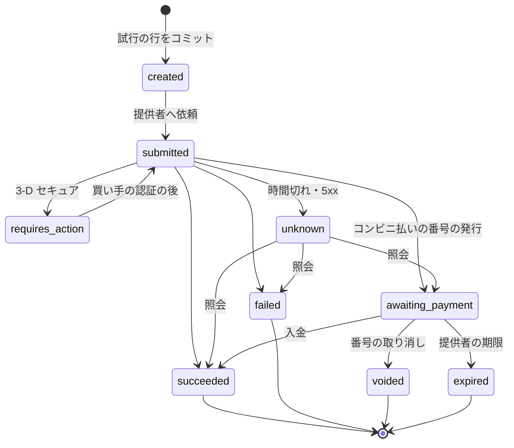
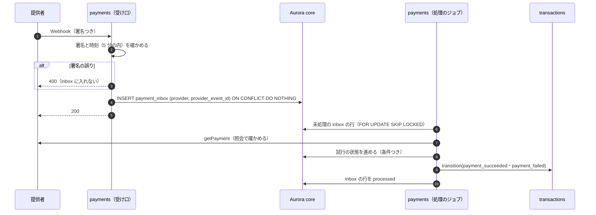
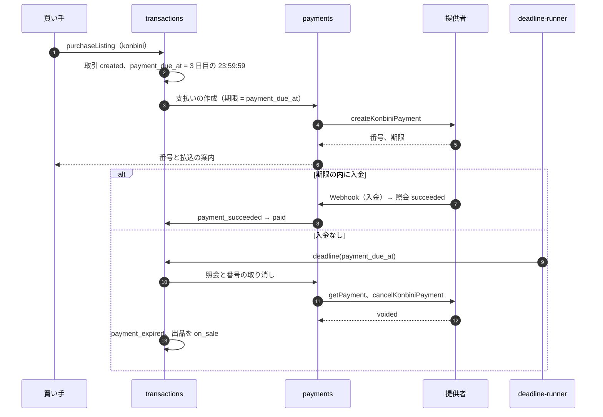

# Payments and Escrow: Mercari

買い手の支払いと、受取評価までの預かりを決める。決済の提供者のアダプターの契約、支払いの試行の状態と結果の正規化、Webhook の inbox と照会、カードとコンビニ払いの流れ、支払い待ち、返金、チャージバック、預かりの性質の枠（法務の確認待ち L1）を扱う。

前提となる決定は次のとおり。

- 決済は外部の提供者に任せ、本システムはカード番号に触れない。カードは購入の時にオーソリと同時に売上を確定する。預かりは本システムの台帳で持つ（[ADR-0005](../decisions/0005-payments-via-providers-and-capture-at-purchase.md)）
- 預かりは取引ごとの `escrow` の口座。release と refund は 1 回だけ（[ADR-0003](../decisions/0003-escrow-and-double-entry-ledger.md)。仕訳は [ledger-and-proceeds.md](ledger-and-proceeds.md)）
- 取引の状態は遷移の関数と DT-TXN-001 だけが書く（[ADR-0002](../decisions/0002-transaction-state-machine-and-single-purchase.md)、[transactions-and-state-machine.md](transactions-and-state-machine.md)）
- 売上金・ポイントでの支払いは台帳の引き当てで、提供者を通らない（[payouts-and-points.md](payouts-and-points.md) の 7 節）

この文書で決めたことは次の ADR にある。

| ADR | 決定 |
| --- | --- |
| [0030](../decisions/0030-payment-attempt-states-and-outcome-normalization.md) | 支払いの試行を 8 つの状態で持ち、提供者の結果を 6 つの正規の結果に写す（DT-PAY-001）。取引の遷移は照会で確かめた結果からだけ起こす。応答・Webhook・照会のどれから来ても同じ関数を通す |
| [0031](../decisions/0031-konbini-pending-payments-and-late-payments.md) | コンビニ払いは、番号の期限を取引の `payment_due_at` に揃え、1 人の未払いを 2 件までにする。期限の後の入金は取引を戻さず全額を返す。支払いの手数料は預かりに含め、取り消しでは代金と一緒に返す |
| [0032](../decisions/0032-chargeback-accounting-and-liability.md) | チャージバックは、提供者の引き落としを `psp_chargeback_held` に移して記録し、結果で戻すか負担を決める。完了の前は refund として預かりで埋め、完了の後は売り手の売上金を保留し、負担の表 DT-CB-001 で売り手か本システムが持つ |

## 1. 範囲

- 扱う：
  - 提供者のアダプターの契約
  - 支払いの試行の状態、結果の正規化（DT-PAY-001）
  - Webhook の inbox、照会の予定、遮断器
  - カード（3-D セキュアを含む）、コンビニ払い、組み合わせ（ポイント・売上金 ＋ カード）
  - 支払い待ち（コンビニ払い）の制限と期限の後の入金
  - 返金（全額、一部、組み合わせ）
  - チャージバックの受け取り、取引への結び付け、反証、負担の決め方
  - 預かりの性質の枠（法務の確認待ち L1）
  - 提供者の選定の条件
- 扱わない：
  - カード処理の内部（Stripe の題材）
  - 仕訳の細部と 3 者の照合（[ledger-and-proceeds.md](ledger-and-proceeds.md)）
  - 売上金・ポイントの引き当て（[payouts-and-points.md](payouts-and-points.md)）
  - チャージバックの率による不正の判定（trust-and-safety の領域）。ここでは信号を送るだけ
  - 紛争の案件の扱い（[disputes-and-customer-support.md](disputes-and-customer-support.md)）

## 2. 要件

| 要件 | 目標 | NFR |
| --- | --- | --- |
| お金が合う | 提供者の確定・返金・チャージバックが、台帳の仕訳と 1 対 1 で対応する。説明のつかない差を 3 営業日で 0 円 | NFR-004、K2 |
| 一回性 | 1 つの取引の預かりは release か refund の一方だけ。提供者への返金の依頼は、refund の仕訳 1 つにつき 1 回 | NFR-005、K3 |
| 結果の確かさ | 提供者の結果が不明な試行を、照会で 24 時間以内に確定する。不明のまま取引を進めない | NFR-004 |
| 購入の速さ | `purchaseListing` の確定 p99 800ms は提供者の時間を除く。提供者への依頼は取引の作成の後 | NFR-002 |
| カード番号 | 本システムのサーバー・ログ・DB・トレースにカード番号・セキュリティコードが入る経路 0 | ADR-0005 |
| 可用性 | 購入と取引 月間 99.95%。1 つの提供者の障害で、その手段だけを隠す | NFR-007 |

## 3. 本家の形（確かめたこと）

- コンビニ払いの支払いの期限は、購入の手続きから 3 日（購入日を含む 3 日目の 23:59:59）（[ヘルプの記事 61sell](https://help.jp.mercari.com/guide/articles/61sell/)、2026-10-10 に確認）。
- 支払いの手段の一覧、コンビニ払いの手数料、カードの確定の時点、チャージバックの負担の規則は、公式の資料で確かめられなかった（**未検証**）。本システムの値を使う。

## 4. アダプターの契約

`packages/payments` の提供者ごとのアダプターは、次の操作を持つ（[ADR-0005](../decisions/0005-payments-via-providers-and-capture-at-purchase.md)）。

| 操作 | 入力 | 出力 | 冪等キー |
| --- | --- | --- | --- |
| `createCardPayment` | 試行の ID（提供者への参照の番号）、額、提供者のカードのトークン、3-D セキュアの戻り先 | 正規の結果（6 節）、提供者の支払いの ID、3-D セキュアの案内 | `<transaction_id>:capture` |
| `createKonbiniPayment` | 試行の ID、額、期限（`payment_due_at`）、コンビニの種類 | 支払いの番号・払込票の参照、提供者の期限 | `<transaction_id>:capture` |
| `getPayment` | 試行の ID か提供者の支払いの ID | 正規の結果 | — |
| `cancelKonbiniPayment` | 試行の ID | `voided`・`already_paid`・`unknown` | `<transaction_id>:void` |
| `refund` | 提供者の支払いの ID、額 | 返金の ID、正規の返金の結果 | `<transaction_id>:refund:<n>` |
| `getRefund` | 返金の ID | 正規の返金の結果 | — |
| `parseWebhook` | 生の本文、署名の見出し | 正規の事象（種類、提供者の事象の ID、参照の番号）か「拒否」 | — |
| `listSettlements` | 期間 | 精算の行（支払い・返金・チャージバック・手数料、額、参照の番号） | — |
| `submitChargebackEvidence` | チャージバックの ID、証拠の束 | 受付の結果 | `<chargeback_id>:evidence` |

- 照会の API を持たない提供者は選ばない（ADR-0005）。
- アダプターの契約の試験（`payment-adapter-contract`）を、提供者ごとに `psp-sim` と提供者の試験の環境の両方で回す。
- Stripe の題材の再構築したものは、提供者の候補の 1 つとして、この契約の後ろに置く。

## 5. 支払いの試行の状態（[ADR-0030](../decisions/0030-payment-attempt-states-and-outcome-normalization.md)）

- 試行の行（`payment_attempts`）は、提供者を呼ぶ前に書いてコミットする。試行の ID を提供者への参照の番号にする。
- 試行の状態は試行の行の条件つきの更新（`WHERE state = $from`）で進める。終わった状態（`succeeded`・`failed`・`voided`・`expired`）からは動かさない。
- 取引への事象は、試行が `succeeded` か `failed` になった時に 1 回だけ出す（`payment_attempts.transaction_event_emitted_at`）。

### 5.1 正規の結果 DT-PAY-001

提供者の生の状態を、次の正規の結果に写す。写しの表は提供者ごとに持ち、表駆動テストで全行を確かめる。下は、提供者の形の例（Stripe の題材の PaymentIntent に似た形）。

| # | 提供者の状態（例） | 付く情報 | 正規の結果 | 試行の状態 |
| --- | --- | --- | --- | --- |
| 1 | `succeeded`（確定済み） | 確定の額 = 依頼の額 | `succeeded` | `succeeded` |
| 2 | `succeeded` | 確定の額 ≠ 依頼の額 | `mismatch` | `unknown`（page。取引を進めない） |
| 3 | `requires_action` | 3-D セキュアの URL | `requires_action` | `requires_action` |
| 4 | `processing` | — | `pending` | `submitted` |
| 5 | `requires_payment_method`（拒否） | 拒否の理由 | `failed` | `failed` |
| 6 | `canceled` | — | `failed` | `failed` |
| 7 | コンビニの番号の発行 | 番号、期限 | `awaiting_payment` | `awaiting_payment` |
| 8 | コンビニの番号の期限切れ | — | `expired` | `expired` |
| 9 | 見つからない（照会） | 依頼から 10 分の内 | `pending` | そのまま |
| 10 | 見つからない（照会） | 依頼から 10 分を超えた | `failed` | `failed`（依頼が届かなかった） |
| 11 | 時間切れ・5xx・未知の状態 | — | `unknown` | `unknown`（照会の予定へ） |

- 拒否の理由は、提供者の値を本システムの理由のコード（`insufficient_funds`、`card_declined`、`authentication_failed`、`expired_card`、`fraud_suspected`、`other`）に写す。買い手には理由のコードの文言だけを出す。

## 6. Webhook の inbox と照会

### 6.1 流れ

- inbox の行は Webhook の中身を信じない。必ず照会の結果で試行を進める（ADR-0005）。
- 同じ試行に応答・Webhook・照会が重なっても、試行の条件つきの更新で一度だけ進み、取引の事象も一度だけ出る。

### 6.2 照会の予定

| 試行の状態 | 予定 |
| --- | --- |
| `unknown`・`submitted`（応答なし） | 5 秒、30 秒、2 分、5 分、その後 30 分ごとに 24 時間（[ADR-0005](../decisions/0005-payments-via-providers-and-capture-at-purchase.md)） |
| `requires_action` | 10 分（買い手が戻らない場合）。カードの支払いの期限（30 分）で取引の期限の処理が照会する |
| `awaiting_payment` | 入金の Webhook を待つ。加えて 6 時間ごとと、`payment_due_at` の時に照会 |
| 24 時間を超えて `unknown` | 照会を止め、page（`payment-provider-outage.md`）。取引は `created` のまま、支払いの期限の行 12 で 5 分ごとに待つ |

- 遮断器：提供者の 5xx・時間切れが 1 分で 20% を超えたら、その提供者の新しい依頼を 30 秒止め、購入の画面からその手段を隠す（`ops.payment_method_enabled.<method>` を自動で偽にはしない。画面の候補から外すだけ）。照会は止めない。

### 6.3 例：カードの購入

前提：代金 3,000 円、カード、3-D セキュアなし。

| 時刻 | 起きること | 試行 | 取引 | 台帳 |
| --- | --- | --- | --- | --- |
| 12:00:00.000 | `purchaseListing` のコミット | — | `created`（`payment_due_at` 12:30:00） | — |
| 12:00:00.020 | 試行の行をコミット、`createCardPayment` | `created` → `submitted` | — | — |
| 12:00:02.900 | 時間切れ（2.5 秒） | `unknown` | — | — |
| 12:00:03.000 | Webhook `payment.succeeded` が inbox へ | — | — | — |
| 12:00:03.200 | 処理のジョブが照会 → 確定済み（3,000 円） | `succeeded` | `paid` | — |
| 12:00:04.000 | `ledger` が `transaction.paid` を消費 | — | — | hold：`psp_receivable` 3,000 / `escrow` 3,000 |
| 12:00:08.000 | 5 秒の照会が来るが、試行は終わっている | 何もしない | — | — |

- 照会と Webhook の処理が同時に `succeeded` を書こうとしても、条件つきの更新で 1 つだけが進む。

## 7. カード

- カード番号は提供者のホストした入力部品（アプリの SDK、Web の iframe）で受け、本システムは提供者のトークンだけを持つ。Web の CSP の `frame-src`・`script-src` を選んだ提供者のドメインに絞る（security の領域）。
- 購入の時に確定する（オーソリだけはしない）。3-D セキュアは提供者の流れで、`requires_action` の間は取引は `created` のまま。
- カードの支払いの期限は作成から 30 分（[transactions-and-state-machine.md](transactions-and-state-machine.md) の 7.1 節）。期限の処理が照会し、`succeeded` でなければ `cancelled`。出品は販売中に戻る。
- 保存したカードは、提供者の顧客とカードの参照だけを `payment_methods` に持つ（下 4 桁と有効期限の月・年は提供者が返す表示用の値だけ）。

### 7.1 組み合わせ（ポイント・売上金 ＋ カード）

- 引き当ての順は、ポイント（期限の近い順）→ 売上金・残高 → カード（[payouts-and-points.md](payouts-and-points.md) の 7 節）。
- 購入の前にポイント・売上金を引き当て（`balance_reserved`）、取引の作成の後に残りをカードで確定する。両方が確定して `paid`。
- カードが失敗したら、取引は `cancelled` になり、引き当ては refund の仕訳で `balance_reserved` から元の口座へ戻る。

## 8. コンビニ払い（[ADR-0031](../decisions/0031-konbini-pending-payments-and-late-payments.md)）

### 8.1 流れ

### 8.2 制限

| 規則 | 値（本システムの値） | 理由 |
| --- | --- | --- |
| 1 人の未払いのコンビニ払いの取引 | 2 件まで。3 件目は 409 `too_many_unpaid` | 払わずに出品を止める悪用を抑える |
| 支払いの期限切れの回数 | 30 日に 3 回で、コンビニ払いを 30 日使えない（trust-and-safety の領域の規則として出す） | 同上 |
| 最低・最高の額 | 提供者の上限に従う（例：30 万円未満。**未検証**、選定で確かめる） | 提供者の制約 |
| 支払いの手数料 | 1 件 100 円（買い手の負担。本システムの値。本家の値は**未検証**） | 提供者の手数料の一部を賄う |

- 支払いの手数料は、手数料の表（`packages/fees`）のバージョンで持ち、取引の行に記録する。消費税の扱いは法務の確認待ち（L8）。
- 支払いの手数料は預かりに含める。取引の預かりは「買い手が払った額」（代金 ＋ 支払いの手数料）。release で手数料の収益に移り、取り消しでは代金と一緒に買い手へ返す（[ADR-0031](../decisions/0031-konbini-pending-payments-and-late-payments.md)）。

### 8.3 期限の後の入金

- 期限の処理は、照会 → 番号の取り消し → `payment_expired` の順に行う。取り消しが `already_paid` を返したら `paid` にする（DT-TXN-001 の行 10）。
- 取り消しが成功した後に入金の通知が来たら（提供者の側の競合）、取引は戻さない。試行を `succeeded` に記録し、`orphan_payment` として全額を返す。仕訳は、提供者の未収から `unapplied_payments` に置き、返金で消す（[ledger-and-proceeds.md](ledger-and-proceeds.md) の 5.4 節）。
- コンビニ払いの返金は、提供者の返金の手順（買い手の銀行口座を提供者が受ける手順）に任せる。本システムは口座の番号を持たない。提供者がその手順を持たなければ、提供者の選定から外す（11 節）。

### 8.4 例：コンビニ払い 3,000 円の流れ

| 時刻 | 取引 | 試行 | 台帳 |
| --- | --- | --- | --- |
| 10/10 21:30 | `created`、`payment_due_at` 10/12 23:59:59 | `awaiting_payment`（3,100 円） | — |
| 10/11 10:00 入金 | `paid` | `succeeded` | hold：`psp_receivable` 3,100 / `escrow` 3,100 |
| 10/24 完了 | `completed` | — | release：`escrow` 3,100 / 売上金 2,490、手数料の収益 300、支払いの手数料の収益 100、送料 210 |

- 入金なしなら 10/13 00:00:00〜00:01:00 に `payment_expired`。仕訳はない（お金は動いていない）。

## 9. 返金

| 場面 | 依頼 | 仕訳 | 提供者 |
| --- | --- | --- | --- |
| 支払いの後の取り消し（全額） | `transaction.cancelled` を `ledger` が受け、refund の仕訳の後に `payments` へ | refund（[ADR-0003](../decisions/0003-escrow-and-double-entry-ledger.md)） | `refund`（冪等キー `<transaction_id>:refund:1`） |
| 一部の返金（紛争の判断） | 完了の settle の仕訳の後 | settle：一部を買い手、残りを売り手 | `refund`（額 = `refund_amount`） |
| 組み合わせの支払い | 同上 | ポイント・売上金の分は台帳だけで戻す。カードの分は提供者 | カードの分だけ |
| 期限の後の入金 | inbox の処理 | `unapplied_payments` → `psp_receivable` | `refund`（冪等キー `<attempt_id>:orphan_refund`） |

- 返金の依頼は、台帳の refund・settle の仕訳がコミットされた後に、`ledger` の outbox（`ledger.refund_due`）から `payments` が出す。仕訳が先、提供者が後。提供者の返金が失敗しても、台帳の預かりは決着している。
- 提供者の返金の結果は `refund_attempts` に持ち、`unknown` は照会の予定で確かめる。`failed`（カードの解約など）は、提供者の代わりの手順か、運用の待ち行列（`refund_failed`）に入れる。運用は買い手の別の手段（提供者の口座への返金の手順）を案内する。
- ポイントで払った分の返金は、元のロットの期限を持つ新しいロットとして戻す（[payouts-and-points.md](payouts-and-points.md) の 8 節）。

## 10. チャージバック（[ADR-0032](../decisions/0032-chargeback-accounting-and-liability.md)）

### 10.1 流れ

1. 提供者のチャージバックの事象を inbox で受け、照会で確かめ、`chargebacks` の行（状態 `open`、理由の種類、額、期限）を作る。取引に結び付ける（試行の ID）。
2. 台帳：提供者の引き落としを `psp_chargeback_held` に移す。
3. 取引が完了の前なら、遷移の関数に `chargeback_opened` を送り `disputed` にする（DT-TXN-001 の行 21）。完了の後なら、売り手の売上金を額まで保留する（[disputes-and-customer-support.md](disputes-and-customer-support.md) の 7.3 節）。
4. 紛争の案件を開く。CS・T&S が証拠を集め、提供者の期限の 2 営業日前までに反証を出すか、受け入れるかを決める。
5. 結果（`won`・`lost`）を受け、台帳と取引を決着させる。

### 10.2 仕訳

| 事象 | 借方 | 貸方 |
| --- | --- | --- |
| 開始（提供者が 3,000 円を引き落とす） | `psp_chargeback_held:<psp>` 3,000 | `psp_receivable:<psp>` 3,000 |
| 勝ち | `psp_receivable` 3,000 | `psp_chargeback_held` 3,000 |
| 負け・完了の前 | `escrow:<id>` 3,000（refund の型、行き先 `chargeback`） | `psp_chargeback_held` 3,000 |
| 負け・完了の後・売り手の負担 | `chargeback_receivable:<seller>` 3,000 | `psp_chargeback_held` 3,000 |
| 同上の回収（保留から） | `seller_proceeds_held:<seller>` 2,490 | `chargeback_receivable:<seller>` 2,490 |
| 負け・完了の後・本システムの負担 | `chargeback_loss_expense` 3,000 | `psp_chargeback_held` 3,000 |
| 提供者のチャージバックの手数料 | `psp_fee_expense` | `psp_receivable` |

- 完了の前の負けは、預かりの refund の型（`escrow_settlements` の 1 行）になる。release と refund の排他はそのまま効く。提供者へは返金を依頼しない（提供者がすでに引き落とした）。
- 回収しきれない額（上の例では 510 円）は `chargeback_receivable` に残り、以後の売り手の release から先に引く（[ledger-and-proceeds.md](ledger-and-proceeds.md) の 5.3 節）。残る間は振込を止める。

### 10.3 負担の表 DT-CB-001

完了の後のチャージバックで負けたとき、誰が負担するかの既定。上から最初に一致した行を使い、運用が根拠を案件に書いて確定する。

| # | 理由の種類 | 配送の証拠 | その他の条件 | 負担 |
| --- | --- | --- | --- | --- |
| 1 | どれでも | — | 売り手が T&S の措置（偽の発送、偽ブランド）を受けた取引 | 売り手 |
| 2 | 不正利用（カードの持ち主が知らない） | 匿名の配送で `accepted` と `delivered` がある | — | 本システム（売り手の保護） |
| 3 | 不正利用 | 匿名でない配送で、追跡の番号を照会で確かめた | — | 本システム |
| 4 | 不正利用 | 確かめられない | — | 売り手 |
| 5 | 届かない | `delivered` がある | — | 本システム |
| 6 | 届かない | `delivered` がない | — | 売り手 |
| 7 | 説明と違う・破損 | — | 紛争の判断で買い手の主張を認めた | 売り手 |
| 8 | 説明と違う・破損 | — | 紛争の判断で認めなかった、紛争なし | 本システム |
| 9 | それ以外 | — | — | 運用の判断（既定は本システム） |

- 売り手の保護（行 2・3・5）は、匿名の配送を使う理由になる。不正の兆しとしてのチャージバックの率は、売り手・買い手・端末ごとに `trust-safety` へ送る（[ADR-0009](../decisions/0009-trust-and-safety-pipeline-boundary.md)）。
- 反証の証拠は、運送会社の追跡の状態と時刻、取引の事象、メッセージの有無と時刻だけにする。住所・氏名・メッセージの本文を提供者に渡すかは法務の確認待ち（L5）。確認まで渡さない。

## 11. 提供者の選定の条件

| 条件 | 理由 |
| --- | --- |
| 照会の API（本システムの参照の番号で引ける） | ADR-0005 |
| 冪等キー | 二重の確定・二重の返金を防ぐ |
| カードの購入の時の確定、3-D セキュア、ホストした入力部品（アプリと Web） | 7 節 |
| コンビニ払いの番号の発行・取り消し・期限の指定、入金の Webhook | 8 節 |
| コンビニ払いの返金の手順（買い手の口座を提供者が受ける） | 8.3 節 |
| 精算のファイル・API（取引ごとの行と参照の番号） | 3 者の照合（[ledger-and-proceeds.md](ledger-and-proceeds.md) の 9 節） |
| チャージバックの事象と反証の API | 10 節 |
| データの所在（日本）と、Webhook の送り元の確かめ方（署名） | intent の Constraints |

- 候補の名前は E8 の `payment-provider-selection` で挙げる。能力は未確認である。

## 12. 預かりの性質（法務の確認待ち L1）

本システムが買い手の代金を受取評価まで持つことが、収納代行として整理できるか、資金移動業などの登録が要るかは、**法務の確認待ち（L1）** である。この文書は結論を出さない。設計はどの結論でも次が成り立つ形にする。

| 結論の候補（法務の確認待ち） | 設計への影響の例 | 今の設計の備え |
| --- | --- | --- |
| 収納代行（売り手の代わりに受け取る） | 預かりの期間の上限、売り手への支払いの債務としての扱い | 預かりは取引ごとの口座で、期間と額を日次で集計できる |
| 資金移動業の資金 | 利用者の資金の保全、預かりの総額の上限 | `escrow` の口座の残高の総額を日次で出す（[ledger-and-proceeds.md](ledger-and-proceeds.md) の 8 節） |
| 預かりの口座の分別（信託口座など） | 提供者の精算の入金先を分ける | 精算の入金先の銀行口座を `bank_operating` の口座ごとに分けられる |

- 結論が出るまで、E8 の `escrow-legal-gate` の spec を承認しない。

## 13. 障害のときの振る舞い

| 障害 | 影響 | 振る舞い |
| --- | --- | --- |
| 提供者の時間切れ・5xx | 結果が不明 | `unknown` にし、照会の予定で確かめる。再依頼は同じ冪等キーで、照会で「見つからない」と確かめた後だけ |
| 提供者の障害（長い） | その手段で買えない | 遮断器で購入の画面から隠す。進行中の取引は支払いの期限の行 12 で待つ |
| Webhook の欠け | 遅れ | 照会の予定で収束する |
| Webhook の重複・順序の入れ替え | なし | inbox の一意と、試行の条件つきの更新 |
| 署名の鍵の入れ替え | 検証の失敗 | 新旧の 2 つの鍵を 24 時間受ける。失敗は inbox に入れず、率でアラート |
| `ledger` の停止 | hold・refund の仕訳が遅れる | 取引は進む。取引と台帳の照合が 15 分で欠けを見つけ、事象を出し直す |
| 返金の失敗 | 買い手にお金が戻らない | 台帳は決着済み。`refund_failed` の待ち行列で運用が扱う |
| 確定の額の違い（DT-PAY-001 の行 2） | お金の食い違い | page。取引を進めない |

## 14. 上限

| 対象 | 値 |
| --- | --- |
| カードの支払いの期限 | 30 分 |
| 提供者への依頼の時間切れ | 2.5 秒（購入の応答の中）。それを超えたら `unknown` で照会 |
| 照会の予定 | 5 秒、30 秒、2 分、5 分、30 分ごとに 24 時間 |
| Webhook の時刻の許容 | 5 分 |
| 未払いのコンビニ払い | 1 人 2 件 |
| コンビニ払いの支払いの手数料 | 100 円（手数料の表のバージョン） |
| 1 取引の返金の依頼 | 5 回（全額 1、一部、期限の後の入金） |
| チャージバックの反証の締め | 提供者の期限の 2 営業日前 |
| inbox の保持 | 13 か月 |

## 15. data-model への項目

| 表・置き場 | 中身 | 主キー・索引 | 節 |
| --- | --- | --- | --- |
| `payment_attempts`（core、2 者の RLS は買い手だけ） | 取引、手段、提供者、額、状態、提供者の支払いの ID、理由のコード、照会の次の時刻、事象を出した時刻 | `id`、`(transaction_id)`、`(state, next_inquiry_at)`、一意 `(provider, provider_payment_id)` | 5、6 |
| `payment_inbox`（core） | 提供者、提供者の事象の ID、種類、受け取った時刻、処理の状態、生の本文の S3 の参照（カード番号を含まない形だけ） | 一意 `(provider, provider_event_id)`、`(status, received_at)` | 6 |
| `payment_methods`（core、本人の RLS） | 提供者の顧客とカードの参照、表示用の下 4 桁・有効期限の月と年 | `(owner_id, id)` | 7 |
| `refund_attempts`（core） | 取引、返金の番号、額、状態、提供者の返金の ID | 一意 `(transaction_id, refund_no)`、一意 `(provider, provider_refund_id)` | 9 |
| `chargebacks`（core） | 取引、提供者のチャージバックの ID、理由の種類、額、状態（`open`・`evidence_submitted`・`won`・`lost`・`accepted`）、反証の締め、DT-CB-001 の行、負担 | 一意 `(provider, provider_chargeback_id)` | 10 |
| outbox の事象 | `payment.succeeded`、`payment.failed`、`payment.orphan_received`、`refund.completed`、`refund.failed`、`chargeback.opened`、`chargeback.closed` | — | 6、9、10 |
| S3 | `payments/inbox/<provider>/<yyyy>/<mm>/<dd>/<event_id>.json`（署名を確かめた本文） | — | 6 |

## 16. テスト

- **PROP-PAY-001（結果の一回性）**：任意の応答・Webhook・照会の重複・遅れ・順序の入れ替え（`psp-sim`）で、試行は 1 つの終わった状態にだけ着き、取引への事象は 1 回（[quality.md](../quality.md) の 2.2.1 節 B）。
- **PROP-PAY-002（台帳との対応）**：提供者の確定・返金・チャージバックの和が、台帳の `psp_receivable` の動きと一致する。
- **PROP-PAY-003（不明で進めない）**：照会で確かめていない結果で、取引が `paid`・`cancelled` にならない。
- **PROP-PAY-004（期限の後の入金）**：番号の取り消しと入金の任意の競合で、取引は `paid` か `payment_expired` のどちらかで、`payment_expired` なら全額の返金が 1 回だけ依頼される。
- **PROP-PAY-005（チャージバック）**：任意のチャージバックの事象の列で、`psp_chargeback_held` は決着で 0、預かりの排他は保たれる。
- **表駆動**：DT-PAY-001（提供者ごと）、DT-CB-001、8.2 節の制限。
- **契約の試験**：提供者ごと（`payment-adapter-contract`）。
- **カード番号の不在**：ログ・DB・トレース・S3 の inbox の抜き取りで、カード番号の形の文字列が 0（security の領域）。

## 17. Story の候補

| Epic | Story | 中身 |
| --- | --- | --- |
| E8 | `payment-provider-selection` | 11 節 |
| E8 | `payment-adapter-contract` | 4・5 節（ADR-0030。DT-PAY-001） |
| E8 | `payment-webhook-inbox` | 6 節（PROP-PAY-001・003） |
| E8 | `card-capture-at-purchase` | 7 節 |
| E8 | `konbini-payments` | 8 節（ADR-0031。PROP-PAY-004） |
| E8 | `refunds` | 9 節 |
| E8 | `chargebacks` | 10 節（ADR-0032。PROP-PAY-005） |
| E8 | `psp-sim` | 16 節の場面 |
| E8 | `escrow-legal-gate` | 12 節。法務：L1 |

## 18. 未解決の問い

### 決定

2026-10-10 の既定案。

- **試行の状態と正規の結果**：8 つの状態、DT-PAY-001（ADR-0030）。
- **コンビニ払い**：期限を揃える、1 人 2 件、期限の後の入金は全額を返す、支払いの手数料は預かりに含める（ADR-0031）。
- **チャージバック**：`psp_chargeback_held` と DT-CB-001（ADR-0032）。
- **返金**：仕訳が先、提供者が後。
- **遮断器**：5xx・時間切れ 20% で 30 秒。

### 持ち越し

| 問い | いつ・どう決めるか |
| --- | --- |
| 提供者の名前と能力、コンビニ払いの上限の額、精算のサイクル | E8 の `payment-provider-selection` |
| 支払いの手数料の額（100 円）と消費税 | PM・財務。税は法務の確認待ち（L8） |
| 預かりの法的な整理 | 法務の確認待ち（L1） |
| 反証で提供者に渡す情報の範囲 | 法務の確認待ち（L5） |
| 本家の支払いの手段と手数料、チャージバックの規則 | 公式の資料で確かめられなかった（**未検証**） |
