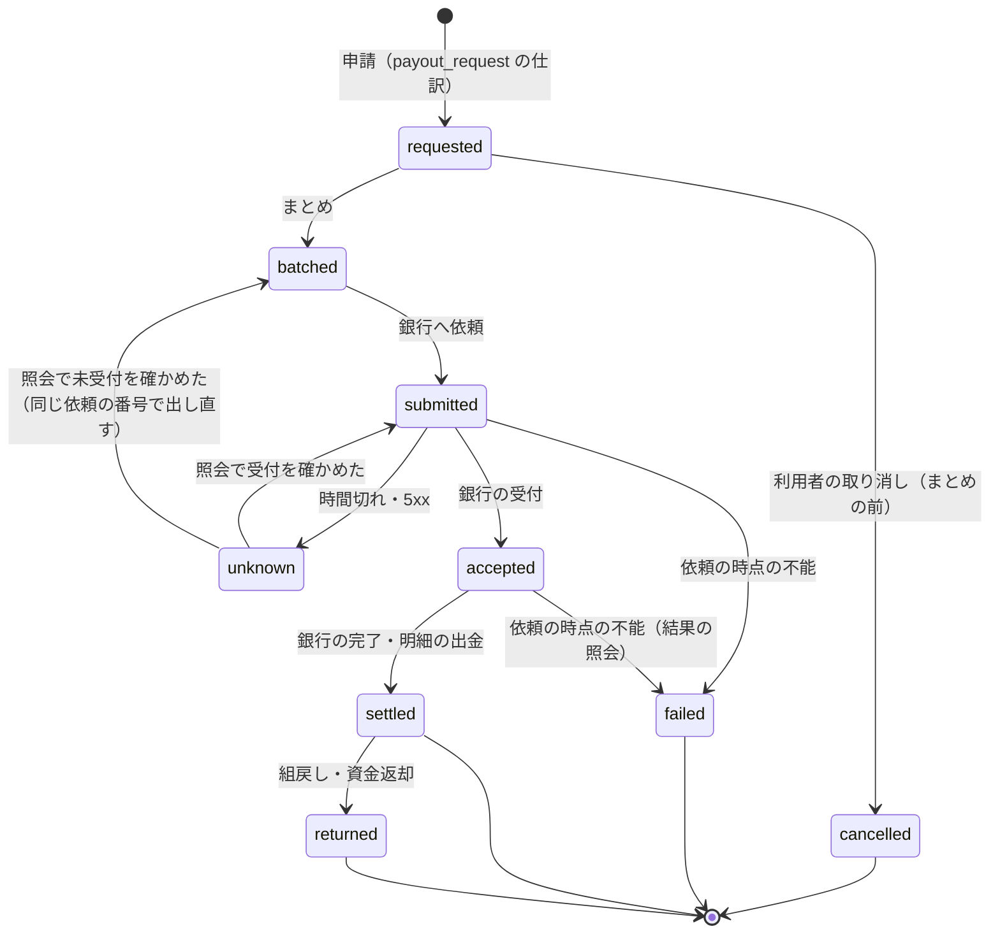
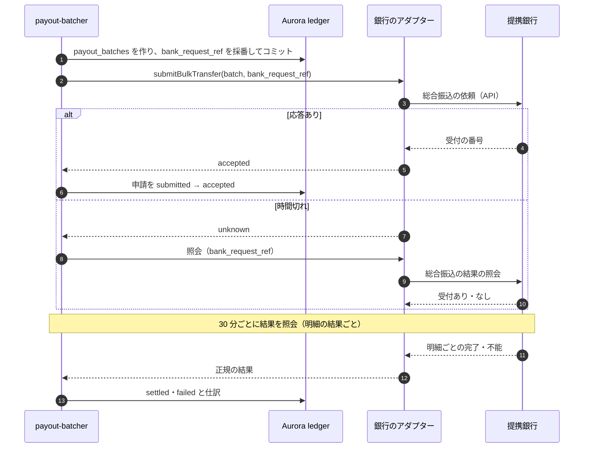

# Payouts and Points: Mercari

売上金・残高を利用者の銀行口座へ振り込むことと、ポイントを決める。口座の登録と確かめ、振込の申請・まとめ・実行（提携銀行の API と全銀の形式のファイル）、振込の失敗と組戻し、振込の上限（法務の確認待ち L2）、ポイントの付与・使用・期限（法務の確認待ち L1・L4）、売上金・ポイントでの購入の順と引き当てを扱う。

前提となる決定は次のとおり。

- 振込は提携銀行の API で行い、予備に全銀の形式のファイルを持つ。振込の手数料は 1 回 200 円（本家に寄せた既定値）（[architecture/README.md](README.md) の 6 節）
- 売上金・残高・ポイントは別の口座の種類で、法的な値は `legal.*`（[ADR-0004](../decisions/0004-proceeds-model-under-payment-services-act.md)）
- 仕訳の型、売上金のロット、照合は [ledger-and-proceeds.md](ledger-and-proceeds.md)（[ADR-0034](../decisions/0034-chart-of-accounts-journal-types-and-fee-rounding.md)、[ADR-0035](../decisions/0035-proceeds-lots-expiry-and-kyc-conversion.md)、[ADR-0036](../decisions/0036-three-tier-reconciliation-and-suspense.md)）
- 購入は `purchaseListing` だけが取引を作る（[ADR-0002](../decisions/0002-transaction-state-machine-and-single-purchase.md)、[transactions-and-state-machine.md](transactions-and-state-machine.md)）
- Stripe の題材の振込の実行（[payouts-and-reconciliation.md](../../../stripe/docs/architecture/payouts-and-reconciliation.md)、[Stripe の ADR-0018](../../../stripe/docs/decisions/0018-payout-execution-via-banking-partner.md)）の考え方を参照し、C2C の売上金に合わせて自前で書く

この文書で決めたことは次の ADR にある。

| ADR | 決定 |
| --- | --- |
| [0038](../decisions/0038-payout-batching-execution-and-failure-handling.md) | 振込は 1 人 1 件ずつ申請し、銀行の営業日の 08:30〜14:30 に 30 分ごとにまとめて、提携銀行の総合振込の API で依頼する。API が 30 分使えなければ全銀の形式のファイルに切り替える。依頼の番号を先に保存し、結果が不明なら再依頼せず照会する。依頼の時点の不能は手数料ごと戻し、完了の後の組戻しは振り込んだ額を戻す |
| [0039](../decisions/0039-points-as-separate-lot-accounts.md) | ポイントは、付与ごとのロットの口座（`points:<user>:<lot>`）で売上金と分けて持つ。MVP は本システムが付けるポイントだけで、買えず、振り込めず、譲れない。期限はロットごとに持つが、失効は `legal.points_expiry_enabled` の後だけ書く。返金はもとのロットへ戻し、残りの期限が 30 日に満たなければ 30 日に延ばす |
| [0040](../decisions/0040-balance-spend-order-and-reservation.md) | 購入での使用の順は、ポイント（期限の近い順）→ 売上金（ロットの期限の近い順）・残高 → カード・コンビニ払いに固定する。引き当ては購入の先着の印を取った試行だけが、取引の作成の前に行う。残高の hold は `(transaction, id, hold_balance)` で、カードの hold と分ける |

## 1. 範囲

- 扱う：
  - 振込先の口座の登録、確かめ、変更、使えない状態
  - 振込の申請、手数料、最低額、1 人の同時の申請、上限（法務の確認待ち L2）
  - まとめ（バッチ）、提携銀行の API、全銀の形式のファイル、依頼の番号、結果の照会
  - 振込の失敗、組戻し・資金返却、口座の更新の依頼
  - 払出口座の資金の確かめ、銀行の営業日
  - 売上金の期限の後の自動の振込の受け口（期限の処理そのものは [ledger-and-proceeds.md](ledger-and-proceeds.md) の 6 節）
  - ポイントの付与（キャンペーン、補償）、使用、期限、返金（法務の確認待ち L1・L4）
  - 売上金・残高・ポイントでの購入の順と引き当て
- 扱わない：
  - 仕訳の型の定義と照合（[ledger-and-proceeds.md](ledger-and-proceeds.md)）
  - 振込の不正の規則（乗っ取りの後の振込の止め方）の判定（trust-and-safety の領域）。ここでは規則が使う入力と、止める仕組みを決める
  - 本人確認の水準の決め方（identity-verification の領域）
  - キャンペーンの企画と通知の文言（notifications の領域、法務の確認待ち L4）

## 2. 要件

| 要件 | 目標 | NFR |
| --- | --- | --- |
| 依頼までの速さ | 振込の申請の受け付けから提携銀行への依頼まで、銀行の営業時間の中で 1 時間以内（着金の日は銀行の値） | NFR-006 |
| 二重の振込なし | 1 つの振込の申請から、銀行への依頼が成功するのは 1 回 | NFR-004 |
| お金が合う | 振込の仕訳と銀行の結果・明細が 1 対 1。説明のつかない差を 3 営業日で 0 円 | NFR-004 |
| 残高 | 売上金・残高・ポイント・引き当ては負にならない。保留中の売上金は振り込めない | ADR-0003 |
| 法的な値 | 振込の上限、本人確認の段、ポイントの期限は `legal.*`。法務の結論まで本番の値を有効にしない | ADR-0004 |
| 可用性 | 残高と明細、振込の申請 月間 99.95%。銀行の障害の間も申請は受け付ける | NFR-006、NFR-007 |

## 3. 本家の形（確かめたこと）

- 振込の申請の手数料は 200 円。売上金の振込の申請の期限は 180 日で、期限の後は登録した口座に自動で振り込む（1 回 200 円、2 回まで）。口座がないか 200 円以下なら失効する（[ヘルプの記事 96](https://help.jp.mercari.com/guide/articles/96/)、2026-10-10 に確認）。
- 振込の最低額、着金までの日数、申請の回数の上限、ポイントの名前と期限の規則は、公式の資料で確かめられなかった（**未検証**）。本システムの値を使う。
- 全銀の総合振込のファイルの形（120 バイトの固定長、ヘッダー・データ・トレーラ・エンドの 4 種類のレコード、EDI 情報 20 文字）は、Stripe の題材の [payouts-and-reconciliation.md](../../../stripe/docs/architecture/payouts-and-reconciliation.md) の 4.1 節が銀行の仕様書で確かめた内容（2026-09-27 に確認）を使う。提携銀行の仕様書で選定の時に確かめ直す。

## 4. 振込先の口座

### 4.1 登録

| 項目 | 形 | 確かめ |
| --- | --- | --- |
| 金融機関コード | 4 桁 | 全銀の金融機関の一覧（取り込んだ表）にある |
| 支店コード | 3 桁 | 同上 |
| 預金種目 | 普通・当座・貯蓄 | — |
| 口座番号 | 7 桁（ゆうちょ銀行は記号・番号を振込用の店番・口座番号に直す） | 桁数 |
| 口座名義（カナ） | 全銀の使用文字（半角カナ・英数・一部の記号）、30 文字まで | 本人確認の済んだ利用者は、本人確認の氏名（カナ）と一致すること |

- 口座の番号と名義は、ledger の `bank_accounts` の表に封筒の暗号化の列で置く。鍵は利用者ごとの口座の金庫の鍵（ledger の `vault_keys`、`kms-vault-bank` で包む）で、復号は `payouts` のサービスの役割だけが、振込の依頼の時に行う（[security.md](security.md) の 5 節、[ADR-0069](../decisions/0069-key-layout-and-vault-envelope-encryption.md)）。行は本人の FORCE RLS。画面には下 4 桁と金融機関の名前だけを出す。同じ口座の多くのアカウントの検出には `bank_account_hmac` を使う。運用者が全桁を見るのは `vault.reveal_bank`（2 人目の承認）だけ（[ADR-0070](../decisions/0070-operator-access-vault-reveal-and-audit.md)）。
- 提携銀行が口座の名義の照会を API で持つなら、登録の時に照会する（**未検証**。選定で確かめる）。持たなければ、最初の振込の結果（名義の不一致の不能）で確かめる。
- 1 人の口座は 1 つ（MVP）。変更は新しい口座の登録で、古い口座を `replaced` にする。

### 4.2 変更の後の待ち

- 口座の登録・変更と振込の申請は「大事な操作」で、直近 10 分の強い確認を求める。新しい端末での SMS のログイン、回復、電話番号・メール・口座の変更から 72 時間は、振込の申請を受け付けても実行しない（accounts-and-devices の領域の [ADR-0067](../decisions/0067-account-takeover-step-up-and-payout-holds.md)）。
- `identity` が `account_holds` を書き、`payouts` はまとめの前に `payoutHoldUntil(user)` を読む。待ちの終わりの前の申請は `requested` のまま次のまとめに回す。
- この待ちは本人の操作に結び付く決まった待ちで、T&S・運用の判断で止める `payout_blocks`（10 節）とは別に持つ。

### 4.3 使えない状態

- 振込の不能の理由が `account_closed`・`no_account`・`invalid_account_number`・`name_mismatch`・`invalid_account_type` なら、口座を `unusable` にし、利用者に更新を求める。期限の後の自動の振込も、この口座には出さない。

## 5. 振込の申請

### 5.1 規則

| 規則 | 値 | 根拠 |
| --- | --- | --- |
| 振込の手数料 | 1 回 200 円（手数料の表のバージョン） | 本家に寄せる |
| 最低の申請額 | 201 円（振り込む額が 1 円以上） | 本システムの値 |
| 1 人の同時の申請 | 1 件（前の申請が `settled`・`failed` になるまで次を受けない） | 本システムの値 |
| 申請の取り消し | まとめの前（`requested`）だけ | — |
| 振り込める額 | `seller_proceeds` ＋ `user_balance` の残高。保留中（`seller_proceeds_held`）と引き当て中は除く | ADR-0003 |
| 止める条件（申請は受け付けて実行を待つ） | `payoutHoldUntil(user)` の待ち、`chargeback_receivable` の残りがある、`payout_blocks` がある、`ops.payouts_enabled` が偽 | 4.2 節、10 節、ADR-0032、ADR-0067 |
| 申請を受け付けない条件 | 口座がない・`unusable`、残高が足りない、強い確認がない | 4 節 |
| 1 回・1 か月の上限（本人確認の水準ごと） | `legal.payout_limit_yen.{level}`、`legal.payout_monthly_limit_yen.{level}`（[identity-verification.md](identity-verification.md) の 5 節） | **法務の確認待ち（L2）** |

- 申請の額は、売上金のロット（期限の近い順）→ `user_balance` の順に消す（[ADR-0035](../decisions/0035-proceeds-lots-expiry-and-kyc-conversion.md)）。
- 申請で `payout_request` の仕訳（売上金 −申請の額、振込中 ＋振り込む額、手数料の収益 ＋200）を書く。冪等キーは `(payout, <id>, request)`。

### 5.2 振込の状態

- 状態は条件つきの更新で進め、終わった状態から動かさない。`cancelled` と `failed` は `payout_failed` の仕訳（申請の額を元のロットへ、手数料も戻す）、`returned` は `payout_returned` の仕訳（振り込んだ額だけを戻す）を書く。

## 6. まとめと実行（[ADR-0038](../decisions/0038-payout-batching-execution-and-failure-handling.md)）

### 6.1 まとめ

- `payout-batcher` は、銀行の営業日の 08:30〜14:30 に 30 分ごと（08:30、09:00、…、14:30）に動く。`requested` の申請を、払出口座ごとに 1,000 件ずつまとめ、`payout_batches` を作る（1,000 件は本システムの値。銀行の上限で選定の時に見直す）。
- 14:30 の後と銀行の休業日の申請は、次の営業日の 08:30 にまとめる。銀行の営業日の暦（土日、祝日、12 月 31 日〜1 月 3 日）は `bank_calendar` の表で持ち、年 1 回取り込む。
- まとめの前に、払出口座の残高（銀行の残高の照会）と、その回の振り込む額の合計を比べる。足りなければまとめず page（`payout-failure.md`）。資金の移動は人が行う。

### 6.2 依頼

- 依頼の番号（`bank_request_ref`、20 文字）は、まとめの行に先に保存してから依頼する。再送は同じ番号を使う。
- 申請ごとの参照の番号（`payout_ref`、20 文字：`PO` ＋ 日付 6 桁 ＋ 連番 12 桁）を、総合振込のデータの EDI 情報に載せる。銀行の明細の取り込みで、出金と組戻しをこの番号で突き合わせる（[ledger-and-proceeds.md](ledger-and-proceeds.md) の 9.1 節の E3）。
- **結果が不明なときは再依頼しない**。照会で受付を確かめる。照会でも分からなければ、Ops の確認に回す（二重の振込を防ぐことを優先する）。
- 振込の依頼人の名前は `<Brand>`（全銀の使用文字に変換）。

### 6.3 全銀の形式のファイルへの切り替え

- 提携銀行の API が 30 分続けて使えないとき（5xx・時間切れが 3 回続く）、Ops の承認で、その回からのまとめを全銀の形式の総合振込のファイルに切り替える（自動では切り替えない。二重の依頼を避けるため、API で依頼した可能性のあるまとめは照会で確かめてから）。
- ファイルは 120 バイトの固定長、ヘッダー（種別のコードは総合振込）・データ（金融機関・支店・預金種目・口座番号・名義・金額・EDI 情報）・トレーラ（件数・合計）・エンドのレコード。文字は全銀の使用文字。形は 3 節の確かめの範囲で書き、提携銀行の仕様書で確かめる（**未検証**）。
- ファイルの締めは 1 日 2 回（09:00、13:00）。ファイルは S3 に保存（ハッシュを持つ）し、法人のインターネットバンキングかファイル伝送で渡す。渡した記録（誰が、いつ、どのファイル）を `payout_batches` に持つ。
- ファイルの結果（不能の明細）は銀行の返す結果のファイルか明細で取り込む。

### 6.4 例：1 日の振込

| 時刻（銀行の営業日 10/14） | 事象 | 振込 | 仕訳 |
| --- | --- | --- | --- |
| 09:47 | 売り手 S が 2,490 円を申請 | `requested` | `payout_request`：売上金 2,490 / 振込中 2,290、手数料 200 |
| 09:55 | 売り手 U が 50,000 円を申請 | `requested` | 同じ形（振込中 49,800、手数料 200） |
| 10:00 | まとめ（2 件を含む 312 件）。`bank_request_ref` を保存 | `batched` | — |
| 10:00:40 | API で依頼、受付 | `accepted` | — |
| 10:30 | 結果の照会：S は完了、U は名義の不一致で不能 | S `settled`、U `failed` | S：`payout_settled`（振込中 2,290 / 銀行 2,290）。U：`payout_failed`（振込中 49,800・手数料 200 / 売上金 50,000。元のロットへ） |
| 10:31 | U の口座を `unusable` にし、更新を求める | — | — |
| 14:40 | 売り手 V が申請 | `requested` | — |
| 10/15 08:30 | V をまとめる | `batched` | — |
| 10/15 06:00 | 10/14 の銀行の明細を取り込み、S の出金を `payout_ref` で突き合わせる | — | 第 3 段の照合（E3） |

- S の申請（09:47）から依頼（10:00:40）まで 14 分。V（14:40）は営業時間の外なので、次の営業日の 08:30 に依頼する。NFR-006 の「営業日の 1 時間以内」は、銀行の営業時間（08:30〜14:30）の中で数える。

### 6.5 組戻し・資金返却

- 完了の後に、受け取る銀行が資金を返すことがある（口座の解約の後の着金など）。銀行の明細の入金を `payout_ref` で見つけ、`returned` にし、`payout_returned`（銀行 ＋返った額 / 元の口座）を書く。手数料は戻さない（振込は行われた）。
- 返った額が振り込んだ額と違えば（銀行の手数料が引かれたなど）、差は外れ（`recon_breaks`）にし、財務が決める。

## 7. 売上金・残高・ポイントでの購入（[ADR-0040](../decisions/0040-balance-spend-order-and-reservation.md)）

### 7.1 使用の順

1. ポイント（ロットの期限の近い順、期限なしは最後）
2. 売上金（ロットの期限の近い順）、続いて `user_balance`（`legal.proceeds_spendable`・`legal.balance_enabled` のときだけ）
3. 残りをカードかコンビニ払い

- 利用者は「ポイントを使う」「売上金を使う」をそれぞれ外せる。順は変えられない。
- 本番の既定では `legal.proceeds_spendable` が偽で、2 は使えない（法務の確認待ち L1）。ポイント（本システムが付けたもの）は使える。

### 7.2 引き当ての流れ

- `purchaseListing` で先着の印を取った試行だけが、DB の前に `reserve`（冪等キー `(purchase_attempt, <id>, reserve)`）を `ledger` に同期で依頼する（[transactions-and-state-machine.md](transactions-and-state-machine.md) の 5.1 節）。足りなければ 402。
- 購入が失敗（0 行、409）したら、`reserve_release` で戻す。応答を失った場合は、取引に結び付かない引き当てを照合（T5）が 15 分で戻す。
- 取引の作成（コミット）の後、`ledger` が `transaction.created` を受け、`hold_balance`（`balance_reserved` → `escrow`、冪等キー `(transaction, <id>, hold_balance)`）を書く。
- 新しい端末の最初の 24 時間の、売上金・残高・ポイントでの 1 万円以上の購入は、強い確認を求める（[ADR-0067](../decisions/0067-account-takeover-step-up-and-payout-holds.md)）。確認は `purchaseListing` の前に app-api が求め、購入の経路は増やさない。
- 全額が残高で賄えるとき、`purchaseListing` は取引を `created` で挿入し、同じトランザクションで `payment_succeeded`（手段 `balance`）の事象を通して `paid` にする。カードの分があるときは、カードの確定（`hold_psp`）を待って `paid`。

### 7.3 例：価格 5,000 円、ポイント 800、売上金 3,000、残りをカード

| 段 | 仕訳 | 額 |
| --- | --- | --- |
| 引き当て | `reserve`：ポイントのロット L1（期限 11/30）500、L2（期限なし）300、売上金のロット A 3,000 / `balance_reserved` 3,800 | 3,800 |
| 取引の作成 | `hold_balance`：`balance_reserved` 3,800 / `escrow:T2` 3,800 | 3,800 |
| カードの確定 | `hold_psp`：`psp_receivable` 1,200 / `escrow:T2` 1,200 | 1,200 |
| （取り消しの場合）refund | `escrow:T2` 5,000 / `psp_receivable` 1,200、`balance_reserved` 3,800。続けて `reserve_release`：`balance_reserved` 3,800 / L1 500、L2 300、A 3,000 | 5,000 |

- 取り消しで戻るポイントは元のロットへ戻す。L1 の期限（11/30）が戻しの時点で 30 日に満たなければ、戻しの時から 30 日に延ばす（8.3 節）。売上金はロット A の期限のまま戻す（[ADR-0035](../decisions/0035-proceeds-lots-expiry-and-kyc-conversion.md)）。

## 8. ポイント（[ADR-0039](../decisions/0039-points-as-separate-lot-accounts.md)）

### 8.1 形

- 名前は `<Brand>ポイント`（リポジトリ共通の [ADR-0006](../../../../docs/decisions/0006-brand-neutral-identifiers.md)）。1 ポイント = 1 円として購入に使える。
- ポイントは付与ごとのロットの口座 `points:<user>:<lot>`（[ADR-0003](../decisions/0003-escrow-and-double-entry-ledger.md)）。ロットは、付与の理由（キャンペーン、補償）、期限、元の仕訳を持つ。
- MVP で付けるのは本システムだけ（キャンペーン、補償）。売上金からポイントへの交換（`legal.proceeds_to_points_enabled`）と、ポイントの購入は作らない（法務の確認待ち L1）。
- ポイントは振り込めず、他の利用者に譲れない。

### 8.2 付与

| 理由 | 仕訳 | 承認 |
| --- | --- | --- |
| キャンペーン | `points_grant`：`promotion_expense` / `points:<user>:<lot>`（冪等キー `(campaign_grant, <id>, grant)`） | キャンペーンの予算と付与の規則を PM・財務が承認。上限（総付け・懸賞）は法務の確認待ち（L4） |
| 補償 | `compensation`：`compensation_expense` / `points:<user>:<lot>` | 運用の介入の承認の規則（[disputes-and-customer-support.md](disputes-and-customer-support.md) の 7 節） |

- キャンペーンの付与は、1 キャンペーン・1 利用者に 1 回（冪等キー）。大量の付与は 1,000 件ずつのジョブにし、予算の残りを超えたら止める。

### 8.3 期限

- ロットは期限（キャンペーンの規則。既定 180 日。本システムの値）を持つ。失効（`points_expire`：ロット / `points_breakage`）は `legal.points_expiry_enabled` が真のときだけ、毎日 00:20 に書く。本番の既定は偽で、その間は画面に期限を出さない（法務の確認待ち L1・L4）。
- 返金で戻ったポイントは元のロットへ戻す。戻しの時点でロットの残りの期限が 30 日に満たなければ、期限を戻しの時から 30 日に延ばす（本システムの値。本家は**未検証**）。ロットの期限はロットの属性で、仕訳は変えない。
- 未使用のポイントの合計は、日次の集計（`customer_funds_daily`）に入れる。前払式支払手段に当たる場合の保全と届出は法務の確認待ち（L1）。

## 9. 期限の後の自動の振込の受け口

- [ledger-and-proceeds.md](ledger-and-proceeds.md) の 6.3 節の `auto_payout` は、5.1 節の申請と同じ関数で、理由 `expiry_auto_payout` の申請を作る。1 人の同時の申請の規則（1 件）は守り、進行中の申請があれば次の日に回す。
- 4.2 節の待ちと、`payout_blocks` は自動の振込にも効く。止められた自動の振込は、扱いの回数を数えない。

## 10. 振込の止め方

| 止める仕組み | 誰が | 効く範囲 |
| --- | --- | --- |
| `ops.payouts_enabled` | Ops | 全体のまとめを止める（申請は受け付ける） |
| `payout_blocks`（利用者ごと、理由、期限） | T&S の規則・運用者 | その利用者の申請とまとめを止める |
| 口座・電話番号・メールの変更、新しい端末の SMS のログイン、回復の後の待ち | `identity`（`payoutHoldUntil`。ADR-0067） | 72 時間 |
| `chargeback_receivable` の残り | 自動 | 残りが 0 になるまで |
| 台帳の不変条件の違反 | 自動（第 2 段の照合） | 全体（[runbooks/](../runbooks/README.md) の `ledger-invariant-breach.md`） |

- 止まった申請は `requested` のまま待ち、7 日を超えたら利用者に通知し、取り消すか待つかを選べるようにする。

## 11. 障害のときの振る舞い

| 障害 | 影響 | 振る舞い |
| --- | --- | --- |
| 銀行の API の時間切れ | 受付が不明 | 再依頼しない。照会。分からなければ Ops |
| 銀行の API の長い停止 | 依頼できない | 30 分で Ops が全銀の形式のファイルに切り替える（6.3 節）。申請は受け付け続ける |
| 払出口座の残高の不足 | 依頼できない | まとめずに page。人が資金を移す |
| 結果の照会の遅れ | `accepted` が長い | 30 分ごとに照会。2 営業日を超えたらチケット |
| 銀行の明細の取り込みの遅れ | 照合の遅れ | 第 3 段の照合が 2 営業日の猶予の後にチケット |
| ledger の停止 | 申請・仕訳が書けない | 申請の API は 503（残高を確かめられないので受けない） |

## 12. 上限

| 対象 | 値 |
| --- | --- |
| 振込の手数料 | 200 円 |
| 最低の申請額 | 201 円 |
| 1 人の同時の申請 | 1 件 |
| まとめの時刻 | 銀行の営業日の 08:30〜14:30、30 分ごと |
| 1 回のまとめ | 1,000 件（銀行の上限で見直す） |
| ファイルの締め | 09:00、13:00 |
| 口座の変更などの後の待ち | 72 時間（ADR-0067） |
| 1 回の上限、本人確認の要る額 | `legal.payout_*`（法務の確認待ち L2） |
| ポイントの既定の期限 | 180 日（失効は `legal.points_expiry_enabled` の後） |
| 返金で戻ったポイントの最短の期限 | 30 日 |
| キャンペーンの付与のジョブ | 1,000 件ずつ |

## 13. data-model への項目

| 表・置き場 | 中身 | 主キー・索引 | 節 |
| --- | --- | --- | --- |
| `bank_accounts`（ledger、本人の RLS） | 金融機関・支店のコード、預金種目、口座番号と名義（封筒の暗号化）、下 4 桁、`bank_account_hmac`、状態（`active`・`unusable`・`replaced`）、登録の時刻 | `(owner_id, id)`、部分一意 `(owner_id) WHERE status = 'active'` | 4 |
| `bank_master`（ledger、設定） | 金融機関・支店のコードと名前 | `(bank_code, branch_code)` | 4.1 |
| `bank_calendar`（ledger、設定） | 銀行の営業日 | `day` | 6.1 |
| `payouts`（ledger、本人の RLS） | 利用者、口座、申請の額、振り込む額、手数料、状態、理由（`user`・`expiry_auto_payout`）、`payout_ref`、まとめ、不能の理由のコード | `id`、一意 `payout_ref`、部分一意 `(owner_id) WHERE status IN ('requested','batched','submitted','unknown','accepted')` | 5、6 |
| `payout_batches`（ledger） | 払出口座、手段（API・ファイル）、`bank_request_ref`、件数、合計、状態、ファイルの S3 の参照と渡した記録 | `id`、一意 `bank_request_ref` | 6 |
| `payout_blocks`（ledger） | 利用者、理由のコード、出した人（規則・運用者）、期限 | `(owner_id, id)` | 10 |
| `points_lots`（ledger、本人の RLS） | 口座、付与の理由、キャンペーン・案件、付与の額、期限、元の仕訳 | `(owner_id, lot_id)`、`(expires_at)` | 8 |
| `point_campaigns`（ledger） | 予算、付与の規則、期限、承認の記録 | `id` | 8.2 |
| `point_campaign_grants`（ledger） | キャンペーン、利用者、額、ロット（冪等キー `(campaign_grant, <id>, grant)` の元。[data-model.md](data-model.md) の D-14） | `id`、一意 `(campaign_id, user_id)` | 8.2 |
| `balance_reservations`（ledger） | 購入の試行、引き当てた口座と額（ロットごと）、状態 | `purchase_attempt_id` | 7.2 |
| S3 | `payouts/zengin/<yyyy>/<mm>/<dd>/<batch_id>.txt`（ファイル、ハッシュ） | — | 6.3 |
| outbox の事象 | `payout.requested`、`payout.settled`、`payout.failed`、`payout.returned`、`points.granted`、`points.expiring` | — | 5、6、8 |

## 14. テスト

- **PROP-PAYOUT-001（二重の振込なし）**：任意の銀行の応答（時間切れ、5xx、重複の結果、遅れ）で、1 つの申請の銀行への依頼の成功は 1 回。不明のときに再依頼しない（銀行の模型）。
- **PROP-PAYOUT-002（仕訳と状態の一致）**：振込の状態ごとの仕訳の和が、申請の額・振り込んだ額・手数料と一致する。`failed` は手数料ごと戻し、`returned` は振り込んだ額だけ戻す。
- **PROP-PAYOUT-003（止める条件）**：保留中、`chargeback_receivable` の残り、`payout_blocks`、`payoutHoldUntil(user)` の待ちの間に、振込の依頼が出ない。
- **PROP-PAYOUT-004（使用の順）**：任意の残高の組み合わせで、購入の引き当ては 7.1 節の順で、ロットの期限の近い順に消す。
- **PROP-PAYOUT-005（ポイント）**：ポイントは振り込めない。戻しは元のロットへ戻り、期限は短くならない。無効の間に `points_expire` が書かれない。
- **表駆動**：5.1 節の規則、4.3 節の不能の理由、まとめの時刻と銀行の営業日。
- **試験のベクトル**：全銀の形式のファイルのレコード（文字の変換、桁、合計）。
- **結合**：6.4 節の 1 日を銀行の模型で回し、第 3 段の照合（E3）まで一致する。

## 15. Story の候補

| Epic | Story | 中身 |
| --- | --- | --- |
| E10 | `bank-partner-selection` | API（総合振込、結果の照会、名義の照会）、全銀の形式、明細、上限、締め |
| E10 | `bank-accounts` | 4 節 |
| E10 | `payouts` | 5・6 節（ADR-0038。PROP-PAYOUT-001〜003）。上限は法務：L2 |
| E10 | `points` | 8 節（ADR-0039。PROP-PAYOUT-005）。法務：L1・L4 |
| E10 | `pay-with-balance` | 7 節（ADR-0040。PROP-PAYOUT-004）。売上金の使用は法務：L1 |
| E10 | `zengin-file-fallback`（新しい Story の提案） | 6.3 節 |

## 16. 未解決の問い

### 決定

2026-10-10 の既定案。

- **まとめと実行**：営業日の 08:30〜14:30 に 30 分ごと、API を主、ファイルを予備（Ops の承認で切り替え）（ADR-0038）。
- **失敗**：依頼の時点の不能は手数料ごと戻す。組戻しは振り込んだ額だけ戻す（ADR-0038）。
- **最低額と同時の申請**：201 円、1 件。
- **口座の変更などの後の待ち**：72 時間（accounts-and-devices の領域の ADR-0067 に従う）。
- **ポイント**：ロットの口座、本システムの付与だけ、返金の後の最短 30 日（ADR-0039）。
- **使用の順**：ポイント → 売上金・残高 → カード・コンビニ払い（ADR-0040）。

### 持ち越し

| 問い | いつ・どう決めるか |
| --- | --- |
| 提携銀行、API の上限、締め、名義の照会、不能の理由のコード | E10 の `bank-partner-selection` |
| 振込の上限と本人確認の段 | 法務の確認待ち（L2） |
| 売上金での購入、ポイントへの交換、ポイントの期限と保全 | 法務の確認待ち（L1）。キャンペーンの上限は L4 |
| 振込の手数料の消費税と請求書 | 法務の確認待ち（L8） |
| 本家の振込の最低額、着金の日、ポイントの規則 | 公式の資料で確かめられなかった（**未検証**） |
