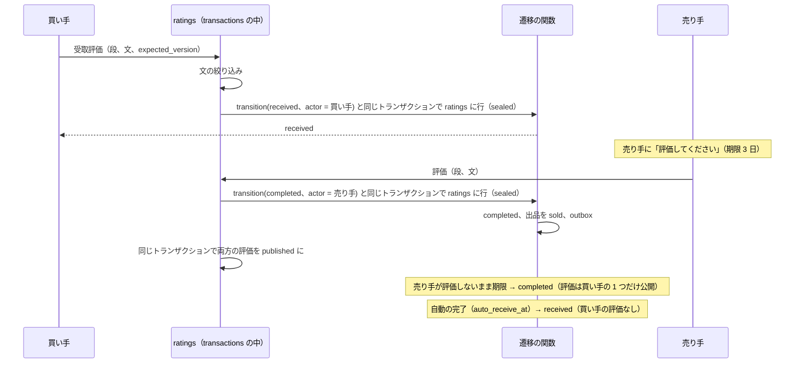

# Ratings and reputation: Mercari

相互の評価と信用。取引ごとの買い手と売り手の評価、評価の期限と取引の完了との結び付き、評価の公開の時、評価の集計と表示、内部の信用の点と段、自作自演・評価の操作の検出と扱い、評価の表示の規則の枠組み（法務の L4）を決める。

前提となる決定は次のとおり。

- 取引は `shipped`・`delivered` → `received`（買い手の受取評価か、自動の完了の期限）→ `completed`（売り手の評価か、評価の期限）と進む。売り手の評価の期限は受取評価から 3 日（72 時間。本システムの値）。遷移は 1 つの遷移の関数と決定表 DT-TXN-001 で行う（[ADR-0002](../decisions/0002-transaction-state-machine-and-single-purchase.md)）
- 評価の集計は公開のデータ。評価の前の状態は取引の 2 者だけのデータ（[ADR-0007](../decisions/0007-single-tenant-and-party-visibility.md)）
- 分類器・規則の信号は信号だけで、評価を集計から外すことは措置として人の審査を通し、`moderation_actions` に書いてから効かせる（[ADR-0009](../decisions/0009-trust-and-safety-pipeline-boundary.md)）

この文書で決めたことは次の ADR にある。

| ADR | 決定 |
| --- | --- |
| [0049](../decisions/0049-mutual-ratings-sealed-until-completion.md) | 評価は取引ごとに買い手から売り手へ 1 つ、売り手から買い手へ 1 つ。値は `good`・`normal`・`bad` と 150 文字までの文。買い手の評価は受取評価の操作と同時に必ず付ける。自動の完了では買い手の評価を付けない（既定の評価を作らない）。どちらの評価も取引が `completed` になるまで相手と他の人に見せず、完了で同時に公開する。出した評価は直せない |
| [0050](../decisions/0050-reputation-score-and-manipulation-review.md) | 表示は、措置で外したものを除く評価の数（良い・普通・残念）と本人確認の印だけ。内部の信用の点は、同じ相手の 30 日の重複を 1 つにし、新しいアカウントからの評価を半分に数えた上で、事前の分布（良い 95% を 10 件分）で平らにした良い率。点から 4 つの段（`new`・`standard`・`trusted`・`low`）を作り、順位の式と規則に使う。自作自演の兆し（同じ端末・支払いの手段・住所の一致、往復の取引、最低の価格の繰り返し、急な増え）は規則が審査の案件にし、集計から外すのは人の措置だけ |

## 1. 範囲

- 扱う：評価の項目と上限、評価の受け付けと取引の遷移の呼び出し、評価の公開の時、評価の文の絞り込み、評価の集計、表示、内部の信用の点と段、操作の兆しと審査への受け渡し、評価の除外の措置の効き方、表示の規則の枠組み。
- 扱わない：
  - 取引の状態・期限・自動の完了の時刻（`transactions-and-state-machine.md`）。この文書は評価の操作が遷移の関数に渡す事象を決める。
  - 審査の待ち行列と措置の記録（[trust-and-safety.md](trust-and-safety.md)）。
  - 本人確認の印の中身（[identity-verification.md](identity-verification.md)）。

## 2. 事実（確かめたこと）

| 項目 | 事実 | この設計 |
| --- | --- | --- |
| 本家の評価の段 | 取引ごとの相互の評価（良い・普通・残念）は [intent.md](../intent.md) の MVP の範囲 | 3 段 |
| 本家の評価の公開の時、自動の完了の時の評価、評価の直し | 公式の資料で確かめられなかった（**未検証**） | 完了で同時に公開、自動では付けない、直せない（本システムの値） |
| 本家の売り手の評価の期限 | 公式の資料で確かめられなかった（**未検証**。ADR-0002） | 受取評価から 3 日 |

2026-10-10 に確認。

## 3. 要件

| 要件 | 値 | 出どころ |
| --- | --- | --- |
| 操作の速さ | 受取評価・評価の送信 p99 500ms | NFR-002 |
| 期限 | 売り手の評価の期限が時刻から 1 分以内に働く（`completed`）。紛争の間は止まる | NFR-012 |
| 完了と評価の結び付き | `completed` の取引は必ず受取評価（買い手か期限）を経ている | [quality.md](../quality.md) の 2.2.1 節 C |
| 決定表 | 評価の受け付けの決定表が緑 | E13 の合否（[quality.md](../quality.md) の 5 節） |
| 措置の記録 | 評価を集計から外すのは、`moderation_actions` の行があるときだけ | ADR-0009 |

## 4. 評価（ADR-0049）

### 4.1 項目

| 項目 | 値 |
| --- | --- |
| 段 | `good`・`normal`・`bad` |
| 文 | 0〜150 文字（`bad` のときは 10 文字以上を求める） |
| 向き | `buyer_to_seller`・`seller_to_buyer` |
| 1 取引 | 向きごとに 1 つ（一意 `(transaction_id, direction)`） |

- 文は送る時に悪用の絞り込み（[messaging-and-comments.md](messaging-and-comments.md) の 5 節、コメントと同じ規則）を通す。評価の文は公開のデータなので、連絡先・住所は `block`。

### 4.2 取引との結び付き

- 評価の行は、遷移の関数を呼ぶ同じ core のトランザクションで書く（評価だけ書けて遷移しない、を作らない）。評価の受け付けは `transactions` のサービスの中の関数で、遷移の決定表 DT-TXN-001（`transactions-and-state-machine.md` の 6.2 節の `buyer_receipt`・`seller_rating` の行）を通る。
- 自動の完了（`auto_receive_at`、主体 `system`）では、買い手の評価の行を作らない。買い手は完了の後に評価できない（評価は受取評価の操作と同じもの）。
- 売り手の評価の期限で `completed` になったときは、売り手の評価の行を作らない。

### 4.3 公開の時

- 評価の行は `sealed` で作り、取引が `completed` になった同じトランザクションで、その取引の評価をすべて `published` にする。
- `sealed` の間は、相手にも他の人にも見せない。書いた本人は自分の評価を見られる。
- 理由：先に出た評価を見て仕返しの評価を付けることを減らす。売り手は買い手の評価を見ずに評価する。
- 評価の行ができるのは `received` の後で、`received` からは紛争にならない（`transactions-and-state-machine.md` の 6.2 節）。運用の判断で `completed` の前に取引を取り消す例外が起きたら、その取引の評価は `voided` にし、公開しない。

### 4.4 直しと消し

- 出した評価は利用者が直せない・消せない。
- 外せるのは措置の `rating_exclude`（人の判定。[trust-and-safety.md](trust-and-safety.md) の 9 節）だけ。外した評価は集計と公開の一覧から消え、書いた人と受けた人には「運営により非表示」と出す。

**決定表 DT-RAT-001（評価の受け付け、草案）**：上から順に評価する。

| # | 取引の状態 | 主体 | 条件 | 結果 |
| --- | --- | --- | --- | --- |
| 1 | `completed`・`cancelled`・`payment_expired` | どれでも | - | 拒む（409 `transaction_closed`） |
| 2 | どれでも | 2 者以外 | - | 拒む（403。RLS で行が見えない） |
| 3 | `disputed` | どれでも | - | 拒む（409 `in_dispute`） |
| 4 | `shipped`・`delivered` | 買い手 | 文の絞り込みが `allow`・`warn`（確認の後） | 評価（sealed）と `received` |
| 5 | `shipped`・`delivered` | 売り手 | - | 拒む（409 `buyer_first`） |
| 6 | `received` | 売り手 | 文の絞り込みが `allow` | 評価（sealed）と `completed`、両方を `published` |
| 7 | `received` | 買い手 | - | 拒む（409 `already_rated`） |
| 8 | `paid`・`created`・`cancel_requested` | どれでも | - | 拒む（409 `not_yet`） |
| 9 | どれでも | どれでも | 文の絞り込みが `block` | 拒む（422 と理由の種類） |

## 5. 集計と表示（ADR-0050）

### 5.1 表示

- 公開のプロフィールに、`published` で外されていない評価の数を、`good`・`normal`・`bad` ごとに出す（全期間）。
- 最近の評価の一覧（文つき、新しい順、1 ページ 20 件）。評価した相手は、退会していれば「退会した利用者」。
- 本人確認の印（[identity-verification.md](identity-verification.md) の 4 節の水準が `verified_document` か `verified_ic`）。
- 内部の信用の点と段は出さない（5.2 節）。
- 表示の規則（数の出し方、事業者による評価の操作の扱い、ステルスマーケティングの規制との関係）は法務の確認待ち（L4）。出し方を変える余地を残すため、表示の API は数と印だけを返し、文言はアプリの設定に置く。

### 5.2 内部の信用の点

売り手としての評価（`buyer_to_seller`）と、買い手としての評価（`seller_to_buyer`）を別に計算する。下は売り手としての点。

1. **数える評価**：`published` で外されていない評価。
2. **同じ相手の重複**：同じ相手からの評価は、30 日の窓の中で最初の 1 つだけを数える。
3. **新しいアカウントの重み**：評価した人が、評価の時に完了した取引 3 件未満なら 0.5、それ以上なら 1.0 で数える。
4. **良さ**：`good` を 1、`normal` を 0.5、`bad` を 0 とする。
5. **平らにした良い率**：R = (Σ 重み × 良さ + α × m) / (Σ 重み + α)。α = 10、m = 0.95。

| 段 | 条件 | 順位の係数（[search-and-discovery.md](search-and-discovery.md) の 5.5 節） |
| --- | --- | --- |
| `new` | 数えた重みの和 < 5 | 0.95 |
| `low` | 重みの和 ≥ 10 かつ R < 0.90 | 0.80 |
| `trusted` | 重みの和 ≥ 50 かつ R ≥ 0.98 | 1.05 |
| `standard` | 上のどれでもない | 1.00 |

- 段の計算は、評価の公開・外しの事象で売り手ごとに直す。段が変わったら `listing.seller_tier_changed` を出し、検索の索引の `seller_tier` を直す（その売り手の `on_sale` の出品を読み直す。1 万件を超える売り手は日次にまとめる）。
- 段は順位の式と T&S の規則の事実として使う。措置の決定に点だけを使わない。

**例：売り手 S**

| 数え方 | good | normal | bad | 重みの和 |
| --- | --- | --- | --- | --- |
| 公開の評価 | 40 | 2 | 1 | - |
| 同じ相手の 30 日の重複を除く（P から 30 日の中に 4 件、Q から 3 件。各 1 つだけ数える） | 35 | 2 | 1 | - |
| 新しいアカウントの評価を 0.5 に（good のうち 6 件が取引 3 件未満の人から） | 29 + 6 × 0.5 = 32 | 2 | 1 | 32 + 2 + 1 = 35 |

- Σ 重み × 良さ = 32 × 1 + 2 × 0.5 + 1 × 0 = 33。
- R = (33 + 10 × 0.95) / (35 + 10) = 42.5 / 45 = 0.944。
- 重みの和 35 ≥ 5、R は 0.90 以上 0.98 未満 → `standard`。表示は「良い 40・普通 2・残念 1」のまま（措置で外したものだけが表示から消える）。
- 重複と新しいアカウントの重みがなければ R = (41 + 9.5) / (43 + 10) = 0.953 で、同じ段。操作の兆しの多い売り手ほど、内部の点と表示の数の差が開く（6.1 節の兆しの 1 つ）。

## 6. 操作の検出

### 6.1 兆し

`trust-safety` の規則のエンジンに、評価の公開の事象と日次の集計から次の信号を渡す（[trust-and-safety.md](trust-and-safety.md) の 6 節）。

| 信号 | 計算 |
| --- | --- |
| `rating_link_device` | 評価した人と受けた人が、直近 90 日に同じ端末の ID を使った（`accounts-and-devices.md` の端末の記録） |
| `rating_link_payment` | 買い手の支払いの手段の指紋（提供者が返す手段の識別子のハッシュ）が、売り手のものと同じ（`payments-and-escrow.md`） |
| `rating_link_address` | 配送先と差出人の住所のハッシュが同じか、同じ建物（`shipping` の住所の金庫の中で比べ、真偽だけを返す。住所を外に出さない。`shipping-integrations.md`） |
| `rating_reciprocal` | A と B が 30 日に 3 回以上、売り手と買い手を入れ替えて取引した |
| `rating_min_price_farm` | 売り手の直近 30 日の完了の取引のうち、価格 300 円の取引が 10 件以上かつ 50% 以上で、相手が 5 人以下 |
| `rating_burst` | 作って 30 日以内のアカウントが受けた評価の数が、1 日で 20 以上 |
| `rating_gap` | 表示の数の R と、5.2 節の内部の R の差が 0.05 以上（重みの和 20 以上） |

### 6.2 扱い

- 規則（例：`rating_link_device` か `rating_link_payment` か `rating_link_address` のどれかが真で、同じ組の評価が 3 件以上）が、`rating_manipulation` の審査の案件を作る（`review`）。規則は評価を外さない（ADR-0009 の自動の措置の範囲は出品の `hold` と完全な一致の `block` まで）。
- 審査員が、外す評価の範囲（組、期間）と、アカウントへの措置（出品の上限、停止）を判定する。措置の種類 `rating_exclude` は、外す評価の ID の一覧を `params` に持つ（[trust-and-safety.md](trust-and-safety.md) の 9 節）。
- 外しは `moderation_actions`（content）に書き、同じトランザクションで outbox を出す。core の評価の適用の消費者が、その事象を受けて core の 1 つのトランザクションで評価の行に `excluded_by_action_id` を書き、集計と段を直す（措置と評価は別のクラスタなので 1 つのトランザクションにできない。`moderation_action_id` で冪等。[data-model.md](data-model.md) の D-20）。
- 価格の提案の標本からは、`rating_min_price_farm` の取引を規則の判定を待たずに除く（提案の計算の入力の選び方で、措置ではない。[categories-brands-and-pricing-suggestions.md](categories-brands-and-pricing-suggestions.md) の 6.1 節）。

## 7. 失敗と回復

| 事象 | 影響 | 扱い |
| --- | --- | --- |
| 評価の送信と期限の競合 | 売り手の評価と期限の処理が同時 | 遷移の関数の行のロックと `expected_version` で一方だけが通る（DT-TXN-001 の 2 行）。負けた評価は 409 で、取引は `completed`。評価は付かない |
| 集計の事象の欠け | 表示の数・段が古い | 日次の照合で売り手ごとに数え直す |
| 段の急な変化で索引の更新が多い | 索引の負荷 | 1 万件を超える売り手は日次の更新にまとめる |
| 誤った外し | 正しい評価が消える | 異議（[trust-and-safety.md](trust-and-safety.md) の 10 節）。取り消しも措置の行で戻す |

## 8. 上限

| 対象 | 値 |
| --- | --- |
| 評価の文 | 150 文字（`bad` は 10 文字以上） |
| 評価の一覧 | 1 ページ 20 件 |
| 同じ相手の重複の窓 | 30 日 |
| 段の再計算 | 事象ごと。大きな売り手の索引の更新は日次 |

## 9. data-model への項目

| 置き場所 | 中身 | 節 |
| --- | --- | --- |
| Aurora core `ratings`（`rating_id`（UUIDv7）、`transaction_id`、`direction`、`rater_id`、`ratee_id`、`grade`、`comment`、`state`（`sealed`・`published`・`voided`）、`rater_completed_trades_at_time`、`excluded_by_action_id`、`created_at`、`published_at`）。一意 `(transaction_id, direction)`。`sealed` の行は 2 者の RLS で、書いた本人だけが読む | 評価 | 4 |
| Aurora core `reputation`（`user_id`、`role`（`seller`・`buyer`）、`good`、`normal`、`bad`、`weighted_sum`、`weighted_good`、`score_r`、`tier`、`updated_at`）。表示の数の列は公開 | 集計と段 | 5 |
| outbox の話題 `rating.published`、`rating.excluded`、`reputation.tier_changed` | 事象 | 5、6 |
| T&S の信号の表（[trust-and-safety.md](trust-and-safety.md) の `ts_signals`）に 6.1 節の信号 | 兆し | 6 |

## 10. テストと性質

| ID | 性質・試験 |
| --- | --- |
| PROP-RAT-001 | 任意の取引の事象と時刻の列で、`completed` の取引は必ず受取評価（買い手か期限）を経ている（[quality.md](../quality.md) の 2.2.1 節 C）。買い手の評価の行がある取引は、主体が買い手の `received` を経ている |
| PROP-RAT-002 | 任意の列で、`sealed` の評価は、取引が `completed` になるまで、相手と第三者のどの読み出しにも出ない |
| PROP-RAT-003 | 1 取引の向きごとの評価は 0 か 1。自動の完了と売り手の期限の完了は評価の行を作らない |
| PROP-RAT-004 | 表示の数は、`published` で `excluded_by_action_id` のない評価の数と一致する。外しは `moderation_actions` の行がある評価だけ |
| PROP-RAT-005 | R は 0〜1 の中。同じ相手の評価を 30 日の中に何件足しても、R は 1 件分しか動かない |
| DT-RAT-001 | 4.4 節の決定表の全行（E13 の合否） |
| 仮想の時計 | 売り手の評価の期限（受取評価から 3 日）で `completed`、紛争の停止と再開 |
| 結合 | 6.1 節の各兆しの合成の場面で、審査の案件ができ、評価は外れない |

## 11. Story の候補

| Epic | Story | 中身 |
| --- | --- | --- |
| E13 | `mutual-ratings` | 評価の受け付け、遷移の呼び出し、公開の時、DT-RAT-001（4 節） |
| E13 | `reputation-summary` | 表示の数、本人確認の印、内部の点と段、索引への受け渡し（5 節）。表示は法務：L4 |
| E13 | `rating-abuse-detection` | 兆しの計算、規則、`rating_exclude` の措置（6 節） |

## 12. 未解決の問い

### 決定（2026-10-10、既定案）

- **段**：3 段と 150 文字の文（ADR-0049）。
- **買い手の評価**：受取評価と同時に必須。自動の完了では付けない。
- **公開の時**：取引の完了で両方を同時に。
- **直し**：利用者は直せない。外しは措置だけ。
- **内部の点と段**：重複の除き、新しいアカウントの重み、α = 10・m = 0.95、4 つの段（ADR-0050）。
- **操作の扱い**：規則は審査の案件を作るだけ。外しは人。

### 持ち越し

| 問い | いつ・どう決めるか |
| --- | --- |
| 評価の表示の規則、事業者による評価の操作の扱い（L4） | 法務の確認待ち。E13 の `reputation-summary` の spec の承認の前 |
| 本家の評価の公開の時・自動の完了の評価の扱いに寄せるか | 本家の振る舞いは**未検証**。公式の資料で確かめられたら PM が決める |
| α・m・段の閾値 | S1 の 3 か月のデータで、段と取引の問題の率（紛争・キャンセル）の関係を見て Dev と QA が見直す |
| 住所の一致の信号（`rating_link_address`）を、住所の金庫の利用目的に含めてよいか | 法務の確認待ち（L5）。結論まで、この信号は無効にする |
